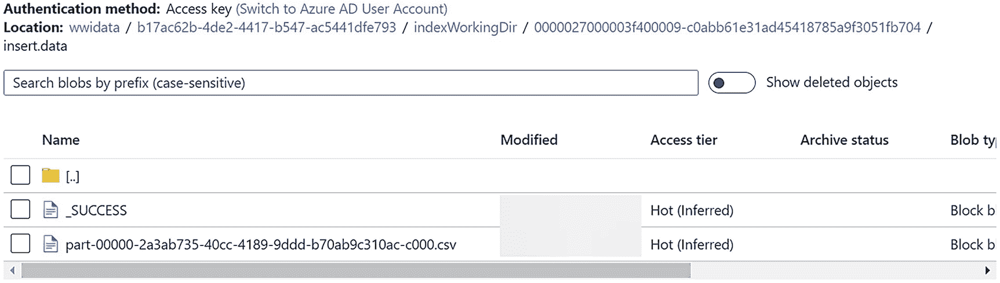
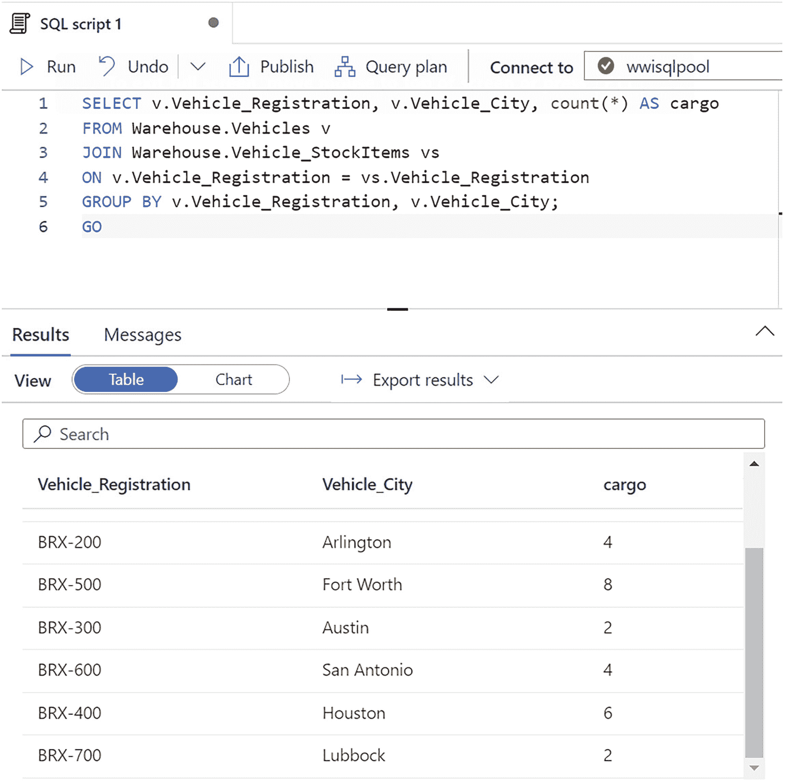
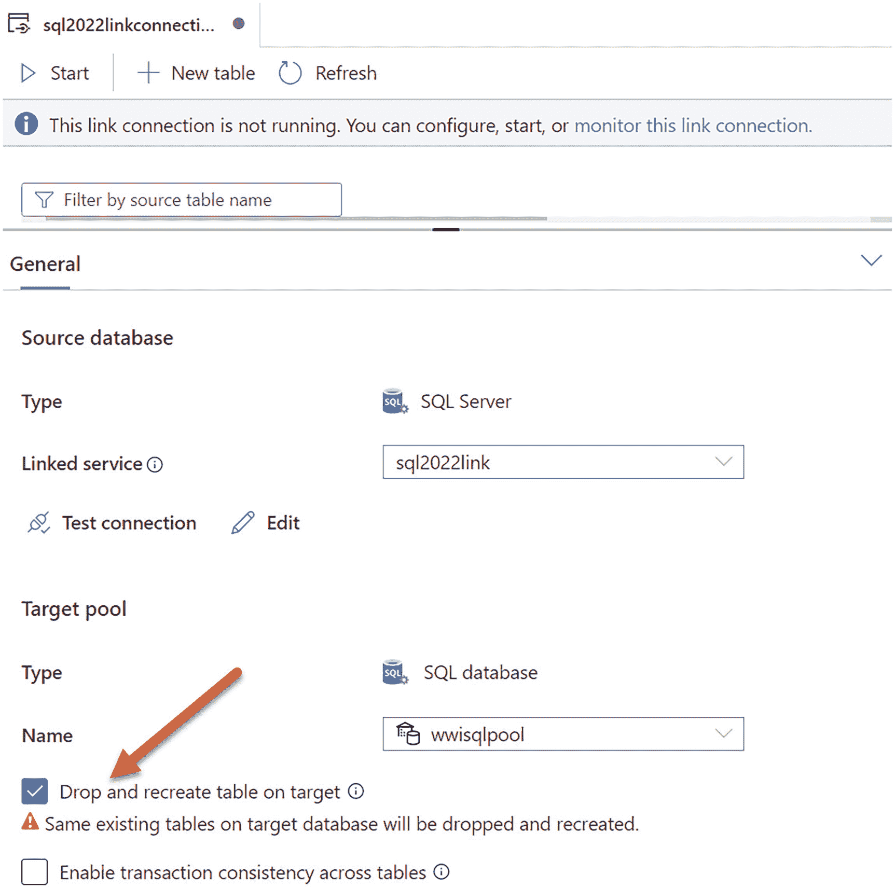

# 初始播种生成的 Parquet 文件


在 Parquet 文件之上，是一个包含架构信息的 JSON 文件。你可以利用文件夹中的`table_id`，并通过运行类似脚本`getchangefeedtable.sql`中的查询，来找出这个 Parquet 文件属于哪个表。在执行脚本前，你需要将 GUID 替换为你自己的`table_id`：

```sql
USE [WideWorldImporters];
GO
SELECT object_name(object_id), *
FROM changefeed.change_feed_tables
WHERE table_id =  '05fc889f-689f-438c-b1fd-cdb9a1333a4f';
GO
```

`changefeed.change_feed_tables`表也包含一些关于表快照创建的有用统计信息。

现在你的表已经初步同步到 Synapse，让我们看看变更如何被捕获并自动馈送到 Synapse 中。

#### 利用 SQL Server 的变更进行近实时分析

你已经完成所有设置并进行了同步。接下来会发生什么？嗯，Synapse Link for SQL Server 的强大之处在于，一旦设置完成，你在 SQL Server 中所做的变更几乎会实时地显示在 Synapse 中。



着陆区容器页面的截图。它有一个包含名称、修改时间、访问层、存档状态和 Blob 类型列的表格。

图 3-37

变更的着陆区中的文件

1.  让我们进行一些变更，并观察它们如何显示在 Synapse 中。使用脚本 `modifyvehicledata.sql` 在你的 SQL Server 实例上运行，向 SQL Server 2022 中添加随机数量的货物。
2.  查看着陆区以查看 CSV 文件，方法是查看容器并深入到 `indexWorkingDir` 文件夹，而不是像图 3-37 中的 `Tables` 文件夹。



截图显示了 SQL 脚本 1。顶部窗格有 6 行代码。底部窗格有一个包含车辆注册号、车辆城市和货物列的表格。

图 3-38

Synapse 中已更新的货物数量

3.  回到 Synapse Studio 并运行 `getcargocounts.sql` 中的相同查询，以查看变更已被应用，如图 3-38 所示。

所以，尽管设置步骤很多，但只需几个步骤就能看到变更出现在 Synapse 中。这就是 Synapse Link 提供的功能：来自 SQL Server 的近实时变更自动在 Synapse 中可用。

### 关于 Synapse Link 的更多细节

关于 Synapse Link，我认为有几个细节你应该了解。要获取所有细节和最新更新，请务必查阅文档 [`https://aka.ms/synapselinksqlserver`](https://aka.ms/synapselinksqlserver)。

#### 配置选择

在设置 Synapse Link 时，你可以进行多项配置选择，包括以下内容：



一个标题为“SQL 2022 链接连接”的选项卡的截图。一个箭头指向“目标池”下已勾选的“在目标上删除并重新创建表”选项框。

图 3-39

在启动链接连接时删除并重新创建 Synapse 池中的表

*   **SQL 池**

当你在 Synapse 中创建 SQL 专用池时，你可以选择一个称为数据仓库单位 (`DWU`) 的性能级别。我们在练习中选择了默认值，但对于生产工作负载，你可能需要选择另一个级别。你选择的 `DWU` 会影响你针对 SQL 池中表运行的查询的性能。但你的性能决定也有代价。你所做的 `DWU` 选择也会影响并发处理表进行摄入的能力。你可以在创建池后更改 `DWU` 设置（向上或向下扩展）。你可以在 [`https://docs.microsoft.com/azure/synapse-analytics/sql-data-warehouse/what-is-a-data-warehouse-unit-dwu-cdwu#change-data-warehouse-units`](https://docs.microsoft.com/azure/synapse-analytics/sql-data-warehouse/what-is-a-data-warehouse-unit-dwu-cdwu#change-data-warehouse-units) 了解更多关于 `DWU` 设置的信息。

*   **停止和重启链接连接**

如果你停止到 SQL Server 的链接连接，所有 Synapse Link 系统表数据将被移除，着陆区容器中的文件将被删除。SQL 池表中的所有当前数据不受影响。

如果你再次启动链接连接，我们将从 SQL Server 获取所有表的新快照，并将其放入着陆区。这里有一个重要的警告：如果你重启链接连接并且没有选择 `在目标上删除并重新创建表` 选项，你的链接连接将显示错误，因为目标表已经存在。因此，你可以先在 Synapse 中自行删除表，或者在启动连接时使用此选项。你可以在启动连接的窗口的“常规”选项卡下找到此选项，如图 3-39 所示。

注意

我们也在考虑增强功能，以便能够暂停和恢复链接连接。如果链接连接被暂停，SQL Server 将继续向着陆区馈送数据和变更，但这些变更直到你恢复链接连接后才会出现在 Synapse 中。

*   **链接连接的核心数**

创建链接连接时，你可以选择核心数。这些核心数专为摄入处理而设计。你选择的核心越多，你的数据摄入速度就越快。但更大的核心数也会影响成本。我们建议你从较小的核心数开始以节省成本，然后向上调整。更改核心数的唯一问题是，你必须停止并重新启动链接连接，这需要重新对所有表进行快照（直到暂停和恢复功能可用）。

*   **计划模式或连续模式**

创建链接连接时的另一个选项是计划模式或连续模式。连续模式意味着摄入服务将始终监视着陆区中的变更以处理数据。计划模式允许你为某些时间范围安排摄入。计划模式将帮助你节省摄入成本，但也会延迟数据在 SQL 池表中可供读取的时间。使用计划模式不会影响 SQL Server 2022 上的任何事务处理延迟或日志截断。

*   **向链接连接添加或删除表**

你可以向链接连接添加或从中删除表。新表的快照将被创建并同步到新的 SQL 池表中。

提示


若要删除 Synapse 工作区，应首先停止所有链接连接并删除链接服务，以确保 SQL Server 完全知晓 Synapse Link 已禁用。否则，您可能会遇到日志截断问题。

您应了解，可以为同一数据库创建多个链接连接，但不能在多个链接连接中添加同一源表。

### 落地区域存储

表的初始快照会创建一个 parquet 文件，其大小将根据 SQL 源表中的数据量而变化。对 SQL Server 数据的更改会产生一系列 `CSV` 文件和清单文件。我们不支持您读取或直接更改落地区域，因此这些文件将保留在落地区域中，直到被清理。清理会在后台定期进行，或者在链接连接停止时进行（所有文件将被移除）。

### SQL 池表索引类型

对于作为 Synapse Link 目标的 SQL 池表，在设置链接连接时可以选择索引类型。要了解适合您工作负载的索引选项，请阅读我们的文档：[`https://docs.microsoft.com/azure/synapse-analytics/sql-data-warehouse/sql-data-warehouse-tables-index`](https://docs.microsoft.com/azure/synapse-analytics/sql-data-warehouse/sql-data-warehouse-tables-index)。

Steve Howard 撰写了一篇深入探讨的文章，其中讨论了其中一些选项及其他内容，可在以下位置找到：[`https://techcommunity.microsoft.com/t5/azure-synapse-analytics-blog/synapse-link-for-sql-deep-dive/ba-p/3567645`](https://techcommunity.microsoft.com/t5/azure-synapse-analytics-blog/synapse-link-for-sql-deep-dive/ba-p/3567645)。

### 事务一致性

Synapse Link 设计为仅提交已提交到落地区域的更改。这与复制和 CDC 技术的概念类似。为了实现容错，Synapse Link 跟踪日志序列号（`LSNs`），以了解哪些事务已提交并可输入到落地区域。

您应预期 Synapse Link 的任何性能影响与复制或 `CDC` 类似。一个不同之处在于，更改在发布到落地区域之前保存在内存队列中，因此对原始事务的性能影响可能小于其他更改馈送技术。我们限制队列中保存的数据大小，并将其发布到落地区域，以确保不会为这些队列过度分配内存。

需要注意的一个问题是事务日志截断。与复制类似，如果涉及启用了 Synapse Link 的表，我们无法截断尚未提交到落地区域的事务日志。因此，落地区域的延迟或问题会影响截断日志的能力。

Synapse Link 的另一个选项是跨表的事务一致性。虽然此选项可能允许您在 Synapse 上使用较小的 `DWU` 选项和核心数，但它会影响更改应用到 Synapse SQL 池表的延迟。

### 监控 Synapse Link

您有多种方法可以监控 Synapse Link，包括如您在本章练习中看到的 Synapse Studio 中提供的一些方法。

您还可以在 SQL Server 中的 `changefeed` 架构下查询一系列系统表，以查看设置、表组和表，包括一些性能统计信息。

还有您可以使用的动态管理视图（`DMVs`），包括 `sys.dm_change_feed_errors` 和 `sys.dm_change_feed_log_scan_sessions`。

如果您需要对 Synapse Link 进行深入调试，可以使用一系列扩展事件。在 `sys.dm_xe_objects` 中搜索以 `synapse_link` 开头的名称。

我还在 `sys.dm_os_wait_stats` 中观察到许多等待类型包含 `synapse` 名称，因此您可以使用以下查询查看其中一些等待：

```sql
select * from sys.dm_os_wait_stats where wait_type like '%synapse%'
```

### 限制与约束

Synapse Link 存在一些限制和约束。这些限制正在演变，甚至可能在 SQL Server 2022 正式发布时更新。本书中的练习旨在确保它们在预览期间记录的限制下能正常工作。

您会在文档中找到某些限制，例如源数据类型、行大小、需要主键，以及不支持的功能，如复制、`CDC` 和内存中 `OLTP`。请在以下位置跟踪详细列表：[`https://docs.microsoft.com/azure/synapse-analytics/synapse-link/synapse-link-for-sql-known-issues`](https://docs.microsoft.com/azure/synapse-analytics/synapse-link/synapse-link-for-sql-known-issues)。

使用 `SQL HA` 功能（如 `Always On 可用性组`）时支持 Synapse Link。在 `AG` 场景中，您需要使用侦听器的名称作为 `SQL Server` 名称，以确保 `SHIR` 始终连接到主副本。

## Synapse Link 可能为您改变分析方式

有许多方法可以运行分析工作负载，在某些情况下甚至可以直接针对 SQL Server 运行。但如果您希望将主要的 SQL Server 应用程序与分析工作负载分离，Synapse Link 可能是一个很好的解决方案。让 SQL Server 自动捕获更改并将其馈送到 Synapse 的能力是一个引人注目的优势。

我询问了 SQL Server 分析首席项目经理 Chuck Heinzelman 对 Synapse Link 的看法："Azure Synapse Link for SQL 允许客户自动将数据从其事务系统移动到基于 `MPP` 的分析系统，而无需为数据移动编写 `ETL` 代码。除了低代码/无代码方法外，客户还可以受益于近实时数据移动，而不是传统 `ETL` 系统附带的基于批处理的处理。"

## Azure Active Directory (AAD) 认证

自 SQL Server 作为产品存在以来，它一直支持 SQL 认证，这是登录 SQL Server 最简单但并非最安全的方法。早在适用于 Windows NT 的 SQL Server 4.2（我不得不查阅我旧的纸质手册来验证这一点），SQL Server 就支持使用操作系统集成认证登录的概念。在 SQL Server 4.2 中，我们称之为 `集成安全性`。Windows NT 支持目录服务器的概念，可用于验证帐户。这项技术最终将成为 Windows Server 的 Active Directory (`AD`)。因此，SQL Server 支持基于 `AD` 帐户创建登录名，并使用支持 `AD` 的服务器（域控制器）对这些登录名进行身份验证。如今，我们将其称为 SQL Server 的 Windows 认证。

随之而来的是 Azure Active Directory (`AAD`)。`AAD` 是用于所有类型应用程序和服务的身份验证托管服务。可以将其视为由 Microsoft 管理的一组域控制器，您可以用它来创建自己的目录、用户、组和身份验证方案。

由于 Azure SQL Database 和 Azure SQL 托管实例是 `PaaS` 服务，您无法为自己部署 Active Directory 域控制器。因此，为了支持 SQL 认证的替代方案，我们添加了对使用 `AAD` 的 Azure SQL 登录名和用户的支持。现在，您可以向 Azure SQL 添加如下登录名：

```sql
CREATE LOGIN [bob@contoso.com] FROM EXTERNAL PROVIDER
GO
```

新的 `EXTERNAL PROVIDER` 语法指示 SQL 使用 `AAD` 进行身份验证。要在 Azure SQL 中使用 `AAD`，请查阅我们的文档：[`https://docs.microsoft.com//azure/azure-sql/database/authentication-aad-overview`](https://docs.microsoft.com//azure/azure-sql/database/authentication-aad-overview)。

现在，随着 SQL Server 2022 的推出，我们已将支持 `AAD` 的实现引入 SQL Server。其语法与 Azure SQL 几乎相同。引擎本身已经拥有所有支持来自 Azure SQL 的 `AAD` 的代码。唯一的区别是您的 SQL Server 可能未在 Azure 中运行，并且虚拟机或计算机位于您的网络中。


### Azure Active Directory (AAD) 认证如何工作？

在 Azure SQL 中，我们增强了引擎，使其能够使用 OAuth 和 OpenID 等协议直接与 AAD 通信。大多数开发者使用诸如 [`https://docs.microsoft.com/azure/active-directory/develop/reference-v2-libraries`](https://docs.microsoft.com/azure/active-directory/develop/reference-v2-libraries) 之类的库为 AAD 进行用户认证。而 SQL Server 作为宿主引擎，需要代表应用程序执行此认证。由于 AAD 不允许任何程序直接进行通信，因此 SQL Server 需要进行一些设置，例如 `Azure 应用注册` 和证书。你可以在 [`https://docs.microsoft.com/en-us/azure/active-directory/develop/active-directory-v2-protocols`](https://docs.microsoft.com/en-us/azure/active-directory/develop/active-directory-v2-protocols) 阅读更多关于在 AAD 中使用这些协议的详细信息。

为了使 SQL Server 拥有与 AAD 通信所需的所有正确信息，它需要将特定信息存储在某个地方。因此，`Azure SQL Server 扩展` 正是在这里发挥作用。该扩展会在你设置 AAD 的过程中与 Azure 通信，将信息写入 Windows 注册表，供引擎读取并用于与 AAD 通信。

注意

注册表项对产品是内部的，但如果你有访问权限，可以在 `HKEY_LOCAL_MACHINE\SOFTWARE\Microsoft\Microsoft SQL Server\MSSQL15.MSSQLSERVER\MSSQLServer\FederatedAuthentication` 看到它们。Linux 在 `mssql.conf` 文件中使用类似的设置。

SQL Server 的 AAD 认证与 Windows 认证是分开的。它们并未集成在一起。Azure SQL 托管实例提供了一项服务，可以保留你的 Windows 认证账户，但将你的认证与 AAD 集成。你可以在 [`https://docs.microsoft.com/azure/azure-sql/managed-instance/winauth-azuread-overview`](https://docs.microsoft.com/azure/azure-sql/managed-instance/winauth-azuread-overview) 阅读更多信息。

请在 [`https://aka.ms/aadsqlserver`](https://aka.ms/aadsqlserver) 保持对 SQL Server 和 AAD 所有最新信息的更新。

### 设置和使用 AAD 认证

让我们通过一个练习来为 SQL Server 2022 设置和配置 AAD 认证。这些步骤基于 [`https://docs.microsoft.com/sql/relational-databases/security/authentication-access/azure-ad-authentication-sql-server-automation-setup-tutorial`](https://docs.microsoft.com/sql/relational-databases/security/authentication-access/azure-ad-authentication-sql-server-automation-setup-tutorial) 的教程。

#### 先决条件

以下是设置和配置 SQL Server 2022 AAD 的先决条件。我需要向你说明，你用于 Azure 订阅的账户有一些要求，可能需要你花费一些时间来完成。

*   一个至少配备两个 CPU 和 8GB 内存的虚拟机或计算机。你的虚拟机或计算机需要能够通过互联网连接到 Azure。
*   SQL Server 2022 评估版。你需要数据库引擎功能，并且需要在安装期间或之后设置 `Azure SQL Server 扩展` 选项。你可以参考我在本书第 2 章“`设置 Azure SQL Server 扩展`”一节中创建的说明，或使用文档 [`https://docs.microsoft.com/sql/database-engine/install-windows/install-sql-server-from-the-installation-wizard-setup`](https://docs.microsoft.com/sql/database-engine/install-windows/install-sql-server-from-the-installation-wizard-setup) 中的说明。对于 Linux 用户，请查阅 Linux 文档 [`https://docs.microsoft.com/en-us/sql/linux/sql-server-linux-configure-mssql-conf#azure-ad`](https://docs.microsoft.com/en-us/sql/linux/sql-server-linux-configure-mssql-conf#azure-ad)。
*   一个 Azure 订阅，使用你组织中已确定为 SQL Server `AAD 管理员` 的 Azure Active Directory (AAD) 账户。此账户应具有以下权限：
    *   Azure Connected Machine Onboarding 组的成员，或与 `Azure SQL Server 扩展` 关联的资源组中的贡献者角色
    *   与 `Azure SQL Server 扩展` 关联的资源组中的 Azure Connected Machine Resource Administrator 角色成员
    *   与 `Azure SQL Server 扩展` 关联的资源组中的读取者角色成员
    *   创建 Azure Key Vault 的权限

重要提示

你需要能够为 Azure 应用程序授予 `管理员同意`。为了授予管理员同意，你的 AAD 账户必须是 Azure AD 全局管理员或特权角色管理员的成员。在你的组织中，你可能没有此权限，因此你需要被授予此权限，或者让另一位 AAD 管理员来配置。在解决此权限问题之前，请勿继续。

*   SQL Server Management Studio (`SSMS`)。最新的 18.x 或 19.x 版本均可使用。
*   一本从本书示例的 `ch3_cloudconnected\aad` 文件夹中复制的脚本副本。


