# 使用 SQL Server 2022 设置 Azure Active Directory 身份验证

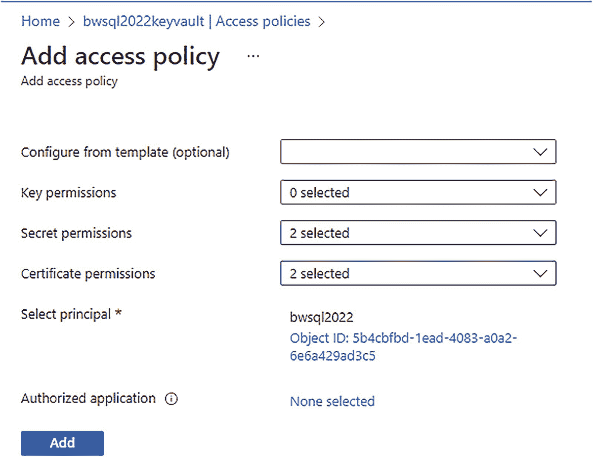

一张截图显示了“添加访问策略”选项卡。为密钥权限、机密权限和证书权限选择的选项分别为 0、2 和 2。

**图 3-40** 为 Azure Key Vault 添加访问策略

1.  权限正确配置后，创建一个新的 `Azure Key Vault` 资源。Azure Key Vault 是 Azure 的一项服务，用于存储和保护密钥、机密和证书。使用此快速入门指南在 [`https://docs.microsoft.com/azure/key-vault/general/quick-create-portal`](https://docs.microsoft.com/azure/key-vault/general/quick-create-portal) 创建新的密钥保管库。使用与注册 SQL Server Azure Arc 时相同的资源组和区域。将你的 Azure Active Directory 管理员账户添加到所创建密钥保管库的“贡献者”角色中。

2.  设置 SQL Server 2022 实例访问 Azure Key Vault。使用密钥保管库资源菜单上的“访问策略”选项。选择“添加访问策略”。“密钥权限”保持选中 0。为“机密”和“证书”添加“获取”和“列出”权限。然后对于“选择主体”，使用你的 SQL Server 主机名称（即 Azure Arc SQL Server 的名称）。你的屏幕应如图 3-40 所示。
    点击`Add`，然后点击`Save`。

3.  现在，将 Azure Key Vault 的访问权限授予你希望设为 SQL Server Azure Active Directory 管理员的账户。这与上一步骤类似，只是对于密钥权限，你需要“获取”、“列出”和“创建”。对于机密，你需要“获取”、“列出”和“设置”；对于证书，你需要“获取”、“列出”和“创建”。如果你使用 Azure Active Directory 管理员账户创建了 Azure Key Vault，则可能不需要此步骤。

4.  现在我们将使用 Azure 门户设置 SQL Server 的 Azure Active Directory 管理员。
    > **注意** 还有其他设置选项，包括 az CLI、PowerShell 和 ARM 模板。要了解更多信息，请参阅 [`https://docs.microsoft.com/sql/relational-databases/security/authentication-access/azure-ad-authentication-sql-server-automation-setup-tutorial#setting-up-the-azure-ad-admin-for-the-sql-server`](https://docs.microsoft.com/sql/relational-databases/security/authentication-access/azure-ad-authentication-sql-server-automation-setup-tutorial#setting-up-the-azure-ad-admin-for-the-sql-server) 上的文档。

    在 Azure 门户中找到你的 SQL Server Azure Arc 资源。你可以通过在门户顶部的“搜索”字段中键入*SQL Server*，然后在服务下选择`SQL Server – Azure Arc`来完成此操作。选择你的 SQL Server 实例。

    在此资源的资源菜单中，转到“设置”下的`Azure Active Directory`。现在选择`设置管理员`。选择你选定的 Azure Active Directory 账户作为管理员。现在，你将填写屏幕上的信息来设置管理员：
    *   选择`服务管理的证书`。
    *   将你的密钥保管库更改为已创建的 Azure Key Vault。
    *   选择`服务管理的应用程序注册`。
    *   将`Purview`选项保持为禁用状态。我们将在本章的下一节启用 Purview 策略。

    你的选项应与图 3-41 相似。

    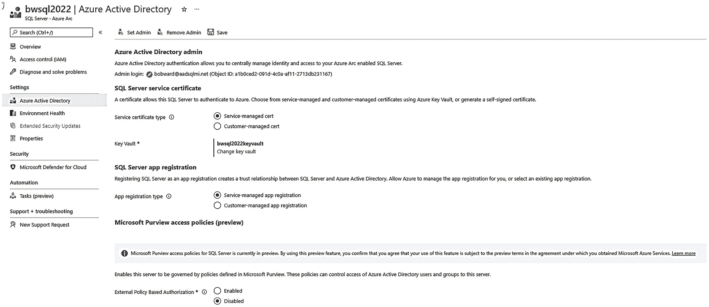

    一张截图显示了`bwsql2022`。左侧窗格中选中了“Azure Active Directory”。SQL Server 的服务证书和应用程序注册是服务管理的。

    **图 3-41** 为 SQL Server 设置 Azure Active Directory 管理员

    现在选择`Save`。屏幕顶部将显示`正在进行…`。Azure 现在正在通过 Azure SQL Server 扩展向你的 SQL Server 发送信息。这可能需要几分钟时间。成功时，你将看到如下消息：
    > 已成功保存，但可能需要授予应用‘bwsql2022-MSSQLSERVER<nnnnn>’的管理员同意。
    >
    > **注意**
    >
    > 如本章前面所述，现在会有信息写入你的 SQL Server 的 Windows 注册表（对于 Linux 则是`mssql.conf`文件），路径类似于`Computer\HKEY_LOCAL_MACHINE\SOFTWARE\Microsoft\Microsoft SQL Server\MSSQL16.MSSQLSERVER\MSSQLServer\FederatedAuthentication`。我们不支持你修改这些注册表项，但了解我们的软件如何连接是很有趣的。SQL Server 2022 引擎经过增强，可读取这些密钥以了解如何连接 Azure Active Directory 进行身份验证。

    此步骤成功后，你应该在 SQL Server 的`ERRORLOG`中看到以下条目：
    ```
    AAD Authentication is enabled. This is an informational message only; no user action is required.
    ```
    Azure Active Directory 管理员账户会自动作为登录名添加到 SQL Server 中，并成为`sysadmin`角色的成员。

5.  这直接引出了设置的最后一步。SQL Server 必须使用 Azure 应用程序作为与 Azure Active Directory 通信的一部分。你在上一步看到的应用名称是自动为你创建的。现在你必须为该 Azure 应用程序授予`管理员同意`。在 Azure 门户中，搜索`Azure Active Directory`并选择你的组织。在左侧菜单上选择`应用程序注册`。你想要选择的应用程序是步骤 4 中创建的那个（我的是‘bwsql2022-MSSQLSERVER<nnnnn>’）。然后在左侧菜单上选择`API 权限`。如果你拥有适当的权限，请选择`授予管理员同意…`。
    > **注意** 此步骤要求你拥有 Azure Active Directory 的“全局管理员”或“特权角色管理员”权限。这些是高度特权权限，因此你可能需要组织中的某人来执行此步骤。

    如果你没有适当的权限，此选项将显示为灰色。此步骤完成后，你的屏幕应如图 3-42 所示。
    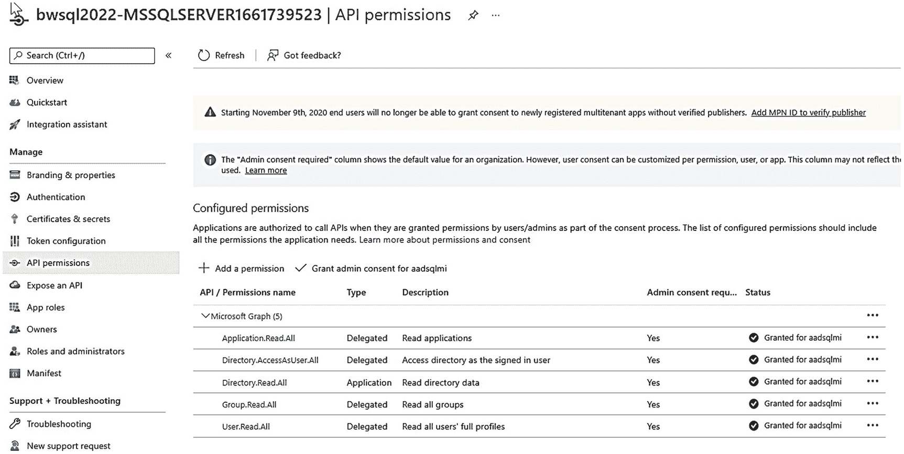
    一张截图显示了`bwsql2022`的`API`权限。右侧窗格列出了在`Microsoft Graph`下配置的 5 个权限。
    **图 3-42** 授予 Azure 应用 Azure Active Directory 身份验证的访问权限
    如果你不执行此步骤，你仍然可以使用为 SQL Server 2022 设置的 Azure Active Directory 管理员账户。但你将无法向 SQL Server 添加任何其他 Azure Active Directory 登录名或用户。你会遇到类似`Server identity does not have permissions to access MS Graph`的错误。
    > **注意**
    >
    > MS Graph 代表 Microsoft Graph，它是 Microsoft Identity 平台中用于 Azure 应用程序访问的一项服务。

我知道设置这些需要很多步骤。但当你全部完成后，使用 Azure Active Directory 身份验证就变得非常简单且强大。


## 在 SQL Server 中使用 AAD

最难的部分你已经完成了。现在，是时候尝试使用 AAD 账户连接到你的 SQL Server 2022 实例了。

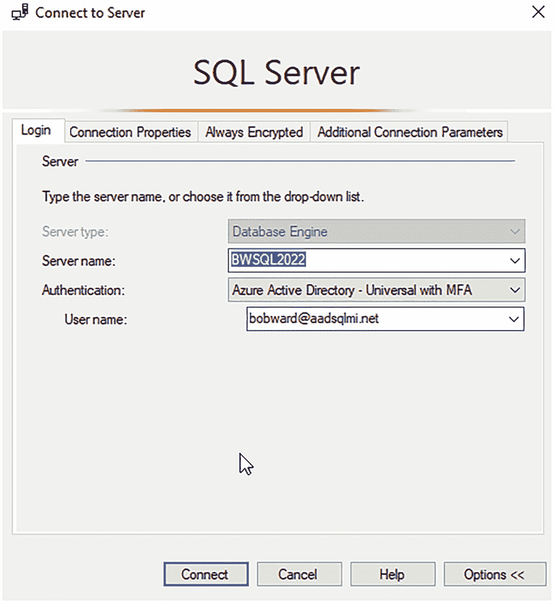

一张截图显示了“连接到服务器”选项卡。登录名下的服务器名称高亮字段条目是 `b w sq l 2022`。底部的“连接”按钮被高亮显示。

图 3-43：使用 MFA 通过 AAD 登录 SQL Server

1.  你已经从先前设置的 AAD 管理员账户中添加了一个基于 AAD 的登录名。让我们找到它。以本地管理员账户登录，执行脚本 `findaadlogin.sql`。该脚本使用了以下 T-SQL 语句：

```
    USE master;
    GO
    SELECT * FROM sys.server_principals WHERE type = 'E'
    GO
```

结果应该是一个使用你先前创建的 AAD 凭据的单一登录名。`type = E` 代表 `EXTERNAL_LOGIN`。目前支持的唯一外部登录类型就是 AAD。

2.  让我们尝试使用 SSMS 通过 AAD 登录名登录。在 SSMS 的“身份验证”中，选择 `Azure Active Directory - 具有多重身份验证的通用`。然后输入 AAD 账户。选择 `选项` 并确保勾选了 `加密连接` 和 `信任服务器证书`。在我选择“连接”之前的登录屏幕如图 3-43 所示。

选择 `连接`，系统将提示你输入 Azure 账户信息。如果你的 AAD 支持或要求 MFA，系统将提示你使用任何已设置的方法（例如，使用你的手机）。成功登录后，你将通过 SSMS 的对象资源管理器连接。

如果你的组中没有其他 AAD 登录名，你可以直接阅读下一步，或者用你自己的 AAD 账户替代。

3.  让我们尝试添加一个新的 AAD 账户作为 SQL 登录名。假设我的同事 Anna Hoffman 需要 `sysadmin` 访问权限来操作此 SQL Server，但她希望直接使用她的 AAD 账户，而不是创建一个不同的账户。Anna 的 AAD 账户是 `annahoffman@aadsqlmi.net`。现在，以最初创建并刚连接使用的 AAD `sysadmin` 登录名登录，执行脚本 `createaadlogin.sql`，它使用了以下 T-SQL 语句：

```
    USE master;
    GO
    CREATE LOGIN [annahoffman@aadsqlmi.net] FROM EXTERNAL PROVIDER;
    GO
    EXEC sp_addsrvrolemember @loginame='annahoffman@aadsqlmi.net', @rolename='sysadmin';
    GO
```

注意新的语法 `FROM EXTERNAL PROVIDER`（我们已经对 Azure SQL Database 和 Azure SQL 托管实例提供了支持）。

你现在可以使用这个新登录名，通过 AAD 使用 MFA 或基于密码的身份验证连接到 SSMS。

4.  现在假设另一位同事 Marisa Mathews 需要作为用户访问特定数据库，但实际上不需要登录名或成为 `sysadmin` 角色的成员。你可以通过 AAD 身份验证来实现。以 AAD `sysadmin` 登录名连接，执行脚本 `createaaduser.sql`，它使用了以下 T-SQL 语句：

```
    DROP DATABASE IF EXISTS howaboutthemcowboys;
    GO
    CREATE DATABASE howboutthemcowboys;
    GO
    USE howboutthemcowboys;
    GO
    CREATE USER [marisamathews@aadsqlmi.net] FROM EXTERNAL PROVIDER;
    GO
```

现在，当你尝试使用此 AAD 账户通过 SSMS 连接时，你需要在 `连接属性` 下使用 `连接到数据库` 选项并指定此数据库。该用户将只能访问该数据库，而不是整个实例。这与我们为 Azure SQL Database 提供的功能非常相似。

5.  另一个不错的选项是 AAD 组。假设 Anna 和 Marisa 是一个名为 `sqlusers` 的 AAD 组的成员。以 `sysadmin` 登录名连接，你可以执行脚本 `createaadgrouplogin.sql`。该脚本使用以下 T-SQL 语句：

```
    USE master;
    GO
    CREATE LOGIN [sqlusers] FROM EXTERNAL PROVIDER;
    GO
```

不幸的是，像 `xp_logininfo` 这样的存储过程不适用于 AAD 组，因此要查看成员身份，你需要使用列出 AAD 组的方法。

还有一些其他的语法选项可用于创建登录名和用户，包括 Azure 应用程序（无密码账户），你可以在 [`https://docs.microsoft.com/en-us/sql/relational-databases/security/authentication-access/azure-ad-authentication-sql-server-setup-tutorial#create-logins-and-users`](https://docs.microsoft.com/en-us/sql/relational-databases/security/authentication-access/azure-ad-authentication-sql-server-setup-tutorial#create-logins-and-users) 阅读更多相关信息。

我们甚至支持链接服务器的 AAD 身份验证，你可以在 [`https://docs.microsoft.com/sql/relational-databases/security/authentication-access/azure-ad-authentication-sql-server-linked-server`](https://docs.microsoft.com/sql/relational-databases/security/authentication-access/azure-ad-authentication-sql-server-linked-server) 阅读更多内容。

## Microsoft Purview 策略管理

要理解 Microsoft Purview 策略管理的强大功能，让我们看一个场景。你需要雇佣一名在 SQL Server 性能监控方面技能非常强的顾问。你希望这位顾问能够访问你的 SQL Server，但只能监控与性能相关的动态管理视图 (DMV) 等内容。你不想授予他们完整的 `sysadmin` 权限。你将在本书的第 6 章了解到，我们为此目的引入了新的固定服务器角色，例如 `##MS_ServerPerformanceStateReader##`。这可以完美满足你的需求。你甚至可以在你的 Azure Active Directory 中创建一个来宾账户，并基于该账户创建一个 SQL Server 登录名，然后将他们分配到新角色。

那么，如果你需要跨，比如说，50 个 SQL Server 实例执行此操作呢？你将需要创建一些脚本来连接所有实例以创建登录名并分配角色。当合同结束时会发生什么？你需要自己创建脚本来在所有实例上删除你先前创建的登录名。

如果你能使用一个中心位置来完成所有这些工作，而无需创建和维护脚本，甚至无需直接创建登录名呢？Microsoft Purview 提供了一个中心治理中心，为包括作为 Azure Arc 启用的 SQL Server 的 SQL Server 2022 在内的 Azure SQL 资源建立**访问策略**。此外，Microsoft 还创建了一些内置策略来匹配某些场景，例如性能监控、安全审计或读取用户表数据。

以下由微软负责 SQL 的 Purview 访问策略首席项目经理 Srdan Bozovic 撰写的博客文章 [`https://cloudblogs.microsoft.com/sqlserver/2022/08/11/microsoft-purview-access-policies-for-sql-server-2022/`](https://cloudblogs.microsoft.com/sqlserver/2022/08/11/microsoft-purview-access-policies-for-sql-server-2022/) 很好地展示了可能实现的功能。

我询问了 SQL 安全首席集团项目经理 Joachim Hammer 对 Microsoft Purview 为 SQL 客户提供哪些价值的看法。他说：

*Microsoft Purview 提供的**全面、统一的数据治理**有助于跨云、应用和设备保护敏感数据，是应对日益增长的安全威胁的重要工具。现已在 SQL Server 2022 中可用的基于 Purview 的访问策略，与当今数据库管理系统内置的访问控制相比具有两大优势：使用 Purview 易于使用的策略仪表板在一个地方高效地管理数据访问，同时执行规模可扩展到整个数据资产。我们非常自豪能够以基于 Purview 的访问策略形式，为我们 SQL Server 客户提供强大的、基于云的数据治理，帮助他们治理和保护其所有 SQL Server 数据，无论数据位于何处，从本地到云端。*

让我们深入细节。让我们看看 Purview 访问策略是如何工作的，然后通过一个练习来看看它们的实际操作。


### Purview 访问策略如何工作？

与 Synapse Link 类似，您将使用 Azure 中的 Purview 来*设计*构建影响 SQL Server 的策略体验。您将通过一个名为 **Purview 治理门户**的工具（我常称之为 Purview Studio）来学习如何操作。

一个策略由以下部分组成：

*   **访问类型**（读取、性能监控等）
*   一个**数据源**。这将是您要向 Purview 注册的 SQL Server 实例。
*   一个要授予权限的**主体**。这是一个 Azure Active Directory 账户。

您可以为 SQL Server 创建两种类型的 Purview 策略：

*   **数据策略** – 用于支持仅需读取数据（例如构建报表）的用户概念。
*   **DevOps 策略** – 用于支持*管理员*用户，例如进行性能监控和安全审计。

**注意**

我们将持续在此领域投入并添加更多类型的访问策略，例如数据修改和自助数据访问。自助数据访问允许用户通过已扫描的数据源请求访问权限，并且可以在不创建特定策略的情况下自动完成审批。

Purview 访问策略不仅适用于 SQL Server。Purview 访问策略是 Purview 中一个更广泛概念的一部分，称为**数据使用管理**，您可以在 `https://docs.microsoft.com/azure/purview/how-to-enable-data-use-management` 阅读更多相关信息。

Microsoft Purview 访问策略依赖于本章已介绍的三种能力：

*   用于 SQL Server 的 Azure Active Directory (AAD) 身份验证。这是因为策略仅支持 AAD 账户。
*   用于 SQL Server 的 Azure 扩展。此代理用于 AAD 身份验证，也将被 Purview 用来为 SQL Server 引擎提供连接到 Purview 以提取策略的信息。
*   构建到 SQL Server 引擎安全系统中的增强功能，以理解如何获取策略信息，并基于该策略允许连接和访问 SQL Server。

图 3-44 展示了 Purview 访问策略工作原理的架构视图。

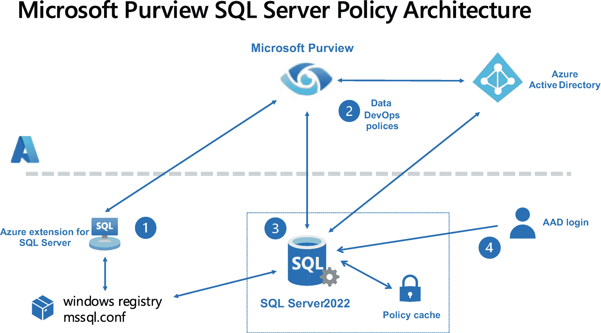

一个 4 步流程图展示了 Microsoft Purview SQL Server 策略架构。步骤从 Azure SQL Server 扩展开始，到 AAD 登录结束。

**图 3-44** SQL Server 的 Purview 访问策略架构

让我们进一步了解这些组件：

1.  创建 Purview 账户后，您将使用 Azure SQL Server 扩展通过 Azure Arc 支持的 SQL Server 功能来**启用 Purview**（记住，您已经执行此操作以启用首先需要的 AAD 身份验证）。启用 Purview 时，扩展会将关键信息存储在 Windows 注册表或 `mssql.conf` 文件（Linux）中，以便 SQL Server 引擎知道如何与 Purview 通信。

    **注意** 对于 Windows，注册表项是 `Computer\HKEY_LOCAL_MACHINE\SOFTWARE\Microsoft\Microsoft SQL Server\MSSQL16.MSSQLSERVER\MSSQLServer\PurviewConfig`。这是内部信息，我们不支持您读取或修改这些注册表项。

2.  然后，您将使用 Purview Studio 将您的 Arc 支持的 SQL Server 实例注册到 Purview 并启用数据使用管理。您现在可以为数据和 DevOps 场景创建策略。
3.  SQL Server 引擎随后可以从 Purview 拉取策略信息，并将其存储在策略缓存（系统表和内存结构）中。引擎会定期检查策略的更新并更新缓存（或者您可以强制刷新）。
4.  通过策略授予权限的主体随后可以登录到 SQL Server 并通过 AAD 进行身份验证。然后，引擎可以使用策略缓存来确定该主体在 SQL Server 和用户数据库中拥有哪些访问权限。

为了让您更直观地理解，让我们通过一个练习来查看数据策略和 DevOps 策略的示例。

### 使用 Purview 访问策略

在本练习中，我将向您展示如何为 Purview 使用两种类型的访问策略：用于读取用户数据的数据策略和用于性能监控的 DevOps 策略。

#### 先决条件

以下是本练习使用 SQL Server 2022 的 Microsoft Purview 访问策略的先决条件。我谨个人感谢来自我们 Microsoft 工程团队的 Vlad Rodriguez、Srdan Bozovic 和 Nikolas Ogg 帮助我完成这些练习：

*   一台至少有两个 CPU 和 8GB 内存的虚拟机或计算机。您的虚拟机或计算机需要能够通过互联网连接到 Azure。
*   您已完成本章前面关于 Azure Active Directory (AAD) 身份验证的所有先决条件，并按照本章前面的说明完成了 SQL Server 2022 的 AAD 设置。
*   您在 Azure 订阅中拥有创建 Microsoft Purview 账户的权限。
*   请注意，在 SQL Server 2022 的预览期间，Purview 数据访问策略仅限于特定的 Azure 区域。请查阅此文档以获取最新更新：`https://docs.microsoft.com/azure/purview/how-to-policies-data-owner-arc-sql-server?branch=release-build-purview-sql-policy#prerequisites`。


## 设置 Microsoft Purview 访问策略

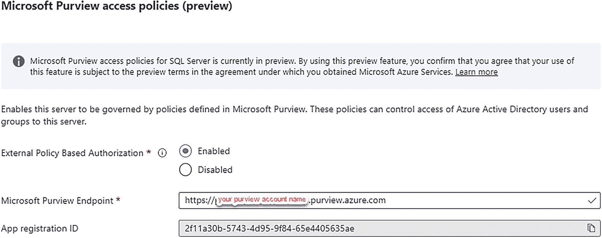

屏幕截图显示了 Microsoft Purview 访问策略预览选项卡。两个条目显示了应用注册 ID 和 Purview 终结点，上方有一个叠加标题，内容为“您的 Purview 账户名称”。

**图 3-45**
使用 Azure 扩展为 SQL Server 注册 Purview

1.  首先，您需要一个 Microsoft Purview 账户。以下是创建 Purview 账户的快速入门指南：[`https://docs.microsoft.com/azure/purview/create-catalog-portal`](https://docs.microsoft.com/azure/purview/create-catalog-portal)。
2.  您需要在 Purview 中设置一些权限，以便能够创建和发布策略以及启用 DUM。请**仔细**按照此文档中的步骤设置这些权限：[`https://docs.microsoft.com/azure/purview/how-to-policies-data-owner-arc-sql-server#configuration`](https://docs.microsoft.com/azure/purview/how-to-policies-data-owner-arc-sql-server#configuration)。
3.  现在，您需要通过 Azure 门户，使用 SQL Server 的 Azure 扩展注册您的 Purview 账户。在 Azure 门户中找到您为 AAD 身份验证创建的 SQL Server – Azure Arc 资源。在左侧菜单中选择 `Azure Active Directory`。在呈现的屏幕底部，您会看到一个名为 `Microsoft Purview access policies` 的部分。点击 `Enabled`，并通过输入您的 Purview 账户名称来填写 `Microsoft Purview Endpoint`，如图 3-45 所示。
    `App registration ID` 将自动填充。这是与启用 AAD 身份验证时注册的 Azure 应用程序相关联的 AAD ID。选择此屏幕顶部的 `Save`。成功或失败的状态显示有些奇怪，因为保存成功后此屏幕不会立即消失。
    完成后，您的屏幕应如图 3-46 所示。

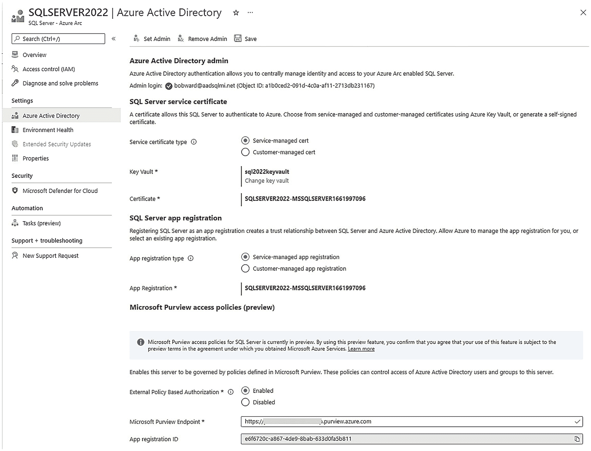

屏幕截图显示了 SQL Server 2022。左侧窗格中选择了 Azure Active Directory。SQL Server 的服务证书和应用注册由服务管理。基于外部策略的授权已启用。

**图 3-46**
为 AAD 和 Purview 配置的 Azure Arc–启用的 SQL Server 2022

那么，如何知道是否通过 Azure 扩展在您的 SQL Server 上启用了 Purview？一种查看方法是查看门户中 SQL 扩展的详细信息。
在 Azure 门户的主页上搜索 `Servers – Azure Arc`。在 `Services` 下选择 `Servers – Azure Arc`。在此列表顶部选择您的服务器名称。在左侧菜单中，选择 `Extensions`。现在选择 `WindowsAgent.SqlServer.`。`Status` 消息显示已发送到 SQL Server 上扩展的信息，其外观应类似于图 3-47。

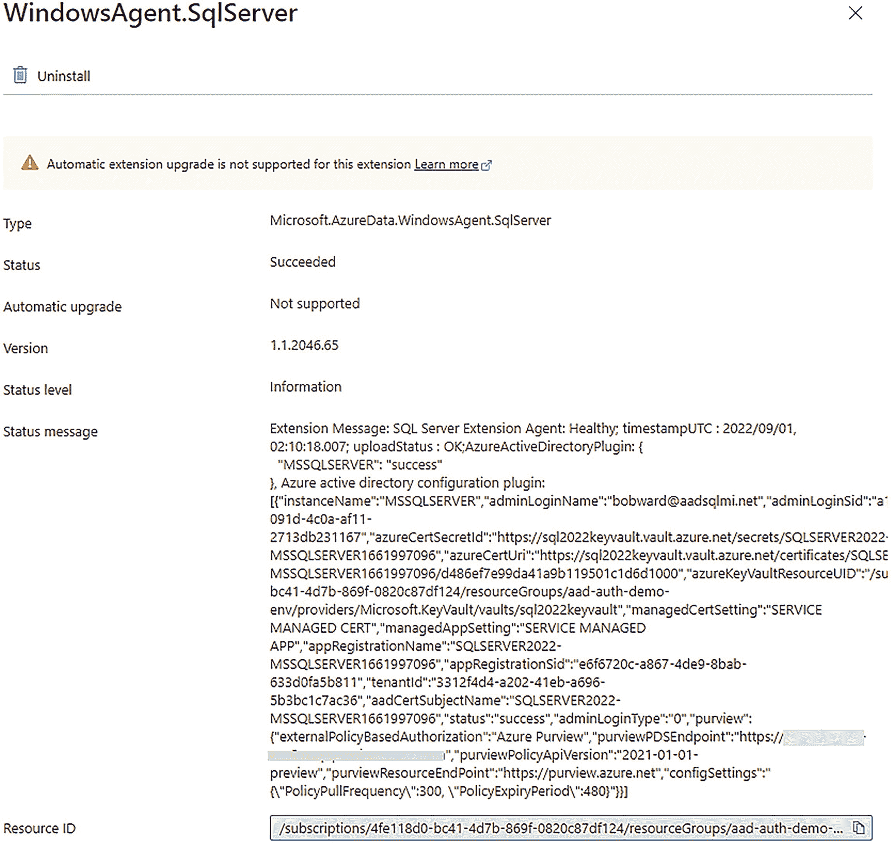

屏幕截图显示了 windows agent dot sql server。Succeeded 状态后跟有状态消息和资源 ID。

**图 3-47**
AAD 和 Purview 的扩展状态成功

4.  在本练习中，您将需要一些 AAD 账户来授权访问。我将为您展示两个不同 AAD 账户的两种场景。对于读取数据的访问，我将使用本章前面在 AAD 身份验证练习中创建的账户 `annahoffman@aadsqlmi.net`。对于性能监控的 DevOps 练习，我将展示一个 *来宾* AAD 账户的示例。来宾是指不属于您 AAD 但您 *邀请* 其访问 Azure 中资源的账户。您可以在 [`https://docs.microsoft.com/azure/active-directory/external-identities/b2b-quickstart-add-guest-users-portal`](https://docs.microsoft.com/azure/active-directory/external-identities/b2b-quickstart-add-guest-users-portal) 阅读更多关于如何在 AAD 中邀请来宾账户的信息。
5.  在 [`https://docs.microsoft.com/azure/purview/use-azure-purview-studio`](https://docs.microsoft.com/azure/purview/use-azure-purview-studio) 学习如何从 Azure 门户启动 Purview Studio 的基础知识。使用您在本章前面为 SQL Server 2022 启用 AAD 身份验证的练习中创建的 AAD 管理员账户。


### 使用 Microsoft Purview 访问策略

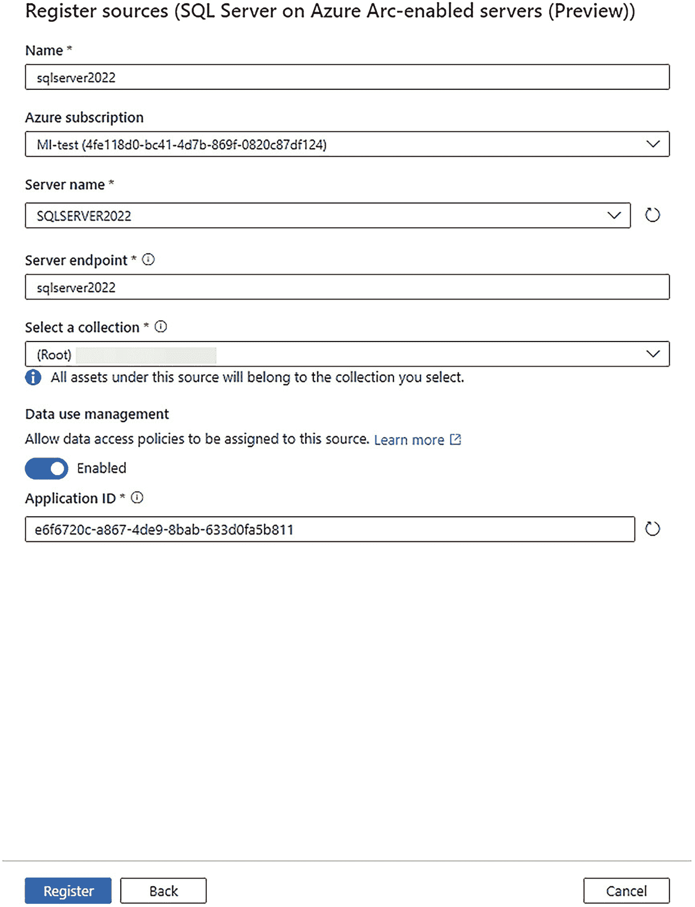

图 3-48：为 Purview 访问策略注册 SQL Server 数据源

1.  我们需要做的第一件事是将 SQL Server 2022 实例注册为数据源。从 Azure 门户启动 Purview Studio。选择左侧菜单中的 `数据地图` 图标（将鼠标悬停在图标上可看到“数据地图”）。你的 Purview 帐户可能已经注册了其他数据源，这些数据源可能以可视树或表格形式显示。选择屏幕顶部的 `注册`。在 `注册源` 屏幕上的 `按关键字筛选` 字段中输入 `Arc`。选择 `Azure Arc 托管服务器上的 SQL Server`，然后选择 `继续`。

现在，你可以在 `注册源（Azure Arc 托管服务器上的 SQL Server）` 屏幕上选择并填写字段。选择一个名称（我建议与你注册的服务器名称相同）、订阅和服务器名称（你已注册的服务器）。在 `服务器端点` 字段中输入你已注册的服务器名称，并将 `(Root)` 集合保留为默认值。

为 `数据使用管理` 选择 `已启用` 选项，这应会自动填充 `应用程序 ID`（这是 SQL Server – Azure Arc 的 Azure Active Directory 屏幕上列出的应用程序注册 ID）。你的屏幕应与图 3-48 类似。

选择 `注册`。几秒钟后，你将再次看到数据源列表。选择屏幕顶部的 `刷新` 以确认你的数据源。

> **注意**
> 如果你想对多个 SQL Server 实例应用策略，你需要先注册每一个实例。你只需注册一次 SQL Server 数据源，即可用于任意数量的策略。

2.  现在让我们为另一个 AAD 帐户创建一个数据策略。我将使用 `annahoffman@aadsqlmi.net` 来授予对我们 SQL Server 实例数据的读取访问权限。对我而言，由于我在 AAD 的练习中将此帐户创建为了登录名，为了避免混淆，我首先删除了该登录名。结果证明，如果某个登录名与策略使用的是同一个 AAD 帐户，我们将使用登录名和策略权限的*并集*。

> **注意**
> 在撰写本书时，我们正计划在未来为特定对象（如特定数据库和/或表）添加更精细的读取访问权限。这将需要使用 Microsoft Purview 的数据目录功能扫描 SQL Server 实例。

使用 Purview Studio，选择左侧菜单中的 `数据策略` 图标。选择 `数据策略`，然后选择 `+ 新建策略`。现在，在 `策略类型` 下选择 `访问控制`。

在 `访问控制策略` 上，输入一个名为 `sqlreader` 的名称，描述相同。然后选择 `+ 新建策略语句`。现在你需要通过一些选择来构建语句：

*   对于 `效果`，选择 `允许`。
*   对于 `操作`，选择 `读取`。
*   对于新屏幕上的 `数据资源`，选择 `数据源类型`，然后选择 `Azure Arc 托管服务器上的 SQL Server`。不要动 `资产`，选择 `继续`。在 `数据源名称` 下选择你的服务器，然后选择 `添加`。

> **注意**
> 如果你注册了多个 SQL Server 数据源，你可以在此处将策略应用于其中一个或多个。

*   对于 `主体`，在 `选择主体` 搜索窗口中输入你想要授予读取访问权限的 AAD 帐户，然后选择 `确定`。

你的策略语句应如图 3-49 所示。

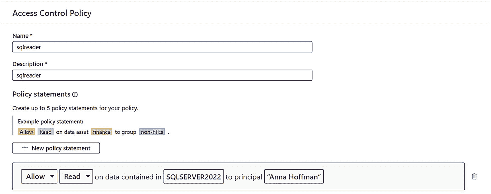

图 3-49：为 SQL Server 2022 创建读取策略

选择 `保存`。策略保存后，你将在策略列表中看到你的新策略。

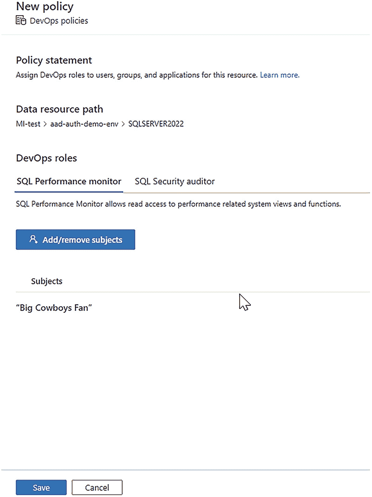

图 3-50：为 SQL 性能监控创建 DevOps 策略。

3.  要使策略生效，我们需要发布它。选择你的策略，然后在屏幕右侧选择 `发布`。选择你的数据源，并在新屏幕底部选择 `发布`。现在，你应该在屏幕上看到策略的 `发布于` 日期和时间。
4.  让我们为新帐户创建一个数据库和数据以供读取。以你的默认系统管理员身份，对你的 SQL Server 2022 实例执行脚本 `howboutthemcowboys.sql`。
5.  策略不会立即应用。SQL Server 将在轮询间隔定期检查新策略。连接到你的 SQL Server 2022 以立即应用新策略。执行脚本 `policyrefresh.sql`，该脚本使用以下 T-SQL 语句：

```sql
-- 强制立即下载最新发布的策略
USE master;
GO
exec sp_external_policy_refresh reload;
GO
```

> **注意**
> 当 SQL Server 在服务器启动时从 Microsoft Purview 获取策略信息时，你可能会在 ERRORLOG 中看到类似以下的消息：
>
> `IMDS resource information. Subscription ID: 4fe118d0-bc41-4d7b-869f-0820c87df124, Resource Group: aad-auth-demo-env, Name: SQLSERVER2022.`
>
> `[JSONWebTokenService::GetCertificateFromCertificateStoreBySubjectName] [AADAuthThumbprint] Thumbprint being used for AAD authentication aRgwszCertificateThumbprint 26289598dfe34092c141edc8a319505bdf0882b6`
>
> `[CBabylonConfigSubscriber] Purview frequency setting changed. New value: 300`
>
> `[CBabylonConfigSubscriber] Purview policy expiration time changed to 480 mins`
>
> `[CBabylonConfigSubscriber] Received update to the config settings`
>
> `[CBabylonConfigSubscriber] Purview frequency setting changed. New value: 300`
>
> `[CBabylonConfigSubscriber] Purview policy expiration time changed to 480 mins`
>
> `[CBabylonConfigSubscriber] Registered for setting updates successfully`
>
> **有趣的事实**
> Babylon 是 Microsoft Purview 的原始项目名称。

6.  使用你本章前面学到的 SSMS 技巧，使用你为其发布了策略的帐户登录 SSMS（使用 MFA 选项，别忘了勾选 `信任服务器证书` 选项）。让我们以读者身份检查新权限以确保其生效。执行脚本 `querythecowboys.sql`，该脚本执行以下 T-SQL 语句：

```sql
USE howboutthemcowboys;
GO
SELECT * FROM tothesuperbowl;
GO
```

你应该会返回一行数据（我希望今年是我们的年份<g>）。读取数据的权限包括系统目录视图和有限的动态管理视图 (DMV)。

7.  让我们证明你只有读取权限。执行脚本 `dropthecowboys.sql`，该脚本执行以下 T-SQL 语句：

```sql
USE howboutthemcowboys;
GO
DROP TABLE tothesuperbowl;
GO
```

你现在应该会得到类似以下的错误：

```
Msg 3701, Level 14, State 20, Line 3
Cannot drop the table 'tothesuperbowl', because it does not exist or you do not have permission.
```

8.  让我们快速查看几个新的动态管理视图 (DMV)，以查看已从 Microsoft Purview 拉取的策略信息。以系统管理员身份连接到你的 SQL Server 2022 实例，并执行脚本 `policydmvs.sql`，该脚本使用以下 T-SQL 语句：


