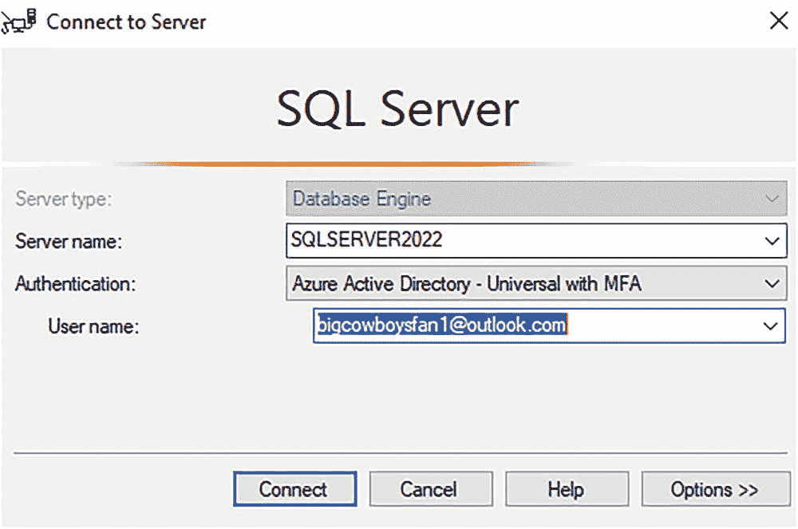

# 连接 SQL Server 与世界

如今，SQL Server 已不仅仅连接到 Azure。它与 Azure *深度集成*，为您提供强大的解决方案，如托管式灾难恢复、近实时分析以及集中式安全与治理。这些解决方案中的每一项都要求我们增强 SQL Server 引擎，以确保您所需的功能能够无缝运行，并与 SQL Server 生态系统协同工作。您无需使用所有这些服务，可以根据需要选择所需的功能。SQL Server 混合场景的未来一片光明，对于 Microsoft 和我们的客户而言，这段旅程才刚刚开始。

## 使用 Microsoft Purview 实施策略

### 探索与策略相关的 DMV

```sql
-- 列出通常受支持的操作
SELECT * FROM sys.dm_server_external_policy_actions;
GO
-- 列出发布到此服务器的策略所包含的角色
SELECT * FROM sys.dm_server_external_policy_roles;
GO
-- 列出角色与操作之间的链接，可用于连接这两者
SELECT * FROM sys.dm_server_external_policy_role_actions;
GO
```

`sys.dm_server_external_policy_actions` 的结果显示了策略可以应用的所有可能操作类型。您可以将这些视为数据和 DevOps 策略所应用的详细权限类型。随着我们提供更多功能，此列表将会扩展。DMV `sys.dm_server_external_policy_roles` 列出了适用于数据和 DevOps 策略的详细角色，包括读取、性能监控和安全审计。您还会看到一些尚未实施的角色以及适用于所有角色的“连接”角色。随着我们增加更多功能，此列表也会扩展。DMV `sys.dm_server_external_policy_role_actions` 则连接了特定预定义角色允许的操作。即使未创建任何策略，这些 DMV 也始终会被填充。

### 查看主体与权限

7.  由于我们已经创建了一个策略，请执行脚本 `policyprincipals.sql`，它使用了以下 T-SQL 语句：

```sql
-- 列出所有被授予连接权限的 Azure AD 主体
SELECT * FROM sys.dm_server_external_policy_principals;
GO
-- 列出在给定资源范围内被分配到特定角色的 Azure AD 主体
SELECT * FROM sys.dm_server_external_policy_role_members;
GO
-- 列出 Azure AD 主体，并连接其角色和数据操作
SELECT * FROM sys.dm_server_external_policy_principal_assigned_actions;
GO
```

让我们分解一下这些 DMV 的结果。`sys.dm_server_external_policy_principals` 将列出您通过策略授予访问权限的所有 Azure AD 账户。即使某个账户通过多个策略获得访问权限，您也只会看到该账户的一行记录。`aad_object_id` 列对应于 Azure Active Directory 中该账户的唯一 ID。`sys.dm_server_external_policy_role_members` 显示了 Azure AD 账户是 `sys.dm_server_external_policy_roles` 中哪些角色的成员。最后，`sys.dm_server_external_policy_principal_assigned_actions` 显示了通过任何策略分配给 Azure AD 账户的所有权限。

### 创建 DevOps 策略示例

8.  让我们展示一个 DevOps 策略的示例。假设您聘请了一名顾问，在一段时间内查看您 SQL Server 的性能指标，以帮助进行性能调优和改进。您希望授予一个 Azure AD *访客*账户访问您的 SQL Server（或多台）的权限，但将其限制为只能访问某些允许其分析性能但不能进行更改或访问用户数据的操作。在 Purview Studio 中，像步骤 2 那样从左侧菜单中选择 **数据策略**。选择 **DevOps 策略** 和 **+ 新建策略**。对于数据源类型，选择 Arc 已启用服务器上的 SQL Server，然后选择您已注册的 SQL Server 并点击 **选择**。

现在，选择“添加/移除主体”，并选取您为先决条件创建的访客 Azure AD 账户。您的屏幕应如图 3-50 所示。

点击 **保存**。您无需发布 DevOps 策略。



一张截图显示了“连接到服务器”选项卡。可见服务器类型、服务器名称、身份验证、用户名窗格。底部可见连接按钮。

**图 3-51**
以访客 Azure AD 账户身份连接到 SQL Server

1.  在以系统管理员身份连接的 SQL Server 实例上，执行脚本 `policyrefresh.sql`。

2.  以系统管理员身份执行脚本 `policydmvs.sql` 和 `policyprincipals.sql`，以查看新增的 Azure AD 访客账户及其被授予的用于性能监控的权限。

3.  使用 SSMS，以访客 Azure AD 账户通过 MFA 进行连接，就像您在本章中使用其他 Azure AD 账户所做的那样。

作为复习，我的 SSMS 登录界面如图 3-51 所示。

### 测试策略授予的权限

4.  以新的 Azure AD 访客账户身份执行脚本 `perfdmvs.sql`。此脚本使用了以下 T-SQL 语句：

```sql
SELECT * FROM sys.dm_exec_requests;
GO
SELECT * FROM sys.dm_os_wait_stats;
GO
```

您的结果应与典型管理员（有权查看此类信息）所看到的结果相同。

5.  以新的访客 Azure AD 账户身份执行脚本 `querythecowboys.sql`。注意，尝试访问用户数据时会出现以下错误：

```
Msg 229, Level 14, State 5, Line 3
对象 'tothesuperbowl'，数据库 'howboutthemcowboys'，架构 'dbo' 上的 SELECT 权限被拒绝。
```

6.  为确保被授予策略的账户仅用于查看性能数据而无法进行任何更改，请执行脚本 `sp_configure.sql`，该脚本使用了以下 T-SQL 语句：

```sql
EXEC sp_configure 'show advanced options', 1;
GO
```

您应该会收到以下错误：

```
Msg 15247, Level 16, State 1, Procedure sp_configure, Line 105 [Batch Start Line 0]
用户没有执行此操作的权限。
```

### 撤销策略

7.  假设与持有访客 Azure AD 账户的顾问的合同现已结束。您希望确保系统安全并移除对 SQL Server 的访问权限。让我们通过 Microsoft Purview 来完成。在 Purview Studio 中，从左侧菜单中选择 **数据策略** 图标。然后选择 **DevOps 策略**。勾选您创建的策略旁边的复选框，然后点击屏幕顶部的 **删除**。再次点击删除。

8.  现在回到 SQL Server，尝试再次使用访客 Azure AD 账户连接。您应该会收到登录失败的错误。

### 总结与注意事项

在本练习中，您学习了如何使用 Microsoft Purview 创建策略，以授予 Azure AD 账户读取数据和执行性能监控分析的访问权限，而无需直接在 SQL Server 中创建登录名和分配角色。SQL Server 已经过增强，能够将 Purview 中的策略集成到安全权限系统中，因此感觉就像您在 SQL Server 内部直接授予了身份验证和授权一样。

**提示**
在使用此功能时，您可能会遇到一个问题。您需要扩展查看系统中安全信息的方式。除了其他安全目录视图外，您还需要使用新的 DMV 来查看谁拥有对您系统的访问权限及其权限。幸运的是，SQL Server Audit 和 Extended Events 等功能可以跟踪任何通过策略访问的账户。


