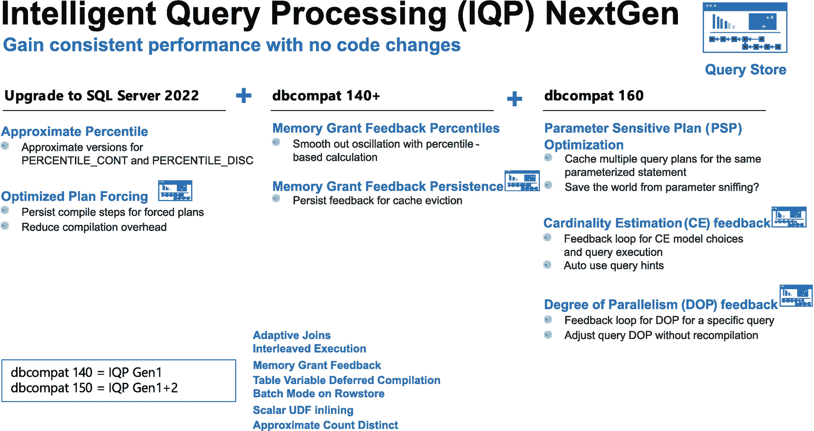

# 4. 内置查询智能

自我加入微软以来，我们一直致力于打造业内最佳的查询处理器（QP）之一，并倾注了全部心血。但正如我在多年技术支持工作中所见，QP 在某些场景下仍会遇到困难。早在 2016 年，我们的团队便开始了一项旅程，旨在使查询处理器能够适应各种工作负载，帮助用户在无需更改代码的情况下实现一致或更优的性能。

我们最初将这一努力称为 `自适应查询处理（AQP）`。我第一次听到这个术语来自 Joe Sack，他是 SQL Server 2017 中 `AQP` 的首席产品经理。`AQP` 增加了响应内存授予、支持自适应连接的功能，并为分析查询引入了批处理模式。这些功能均通过将数据库兼容性（`dbcompat`）级别更改为 `140`（SQL Server 2017 的默认级别）即可启用，无需更改代码。更多关于 `dbcompat` 级别的信息，请访问 [`https://aka.ms/dbcompat`](https://aka.ms/dbcompat)。而这仅仅是个开始。

> 注意
> 趣味回顾，穿越时光。观看 Conor Cunningham 和我在 2018 年 SQLBits 大会上对 `AQP` 的演讲：[`https://sqlbits.com/Sessions/Event17/Adaptive_query_processing_in_SQL_databases?msclkid=2b8c0902c4ca11ecb9e5158053df6fa9`](https://sqlbits.com/Sessions/Event17/Adaptive_query_processing_in_SQL_databases?msclkid=2b8c0902c4ca11ecb9e5158053df6fa9)。

我们加倍努力，在 SQL Server 2019 中将这一概念重新命名为 `智能查询处理（IQP）`。`IQP` 包含了强大而新颖的场景，例如表变量延迟编译、扩展的内存授予，以及为基于行的表启用批处理模式。您可以在我的著作《`SQL Server 2019 Revealed`》的第 2 章中阅读关于 `IQP` 的详细内容，或者直接查阅我们的文档：[`https://aka.ms/iqp`](https://aka.ms/iqp)。所有这些场景均可通过简单地将 `dbcompat` 级别更改为 `150` 来启用，无需更改代码。

> 注意
> 近似查询处理不需要 `dbcompat 150`，只需升级到 SQL Server 2019 即可。

随着我们步入 SQL Server 2022 时代，我们决定保留 `IQP` 这一品牌，同时将一整套新场景纳入 `内置查询智能` 这一术语中。这包括了 `新一代（nextgen）` 的 `IQP`、对查询存储的新增强，以及这些场景的协同工作。

SQL Server 2022 中的 `内置查询智能` 效果如何？我将这些能力分成了两章来介绍。本章将介绍所有 `内置查询智能` 的概念，然后深入探讨查询存储以及那些不需要 `dbcompat 160` 的 `智能查询处理（IQP）` 功能。第 5 章将深入介绍三个新的 `IQP` 功能，这些功能在您启用 `dbcompat 160` 后可用（同样，无需更改代码）。

为什么仅 SQL Server 2022 的这一部分就有如此多的内容？请考虑以下几点：

- 这是 SQL Server 2022 投资最丰富的领域之一。
- 这两章中几乎每个场景背后都有一个故事。我不仅喜欢讲故事，而且许多故事背后都有我亲身经历。
- 尽管 `内置查询智能` 的核心理念是以最少的努力获取性能和洞察力，但我在这两章中都花时间详细解释了每个功能背后的细节。
- 两章中都提供了许多示例供您试用这些新功能。

在阅读接下来的两章时，请牢记我们团队在这一领域始终遵循的以下原则：

- 尽可能做到“无害”。换句话说，确保不破坏现有工作负载，也不会因该功能不可用而导致它们运行得更慢。
- 无需更改代码即可利用这些功能（查询存储提示和近似百分位数等例外情况除外）。
- 允许单独关闭任何这些功能。这让您可以使用您喜欢的功能，并禁用那些可能不适合您工作负载的功能。

我们的创新真的有效吗？我们引擎的合作伙伴工程组经理 Naveen Prakash 认为如此：“*不可预测的* 查询性能曾导致人们无法将货物装入汽车或卡车，无法驶离仓库。SQL Server 2022 *通过智能监控和自适应执行，持续提升透明、可预测和高效查询处理的标杆*。”

所以，请放松身心，继续阅读。选择您现在想读的部分，也许稍后再回来继续。想象自己在接下来的两章中，仿佛置身于我过去一场“烧脑”的演讲之中。

让我们先概览一下新功能的整体阵容，深入了解一下 `全新的` 查询存储，然后一步步看看如何利用 `新一代 IQP` 中的一些功能。

## SQL Server 2022 中的内置查询智能

在 SQL Server 2022 早期规划阶段，Pedro Lopes 和我提出了 `内置查询智能` 这一术语。我们这样做是为了代表 SQL Server 2022 中全新的创新，旨在 **无需更改代码即可获得并保持一致的性能**。此外，这些变更还让您能够通过增强的查询存储，获得对查询性能的新洞察，并以更快、更新颖的方式调优查询。这些创新被“内置”到引擎本身，并利用“数据”进行智能操作。这些数据基于统计信息或来自查询存储等数据源的执行信息。

这系列新功能包括：

- 查询存储增强功能，例如新数据库默认开启、支持针对只读副本执行的查询以及查询存储提示。
- 新的 `IQP` 场景，包括为 SQL Server 查询性能的“古老”问题提供了一些惊人的解决方案；事实上，其中一些新功能 `使用了查询存储`。

图 4-1 展示了所有新 `IQP` 功能的可视化图，并标注了哪些功能使用了查询存储。



图 4-1：SQL Server 2022 `IQP` 新功能

本章将涵盖无需 `dbcompat 160` 即可获得的功能（左侧两列）。第 5 章将深入探讨如果您启用 `dbcompat 160` 后可用的 `IQP` 功能，包括 `参数敏感计划（PSP）` 优化、`基数估计（CE）` 模型反馈和 `并行度（DOP）` 反馈。

请注意右下角的方框，描述了 “`IQP Gen1`” 是通过 `dbcompat 140` 启用的。这代表了我们在 SQL Server 2017 中引入的 `IQP` 能力。“`IQP Gen1+2`” 代表了我们在 SQL Server 2019 加上 SQL Server 2017 中引入的 `IQP` 能力。了解这一点很重要，因为您可能正从 SQL Server 2016 或更早版本升级到 SQL Server 2022，却没有意识到可以使用所有之前的 `IQP` 能力。您始终可以在 [`https://aka.ms/iqp`](https://aka.ms/iqp) 了解所有 `IQP` 功能。

让我们从查询存储的增强功能开始看起。SQL Server 2022 有足够多的新增强，我称之为 `全新的` 查询存储。


## 全新查询存储

在我看来，查询存储是我们嵌入 SQL Server 引擎中最酷的功能之一。早在 2000 年代中期，著名的 Conor Cunningham 就曾向我们客户支持团队的几个人提出过一种追踪查询性能的新方法。在此之前，我们都是通过“轮询”动态管理视图 (`DMVs`) 来持久化查询性能执行数据。Conor 的想法是将有关查询性能执行的遥测数据直接内置于查询处理器本身。这些遥测数据将以系统表的形式持久化存储在用户数据库中。他称之为查询磁盘存储 (`QDS`)，也就是现在众所周知的查询存储。

经过几次迭代，Conor 这一创新梦想在 `SQL Server 2016` 中得以实现。它也是 Azure SQL Database 成功的关键一环，因为我们为所有新数据库默认启用了它。

时至今日，我仍然发现许多我交谈过的客户并未使用查询存储。有些人不太清楚它到底是什么，有些人听说过但未曾尝试启用，还有一些人用过但遇到了问题。

到 `SQL Server 2019` 时，我们完成了新的增强功能，以修复一些性能问题，添加了等待统计信息（在 `SQL Server 2017` 中引入），并引入了额外的控件来帮助查询捕获和更好的数据存储管理。所有这些都为我们面向所有人推进全新的查询存储奠定了基础。

如果你初次接触查询存储，我建议你在阅读我们关于 `SQL Server 2022` 的增强功能之前，先通读我们的文档（[查询存储](https://aka.ms/querystore)）。考虑到这一点，当你在 `SQL Server 2022` 中使用新功能时，需要牢记关于查询存储的几个基本原则：

*   查询存储有一个称为 **捕获模式** 的选项。捕获模式控制哪些查询会被保留在查询存储中。值为 `ALL` 意味着收集所有查询（嗯，并非完全是所有，因为像 `CREATE TABLE` 这样的 SQL 语句永远不会是查询存储的候选对象）。值为 `AUTO` 意味着只收集有意义的查询，这实际上意味着只保留你关心的、需要收集性能信息的查询。值为 `CUSTOM` 允许你配置比 `ALL` 或 `AUTO` 更精细的控制，决定保留哪些查询。这个概念之所以重要，是因为你可能正在尝试使用一个依赖查询存储的功能，但它似乎不起作用。原因可能是根据捕获策略，该查询不符合保留在查询存储中的条件。你可以在 [设置最佳的查询存储捕获模式](https://docs.microsoft.com/sql/relational-databases/performance/best-practice-with-the-query-store?#set-the-optimal-query-store-capture-mode) 阅读更多关于查询存储捕获模式的信息。

*   查询存储将所有数据保留在用户数据库上下文中的系统表内。这扩展了数据库所需的存储空间。有一些选项（带有默认值）用于控制用于查询存储的空间最大大小和清理策略。此外，还可以手动删除查询存储中的所有数据或部分数据。你可以在 [使用查询存储监视性能 - 场景](https://docs.microsoft.com/sql/relational-databases/performance/monitoring-performance-by-using-the-query-store?#Scenarios) 阅读更多关于查询存储维护的信息。

掌握了这些知识后，在本节中，我将向你展示为什么我将 `SQL Server 2022` 中的查询存储称为*全新*的，包括以下内容：

*   查询存储现在对于新数据库默认开启。
*   查询存储提示（Query Store hints）可在无需更改代码的情况下塑造查询计划。
*   查询存储支持针对只读副本的查询的遥测数据。
*   一些新的智能查询处理 (IQP) 功能使用查询存储来提升性能，且无需更改代码。

### 默认开启

我清晰地记得，当我们讨论项目 Dallas（SQL Server 的代号）的新功能时，Pedro Lopes 和 Joe Sack 对我说：“Bob，我们打算默认开启查询存储。”我的反应是：“嘿，我们 SQL Server 不这么做。在默认开启这类功能方面，我们相当保守。”但他们解释为什么要这样做的理由很充分。

以下是他们提出的事实概要：

*   查询存储自 `SQL Server 2016` 起已经存在多个版本。
*   我们在 Azure SQL 中为数百万个数据库默认开启了此功能。而且我们已经这样做了好几年。
*   我们更改了捕获查询的默认模式，以减轻具有即席工作负载的应用程序的负担（将 `QUERY_CAPTURE_MODE` 改为 `AUTO`）。
*   我们在 `SQL Server 2019` 中为 `QUERY_CAPTURE_MODE` 添加了一个新的 `CUSTOM` 选项，使用 `QUERY_CAPTURE_POLICY` 选项来更精细地控制查询存储捕获的内容。
*   我们计划在 `SQL Server 2022` 中添加查询存储提示和支持只读副本。
*   最后，也是最重要的原因，一些新的智能查询处理 (IQP) 场景将*需要*查询存储。这句话确实引起了我的注意。我记得我说了类似“再说一遍？”的话。当你在本章和下一章阅读关于 `SQL Server 2022` 的新 IQP 场景时，就会明白我们所说的“需要”查询存储是什么意思。

这一切都很好，但我敢肯定你读到这里时可能仍在问：“这会对我的应用程序有影响吗？”

对于任何此类普遍问题，答案都是“视情况而定。”Joe 和 Pedro 之前给我的所有理由都让我可以放心地告诉任何人，为任何应用程序启用查询存储所带来的影响可能是微乎其微的。

话虽如此，以下是我个人认为需要考虑的几点想法：

*   我们仅为 `SQL Server 2022` 中新创建的数据库启用查询存储。任何从早期版本 SQL Server 还原的数据库，只有在其原先已开启查询存储的情况下才会保持启用状态。
*   我总是建议任何客户在使用任何捕获遥测数据的系统或程序时测试他们的应用程序。这包括第三方应用程序、动态管理视图 (`DMVs`) 的使用、扩展事件或查询存储。
*   我们在 Azure SQL Database 中默认开启查询存储已有数年，未有客户工作负载受影响的报告。
*   新的捕获策略允许你“捕获所需”，从而减少对系统的整体影响。
*   对于某些生产工作负载，我们仍然建议使用跟踪标志 `7745` 以避免关闭操作的影响。你可以在 [使用查询存储的最佳实践](https://docs.microsoft.com/sql/relational-databases/performance/best-practice-with-the-query-store) 阅读更多关于此跟踪标志以及所有查询存储最佳实践的信息。

    ```
    DBCC TRACEON(7745, -1)
    ```


