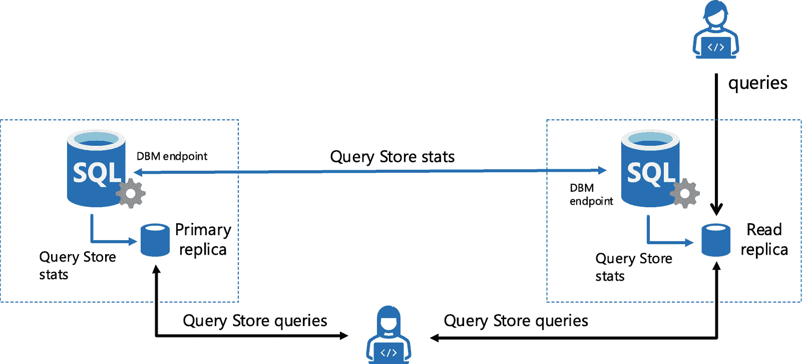

# 查询存储对辅助副本的支持

虽然查询存储是 SQL Server 的一项伟大创新，但一个经常被请求的增强功能是支持收集 Always On 可用性组中针对辅助只读副本运行的查询的性能执行统计信息。

> **注意**
>
> 您可以在我们的[`aka.ms/sqlfeedback`](https://aka.ms/sqlfeedback)站点[`feedback.azure.com/d365community/idea/eade91be-4e25-ec11-b6e6-000d3a4f0da0`](https://feedback.azure.com/d365community/idea/eade91be-4e25-ec11-b6e6-000d3a4f0da0)上看到这个请求有多受欢迎。

使用 SQL Server 2022，您现在可以配置 Always On 可用性组以支持在查询定向到只读副本时捕获统计信息。

我认为深入理解这个新功能的最佳方式是回答一些“如何”问题。

## 如何配置？

在 Always On 可用性组的主副本上启用查询存储后，您可以在主数据库的上下文中运行以下 T-SQL：

```sql
ALTER DATABASE CURRENT FOR SECONDARY SET QUERY_STORE = ON ( OPERATION_MODE = READ_WRITE);
```

> **注意**
>
> 在本书编写时，该功能尚未正式发布（GA），需要跟踪标志 12606 来启用此功能。请在正式发布时查阅文档，看此跟踪标志是否仍然必需。启用此功能时，将捕获可用性组中所有辅助副本的查询存储信息。没有办法为每个辅助副本单独控制此设置。

一旦您执行此语句，针对*任何*辅助副本执行的任何查询都将被捕获到查询存储中。

但是，如果查询针对辅助副本运行，如果副本数据库是只读的，查询存储如何捕获有关查询的信息呢？让我们看看它是如何工作的。


#### 工作原理

当你启用 Query Store 并捕获查询的性能信息时，它首先被记录在一组内存结构中。随后，Query Store 信息会异步刷新到磁盘（刷新到用户数据库中的一组系统表中）。运行时统计数据的刷新基于一个名为 `DATA_FLUSH_INTERVAL_SECONDS` 的配置值。你可以在以下网址阅读更多关于 Query Store 如何收集信息的内容：[`https://docs.microsoft.com/sql/relational-databases/performance/how-query-store-collects-data`](https://docs.microsoft.com/sql/relational-databases/performance/how-query-store-collects-data)。

如果你已为辅助副本启用了 Query Store 捕获，Query Store 信息会在辅助副本的内存结构中被捕获，但不会刷新到辅助副本数据库的磁盘（因为数据库是只读的）。相反，这些信息会被发送回主副本，并在那里刷新到磁盘。Always On 可用性组副本之间有一个*通道*可以相互通信，我们只需使用该通道将数据发送回主副本。SQL Server 2022 引擎得到了增强，能够理解这种发送回主副本的新信息类型，然后将数据添加到主副本的 Query Store 中，如图 4-2 所示。



图 4-2：Query Store 与辅助副本

让我们更详细地探索其工作流程。假设你已经设置并配置了一个 Always On 可用性组，用于在辅助副本上运行 Query Store。当用户对辅助读取副本发起查询时，引擎将在内存中收集 Query Store 统计数据。这些统计数据不会在辅助副本上持久化，因为数据库是只读的。

- 后台任务会在辅助副本引擎中将这些统计数据排入内存队列。在*某个时刻*（一个内部实现细节），这些统计数据将通过用于可用性组日志更改的同一通信通道（dbm 端点）发送。我们努力确保这些性能统计数据的优先级低于日志更改，以免干扰日志更改的复制。

注意

在我撰写本章时，我们的团队正在研究是否可以启用系统存储过程 `sp_query_store_flush_db` 来强制从辅助副本向主副本发送统计数据。

- 在主副本上，后台任务将接收这些 Query Store 统计数据并将其持久化到磁盘，同时跟踪副本详细信息和统计数据。由于这些统计数据存储在数据库中并且是记录的更改，它们也会像所有记录的更改一样被发送到辅助副本。

- 现在，任何用户都可以针对主副本或辅助副本运行查询或报告来获取 Query Store 统计信息。

为了区分在主副本和辅助副本上执行的查询，Query Store 视图 `sys.query_store_runtime_stats` 中添加了一个名为 `replica_group_id` 的新列。该列映射到一个名为 `sys.query_store_replicas` 的新视图，该视图包含所有副本名称、角色及其 ID 值。

关于此功能的预期行为，我认为有几点你应该了解：

- 如果启用此功能，你可能需要增加 `MAX_STORAGE_SIZE_MB` 的值，特别是如果你有多个辅助副本并在其上执行查询时。

- 查询结果不会立即出现在主副本上。由于我们使用相同的通道向副本复制更改，我们不希望对事务更改产生负面影响。因此，我们以延迟的方式将数据发送回主副本。目前没有可调整此时间的配置值。根据我的经验，在辅助副本上执行查询后，查询性能信息可能需要几分钟才会出现在主副本上。

- 即使存在此延迟，如果你的应用程序对在 Always On 可用性组中复制的更改很敏感，则应仔细测试此选项，以确保用于副本更改的标准通信通道不受影响。吞吐量也可能取决于你在辅助副本上执行查询的频率以及可用性组中辅助副本的数量。

- 唯一捕获 `replica_group_id` 的 Query Store 视图是 `sys.query_store_runtime_stats` 和 `sys.query_store_wait_stats`。如果你想找出特定副本的*计划存储*（即 `Sys.query_store_query`）中的信息，你将需要联接到这些视图之一（使用 `plan_id` 作为联接列）。换句话说，如果你只查询 `sys.query_store_plan`，你将无法判断计划是从主副本还是辅助副本捕获的。

- 在撰写本章时，我们仍在研究使用 Query Store 的哪些功能可能支持或不支持只读副本。这包括 Query Store 提示、优化计划强制、DOP 反馈和 CE 反馈。你可以在以下文档中跟踪此功能的最新更新：[`https://docs.microsoft.com/sql/relational-databases/performance/monitoring-performance-by-using-the-query-store?#query-store-for-secondary-replicas`](https://docs.microsoft.com/sql/relational-databases/performance/monitoring-performance-by-using-the-query-store?#query-store-for-secondary-replicas)。

#### 如何使用

由于我们只是在增强现有的 Query Store 功能，你现在可以像以往一样使用 Query Store 来分析查询性能。而且因为所有数据都在主副本中，任何主副本数据库的备份都包含来自所有副本的信息。

### 用于 IQP 的存储

由于 Query Store 数据持久化在数据库中，它能够经受重启，包含重要的遥测信息，因此成为新 IQP 功能的完美“存储”。

此外，由于 Query Store 具有持久化存储，查询处理器可以将特定信息保存在 Query Store 中以启用新功能。再者，引擎中的 Query Store 实现具有后台任务，可用于执行分析以避免影响查询执行。

例如，Query Store 后台任务可用于记录查询性能统计数据和针对有资格进行*并行度 (DOP) 反馈*的查询的*反馈*数据。这些数据持久化在 Query Store 表中，查询处理器在确定查询的并行度 (DOP) 时可以使用它。你可以在第 5 章阅读更多关于 DOP 反馈的详细信息。

因为特定的 IQP 功能依赖于 Query Store，所以正确维护和配置 Query Store 变得更加重要。你应该将 Query Store 视为一组*生产*数据（即使它是用户数据库中系统表的集合）。

因此，请务必查阅以下关于 Query Store 最佳实践和维护的文档页面：

- [`https://docs.microsoft.com/sql/relational-databases/performance/best-practice-with-the-query-store`](https://docs.microsoft.com/sql/relational-databases/performance/best-practice-with-the-query-store)
- [`https://docs.microsoft.com/sql/relational-databases/performance/monitoring-performance-by-using-the-query-store?#Scenarios`](https://docs.microsoft.com/sql/relational-databases/performance/monitoring-performance-by-using-the-query-store?#Scenarios)


## IQP 下一代默认功能

当您升级到 SQL Server 2022 时，多项 IQP 功能只需“开启”即可，无需更改任何数据库兼容性级别。这意味着，即使您使用的是 IQP“诞生”之前版本的 SQL Server（如 SQL Server 2016，数据库兼容性级别 130）的兼容性级别，也能利用新的 IQP 功能。这包括近似百分位数和优化计划强制。让我们来解释一下这些功能各自的工作原理以及如何利用它们。

### 近似百分位数

在 SQL Server 2019 中，我们引入了一个新的 T-SQL 函数 `APPROX_COUNT_DISTINCT`，使您能够近似获取查询中不同值的数量。尽管这不如使用 SELECT COUNT DISTINCT 精确，但其执行速度可能快得多，准确度约为 97%。我们发现，这类函数可以显著提升分析工作负载的性能。您可以在 [`https://docs.microsoft.com/sql/t-sql/functions/approx-count-distinct-transact-sql`](https://docs.microsoft.com/sql/t-sql/functions/approx-count-distinct-transact-sql) 阅读更多关于 `APPROX_COUNT_DISTINCT` 的内容。

SQL Server 包含两个函数来帮助分析工作负载计算值范围的 `百分位数`：`PERCENTILE_CONT`（您可以在 [`https://docs.microsoft.com/sql/t-sql/functions/percentile-cont-transact-sql`](https://docs.microsoft.com/sql/t-sql/functions/percentile-cont-transact-sql) 阅读相关内容）和 `PERCENTILE_DISC`（您可以在 [`https://docs.microsoft.com/sql/t-sql/functions/percentile-disc-transact-sql`](https://docs.microsoft.com/sql/t-sql/functions/percentile-disc-transact-sql) 阅读相关内容）。

SQL Server 2022 为这两个函数提供了 `近似` 等效项：`APPROX_PERCENTILE_CONT` 和 `APPROX_PERCENTILE_DISC`。对于拥有异常庞大数据集的分析工作负载，这些函数可能极其有用。它们的执行速度更快，其实现保证在 99% 概率下误差率高达 1.33%。以下是 `APPROX_PERCENTILE_CONT` 的一个 T-SQL 示例：

```
SELECT DeptId,
APPROX_PERCENTILE_CONT(0.10) WITHIN GROUP(ORDER BY Salary) AS 'P10',
APPROX_PERCENTILE_CONT(0.90) WITHIN GROUP(ORDER BY Salary) AS 'P90'
FROM tblEmployee
GROUP BY DeptId;
```

`APPROX_PERCENTILE_CONT` 的参数是需要为数据范围计算的 `百分位数`。

您可以在 [`https://docs.microsoft.com/sql/t-sql/functions/approx-percentile-cont-transact-sql`](https://docs.microsoft.com/sql/t-sql/functions/approx-percentile-cont-transact-sql) 阅读更多关于如何使用 `APPROX_PERCENTILE_CONT` 的内容，在 [`https://docs.microsoft.com/sql/t-sql/functions/approx-percentile-disc-transact-sql`](https://docs.microsoft.com/sql/t-sql/functions/approx-percentile-disc-transact-sql) 阅读关于 `APPROX_PERCENTILE_DISC` 的内容。

我与微软高级项目经理 Balmukund Lakhani 讨论了 T-SQL 用户为何应该考虑使用这些新函数：

在 `SQL Server 2022` 中，我们近似查询处理家族迎来了最新成员：近似百分位数函数（用于连续值的 `APPROX_PERCENTILE_CONT` 和用于离散值的 `APPROX_PERCENTILE_DISC`）。当您希望以最小的输出误差为代价换取更快的性能时，这些聚合函数可以替代早期的分析百分位数函数（用于连续值的 `PERCENTILE_CONT` 和用于离散值的 `PERCENTILE_DISC`）。想象一下，一个温度传感器数据表拥有数百万行数据，而您希望快速找到第 99 百分位数，并接受可接受的基于排序的误差边界，以便快速决策。这些函数可以在单次扫描中输出结果，且使用更少的 CPU 和内存。

### 优化计划强制

`优化计划强制` 是 SQL Server 2022 中的一项新功能，旨在减少在查询存储中强制查询计划后，某些查询编译所需的时间。

注意
在查询存储中强制查询计划与使用查询计划提示不同。强制查询计划允许您获取查询存储中的特定查询计划，并“告知”优化器在编译时使用该计划，而不是创建新计划。您使用系统存储过程 `sp_query_store_force_plan` 来强制查询计划。

#### 背景

到 2019 年，我们的工程团队与 CSS（客户支持服务）注意到一些客户遇到的一种称为 `编译风暴` 的性能问题模式。在这些情况下，由于某些不可预见的事件（例如，故障转移、重启、内存压力），所有查询计划都从缓存中被清除。然后应用程序会立即生成大量并发连接，每个连接都在极其短暂的时间内发出需要编译的查询。

此问题的典型症状是所有处理器上出现大量的 CPU 利用率（例如，100% CPU 利用率或“满载”）。应用程序实际上处于停滞状态，因为所有用户运行的查询都需要进行耗时较长的查询编译。查询编译几乎完全是受 CPU 限制的操作，某些查询模式可能需要很长时间才能编译并生成查询计划。

在几个示例中，即使客户使用查询存储强制特定查询计划，问题也可能发生。即使在查询存储中强制了查询计划，当计划不在缓存中时，查询仍必须进行编译。

#### 它是如何工作的？

在 SQL Server 2022 中，我们增强了查询存储和查询处理器，如果认为查询编译可能需要大量时间，则可以缩短强制查询计划的编译时间。我们将此概念称为 `优化计划强制`。

以下是 `优化计划强制` 的工作方式：

*   如果在编译查询时启用了查询存储，并且查询编译需要大量时间，则它有资格生成 `编译脚本`。什么是“大量”？我们不记录此阈值，也不允许您更改它，但它实际上意味着查询执行的 `编译阶段` 正在影响整体查询持续时间。您将在下一节“**实际应用**”中看到一个示例。此外，只有需要“完全优化”的查询（即，没有平凡计划的查询）才有资格。您可以在 [`https://docs.microsoft.com/sql/relational-databases/performance/optimized-plan-forcing-query-store?#considerations`](https://docs.microsoft.com/sql/relational-databases/performance/optimized-plan-forcing-query-store?#considerations) 查看决定哪些查询有资格进行 `优化计划强制` 的所有不同考虑因素。

*   编译脚本是二进制数据，被编码到存储在查询存储中的 XML 查询计划的二进制表示中，如 `sys.query_store_plan` 视图中的 `query_plan` 列所示。如果您将 `query_plan` 列“转换”为 XML，将看不到此信息。它是一种未记录的二进制格式，不是 showplan XML 架构的一部分。

*   我们还通过将 `sys.query_store_plan` 视图中的 `has_compile_replay_script` 列设置为 `1`，将查询计划标记为具有编译脚本。

所有这些在 SQL Server 2022 中都是默认发生的，无论数据库兼容性级别如何，前提是数据库启用了查询存储并处于 READ_WRITE 模式。如果您使用 `sp_query_store_force_plan` 强制一个具有编译脚本的计划，那么下次我们需要编译该查询时，我们将使用编译脚本来缩短编译时间。只要查询计划在查询存储中被标记为强制，此操作就会发生。

当我介绍这个概念时，有人问我：“如果查询计划已被强制，为什么我们还需要此功能？”强制查询计划只是在编译查询时“锁定”一个特定的查询计划。这并不意味着我们不必编译查询的计划。如果我们能缩短编译计划所需的时间，最终可以节省大量 CPU 周期，尤其是在这些“编译风暴”场景中。


