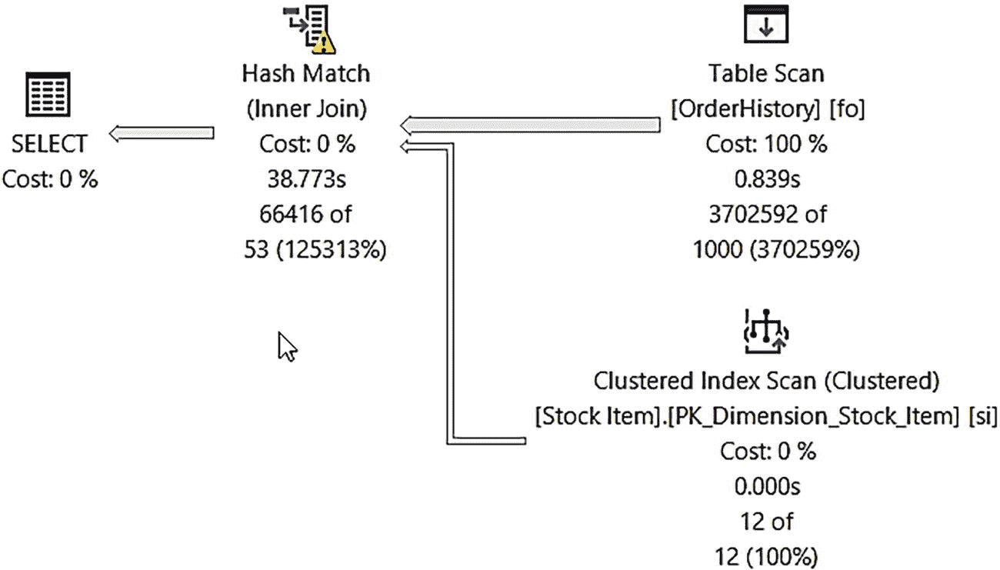

# 实战演示

## 背景与发现

我必须承认，我一直在努力寻找触发编译脚本的场景。在研究我们为这个功能设计的背景时，我们有时会使用 TPC-H 基准测试的查询进行测试。事实证明，任何人都可以通过使用 HammerDB ([`www.hammerdb.com`](http://www.hammerdb.com)) 来运行模拟 TPC-H 的工作负载。我按照 HammerDB 文档中针对 SQL Server 的 TPC-H 说明进行了操作（使用了尽可能小的规模）。然后，我启用了查询存储（捕获模式 = ALL）并运行了一个示例工作负载。有几个查询出现在 `sys.query_store_plan` 中，其 `has_compile_replay_script` 列的值为 `1`。

我检查了其中几个查询，并注意到了这个模式：

*   这些查询中的大多数 SQL 文本量远大于其他大多数查询。
*   这些查询中有许多涉及多表连接。

然后，我能够使用 **WideWorldImporters** 示例数据库来构建我自己的演示。

## 前提条件

以下是运行此示例的前提条件：

*   SQL Server 2022 评估版。
*   至少有 4 个 CPU 和 8GB 内存的虚拟机或计算机（使用更少的 CPU 也有可能看到此功能，但这是我用于测试的最低配置）。
*   SQL Server Management Studio (SSMS)。最新的 18.x 或 19.x 版本均可。
*   从本书的 GitHub 仓库的 `ch4_builtinqueryintelligence\opf` 目录下载的脚本副本。

## 操作步骤

以下是您可以自己查看此功能的步骤：

1.  从 [`https://aka.ms/WideWorldImporters`](https://aka.ms/WideWorldImporters) 复制 **WideWorldImporters** 的示例备份文件。后续步骤中的还原脚本假设备份文件位于 `c:\sql_sample_databases`。

2.  执行脚本 `restorewwi.sql`。根据您的需要编辑文件位置。该脚本执行以下 T-SQL 语句：

```sql
    USE master;
    GO
    DROP DATABASE IF EXISTS WideWorldImporters;
    GO
    RESTORE DATABASE WideWorldImporters FROM DISK = 'c:\sql_sample_databases\WideWorldImporters-Full.bak' with
    MOVE 'WWI_Primary' TO 'c:\sql_sample_databases\WideWorldImporters.mdf',
    MOVE 'WWI_UserData' TO 'c:\sql_sample_databases\WideWorldImporters_UserData.ndf',
    MOVE 'WWI_Log' TO 'c:\sql_sample_databases\WideWorldImporters.ldf',
    MOVE 'WWI_InMemory_Data_1' TO 'c:\sql_sample_databases\WideWorldImporters_InMemory_Data_1',
    stats=5;
    GO
    ALTER DATABASE WideWorldImporters SET QUERY_STORE CLEAR ALL;
    GO
```

3.  执行脚本 `bigjoin.sql`。该查询大约需要 7-10 秒完成。该脚本执行以下 T-SQL：

```sql
    USE WideWorldImporters;
    GO
    ALTER DATABASE SCOPED CONFIGURATION CLEAR PROCEDURE_CACHE;
    GO
    SET STATISTICS TIME ON
    GO
    SELECT o.OrderID, ol.OrderLineID, c.CustomerName, cc.CustomerCategoryName, p.FullName, city.CityName, sp.StateProvinceName, country.CountryName, si.StockItemName
    FROM Sales.Orders o
    JOIN Sales.Customers c
    ON o.CustomerID = c.CustomerID
    JOIN Sales.CustomerCategories cc
    ON c.CustomerCategoryID = cc.CustomerCategoryID
    JOIN Application.People p
    ON o.ContactPersonID = p.PersonID
    JOIN Application.Cities city
    ON city.CityID = c.DeliveryCityID
    JOIN Application.StateProvinces sp
    ON city.StateProvinceID = sp.StateProvinceID
    JOIN Application.Countries country
    ON sp.CountryID = country.CountryID
    JOIN Sales.OrderLines owl
    ON ol.OrderID = o.OrderID
    JOIN Warehouse.StockItems si
    ON ol.StockItemID = si.StockItemID
    JOIN Warehouse.StockItemStockGroups sisg
    ON si.StockItemID = sisg.StockItemID
    UNION ALL
    SELECT o.OrderID, ol.OrderLineID, c.CustomerName, cc.CustomerCategoryName, p.FullName, city.CityName, sp.StateProvinceName, country.CountryName, si.StockItemName
    FROM Sales.Orders o
    JOIN Sales.Customers c
    ON o.CustomerID = c.CustomerID
    JOIN Sales.CustomerCategories cc
    ON c.CustomerCategoryID = cc.CustomerCategoryID
    JOIN Application.People p
    ON o.ContactPersonID = p.PersonID
    JOIN Application.Cities city
    ON city.CityID = c.DeliveryCityID
    JOIN Application.StateProvinces sp
    ON city.StateProvinceID = sp.StateProvinceID
    JOIN Application.Countries country
    ON sp.CountryID = country.CountryID
    JOIN Sales.OrderLines ol
    ON ol.OrderID = o.OrderID
    JOIN Warehouse.StockItems si
    ON ol.StockItemID = si.StockItemID
    JOIN Warehouse.StockItemStockGroups sisg
    ON si.StockItemID = sisg.StockItemID
    ORDER BY OrderID;
    GO
```

注意 SQL 文本的数量、多个连接和 `UNION ALL` 子句。数据库的过程缓存被清除，以确保每次执行查询时都会进行编译。这可能不是一个写得很好的查询，但它代表了一个查询编译时间占执行所需 CPU 时间很大比例的示例。

使用 SSMS 结果窗口中的“消息”选项卡并滚动到底部。您的结果应类似于以下内容：

```
    SQL Server parse and compile time:
    CPU time = 353 ms, elapsed time = 353 ms.
    (916540 rows affected)
    SQL Server Execution Times:
    CPU time = 2531 ms,  elapsed time = 7827 ms.
```

在此示例中，您可以看到编译时间大约占查询执行总 CPU 时间的 13%。

4.  现在让我们看看这个查询是否是优化计划强制的候选者。执行脚本 `find_query_in_query_store.sql`。该脚本使用以下 T-SQL：

```sql
    USE WideWorldImporters;
    GO
    SELECT query_id, plan_id, avg_compile_duration/1000 as avg_compile_ms,
    last_compile_duration/1000 as last_compile_ms, is_forced_plan,
    has_compile_replay_script,
    cast(query_plan as xml) query_plan_xml
    FROM sys.query_store_plan;
    GO
```

结果应类似于以下内容（我将结果翻转为垂直显示每个字段）：

```
    query_id                        2
    plan_id                         1
    avg_compile_ms                  353.088
    last_compile_ms                 353
    is_forced_plan                  0
    has_compile_replay_script       1
    query_plan_xml                  
```

`query_id` 和 `plan_id` 可能不同，您的编译时间也可能有所不同。但是，它们应该大约在查询执行总 CPU 时间的 10-15% 之间。关键是 `has_compile_replay_script` 的值为 `1`。


如果在 SSMS 中"单击"`query_plan_xml` 的输出，SSMS 将打开一个新窗口并显示 XML 文本。如果你仔细查看以 `<StmtSimple…` 开头的行并向右滚动，你会看到这两个值：

```
QueryCompilationReplay="1" StatementOptmLevel="FULL"
```

这意味着此查询是优化计划强制的候选对象。其"脚本"或"编译步骤"已被内置于查询存储的计划 XML 中。这些步骤将在下次编译此查询时使用，但前提是该查询计划在查询存储中被强制。

1.  让我们尝试一下。加载脚本 `forceplan.sql`。编辑该脚本，填入步骤 4 结果中的 `query_id` 和 `plan_id` 值。执行该脚本。该脚本使用了以下 T-SQL：

    ```
    EXEC sp_query_store_force_plan @query_id = , @plan_id = ;
    GO
    ```

2.  再次执行脚本 `find_query_in_query_store.sql` 以验证查询计划已被强制。你应该看到 `is_forced_plan` 的值为 `1`。

3.  下次编译此查询时，我们应该会看到编译时间显著减少。再次运行脚本 `bigjoin.sql`（请确保运行整个脚本，因为它会强制一次新的编译）。再次使用"消息"选项卡，观察编译时间与总 CPU 时间。你的结果应类似于以下内容：

    ```
    SQL Server parse and compile time:
    CPU time = 38 ms, elapsed time = 38 ms.
    (916540 rows affected)
    SQL Server Execution Times:
    CPU time = 2672 ms,  elapsed time = 7636 ms.
    ```

    从这些结果可以看出，编译查询的时间现在约占总 CPU 时间的 1%。

4.  要查看查询存储视图中的新值，首先使用脚本 `flush_query_store.sql` 将数据刷新到查询存储中，以便我们可以看到最近的统计信息。该脚本使用了以下 T-SQL：

    ```
    USE WideWorldImporters;
    GO
    EXEC sys.sp_query_store_flush_db;
    GO
    ```

5.  现在，通过再次执行脚本 `find_query_in_query_store.sql`，查看查询存储中的最新统计信息。`last_compile_ms` 应与步骤 7 中最新的 "SQL Server parse and compile time" 的值相匹配。

#### 使用优化计划强制的注意事项

我们在 SQL Server 2022 中默认为新数据库启用了此功能，因为使用它确实没有任何坏处。它确实要求启用查询存储。如果你正在强制查询计划，任何符合编译脚本条件的计划都将只是编译得更快。使用它没有实际开销。

话虽如此，你可以使用以下方法禁用优化计划强制：

*   使用选项 `OPTIMIZED_PLAN_FORCING` 设置 `ALTER DATABASE SCOPED CONFIGURATION` 语句为 OFF。（你也可以使用此选项将其重新打开。）
*   当你使用系统存储过程 `sp_query_store_force_plan` 强制查询计划时，可以通过使用 `@disable_optimized_plan_forcing` 选项来禁用优化计划强制。
*   你可以使用名为 `DISABLE_OPTIMIZED_PLAN_FORCING` 的查询提示。

提示

当你想要获取所有可能的查询提示（即 `USE HINT`）列表时，请执行系统过程 `sys.dm_exec_valid_use_hints`。

请通过我们的文档 [`https://docs.microsoft.com/sql/relational-databases/performance/optimized-plan-forcing-query-store`](https://docs.microsoft.com/sql/relational-databases/performance/optimized-plan-forcing-query-store) 关注有关优化计划强制的最新信息。

### 具有 dbcompat 140+ 的下一代 IQP

基于上一节，你可以看到，如果你升级到 SQL Server 2022 且使用任何支持的 dbcompat 级别，你都有资格从这些功能中获得性能提升：

*   近似百分位
*   优化计划强制

例如，如果你从 SQL Server 2016 升级并保持 dbcompat 级别为 130，你将能够利用这些功能（前提是你符合每个功能的标准）。

但假设你从 SQL Server 2017 或 2019 升级，并且 dbcompat 设置为 140 或 150。你可以使用哪些额外功能来提高性能？首先，请记住，根据 dbcompat 140 或 150，2017 和 2019 中发布的任何 IQP 功能你都可以使用。

注意

近似不同值是在 SQL Server 2019 中添加的，与 dbcompat 级别无关。你可以在 [`https://docs.microsoft.com/sql/t-sql/functions/approx-count-distinct-transact-sql`](https://docs.microsoft.com/sql/t-sql/functions/approx-count-distinct-transact-sql) 阅读更多信息。

在 SQL Server 2022 中，如果你使用的是 dbcompat 140 或更高版本，那么你就可以利用 `内存授予反馈` 的增强功能。

在 *SQL Server 2019 Revealed* 的第 2 章中，我提供了关于内存授予反馈的详细背景和解释。让我在此总结一下我在该章中关于内存授予反馈的关键点。

查询计划中有某些运算符需要自己的内存分配，例如哈希联接和排序。当查询被编译时，SQL Server 将决定这些类型的运算符需要多少内存；这被称为*内存授予*。我喜欢我们的资深开发者之一 Jay Choe 关于内存授予的这篇详细博文：[`https://docs.microsoft.com/en-us/archive/blogs/sqlqueryprocessing/understanding-sql-server-memory-grant`](https://docs.microsoft.com/en-us/archive/blogs/sqlqueryprocessing/understanding-sql-server-memory-grant)。内存授予也称为*查询内存*。

多年来我在支持工作中经常遇到的一个问题是，内存授予与运算符实际所需的内存不准确。这个问题可能以两种形式出现：

*   如果对于查询执行来说内存授予太小，则可能发生*溢出*。实际上，如果在查询执行期间，查询开始时预先分配的内存授予不足，引擎将不得不使用 tempdb 作为*分页文件*。即使 tempdb 的磁盘速度再快，也不如所有需要的内存都在 RAM 中快。因此，溢出会导致查询性能变慢。
*   如果对于查询执行来说内存授予太大，其他查询可能会被迫等待，尤其是当多个查询需要特定大小的内存授予时。症状将是 wait_type = `RESOURCE_SEMAPHORE`。

内存授予不准确可能由多种原因造成。最常见的原因之一是为像哈希联接或排序这样的运算符提供输入的基数估计不准确。可能仅仅是统计信息过时了。

像处理任何其他问题一样，我们的支持团队会与客户合作提供解决方法。有许多选项，例如查询提示或资源调控器设置。但没有真正解决根本问题。用户很难深入调查为什么内存授予不准确。

在 SQL Server 2017 中，如果你使用 dbcompat 140，我们为批处理模式操作（当时仅限列存储）创建了内存授予反馈模型。在 SQL Server 2019 中，如果启用了 dbcompat 150，我们增强了反馈系统，以包含行模式操作（但在 SQL Server 2019 中也引入了批处理模式，无需列存储即可使用）。

注意
请通读以下关于 SQL Server 中批处理和行模式操作的内容：[`https://techcommunity.microsoft.com/t5/azure-sql-blog/introducing-batch-mode-on-rowstore/ba-p/386256`](https://techcommunity.microsoft.com/t5/azure-sql-blog/introducing-batch-mode-on-rowstore/ba-p/386256)。


反馈系统的核心理念在于评估内存的实际使用情况，并与执行开始时分配的初始内存授予进行对比。在下一次执行时，如果实际使用的内存显著高于初始授予量，则会增加内存授予。如果实际使用的内存较低，则会减少授予量。

SQL Server 能够有效地从之前的执行中学习，使未来的执行更加高效。对我个人而言，这项创新具有开创性意义。多年来那些让客户困扰于内存溢出或阻塞问题的支持案例，现在都可以由引擎自动解决了。

然而，我们从 SQL Server 2017 和 2019 中发现并改进了两个方面：

*   **易变性**
    我们在初始设计中内置了一项能力：如果我们发现针对同一查询需要持续调整内存授予，则会禁用内存授予反馈。参数敏感型计划就是这类场景的一个显著例子。你可以通过查看查询计划中的 `IsMemoryGrantFeedbackAdjusted` 属性并发现值为 `No: Feedback disabled`，来判断我们是否需要禁用内存授予反馈。

*   **持久性**
    该反馈系统适用于大多数工作负载，但遗憾的是，它无法持久化到磁盘。因此，如果服务器重启或查询计划被逐出缓存，所有反馈信息都将丢失。

### 内存授予百分位数

为了改进初始设计的易变性问题，SQL Server 2022 中的内存授予反馈采用了基于百分位数的方法，而不是直接禁用内存授予反馈。我们不再仅使用查询执行中上一次的已用内存量，而是考虑一系列历史内存使用情况，来调整一个适用于多次查询执行的内存授予量。

这种方法倾向于避免溢出，因此有可能授予比实际需求更多的内存。如果我们对内存授予使用这种方法，你可以在查询计划的 `IsMemoryGrantFeedbackAdjusted` 属性中观察到值为 `Yes: Percentile Adjusting`。

在 SQL Server 2022 中，如果你使用数据库兼容性级别 140 或更高版本，默认启用此行为。如果你想禁用此功能，请将数据库作用域配置选项 `MEMORY_GRANT_FEEDBACK_PERCENTILE` 设置为 OFF。

### 内存授予反馈持久化

如果你在 SQL Server 2022 中使用数据库兼容性级别 140 或更高版本，并且为查询存储启用了 READ_WRITE 模式，我们将把内存授予反馈的详细信息持久化到查询存储中。这使得任何内存授予反馈都能在服务器重启或计划缓存被逐出后仍然保留。

还有什么比通过练习来学习更好的方式呢？我一向追求效率，所以我将重用我在 *SQL Server 2019 Revealed* 第 2 章中介绍的内存授予反馈示例，并稍作补充。

在你开始这个练习之前，我想快速说明一下：我通过强制查询使用哈希联接并模拟基数问题，来引发需要内存授予反馈的条件。但这里的创新是真实存在的。这项功能正在解决应用程序日常面临的真实世界问题，这些应用程序并不关心查询处理器是否使用了哈希联接，甚至不知道什么是内存授予。这正是智能查询处理的初衷。就是让它能用起来！

#### 先决条件

使用此示例的先决条件如下：

*   SQL Server 2022 评估版。
*   虚拟机或计算机，至少配备两个 CPU 和 8GB 内存。
*   SQL Server Management Studio。最新的 18.x 或 19.x 版本均可。
*   本书 GitHub 仓库中 `ch4_builtinqueryintelligence\persistedmgf` 目录下的脚本副本。

#### 按照以下步骤进行练习

请按照以下步骤在 SQL Server 2022 上查看具有持久化功能的内存授予反馈：



一个查询计划流程图。流程从表扫描和聚集索引扫描开始，经过哈希匹配，最终以 0% 的选择成本结束。

图 4-3：存在溢出的查询计划

1.  从 [`https://github.com/Microsoft/sql-server-samples/releases/download/wide-world-importers-v1.0/WideWorldImportersDW-Full.bak`](https://github.com/Microsoft/sql-server-samples/releases/download/wide-world-importers-v1.0/WideWorldImportersDW-Full.bak) 下载 `WideWorldImportersDW` 数据库备份文件。后续步骤中的还原脚本假设备份文件位于 `c:\sql_sample_databases`。你可以在 [`https://github.com/microsoft/sqlworkshops-sql2022workshop/releases`](https://github.com/microsoft/sqlworkshops-sql2022workshop/releases) 找到预加载了扩展数据的自定义备份。

2.  将此数据库还原到你的 SQL Server 2022 实例。执行脚本 `restorewwidw.sql`。你可能需要根据你的备份文件位置和数据库文件还原目标位置更改目录路径。此脚本运行以下 T-SQL 语句：

    ```sql
    USE master;
    GO
    DROP DATABASE IF EXISTS WideWorldImportersDW;
    GO
    RESTORE DATABASE WideWorldImportersDW FROM DISK = 'c:\sql_sample_databases\wideworldimportersdw-full.bak'
    WITH MOVE 'wwi_primary' TO 'c:\sql_sample_databases\wideworldimportersdw.mdf',
    MOVE 'wwi_userdata' TO 'c:\sql_sample_databases\wideworldimportersdw_userdata.ndf',
    MOVE 'wwi_log' TO 'c:\sql_sample_databases\wideworldimportersdw.ldf',
    MOVE 'wwidw_inmemory_data_1' TO 'c:\sql_sample_databases\wideworldimportersdw_inmemory_data'
    GO
    ```

3.  为了运行部分示例，你需要一个比 WideWorldImportersDW 默认表更大的、且没有列存储索引的表。因此，请执行脚本 `extendwwidw.sql` 来创建一个更大的表。扩展此数据库会将其大小（包括事务日志）增加到总共约 8GB。此脚本运行以下 T-SQL 语句：


