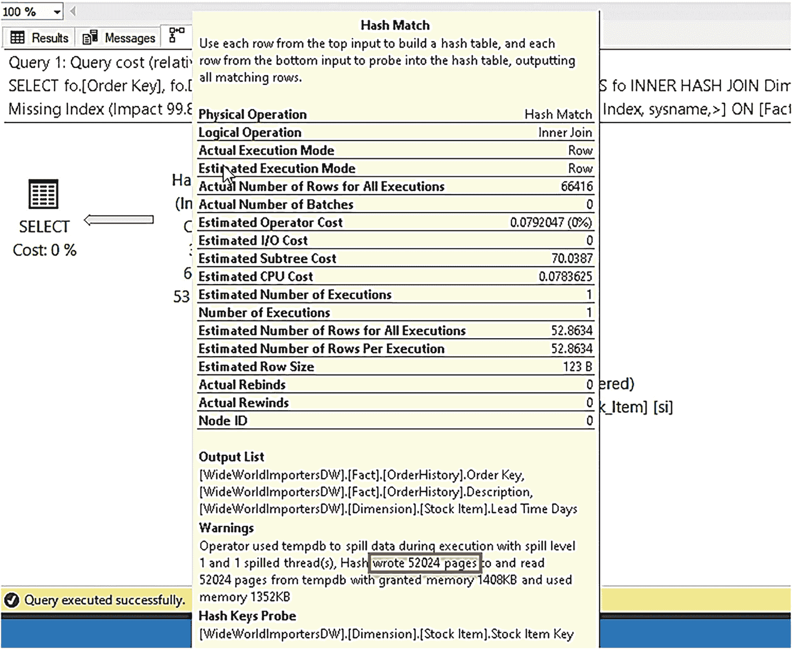
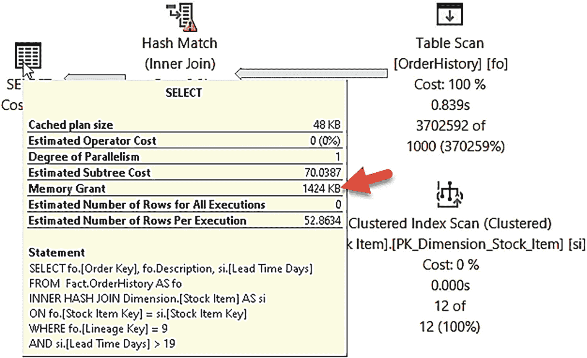
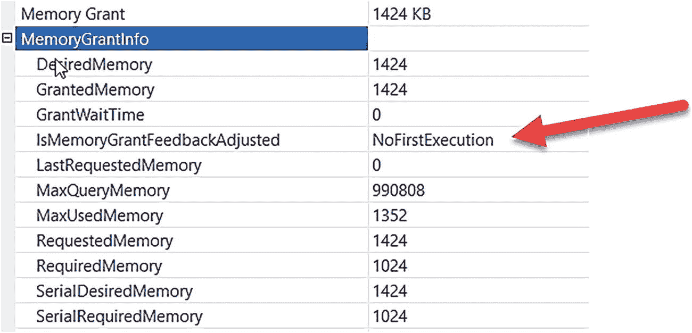
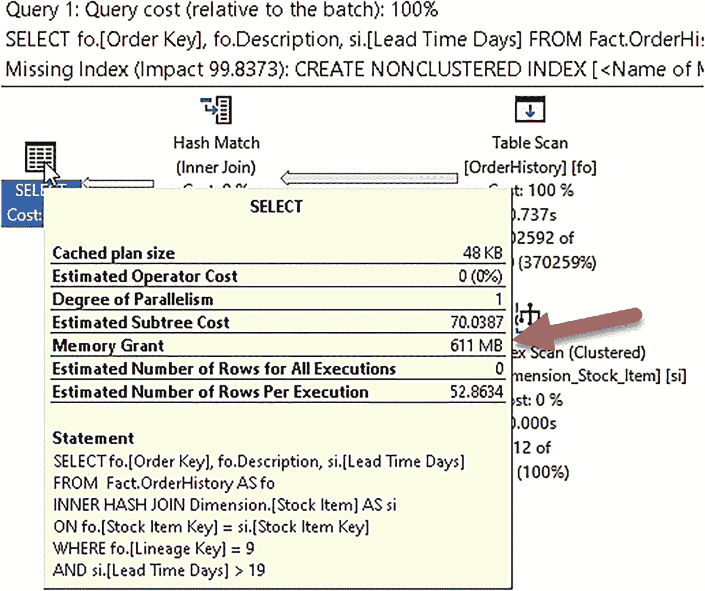
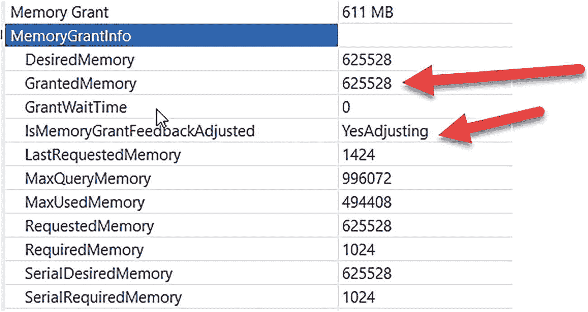

# 内存授予反馈演示

以下脚本将在 `WideWorldImportersDW` 数据库中创建 `Fact.OrderHistory` 表，并用数据填充它。

```
USE WideWorldImportersDW;
GO
-- Build a new rowmode table called OrderHistory based off of Orders
--
DROP TABLE IF EXISTS Fact.OrderHistory;
GO
SELECT 'Buliding OrderHistory from Orders...'
GO
SELECT [Order Key], [City Key], [Customer Key], [Stock Item Key], [Order Date Key], [Picked Date Key], [Salesperson Key], [Picker Key], [WWI Order ID], [WWI Backorder ID], Description, Package, Quantity, [Unit Price], [Tax Rate], [Total Excluding Tax], [Tax Amount], [Total Including Tax], [Lineage Key]
INTO Fact.OrderHistory
FROM Fact.[Order];
GO
ALTER TABLE Fact.OrderHistory
ADD CONSTRAINT PK_Fact_OrderHistory PRIMARY KEY NONCLUSTERED([Order Key] ASC, [Order Date Key] ASC)WITH(DATA_COMPRESSION=PAGE);
GO
CREATE INDEX IX_Stock_Item_Key
ON Fact.OrderHistory([Stock Item Key])
INCLUDE(Quantity)
WITH(DATA_COMPRESSION=PAGE);
GO
CREATE INDEX IX_OrderHistory_Quantity
ON Fact.OrderHistory([Quantity])
INCLUDE([Order Key])
WITH(DATA_COMPRESSION=PAGE);
GO
-- Table should have 231,412 rows
SELECT 'Number of rows in Fact.OrderHistory = ', COUNT(*) FROM Fact.OrderHistory;
GO
SELECT 'Increasing number of rows for OrderHistory...';
GO
-- Make the table bigger
INSERT Fact.OrderHistory([City Key], [Customer Key], [Stock Item Key], [Order Date Key], [Picked Date Key], [Salesperson Key], [Picker Key], [WWI Order ID], [WWI Backorder ID], Description, Package, Quantity, [Unit Price], [Tax Rate], [Total Excluding Tax], [Tax Amount], [Total Including Tax], [Lineage Key])
SELECT [City Key], [Customer Key], [Stock Item Key], [Order Date Key], [Picked Date Key], [Salesperson Key], [Picker Key], [WWI Order ID], [WWI Backorder ID], Description, Package, Quantity, [Unit Price], [Tax Rate], [Total Excluding Tax], [Tax Amount], [Total Including Tax], [Lineage Key]
FROM Fact.OrderHistory;
GO 4
-- Table should have 3,702,592 rows
SELECT 'Number of rows in Fact.OrderHistory = ', COUNT(*) FROM Fact.OrderHistory;
GO
```

## 4. 设置演示环境

通过执行脚本 `setup.sql` 来设置演示环境。此脚本运行以下 T-SQL 语句：

```
USE [WideWorldImportersDW];
GO
ALTER DATABASE [WideWorldImportersDW] SET COMPATIBILITY_LEVEL = 150;
GO
ALTER DATABASE SCOPED CONFIGURATION CLEAR PROCEDURE_CACHE;
GO
ALTER DATABASE WideWorldImportersDW SET QUERY_STORE CLEAR ALL;
GO
```

此脚本将 `dbcompat` 设置为 150，以允许启用针对行模式的内存授予反馈。此数据库已启用查询存储，因此我们只需清除过程缓存（以确保获得新的编译）和查询存储统计信息，以便我们只关注此查询。

## 5. 模拟不准确的基数估计

为了轻松模拟由于基数不准确导致内存授予不准确的问题，请执行脚本 `set_stats.sql`。此脚本执行以下 T-SQL 语句：

```
USE WideWorldImportersDW;
GO
UPDATE STATISTICS Fact.OrderHistory
WITH ROWCOUNT = 1000;
GO
```

## 6. 执行查询并捕获执行计划

在 SSMS 的查询编辑器中，选择 **查询** > **包括实际执行计划**（也可以使用 `Ctrl+M` 启用）。然后执行脚本 `execute_query.sql`，该脚本大约需要 30 秒才能完成（此示例中行结果无关紧要）。此脚本执行以下 T-SQL 语句：

```
USE WideWorldImportersDW;
GO
SELECT fo.[Order Key], fo.Description, si.[Lead Time Days]
FROM  Fact.OrderHistory AS fo
INNER HASH JOIN Dimension.[Stock Item] AS si
ON fo.[Stock Item Key] = si.[Stock Item Key]
WHERE fo.[Lineage Key] = 9
AND si.[Lead Time Days] > 19;
GO
```

## 7. 分析第一次执行的执行计划

从结果窗口中选择 **执行计划** 选项卡。你将看到一个图形化的执行计划输出，类似于图 4-3。

请注意 Hash Match 运算符顶部的黄色警告。如果将光标悬停在此运算符上，可以看到一个关于溢出到 `tempdb` 的警告，类似于图 4-4。



*图 4-4：查询计划中的溢出警告*

你可以看到哈希联接需要大约 426MB（`52024*8192`）的内存，而原始授予仅为约 1.4MB。



*图 4-5：导致溢出的内存授予*

1.  如果将光标悬停在 `SELECT` 运算符上，可以确认内存授予约为 1.4MB，如图 4-5 所示。

如果右键单击 `SELECT` 运算符并选择 **属性**，可以展开 `MemoryGrantInfo` 属性，如图 4-6 所示。



*图 4-6：首次执行时的内存授予反馈*

`IsMemoryGrantFeedbackAdjusted = NoFirstExecution` 意味着查询是首次执行，因此没有发生反馈调整。请注意，`MaxUsedMemory` 值并未反映溢出到 `tempdb` 的页面。

## 8. 检查内存授予反馈

1.  由于我们使用的是 SQL Server 2022，在此查询执行后，反馈会存储在查询存储中。你可以通过执行脚本 `get_plan_feedback.sql` 来查看此反馈。此脚本执行以下 T-SQL 语句：

```
USE WideWorldImportersDW;
GO
SELECT qpf.feature_desc, qpf.feedback_data, qpf.state_desc, qt.query_sql_text, (qrs.last_query_max_used_memory * 8192)/1024 as last_query_memory_kb
FROM sys.query_store_plan_feedback qpf
JOIN sys.query_store_plan qp
ON qpf.plan_id = qp.plan_id
JOIN sys.query_store_query qq
ON qp.query_id = qq.query_id
JOIN sys.query_store_query_text qt
ON qq.query_text_id = qt.query_text_id
JOIN sys.query_store_runtime_stats qrs
ON qp.plan_id = qrs.plan_id;
GO
```

你的结果应类似于以下内容（我将结果垂直翻转，以便你可以看到每列对应的内容）：

```
feature_desc      Memory Grant Feedback
feedback_data
[{"NodeId":"0","AdditionalMemoryKB":"624504"}]
state_desc        FEEDBACK_VALID
query_sql_text
SELECT fo.[Order Key], fo.Description, si.[Lead Time Days]  FROM  Fact.OrderHistory AS fo  INNER HASH JOIN Dimension.[Stock Item] AS si   ON fo.[Stock Item Key] = si.[Stock Item Key]  WHERE fo.[Lineage Key] = 9  AND si.[Lead Time Days] > 19
last_query_memory_kb      1424
```

`feedback_data` 列显示了下一次执行同一查询时将使用的新内存授予，根据第一次执行的 `tempdb` 溢出情况，这应该是足够的。

## 9. 再次执行查询验证反馈

再次执行 `execute_query.sql` 脚本。你应该看到查询现在只需几秒钟即可完成。

如果查看图形化查询计划，你会注意到哈希联接运算符没有警告。如果将光标悬停在 `SELECT` 运算符上，你应该会看到类似于图 4-7 的内存授予。



*图 4-7：反馈后的内存授予*

如果右键单击 `SELECT` 运算符并选择 **属性**，你可以展开 `MemoryGrantInfo` 并查看类似于图 4-8 的详细信息。




一张包含两列（内存授权和 611 MB）的表格截图。内存授权信息在“内存授权”中被选中。两个箭头分别指向“625528”和“是正在调整”中的“611 MB”。

图 4-8

内存授权反馈已调整

`IsMemoryGrantFeedbackAdjusted = YesAdjusting` 表示反馈已根据前一次执行情况应用，用于调整内存授权。没有发生 tempdb 溢出，因此执行时间显著缩短。

1.  再次执行脚本 `get_plan_feedback.sql`。你将在结果中看到 `last_query_memory_kb` 的值反映了新的、更大的内存授权。

2.  此时，此场景的行为与 SQL Server 2019 完全相同，只是以前内存授权反馈仅存储在缓存的查询计划中。现在你可以看到反馈被持久化在查询存储中。执行脚本 `clear_proc_cache.sql` 以清除计划缓存。此脚本使用以下 T-SQL 语句：

    ```sql
    USE [WideWorldImportersDW];
    GO
    ALTER DATABASE SCOPED CONFIGURATION CLEAR PROCEDURE_CACHE;
    GO
    ```

3.  再次执行脚本 `execute_query.sql`。你将看到查询在几秒内完成，并使用了存储在查询存储的 feedback_data 列中的反馈信息所提供的相同内存授权。

你可以使用以下数据库作用域配置选项来禁用内存授权反馈持久化：

```sql
ALTER DATABASE SCOPED CONFIGURATION SET MEMORY_GRANT_FEEDBACK_PERSISTENCE = OFF
```

你还可以在查询提示级别使用选项 `DISABLE_MEMORY_GRANT_FEEDBACK_PERSISTENCE` 来禁用内存授权反馈持久化。

现在，内存授权反馈将支持使用百分位数处理更广泛的工作负载，并将反馈持久化到查询存储中，以在服务器重启和计划缓存清除后得以保留。

请通过以下链接跟踪有关 SQL Server 2022 内存授权增强功能的所有最新信息：[`https://docs.microsoft.com/sql/relational-databases/performance/intelligent-query-processing-details?#percentile-and-persistence-mode-memory-grant-feedback`](https://docs.microsoft.com/sql/relational-databases/performance/intelligent-query-processing-details?#percentile-and-persistence-mode-memory-grant-feedback)。

## 智能查询处理器

在本章中，你探索了内置查询智能的含义。简而言之，它意味着无需更改代码即可获得更快的查询。它利用了查询存储的增强功能——用于查询性能统计的内置存储现默认为新数据库启用，以及对提示和只读副本的增强。它关乎下一代智能查询处理器的能力，通过近似百分位数、优化的计划强制执行以及内存授权反馈的增强来获得更好的性能。即使不使用 SQL Server 2022 的新数据库兼容级别 160，你也能获得所有这些改进。

我询问了智能查询处理器领域的高级项目经理 Kate Smith，关于她对 SQL Server 2022 中内置查询智能重要性的看法：

> 在我看来，查询处理是 SQL Server 功能核心跳动的心脏。所有查询都利用它，所有查询都从中受益。智能查询处理领域的最新工作延续了这一趋势——通过允许优化器根据客户的特定需求进行自我调优，我们将需要手动干预的范围扩展，迈向自我调节系统。SQL Server 2022 中发布的新特性在许多方面扩展了功能——解决了内存授权反馈先前的挑战，引入了优化器在使用基数估计反馈时采用不同 CE 模型的能力，创建了参数敏感计划，甚至无需用户输入即可调整查询的并行度。更重要的是，这些功能可以协同工作，无缝衔接。因此，在 SQL Server 2022 之前，一个有问题的查询可能需要多次手动调整迭代，而现在同一个查询可以在多个维度上即时调整，无需任何用户操作。这些调整可以跨重启持久化，并且可以跨不同副本应用。综合来看，最新的智能查询处理器功能将极大地减轻各地 SQL Server DBA 的负担。我很高兴看到这些功能的落地，也期待用户开始看到它们带来的好处。但请注意：我们还没完成！这个团队始终着眼未来，思考我们还能提供什么。所以，敬请期待。

如果你准备好了，故事在下一章会变得更加精彩。如果你准备好了切换到数据库兼容级别 160，请继续阅读下一章，了解内置查询智能如何通过解决三个由来已久的问题——参数敏感计划、基数估计模型问题和并行度——而进一步发展。

