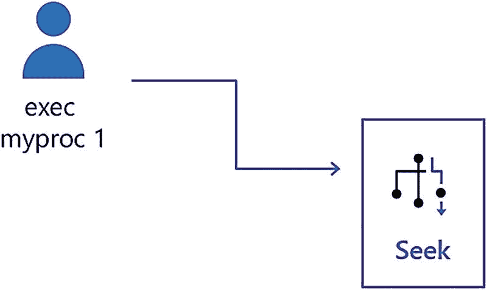
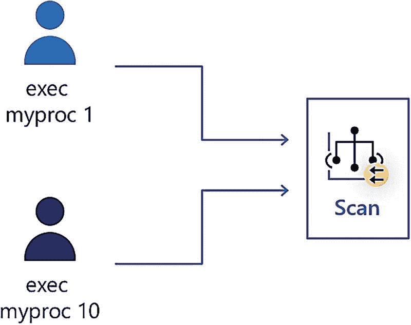
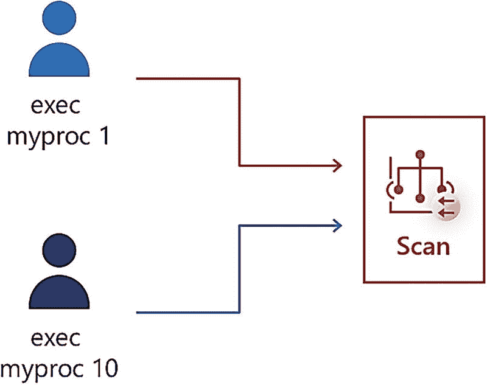

# 什么是参数敏感计划？

假设你创建了一个存储过程，并使用参数作为输入。然后你在 T-SQL 语句（例如 `WHERE` 子句）中使用该参数来筛选数据。查询首次编译时，优化器会确定参数的*值*，以决定该语句的最佳查询计划。这个查询计划随后将用于该存储过程的*任何*后续执行，无论传入的参数值是什么，直到该过程重新编译。计划缓存中，单个语句只能存在一个查询计划。因此，该计划在查询首次编译时对参数值是*敏感*的。这个问题被称为*参数嗅探*。

注意
许多 SQL 社区人士都说，我是多年前创造“*参数嗅探*”这个术语的人。有些人说是康纳·坎宁安 (Conor Cunningham)。我想这将永远是个谜。

对于许多工作负载和数据集，这种情况不会造成问题。但是，如果为某个特定参数值构建的查询计划并非执行其他参数值查询的最佳计划呢？*一些*用户可能会遇到糟糕或不一致的性能问题。当要被参数筛选的查询所涉及的数据是*倾斜的*——换句话说，在匹配参数的值上分布不均匀时，这个问题通常就会发生。

我在微软近三十年的职业生涯中，亲眼目睹过这个问题给客户带来性能问题。你可以阅读以下资源，进一步了解此问题以及如果你遇到此问题可以尝试的各种解决方法，包括

[`https://docs.microsoft.com/sql/relational-databases/query-processing-architecture-guide?#parameter-sensitivity`](https://docs.microsoft.com/sql/relational-databases/query-processing-architecture-guide?#parameter-sensitivity) 和 [`https://docs.microsoft.com/azure/azure-sql/identify-query-performance-issues?#resolving-queries-with-suboptimal-query-execution-plans`](https://docs.microsoft.com/azure/azure-sql/identify-query-performance-issues?#resolving-queries-with-suboptimal-query-execution-plans)

*但是，SQL Server 2022 有一个更好的解决方案，它内置于查询处理器中，无需任何代码更改。*

## 通过场景学习 PSP

这里是一个简单的可视化序列，展示了 PSP 可能引发问题的场景，如图 5-1 所示。

PSP 可能引发问题的场景示意图。图示如下：`Exec my proc 1` 向右箭头 `seek`。

**图 5-1**

存储过程执行导致了一个带有 `index seek` 的计划

在这个第一个场景中，用户执行存储过程时使用的参数值为 1（可能基于应用程序的用户输入）。过程中使用此参数值筛选行的查询被编译，查询计划使用了 `index seek` 运算符，因为表中只有少数行匹配值 1。这个查询可能运行得极快。

假设在不受任何人控制的情况下，内存压力导致该查询计划被从计划缓存中清除。那么，如果此时另一个用户来执行相同的存储过程，但参数为 10，会怎样呢？如图 5-2 所示。

另一个用户此时来执行相同存储过程但参数为 10 的场景示意图。图示如下：`Exec my proc 1` 和 `exec my proc 1` 向右箭头 `scan`。

**图 5-2**

相同的存储过程使用不同的参数生成了一个带有 `index scan` 的计划

如果表中有许多行匹配值 10 作为筛选条件，在编译新计划时，优化器可能转而使用聚集 `index scan`（甚至使用并行）。这完全正常，对于使用值 10 执行过程的用户来说，性能可能被认为是正常的。现在，两个用户都被绑定到这个扫描计划中。

那么，现在使用参数 1 执行过程的第一个用户会怎样呢？如图 5-3 所示，这种情况可能就不妙了。

使用参数 1 执行过程的示意图。图示如下：`Exec my proc 1` 和 `exec my proc 1` 向右箭头 `scan`。

**图 5-3**

第一个用户体验到由于 PSP 导致的性能下降

一个只需查找少数几行的查询，现在可能需要扫描数百万行才能得到结果。这种行为很容易导致性能下降。很可能，使用该过程的应用程序用户会简单地说：“它突然就变慢了。”听起来熟悉吗？

这个问题完全源于一个事实：对于特定的 T-SQL 语句，缓存中只能存在一个计划。而数据的倾斜可能意味着一个计划无法满足各种参数值的需求。并且，作为存储过程的开发者，数据倾斜并非你的错。因此，与其面对你可能遇到的各种变通方法和性能调优的困扰，不如让我们看看 `SQL Server 2022` 中针对此问题的一个解决方案，坦率地说，这是一个“改变游戏规则”的方案。

