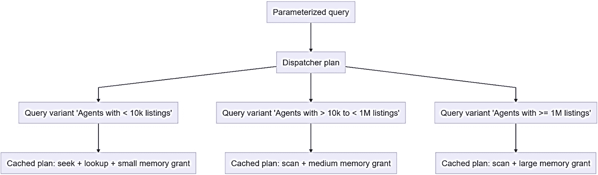
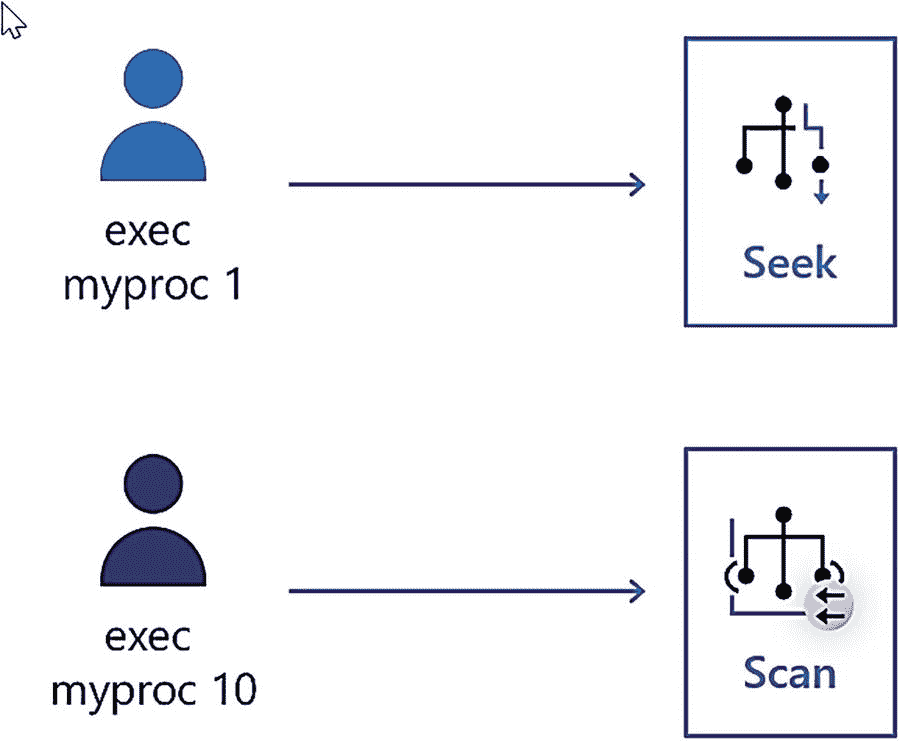
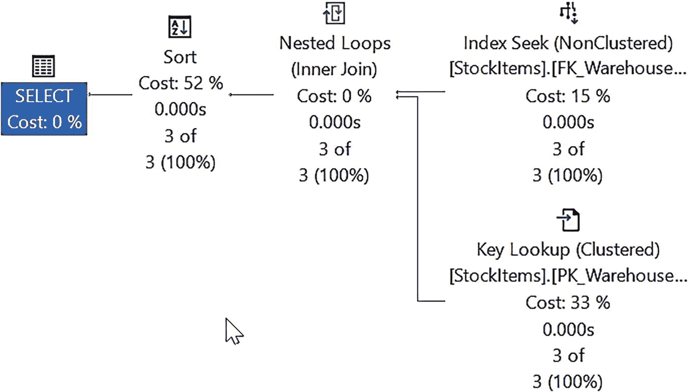
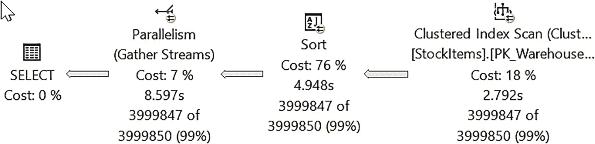
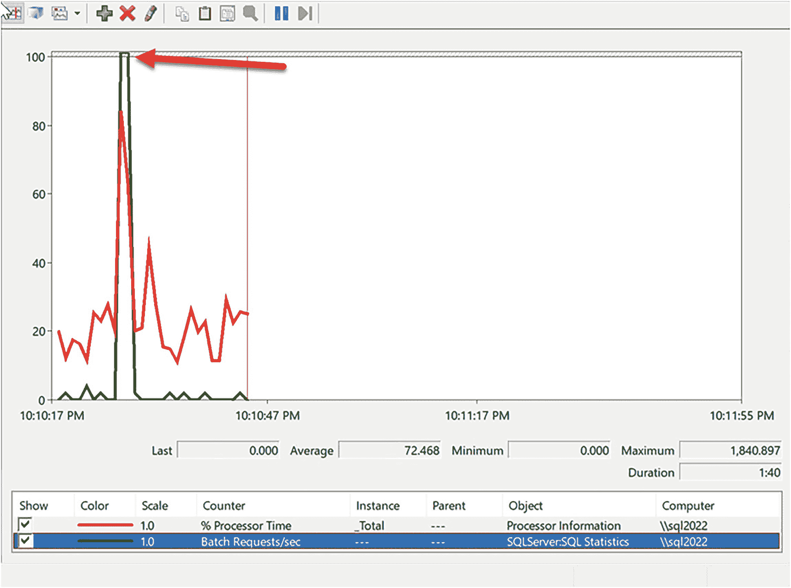
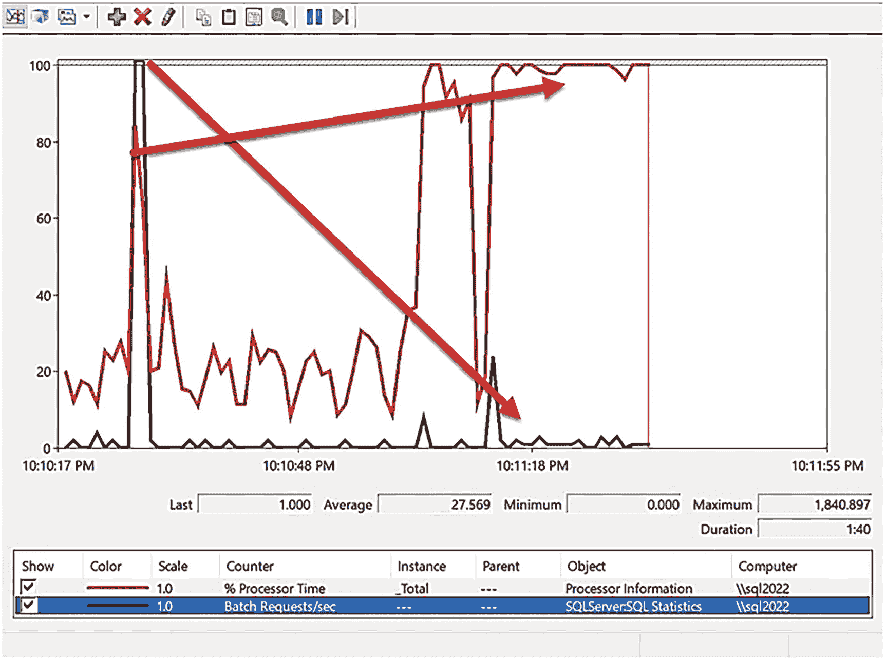
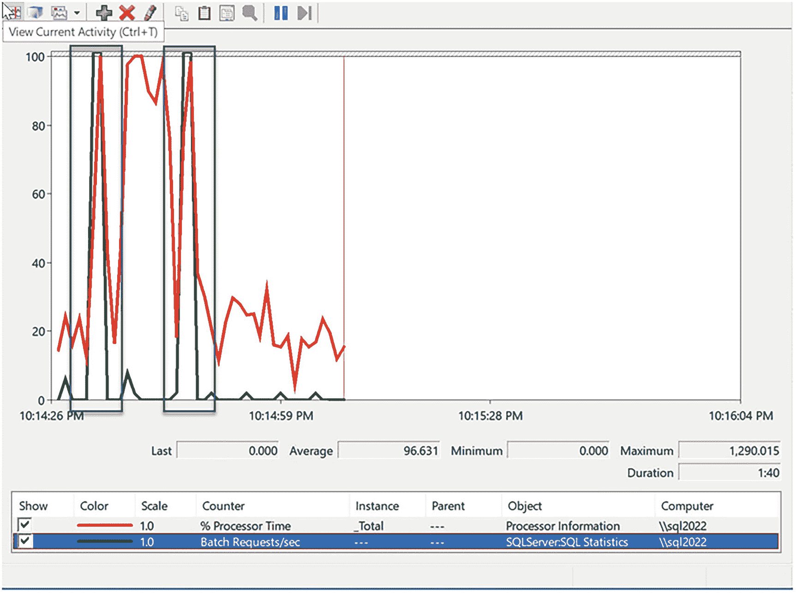
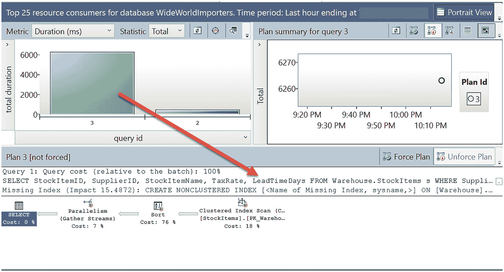
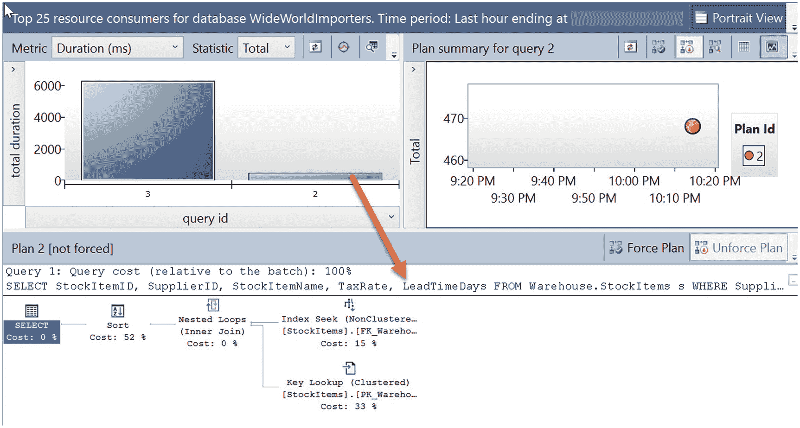
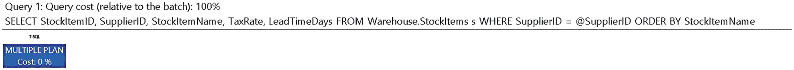

# 一切如何开始

2020 年初，我在德克萨斯州欧文市的微软办公室。那时，我在 CSS 团队所在的大楼里有一间真正的办公室。由于我为 CSS 工作了多年，当我加入工程团队时，他们让我保留了办公室。那时，我的一位前 CSS 同事，Jack Li，也作为一名开发人员加入了工程部。他也在欧文办公室保留了一个工位。当时天色已晚，我正准备离开，顺道去 Jack 的工位看看他在不在。幸运的是他在，于是我们聊了一会儿家常、一些在 CSS 时的趣事，以及我们各自在工程部门的工作情况。然后我对 Jack 说：*“嘿*，你最近在忙什么？” 他是个非常谦虚的人，但他说：*“嗯*，实际上是件大事。我正在写一些代码来解决参数嗅探问题。” 我停顿了一下消化这个信息，然后说了类似*“你在开玩笑吧。我想了解更多。” 可能让我们俩的妻子都懊恼的是，接下来的两个小时我们一直待到很晚在讨论这个项目。结束时，我记得对他说：*“Jack，这可是主题演讲级别的演示材料。当你展示这个时，SQL 世界会为之沸腾。”*

正如你可以从时间线想象到的，世界有点乱套了，我与 Jack 关于此事的讨论也就搁置了。时间快进到 2021 年春天，我收到了 Jack 的一封电子邮件：*“嘿，Bob，还记得我之前在研究的参数嗅探项目吗？嗯，它要实现了，我们认为可以把它放进项目 Dallas*。” Jack 将此解决方案称为**参数敏感计划 (PSP) 优化**。那天我的工作都停了。我立刻打电话给他了解细节。当我们谈完，我知道我确实拥有了一个主题演讲级别的演示，以及 `SQL Server 2022` 一个主要功能的亮点。

注意
在主题演讲中展示这个功能确实在 2021 年的 PASS Community Summit 上发生了。感谢 Jack 给了我可以在主题演讲中使用的演示。主题演讲是虚拟的，但做起来仍然很棒。请查看此视频链接 [`https://youtu.be/Ydlg1KpmrKU`](https://youtu.be/Ydlg1KpmrKU) 并快进到大约 17 分钟处。Peter Carlin 介绍我来演示这项新功能，当然，即使我们不在同一个房间或城市，康纳和鲍勃的节目也必须存在！

### PSP 优化如何工作？

PSP 优化的概念简单而强大。

> 注意
>
> 我要事先向您说明，我们确实不确定能否解决所有的 PSP 问题。我们知道这项工作的初版存在局限性。但我们确实相信，对于受参数探查影响的应用程序，它有真正的可能性产生积极影响。

要实现 PSP 优化，我们已在查询处理器中为查询计划构建了新的概念。一个`调度程序`查询计划是`参数化`SQL 语句的父查询计划，并存储在`计划缓存`中。参数化语句可以存在于存储过程中，由应用程序参数化，甚至可以由 SQL Server 引擎自动参数化。您可以在 [`https://docs.microsoft.com/sql/relational-databases/performance/parameter-sensitivity-plan-optimization?#understanding-parameterization`](https://docs.microsoft.com/sql/relational-databases/performance/parameter-sensitivity-plan-optimization?#understanding-parameterization) 阅读更多关于参数化的内容。

调度计划本身不用于执行。相反，一个调度计划可以有多个`变体`计划。变体计划是基于参数化查询中使用的`谓词`或过滤器的值桶（bucket）或范围创建的。图 5-4 展示了调度器和变体如何工作的示意图。



调度器与变体工作原理图表。参数化查询导向调度计划。调度计划导向针对少于 1 万条列表的查询变体代理、针对 1 万到 100 万条列表的查询变体代理、针对大于或等于 1 千条列表的查询变体代理等。

图 5-4

PSP 优化下的调度器与查询变体

在此图中，您可以看到有三个变体，每个变体对应一个查询，覆盖匹配某个谓词或过滤器的特定“范围”（即值桶）。这个概念有趣的地方在于，它也可以帮助解决我在第 4 章讨论的一些`内存授予`问题。这是因为每个变体计划在`计划缓存`中是“其自身的计划”，即使两个变体使用了类似的`计划形状`（例如，索引扫描），它们也可以包含不同的内存授予。

> 注意
>
> 图 5-4 是一个展示调度器和变体概念的图表。调度器可以使用多少个变体或桶的设计是内部实现，且未公开记录。

当查询首次编译时，查询处理器可以识别参数化语句，检查它是否符合调度器和查询变体的条件。第一次执行将产生一个调度器和一个变体。如果使用落入另一个桶的不同参数执行同一语句，则可以编译新的变体计划并将其存储到缓存中。

调度器和变体计划不会被持久化。它们只存在于计划缓存中，但可以在需要时通过新的编译重新构建。变体计划也可以根据需要单独重新编译。

让我们回顾一下本节前面展示 PSP 问题的可视化场景。在相同的场景中，如果启用了 `dbcompat 160`，现在的情况如图 5-5 所示。



允许缓存中存在多个计划的 PSP 优化示意图。示意图如下：`exec my_proc_1` 向右箭头 寻找，`exec my_proc_10` 向右箭头 扫描。

图 5-5

PSP 优化允许缓存中存在多个计划

无需更改代码，优化器就可以使用变体，为存储过程或参数化语句在缓存中保留多个计划。了解 PSP 优化工作原理的最好方法莫过于亲自尝试。

### 让我们看看 PSP 优化的实际应用

这个练习有一长串步骤，但我认为您会发现它值得一试。

#### 先决条件

要进行此练习，您需要满足以下先决条件：

*   `SQL Server 2022 评估版`。
*   虚拟机或计算机，至少配备 2 个 CPU 和 8GB 内存。
*   `SQL Server Management Studio (SSMS)`。最新的 18.x 或 19.x 版本均可。
*   从 [`https://aka.ms/ostress`](https://aka.ms/ostress) 下载 `ostress.exe`。使用下载的 `RMLSetup.msi` 文件进行安装。使用所有默认设置。仅在 Windows 系统上下载此工具。以下部分练习仅在 Windows 系统上运行。
*   从本书 GitHub 仓库的 `ch05_builtinqueryintelligence_getsbetter\pspopt` 目录获取脚本副本。

#### 遵循以下练习步骤

请遵循以下步骤，了解 PSP 优化如何工作：



一个使用索引查找的查询计划流程图。其中包含：键查找（聚集，StockItems.PK_Warehouse，成本 33%，0.000 秒，3/3，100%）、索引查找（非聚集，StockItems.FK_Warehouse，成本 15%，0.000 秒，3/3，100%），这些操作导向嵌套循环，等等。

图 5-6

存储过程参数的索引查找计划

1.  从 [`https://aka.ms/WideWorldImporters`](https://aka.ms/WideWorldImporters) 下载 WideWorldImporters 的备份副本。下一步中的脚本假设备份文件位于 `c:\sql_sample_databases`。你也可以使用一个预加载了扩展数据的定制备份，可从 [`https://github.com/microsoft/sqlworkshops-sql2022workshop/releases`](https://github.com/microsoft/sqlworkshops-sql2022workshop/releases) 获取。

2.  还原 WideWorldImporters 示例备份。你可以编辑并使用 `restorewwi.sql` 脚本。此脚本专为 Azure 虚拟机市场映像上的 SQL Server 设计，该映像为数据和日志文件提供了单独的磁盘。请编辑此文件以匹配你的文件路径。此脚本包含以下 T-SQL 语句：

    ```
    USE master;
    GO
    DROP DATABASE IF EXISTS WideWorldImporters;
    GO
    -- 编辑文件位置以匹配你的存储
    RESTORE DATABASE WideWorldImporters FROM DISK = 'c:\sql_sample_databases\WideWorldImporters-Full.bak' with
    MOVE 'WWI_Primary' TO 'e:\data\WideWorldImporters.mdf',
    MOVE 'WWI_UserData' TO 'e:\data\WideWorldImporters_UserData.ndf',
    MOVE 'WWI_Log' TO 'f:\log\WideWorldImporters.ldf',
    MOVE 'WWI_InMemory_Data_1' TO 'e:\data\WideWorldImporters_InMemory_Data_1',
    stats=5;
    GO
    ```

3.  执行 `populatedata.sql` 脚本，向 `Warehouse.StockItems` 表加载更多数据。此脚本需要运行 5-10 分钟（具体时间取决于 CPU 数量和磁盘速度）。此脚本执行以下 T-SQL 语句（练习中不会为我最喜欢的运动队道歉），这些语句向 Warehouse.StockItems 表添加数据以创建数据倾斜场景：

    ```
    USE WideWorldImporters;
    GO
    -- 添加 StockItems 以在供应商中造成数据倾斜
    --
    DECLARE @StockItemID int;
    DECLARE @StockItemName varchar(100);
    DECLARE @SupplierID int;
    SELECT @StockItemID = 228;
    SET @StockItemName = 'Dallas Cowboys Shirt'+convert(varchar(10), @StockItemID);
    SET @SupplierID = 4;
    DELETE FROM Warehouse.StockItems WHERE StockItemID >= @StockItemID;
    SET NOCOUNT ON;
    BEGIN TRANSACTION;
    WHILE @StockItemID <= 8000000
    BEGIN
    INSERT INTO Warehouse.StockItems
    (StockItemID, StockItemName, SupplierID, UnitPackageID, OuterPackageID, LeadTimeDays,
    QuantityPerOuter, IsChillerStock, TaxRate, UnitPrice, TypicalWeightPerUnit, LastEditedBy
    )
    VALUES (@StockItemID, @StockItemName, @SupplierID, 10, 9, 12, 100, 0, 15.00, 100.00, 0.300, 1);
    SET @StockItemID = @StockItemID + 1;
    SET @StockItemName = 'Dallas Cowboys Mug'+convert(varchar(10), @StockItemID);
    END;
    COMMIT TRANSACTION;
    SET NOCOUNT OFF;
    GO
    ```

4.  使用脚本 `rebuild_index.sql` 重建与表关联的索引。

    **重要提示** 如果错过此步骤，将无法看到 PSP 优化带来的性能提升。此脚本使用以下 T-SQL 语句：

    `USE WideWorldImporters;`
    `GO`
    `ALTER INDEX FK_Warehouse_StockItems_SupplierID ON Warehouse.StockItems REBUILD;`
    `GO`

5.  使用脚本 `proc.sql` 创建一个用于练习的新过程。此脚本使用以下 T-SQL 语句：

    ```
    USE WideWorldImporters;
    GO
    CREATE OR ALTER PROCEDURE [Warehouse].[GetStockItemsbySupplier]  @SupplierID int
    AS
    BEGIN
    SELECT StockItemID, SupplierID, StockItemName, TaxRate, LeadTimeDays
    FROM Warehouse.StockItems s
    WHERE SupplierID = @SupplierID
    ORDER BY StockItemName;
    END;
    GO
    ```

    可以看到，此存储过程接受单个参数 `@SupplierID`，并将使用此参数作为谓词或筛选器来查找 `StockItems` 表中的行。

6.  使用 SSMS 执行脚本 `setup.sql`。这将确保 `WideWorldImporters` 数据库处于 `dbcompat` 150（因此最初未启用 PSP）并清空查询存储。此脚本使用以下 T-SQL 语句：

    ```
    USE WideWorldImporters;
    GO
    ALTER DATABASE current SET COMPATIBILITY_LEVEL = 150;
    GO
    ALTER DATABASE current SET QUERY_STORE CLEAR;
    GO
    ```

7.  在 SSMS 中打开一个新的查询编辑器窗口（我喜欢在对象资源管理器中选择数据库，然后使用文件 ➤ 新建 ➤ 数据库引擎查询菜单），并选择菜单上的“包括实际执行计划”按钮。在 SSMS 的查询窗口中执行脚本 `query_plan_seek.sql` 两次。该脚本使用以下 T-SQL 语句：

    ```
    USE WideWorldImporters;
    GO
    SET STATISTICS TIME ON;
    GO
    USE WideWorldImporters;
    GO
    -- 此参数的最佳计划是索引查找
    EXEC Warehouse.GetStockItemsbySupplier 2;
    GO
    ```

    注意查询执行速度很快（< 1 秒）。检查第二次执行时 `SET STATISTICS TIME ON` 的计时（使用最后一组计时）。查询运行两次，因此第二次执行不需要编译。这是我们想要比较的时间。如果选择 `消息` 选项卡并向下滚动到最后一组计时，你的结果应类似于以下内容（你的计时可能有所不同，但应相当接近）：

    ```
    SQL Server 执行时间:
       CPU 时间 = 15 ms，已用时间 = 34 ms。
    SQL Server 执行时间:
       CPU 时间 = 15 ms，已用时间 = 34 ms。
    ```

    如果选择结果窗口中的“执行计划”选项卡，可以看到查询计划使用了索引查找，如图 5-6 所示。



一个针对不同参数的聚集索引扫描流程图。包含：聚集索引扫描（StockItems.PK_Warehouse，成本 18%，2.792 秒，3999847/3999850，99%）导向排序（成本 76%，4.948 秒，3999847/3999850，99%），再导向并行度（成本 7%，8.597 秒，3999847/3999850，99%），最后导向选择（成本 0%）。

图 5-7

不同参数的聚集索引扫描

1.  在另一个查询窗口中，在 SSMS 中选择“包括实际执行计划”菜单按钮。执行脚本 `query_plan_scan.sql`。执行可能需要长达 ~30 秒。此脚本使用以下 T-SQL 语句：

    ```
    USE WideWorldImporters;
    GO
    ALTER DATABASE SCOPED CONFIGURATION CLEAR PROCEDURE_CACHE;
    GO
    -- 此参数的最佳计划是索引扫描
    EXEC Warehouse.GetStockItemsbySupplier 4;
    GO
    ```

    此脚本将模拟计划缓存清除，以便在执行存储过程时，查询处理器必须编译新的查询计划。如果选择结果窗口中的“执行计划”选项卡，你将看到类似于图 5-7 的查询计划。

你可以看到新的查询计划使用了聚集索引扫描和平行度。



一个折线图窗口截图，包含各种选项。该折线图绘制了“处理器时间百分比”和“批处理请求数/秒”随时间变化的数字。一个箭头指向“批处理请求数/秒”的最大值。

图 5-8

初始索引查找计划的工作负载吞吐量

1.  再次运行脚本 `query_plan_seek.sql`。已用时间仍然很快（< 1 秒），但如果你查看“消息”选项卡中的计时，会发现它明显变慢了。如果选择“执行计划”选项卡，你现在会看到此查询正在使用带有聚集索引扫描的新计划。这是因为同一存储过程中的语句在缓存中只能有一个计划。

    **注意** 如果你想仅从单次执行中查看 PSP 优化，你可以选择在此处执行脚本 `dbcompat160.sql`，然后使用 `query_index_seek.sql` 和 `query_index_scan.sql` 重复前面的步骤。你将看到每次执行都可以有它自己的计划。要查看 PSP 优化对工作负载的影响，请继续后续步骤。如果你尝试使用这些 SQL 脚本体验 PSP 优化并希望继续后续步骤，请运行 `setup.sql` 来重置练习。**后续步骤仅适用于 Windows 系统，但你可以修改脚本以在 Windows 系统上运行 ostress.exe 来连接 Linux 或容器上的 SQL Server。**

2.  启动 Windows 性能监视器（你可以直接在命令提示符下键入 `perfmon`）。保留默认计数器 `% Processor Time`。添加计数器 `SQL Server:SQL Statistics Batch Requests/Sec`。我喜欢使用批处理请求数/秒作为工作负载吞吐量的简单度量。我建议你更改其中一个计数器的颜色。我还喜欢增加计数器的宽度以使其更易于阅读（通过右键单击计数器并选择“属性”可获取颜色和宽度）。

3.  检查脚本 `workload_index_seek.cmd`。此脚本将使用 `ostress.exe` 模拟多个用户重复执行存储过程，其值理想情况下将在查询计划中使用索引查找。该脚本假定连接到本地服务器并使用 Windows 身份验证。请根据需要修改脚本。该脚本使用以下命令：
    *   `-n` 参数是用户数（`ostress` 使用线程）。这是你在执行脚本时提供的值。在双 CPU 机器上，十个用户就足够了。你可能希望在具有更多 CPU 的机器上增加此数字以看到更明显的影响。
    *   `-r` 参数是迭代次数。
    *   `-q` 参数是“安静模式”，用于丢弃结果，因为我们只想看运行速度有多快。

    ```
    "c:\Program Files\Microsoft Corporation\RMLUtils\ostress" -E -Q"EXEC Warehouse.GetStockItemsbySupplier 2;" -n%1 -r200 -q –dWideWorldImporters
    ```

4.  从命令提示符执行脚本 `workload_index_seek.cmd 10`。该命令应在一两秒内完成。记下 `perfmon` 中的值。你的结果应类似于图 5-8。



一个折线图窗口截图，包含各种选项。该折线图绘制了“处理器时间百分比”和“批处理请求数/秒”等随时间变化的数字。

图 5-9

因 PSP 导致工作负载吞吐量下降

1.  从命令提示符执行脚本 `workload_index_scan.cmd`。这可能需要更长时间，但仍应在几秒内完成。此脚本使用以下命令：

    ```
    "c:\Program Files\Microsoft Corporation\RMLUtils\ostress" -E -Q"ALTER DATABASE SCOPED CONFIGURATION CLEAR PROCEDURE_CACHE;" -n1 -r1 -q -oworkload_wwi_regress -dWideWorldImporters
    "c:\Program Files\Microsoft Corporation\RMLUtils\ostress" -E -Q"EXEC Warehouse.GetStockItemsbySupplier 4;" -n1 -r1 -q -oworkload_wwi_regress -dWideWorldImporters
    ```

    此脚本模拟计划缓存清除，并执行将导致使用聚集索引扫描编译查询计划到缓存中的存储过程。

2.  再次从命令提示符执行脚本 `workload_index_seek.cmd 10`。注意该命令不会在几秒内完成。查看 `perfmon` 并将其与之前的执行进行比较。你会看到批处理请求数/秒严重下降，CPU 利用率飙升至 100%，如图 5-9 所示。

此示例演示了更改为使用聚集索引扫描的计划所带来的整体影响。现在，多个用户同时使用并行度扫描表。



一个折线图窗口截图，包含各种选项。该折线图绘制了“处理器时间百分比”和“批处理请求数/秒”等随时间变化的数字。左上角弹出通知写着“查看当前活动”。

图 5-10

使用 PSP 优化实现一致的性能

1.  在查看解决方案之前，从 SSMS 执行脚本 `suppliercount.sql`。此脚本使用以下 T-SQL 语句：

    ```
    USE WideWorldImporters;
    GO
    SELECT SupplierID, count(*) as supplier_count
    FROM Warehouse.StockItems
    GROUP BY SupplierID;
    GO
    ```

    如果查看结果，你会看到数据存在倾斜。`SupplierID = 2` 只有几行，而 `SupplierID = 4` 有数百万行。

2.  现在让我们看看 SQL Server 2022 如何在不更改代码的情况下解决此问题。在 SSMS 中执行 SQL 脚本 `dbcompat160.sql`。此脚本使用以下 T-SQL 语句：

    ```
    USE WideWorldImporters;
    GO
    ALTER DATABASE CURRENT SET COMPATIBILITY_LEVEL = 160;
    GO
    ALTER DATABASE SCOPED CONFIGURATION CLEAR PROCEDURE_CACHE;
    GO
    ALTER DATABASE CURRENT SET QUERY_STORE CLEAR;
    GO
    ```

    此脚本将 `dbcompat` 级别更新为 160，从而启用 PSP 优化。为了重置环境，我们将清除计划缓存和查询存储。

3.  从命令提示符执行脚本 `workload_index_seek.cmd 10`。它应在几秒内完成。接下来，从命令提示符执行 `workload_index_scan.cmd`。最后，再次从命令提示符执行 `workload_index_seek.cmd 10`。注意两次执行几乎在同一时间完成。`Perfmon` 也应显示两次执行的结果一致，如图 5-10 所示。

紫色的两个矩形形状代表了启用 PSP 优化后，`workload_index_seek.cmd` 两次执行之间的一致性能。

你可以看到，借助 PSP 优化，现在无需更改代码即可实现一致的性能。

1.  启用查询存储后，我们可以深入了解不同的计划、调度程序和变体。

    **注意** 查询存储对于 PSP 优化不是必需的，但对于深入了解查询性能可能很有用。

使用 SSMS，在对象资源管理器的查询存储中，选择“资源消耗最高的查询”报告。图 5-11 显示了来自存储过程的查询使用聚集索引扫描的查询变体计划。



一个名为“WideWorldImporters 数据库的前 25 个资源消耗者”的截图。截图左侧有一个条形图，右侧是查询 3 的计划摘要，底部是“计划 3，未强制”。一个箭头从条形图指向文本，文本写着“仓库中的前置时间天数（计划 3，未强制）”。

图 5-11

聚集索引扫描查询变体计划

图 5-12 显示了另一个 `query_id`，它使用索引查找，但针对的是相同的查询文本。



一个名为“WideWorldImporters 数据库的前 25 个资源消耗者”的截图。截图左侧有一个条形图，右侧是查询 2 的计划摘要，底部是“计划 2，未强制”。一个箭头从条形图指向文本，文本写着“仓库中的前置时间天数（计划 2，未强制）”。

图 5-12

索引查找查询变体计划

我说过 PSP 优化允许同一查询有多个计划，但为什么查询存储认为有两个“查询”？让我们使用查询存储元数据进一步查看。



一个图形化的显示计划运算符。显示计划运算符中的文本写着：查询 1，查询成本，100%；从仓库.库存项目中选择库存项目 ID、供应商 ID、库存项目名称、前置时间天数，其中供应商 ID 等于 @供应商 ID，按库存项目名称排序；以及多重计划，成本 0%。

图 5-13

一个调度程序计划运算符

1.  执行脚本 `query_store_plans.sql`。此脚本执行以下 T-SQL 语句：

    ```
    USE WideWorldImporters;
    GO
    -- 查看变体的查询和计划
    -- 注意每个查询都来自相同的 parent_query_id，并且 query_hash 相同
    SELECT qt.query_sql_text, qq.query_id, qv.query_variant_query_id, qv.parent_query_id,
    qq.query_hash,qr.count_executions, qp.plan_id, qv.dispatcher_plan_id, qp.query_plan_hash,
    cast(qp.query_plan as XML) as xml_plan
    FROM sys.query_store_query_text qt
    JOIN sys.query_store_query qq
    ON qt.query_text_id = qq.query_text_id
    JOIN sys.query_store_plan qp
    ON qq.query_id = qp.query_id
    JOIN sys.query_store_query_variant qv
    ON qq.query_id = qv.query_variant_query_id
    JOIN sys.query_store_runtime_stats qr
    ON qp.plan_id = qr.plan_id
    ORDER BY qv.parent_query_id;
    GO
    ```

    如果查看结果，你会看到以下有趣之处：
    *   两个 `query_id` 的 `query_hash` 值相同。
    *   有两个 `query_variant_id` 值，它们具有相同的 `parent_query_id`（调度程序）。这些值来自查询存储中一个名为 `sys.query_store_query_variant` 的新 DMV。
    *   如果展开 `query_sql_text` 值，你将看到来自存储过程的 SELECT 语句，但添加了类似 `option (PLAN PER VALUE(ObjectID = 1835153583, QueryVariantID = 1, predicate_range([WideWorldImporters].[Warehouse].[StockItems].[SupplierID] = @SupplierID, 100.0, 1000000.0)))` 和 `option (PLAN PER VALUE(ObjectID = 1835153583, QueryVariantID = 3, predicate_range([WideWorldImporters].[Warehouse].[StockItems].[SupplierID] = @SupplierID, 100.0, 1000000.0)))` 的选项。这个附加文本就是为什么技术上有两个查询，但它们*哈希*到相同的 `query_hash` 值。我们如何决定查询变体以及 `predicate_range()` 函数的实现细节目前是内部专用的。我们不希望任何人依赖这些细节，因为随着我们改进 PSP 优化，可能会更改它们。但我会给你一些见解：变体和 `predicate_range` 的概念基于我在标题为“**PSP 优化如何工作？**”的章节和图 5-4 中描述的 PSP 优化概念。对于此父计划，基于基数和谓词匹配，存在三种可能的变体：行数 <=100 的变体、行数在 100 到 1M 之间的变体以及行数 >= 1M 的变体。
    *   如果查看每个查询变体的 `xml_plan` 列的详细信息，一个名为 `<Dispatcher>` 的新部分包含 `<QueryPlan>` 部分中的 `QueryVariantID`，其中包含变体和 `predicate_range` 的详细信息。

2.  执行脚本 `query_store_parent_query.sql`。此脚本使用以下 T-SQL 语句：

    ```
    USE WideWorldImporters;
    GO
    -- 查看“父”查询
    -- 注意这是存储过程中的 SELECT 语句，没有变体的 OPTION。
    SELECT qt.query_sql_text
    FROM sys.query_store_query_text qt
    JOIN sys.query_store_query qq
    ON qt.query_text_id = qq.query_text_id
    JOIN sys.query_store_query_variant qv
    ON qq.query_id = qv.parent_query_id;
    GO
    ```

    结果将是存储过程中查询的 SQL 语句文本，*没有*变体选项，如下所示：

    ```
    (@SupplierID int)SELECT StockItemID, SupplierID, StockItemName, TaxRate, LeadTimeDays  FROM Warehouse.StockItems s  WHERE SupplierID = @SupplierID  ORDER BY StockItemName
    ```

3.  执行脚本 `query_store_dispatcher_plan.sql`。此脚本使用以下 T-SQL 语句：

    ```
    USE WideWorldImporters;
    GO
    -- 查看调度程序计划
    -- 如果你“点击” SHOWPLAN XML 输出，你将看到一个“多重计划”运算符
    SELECT qp.plan_id, qp.query_plan_hash, cast (qp.query_plan as XML) as dispatcher_plan
    FROM sys.query_store_plan qp
    JOIN sys.query_store_query_variant qv
    ON qp.plan_id = qv.dispatcher_plan_id;
    GO
    ```

    如果点击 `dispatcher_plan` 的值，你将看到一个如图 5-13 所示的图形化显示计划运算符。

这是一个用于调度程序计划的新运算符，它不执行查询，而是变体查询计划的父级。

我知道这是一个漫长的练习，但我希望你觉得它值得！此示例向你展示了 PSP 优化的强大功能以及一些关于其工作原理的见解。


### 关于 PSP 优化，我还应了解哪些其他细节？

以下是我认为你会觉得有用的其他一些 PSP 优化细节。

#### 查阅最新信息

首先，请务必查阅我们文档中关于 PSP 优化的所有最新信息：[`https://aka.ms/pspopt`](https://aka.ms/pspopt)。

#### 已知限制

在 SQL Server 2022 的初始版本中，PSP 优化存在以下限制：

*   我们仅支持 `WHERE` 子句中使用 `=` 运算符的谓词。
*   我们确实支持多个参数，但在存储过程中支持的数量和种类有限制。
*   除了启用或禁用 PSP 优化，你无法配置变体、桶或谓词范围的数量。由于每个计划的谓词数量有限，你的计划缓存不应变得“臃肿”。可能的缺点是，在某个变体中，你可能仍会遇到多个参数值因 `每个变体一个计划` 而产生问题的情况。
*   如果你在 SQL Server 中禁用了“参数嗅探”（parameter sniffing），我们将不会使用 PSP 优化。可以通过跟踪标志 `4136`、数据库作用域配置 `PARAMETER_SNIFFING` 或查询提示 `USE HINT('DISABLE_PARAMETER_SNIFFING')` 来禁用参数嗅探。
*   如果你使用了 `RECOMPILE` 提示或选项，我们会认为该查询“不可缓存”，因此不会对其应用 PSP 优化。
*   如果你使用了 `OPTIMIZE FOR` 查询提示（这是某些人用于规避 PSP 问题的权宜之计），我们将不会对该查询使用 PSP 优化。
*   PSP 优化 `支持` 针对临时表的查询。
*   在预览版期间构建此功能时，我们发现了一个问题：如何在存储过程和过程内的语句之间跟踪性能信息。例如，现在可能很难使用 `sys.dm_exec_query_stats` 和 `sys.dm_exec_procedure_stats` 等 DMV 将语句和过程关联起来进行性能分析。此外，在 `查询存储` 中，要将语句与存储过程关联起来，你需要使用 `sys.query_store_query_variant`，其中包含将调度程序计划（存储过程）与查询变体（过程中的语句）关联起来的信息。我们确实在查询的 `SHOWPLAN` 以及存储在 `查询存储` 中的变体语句文本中保存了 `object_id`。

让 PSP 优化发挥作用的一个现实是，“放手”一些你过去为避免此问题而做的事情。这可能需要你分阶段进行（例如，在查询级别使用变通方法，而非在数据库作用域级别），直到你能看清 PSP 优化能在多大程度上解决问题，而无需其他解决方案。

#### 使用诊断工具

我们提供了 `扩展事件` 来帮助你进一步查看 PSP 优化，包括以下事件：

`parameter_sensitive_plan_optimization_skipped_reason`

如果你认为 PSP 优化应该生效但实际没有，请启用此事件。该事件的 `reason`（原因）值会提供更多关于为何未使用 PSP 的上下文。你可能会发现有用的两个原因值是：

*   `NonCacheable` – 无法保存到计划缓存中的查询。可能是因为你使用了 `RECOMPILE` 提示，这可能导致此状态，而这一直是解决 PSP 问题的常见变通方法。
*   `SkewnessThresholdNotMet` – 这意味着“数据偏斜”不足以启用 PSP 优化。我们未公开该阈值。在我使用的例子中，行数是“数百万”，但阈值不一定必须是那个值。另请注意，如果统计信息不是最新的，即使存在数据偏斜，你也可能遇到此问题，因为我们依赖于统计信息。

`parameter_sensitive_plan_optimization`

这是一个仅 `调试` 通道的事件，但可以显示查询处理器正在使用查询变体。

你可以通过以下方式有意 `禁用` PSP 优化（除了前面列出的禁用其使用的变通方法）：

*   使用 `dbcompat level < 160`
*   使用数据库作用域配置 `PARAMETER_SENSITIVE_PLAN_OPTIMIZATION = OFF`（并且你可以使用此选项再次启用它）

### PSP 优化是一项强大的创新

我个人认为，这项创新将帮助许多人避免代价高昂且耗时的查询性能问题。对我来说，PSP 优化显然是 SQL Server 2022 中最好的功能之一。当我问 Jack Li 对 PSP 优化的看法时，他总结得最好：*“当涉及到数据偏斜等场景的参数化查询时，每个查询只有一个计划使得优化器无法选出一个满足所有条件的计划。通过允许每个查询有多个计划，参数敏感计划优化能够根据谓词的基数选择计划，从而实现最佳性能。”*

### 基数估算（CE）模型反馈

我清晰地记得，在 SQL Server 2014 发布之前，我曾到雷德蒙德参加一个被称为该版本“里程碑评审”的会议。那时我在 CSS（客户服务与支持）部门工作，经常在版本发布“早期”参加内部会议，为工程团队提供可支持性和客户视角。就是在那时，我第一次了解到将在 SQL Server 2014 中引入的新基数估算（CE）模型。

我理解这个概念。我们需要更新查询处理器关于基数的假设。我们使用的是 1998 年 SQL Server 7.0 发布时从旧 Sybase 代码创建新查询处理器时的假设。但在那些会议上，我戴着“支持”的帽子，所以即使我明白这可能是正确的做法，我还是确保要求提供一种在出现问题时“关闭”它的方法。

不幸的是，在过去的这些年里，需要为查询禁用这个新“模型”的情况发生的频率远超我们的预期。让我们先详细看看“CE 模型”到底是什么，以及为什么它会给客户带来问题。

### 什么是 CE 模型问题？

我认为我们文档中对基数的描述已经相当到位，具体可参考：[`https://docs.microsoft.com/sql/relational-databases/performance/cardinality-estimation-sql-server`](https://docs.microsoft.com/sql/relational-databases/performance/cardinality-estimation-sql-server)。以下是我从该文档中摘录的一段喜欢的引述：

> 查询优化器根据两个主要因素确定执行查询计划的成本：
>
> 在查询计划的每个级别处理的总行数，称为该计划的基数。
>
> 查询中使用的运算符所决定的算法成本模型。
>
> 第一个因素，即基数，被用作第二个因素（成本模型）的输入参数。因此，改进的基数估计能带来更优的成本估计，进而生成更快的执行计划。

基数估计是查询优化器在编译计划时，对运算符任一部分的唯一性进行估计的过程。有时这显而易见且简单，有时则不然。

当情况不那么明显时，`CE 模型`规定了 SQL Server 中的查询优化器如何对基数做出某些假设。在 SQL Server 7.0 中，我们在构建新查询处理器时重新设计了 CE 模型的假设。这些假设类型涉及的领域在我们的文档中有描述：[`https://docs.microsoft.com/sql/relational-databases/performance/cardinality-estimation-sql-server?#versions-of-the-ce`](https://docs.microsoft.com/sql/relational-databases/performance/cardinality-estimation-sql-server?#versions-of-the-ce)。该文档引入了 CE `版本`的概念。存在两个 CE 版本：(1) 我们在 SQL Server 7.0 中引入的 CE 模型；(2) 我们在 SQL Server 2014 中引入的新 CE 模型。文档还讨论了不同的 CE 模型场景，包括 `独立性`、`均匀性`、`包含性`和`包含关系`。

所有这些场景中，都没有绝对的对错答案。这是一个经典的“视情况而定”的情况。SQL Server 7.0 的 CE 模型，即 `遗留` CE 模型，做出了一些特定的假设。在 SQL Server 2014 中，我们对 CE 模型进行了更改，使其我们认为更符合“现代”工作负载。像 `关联性` 和 `包含性` 这样的概念得到了更新。关联性是其中比较有趣的问题之一，它涉及优化器如何决定列之间是否 `相关`。

我们相信这会让优化器更“准确”。在许多情况下，我们确实做到了。事实上，在许多情况下，我们通过这个新模型提高了查询性能。如果你使用的 `dbcompat` 级别是 120（SQL Server 2014 的默认级别），那么 `新` CE 模型就会生效。

不幸的是，这个新模型所做的某些假设并不适用于所有工作负载。尽管我们试图构建一个更准确的模型，但这并不总是带来相同或更好的性能，有时甚至会导致性能下降。

我们引入了跟踪标志、查询提示，甚至数据库选项来使用 `遗留` CE 模型。这些主题本身可能很详细，即使对于经验丰富的 SQL 专业人士来说也难以理解。我鼓励你阅读以下两份额外资源以了解更多信息：

*   我们撰写的一篇关于为何构建新 CE 模型的博客：[`https://cloudblogs.microsoft.com/sqlserver/2014/03/17/the-new-and-improved-cardinality-estimator-in-sql-server-2014/`](https://cloudblogs.microsoft.com/sqlserver/2014/03/17/the-new-and-improved-cardinality-estimator-in-sql-server-2014/)
*   由著名专家 Joe Sack 撰写的一份极其详细的白皮书：[`https://download.microsoft.com/download/d/2/0/d20e1c5f-72ea-4505-9f26-fef9550efd44/optimizing%20your%20query%20plans%20with%20the%20sql%20server%202014%20cardinality%20estimator.docx`](https://download.microsoft.com/download/d/2/0/d20e1c5f-72ea-4505-9f26-fef9550efd44/optimizing%2520your%2520query%2520plans%2520with%2520the%2520sql%2520server%25202014%2520cardinality%2520estimator.docx)

关键问题是，客户会告诉我们，他们升级到 SQL Server 2014 并使用了新的 `dbcompat` 120 级别后，“速度反而变慢了”。虽然这不是普遍存在的投诉，但也足以引起问题。因此，多年来，客户已经习惯于使用遗留 CE 模型配合最新的 `dbcompat` 级别。

于是，`CE 反馈` 机制应运而生，试图帮助解决其中一些冲突。

#### CE 反馈如何工作？

`CE 反馈` 是查询优化器与查询存储之间的一种协作机制，旨在识别符合 CE 模型问题的查询模式，然后使用查询提示来纠正问题。

优化器会执行查询编译过程。如果它识别出一个适合进行 CE 模型反馈的 CE 模型模式，它将保存一个可能使查询运行更快的查询提示。我们采取的方法是保守的，查询必须以相同的查询文本运行一定次数后，我们才会尝试 `分析` 是否适用 CE 反馈。

一旦我们分析出适用 CE 反馈，那么在下一次查询执行时，我们会尝试应用该查询提示，并执行一次 `验证`，以检查该提示是否使查询的 CPU 时间变得更好或更差（它可能只是略有改善，这不被认为足够好到可以继续使用该提示）。如果验证成功，我们会将查询提示和反馈保存在查询存储中。如果不成功，则视为一次性能下降，我们不会使用或保存该提示。我们还会在查询存储中记录该反馈导致性能下降的事实。

### 尝试一个练习

让我们通过一个涉及 `关联性` 场景的 CE 反馈练习。

#### 先决条件

为了尝试此练习，你需要满足以下先决条件：

*   SQL Server 2022 评估版。
*   虚拟机或计算机，至少配备两个 CPU 和 8Gb 内存。

> **注意**
>
> 此示例的计时对 `CPU 非常敏感`。我使用过几台虚拟机和计算机都能看到此问题，但较旧或速度较慢的 CPU 可能无法让你在这个特定练习中观察到 CE 反馈的效果。我的测试使用的是 Azure 虚拟机 Standard_D2ds_v5（两个 vCPU，8Gb 内存）。我们的 Azure 文档指出，此虚拟机大小使用的是第三代 Intel® Xeon® Platinum 8370C（Ice Lake）处理器，全核睿频时钟速度最高可达 3.5 GHz。我认为关键之一是要使用 `专用` 虚拟机或计算机。其他程序的任何 CPU 周期都可能干扰纯粹的 CPU 工作负载。

*   SQL Server Management Studio (SSMS)。最新的 18.x 或 19.x 版本均可。
*   本书 GitHub 仓库中 `ch05_builtinqueryintelligence_getsbetter\cefeedback` 目录下的脚本副本。

