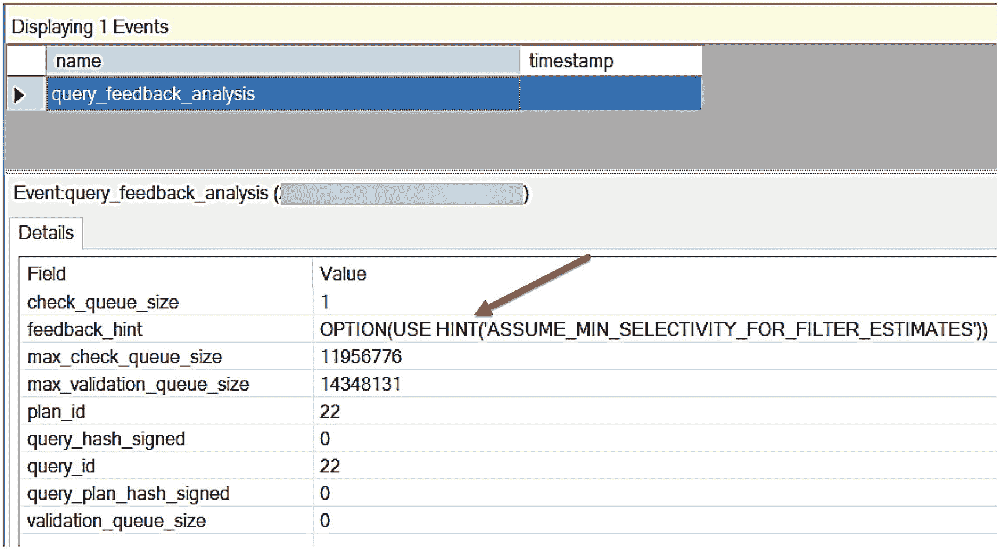
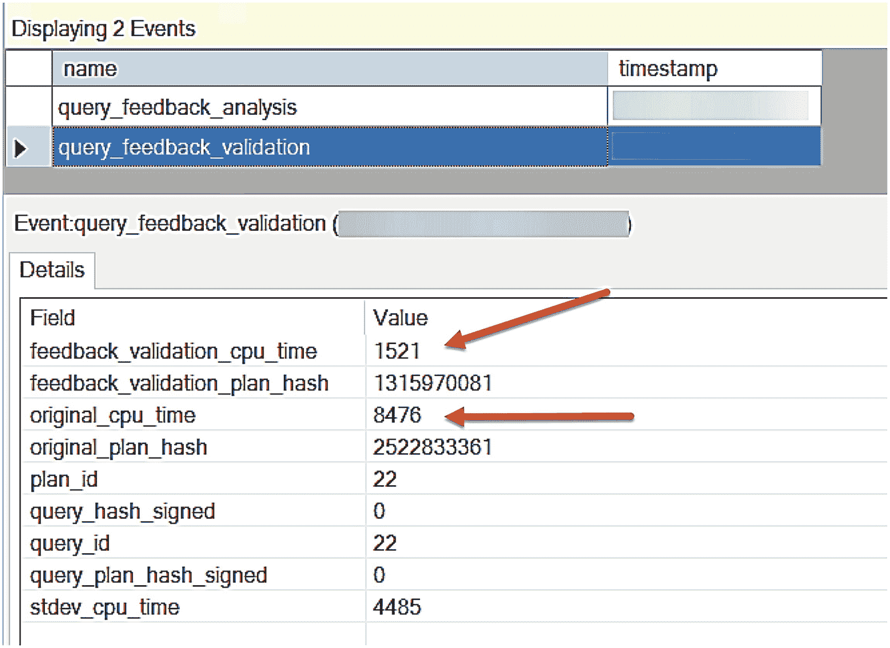

# 按照以下步骤进行练习

按照以下步骤查看 CE 反馈的实际效果：



这是 CE 反馈分析的输出表示。输出标题显示为“显示 1 个事件”。一个箭头指向 feedback_hint，该选项为 left parenthesis single quotes assume_min_selectivity_for_filter_estimates single quotes right parenthesis。

**图 5-14** CE 反馈分析

1.  从 [`https://github.com/Microsoft/sql-server-samples/releases/download/adventureworks/AdventureWorks2016_EXT.bak`](https://github.com/Microsoft/sql-server-samples/releases/download/adventureworks/AdventureWorks2016_EXT.bak) 下载 `AdventureWorks2016_EXT` 示例备份文件。还原脚本假设目录为 `c:\sql_sample_databases`。
2.  使用脚本 `restore_adventureworks_ext.sql` 还原 `AdventureWorks_EXT` 示例备份。根据需要编辑文件路径。此脚本运行以下 T-SQL 语句：
```sql
    USE master;
    GO
    DROP DATABASE IF EXISTS AdventureWorks_EXT;
    GO
    RESTORE DATABASE AdventureWorks_EXT FROM DISK = 'c:\sql_sample_databases\AdventureWorks2016_EXT.bak'
    WITH MOVE 'AdventureWorks2016_EXT_Data' TO 'c:\sql_sample_databases\AdventureWorks2016_Data.mdf',
    MOVE 'AdventureWorks2016_EXT_Log' TO 'c:\sql_sample_databases\AdventureWorks2016_log.ldf',
    MOVE 'AdventureWorks2016_EXT_Mod' TO 'c:\sql_sample_databases\AdventureWorks2016_EXT_mod'
    GO
```
还原此备份后，查询存储已启用。
3.  执行脚本 `create_xevent_seassion.sql` 以创建并启动一个扩展事件会话来查看反馈事件。在 SSMS 的对象资源管理器中使用“查看实时数据”功能查看该会话。该脚本使用以下 T-SQL 语句：
```sql
    IF EXISTS (SELECT * FROM sys.server_event_sessions WHERE name = 'CEFeedback')
    DROP EVENT SESSION [CEFeedback] ON SERVER;
    GO
    CREATE EVENT SESSION [CEFeedback] ON SERVER
    ADD EVENT sqlserver.query_feedback_analysis(
    ACTION(sqlserver.query_hash_signed,sqlserver.query_plan_hash_signed,sqlserver.sql_text)),
    ADD EVENT sqlserver.query_feedback_validation(
    ACTION(sqlserver.query_hash_signed,sqlserver.query_plan_hash_signed,sqlserver.sql_text))
    WITH (MAX_MEMORY=4096 KB,EVENT_RETENTION_MODE=NO_EVENT_LOSS,MAX_DISPATCH_LATENCY=1 SECONDS,MAX_EVENT_SIZE=0 KB,MEMORY_PARTITION_MODE=NONE,TRACK_CAUSALITY=OFF,STARTUP_STATE=OFF);
    GO
    -- Start XE
    ALTER EVENT SESSION [CEFeedback] ON SERVER
    STATE = START;
    GO
```
4.  执行脚本 `create_index_on_city.sql`，为 `Person.Address` 表的 `City` 列添加一个索引。此脚本使用以下 T-SQL 语句：
```sql
    USE [AdventureWorks_EXT];
    GO
    CREATE NONCLUSTERED INDEX [IX_Address_City] ON [Person].[Address]
    (
    [City] ASC
    );
    GO
```
5.  执行脚本 `dbcompat160.sql` 以开启数据库兼容性级别 160 并清除查询存储和缓存。此脚本使用以下 T-SQL 语句：
```sql
    USE master;
    GO
    ALTER DATABASE [AdventureWorks_EXT] SET COMPATIBILITY_LEVEL = 160;
    GO
    ALTER DATABASE [AdventureWorks_EXT] SET QUERY_STORE CLEAR ALL;
    GO
    USE [AdventureWorks_EXT];
    GO
    ALTER DATABASE SCOPED CONFIGURATION CLEAR PROCEDURE_CACHE;
    GO
```
6.  执行脚本 `cefeedbackquerybatch.sql` 以 *触发* CE 反馈。此脚本使用以下 T-SQL 语句：
```sql
    USE AdventureWorks_EXT;
    GO
    SELECT AddressLine1, City, PostalCode FROM Person.Address
    WHERE StateProvinceID = 79
    AND City = 'Redmond';
    GO 15
```
该脚本应在几秒内完成。这是一个典型的关联性示例。城市 Redmond 是否被关联到 `StateProvinceID = 79` 的省份？优化器应对关联性做出何种假设？我们稍后将了解 CE 反馈的作用。该脚本运行 15 次是为了确保在尝试提供反馈之前，查询至少运行了一个最低次数。这个数字没有被文档化，所以不要特别依赖 15 这个神奇的数字。
7.  现在执行脚本 `cefeedbackquery.sql`，该脚本会再次运行相同的查询。如果您检查扩展事件的实时数据，应该会看到一个名为 `query_feedback_analysis` 的事件。输出应类似于图 5-14。其中一个关键列是 `feedback_hint`。在接下来的练习中，您将了解更多相关信息。



这是 CE 反馈验证的输出表示。输出标题显示为“显示 2 个事件”。箭头指向 feedback_validation_cpu_time（值为 1521）和 original_cpu_time（值为 8476）。

**图 5-15** CE 反馈验证

1.  执行查询脚本 `check_query_hints_and_feedback.sql`。此脚本使用以下 T-SQL 语句：
```sql
    USE AdventureWorks_EXT;
    GO
    SELECT * from sys.query_store_query_hints;
    GO
    SELECT * from sys.query_store_plan_feedback;
    GO
```
`sys.query_store_query_hints` 是存储所有查询提示的地方，无论是您提供的还是系统提供的。`sys.query_store_plan_feedback` 用于显示系统为查询处理提供的任何反馈。您在第四章中看到了内存授予持久化这方面的示例。

对于第二个查询，您的输出应类似于以下内容（我垂直翻转了结果但省略了日期时间值）：
```sql
    plan_feedback_id        2
    plan_id                 22
    feature_id              1
    feature_desc            CE Feedback
    feedback_data           {"Feedback hints":""}
    state                   2
    state_desc              PENDING_VALIDATION
```
这些数据表明 CE 反馈有资格被提供，但需要验证。验证是为了确保反馈不会使查询变慢（更具体地说，反馈提示不会导致使用更多 CPU 的计划）。第一个查询不返回任何行，因为我们尚未“锁定”要用于 CE 反馈的提示。
2.  再次执行脚本 `cefeedbackquery.sql`。
3.  检查扩展事件实时数据。现在已触发一个名为 `query_feedback_validation` 的事件。您的结果应类似于图 5-15。注意 `feedback_validation_cpu_time` 的值小于 `original_cpu_time`。这意味着我们使用的提示使查询所需的 CPU 更少。
4.  再次运行脚本 `check_query_hints_and_feedback.sql`。您应该会看到第一个查询（来自 `sys.query_store_query_hints`）的结果如下所示：
```sql
    query_hint_id                              1
    query_id                                   22
    query_hint_text
    OPTION(USE HINT('ASSUME_MIN_SELECTIVITY_FOR_FILTER_ESTIMATES'))
    last_query_hint_failure_reason             0
    last_query_hint_failure_reason_desc        NONE
    query_hint_failure_count                   0
    source                                     1
    source_desc                                CE feedback
    comment                                    NULL
```
而第二个查询（来自 `sys.query_store_plan_feedback`）的结果应类似于：
```sql
    plan_feedback_id        2
    plan_id                 22
    feature_id              1
    feature_desc            CE Feedback
    feedback_data
    {"Feedback hints":"Min selectivity"}
    state                   5
    state_desc              VERIFICATION_PASSED
```


