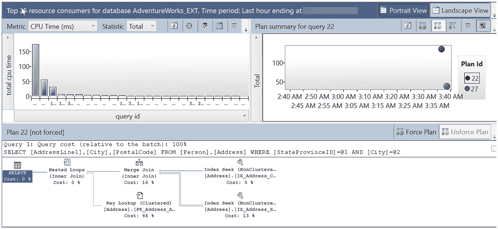
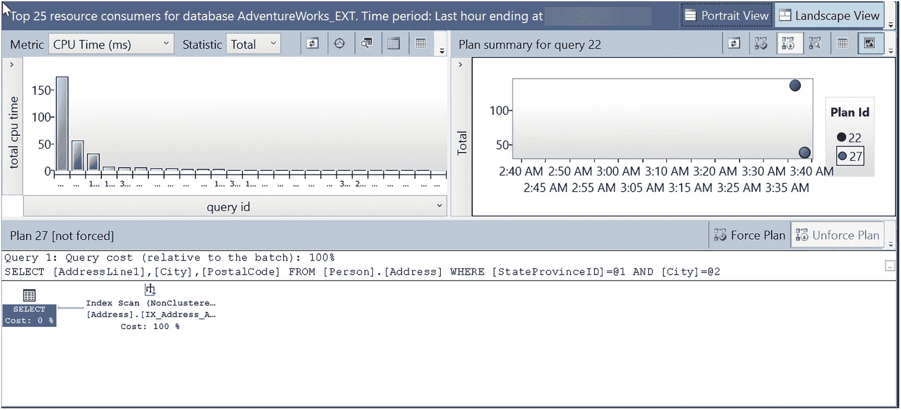
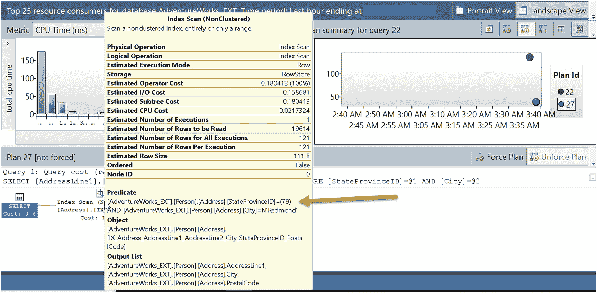

# 注意

如果验证失败，你将看到 `state_desc` 值为 `VERIFICATION_REGRESSED`。典型原因是在验证过程中，提示导致查询的 CPU 时间增加。

系统已自动应用一个查询提示以加快查询速度。但这个提示 `ASSUME_MIN_SELECTIVITY_FOR_FILTER_ESTIMATES` 是什么意思呢？回到前一节标题为“**什么是 CE 模型问题**？”中，我描述了一个与如何处理相关性相关的 CE 模型问题。`ASSUME_MIN_SELECTIVITY_FOR_FILTER_ESTIMATES` 提示假设*完全相关性*。你可以在我们的文档 [`https://docs.microsoft.com/sql/t-sql/queries/hints-transact-sql-query`](https://docs.microsoft.com/sql/t-sql/queries/hints-transact-sql-query) 中找到更多详细信息。以下是关于此提示的引用：

> *导致 SQL Server 在估算筛选器的 AND 谓词时使用最小选择性来生成计划，以考虑完全相关性。此提示名称等效于 SQL Server 2012 (11.x) 及更早版本的基数估算模型中的跟踪标志 4137，并且在 SQL Server 2014 (12.x) 或更高版本的基数估算模型中使用跟踪标志 9471 时具有类似效果。*

数据库 Adventure Works 的前 25 个资源消耗者的截图。截图左侧有柱状图，右侧有查询 22 的计划摘要，底部显示了未强制的计划 22。

图 5-16：CE 反馈提示之前的原始查询计划

1.  再次运行脚本 `cefeedbackquerybatch.sql`，以比较与第一次运行的时间。
2.  使用 SSMS 中的查询存储报告查看差异。使用对象资源管理器中的**资源消耗最多的查询报告**查看 CPU 时间的差异。该查询有两个计划。耗时较长的原始计划如图 5-16 所示。

请注意，此计划使用了多个索引上的多个联接。部分原因是优化器使用“新” CE 模型来假设不存在相关性或仅存在部分相关性。图 5-17 显示了应用带有 CE 反馈的新提示后的新计划。

数据库 Adventure Works 的前 25 个资源消耗者的截图。截图左侧有柱状图，右侧有查询 22 的计划摘要，底部显示了未强制的计划 22。

图 5-17：带有 CE 反馈提示的新计划

此计划运行速度更快，消耗的 CPU 更少。新计划使用单个索引扫描来获取数据。如果将光标悬停在索引扫描运算符上，可以看到扫描使用了筛选谓词来解析两个谓词值，如图 5-18 所示。

数据库 Adventure Works 的前 25 个资源消耗者的截图。截图左侧有柱状图，右侧有查询 22 的计划摘要，底部显示了未强制的计划 27。一个箭头指向谓词部分的详细信息。

图 5-18：新查询计划中的谓词下推

这种情况称为*谓词下推*。其思想是优化器可以在索引上同时进行“扫描和筛选”。著名的 Pedro Lopes 在博文 [`https://techcommunity.microsoft.com/t5/sql-server-blog/predicate-pushdown-and-why-should-i-care/ba-p/385946`](https://techcommunity.microsoft.com/t5/sql-server-blog/predicate-pushdown-and-why-should-i-care/ba-p/385946) 中对这个概念有很好的解释。由于优化器现在使用了 `ASSUME_MIN_SELECTIVITY_FOR_FILTER_ESTIMATES` 提示，它可以轻松决定使用此技术，因为它假设了完全相关性。

相当巧妙，对吧？并且由于反馈和提示保存在查询存储中，即使计划从缓存中被淘汰，它仍将被使用。

