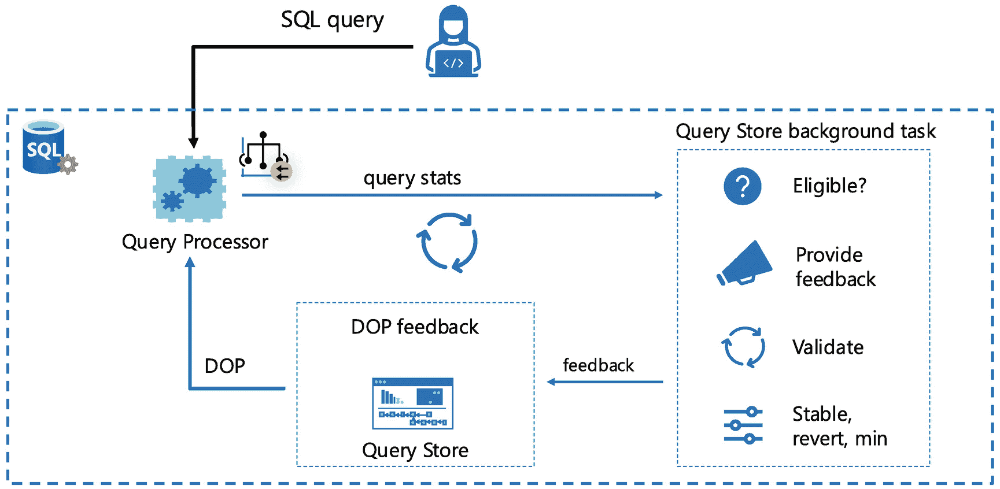

# 关于 CE 反馈的限制和更多详情

请在 [`https://aka.ms/cefeedback`](https://aka.ms/cefeedback) 关注 CE 反馈的所有最新动态。

当你查看使用了 CE 反馈的查询的实际执行计划 XML 时，你会发现以下属性已添加到 `<StmtSimple>` 子句中：

```
QueryStoreStatementHintId="1"
```

这将匹配 `sys.query_store_query_hints.query_hint_id`：

```
QueryStoreStatementHintText="OPTION(USE HINT('ASSUME_MIN_SELECTIVITY_FOR_FILTER_ESTIMATES'))" QueryStoreStatementHintSource="CE feedback"
```

在以下情况下，将不会使用 CE 反馈：

*   你使用的是数据库兼容性级别 < 160。
*   你使用的是自己的查询存储提示。
*   你在查询存储中强制了计划。
*   你执行了以下 T-SQL 以在数据库级别关闭 CE 反馈：`ALTER DATABASE SCOPED CONFIGURATION SET CE_FEEDBACK = OFF`。
*   你执行的查询不符合我们在文档 [`https://aka.ms/cefeedback`](https://aka.ms/cefeedback) 中概述的相关性、联接包含或优化器行目标类别下的模式。
*   你使用了查询提示 `DISABLE_CE_FEEDBACK`。

我预计 CE 反馈对应用程序和工作负载的效果会存在差异。由于我们通过验证过程应用“不造成损害”的策略，我希望客户在升级到数据库兼容性级别 160 后，会观察到它对他们的工作负载有所帮助。


## 并行度 (DOP) 反馈

在最深层次上，SQL Server 引擎由一系列工作线程驱动，并通过 SQLOS 进行协调。我们设计了引擎，使其能够智能决策，使用多个线程同时为某些操作分配工作。这些操作范围广泛，从创建数据库备份、重建索引到运行使用 `SELECT` 语句检索数据的查询。当引擎使用多个线程并行执行其中一些操作时，我们使用术语 `并行度` (DOP)。DOP 指的是并发运行以执行某个任务的线程数量。一个任务可能是构建索引，也可能是用于执行 `SELECT` 语句查询计划某部分的一个运算符。使用并行线程执行查询的历史可以追溯到 SQL Server 7.0，当时我们基于 SQL 6.X 版本构建了一个全新的查询处理器。

### 注意

回顾一下过去。我在我们的公告中找到了关于 SQL Server 7.0 中这项新功能的原始文档：[`https://docs.microsoft.com/en-us/previous-versions//cc917537(v=technet.10)?redirectedfrom=MSDN`](https://docs.microsoft.com/en-us/previous-versions//cc917537(v=technet.10)?redirectedfrom=MSDN)。另外，看看这个由 Lubor Kollar（他是 SQL Server 查询并行性的原始架构师之一）制作的幻灯片：[`www.slideserve.com/gilon/parallel-query-processing-in-sql-server-powerpoint-ppt-presentation`](http://www.slideserve.com/gilon/parallel-query-processing-in-sql-server-powerpoint-ppt-presentation)。

我记得这项新功能推出时，我正在支持部门工作。它确实有助于提升某些工作负载的性能，特别是那些具有分析类型查询的工作负载。但它也有代价。在支持部门，我们开始注意到客户联系我们，反映所有 CPU 一度“钉死”在 100% 持续数分钟的问题，这损害了所有用户的性能。当我们在 SQL Server 7.0 中引入此功能时，我们在查询处理器中内置了启发式算法来决定何时使用并行性，并动态确定查询的最大并行度应该是多少。我们引入了一个名为 `'max degree of parallelism'` 的 `sp_configure` 设置。默认值为 0，意思是“让引擎决定”。大多数情况下，这意味着使用所有可用的处理器。对于使用并行性的单个查询来说，这很好。但对于所有其他用户来说，这可能意味着麻烦。

Keith Elmore、Robert Dorr 和我那时都在支持部门工作，我们发现自己开始建议客户将 `'max degree of parallelism'` 设置为 0 以外的值（我们的建议很复杂，因为这是一个高级设置，最初需要重启服务器）。但我们该告诉他们使用什么值呢？对于最极端的关键问题，一些客户会将此值设置为 1，这意味着不允许任何查询使用并行性。我不太推荐这样做，因为它实际上意味着禁用产品的一个功能。在大多数情况下，我们会推荐某个低于可用处理器总数的设置。

在后续版本中，SQL Server 将支持 NUMA 架构、资源调控器、数据库范围配置和查询提示，这些都会影响如何设置 `MAXDOP`。我们编写了提供指导的知识库文章。所有这些经验都促成了以下关于设置 `MAXDOP` 的指导文档页面：[`https://docs.microsoft.com/sql/database-engine/configure-windows/configure-the-max-degree-of-parallelism-server-configuration-option`](https://docs.microsoft.com/sql/database-engine/configure-windows/configure-the-max-degree-of-parallelism-server-configuration-option?).

即使有此指导以及所有这些选项，我们的用户仍然持续面临一场斗争，以决定如何最佳地设置此值，以便让一些查询从并行性中受益，同时又不会严重影响整体应用程序工作负载。于是，`DOP 反馈` 的概念应运而生。DOP 反馈旨在动态调整查询计划中运算符使用的 DOP。让我们来看看项目的背景和工作原理，通过一个示例，并了解使用此功能的注意事项。

#### 我们为什么构建 DOP 反馈？

如果您阅读并研究并行性的工作原理，您会发现并行运行许多不同的线程并协调它们之间需要消耗一定数量的 CPU 周期。在某些情况下，可能不太清楚的是，一个查询是否可以在使用更少线程的情况下运行，并达到相同的总体最终执行时间，从而使用更少的 CPU 资源。

回到 2019 年（在 SQL Server 2019 发布之前），我记得看到 Slava Oks 和 Pedro Lopes 启动了一个名为 `Gaia` 的新项目。其概念是构建一个能够观察引擎遥测数据并向某些核心引擎组件提供 `反馈` 的新服务。Gaia 服务将在引擎外部运行，并维护自己的数据库，目的是收集遥测数据并提供反馈。正如 Pedro Lopes 所说，*“...目的是成为一个全面的产品内部反馈遥测框架，就像希腊神话中的盖亚一样，她是所有生命之母。”*

需要一个现实世界的场景来测试 Gaia，而早期的场景之一就是 DOP。Gaia 的概念作为一个项目仍然存在，但决定在 SQL Server 2022 中采用 DOP 反馈的概念，并利用 Query Store 中捕获的数据将其融入引擎。

#### 什么是 DOP 反馈？

我回顾了一些我们最初的设计文档，发现了这个总结我们目标的声明：“通过降低并行查询的 `MAXDOP` 以 `减少 CPU 使用率`，同时在性能方面遵循‘无害’原则，从而提高系统吞吐量。”

那么问题就变成了：你如何知道降低查询的并行度是否能获得足够好的结果？你需要一种方法来执行查询，并获得关于尝试较低 DOP 值的反馈。这实际上是 DOP 反馈所做的。DOP 反馈是查询处理器和 Query Store 之间的协调，用于对 `符合条件` 的查询执行、尝试并验证 DOP 值，直到找到能减少 CPU 使用率并在一段时间内实现“无害”原则的最低可能 DOP 值。

### 注意

我发现这个功能设计中一个有趣的方面是使用像 TPC-H 这样的工作负载，来看看基准测试中各种查询的最优 DOP 值仍然能够达到很好的结果。我们还研究了在 Azure 中看到的遥测数据，以了解许多不同查询在一段时间内使用的典型 DOP 值。


### DOP 反馈如何工作？

无论数据库使用何种 `dbcompat` 设置，都可以使用 DOP 反馈。但是，要启用 DOP 反馈，必须打开一个数据库范围内的选项，如下所示：

```sql
ALTER DATABASE SCOPED CONFIGURATION SET DOP_FEEDBACK = ON
```

如果启用了此选项，当执行一个可以使用并行处理的查询时，查询处理器将参与引擎内的一个 `反馈系统`，以确定是否可以应用 DOP 反馈。图 5-19 展示了 DOP 反馈系统的架构。



DOP 反馈系统的循环图。循环包括 SQL 查询、查询存储后台任务、DOP 反馈和查询处理器。

图 5-19 DOP 反馈系统

让我们深入探讨 DOP 反馈系统的工作流程：

*   当一个查询被执行，且查询处理器确定它将使用并行处理时，它会查看是否存在任何 `DOP 反馈` 来调整应使用的 DOP 值（假设数据库选项 `DOP_FEEDBACK` 已启用）。

*   为了让 DOP 反馈系统工作，查询处理器会将查询统计信息发送给一个查询存储后台任务。查询存储本质上只收集聚合的性能统计数据。这无法为 DOP 反馈提供足够的细节，因此我们使用一个查询存储后台任务来接收详细的查询统计信息，并在任务内部的内存中进行聚合。

*   查询存储后台任务会始终检查一个查询是否 `有资格` 获得 DOP 反馈。资格判断有些复杂，但主要概念是看一个查询在使用较低 DOP 的情况下是否不会显著变慢，并能使用更少的 CPU 资源。资格还包括一个查询已执行的次数、具有 `相当长` 的持续时间以及 `并行效率` 等因素。并行效率衡量使用并行处理相对于执行查询的 CPU 成本的效率。我们不记录这些因素，但在下一节的示例中，您将看到 SQL Server 2022 的行为。

    **注意**
    如果使用了查询提示选项 `DISABLE_DOP_FEEDBACK`，则该查询不符合资格。

*   如果查询符合资格，后台任务将 `提供反馈` 以降低查询的 DOP。DOP 的降低通常以 4 和 2 为步长逐步进行。因此，如果 `原始 DOP` 是 8，系统将先提供降为 6 的反馈，然后是 4，最后是 2，这是最低的 DOP 级别。`基准` DOP 基于您对实例、数据库、资源组和查询的配置设置。我在题为“**关于 DOP 反馈我还应该了解什么？**”的章节中提供了有关 DOP 优先级的更多细节。

*   当提供反馈后，系统将进入 `验证阶段`。查询处理器向后台任务提供统计信息，以验证查询的执行是否与原始执行具有 `相似` 的持续时间并使用更少的 CPU 资源。此验证阶段可能需要经过几次查询迭代。如果对于一个符合资格的查询，反馈在 `第一次` 验证尝试中失败，则该反馈被视为 `已恢复`。这意味着将使用该查询在符合资格时的基准 DOP。任何没有持久化反馈的新编译查询都将被重新考虑资格和进行验证。

*   如果查询通过了验证阶段，则反馈被视为 `稳定`。当达到稳定状态时，反馈将在查询存储中持久化。

*   此循环将持续进行，直到使用的某个 DOP 反馈值无法通过上一次稳定值的验证，或者达到“最小”稳定值 2（无论 CPU 数量或任何配置设置如何）。

总而言之，DOP 反馈的过程是：检查查询是否符合资格，然后执行一个反馈和验证的循环，直到反馈被恢复、找到最低的最佳稳定值，或遇到最低反馈值 2。

所有这些操作都无需查询重新编译即可完成。查询处理器将 DOP 反馈视为决定为特定查询执行使用哪个 DOP 值进行并行处理的一个因素。

DOP 反馈的总体目标是提高并行效率，而不会导致查询持续时间显著延长。在相同持续时间下执行查询所需的 workers 越少，CPU 使用率就越低，因此整个系统都会受益。

DOP 反馈总是试图降低 DOP，而从不增加它。SQL Server 包含几种不同的诊断选项来查看 DOP 反馈的工作方式，包括 DMV、XML 计划详细信息和扩展事件。在下一节关于 DOP 反馈的示例中，您将看到它们是如何工作的。


