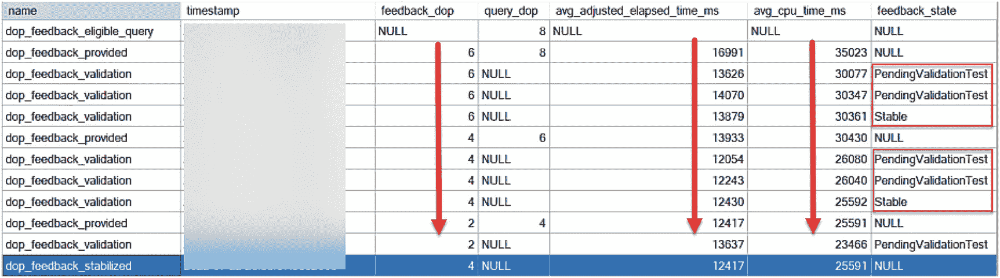

# 让我们尝试 DOP 反馈

## 先决条件

运行此示例的先决条件如下：

*   SQL Server 2022 评估版。
*   拥有八个 CPU 和至少 24Gb 内存的虚拟机或计算机。

> **注意**
>
> 此练习对 CPU 非常敏感。您应该在专用于 SQL Server 且具有快速 I/O 存储的虚拟机或计算机上执行此练习。较慢的 CPU 速度或其他正在运行的进程可能会影响观察此练习结果的能力。我使用 Azure 虚拟机 `Standard+E8ads_v5`（八个 vCPU，64Gb 内存）完成了此练习。使用 `D32ds_v5` Azure 虚拟机，并将实例的 DOP 从 32 降低到 12，我也成功运行了此示例。

*   SQL Server Management Studio (SSMS)。最新的 18.x 或 19.x 版本均可使用。
*   从 [`https://aka.ms/ostress`](https://aka.ms/ostress) 下载 `ostress.exe`。使用随附的 `RMLSetup.msi` 文件进行安装，并使用所有默认设置。
*   本书 GitHub 仓库中 `ch05_builtinqueryintelligence_getsbetter\dopfeedback` 目录下的脚本副本。

## 步骤

按照以下步骤查看 DOP 反馈的实际效果：



**图 5-20** DOP 扩展事件序列

1.  从 [`https://aka.ms/WideWorldImporters`](https://aka.ms/WideWorldImporters) 下载 WideWorldImporters 备份文件的副本。下一步中的脚本假设备份文件位于 `c:\sql_sample_databases`。您可以使用从 [`https://github.com/microsoft/sqlworkshops-sql2022workshop/releases`](https://github.com/microsoft/sqlworkshops-sql2022workshop/releases) 获取的预加载了扩展数据的定制备份。

2.  还原 WideWorldImporters 示例备份。您可以编辑并使用 `restorewwi.sql` 脚本。此脚本专为 Azure 虚拟机市场映像上的 SQL Server 设计，该映像的数据和日志文件位于独立的磁盘上。请编辑此脚本以匹配您的文件路径。此脚本包含以下 T-SQL 语句：

    ```sql
    USE master;
    GO
    DROP DATABASE IF EXISTS WideWorldImporters;
    GO
    -- 编辑文件位置以匹配您的存储
    RESTORE DATABASE WideWorldImporters FROM DISK = 'c:\sql_sample_databases\WideWorldImporters-Full.bak' with
    MOVE 'WWI_Primary' TO 'e:\data\WideWorldImporters.mdf',
    MOVE 'WWI_UserData' TO 'e:\data\WideWorldImporters_UserData.ndf',
    MOVE 'WWI_Log' TO 'f:\log\WideWorldImporters.ldf',
    MOVE 'WWI_InMemory_Data_1' TO 'e:\data\WideWorldImporters_InMemory_Data_1',
    stats=5;
    GO
    ```

3.  执行脚本 `configmaxdop.sql`。这将运行以下 T-SQL 语句：

    ```sql
    sp_configure 'show advanced', 1;
    go
    reconfigure;
    go
    sp_configure 'max degree of parallelism', 0;
    go
    reconfigure;
    go
    ```

    为了正确建立基线，我将实例的 `MAXDOP` 设置为 0，以使用所有可用的 CPU。没有配置其他 `MAXDOP` 设置。

4.  执行 `populatedata.sql` 脚本以向 `Warehouse.StockItems` 表加载更多数据。此脚本运行大约需要 15 分钟（计时取决于 CPU 数量和磁盘速度）。此脚本执行以下 T-SQL 语句（练习中完全坦诚：此代码源自我最初构建 PSP 优化的地方）：

    ```sql
    USE WideWorldImporters;
    GO
    -- 添加 StockItem 以在 Suppliers 中导致数据偏斜
    --
    DECLARE @StockItemID int;
    DECLARE @StockItemName varchar(100);
    DECLARE @SupplierID int;
    SELECT @StockItemID = 228;
    SET @StockItemName = 'Dallas Cowboys Shirt'+convert(varchar(10), @StockItemID);
    SET @SupplierID = 4;
    DELETE FROM Warehouse.StockItems WHERE StockItemID >= @StockItemID;
    SET NOCOUNT ON;
    BEGIN TRANSACTION;
    WHILE @StockItemID <= 20000000
    BEGIN
    INSERT INTO Warehouse.StockItems
    (StockItemID, StockItemName, SupplierID, UnitPackageID, OuterPackageID, LeadTimeDays,
    QuantityPerOuter, IsChillerStock, TaxRate, UnitPrice, TypicalWeightPerUnit, LastEditedBy
    )
    VALUES (@StockItemID, @StockItemName, @SupplierID, 10, 9, 12, 100, 0, 15.00, 100.00, 0.300, 1);
    SET @StockItemID = @StockItemID + 1;
    SET @StockItemName = 'Dallas Cowboys Shirt'+convert(varchar(10), @StockItemID);
    END
    COMMIT TRANSACTION;
    SET NOCOUNT OFF;
    GO
    ```

5.  执行脚本 `rebuild_index.sql` 以重建添加数据后的索引。此脚本运行以下 T-SQL 语句：

    ```sql
    USE WideWorldImporters;
    GO
    ALTER INDEX FK_Warehouse_StockItems_SupplierID ON Warehouse.StockItems REBUILD;
    GO
    ```

6.  执行脚本 `dopfeedback.sql` 以启用 DOP 反馈，将 `dbcompat` 设置为 160，并清除练习的设置。此脚本执行以下 T-SQL 语句：

    ```sql
    USE WideWorldImporters;
    GO
    -- 确保查询存储已开启，并将运行时收集间隔设置得比默认值低
    ALTER DATABASE WideWorldImporters SET QUERY_STORE = ON;
    GO
    ALTER DATABASE WideWorldImporters SET QUERY_STORE (OPERATION_MODE = READ_WRITE, DATA_FLUSH_INTERVAL_SECONDS = 60, INTERVAL_LENGTH_MINUTES = 1, QUERY_CAPTURE_MODE = ALL);
    GO
    ALTER DATABASE WideWorldImporters SET QUERY_STORE CLEAR ALL;
    GO
    -- 您必须将数据库兼容级别更改为 160
    ALTER DATABASE WideWorldImporters SET COMPATIBILITY_LEVEL = 160;
    GO
    -- 启用 DOP 反馈
    ALTER DATABASE SCOPED CONFIGURATION SET DOP_FEEDBACK = ON;
    GO
    -- 清除过程缓存以使用新计划开始
    ALTER DATABASE SCOPED CONFIGURATION CLEAR PROCEDURE_CACHE;
    GO
    ```

    注意，我们不需要为此数据库更改 `dbcompat`（当前设置为 130）。我还将 `INTERVAL_LENGTH_MINUTES` 设置为 1，以便在查看查询存储和报告时能够以更精细的级别显示详细的查询统计信息。这不是生产环境推荐的查询存储配置。

7.  执行脚本 `proc.sql` 以创建一个存储过程来查询数据，该过程将使用并行查询计划。此脚本执行以下 T-SQL 语句：

    ```sql
    USE WideWorldImporters;
    GO
    CREATE OR ALTER PROCEDURE [Warehouse].[GetStockItemsbySupplier]  @SupplierID int
    AS
    BEGIN
    SELECT StockItemID, SupplierID, StockItemName, TaxRate, LeadTimeDays
    FROM Warehouse.StockItems s
    WHERE SupplierID = @SupplierID
    ORDER BY StockItemName;
    END;
    GO
    ```

    > **注意**
    >
    > 您可能从参数敏感计划（PSP）优化中认出这个例子。我坦率地说：这个练习使用了我最初构建 PSP 优化时使用的这个过程和代码。我意识到该示例的一部分使用了并行查询计划。所以您首先看到的是 DOP 反馈，但它“诞生于”我首先进行的 PSP 优化工作。想象一下，这两个特性实际上和谐地协同工作，从而“全面”提高性能。

8.  执行脚本 `dopxe.sql` 以设置一个扩展事件会话来跟踪 DOP 反馈的状态。此脚本运行以下 T-SQL 语句：


