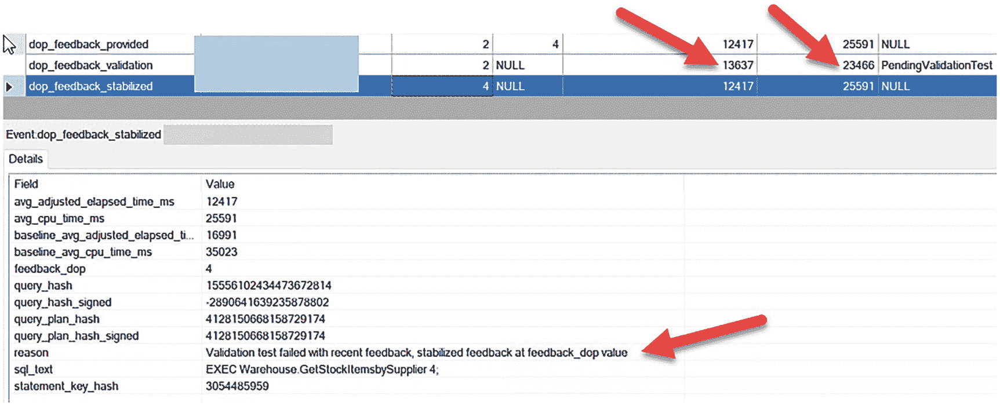
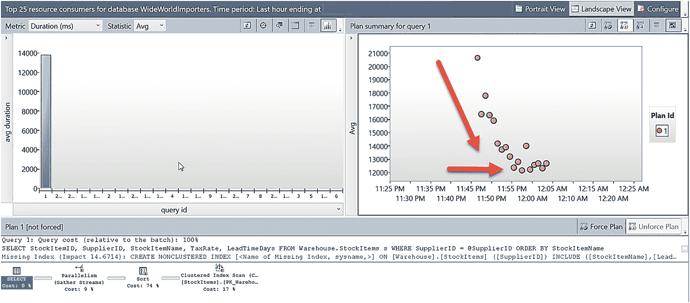
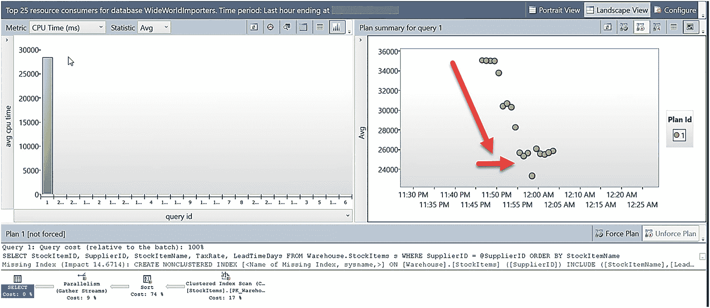

# 使用 DOP 反馈进行性能调优

```
IF EXISTS (SELECT * FROM sys.server_event_sessions WHERE name = 'DOPFeedback')
DROP EVENT SESSION [DOPFeedback] ON SERVER;
GO
CREATE EVENT SESSION [DOPFeedback] ON SERVER
ADD EVENT sqlserver.dop_feedback_eligible_query(
ACTION(sqlserver.query_hash_signed,sqlserver.query_plan_hash_signed,sqlserver.sql_text)),
ADD EVENT sqlserver.dop_feedback_provided(
ACTION(sqlserver.query_hash_signed,sqlserver.query_plan_hash_signed,sqlserver.sql_text)),
ADD EVENT sqlserver.dop_feedback_reverted(
ACTION(sqlserver.query_hash_signed,sqlserver.query_plan_hash_signed,sqlserver.sql_text)),
ADD EVENT sqlserver.dop_feedback_stabilized(
ACTION(sqlserver.query_hash_signed,sqlserver.query_plan_hash_signed,sqlserver.sql_text)),
ADD EVENT sqlserver.dop_feedback_validation(
ACTION(sqlserver.query_hash_signed,sqlserver.query_plan_hash_signed,sqlserver.sql_text))
WITH (MAX_MEMORY=4096 KB,EVENT_RETENTION_MODE=NO_EVENT_LOSS,MAX_DISPATCH_LATENCY=1 SECONDS,MAX_EVENT_SIZE=0 KB,MEMORY_PARTITION_MODE=NONE,TRACK_CAUSALITY=OFF,STARTUP_STATE=OFF);
GO
-- Start XE
ALTER EVENT SESSION [DOPFeedback] ON SERVER
STATE = START;
GO
```

在 SSMS 的对象资源管理器中，右键单击新的 Extended Events 会话并选择 **查看实时数据**。

### 9. 运行工作负载脚本

从命令提示符运行脚本 `workload_index_scan_users.cmd`。此脚本大约需要 15 分钟完成，它会在一个重复的循环中执行你创建的存储过程。

> **注意**：此脚本假定使用 Windows 身份验证连接到本地服务器。

### 10. 观察 DOP 反馈

当脚本完成后，你可以使用 Extended Events 的实时数据观察 DOP 反馈。你应该会看到一系列类似于图 5-20 的事件。

在 SSMS 的 **实时数据查看器** 中，你可以向默认视图添加列以查看反馈的顺序（右键单击 **详细信息** 窗格中的任意字段，然后选择 **在表中显示列**）。随着时间的推移，你会看到 **`feedback_dop`** 值降低，以及查询的经过时间和 CPU 时间减少。你还可以看到验证的迭代，其 `feedback_state` 为 `PendingValidationTest` 和 `Stable`。每当达到 `Stable` 状态时，反馈就会持久保存到 **查询存储** 中。

让我们关注最后两个事件，如图 5-21 所示。



*图 5-21 DOP 反馈稳定化事件*

注意，`dop_feedback_stabilized` 事件是在 `feedback_dop` 尝试设置为 2 但未稳定后触发的。尝试 DOP 反馈为 2 后，经过时间增加了，但 CPU 使用率下降了。为了遵循“不造成损害”的原则，我们必须在 DOP 为 4 时停止。`dop_feedback_stabilized` 事件显示了稳定的原因。在本例中，对 DOP 2 的验证失败是因为查询持续时间更长。这结束了反馈循环，因为我们已经找到了最佳且最低的可能 DOP 值 4。然而，请记住，当反馈被提供且反馈状态为 **`Stable`** 时，反馈会被持久保存到 **查询存储** 中。这允许稳定状态被持久保存，即使通过进一步的反馈可能会将其降低。

> **我多次运行过这个测试和场景，在某些情况下，我看到 DOP 反馈降低到 2 并稳定在那个数值。**



*图 5-22 DOP 反馈的平均持续时间*

### 1. 执行查询统计信息脚本

执行脚本 `dop_query_stats.sql`。此脚本运行以下 T-SQL 语句：

```sql
USE WideWorldImporters;
GO
-- 工作负载中该计划的哈希值 4128150668158729174 应保持不变
SELECT qsp.query_plan_hash, avg_duration/1000 as avg_duration_ms,
avg_cpu_time/1000 as avg_cpu_ms, last_dop, min_dop, max_dop, qsrs.count_executions
FROM sys.query_store_runtime_stats qsrs
JOIN sys.query_store_plan qsp
ON qsrs.plan_id = qsp.plan_id
and qsp.query_plan_hash = CONVERT(varbinary(8), cast(4128150668158729174 as bigint))
ORDER by qsrs.last_execution_time;
GO
```

查看结果，你应该会看到随着 DOP 根据反馈降低，持续时间（经过时间）和 CPU 的减少过程。但请注意，当 `last_dop = 2` 时，持续时间更高，这就是为什么 DOP 反馈被认为在 4 时稳定。

### 2. 检查查询反馈

执行脚本 `check_query_feedback.sql`。此脚本运行以下 T-SQL 语句：

```sql
USE WideWorldImporters;
GO
SELECT * from sys.query_store_plan_feedback;
GO
```

你的结果应类似于以下内容（为了可读性，我将结果垂直翻转，并且未包含日期时间列）：

```
plan_feedback_id        1
plan_id                 1
feature_id              3
feature_desc            DOP Feedback
feedback_data
{"BaselineStats":{"dop":"8","avg_cpu_time_ms":"35023","avg_elapsed_time_ms":"16995","avg_wait_time_ms":"4578"},"LastGoodFeedback":{"dop":"4","avg_cpu_time_ms":"25591","avg_elapsed_time_ms":"12440","avg_wait_time_ms":"23"}}
State                   7
state_desc              FEEDBACK_VALID
```

**`feedback_data`** 显示了持久保存的 DOP 反馈，用于查询引擎对该查询的后续执行，该反馈在重启或计划缓存清除后仍然有效。在 **查询存储** 中的持久性是关键，这使得 DOP 反馈能够长期有效。

### 3. 查看资源消耗报告

在 SSMS 中查看 **消耗资源最多的查询** 报告。将统计信息 (**统计信息**) 更改为 **平均持续时间**。你应该会看到一个类似于图 5-22 的报告。

注意持续时间随时间下降，直到达到稳定状态后趋于平稳。并非所有场景都会导致持续时间减少。关键在于 DOP 反馈应至少导致持续时间值随时间保持相似。

使用相同的报告，但将指标 (**指标**) 更改为 **CPU 时间**，统计信息 (**统计信息**) 保持为 **平均值**。你应该会看到一个类似于图 5-23 的报告。



*图 5-23 DOP 反馈的平均 CPU*

此报告显示了 **DOP 反馈的真正威力**：在实现相似或更低的查询持续时间的同时，显著减少了所需的 CPU 资源。

> **注意**
> 如果你在此工作负载运行期间查看实际的查询执行计划（例如来自 **`query_post_execution_plan_profile`** 扩展事件），你会看到一个 XML 属性 `DOPFeedbackAdjusted="Yes: Adjusting"`，最终在 DOP 反馈稳定后变为 `"Yes: Stable"`。


### 关于 DOP 反馈我还应该了解什么？

在您利用此功能时，关于 DOP 反馈，您需要了解以下几个关键点：

*   如果您将数据库作用域的配置值 `DOP_FEEDBACK` 设置为 `OFF`，且反馈信息尚未持久化，那么反馈将会丢失，这相当于您“重置了系统”。如果反馈已持久化，那么查询将恢复到“默认”的 DOP 行为，但反馈不会丢失。如果您再次将其开启，则将使用 DOP 反馈。

*   如果反馈未持久化，那么任何重新编译都会导致“重新开始”。如果反馈已持久化，那么反馈在重启或重新编译后依然存在，这正是使用 `查询存储` 来保存反馈的好处。

*   查询执行时的当前数据库上下文是考虑 DOP 反馈的基础。因此，如果您执行一个跨越多个数据库的查询，并且该数据库的 `DOP_FEEDBACK` 设置为 `ON`，则使用您执行查询时的数据库上下文。

*   使用临时表的查询符合 `DOP_FEEDBACK` 的条件。我修改了前面的练习，在存储过程中使用了临时表，并完成了整个练习。其行为与使用用户表时相同。

*   我之前提到过原始 DOP 以及使用 DOP 反馈的优先级顺序。假设数据库选项 `DOP_FEEDBACK` 处于开启状态，并且您没有使用 `DISABLE_DOP_FEEDBACK` 查询提示，我们将根据您对查询提示、资源组、数据库作用域配置或实例配置的设置，“开始”用于反馈考虑的基线 DOP。

例如，如果您没有使用查询提示，也没有使用其他任何配置值，只是将‘最大并行度’设置为 8，我们将从 8 开始 DOP 反馈的基线（即使您的 CPU 数量超过 8 个）。

*   在 SQL Server 2017 中，我们引入了自动计划修正（`APRC`）的概念，它同样利用了 `查询存储`。其概念是，如果发生性能回退，则自动恢复到“最后已知的良好”计划。如果您启用了 `APRC`，它的优先级将高于使用 DOP 反馈。您可以在 `https://docs.microsoft.com/sql/relational-databases/automatic-tuning/automatic-tuning?#automatic-plan-correction.ack` 了解更多关于 `APRC` 的信息。

请在 `https://aka.ms/dopfeedback` 获取所有关于 DOP 反馈的最新文档和更新。

## 为您服务的引擎

想想如今融入 SQL Server 2022 内置查询智能的所有创新。

从 `SQL Server 2016` 开始，我们引入了 `查询存储`，现在，在 SQL Server 2022 中，借助提示、对只读副本的支持以及与 `IQP` 的集成，它变得比以往任何时候都更强大、更可用。

在 `SQL Server 2017` 中，我们引入了以下 `IQP` 功能：

*   自适应联接

*   交错执行

*   批处理模式的内存授予反馈

然后在 `SQL Server 2019` 中，我们添加了

*   行模式的内存授予反馈

*   用于行模式查询（非列存储查询）的批处理模式

*   标量 UDF 内联

*   表变量延迟编译

*   近似 COUNT DISTINCT

而现在在 `SQL Server 2022` 中，随之而来的是

*   近似百分位数

*   优化的计划强制

*   DOP 反馈

*   内存授予百分位数和持久化

*   参数敏感型计划优化

*   CE 反馈

我知道我有偏见，但对我来说，这就是一个为您服务的引擎。除了为近似函数编写示例之外，这些功能中的每一个都不需要任何代码更改。而且这些并非特殊的附加功能。它们被内置于引擎的核心中，存在于 SQL 所在的任何地方。它们是我们产品中基于现实场景的最亮点创新领域之一，这些场景您每天都会遇到。

我认为微软技术院士 Hanuma Kodavalla 总结得最好，他告诉我：

> 查询的能力是关系数据库区别于其他数据库的关键，而 SQL Server 提供了业界最复杂的查询处理引擎之一。SQL Server 的工程师和项目经理例行使用从数百万个云数据库（规模从几 GB 到一百 TB 不等）收集的遥测数据，这些数据库运行着广泛的工作负载——OLTP、数据仓库、HTAP——以理解常见的查询模式，并设计改进查询性能的功能。由此产生了 SQL Server 2022 的许多功能——参数敏感型计划、基数估计反馈、近似查询处理、优化的计划强制、可读辅助副本上的 QDS、对 QDS 提示的改进、内存授予反馈以及智能选择并行度。在所有这些功能中，一个不变的主题是开发创新的算法，这些算法能在运行时适应各种查询模式和系统负载，从而得出更好的计划并提高查询执行效率。由于这些功能，工作负载通常能在不要求应用程序进行任何更改的情况下看到显著的性能提升。此外，所有这些功能在发布给 SQL Server 2022 客户之前，都已在云中部署并在关键任务工作负载上进行了测试，因此它们都已准备好在生产环境中使用。

