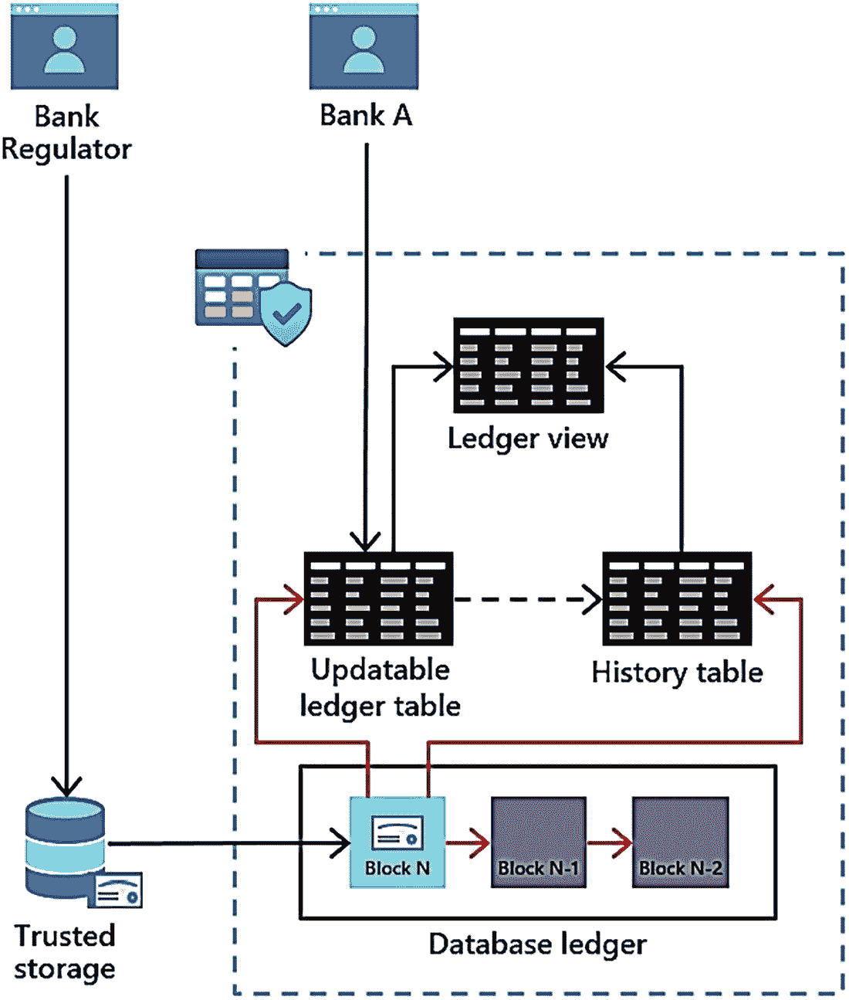
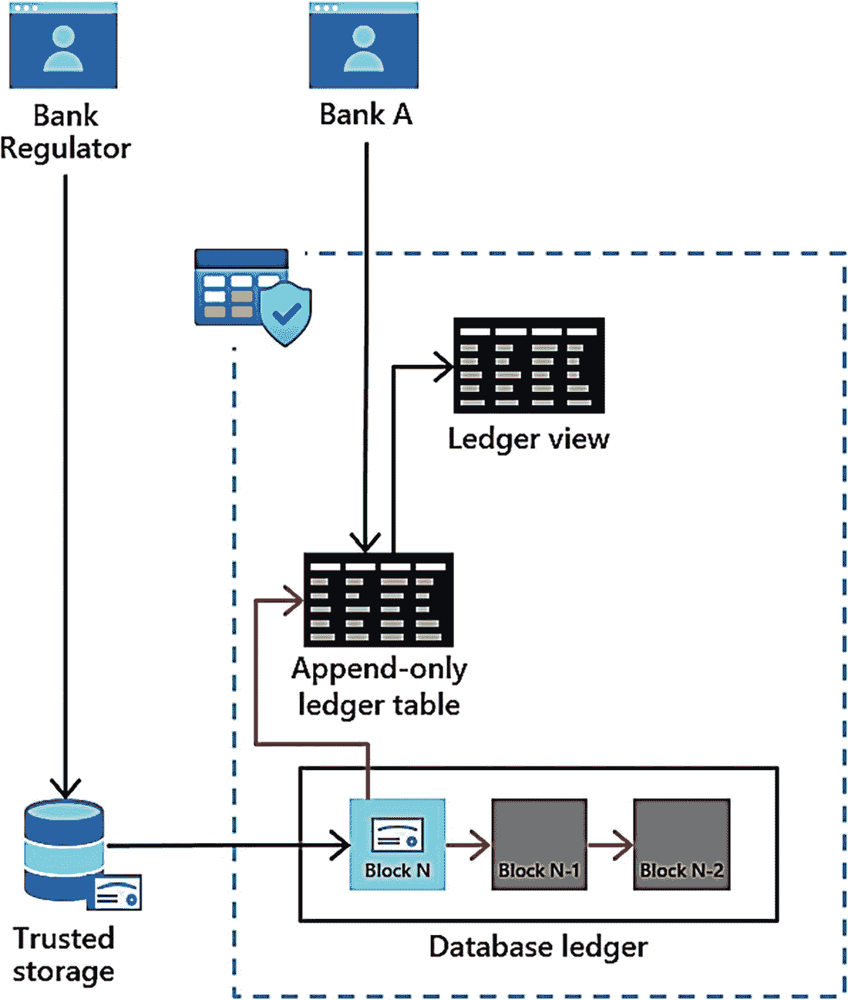
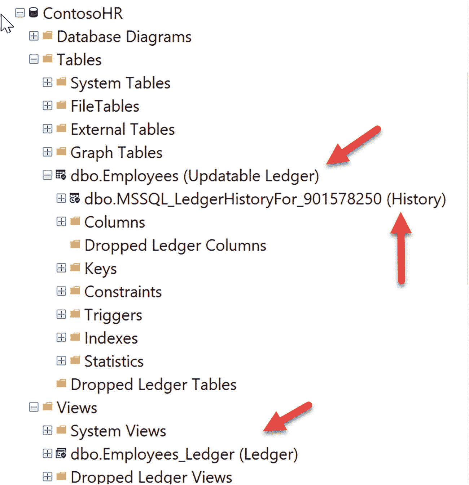

# 6. SQL Server 的核心基础

几年前，我正在为 PASS 大会主题演讲中著名的“Conor and Bob”环节做准备。我构思了一个涉及机器学习、分析和其他类型新功能的复杂想法。当我展示给 Conor 看时，他只是简单地说：“Bob，我认为我们的环节应该坚持核心基础。” 作为德克萨斯人，我明白他的意思。要突出 SQL Server 的 `核心引擎` 能力。

当然，SQL 在机器学习和分析等方面具有核心能力，但 Conor 真正指的是安全性、可扩展性（性能）和可用性。对于每一个主要版本，我们都必须在这三个领域进行投资，否则我们实际上就没有一个真正的引擎。

## 核心引擎是 SQL Server 的核心基础

本章节完全关于核心引擎领域：安全性、可扩展性（性能）和可用性——外加一些不完全属于这些类别的其他“内容”。内置查询智能无疑是核心引擎的一部分，但它值得拥有自己的章节。在这里，我将涵盖所有有助于实现以下目标的新功能：

*   保护您的应用程序和数据安全。

*   确保您的应用程序能够扩展并保持高性能。

*   确保您的应用程序具有高可用性。

然后是一个对引擎来说纯粹是“锦上添花”的功能列表。您开始阅读本章时可能会觉得这只是“一个功能列表”。但本章中的每一个新增强都有其背后的故事和原因。我会尝试为许多这些新功能提供这些细节。这些类别没有特定的顺序，但我通常从安全性开始。

## 安全性

我一直认为我们的工程团队非常重视安全性，不仅因为十多年来我们一直是业界漏洞最少的数据库（这不是我们发布的——您可以自行从美国国家标准与技术研究院综合漏洞数据库查看），还因为我们不断投入新功能来帮助保护应用程序和数据更加安全。

对于 SQL Server 2022，这包括数据完整性、加密和授权方面的增强。这一切都始于一项名为 `SQL Server 总账` 的革命性创新。

注意

我认为 `Azure Active Directory (AAD)` 身份验证、`Microsoft Purview` 策略管理和 `Microsoft Defender` 都属于“安全”功能。但这些在本书第 3 章中有更详细的介绍。


### SQL Server 的账本

SQL Server 的账本是存储在 SQL Server 数据库中的防篡改数据记录。区块链技术的发明旨在提供一个*数字账本*，它使用加密哈希来确保交易的有效性和可信度。最初的区块链概念在 2000 年代末为支持加密货币比特币而进入公众视野。事实上，当我与一些人谈论*区块链*这个术语时，他们似乎认为区块链就等于比特币。然而，数字账本的概念除了支持比特币交易外，还有许多其他应用。区块链的一个主要优势在于，它允许多方参与一个交易系统，其中没有任何一方可以被信任来管理数据的真实性。许多区块链实施面临的一个挑战是，它们是去中心化的，需要分布式算法，这常常导致性能问题并妨碍数据管理能力。而性能和数据管理能力正是 SQL Server 擅长的两个方面。

#### SQL Server 账本的背景

2018 年，微软开始探索区块链和关系数据库的世界是否能融合成一个数字账本解决方案。根据微软首席软件工程师 Panagiotis Antonopoulos 的说法：

> *2018 年，我们与微软研究院一起，开始致力于寻找一种架构，以弥合区块链与关系数据库之间的鸿沟，从而提供两种技术的优势。我们评估了不同的设计选项，包括让 SQL Server 在去中心化配置中运行（使用区块链的高级共识算法），或在更符合传统 SQL Server 设置的中心化环境中运行。我们分析了这些选项的技术可行性，并与大量区块链客户进行了交流，以了解他们在采用该技术时面临的挑战。这是一个非常有教育意义的过程，它让我们清楚地认识到，去中心化尽管有其安全优势，却使得区块链的开发和管理变得昂贵而复杂，给企业客户的采用带来了巨大阻力。*

> **注意**
>
> 如果你认出 Panagiotis Antonopoulos 这个名字，他是我们在 SQL Server 2019 中引入的极其酷炫的技术——加速数据库恢复（ADR）的主要开发者之一。他就是在构建出色的软件！

这项研究努力促成了 SQL Server 账本的开发。这项工作最初在 Azure SQL Database 中开始。你可以在 [`https://aka.ms/sqlledgerpaper`](https://aka.ms/sqlledgerpaper) 阅读关于原始项目的介绍。

SQL Server 的账本使用了成熟的区块链技术，如加密数据结构（例如哈希链和 Merkle 树）。（如果你感兴趣，白皮书详细介绍了什么是 Merkle 树。）SQL Server 账本的关键之一是充分利用……嗯，SQL Server。SQL Server 的账本内置于产品本身，无需更改应用程序、特殊提供程序或代码。只需使用 T-SQL。

Panagiotis 总结了 SQL Server 账本的强大之处：*“尽管数据是集中存储的，但各个组织可以使用这些摘要来验证数据完整性。这种解决方案的简单性和透明度使我们能够将区块链商品化，并使所有 SQL 用户能够以极低的成本和复杂性利用其优势。”*

由于这种能力，我喜欢将账本视为一种**数据完整性**的形式。让我们看看它是如何工作的，以了解原因。

#### 工作原理

SQL Server 的账本由以下组件构成：

*   `Ledger tables`（账本表）
    *   用户使用 `CREATE TABLE` 语法的扩展来创建账本表。账本表可以是*可更新的*或*仅追加的*。可更新的账本表非常适合审计场景。仅追加表只允许 `INSERT` 语句，这可以是多方信任场景的一个很好的解决方案。
*   `Ledger history tables`（账本历史表）
    *   可更新的账本表具有类似时间表的内置历史记录，但附带额外的事务信息，这些信息与发起更改的 SQL 主体相关联。
*   `Ledger views`（账本视图）
    *   当你创建一个账本表时，我们会自动构建一个视图，该视图将账本表与账本历史表连接起来，以提供一个整合的视图。
*   `Database ledger`（数据库账本）
    *   *数据库账本*是一组系统表，包含数据库中所有账本表的所有事务的详细信息、加密哈希和 Merkle 树。这是提供数据防篡改记录的关键组件之一。
*   `Digests`（摘要）
    *   数据库账本中最新区块的哈希称为数据库**摘要**。它代表了该区块生成时数据库中所有账本表的状态。我喜欢将摘要视为数据库中区块链的*校验和*。摘要是实现防篡改记录的另一个关键组件，因为它是生成并存储在 SQL Server *之外*的。

图 6-1 展示了这些组件如何为一个可更新的账本表协同工作。



图 6-1
带有可更新账本的 SQL Server

在这个例子中，对于像银行这样的公司，他们可以简单地使用 `CREATE TABLE` 的这个扩展来创建一个可更新的账本表：

```
WITH
(
SYSTEM_VERSIONING = ON,
LEDGER = ON
);
```

SQL Server 将自动创建一个历史表和一个与该账本表对应的账本视图。

当对表进行任何修改（`INSERT`、`UPDATE` 或 `DELETE`）时，每个事务的审计记录和加密哈希都会记录在数据库账本以及区块链的区块中。

摘要（实际上是 JSON 数据）可以手动或自动在单独的存储位置生成。这使得像银行监管机构这样的人可以使用摘要来随时验证账本的完整性。

图 6-2 展示了仅追加账本表的组件。



图 6-2
用于仅追加账本表的 SQL Server

仅追加账本表不需要历史表，因为你只能执行 `INSERT` 语句。仅追加账本表非常适合多方场景，因为没有任何一方可以“更新”账本表。只允许保留新记录的历史记录（即使是拥有 `sysadmin` 权限的 DBA 也无法进行更新以伪造账本）。

考虑到这些组件，以下是账本如何提供数据完整性、信任和数据防篡改记录的：

*   账本表具有内置的审计功能，因此你可以看到对表的每次修改的确切日期时间和 SQL 主体。
*   仅追加账本表通过只允许 `INSERT` 语句，只允许“向记录添加内容”。
*   你可以随时通过数据库账本中的加密哈希来验证没有人篡改账本表（例如，在引擎底层）。
*   存储在账本之外的摘要可用于验证没有人篡改数据库账本。

为了更详细地了解这些组件如何工作，让我们尝试一个例子。


## 练习：将账本用于 SQL Server

让我们通过一个练习来看看账本是如何工作的。本练习分为四个部分：使用可更新账本表、使用仅追加账本表、防止删除账本表，以及一个有趣的例子——我尝试“入侵”账本。

### 前提条件

*   SQL Server 2022 评估版。您必须将 `SQL Server` 配置为混合模式身份验证。
*   虚拟机或计算机，至少配备两个 CPU 和 8GB 内存。
*   SQL Server Management Studio (`SSMS`)。最新的 `SSMS` 18.x 版本可用，但 `SSMS` 19.x 版本对账本表提供了新的可视化效果，因此本练习中的示例是使用最新的 `SSMS` 19.x 构建版本完成的。
*   从书的示例文件 `ch06_meatandpotatoes\security\sqlledger` 获取本练习的脚本。

注意：本练习中的任何可识别姓名或信息纯属虚构，不代表任何真实人物。

### 设置练习

我们将创建两个新的 SQL 登录名和一个数据库用于练习：

1.  执行脚本 `addsysadminlogin.sql` 以添加一个系统管理员 SQL 登录名。此脚本执行以下 T-SQL 语句：

```sql
USE master;
GO
-- 为 bob 创建登录名并使其成为系统管理员
IF EXISTS (SELECT * FROM sys.server_principals WHERE NAME = 'bob')
BEGIN
    DROP LOGIN bob;
END
CREATE LOGIN bob WITH PASSWORD = N'StrongPassw0rd!';
EXEC sp_addsrvrolemember 'bob', 'sysadmin';
GO
```

2.  使用您在步骤 1 中创建的 SQL 登录名 `bob` 登录。通过执行脚本 `createdb.sql` 创建数据库并为“应用”添加一个登录名。此脚本执行以下 T-SQL 语句：

```sql
USE master;
GO
-- 创建 ContosoHR 数据库
--
DROP DATABASE IF EXISTS ContosoHR;
GO
CREATE DATABASE ContosoHR;
GO
USE ContosoHR;
GO
-- 为应用创建登录名
IF EXISTS (SELECT * FROM sys.server_principals WHERE NAME = 'app')
BEGIN
    DROP LOGIN app;
END
CREATE LOGIN app WITH PASSWORD = N'StrongPassw0rd!', DEFAULT_DATABASE = ContosoHR;
GO
-- 启用快照隔离以允许验证账本
ALTER DATABASE ContosoHR SET ALLOW_SNAPSHOT_ISOLATION ON;
GO
-- 为应用登录名创建应用用户
CREATE USER app FROM LOGIN app;
GO
EXEC sp_addrolemember 'db_owner', 'app';
GO
```

### 练习 1：使用可更新账本表

第一个练习的所有步骤都使用 SQL 登录名 `bob` 连接。

1.  通过执行脚本 `createemployeeledger.sql` 创建一个用于员工表的可更新账本表。此脚本执行以下 T-SQL 语句：

```sql
USE ContosoHR;
GO
-- 创建 Employees 表并将其设为可更新账本表
DROP TABLE IF EXISTS [dbo].[Employees];
GO
CREATE TABLE [dbo].Employees NOT NULL,
    [SSN] char NOT NULL,
    [FirstName] nvarchar NOT NULL,
    [LastName] nvarchar NOT NULL,
    [Salary] [money] NOT NULL
)
WITH
(
    SYSTEM_VERSIONING = ON,
    LEDGER = ON
);
GO
```

如果您使用的是 `SSMS` 19.X，那么您可以看到账本表的可视化属性以及相应的版本表名称，如图 6-3 所示。



图 6-3 `SSMS` 对象资源管理器中的账本表和视图

2.  使用脚本 `populateemployees.sql` 填充初始员工数据。此脚本执行以下 T-SQL 语句：

```sql
USE ContosoHR;
GO
-- 清除 Employees 表
DELETE FROM [dbo].[Employees];
GO
-- 插入 10 名员工。姓名和社会安全号码完全是虚构的，与任何真实人物无关
DECLARE @SSN1 char(11) = '795-73-9833'; DECLARE @Salary1 Money = 61692.00; INSERT INTO [dbo].[Employees] ([SSN], [FirstName], [LastName], [Salary]) VALUES (@SSN1, 'Catherine', 'Abel', @Salary1);
DECLARE @SSN2 char(11) = '990-00-6818'; DECLARE @Salary2 Money = 990.00; INSERT INTO [dbo].[Employees] ([SSN], [FirstName], [LastName], [Salary]) VALUES (@SSN2, 'Kim', 'Abercrombie', @Salary2);
DECLARE @SSN3 char(11) = '009-37-3952'; DECLARE @Salary3 Money = 5684.00; INSERT INTO [dbo].[Employees] ([SSN], [FirstName], [LastName], [Salary]) VALUES (@SSN3, 'Frances', 'Adams', @Salary3);
DECLARE @SSN4 char(11) = '708-44-3627'; DECLARE @Salary4 Money = 55415.00; INSERT INTO [dbo].[Employees] ([SSN], [FirstName], [LastName], [Salary]) VALUES (@SSN4, 'Jay', 'Adams', @Salary4);
DECLARE @SSN5 char(11) = '447-62-6279'; DECLARE @Salary5 Money = 49744.00; INSERT INTO [dbo].[Employees] ([SSN], [FirstName], [LastName], [Salary]) VALUES (@SSN5, 'Robert', 'Ahlering', @Salary5);
DECLARE @SSN6 char(11) = '872-78-4732'; DECLARE @Salary6 Money = 38584.00; INSERT INTO [dbo].[Employees] ([SSN], [FirstName], [LastName], [Salary]) VALUES (@SSN6, 'Stanley', 'Alan', @Salary6);
DECLARE @SSN7 char(11) = '898-79-8701'; DECLARE @Salary7 Money = 11918.00; INSERT INTO [dbo].[Employees] ([SSN], [FirstName], [LastName], [Salary]) VALUES (@SSN7, 'Paul', 'Alcorn', @Salary7);
DECLARE @SSN8 char(11) = '561-88-3757'; DECLARE @Salary8 Money = 17349.00; INSERT INTO [dbo].[Employees] ([SSN], [FirstName], [LastName], [Salary]) VALUES (@SSN8, 'Mary', 'Alexander', @Salary8);
DECLARE @SSN9 char(11) = '904-55-0991'; DECLARE @Salary9 Money = 70796.00; INSERT INTO [dbo].[Employees] ([SSN], [FirstName], [LastName], [Salary]) VALUES (@SSN9, 'Michelle', 'Alexander', @Salary9);
DECLARE @SSN10 char(11) = '293-95-6617'; DECLARE @Salary10 Money = 96956.00; INSERT INTO [dbo].[Employees] ([SSN], [FirstName], [LastName], [Salary]) VALUES (@SSN10, 'Marvin', 'Allen', @Salary10);
GO
```

3.  使用脚本 `getallemployees.sql` 检查员工表中的数据。此脚本执行以下 T-SQL 语句：

```sql
USE ContosoHR;
GO
-- 使用 * 表示所有列
SELECT * FROM dbo.Employees;
GO
-- 列出所有列
SELECT EmployeeID, SSN, FirstName, LastName, Salary,
    ledger_start_transaction_id, ledger_end_transaction_id, ledger_start_sequence_number,
    ledger_end_sequence_number
FROM dbo.Employees;
GO
```

请注意，有一些“隐藏”列，如果您执行 `SELECT *` 则不会显示。其中一些列是 `NULL` 或 0，因为尚未对数据进行任何更新。您通常不会使用这些列，但可以使用账本视图查看有关员工表更改的信息。

4.  通过执行脚本 `getemployeesledger.sql` 查看员工账本视图。此脚本执行以下 T-SQL 语句：

```sql
USE ContosoHR;
GO
SELECT * FROM dbo.Employees_Ledger;
GO
```

这是一个使用员工表和账本*版本*表的视图。请注意，账本包含了来自表中隐藏列的事务信息，以及对特定行执行的操作类型指示。

5.  让我们通过执行脚本 `getemployeesledgerview.sql` 来查看账本视图的定义。此脚本执行以下 T-SQL 语句：

