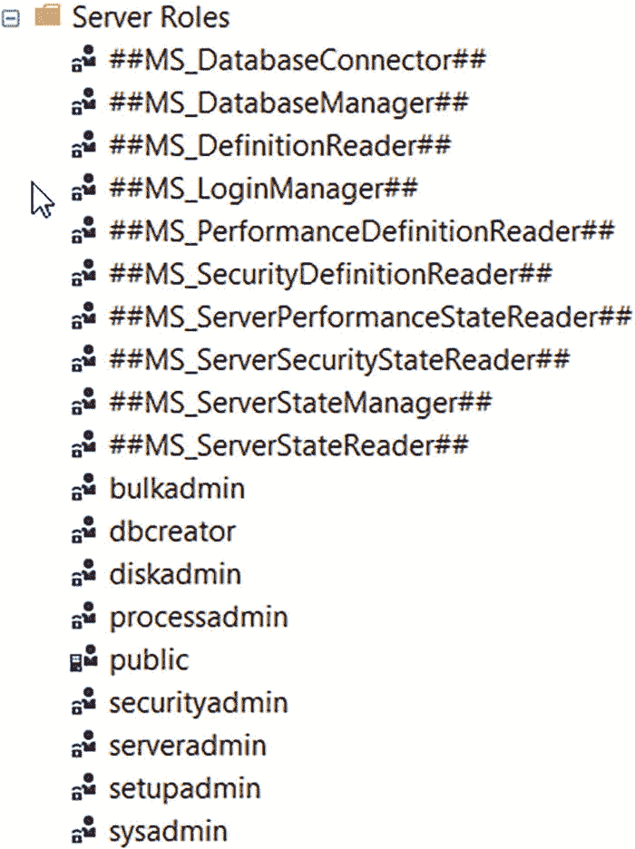

# 使用 SQL Server Ledger 进行数据审计

```
USE [ContosoHR];
GO
sp_helptext 'Employees_ledger';
GO
该查询的结果应类似于以下 T-SQL 代码：
CREATE VIEW [dbo].[Employees_Ledger] AS
SELECT [EmployeeID], [SSN], [FirstName], [LastName], [Salary], [ledger_start_transaction_id] AS [ledger_transaction_id], [ledger_start_sequence_number] AS [ledger_sequence_number], 1 AS [ledger_operation_type], N'INSERT' AS [ledger_operation_type_desc]
FROM [dbo].[Employees]
UNION ALL
SELECT [EmployeeID], [SSN], [FirstName], [LastName], [Salary], [ledger_start_transaction_id] AS [ledger_transaction_id], [ledger_start_sequence_number] AS [ledger_sequence_number], 1 AS [ledger_operation_type], N'INSERT' AS [ledger_operation_type_desc]
FROM [dbo].[MSSQL_LedgerHistoryFor_901578250]
UNION ALL
SELECT [EmployeeID], [SSN], [FirstName], [LastName], [Salary], [ledger_end_transaction_id] AS [ledger_transaction_id], [ledger_end_sequence_number] AS [ledger_sequence_number], 2 AS [ledger_operation_type], N'DELETE' AS [ledger_operation_type_desc] FROM [dbo].[MSSQL_LedgerHistoryFor_901578250]
```

让我们分解一下视图是如何构建结果的。`Employees` 日志表中的任何行都是 `INSERT`。历史表（`MSSQL_LedgerHistoryFor_901578250`）中的任何 `UPDATE` 都对应一个 `INSERT` 和一个 `DELETE`，而任何 `DELETE` 在历史表中都记录为 `DELETE`。请注意，历史表的名称始终是 `MSSQL_LedgerHistoryFor_<object id>`，其中 `<object id>` 是基础日志表的 `object_id`。使用 `UNION ALL` 将它们组合在一起。

6. 让我们使用日志视图来获取更多与日志表关联的事务审计信息，执行脚本 `viewemployeesledgerhistory.sql`。此脚本执行以下 T-SQL 语句：

```
USE ContosoHR;
GO
SELECT e.EmployeeID, e.FirstName, e.LastName, e.Salary,
dlt.transaction_id, dlt.commit_time, dlt.principal_name, e.ledger_operation_type_desc, dlt.table_hashes
FROM sys.database_ledger_transactions dlt
JOIN dbo.Employees_Ledger e
ON e.ledger_transaction_id = dlt.transaction_id
ORDER BY dlt.commit_time DESC;
GO
```

在这个查询中，我引入了一个新的系统表（实际上是一个视图），称为 `database_ledger_transactions`。我们可以使用日志视图中的事务 ID 来连接此表以获取更多洞察。从这个系统表中，我们可以看到事务是何时执行的、执行更改的 SQL 主体是谁，以及该事务的加密哈希值。你可以看到 “bob” 插入了日志表的所有行。你可以在 [`https://docs.microsoft.com/sql/relational-databases/system-catalog-views/sys-database-ledger-transactions-transact-sql`](https://docs.microsoft.com/sql/relational-databases/system-catalog-views/sys-database-ledger-transactions-transact-sql) 查看此系统表的完整定义。

7. 让我们生成一个摘要以确保我们可以验证日志，执行脚本 `generatedigest.sql`。此脚本执行以下 T-SQL 语句：

```
USE ContosoHR;
GO
EXEC sp_generate_database_ledger_digest;
GO
```

此过程的结果是 JSON 数据。此时你可以验证日志，但我们将在这次更新后再次运行此命令以验证日志，因此你不需要保存此查询的输出。

8. 你可以通过执行脚本 `getledgerblocks.sql` 查看数据库日志中生成的区块链。此脚本执行以下 T-SQL 语句：

```
USE ContosoHR;
GO
SELECT * FROM sys.database_ledger_blocks;
GO
```

系统表 `database_ledger_blocks`（实际上是一个视图）代表了数据库日志中的内部区块链。

9. 尝试更新 Jay Adams 的薪资，看看 Ledger 如何跟踪更改，执行脚本 `updatejayssalary.sql`。此脚本执行以下 T-SQL 语句：

```
USE ContosoHR;
GO
UPDATE dbo.Employees
SET Salary = Salary + 50000
WHERE EmployeeID = 4;
GO
```

10. 再次执行脚本 `getallemployees.sql`。如果你对 `Employees` 表中的原始数据一无所知，你将无法知道是否发生了任何更新。

11. 再次执行脚本 `viewemployeesledgerhistory.sql`。现在结果显示了我们需要的信息。我们可以看到 Jay Adams 薪资的原始 `INSERT` 记录，但我们也看到名为 bob 的人尝试直接更新它（`INSERT`/`DELETE` 组合）。

通过再次执行脚本 `generatedigest.sql` 生成另一个摘要。保存此输出值（包括括号）以用于验证日志。

12. 你现在可以验证日志（1）在初始数据填充后和（2）在对 Jay Adam 的薪资进行更新之后。首先编辑脚本 `verifyledger.sql` 来验证日志的当前状态。在 `N' '` 引号内放入你最近保存的摘要 JSON。此脚本执行以下 T-SQL 语句：

```
USE ContosoHR;
GO
EXECUTE sp_verify_database_ledger
N''
GO
```

执行该脚本。你的输出应列出与摘要 JSON 数据中相同的 `block_id`。

你现在已经验证了日志表与加密哈希、区块链和保存的摘要相匹配。你现在可以相信日志数据是准确的，即 bob 是更新 Jay Adam 薪资的人。

## 练习 2：使用仅附加日志

虽然 SQL Server 的 Ledger 对于审计哪个 SQL 主体进行任何事务更改非常有用，但如果应用程序使用“应用程序登录”来执行所有 SQL 查询呢？你将如何知道发起导致数据更改操作的原始应用程序用户？

对于此场景，我们将构建一个仅附加日志表，用于记录来自应用程序的信息，包括导致 SQL 更改的用户发起的应用程序操作。除了本练习中指出的一个例外情况外，请使用在第一个练习中创建的 `bob` 登录连接执行所有查询。

1. 通过执行脚本 `createauditledger.sql` 创建一个用于审核应用程序的仅附加日志表。此脚本执行以下 T-SQL 语句：

```
USE ContosoHR;
GO
-- 创建一个仅附加日志表，用于跟踪来自应用的 T-SQL 命令以及发起事务的“真实”用户
DROP TABLE IF EXISTS [dbo].[AuditEvents];
GO
CREATE TABLE [dbo].AuditEvents),
[UserName] nvarchar NOT NULL,
[Query] nvarchar NOT NULL
)
WITH (LEDGER = ON (APPEND_ONLY = ON));
GO
```

应用程序已增强，以便针对 `Employees` 表执行的任何事务都会在此表中插入一行。请注意，你不需要 `SYSTEM_VERSIONING` 子句。

2. 现在，使用在第一个练习中创建的 `app` 登录（此登录是在 `createdb.sql` 脚本中创建的）登录到新连接。执行脚本 `appchangemaryssalary.sql`。此脚本执行以下 T-SQL 语句：

```
USE ContosoHR;
GO
UPDATE dbo.Employees
SET Salary = Salary + 50000
WHERE EmployeeID = 8;
GO
INSERT INTO dbo.AuditEvents VALUES (getdate(), 'bob', 'UPDATE dbo.Employees SET Salary = Salary + 50000 WHERE EmployeeID = 8');
GO
```

此脚本模拟了如果用户尝试更新 Mary 的薪资，应用程序将执行的操作。

3. 使用系统管理员登录 `bob` 的连接，执行脚本 `viewemployeesledgerhistory.sql`。从结果中你可以看到 `app` 登录更改了 Mary 的薪资。这很准确，但究竟是谁真正发起了这次更改？

4. 执行脚本 `getauditledger.sql`。此脚本执行以下 T-SQL 语句：

```
USE ContosoHR;
GO
SELECT * FROM dbo.AuditEvents_Ledger;
GO
```


你可以看到，应用程序记录了 `bob` 发起了一个查询（`app` 登录记录了该查询），该查询导致了 Mary 的薪资变更。由于表是仅追加的，其他用户无法进入并尝试抹去应用程序所做操作的任何记录。

### 练习 3：保护 Ledger 对象

在本练习中，你将学习 SQL Server 如何保护 ledger 对象。

1.  执行脚本 `getledgerobjects.sql` 以查看已创建的 ledger 表和列的历史记录。该脚本执行以下 T-SQL 语句：

```sql
    USE ContosoHR;
    GO
    SELECT * FROM sys.ledger_table_history;
    GO
    SELECT * FROM sys.ledger_column_history;
    GO
```

2.  尝试修改或删除 ledger 对象。执行脚本 `admindropledger.sql`。该脚本执行以下 T-SQL 语句：

```sql
    USE ContosoHR;
    GO
    -- 无法为 ledger 表关闭版本控制
    ALTER TABLE Employees SET (SYSTEM_VERSIONING = OFF);
    GO
    -- 无法删除 ledger 历史表
    DROP TABLE dbo.MSSQL_LedgerHistoryFor_901578250;
    GO
    -- 可以删除 ledger 表
    DROP TABLE Employees;
    GO
    -- 但我们保留了已删除表的历史记录
    SELECT * FROM sys.objects WHERE name like '%DroppedLedgerTable%';
    GO
```

从输出中你可以看到，无法为 ledger 表关闭版本控制（没有设置 `LEDGER = OFF` 的语法）。你也不能删除历史表。你可以删除 ledger 表，但我们会保留关于删除了什么的记录。而且你无法删除“已删除”的 ledger 表。此外，即使你删除了 ledger 表，与该表关联的事务仍会保留在数据库 ledger（系统表）中。删除已存在的已删除 ledger 表的唯一方法是删除整个数据库。

你也可以再次执行脚本 `getledgerobjects.sql` 来查看删除历史。SSMS 中的对象资源管理器也可以向你显示哪些 ledger 表已被删除。

### 练习 4：被篡改的 Ledger 是什么样子？

当我第一次听说 Ledger 时，我心想：“我对内部机制相当了解。我能击败这个系统吗？” 于是，我开始了一段尝试 *篡改* ledger 的旅程。

我不能分享我做了什么的细节，但基本上，在一次基本的 T-SQL 更新之后，我尝试了各种 *超出支持 SQL 范围* 的方法来 *入侵* ledger。我试图通过一种极其未记录的方式操纵数据库 ledger 系统表，来隐藏对 ledger 表的更新。我实际上找到了一种方法让它工作，直到 Panagiotis 对我说：“那摘要呢？” 说中了！我确实可以入侵 SQL Server，使其看起来我的更新从未存在过，但摘要存储在独立的存储中，所以我无法入侵它。你可以在示例目录的 T-SQL 笔记本 `ledger.ipynb` 中看到我早期尝试的结果。你也可以在 2022 年 SQLBits 主题演讲中，看到我与 Buck Woody 现场演示，地址是 [`https://youtu.be/_R9FE2ZclVk`](https://youtu.be/_R9FE2ZclVk)（从大约 12 分钟处开始）。

#### 你还应该知道什么？

SQL Server 的 Ledger 在很多方面都是一项惊人的技术。对我而言，我意识到 SQL 现在为行业问题提供了解决方案，例如多方信任场景，这些并非 SQL 的传统解决方案。

事实上，很早就有客户开始采用这项技术来解决实际问题。联想（Lenovo）看到了将其信任融入供应链的机会。他们的供应链跨越多方，但谁来监督数据？这就是 Ledger 的力量。你可以在 [`https://customers.microsoft.com/story/1497685499820529889-lenovo-manufacturing-azure-SQL-database-ledger`](https://customers.microsoft.com/story/1497685499820529889-lenovo-manufacturing-azure-SQL-database-ledger) 阅读联想的故事。

作为一个团队，我们致力于寻找新颖创新的方式，将 Ledger 引入 SQL 从未被视为解决方案的市场。

为 SQL Server 的 Ledger 添加的一个非常棒的功能是自动摘要存储。在示例中，你学习了如何手动生成和使用摘要。SQL Server 2022 可以配置为自动将摘要保存到 Azure Blob 存储。你可以在 [`https://docs.microsoft.com/sql/relational-databases/security/ledger/ledger-how-to-enable-automatic-digest-storage`](https://docs.microsoft.com/sql/relational-databases/security/ledger/ledger-how-to-enable-automatic-digest-storage) 阅读所有细节。

与任何功能一样，它存在一些限制，Ledger 也不例外。请在 [`https://docs.microsoft.com/sql/relational-databases/security/ledger/ledger-limits`](https://docs.microsoft.com/sql/relational-databases/security/ledger/ledger-limits) 保持对所有限制的更新。

当我研究 Ledger 时，我积累了一系列问题，并与 Panagiotis 和我们 Ledger 的首席项目经理 Pieter Vanhove 一起进行了探讨：

*   这与时间表有何不同？

    Ledger 对于可更新的 ledger 表使用了时间表功能，但与时间表不同的是，它具有内置的审计功能并支持仅追加表。

*   这与 SQL Server 审计有何不同？

    Ledger 将审计功能内置于事务变更中，所有审计信息都存储在数据库中。此外，所有变更都通过加密哈希和独立的摘要存储进行跟踪。一旦创建了 ledger，就无法撤销它，而拥有适当权限的系统管理员无法抹去审计记录。创建 ledger 表后，抹去它的唯一方法是完全删除数据库，但即便如此，独立的摘要仍然存在。

*   我需要多久保存一次摘要？

    摘要是验证 ledger 未被篡改的主要机制。理论上，你需要为每个事务生成一个独立的摘要，但这不切实际。根据你验证 ledger 的业务需求，尽可能频繁地保存摘要。自动摘要管理每 30 秒保存一次摘要。

*   Ledger 需要更多空间吗？

    可更新的 ledger 表所需的额外空间与时间表大致相同。每个事务需要独立的系统表行来存储加密哈希。内部区块链需要最少的空间，但这取决于你保留 ledger 的时间长短。摘要本身很小，同样，你需要保留与包含 ledger 表的数据库一样长的历史记录。

*   是否有任何性能影响？

    我们没有针对 Ledger 运行特定的性能基准测试，因为我们认为影响会很小。考虑到仅追加的 ledger 表不应看到任何影响。可更新的 ledger 表可能会看到与时间表相同的影响。

请在 [`https://aka.ms/sqlledger`](https://aka.ms/sqlledger) 关注 SQL Server Ledger 的所有最新信息。

### 加密增强功能

数据加密是安全的一个关键方面，SQL Server 提供了多种不同的功能来端到端地加密数据。端到端意味着从连接到 SQL Server、SQL Server 引擎中的数据，到静态存储的数据。要了解 SQL Server 加密功能的完整阵容，请查看我们的文档：[`https://docs.microsoft.com/sql/relational-databases/security/encryption/sql-server-encryption`](https://docs.microsoft.com/sql/relational-databases/security/encryption/sql-server-encryption)。

在 SQL Server 2022 中，我们在加密方面有一些增强，包括 Always Encrypted 的增强、加密增强以及连接加密的增强。


## Always Encrypted 增强功能

在 SQL Server 2016 中，我们引入了一种称为 Always Encrypted 的端到端加密新概念。其核心思想是数据在客户端应用程序中加密，并且在 SQL Server 引擎中始终保持加密状态（因此得名）。此外，用于解密数据的密钥由应用程序拥有。因此，SQL Server 的管理员无法解密数据；只有应用程序能做到这一点。如果您不熟悉 Always Encrypted，可以通过访问 [`https://docs.microsoft.com/sql/relational-databases/security/encryption/always-encrypted-database-engine`](https://docs.microsoft.com/sql/relational-databases/security/encryption/always-encrypted-database-engine) 来了解如何配置和使用它。

由于数据在 SQL Server 引擎内永远不会以*明文*形式出现，原始设计存在一些限制。例如，使用 `LIKE` 等运算符的查询将无法工作，因为引擎需要将数据解密为明文才能执行操作。

在 SQL Server 2019 中，我们通过一项称为 *secure enclaves*（安全飞地）的概念增强了 Always Encrypted。安全飞地是 SQL Server 引擎内部的一个安全内存区域。即使在数据库引擎内部，代码也无法在飞地中看到明文数据。飞地技术提供了一种方法，使 SQL Server 能够将密钥从应用程序传递到飞地中，以执行任何需要明文的操作，例如模式匹配操作。SQL Server 2019 支持称为虚拟化飞地或 VBS 飞地的概念（Azure 则通过 Intel Software Guard Extensions (Intel SGX) 支持硬件飞地）。由于解密发生在服务器上，我个人发现使用安全飞地还能显著提升对使用 Always Encrypted 加密的列进行的几乎所有操作的性能。

您可以在 [`https://docs.microsoft.com/sql/relational-databases/security/encryption/always-encrypted-enclaves`](https://docs.microsoft.com/sql/relational-databases/security/encryption/always-encrypted-enclaves) 阅读关于带有安全飞地的 Always Encrypted 的完整介绍。

在 SQL Server 2022 中，我们对带有安全飞地的 Always Encrypted 进行了增强，提供了以下新功能：

*   SQL Server 2022 可以在 VBS 安全飞地内使用多线程和密钥缓存，以进一步提升性能。
*   SQL Server 2022 可以支持新的联接类型以及 `ORDER BY` 和 `GROUP BY` 操作。此项支持与 Azure SQL Database 的功能保持一致。

## 加密功能增强

我们希望确保 SQL Server 符合最新的密码学或加密标准。SQL Server 在引擎的许多不同功能中使用加密技术，包括证书和密钥支持。根据 SQL 安全方面的高级项目经理 Shoham Dasgupta 的说法，“*我们希望增强 SQL Server 中的默认加密技术*，以达到/超越行业标准，并保护客户的机密数据，以应对不断演变的威胁格局。”

我们内部进行的一项未对客户直接可见的增强是强化了我们的算法，以符合当前美国国家标准与技术研究院 (NIST) 的标准，具体包括：

*   所有系统生成的证书的最小强度为 RSA-3072，这是 NIST 推荐的位密钥大小。
*   增强我们用于签名生成的内部哈希算法，使用 SHA-2 512，这是一种比 SHA-1 更安全的方法。

另一项旨在强化安全性以符合当今标准的投资是支持个人信息交换 (PFX) 格式。SQL Server 支持在数据库引擎内创建证书来保护对象、连接和数据。SQL Server 2022 现在支持为 PFX 创建证书。PFX 或 PKCS#12 是一种现代的证书格式，SQL Server 现在支持使用 PFX 文件，通过 `CREATE CERTIFICATE` 语句在 SQL Server 中创建证书。您可以在 [`https://docs.microsoft.com/sql/t-sql/statements/create-certificate-transact-sql`](https://docs.microsoft.com/sql/t-sql/statements/create-certificate-transact-sql) 阅读更多关于如何使用 PFX 文件创建证书的信息。

加密方面的最后一项增强是支持将密钥备份和还原到 Azure Blob Storage 或从其还原。数据库主密钥通常用于保护凭证，例如用于外部数据源的凭证。但您经常需要将此密钥与数据库分开备份。SQL Server 2022 现在允许您将这些密钥之一备份或还原到 Azure Blob Storage 或从其还原，而不是备份或还原到本地或网络文件路径。您可以在 [`https://docs.microsoft.com/sql/t-sql/statements/backup-master-key-transact-sql`](https://docs.microsoft.com/sql/t-sql/statements/backup-master-key-transact-sql) 阅读如何使用新的 URL 语法。对称密钥 (`SYMMETRIC keys`) 也存在相同的支持，您可以在 [`https://docs.microsoft.com/sql/t-sql/statements/backup-symmetric-key-transact-sql`](https://docs.microsoft.com/sql/t-sql/statements/backup-symmetric-key-transact-sql) 阅读相关信息。


#### 严格连接加密

表格数据流（TDS）是应用程序连接 SQL Server 并进行数据传输所使用的 `数据协议`。自 SQL Server 成为产品以来，TDS 便已存在。随着时间的推移，TDS 通过版本号系统不断得到增强和修改。通常，随着新版本 TDS 的发布，应用程序需要使用相应的提供程序或驱动程序来支持它。微软在 1998 年发布 SQL Server 7.0 时，将 TDS 的主版本号更改为 7.0。此后，次版本号也随之更新，最新的 TDS 7.4 支持 SQL Server 2012 及更高版本。用户、管理员和开发人员无需了解 TDS 协议的细节，只需了解其功能变化或需要使用更新的驱动程序即可。我曾在微软担任多年的支持工程师，为了解决复杂的客户问题，我经常需要 TDS 的详细信息。您可以在 [`https://docs.microsoft.com/openspecs/windows_protocols/ms-tds/b46a581a-39de-4745-b076-ec4dbb7d13ec`](https://docs.microsoft.com/openspecs/windows_protocols/ms-tds/b46a581a-39de-4745-b076-ec4dbb7d13ec) 自行阅读所有细节。

SQL Server 2022 引入了 TDS 的一个新主版本，即 TDS 8.0。使用 TDS 7.4 的驱动程序和提供程序仍然得到完全支持。新的驱动程序理解 TDS 8.0 并能够使用此协议。推出这个新版本的主要原因是连接加密。多年来，SQL Server 一直支持应用程序与 SQL Server 之间通信的加密。与许多应用程序一样，SQL Server 使用传输层安全性（TLS）来实现通信加密。SQL Server 始终允许应用程序通过名为 `Encrypt` 和 `TrustServerCertificate` 的连接字符串选项来决定是否使用加密与 SQL Server 进行通信。您还可以在服务器端强制对客户端连接进行加密。这两种连接字符串的组合非常重要，您可以在 [`https://docs.microsoft.com/dotnet/framework/data/adonet/connection-string-syntax#using-trustservercertificate`](https://docs.microsoft.com/dotnet/framework/data/adonet/connection-string-syntax#using-trustservercertificate) 阅读更多细节。

TDS 8.0 引入了 `严格连接` 加密的概念。如果应用程序使用 `Encrypt = strict` 值，则会启用 TDS 8.0 协议。这里的一个显著变化是，如果使用了严格连接加密，那么客户端和 SQL Server 之间的通信**必须**是加密的（因此称为 `strict`）。另一个重要之处在于 TDS 8.0 处理连接加密的方式。在 TDS 8.0 之前，SQL Server 会与客户端执行未加密的握手或预登录。现在，借助 TDS 8.0，该握手过程完全通过 TLS 加密。这适用于所有 TLS 版本。这一点非常重要，因为它符合 HTTPS 等协议的标准，并允许网络设备安全地传递 SQL 通信。最新的提供程序必须能够使用 TDS 8.0。您可以在 [`https://docs.microsoft.com/sql/relational-databases/security/networking/tds-8-and-tls-1-3#strict-connection-encryption`](https://docs.microsoft.com/sql/relational-databases/security/networking/tds-8-and-tls-1-3#strict-connection-encryption) 了解更多信息。

此外，但与 TDS 8.0 独立的是，SQL Server 2022 现在支持最新版本的 TLS 1.3。TLS 1.3 是最安全的 TLS 版本。您可以在 [`https://docs.microsoft.com/sql/relational-databases/security/networking/tds-8-and-tls-1-3?#differences-between-tls-12-and-tls-13`](https://docs.microsoft.com/sql/relational-databases/security/networking/tds-8-and-tls-1-3?#differences-between-tls-12-and-tls-13) 阅读更多关于 TLS 1.2 和 1.3 之间差异的信息。

注意

当产品正式发布时，我们也在研究在服务器级别强制执行此选项的方法。

### 安全权限增强

在 SQL Server 2022 中，我们还针对授权或权限场景引入了一些增强功能。这包括新的固定服务器级角色和用于动态数据屏蔽的新权限。

#### 新的固定服务器级角色

直到 SQL Server 2022 之前，该产品都附带一组特定的 `固定` 服务器级角色。它们是固定的，因为您无法更改角色的访问级别或定义。它们是服务器级的，因为它们适用于整个 SQL Server 实例，而不仅仅是单个数据库。

您可能熟悉其中一些角色，例如 `sysadmin`、`securityadmin`、`dbcreator` 和 `public`。您可以在 [`https://docs.microsoft.com/sql/relational-databases/security/authentication-access/server-level-roles`](https://docs.microsoft.com/sql/relational-databases/security/authentication-access/server-level-roles) 查看这些角色的完整列表。

我们长期以来从客户那里看到的一个请求是，希望我们提供的产品角色具有 `更细的粒度`——换句话说，就是拥有更少特定任务权限的更多固定角色。我在微软的同事 Andreas Wolter 就 `最低权限` 主题撰写了一篇有趣的博客，地址是 [`https://techcommunity.microsoft.com/t5/azure-sql-blog/security-the-principle-of-least-privilege-polp/ba-p/2067390`](https://techcommunity.microsoft.com/t5/azure-sql-blog/security-the-principle-of-least-privilege-polp/ba-p/2067390)。

SQL Server 2022 现在提供了遵循此原则的内置新固定服务器级角色。您可以在 [`https://docs.microsoft.com/sql/relational-databases/security/authentication-access/server-level-roles?#fixed-server-level-roles-introduced-in-sql-server-2022`](https://docs.microsoft.com/sql/relational-databases/security/authentication-access/server-level-roles?#fixed-server-level-roles-introduced-in-sql-server-2022) 查看完整列表。

我挑选了几个我觉得很有趣的角色：

*   `##MS_DefinitionReader##`
    *   此角色的成员被授予查看需要 `VIEW ANY DEFINITION` 或 `VIEW DEFINITION` 权限（假设他们在该数据库中拥有用户账户）的目录视图的权限。这是一种很好的方式，可以赋予某人“查看”有关服务器或重要信息的权限，而不允许他们进行更改。

*   `##MS_ServerStateReader##`
    *   此角色的成员被授予查看需要 `VIEW SERVER STATE` 或 `VIEW DATABASE` 状态（假设他们在该数据库中拥有用户账户）的动态管理视图（DMV）或函数的权限。

*   `##MS_ServerPerformanceStateReader##`
    *   此角色与前一个固定角色类似，但更侧重于查看来自动态管理视图（DMV）的特定性能信息。此固定角色中的用户被授予与需要 `VIEW SERVER PERFORMANCE STATE` 权限的对象相同的权限。

想象一下这种情况：您想聘请一位顾问来查看系统和数据库的重要信息，以便为您提供分析。出于隐私原因，您不希望他们访问任何用户数据，也不希望他们进行更改。将他们添加为这两个角色的成员可以帮助您实现这一目标，而在此之前，您必须使用一个权限超过必要的固定服务器级角色，或者为他们的账户在实例以及您需要他们提供咨询的所有数据库中设置自定义权限。

您还会喜欢 SSMS 19 已得到增强以支持这些新的固定服务器级角色，如图 6-4 所示。



图 6-4 SQL Server 2022 固定服务器级角色


我快速进行了一项测试，以查看属于 `MS_ServerPerformanceStateReader` 角色与仅属于公共固定角色之间的权限差异。如果你只有公共固定角色，那么在查询 `sys.dm_exec_requests` 时，你只能看到自己的会话。但如果你是 `MS_ServerPerformanceStateReader` 角色的成员，你就能从 `sys.dm_exec_requests` 中看到所有会话。一个需要 `MS_ServerStateReader` 或 `MS_ServerSecurityStateReader` 角色成员资格才能访问的 DMV 示例是 `sys.dm_server_audit_status` DMV。任何仅属于 `MS_ServerPerformanceStateReader` 角色的用户都将无权访问此 DMV。实际上，我们在这里所做的是将 `MS_ServerStateReader` 角色拆分为两个不同的角色：`MS_ServerPerformanceStateReader` 和 `MS_ServerSecurityStateReader`。

## 动态数据屏蔽功能增强

动态数据屏蔽是指在表架构中提供逻辑，以便在用户查看数据时进行屏蔽（例如，将电子邮件地址屏蔽为 xxxx@xxxx 的格式）。我们在 SQL Server 2016 中引入了此概念，并且它非常受欢迎。在此功能出现之前，应用程序必须在代码中实现屏蔽逻辑。如果需要更改屏蔽逻辑，则必须更改并重新部署应用程序。动态数据屏蔽提供了一种在定义表列时定义屏蔽规则的方法。如果你是动态数据屏蔽的新手，请从我们的文档开始：[`https://docs.microsoft.com/sql/relational-databases/security/dynamic-data-masking`](https://docs.microsoft.com/sql/relational-databases/security/dynamic-data-masking)。

动态数据屏蔽的一个优点是我们为常见的屏蔽场景提供了内置函数。因此，像这样的列定义：

```sql
Email   varchar(100) MASKED WITH (FUNCTION = 'email()') NOT NULL
```

将导致此列中存储的任何值在用户看来都是 XXX@XXXX.com。

你可以在以下位置查看动态数据屏蔽的完整函数列表：[`https://docs.microsoft.com/sql/relational-databases/security/dynamic-data-masking?#defining-a-dynamic-data-mask`](https://docs.microsoft.com/sql/relational-databases/security/dynamic-data-masking?#defining-a-dynamic-data-mask)。

在 SQL Server 2022 中，我们为 datetime 列类型添加了一个新函数。你可以屏蔽 datetime 值的全部或部分，例如年、月、日、时、分或秒。

动态数据屏蔽的原始实现默认不允许“非管理员”用户查看未屏蔽的数据。但是，我们提供了一个名为 `GRANT UNMASK` 的 T-SQL 命令选项，以便授予用户查看未屏蔽数据的能力。这个原始设计的问题在于，未屏蔽权限是针对数据库中的任何屏蔽规则。

2021 年，我们将细粒度 `UNMASK` 的概念引入 Azure，使得此权限可以应用于架构、表或列级别。你可以在以下位置查看原始公告：[`https://azure.microsoft.com/updates/general-availability-dynamic-data-masking-granular-permissions-for-azure-sql-and-azure-synapse-analytics/`](https://azure.microsoft.com/updates/general-availability-dynamic-data-masking-granular-permissions-for-azure-sql-and-azure-synapse-analytics/)。

SQL Server 2022 只是将此实现从云端引入到了 SQL Server。你可以在以下位置查看细粒度未屏蔽的示例：[`https://docs.microsoft.com/sql/relational-databases/security/dynamic-data-masking?#granular`](https://docs.microsoft.com/sql/relational-databases/security/dynamic-data-masking?#granular)。

