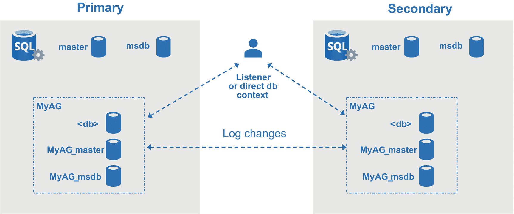
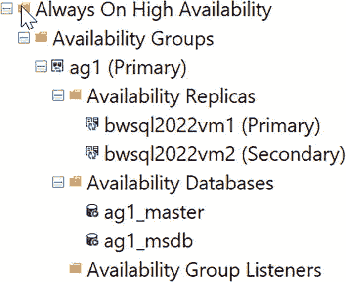
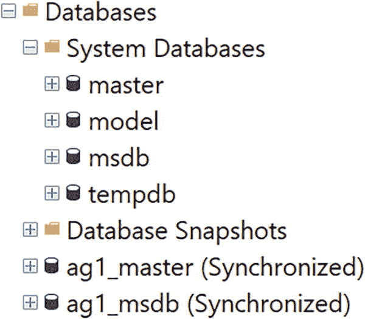
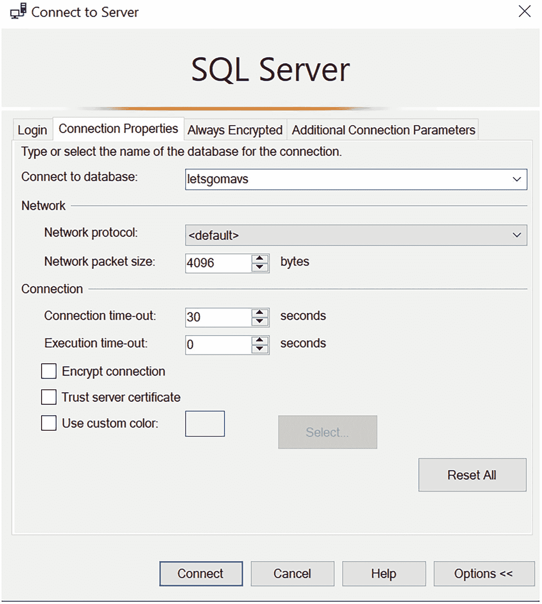
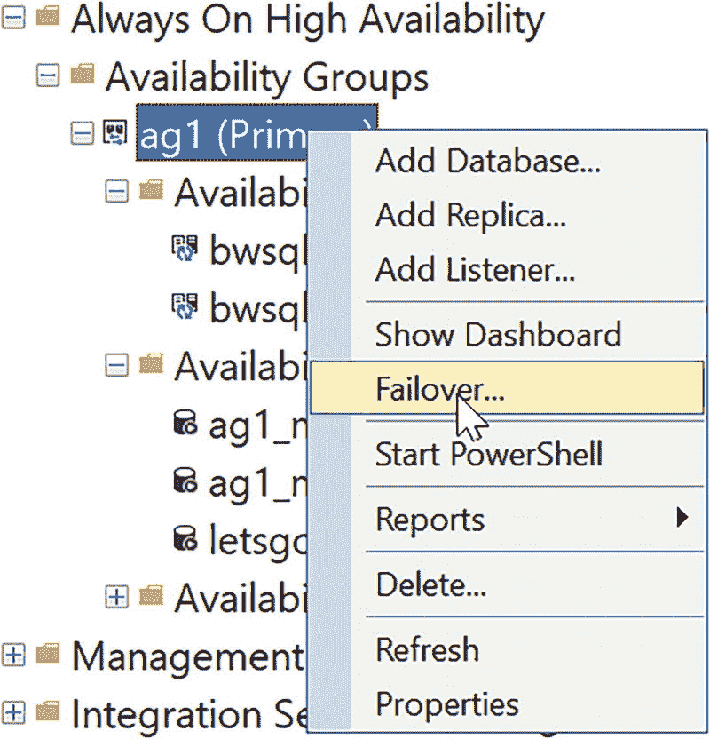

# 亲自试试看

如果你想了解我们如何有望永久消除用户的 tempdb 闩锁争用问题，请完成以下练习：

## 先决条件

*   SQL Server 2022 评估版。
*   配备四个 CPU 和至少 8GB 内存的虚拟机或计算机。
*   SQL Server Management Studio (SSMS)。最新的 18.x 或 19.x 版本均可。
*   从 [`https://aka.ms/ostress`](https://aka.ms/ostress) 下载 `` `ostress.exe` ``。使用下载的 `RMLSetup.msi` 文件进行安装。所有选项均使用默认设置。
*   使用书本示例中找到的脚本，位于 `` `ch06_meatandpotatoes\scalability\tempdb` `` 目录中。

注意：此练习需要你多次重启实例。

## 设置练习

请按照以下步骤设置练习：

1.  配置性能监视器（perfmon）以跟踪 `` `SQL Server SQL Statistics:SQL Statistics/Batch requests/sec` ``（将比例设置为 0.1）和 `` `SQL Server:Wait Statistics/Page latch waits/Waits started per second` ``。
2.  执行脚本 `` `findtempdbdbilfes.sql` `` 并保存输出。本演示末尾提供了一个脚本，用于恢复你的 tempdb 文件设置。此脚本执行以下 T-SQL 语句：

    ```sql
    USE master;
    GO
    SELECT name, physical_name, size*8192/1024 as size_kb, growth*8192/1024 as growth_kb
    FROM sys.master_files
    WHERE database_id = 2;
    GO
    ```

3.  使用命令脚本 `` `startsqlminimal.cmd` `` 以 *最小* 模式启动 SQL Server。最小模式（/f 启动参数）允许你删除 tempdb 文件，仅保留一个数据文件。此脚本执行以下命令：

    ```bat
    net stop mssqlserver
    net start mssqlserver /f
    ```

4.  执行命令脚本 `` `modifytempdbfiles.cmd` ``。这将执行 SQL 脚本 `` `modifytempdbfiles.sql` ``，以将日志文件扩大到 200MB（避免任何自动增长）并删除除第一个文件（tempdev）之外的所有 tempdb 文件。如果你的 tempdb 文件超过四个，则需要编辑此脚本以删除除 `` `tempdev` `` 之外的所有文件。

    `` `modifytempdbfiles.cmd` `` 执行以下命令：

    ```bat
    sqlcmd -E -imodifytempdbfiles.sql
    ```

    `` `modifytempdbfiles.sql` `` 执行以下 T-SQL 语句：

    ```sql
    USE master;
    GO
    ALTER DATABASE tempdb MODIFY FILE (NAME=templog, SIZE = 200Mb, FILEGROWTH = 65536Kb);
    GO
    ALTER DATABASE tempdb REMOVE FILE temp2;
    GO
    ALTER DATABASE tempdb REMOVE FILE temp3;
    GO
    ALTER DATABASE tempdb REMOVE FILE temp4;
    GO
    ```

## 练习步骤

现在你已准备好运行练习，该练习包含三个不同的测试。在每个测试中，你将运行相同的工作负载，并观察性能监视器计数器和工作负载总时长。

### 测试 1：禁用 tempdb 元数据优化并禁用 GAM/SGAM 增强功能。

第一个测试展示了未启用任何优化时的工作负载性能。但由于我们使用的是 SQL Server 2022，即使只有一个文件，PFS 并发增强功能也是启用的，因为这是在 SQL Server 2019 中内置到代码中的。这就是为什么你不会看到任何 PFS 页上的闩锁争用。

1.  运行脚本 `` `disableoptimizetempdb.cmd` ``。此脚本运行以下命令：

    ```bat
    sqlcmd -E -idisableopttempdb.sql
    net stop mssqlserver
    net start mssqlserver
    ```

    `` `disableopttempdb.sql` `` 执行以下 T-SQL 语句：

    ```sql
    ALTER SERVER CONFIGURATION SET MEMORY_OPTIMIZED TEMPDB_METADATA = OFF;
    GO
    ```

    尽管 tempdb 元数据优化默认未开启，但我们仍将其禁用以作确认。

2.  运行脚本 `` `disablegamsgam.cmd` ``。此脚本运行以下命令：

    ```bat
    net stop mssqlserver
    net start mssqlserver /T6950 /T6962
    ```

    这些是未文档化的跟踪标志，用于禁用 SQL Server 2022 的新增强功能。这些不受支持，仅用于本练习的目的。

    现在，服务器运行时除了从 SQL Server 2019 继承的 PFS 并发外，没有任何优化。

3.  将脚本 `` `pageinfo.sql` `` 加载到 SSMS 中。当工作负载开始时，你将运行此脚本以查看闩锁争用的情况。此脚本执行以下 T-SQL 语句：

    ```sql
    USE tempdb;
    GO
    SELECT object_name(page_info.object_id), page_info.*
    FROM sys.dm_exec_requests AS d
    CROSS APPLY sys.fn_PageResCracker(d.page_resource) AS r
    CROSS APPLY sys.dm_db_page_info(r.db_id, r.file_id, r.page_id,'DETAILED')
    AS page_info;
    GO
    ```

    此脚本使用了 SQL Server 2019 中引入的 T-SQL 内置函数来“解析页面”并查看其内容。此外，它还使用了一个函数来获取页面的元数据，例如其所属的 `object_id` 和页面类型。

4.  在命令提示符下使用以下语法执行脚本 `` `tempsql22stress.cmd` ``（在 PowerShell 中你只需要 `.\`）：

    ```powershell
    .\tempsql22stress.cmd 25
    ```

    可以继续后续步骤，但在命令结束后请返回查看更详细的语法。

    此脚本使用 `` `ostress.exe` `` 执行以下命令：

    ```bat
    "c:\Program Files\Microsoft Corporation\RMLUtils\ostress" -E -Q"declare @t table (c1 varchar(100)); insert into @t values ('x');" -n%1 -r1000 -q
    ```

    让我们看看这些参数：
    - `-Q` 用于运行查询。注意这是一个使用表变量的批处理。这种特定语法不允许临时表缓存，因此我们给分配和系统表施加了很大压力。
    - `-n` 表示用户数量。我们提供了 25 个并发用户的值。
    - `-r` 表示每个用户将运行查询的迭代次数。
    - `-q` 抑制所有结果集处理以加快速度，因为我们不关心查看结果。

5.  执行 `` `pageinfo.sql` `` 脚本并观察结果。注意，闩锁争用是针对 tempdb 中属于系统表的页面。在 GAM 页上几乎没有闩锁等待，因为系统表页闩锁争用是“热点”。

6.  观察性能监视器计数器。记录平均值和最大值，以便与第二和第三个测试进行比较。

7.  观察工作负载 `` `tempsql22stress.cmd` `` 的持续时间（显示为已用时间）。记录此值，以便与第二和第三个测试进行比较。

### 测试 2：启用 tempdb 元数据优化并禁用 GAM/SGAM 增强功能。

我们将运行完全相同的测试，但这次我们将启用 tempdb 元数据优化并禁用 SQL Server 2022 的新增强功能。

1.  运行脚本 `` `optimizetempdb.cmd` ``。此脚本将执行 `` `optimizetempdb.sql` ``，该脚本将 **开启** tempdb 元数据优化。

2.  再次运行脚本 `` `disablegamsgam.cmd` ``，以使用跟踪标志禁用新的 GAM/SGAM 优化。

3.  像在测试 1 中一样运行 `` `tempsql22stress.cmd 25` ``。

4.  像在测试 1 中一样执行 `` `pageinfo.sql` ``。现在你应该看到大部分闩锁争用问题出现在 GAM 页上。

5.  观察性能监视器计数器和已用时间。记录这些数字，以便与测试 1 进行比较。

你应该看到每秒开始的闩锁等待减少了，但批处理请求/秒的数量降低了，且持续时间更长。这是因为闩锁等待持有时间更长，导致与测试 1 相比吞吐量下降。如果我们有多个文件，我们可以大大减少 GAM 争用，并且会获得更好的性能（你可以自己测试一下）。但对于 SQL Server 2022，还有另一种方法。

### 测试 3：启用 tempdb 元数据优化并启用 GAM/SGAM 增强功能（SQL Server 2022 的默认设置）。

由于 tempdb 元数据优化已经启用，我们需要做的就是重启 SQL Server（不带跟踪标志）以查看内置的 GAM 和 SGAM 争用增强功能。

1.  执行脚本 `` `restartsql.cmd` ``。此脚本运行以下命令：

    ```bat
    net stop mssqlserver
    net start mssqlserver
    ```

2.  再次运行 `` `tempsql22stress.cmd 25` ``。

3.  执行 `` `pageinfo.sql` `` 脚本。你不应该看到任何闩锁。

4.  观察性能监视器计数器和已用时间。记录这些值，以便与测试 1 和测试 2 进行比较。


**注意** 你注意到最终测试中每秒只出现了一次闩锁启动吗？如果没有闩锁争用，为什么还会发生这种情况？这是因为仍有少数系统页（即 BOOT 和 FILE_HEADER 页）可能存在少量闩锁争用。但这不会对性能产生影响，因此我称之为 99.99%无闩锁！

谁赢得了测试？如果一切按计划进行，结果（按速度排序）应为：

1.  **测试 3** – 启用 tempdb 元数据优化并启用 GAM/SGAM 并发（默认开启）。
2.  **测试 1** – 禁用 tempdb 元数据优化并禁用 GAM/SGAM 增强功能。
3.  **测试 2** – 启用 tempdb 元数据优化并禁用 GAM/SGAM。

测试 3 应该获胜，因为我们开启了所有优化。

测试 1 位居第二，因为尽管系统表页闩锁争用严重，但每次闩锁等待的时间较短。

测试 2 表现最差，因为 GAM 页的闩锁等待时间非常长。

注意

请使用`restoretempdbfiles.cmd`和`restoretempdbfiles.sql`来恢复你的 tempdb 配置。

你可能想知道，如果使用多个 tempdb 文件，测试 3 的结果会如何。结果与单个文件时几乎相同——我知道在使用多年多文件配置后，这听起来可能令人惊讶。我的建议是坚持使用推荐的多个文件数量；只需让 SQL Server 安装程序为你配置即可。这也是我倡导“免手动”安装的另一个原因：使用默认设置运行 SQL Server 安装程序，并开启`tempdb metadata optimization`。然后运行你的工作负载。时间将证明我的大胆论断对你和社区而言是否会成为现实。

## 更多并发改进

SQL Server 中的并发问题会损害性能和可扩展性。确保工作负载能够并发运行而不会遇到阻塞或等待问题，对于最大化你在应用程序和基础设施上的扩展投资至关重要。

SQL Server 2022 解决了更多实际场景，包括数据库收缩和自动统计信息更新的并发问题。

### 数据库收缩并发

在 SQL Server 2014 中，我们为联机索引构建添加了一个选项，可以较低优先级获取锁，称为`WAIT_AT_LOW_PRIORITY`。即使是联机索引构建（参见文档`https://docs.microsoft.com/sql/relational-databases/indexes/how-online-index-operations-work?#source-structure-activities`）也必须获取锁，并且可能需要等待。在此等待期间，其他通常可以继续的操作可能会被联机索引构建阻塞。`WAIT_AT_LOW_PRIORITY`允许通常会被阻塞的用户继续操作。

事实证明，数据库收缩和文件收缩操作也存在同样的问题。因此，在 SQL Server 2022 中，我们为`DBCC SHRINKDATABASE`和`DBCC SHRINKFILE`添加了一个新的`WAIT_AT_LOW_PRIORITY`。你可以在`https://docs.microsoft.com/sql/t-sql/database-console-commands/dbcc-shrinkdatabase-transact-sql`查看新语法的工作方式。通常，建议避免收缩数据库或其文件，但有时这是必要的。

### 自动更新统计信息并发

在我们为 SQL Server 2022 预览版发布构建功能说明时，我认识的一位开发人员 Parag Paul 联系了我：*“Bob，你看到 SQL Server 2022 中即将推出的自动更新统计信息改进了吗？”* 我告诉 Parag，我记得 Azure SQL 中似乎有相关内容，但不太了解细节，也不知道它会在 SQL Server 2022 中推出。

我们讨论了细节，然后我想起了我的同事 Dimitri Furman 的一篇博客文章。他不仅是团队中顶级的 SQL 专家之一，也是我在微软 Azure SQL 方面的“求助”专家之一。你可以在`https://techcommunity.microsoft.com/t5/azure-sql-blog/improving-concurrency-of-asynchronous-statistics-update/ba-p/1441687`阅读他的博文。

问题在于，尽管可以将 SQL Server 和 Azure SQL 配置为异步自动更新统计信息，但执行更新的后台进程可能会导致并发问题。Dimitri 在博文中提供了一个非常好的详细图表和解释。实际上，该问题源于查询与需要系统元数据上架构锁的后台进程之间的并发冲突。我们引入了一个新的数据库范围配置选项`ASYNC_STATS_UPDATE_WAIT_AT_LOW_PRIORITY`。当你开启此选项时，更新统计信息的后台进程将等待所有正在运行的、可能导致并发问题的进程释放锁，实际上是以“较低优先级”运行。默认情况下，此选项是关闭的，因为它可能导致统计信息无法像预期（或目前习惯的那样）频繁更新，从而可能导致不理想的查询计划。但我们添加此选项是因为我们发现有些场景下，用户希望优先考虑并发性，而不是更频繁的定时统计信息更新。

你可以在`https://docs.microsoft.com/sql/t-sql/statements/alter-database-scoped-configuration-transact-sql`阅读如何配置此数据库范围选项。

## 可用性

虽然所有数据和工作负载都需要安全性和性能，但任何可靠的生产系统都必须具备高可用性和可靠的灾难恢复能力。在 SQL Server 2022 中，我们提供了一系列丰富的新功能，涵盖 Always On 可用性组、恢复与重做、备份与还原以及复制。


### 托管可用性组

在 2018 年的 PASS 峰会上，我和我的前微软同事 Amit Banerjee 一起登台，介绍了`SQL Server 2019`的最新更新。就在 2018 年 9 月的 Microsoft Ignite 大会上，我们刚刚宣布了`SQL Server 2019`的首次公开预览版。

在 PASS 大会上，我们宣布`SQL Server 2019`将支持使用`Always On 可用性组`进行实例级对象复制，这让听众惊喜不已。这意味着在辅助副本发生`故障转移`后，您不再需要手动复制链接服务器、`SQL Agent`作业和登录名。我们确实赢得了观众的起立鼓掌，因为这是长期以来的迫切需求。不幸的是，我们过早地发布了这一消息。我记得当时我们必须做出决定，不将此功能包含在`SQL Server 2019`中发布。我感到非常失望，我相信整个社区也同样失望。

2022 年初，我们继续评估"达拉斯项目"的内容。我们已经宣布了私有预览版，我记得我们讨论了如何重振这项功能。这时，我们团队的长期项目经理资深专家 Kevin Farlee 和`SQL Server`团队的首席软件工程师 David Liao 挺身而出。他们将完成我们过去开始的工作并在`SQL Server 2022`中发布此功能视为自己的`使命`。我们称之为`托管可用性组`。我们在 2022 年 3 月的 SQLBits 大会上对此做了一个小范围的宣布，并在`Microsoft //build`大会上宣布`SQL Server 2022 CTP 2.0`时让更多人知晓。我询问了 Kevin 对于将此功能纳入产品的重要性的看法：

> 当我们在`SQL Server 2012`中首次发布`Always On 可用性组`时，它广受欢迎，是高可用性领域的一大进步。然而，一个需求很快涌现出来，并且一直得到支持和强化至今："确保`AG`中所有副本实例的用户、登录名、权限、代理作业以及所有其他基础架构配置都同步，这很麻烦。"客户通过创建作业或手动过程来强制同步，但这并非良策。事实证明，一些 Azure 高可用性配置，如托管实例以及启用 Azure Arc 的 SQL 托管实例，也面临同样的挑战。因此我们通力合作，找到了一个解决方案来复制每个`AG`的`master`和`msdb`数据库的部分内容。这就是我们现在在`SQL Server`产品中所称的`托管 AG`。我很高兴能将其交付给客户。

> 我们也是，Kevin！

#### 工作原理

`托管可用性组`的概念是在`可用性组`内部包含一份`master`和`msdb`系统数据库的版本，与用户数据库一起。如果有人连接到`可用性组`的`监听器`或直接连接到`AG`内的用户数据库上下文，将会从这些系统数据库中看到`master`和`msdb`中的实例信息。任何直接连接到实例的人则会看到正常的`master`和`msdb`数据库。这不是实例`master`和`msdb`数据库的副本；它是在`AG`上下文中使用的这些数据库的特殊版本。在创建`托管 AG`时，这些系统数据库是空的，但任何现有的管理员登录名会被复制到`托管 AG master`中，以便管理员可以连接到`AG`并开始添加实例对象。

图 6-5 展示了`托管 AG`的各个组成部分。



`托管 AG`各组成部分的示意图。中心位置的`监听器`或直接数据库上下文连接到主副本和辅助副本。主副本和辅助副本通过日志更改连接。

图 6-5

`托管 AG`架构

当用户创建`可用性组`时，`WITH`子句中有一个新的语法关键字`CONTAINED`。使用此关键字时，`SQL Server`将创建两个名为`<agname>_master`和`<agname>_msdb`的数据库，并将它们添加到`可用性组`中。主副本`master`数据库中的现有管理员登录名会被添加到`托管 AG master`中。

当用户连接到`AG`的`监听器`或直接数据库上下文（即在连接字符串中使用数据库名）时，该用户即被视为处于`托管 AG`的`上下文`中。任何通常应用于`master`或`msdb`的操作都将应用于`托管 AG master`和`msdb`。例如，如果您连接到`监听器`并创建了一个新的`SQL Server Agent`作业，该作业将存在于`<agname>_msdb`中，而**不是**存在于主副本实例的`msdb`中。由于`<agname>_msdb`是`AG`的一部分，诸如添加新作业之类的任何已记录操作都会被复制到辅助副本上的`<agname>_msdb`中。

如果发生`故障转移`，复制的`托管 AG master`和`msdb`将用于新的主副本`监听器`连接。

当我第一次看到这个设计时，我对`SQL Server Agent`感到困惑。`SQL Server Agent`如何知道在`托管 AG msdb`中查找作业？结果证明，我们在 2022 版中增强了`SQL Server Agent`，使其能够识别可能用于`Agent`作业的多个`msdb`数据库。`托管 AG msdb`中的任何作业都仅在`主副本`上执行。

您可以在 [`https://docs.microsoft.com/sql/database-engine/availability-groups/windows/contained-availability-groups-overview`](https://docs.microsoft.com/sql/database-engine/availability-groups/windows/contained-availability-groups-overview) 阅读更多关于`托管 AG`如何工作的信息。

我想通过看一个例子，您会进一步理解其工作原理。


### 让我们动手试试

让我们通过一个练习来了解**包含可用性组**是如何工作的。在这个练习中，我将设置一个*无集群*的可用性组。换句话说，我不使用 Windows 集群，因此我的可用性组不具备自动故障转移功能。无集群的可用性组是展示包含可用性组最简单的方法。因为我使用的是无集群可用性组，你也可以轻松地在 Linux 上设置这个练习。你也可以设置自己类型的可用性组，仍然可以使用这里的大部分示例。

#### 注意

本练习的步骤非常详细。你需要仔细遵循每一步，否则练习将无法成功。

## 先决条件

*   两台运行 Windows Server 的虚拟机，每台具有四个 vCPU 和 `8Gb` 内存。虚拟机需要位于同一网络和子网中。我使用了 Azure 虚拟机，并将两台虚拟机放在同一个资源组中，这会自动将它们放入同一个 VNet 和子网。为了让我的脚本更容易操作，我手动将每台虚拟机的 IP 地址添加到了 `C:\windows\system32\drivers\etc\hosts` 文件中。这样我就可以使用服务器名称而不是直接 IP 地址。指定其中一台虚拟机为主副本，另一台为辅助副本。在以下步骤中，我将称它们为主实例或辅助实例（或虚拟机）。
*   在每台虚拟机上安装 SQL Server 评估版，并启用混合模式身份验证（也称为 SQL Server 和 Windows 身份验证模式）。为了简化练习，我们将使用 SQL 登录名。你可以在安装期间或安装后（安装后需要重启实例）进行此操作。
*   在每台虚拟机上，创建防火墙规则以允许端口 `1433` 和 `5022` 的传入流量。
*   使用 SQL Server 配置管理器为每个 SQL 实例启用 Always On 可用性组功能，并重新启动 SQL Server。你可以在 [`https://docs.microsoft.com/sql/database-engine/availability-groups/windows/enable-and-disable-always-on-availability-groups-sql-server#SQLCM2Procedure`](https://docs.microsoft.com/sql/database-engine/availability-groups/windows/enable-and-disable-always-on-availability-groups-sql-server#SQLCM2Procedure) 阅读更多关于如何执行此操作的信息（请忽略有关 Windows 集群的说明）。这需要重启实例。
*   使用 SQL Server Management Studio (`SSMS`)。你可以使用最新的 `18.x` 版本，但 `19.x` 版本包含新功能，可以在对象资源管理器中查看包含可用性组，并提供图形界面来创建包含 AG。在本练习中，我们将使用 T-SQL “手动方式” 进行操作，但 `SSMS 19.X` 会识别包含 AG。
*   从本书示例的 **ch06_meatandpotatoes\availability\containedag** 目录获取脚本。

## 练习步骤


*图 6-6: SQL Server 2022 中的包含可用性组*

1.  **直接连接到实例**，使用安装时设置的默认系统管理员登录，在主实例和辅助实例上都执行脚本 **sqlsysadminlogin.sql**。此脚本执行以下 T-SQL 语句：

    ```
    USE master;
    GO
    CREATE LOGIN sqladmin WITH PASSWORD = '$Strongpassw0rd';
    GO
    EXEC sp_addsrvrolemember 'sqladmin', 'sysadmin';
    GO
    ```
    在接下来的练习中，你将使用此登录名连接到每个实例。

2.  在主虚拟机和辅助虚拟机上都启动 `SQL Server Agent` 服务。

3.  在主虚拟机上使用 `SSMS`，通过 **sqladmin** 登录名**同时**连接到主实例和辅助实例。

4.  在主实例和辅助实例上都执行脚本 **dbmcreds.sql**。此脚本执行以下 T-SQL 语句：

    ```
    USE master;
    GO
    CREATE LOGIN dbm_login WITH PASSWORD = '$Strongpassw0rd';
    GO
    CREATE USER dbm_user FOR LOGIN dbm_login;
    GO
    ```

5.  **仅在主实例上**执行脚本 **createcert.sql**。此脚本执行以下 T-SQL 语句：

    ```
    USE master;
    GO
    CREATE MASTER KEY ENCRYPTION BY PASSWORD = '$Strongpassw0rd';
    GO
    DROP CERTIFICATE dbm_certificate;
    GO
    CREATE CERTIFICATE dbm_certificate WITH SUBJECT = 'dbm';
    GO
    BACKUP CERTIFICATE dbm_certificate
    TO FILE = 'C:\Program Files\Microsoft SQL Server\MSSQL16.MSSQLSERVER\MSSQL\DATA\dbm_certificate.cer'
    WITH PRIVATE KEY (
        FILE = 'c:\Program Files\Microsoft SQL Server\MSSQL16.MSSQLSERVER\MSSQL\DATA\dbm_certificate.pvk',
        ENCRYPTION BY PASSWORD = '$Strongpassw0rd');
    GO
    ```
    此脚本假设了 Windows 上 SQL Server 的默认安装路径。如果你的安装路径不同，则必须修改此脚本。对于 Linux，你还需要修改此脚本以匹配正确的安装路径。

6.  将文件 **dbm_certificate.cer** 和 **dbm_certificate.pvk** 从主虚拟机的路径复制到辅助虚拟机上完全相同的文件路径（默认为 `C:\Program Files\Microsoft SQL Server\MSSQL16.MSSQLSERVER\MSSQL\DATA`）。

7.  **仅在辅助实例上**执行脚本 **importcert.sql**。此脚本执行以下 T-SQL 语句（如果路径不是下面的默认值，你需要进行修改）：

    ```
    USE master;
    GO
    CREATE MASTER KEY ENCRYPTION BY PASSWORD = '$Strongpassw0rd';
    GO
    CREATE CERTIFICATE dbm_certificate
        AUTHORIZATION dbm_user
        FROM FILE = 'C:\Program Files\Microsoft SQL Server\MSSQL16.MSSQLSERVER\MSSQL\DATA\dbm_certificate.cer'
        WITH PRIVATE KEY (
            FILE = 'c:\Program Files\Microsoft SQL Server\MSSQL16.MSSQLSERVER\MSSQL\DATA\dbm_certificate.pvk',
            DECRYPTION BY PASSWORD = '$Strongpassw0rd');
    GO
    ```

8.  在**两个实例上**都执行脚本 **dbm_endpoint.sql**。此脚本执行以下 T-SQL 语句：

    ```
    USE master;
    GO
    CREATE ENDPOINT [Hadr_endpoint]
        AS TCP (LISTENER_PORT = 5022)
        FOR DATA_MIRRORING (
            ROLE = ALL,
            AUTHENTICATION = CERTIFICATE dbm_certificate,
            ENCRYPTION = REQUIRED ALGORITHM AES
            );
    GO
    ALTER ENDPOINT [Hadr_endpoint] STATE = STARTED;
    GRANT CONNECT ON ENDPOINT::[Hadr_endpoint] TO [dbm_login];
    GO
    ```

9.  编辑脚本 **createag.sql**。将你放在 hosts 文件中的两个虚拟机服务器名称填入 `<node1>`（主）和 `<node2>`（辅）。此脚本执行以下 T-SQL 语句：

    ```
    USE master;
    GO
    CREATE AVAILABILITY GROUP [ag1]
        WITH (CLUSTER_TYPE = NONE, CONTAINED)
        FOR REPLICA ON
            N'' WITH (
                ENDPOINT_URL = N'tcp://:5022',
                AVAILABILITY_MODE = ASYNCHRONOUS_COMMIT,
                FAILOVER_MODE = MANUAL,
                SEEDING_MODE = AUTOMATIC,
                SECONDARY_ROLE (ALLOW_CONNECTIONS = ALL)
                ),
            N'' WITH (
                ENDPOINT_URL = N'tcp://:5022',
                AVAILABILITY_MODE = ASYNCHRONOUS_COMMIT,
                FAILOVER_MODE = MANUAL,
                SEEDING_MODE = AUTOMATIC,
                SECONDARY_ROLE (ALLOW_CONNECTIONS = ALL)
                );
    GO
    ALTER AVAILABILITY GROUP [ag1] GRANT CREATE ANY DATABASE;
    GO
    ```
    注意使用了 `CLUSTER_TYPE = NONE`（无集群）和 `CONTAINED` 选项。任何类型的可用性组都支持 `CONTAINED`。我使用无集群类型只是为了简化练习。

    对于我的系统，我的脚本如下所示：

    ```
    USE master;
    GO
    CREATE AVAILABILITY GROUP [ag1]
        WITH (CLUSTER_TYPE = NONE, CONTAINED)
        FOR REPLICA ON
            N'bwsql2022vm1' WITH (
                ENDPOINT_URL = N'tcp://bwsql2022vm1:5022',
                AVAILABILITY_MODE = ASYNCHRONOUS_COMMIT,
                FAILOVER_MODE = MANUAL,
                SEEDING_MODE = AUTOMATIC,
                SECONDARY_ROLE (ALLOW_CONNECTIONS = ALL)
                ),
            N'bwsql2022vm2' WITH (
                ENDPOINT_URL = N'tcp://bwsql2022vm2:5022',
                AVAILABILITY_MODE = ASYNCHRONOUS_COMMIT,
                FAILOVER_MODE = MANUAL,
                SEEDING_MODE = AUTOMATIC,
                SECONDARY_ROLE (ALLOW_CONNECTIONS = ALL)
                );
    GO
    ```


### 10. 在辅助实例上执行脚本 `joinag.sql`
此脚本执行以下 T-SQL 语句：
```sql
USE master;
GO
ALTER AVAILABILITY GROUP [ag1] JOIN WITH (CLUSTER_TYPE = NONE);
GO
ALTER AVAILABILITY GROUP [ag1] GRANT CREATE ANY DATABASE;
GO
```

### 11. 验证配置
现在，你应该已经有一个正常运行的包含式可用性组。让我们使用 SSMS 中的对象资源管理器来确认它是否工作正常。如果展开“可用性组”文件夹，你应该会看到类似于图 6-6 的内容。
你可以看到可用性组由包含式 AG 的 `master` 和 `msdb` 组成。SSMS 19 有新图标来识别包含式 AG。


*标题为“数据库”的文件夹截图。它包含系统数据库和数据库快照文件夹，其下有文件。*
图 6-7
包含式 AG 的 `master` 和 `msdb` 数据库

由于你直接连接到实例（而非通过侦听器或直接数据库上下文），你可以将这些数据库视为用户数据库。在对象资源管理器中展开“数据库”文件夹。你应该会看到类似于图 6-7 的内容。
当你使用侦听器或直接数据库上下文时，你会看到不同的视图。


*标题为“SQL Server”的截图。网络数据包大小和连接超时的条目分别为 4096 字节和 30 秒，网络协议设置为默认值。*
图 6-8
使用数据库上下文连接到主实例

### 12. 创建并备份新数据库
在 `primary instance` 上执行脚本 `createdb.sql` 来创建一个新数据库并对其进行备份。此脚本执行以下 T-SQL 语句（请根据系统需要更改备份文件路径）：
```sql
CREATE DATABASE letsgomavs;
GO
ALTER DATABASE letsgomavs SET RECOVERY FULL;
GO
BACKUP DATABASE letsgomavs
TO DISK = N'c:\Program Files\Microsoft SQL Server\MSSQL16.MSSQLSERVER\MSSQL\Backup\letsgomavs.bak' WITH INIT;
GO
```
> *在创建此演示时，我心爱的达拉斯独行侠队正在为 NBA 西部联盟季后赛激战，所以我忍不住在这里用了他们的名字。遗憾的是，他们在西部决赛中输给了最终的冠军金州勇士队。*

### 13. 将新数据库加入可用性组
在 `primary instance` 上执行脚本 `dbjoinag.sql`，将新数据库加入可用性组。此脚本执行以下 T-SQL 语句：
```sql
USE master;
GO
ALTER AVAILABILITY GROUP [ag1] ADD DATABASE letsgomavs;
GO
```
如果在 SSMS 中刷新可用性组，你将看到数据库 `letsgomavs` 现在已成为 AG 的一部分。

### 14. 使用直接数据库上下文连接
现在情况变得有趣了。使用 `direct database context` 连接到 `primary instance`。我发现启动另一个 SSMS 副本并连接到主实例是最简单的方法。但这次在 SSMS 登录屏幕上，选择“选项”和“连接属性”选项卡。在“连接到数据库”字段中输入 `letsgomavs`，如图 6-8 所示。
通过使用侦听器也可以实现相同的概念。由于我使用的是无集群可用性组，我将只使用数据库上下文进行连接。

### 15. 查看数据库列表
使用 SSMS 查看数据库列表。你将只看到 `letsgomavs`，如果展开系统表，你将看到 `master` 和 `msdb`。这些就是包含式 AG 的 `master` 和 `msdb` 数据库。

### 16. 创建 SQL Server 代理作业
当你连接到 `primary instance` 时，使用 SSMS 创建一个 SQL Server 代理作业。作业内容无关紧要。我只是使用对象资源管理器界面创建了一个名为 `testjob` 的无步骤新作业。

### 17. 在辅助实例上验证作业复制
启动另一个直接连接到该实例的 SSMS。使用对象资源管理器展开 SQL Server 代理的作业列表。你在那里看不到该作业，因为它位于包含式 AG 的 `msdb` 数据库中。
使用相同的技术通过 SSMS 连接到 `letsgomavs` 数据库来连接 `secondary instance`。在对象资源管理器中展开 SQL Server 代理的作业，你将看到之前创建的作业。这证明了作业会被复制到辅助实例。

### 18. 执行手动故障转移
让我们尝试进行故障转移。使用 `directly connected to the primary instance (not using the database context)` 的 SSMS，右键单击可用性组并选择“故障转移”，如图 6-9 所示。


*重叠菜单的截图。光标指向“故障转移”。*
图 6-9
包含式 AG 的手动故障转移
按照向导中的步骤故障转移到辅助实例。在连接辅助实例时，使用实例连接（不要提供数据库上下文），并 `use the sqladmin SQL login` 在本练习前面创建的。由于我们使用的是无集群 AG 并进行手动故障转移，你将收到有关数据丢失的警告。忽略这些警告以完成故障转移，并单击选项以确认你知道可能会有数据丢失。

### 19. 验证故障转移
故障转移完成后，你可以使用直接连接到主实例或辅助实例的 SSMS 来查看角色切换。你也可以使用数据库上下文连接到 `new primary`，以查看你的数据库和 SQL Server 代理作业已准备就绪可供使用。

### 注意事项
包含式 AG 有一些限制和注意事项。例如，不支持对位于包含式 AG 中的数据库使用复制。但像 CDC、日志传送和 TDE 这样的功能在遵循一些特殊使用说明的情况下是支持的。你可以在我们的文档中了解更多相关信息：[`https://docs.microsoft.com/sql/database-engine/availability-groups/windows/contained-availability-groups-overview#interactions-with-other-features`](https://docs.microsoft.com/sql/database-engine/availability-groups/windows/contained-availability-groups-overview#interactions-with-other-features)。

### 其他可用性组增强功能
我们对 Always On 可用性组的核心部分进行了其他小的增强，包括可靠性修复、诊断功能以及对分布式可用性组的增强。


## SQL Server 2022 新特性

### Always On 可用性组的可靠性与可维护性

我们修复了 Always On 可用性组的一些可靠性问题（无需您进行更改，这些修复已内置），包括以下内容：

*   数据库恢复任务现在以更高的死锁优先级运行，以避免成为用户事务的死锁牺牲品。
*   修复了一个副本数据库可能卡在“恢复挂起”状态的问题。
*   确保由于内部日志块错误，数据移动不会暂停到副本。
*   消除了辅助副本上的架构锁争用问题（此问题在 SQL Server 2019 中也已修复）。

我们还在 SQL Server 2022 中引入了几项诊断变更，这些变更也包含在 SQL Server 2019 的最新累积更新中：

*   在 Alwayson_health 扩展事件会话中出现错误时捕获 `sp_server_diagnostics` 事件。
*   在 Alwayson_health 扩展事件会话中，为可用性组线程池耗尽的场景添加错误信息。
*   向 Alwayson_health 扩展事件会话添加一个新的扩展事件 `hadr_trace_message`，用于详细跟踪。
*   增加为 Alwayson_health 扩展事件会话保留的默认文件大小和数量。
*   移除与 Always On 可用性组活动相关的不必要的 `ERRORLOG` 条目。
*   为连接超时错误向 Alwayson_health 扩展事件会话添加更多诊断信息。

您可以看到，大多数诊断改进都与 Alwayson_health 扩展事件会话有关。您可以在 [`https://docs.microsoft.com/sql/database-engine/availability-groups/windows/always-on-extended-events#BKMK_alwayson_health`](https://docs.microsoft.com/sql/database-engine/availability-groups/windows/always-on-extended-events#BKMK_alwayson_health) 阅读更多关于 Alwayson_health 会话及其对于调试问题的重要性。

### 分布式可用性组（DAG）增强功能

在 SQL Server 2016 中，我们引入了分布式可用性组（DAG）的概念。DAG 本质上是两个连接在一起的可用性组，通常跨越较长的距离。您可能使用 DAG 的一个常见场景是灾难恢复。您在主要位置配置一个可用性组（AG），然后在远程位置配置第二个 AG。接着，您使用一个 DAG 将它们连接起来，但采用异步提交模式。如果您想了解 DAG 的基础知识，可以从 [`https://docs.microsoft.com/sql/database-engine/availability-groups/windows/distributed-availability-groups`](https://docs.microsoft.com/sql/database-engine/availability-groups/windows/distributed-availability-groups) 开始。

DAG 也支持同步提交。您应仔细考虑此选项，具体取决于对属于 DAG 的辅助 AG 的连接性。默认情况下，即使对于单个 AG 的同步副本模型，在允许主要副本上的事务继续之前，也不会等待事务在辅助副本上提交。它只等待日志记录在辅助副本上固化。然而，在 SQL Server 2017 中，我们引入了一个名为 `REQUIRED_SYNCHRONIZED_SECONDARIES_TO_COMMIT` 的选项。此选项允许您设置在主要副本提交事务之前所需的同步辅助副本的最小数量。默认值为 `0`。以前，此选项只允许在可用性组上配置。在 SQL Server 2022 中，您可以为分布式可用性组配置此选项。

另一个针对 DAG 的微妙但重要的变化是，我们可以使用多个 TCP 连接来提高对延迟敏感的连接的吞吐量。我们发现使用这种设计可以改进我们自己的 Azure 地理复制，因此我们将其引入了 SQL Server。无需额外配置。我们内部决定如何使用它来提高吞吐量。

### 恢复增强功能

恢复 SQL Server 数据库所需的时间通常不是您会花很多时间考虑的事情，直到（a）发生需要恢复的事件，并且（b）恢复需要很长时间，从而导致意外停机。

我们在 SQL Server 2022 中针对恢复相关操作增强了两个领域：加速数据库恢复（ADR）和并行重做操作。

#### 加速数据库恢复（ADR）增强功能

我认为 SQL Server 2019 最重要的新功能之一就是加速数据库恢复（ADR）。您将不再会遇到事务日志大小失控增长、长时间回滚导致停机或恢复耗时过长的问题（我鼓励您阅读我在 2019 年关于此主题的文章：[`www.linkedin.com/pulse/sql-server-2019-how-saved-world-from-long-recovery-bob-ward`](http://www.linkedin.com/pulse/sql-server-2019-how-saved-world-from-long-recovery-bob-ward)）。如果您想深入了解，请查看白皮书 [`https://aka.ms/sqladr`](https://aka.ms/sqladr)。

ADR 有很多优点，但总有改进的空间。因此，在 SQL Server 2022 中，我们进行了一些改进，分为两类：

*   清理增强功能
    这些增强功能包括在用户事务内进行更高效的清理、更高效的清理以减少页面占用空间，以及多线程版本清理，包括每个数据库一个线程。我们有一个新的 `sp_configure` 选项，名为 **“ADR Cleaner Thread Count”**，它允许每个数据库有更多的清理线程。此选项对于较大的数据库或变更率较高的数据库可能有用。

*   版本控制增强功能
    这些增强功能包括减少跟踪版本的内存占用空间，以及减少持久化版本存储区（PVS）所需的增量。

您可以在 [`https://docs.microsoft.com/sql/relational-databases/accelerated-database-recovery-concepts#adr-improvements-in-`](https://docs.microsoft.com/sql/relational-databases/accelerated-database-recovery-concepts#adr-improvements-in-) 阅读更多关于 SQL Server 2022 中这些改进的详细信息。

#### 并行重做增强功能

在 SQL Server 2016 年，我的同事 Bob Dorr 和我发起了一个名为“它运行得更快”的草根运动，指出了内置于引擎中并使您的应用程序和查询运行得更快的 SQL Server 2016 增强功能。其中一个功能称为 **并行重做**。其概念是，在恢复期间的重做操作中，我们可以使用多个线程安全地并行重做已提交的事务。

为了查看实际效果，我去了“视频库”并找到了一个名为 **SQL Server 2016 它运行得更快** 的会议录像，该录像最初由 Brent Ozar 主持的虚拟研讨会系列 GroupBy 举办。您可以在 [`https://youtu.be/pTEDfmQnpzA`](https://youtu.be/pTEDfmQnpzA) 找到该视频。您可以观看整个演讲，或者对于并行重做部分，请快进到演示大约 22 分钟处。您还可以在 [`https://aka.ms/bobwardms`](https://aka.ms/bobwardms) 获取该演讲使用的幻灯片和演示文稿。查找 **GroupBy Org Jan 2017** 文件夹。

> **注意**
>
> 有趣的事实：我这个视频演示的摄像头位于我在德克萨斯州欧文市的微软办公室，时间是在 2017 年。这绝对是一个存档，因为那栋大楼已经重新设计，那个办公室已经不存在了。

在演示中，我解释了并行重做如何真正提升恢复性能。然而，我们将并行线程的工作池限制为 100 个，因此对于运行恢复的数据库数量较多的系统，有些数据库将无法利用并行重做线程（并且您无法配置哪些数据库可以）。

在 SQL Server 2022 中，我们不再限制此线程池，因此所有数据库都可以利用并行重做。我们还引入了并行重做的 **批处理** 概念，以提高并发性并加速所有操作。这些改进都不需要您进行任何更改或配置。它直接生效。


### 备份/恢复功能增强

我们对引擎核心的备份和恢复操作进行了多项增强，包括跨平台快照、用于压缩的硬件卸载以及改进的备份元数据。

> **注意**
>
> 第 7 章 涵盖了向 S3 对象存储提供商备份和恢复的新功能。

#### 跨平台快照备份

假设你有一个非常大的数据库需要备份。默认情况下，SQL Server 通过读取数据库和日志文件并将数据复制到备份目标来流式传输备份。很久以前（我不得不查记录，因为这要追溯到 SQL Server 7.0），我们引入了用于备份和恢复的虚拟设备接口概念。其核心思想是，开发者可以基于已发布的库编写代码来接受备份流（或为恢复发送流），并以任何他们想要的方式处理此备份流（例如，将流发送到特殊存储设备）。T-SQL 语言得到了扩展，除了已支持的目标（`DISK`、`TAPE`、`PIPE`；我知道`TAPE`和`PIPE`，很疯狂！）之外，还支持了`VIRTUAL_DEVICE`目标。当使用 VDI 目标时，SQL Server 会与 VDI 程序进行协议交互以备份或恢复数据库、日志或文件。作为此协议的一部分，数据将流式传输到 VDI 程序进行备份或恢复。

随着 VDI 的引入，执行数据库备份快照成为可能。如果 VDI 程序与可以简单“复制文件”的设备协同工作，则快照备份可以比流式备份快得多。这需要新的`BACKUP`语法（`WITH SNAPSHOT`）以及与 VDI 程序的新协议。使快照工作的关键是，SQL Server 引擎必须冻结数据库的所有 I/O 操作，以确保数据库备份快照的一致性。

我们还在 Windows 上引入了使用 Windows 卷影复制服务与一个名为 SQL Writer 的程序协同执行数据库备份快照的功能，你可以在[`https://docs.microsoft.com/sql/relational-databases/backup-restore/sql-server-vss-writer-backup-guide`](https://docs.microsoft.com/sql/relational-databases/backup-restore/sql-server-vss-writer-backup-guide)阅读更多信息。

在 SQL Server 2016 中，我们引入了将数据库和日志文件存储在 Azure Blob 存储中的功能，这使得我们能够在 Azure 虚拟机中支持基于文件的快照备份。更多信息请阅读[`https://docs.microsoft.com/sql/relational-databases/backup-restore/file-snapshot-backups-for-database-files-in-azure`](https://docs.microsoft.com/sql/relational-databases/backup-restore/file-snapshot-backups-for-database-files-in-azure)。

考虑到所有这些背景，我们希望有一种更简单的方法，既能支持 Azure 虚拟机中的快照备份，也能跨操作系统支持，而无需 VDI 应用程序或 Windows VSS。正如 Azure 数据团队的首席软件工程师 Ravinder Vuppula 所言：

*SQL Server 允许用户执行快照备份已经有一段时间了。然而，它要求用户要么编写自定义 VDI 客户端（复杂），要么使用 SQLWriter（灵活性较差）来执行快照备份。从 SQL Server 2016 开始，用户还可以通过 FILE_SNAPSHOT 功能执行基于 T-SQL 的快照备份，但这仅限于存储在 Azure Blob 存储上的文件。此外，即使多个数据库位于同一底层存储上，用户也被限制一次只能对一个数据库执行快照备份。SQL Server 2022 中的快照备份功能旨在消除这些限制。我们追求一个易于使用、存储无关（只要底层存储允许快照）、操作系统无关（SQL Server 可运行的任何地方）、API 无关（可以灵活使用 VDI 客户端或仅使用 T-SQL，无需依赖对底层存储的 API 调用）的解决方案。当然，我们希望该解决方案是可靠的（防止任何类型的死锁），但同时提供对单个数据库或同时对多个数据库执行快照备份的能力。*

#### 它是如何工作的？

这项新功能结合使用 T-SQL 命令和数据库及日志文件的底层存储层来捕获文件的快照。

以下是基本工作流程：

> **提示**
>
> 想在一个没有底层快照支持的磁盘系统上自己测试吗？使用未文档化的跟踪标志 3661 启动 SQL Server。这允许 SQL Server“共享”数据库和日志文件。在你暂停 I/O 后，它将允许你使用标准文件复制。此跟踪标志未被文档化，不受支持，并且绝对不建议在生产环境中使用。但它为我们提供了一种简单便捷的方式来测试这项新功能。

1.  用户执行一个新的 T-SQL 语句，如下所示：

    ```sql
    ALTER DATABASE <database_name>
    SET SUSPEND_FOR_SNAPSHOT_BACKUP = ON
    ```

    SQL Server 将在此时冻结 I/O。请注意，在我的测试中，来自用户事务的大多数写入操作都会在日志写入时被阻塞，因此你会看到`WRITELOG`等待类型。

    一个新的动态管理视图，`sys.dm_server_suspend_status`，显示了任何为快照备份而暂停的数据库状态的更多详细信息。

2.  然后，你可以使用支持快照的受支持存储提供商（或像 Azure 存储这样支持磁盘快照的系统）。

    > **注意** 你可以在[`https://github.com/microsoft/sql-server-samples/blob/master/samples/features/t-sql-snapshot-backup/snapshot-backup-restore-azurevm-single-db.ps1`](https://github.com/microsoft/sql-server-samples/blob/master/samples/features/t-sql-snapshot-backup/snapshot-backup-restore-azurevm-single-db.ps1)看到支持 Azure 上新备份快照功能的 PowerShell 脚本示例。

3.  为“解冻”I/O，用户需要执行以下 T-SQL 语句来备份关于备份的元数据信息：

    ```sql
    BACKUP DATABASE <database_name>
    TO DISK='\<path_to_file>.bkm'
    WITH METADATA_ONLY, FORMAT
    ```

    如果快照失败，你也可以使用以下 T-SQL 语句解冻数据库：

    ```sql
    ALTER DATABASE <database_name>
    SET SUSPEND_FOR_SNAPSHOT_BACKUP = OFF
    ```

    在进行快照恢复时，你将使用`.bkm`文件。

这项新功能有一些有趣的选项，包括能够将数据库的快照备份到组中，甚至可以在实例级别暂停所有数据库。

请在[`https://docs.microsoft.com/sql/relational-databases/backup-restore/create-a-transact-sql-snapshot-backup`](https://docs.microsoft.com/sql/relational-databases/backup-restore/create-a-transact-sql-snapshot-backup)阅读关于新的基于 T-SQL 的快照备份的全部内容。


## Intel QuickAssist (QAT) 备份压缩

当任何软件执行压缩或加密等操作时，支持这些操作的指令会非常消耗 CPU 资源。当 SQL Server 创建带压缩或加密的备份时，执行备份的线程会消耗主 CPU 核心上的 CPU 周期。

我们微软的工程团队一直在寻找硬件创新，以协助将此类操作所需的 CPU 资源从主 CPU 周期中卸载出来。我们将这个概念称为 `硬件卸载`。

我们紧密合作的合作伙伴之一是英特尔。最近，我们的工程团队与英特尔合作，集成了一种名为 **Intel QuickAssist (QAT)** 的技术，它可以为压缩和加密需求执行硬件卸载。您可以在 [`www.intel.com/content/www/us/en/architecture-and-technology/intel-quick-assist-technology-overview.html`](http://www.intel.com/content/www/us/en/architecture-and-technology/intel-quick-assist-technology-overview.html) 阅读更多关于 **Intel QuickAssist** 工作原理的信息。您可以从他们的文档中看到，在某些情况下，该技术内置在主 CPU 结构中，而在其他情况下，您可以安装单独的硬件卡（此外，该技术有一个所谓的 `软件模式`，它确实会使用核心 CPU 周期）。

为了对备份和恢复（解压缩/解密）执行此集成，我们需要执行以下操作：

*   构建一个基础设施来加载用于硬件卸载的 `加速器`。

*   确定如何进行正确的 API 调用以使用 **Intel QuickAssist** 技术（即驱动程序）并将其加载到 SQL Server 中。

*   添加配置选项以允许硬件卸载和特定加速器。

*   增强 `BACKUP` 和 `RESTORE` 语法以支持 `COMPRESSION` 选项，用于一个名为 **QAT** 的新算法。

虽然我们在某些情况下确实观察到使用 **QAT** 获得了更好的备份吞吐量和压缩率，但这项技术的关键在于从 SQL Server 卸载 CPU 资源，以便查询和工作负载可以最大化可用的 CPU 资源。

**QAT** 确实有一个 `软件模式`，在该模式下使用驱动程序但不使用硬件。这 `不会` 有助于减少 CPU 资源，因为它完全构建在软件中，但它可能比 SQL Server 当前使用的默认压缩更有效。默认情况下，SQL Server 使用 XPRESS 压缩库和算法。您可以在 [`https://docs.microsoft.com/windows/win32/cmpapi/-compression-portal`](https://docs.microsoft.com/windows/win32/cmpapi/-compression-portal) 阅读更多关于 XPRESS 压缩的信息。

我在示例中包含了 David Pless 创建的 T-SQL 笔记本，向您展示了 QAT 和硬件卸载的所有不同语法选项和配置，路径是 **ch06_meatandpotatoes\availability\ Intel_QuickAssistTech_SQLServer2022.ipynb**。您可以使用 Azure Data Studio 或 Web 浏览器查看此笔记本。

您可以在 [`https://community.intel.com/t5/Blogs/Tech-Innovation/Data-Center/Accelerate-your-SQL-Server-2022-database-backups-using-Intel/post/1335102`](https://community.intel.com/t5/Blogs/Tech-Innovation/Data-Center/Accelerate-your-SQL-Server-2022-database-backups-using-Intel/post/1335102) 阅读英特尔观察到的使用 QAT 进行备份的性能信息。

David 与我分享了一些有趣的观察：

*   如果您的系统处于空闲状态（没有来自 SQL 工作负载的 CPU 负载），通常在硬件模式下使用 **QAT** 不会获得巨大收益。这完全取决于您设备的可用计算和内存与运行 SQL Server 的服务器相比的情况。
*   当您备份到多个文件时（因为我们将使用执行压缩的不同线程），并且您有一个相当 CPU 密集型的工作负载时，您可以在硬件模式下从 **QAT** 中获得最大收益。此外，文件数量会增加 `buffercount`，这可能对备份性能产生显著影响。
*   在软件模式下的 **QAT** 通常会在各种组合中优于默认的 XPRESS 压缩。

**提示**

来自 David Pless：如果您安装了驱动程序但未检测到 **QAT** 硬件，您将被允许以软件模式安装。最新的 **QAT** 驱动程序可以在 [`www.intel.com/content/www/us/en/developer/topic-technology/open/quick-assist-technology/overview.html`](http://www.intel.com/content/www/us/en/developer/topic-technology/open/quick-assist-technology/overview.html) 找到。

## 备份元数据

您是否曾经想知道何时可以对数据库执行最近的时间点恢复（PITR）？我们现在对 **msdb.backupset** 表有了一个很好的补充，即名为 **last_valid_restore_time** 的列。使用此列，您可以确定可以执行 PITR 的最后一个有效时间。您现在可以在 [`https://docs.microsoft.com/sql/relational-databases/system-tables/backupset-transact-sql`](https://docs.microsoft.com/sql/relational-databases/system-tables/backupset-transact-sql) 找到 **msdb.backupset** 表中此列的文档。

## 多写复制

SQL Server 复制的一个有趣增强是具有最后写入者获胜（LWW）的多写复制。此增强专门针对对等复制。对等复制允许跨 SQL 实例对同一组数据进行多个写入者和读取者（在 [`https://docs.microsoft.com/sql/relational-databases/replication/transactional/peer-to-peer-transactional-replication`](https://docs.microsoft.com/sql/relational-databases/replication/transactional/peer-to-peer-transactional-replication) 阅读有关对等复制的所有详细信息）。任何此类系统都需要 `冲突解决`。如果两个用户同时更新同一行，谁获胜？在这些增强功能之前，冲突解决实际上会暂停整个系统，并且需要手动干预，而这种干预不是基于逻辑的（基于节点 ID）。通过此增强功能，冲突检测是自动的，最后一个进行更改的用户（基于同步的时间戳）赢得冲突。

在设计项目 Dallas 时，我们决定此功能也应包含在 SQL Server 2019 的更新中，因此从技术上讲，这对 SQL Server 2022 并不是新的。请查看 Kevin Farlee 在此博客文章中提供的更多细节：[`https://techcommunity.microsoft.com/t5/sql-server-blog/replication-enhancements-in-the-sql-server-2019-cu13-release/ba-p/2814727`](https://techcommunity.microsoft.com/t5/sql-server-blog/replication-enhancements-in-the-sql-server-2019-cu13-release/ba-p/2814727)。

## 其他引擎“内容”

我们还有其他针对特定客户挑战的引擎增强功能，这些解决方案基于我们多年的经验或直接来自用户反馈。以下列出的改进之一可能正是您希望在 SQL Server 中看到的。

### XML 原生数据类型在某些开发人员中很受欢迎，但 XML 数据可能变得相当大。诸如 SQL Server 行压缩之类的功能不影响 XML 数据类型，并且 XML 索引无法被压缩。现在在 SQL Server 2022 中，我们引入了压缩 XML 列的功能，这可以大大减小使用 XML 数据类型的数据大小。我们增强了 `CREATE TABLE` 语句以支持 `XML_COMPRESSION` 关键字。您可以在 [`https://docs.microsoft.com/sql/t-sql/statements/create-table-transact-sql`](https://docs.microsoft.com/sql/t-sql/statements/create-table-transact-sql) 阅读更多信息。

相同的概念存在于压缩包含 XML 列的索引，您可以在 [`https://docs.microsoft.com/sql/t-sql/statements/create-index-transact-sql`](https://docs.microsoft.com/sql/t-sql/statements/create-index-transact-sql) 阅读相关内容。

我们还支持 `ALTER TABLE` 和 `ALTER INDEX` 语句的 `XML_COMPRESSION`。


