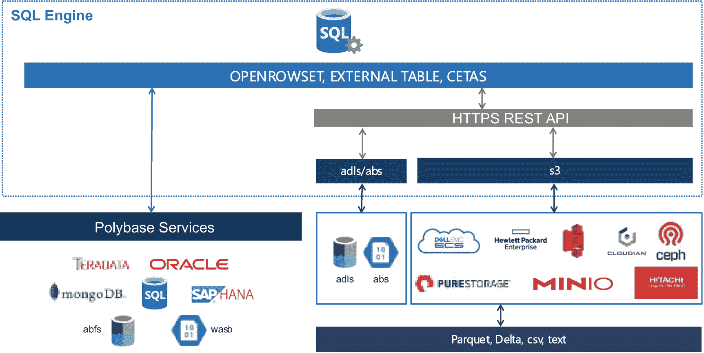
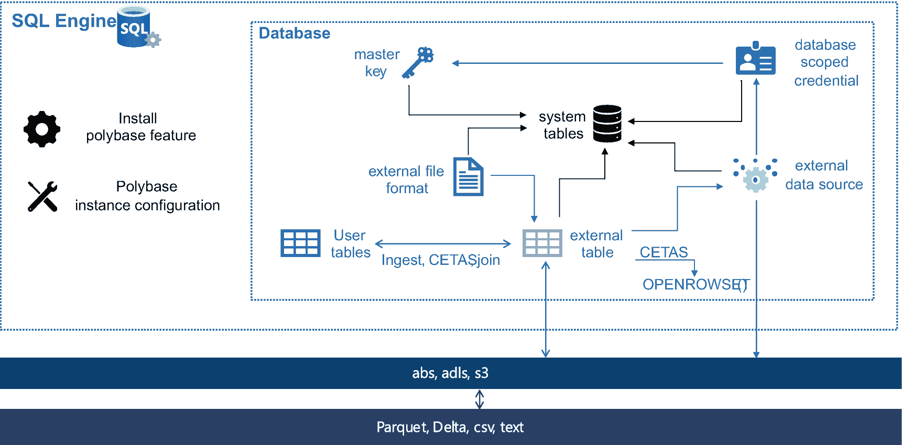
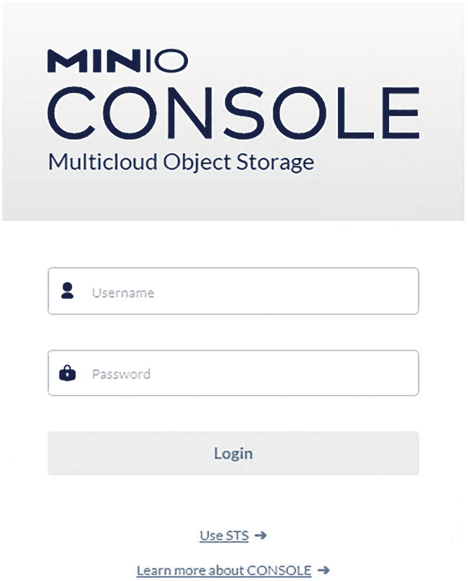
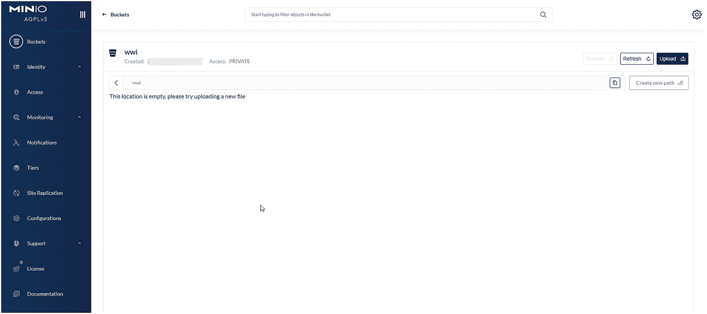
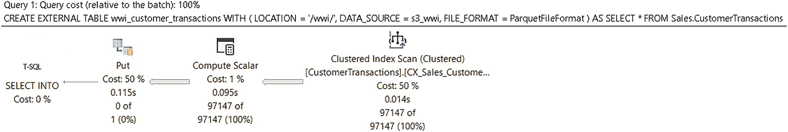

# 7. 数据虚拟化与对象存储

早在 SQL Server 7.0 中，我们就提供了一种查询 SQL Server `外部` 数据的方法，即使数据源并非 SQL Server 本身。我们将此功能称为链接服务器。我们使用 OLE-DB 作为机制，允许查询处理器将查询推送到另一个数据源，并将结果取回 SQL Server。当时甚至已有 OLE-DB 驱动程序可用于查询“文件”数据，例如 Excel 电子表格文件。在某种程度上，链接服务器查询的概念就是 `数据虚拟化`。数据虚拟化意味着“在数据所在之处”访问数据，而非将数据复制到 SQL Server 中。链接服务器查询被内置于常规 SQL 语句（如 `SELECT`）中，也可通过一个名为 `OPENROWSET()` 的新 T-SQL 函数来使用。在本章后续内容中，你会看到 `OPENROWSET()` 至今仍被广泛使用且功能完备。

在 SQL Server 2016 中，我们引入了一个概念，该概念最初在 Parallel Data Warehouse 中实现，称为 `PolyBase`。PolyBase 由 David Dewitt 和微软研究团队带入 Parallel Data Warehouse。其核心理念是使用 T-SQL 语言直接从数据库引擎针对 Hadoop 文件系统执行查询。在 SQL Server 2016 中，我们实现了与 Hadoop 配合的 PolyBase 概念，称之为 PolyBase 服务。PolyBase 服务包括独立的 Windows 服务，这些服务与 SQL Server 引擎集成。PolyBase 服务会接收来自引擎的 T-SQL 请求，并将其使用 Java 转化为 Hadoop MapReduce 作业。用户通过 T-SQL 语句（如 `CREATE EXTERNAL TABLE` 和 `OPENROWSET()`）访问 Hadoop 系统中的文件。此功能在 SQL Server 2019 中已被移除。

在 SQL Server 2019 中，我们通过增加对 ODBC 数据源的支持，扩展了 `数据虚拟化` 和 `PolyBase` 的概念，允许通过外部表和 `OPENROWSET()` 访问数据。我们甚至内置了预置的 `连接器`，其中包含如 Oracle、MongoDB、Teradata 和 SQL Server 的驱动程序，以及 `通用` ODBC 驱动程序（即任何 ODBC 驱动程序）。SQL Server 真正成为了一个 `数据枢纽`。你可以利用 T-SQL 的强大功能查询几乎任何数据源，而无需使用 ETL 或复制数据。此功能在 SQL Server 2022 中得以延续。

这两项能力都具有变革性。我们意识到客户的数据并非总在 SQL Server 中，而且他们不希望构建昂贵且往往数据滞后的 ETL 应用来复制数据。然而，使用引擎外部服务的 `PolyBase` 设计有其缺点。我们开始寻求另一种方法，以不同的方式继续实现 `数据虚拟化` 的愿景。同时，我们也认识到行业中的一个数据存储趋势：提供基于简单存储服务（`S3`）协议的公司越来越多，对象存储正在扩张。

## SQL Server 2022 中的数据虚拟化

早在项目 Dallas 的初期，我曾与 James Rowland-Jones（我们都称他为 JRJ）开会讨论他的工作。他提到了 `项目 Gravity`。项目 Gravity 实质上就是 JRJ 所称的 `PolyBase v3`。版本 1 是我们最初使用 Java 支持 Hadoop。版本 2 是在 SQL Server 2019 中加入了 ODBC 驱动程序。JRJ 告诉我，`项目 Gravity`（版本 3）将使用 REST API 来访问数据。该项目的主要目标之一是使用 `S3` 协议的对象存储提供商。

### REST、Azure 存储与 S3

具象状态传输（`REST`）是一种供软件组件通信的接口，通常通过远程或互联网连接进行。`REST` 已存在很长时间，它使用典型的 HTTP 方法在软件组件之间发送和接收数据。我认为维基百科对 `REST` 有很好的描述，网址是 [`https://en.wikipedia.org/wiki/Representational_state_transfer`](https://en.wikipedia.org/wiki/Representational_state_transfer)，同时 Azure 文档中也有一份很好的总结，网址是 [`https://docs.microsoft.com/rest/api/azure/devops/?view=azure-devops-rest-7.1`](https://docs.microsoft.com/rest/api/azure/devops/?view=azure-devops-rest-7.1)。在 Azure 文档中，我特别喜欢这个对 `REST` 的描述：“具象状态传输 (REST) API 是支持一组 HTTP 操作（方法）的服务端点，这些操作提供对服务资源的创建、检索、更新或删除访问。”

`REST` 有许多优点。它轻量级且统一，使用 HTTP(S)，并且具有可移植性。它几乎可以在所有操作系统、平台和云环境中工作。虽然我并不总是觉得它直观，但一旦你习惯了 HTTP `动词` 的用法，就会变得更加自然。

`REST` 的一个好处是，像 Azure 存储（包括 Azure Data Lake）和 Amazon 简单存储服务（`S3`）这样的系统，可以通过一组已知的 `REST` 命令访问。无需 ODBC 驱动程序，任何能向这些提供商提交 HTTP(S) 请求的客户端都可以发送和接收数据。

鉴于我们已经知道如何在引擎内部发送 HTTP(S) 请求（这就是我们备份到 URL 的方式），我们决定在引擎内部使用 `REST` 来实现下一组 `PolyBase` 创新，而不是通过 PolyBase 服务。

我承认，虽然 Azure Blob 存储和 Azure Data Lake 存储支持 `REST`，但推动我们使用 `REST` 进行创新的一大动力是 `S3`。亚马逊的简单存储服务（`S3`）最早可追溯到 2006 年（[`https://en.wikipedia.org/wiki/Amazon_S3`](https://en.wikipedia.org/wiki/Amazon_S3)）。亚马逊所做的一件事就是“开放”了访问 `S3` `对象存储` 的协议。`S3` 被称为对象存储，因为对象是文件以及描述这些文件的元数据。对象被收集在 `存储桶` 或文件容器中。关于对象存储、文件和存储桶如何运作的核心概念可以在 [`https://docs.aws.amazon.com/AmazonS3/latest/userguide/Welcome.html#CoreConcepts`](https://docs.aws.amazon.com/AmazonS3/latest/userguide/Welcome.html#CoreConcepts) 找到。亚马逊 `S3` 对象存储使用一组特定的 `REST` API 进行访问，相关文档见 [`https://docs.aws.amazon.com/AmazonS3/latest/userguide/RESTAPI.html`](https://docs.aws.amazon.com/AmazonS3/latest/userguide/RESTAPI.html)。自从亚马逊推出 `S3` 以来，已有数家公司相继提供 `S3 兼容的对象存储服务`。只要你遵循 `S3` `REST` API 协议，就可以设置一个对象存储端点并允许客户端使用它。我们看到提供 `S3` 对象存储的供应商激增。因此，我们决定通过实现从 `S3` 对象端点查询文件的功能，为我们的 `PolyBase` `REST` API 故事再添一笔。


### 项目“重力”演变为 Polybase v3

基于以上背景，SQL Server 2022 彻底改变了 Polybase 模型。SQL 引擎现在包含了利用外部数据源 `连接器` 的能力，以支持以下存储提供程序：

*   Azure Blob 存储 (`abs`)
*   Azure Data Lake Storage Gen2 (`adls`)
*   S3 兼容的对象存储 (`s3`)

注意

Azure SQL 托管实例也支持 `abs` 和 `adls`。

创建外部数据源时，这些连接器的名称会作为 `LOCATION` 语法的一部分使用。基于 ODBC 驱动程序的连接器使用诸如 `oracle`、`teradata`、`mongodb`、`sqlserver` 和 `odbc` 之类的名称。

基于 ODBC 驱动程序的连接器在 Polybase 服务上下文中运行。REST API 连接器则在 SQL Server 引擎内部运行。

注意

尽管 REST API 连接器在引擎内部运行，技术上不需要 Polybase 服务，但在 SQL Server 2022 中，您仍然必须启用 Polybase 功能，该功能会安装这些服务。

微软负责 Polybase 的高级项目经理 Hugo Queiroz 帮助我构建了以下示意图，以展示如图 7-1 所示的连接器架构。



SQL 引擎示意图。它通过 REST API 和 abs、adls 以及 s3 与 open row set、external table、polybase services、parquet、delta、c s v 和 text 相连。

图 7-1

SQL Server 2022 中的数据虚拟化

在此图中，T-SQL 操作如 `OPENROWSET` 和 `CREATE EXTERNAL TABLE` 用于从连接器访问外部数据源。在此图的左侧，ODBC 连接器通过引擎连接 Polybase 服务（这些是实际的 Windows 服务）来访问。在此图的右侧，SQL Server 引擎通过 REST API 与 `abs`、`adls` 和 `s3` 连接器通信，以访问 `text`/`csv`（您提供格式）或 `parquet`/`delta`（格式内置于文件中）文件。我将在本章的下一节详细描述 `parquet` 和 `delta` 等文件格式类型。

您可能想知道使用 `abs` 和 `adls` 有什么区别。Azure Blob 存储 (`abs`) 是一个通用存储系统，而 Azure Data Lake 存储 (`adls`) 则专为分析工作负载而构建。您可以在 [`https://docs.microsoft.com/azure/data-lake-store/data-lake-store-comparison-with-blob-storage`](https://docs.microsoft.com/azure/data-lake-store/data-lake-store-comparison-with-blob-storage) 阅读详细比较。Azure Blob 存储和 Azure Data Lake 存储都被认为是像 `s3` 一样的对象存储系统。

我已经提到了 T-SQL 语句 `OPENROWSET` 和 `CREATE EXTERNAL TABLE`。`CETAS` 代表 `CREATE EXTERNAL TABLE AS SELECT`。这个概念源自通过 Azure Synapse 的 Polybase，它允许您在 SQL Server 中将 `SELECT` 语句的结果创建为外部表。`OPENROWSET` 和 `EXTERNAL TABLE` 是“读取”操作，而 `CETAS` 允许您将数据从 SQL Server “导出”到文件，并记录外部表的元数据。

### Polybase v3 文件格式

您可能知道 `CSV`（逗号分隔）或 `text`（任何您想要的格式）文件格式是什么，但您可能不熟悉 `parquet` 或 `delta`。让我们回顾一下这些文件格式，并讨论为什么它们变得流行起来。

#### Parquet

`Parquet` 文件是一种由 Apache 项目于 2013 年启动的格式化文件。Apache 项目网站 [`https://parquet.apache.org`](https://parquet.apache.org) 有一个简单的定义：“Apache Parquet 是一种开源的、面向列的数据文件格式，旨在实现高效的数据存储和检索。”面向列的特性使 `parquet` 成为分析工作负载的高效格式，就像 SQL Server 中的列存储索引一样。`Parquet` 是一种二进制格式化文件，与 `CSV` 或 `text` 不同。它在文件内部包含有关列和数据类型的元数据。尽管 `parquet` 使用二进制格式，但有关于细节的文档，因此开发人员知道如何读写该格式。您可以在 [`https://parquet.apache.org/docs/file-format/`](https://parquet.apache.org/docs/file-format/) 阅读格式细节。

`Parquet` 已成为从本地到云端分析最流行的文件格式之一。它的流行是我们选择在 SQL Server 2022 中原生支持 `parquet` 作为数据虚拟化格式的原因之一。SQL Server 2022 原生支持读取 `parquet` 文件并将 SQL 数据写入格式化的 `parquet` 文件。

#### Delta

`Parquet` 文件是作为整个文件单元进行读写的静态文件。一个由多家公司创建的名为 `Delta Lake` 的开源项目，旨在支持基于 `delta tables` 的*数据湖仓*。`Delta tables` 实际上是一个 `parquet` 格式化文件的集合，并通过 JSON 文件提供*类事务日志*的功能。我在 Databricks 上找到了一篇关于 `delta` “事务日志”内部原理的有趣文章，地址是 [`https://databricks.com/blog/2019/08/21/diving-into-delta-lake-unpacking-the-transaction-log.html`](https://databricks.com/blog/2019/08/21/diving-into-delta-lake-unpacking-the-transaction-log.html)。

您可以在 [`https://delta.io`](https://delta.io) 阅读关于 `Delta Lake` 项目的所有资源。由于 `Delta Lake` 是一个完整的开源项目（GitHub 项目地址为 [`https://github.com/delta-io/delta`](https://github.com/delta-io/delta)），您可以阅读所有关于 `delta tables` 如何格式化的细节，但大多数用户通过诸如 Spark 之类的接口来创建和使用 `delta tables`。例如，您可以在 [`https://docs.delta.io/latest/delta-batch.html#-ddlcreatetable`](https://docs.delta.io/latest/delta-batch.html#-ddlcreatetable) 看到如何使用 T-SQL 与 Spark 来创建新的 `delta table`。

SQL Server 2022 原生支持读取 `delta tables`，但您无法将 SQL Server 中的数据导出到 `delta tables`。您可以将 SQL 数据导出到 `parquet` 文件。如果您需要这样做，Spark 提供了将 `parquet` 转换为 `delta` 的功能。

使用 `parquet` 文件无法利用谓词下推或将“筛选器”推送到文件以仅获取所需数据的功能。`Delta tables` 确实提供了这种类型的功能，通过一个称为*分区列*的概念。您将在本章中看到如何在 SQL Server 2022 中同时使用 `parquet` 和 `delta` 的示例。

### 使用新的 Polybase v3

要使用 Polybase v3 或基于 REST API 的数据虚拟化，您将使用一系列 T-SQL 语句来创建对象，如图 7-2 所示。



SQL 引擎示意图。它有一个数据库的流程图，通过 abs、adls 和 s3 与 parquet、delta、c s v 和 text 相连。

图 7-2

在 SQL Server 2022 中使用 REST API 数据虚拟化

让我们浏览此图，了解如何在 SQL Server 2022 中使用 REST API 数据虚拟化。您将在标题为“**试用 Polybase v3**”的章节中看到这些步骤的每个示例。

#### 安装和配置 Polybase

尽管在 SQL Server 2022 中 REST API 不使用 Polybase 服务，但您必须安装“外部数据的 Polybase 查询服务”功能（或添加该功能）。您还必须通过将 `sp_configure` `'polybase enabled'` 选项设置为 `1` 来启用 Polybase。如果您计划使用 `CETAS`，还需要将 `'allow polybase export'` 设置为 `1`。


#### 设置凭据与数据源

在用户数据库的上下文中，下一步是使用 `CREATE DATABASE SCOPED CREDENTIAL` 语句创建数据库范围凭据，以及使用 `CREATE EXTERNAL DATA SOURCE` 语句创建外部数据源（后者需要凭据）。您需要为您计划使用的每个连接器执行此操作。在创建数据库范围凭据之前，必须先使用 `CREATE MASTER KEY` 语句创建一个主密钥，但无论您想在数据库中创建多少个凭据和数据源，此操作只需执行一次。这些对象作为元数据存储在用户数据库的系统表中。

#### 使用 OPENROWSET( ) 直接查询文件

创建了外部数据源后，您可以使用带有 `BULK` 选项的 `OPENROWSET()` T-SQL 函数直接查询文件。像 PARQUET 和 DELTA 这样的文件格式不需要任何列名或类型的选项；CSV 和文本文件则需要这些选项。

#### 创建外部表

您也可以使用 `CREATE EXTERNAL TABLE` 语句创建一个外部表。外部表需要一个外部数据源，并且可以使用 `LOCATION` 直接映射到连接器的文件。您必须先使用 `CREATE EXTERNAL FILE FORMAT` 语句创建一个文件格式，以供外部表使用。该文件格式可以是“已知”格式，如 `ParquetFileFormat`，也可以是 CSV 文件，后者将要求您提供更多细节。外部表可以提供源文件的所有列名或其子集。外部表不存储任何数据，仅在系统表中存储元数据，这与文件格式相同。

您还可以使用 `CREATE EXTERNAL TABLE AS SELECT` (CETAS) 语法创建一个外部表，并将用户表的结果存储在 `LOCATION` 目标中。这是一种将数据“导出”到 REST API 连接器的方法。您甚至可以将 CETAS 与查询 `OPENROWSET()` 的源一起使用。

一旦创建了外部表，您就可以像查询任何其他 SQL 表一样查询它（甚至可以为其分配权限）。您可以与其他用户表或其他外部表进行联接，并执行 `OPENROWSET()` 查询。您可以使用标准的 T-SQL，如 `INSERT..SELECT` 或 `SELECT INTO`，从外部表获取数据并填充用户表（即数据摄入）。

### 尝试 Polybase v3

让我们通过一些示例来看看使用 S3 对象提供程序进行基于 REST API 的数据虚拟化。

> 注意
>
> 如果您不想安装此练习所需的非 Microsoft 软件，可以在 SQL notebook 文件 `queryparquet.ipynb` 和 `querydelta.ipynb` 中查看练习的结果，这些文件可以在示例文件和脚本的 `ch07_datavirt_objectstorage\datavirt\parquet` 与 `ch07_datavirt_objectstorage\datavirt\delta` 文件夹中找到。您需要安装 Azure Data Studio 才能使用这些 notebook，或者您可以在 GitHub 仓库中用浏览器查看这些 notebook。

#### 先决条件

要进行此练习，您需要满足以下先决条件：

*   安装了数据库引擎和 Polybase Query Service for External Data 功能的 SQL Server 2022 评估版。

> 注意
>
> 对于 Linux，请在 [`https://docs.microsoft.com/sql/relational-databases/polybase/polybase-linux-setup`](https://docs.microsoft.com/sql/relational-databases/polybase/polybase-linux-setup) 安装 Polybase 包。

*   具有至少两个 CPU 和 8GB RAM 的虚拟机或计算机。
*   SQL Server Management Studio (SSMS)。最新的 18.x 或 19.x 版本均可。
*   最新版本的 Azure Data Studio (ADS)。**这是可选的**。我已包含了一个带有此练习结果的 SQL notebook，因此如果您不想安装非 MSFT 软件，可以使用 ADS 查看结果。

> 注意
>
> 以下先决条件适用于非 Microsoft 软件。使用此软件不代表 Microsoft 的任何官方认可。此软件不受 Microsoft 支持，因此使用此软件出现的任何问题都由用户自行解决。

*   适用于 Windows 的 `minio` 服务器，您可以从 [`https://min.io/download#/windows`](https://min.io/download#/windows) 下载。在演示中，我假设您已创建了一个名为 `c:\minio` 的目录，并将 Windows 版的 `minio.exe` 下载到该目录。
*   适用于 Windows 的 `openssl`，您可以从 [`https://slproweb.com/products/Win32OpenSSL.html`](https://slproweb.com/products/Win32OpenSSL.html) 下载。我选择了 Win64 OpenSSL v3.0.5 MSI 选项。设置系统环境变量 `OPENSSL_CONF=C:\Program Files\OpenSSL-Win64\bin\openssl.cfg`，并将 `c:\Program Files\OpenSSL-Win64\bin` 添加到系统路径中。

> 注意
>
> 此练习也可以在 Linux 和容器中运行。您需要使用适用于 Linux 的 minio 服务器。`openssl` 随 Linux 附带，或通过安装可选软件包获得。请查阅您的 Linux 文档。

*   本书 GitHub 仓库中 `ch07_datavirt_objectstorage\datavirt\parquet` 目录下的脚本和文件副本。


## 为练习设置 minio

要使用 `minio.exe` 与 SQL Server，需要 TLS。要使用 TLS，您必须拥有有效的证书。出于测试目的，我们将生成一个自签名证书。

按照以下步骤为练习设置 minio：

1.  在命令提示符下，从 `c:\minio` 目录运行以下命令生成私钥：

    ```
    openssl genrsa -out private.key 2048
    ```

2.  将提供的 `openssl.conf` 文件复制到 `c:\minio`。编辑此文件，将 `IP.2` 更改为您的本地 IP 地址，并将 `DNS.2` 更改为您的本地计算机名称。

3.  在命令提示符下，从 `c:\minio` 目录运行以下命令生成自签名证书：

    ```
    openssl req -new -x509 -nodes -days 730 -key private.key -out public.crt -config openssl.conf
    ```

4.  对于 Windows 用户，双击 `public.crt` 文件并选择安装证书。选择本地计算机，然后选择“将所有证书放入下列存储”。浏览并选择“受信任的根证书颁发机构”。

    **注意** 自签名证书非常适合测试，但*不*安全。建议您在完成本练习后，通过控制面板中的“管理用户证书”删除该证书。

5.  将 `private.key` 和 `public.crt` 文件从 `c:\minio` 目录复制到 `%%USERPROFILE%%\mino\certs` 目录。

6.  在命令提示符下，导航到 `c:\minio` 目录。然后通过运行以下命令启动 minio 程序（`cmd.exe` 用户不需要 `.\`）：

    ```
    .\minio.exe server c:\minio --console-address ":9001"
    ```

    此程序会启动并一直运行，直到您使用 `Ctrl+C` 退出。您的命令提示符输出应类似于以下内容：

    

    minio 登录窗口的屏幕截图。顶部写着 minio console multi cloud object storage。下方是用于输入用户名和密码的选项。

    **图 7-3** minio 控制台登录屏幕

7.  在本地计算机上使用 Web 浏览器访问 `https://127.0.0.1:9001` 来测试与 minio 的连接。您应该会看到一个类似于图 7-3 的登录屏幕。使用前面 minio 服务器输出中的 `RootUser` 和 `RootPass`。

    ```
    MinIO Object Storage Server
    Copyright: 2015-2022 MinIO, Inc.
    License: GNU AGPLv3 
    Version: RELEASE.2022-07-30T05-21-40Z (go1.18.4 windows/amd64)
    Status:         1 Online, 0 Offline.
    API: https://:9000  https://127.0.0.1:9000
    RootUser: 
    RootPass: 
    Console: https://:9001 https://127.0.0.1:9001
    RootUser: 
    RootPass: 
    Command-line: https://docs.min.io/docs/minio-client-quickstart-guide
    $ mc.exe alias set myminio https://:9000  
    Documentation: https://docs.min.io
    ```

    

    minio 窗口的屏幕截图。左侧，“存储桶”选项高亮显示以创建新存储桶。

    **图 7-4** S3 存储中的新存储桶

8.  在左侧菜单上，单击“身份和用户”。选择“创建用户”。创建一个用户和密码。为该用户选择 `readwrite` 策略。记下此用户和密码。这是您在本练习后面的 `creates3creds.sql` 脚本中将用于 `SECRET` 值的用户和密码。

9.  选择“存储桶”菜单选项。选择“创建存储桶”。使用 `wwi` 作为存储桶名称。保留所有默认设置并单击“创建存储桶”。您的屏幕现在应如图 7-4 所示。

## 学习使用 REST API 访问 S3 上的 Parquet 文件

准备好可用的 S3 提供程序后，我们现在可以使用 SQL Server 访问 S3 兼容存储。请按照本练习的以下步骤了解 REST API 数据虚拟化的基础知识，以访问 S3 对象提供程序上的 parquet 文件。下一节有一个访问 delta 文件的练习。



创建外部表的流程图。步骤如下。聚集索引扫描、计算标量、PUT 和 SELECT INTO。

**图 7-5** CETAS 的查询执行计划

1.  将 `WideWorldImporters` 示例数据库从 `https://aka.ms/WideWorldImporters` 复制到本地目录（还原脚本假定为 `c:\sql_sample_databases`）。

2.  编辑 `restorewwi.sql` 脚本，为备份指定正确的路径以及数据和日志文件应存放的位置。

3.  执行脚本 `restorewwi.sql`。此脚本执行以下 T-SQL 语句：

    ```sql
    USE master;
    GO
    DROP DATABASE IF EXISTS WideWorldImporters;
    GO
    RESTORE DATABASE WideWorldImporters FROM DISK = 'c:\sql_sample_databases\WideWorldImporters-Full.bak' with
    MOVE 'WWI_Primary' TO 'c:\sql_sample_databases\WideWorldImporters.mdf',
    MOVE 'WWI_UserData' TO 'c:\sql_sample_databases\WideWorldImporters_UserData.ndf',
    MOVE 'WWI_Log' TO 'c:\sql_sample_databases\WideWorldImporters.ldf',
    MOVE 'WWI_InMemory_Data_1' TO 'c:\sql_sample_databases\WideWorldImporters_InMemory_Data_1',
    stats=5;
    GO
    ALTER DATABASE WideWorldImporters SET QUERY_STORE CLEAR ALL;
    GO
    ```

4.  执行脚本 `enablepolybase.sql` 以配置实例级设置，允许执行 Polybase 功能并从 Polybase 导出数据到 S3。此脚本执行以下 T-SQL 语句：

    ```sql
    EXEC sp_configure 'polybase enabled', 1;
    GO
    RECONFIGURE;
    GO
    EXEC sp_configure 'allow polybase export', 1;
    GO
    RECONFIGURE;
    GO
    ```

5.  编辑脚本 `createmasterkey.sql` 以输入密码。执行该脚本以创建主密钥来保护数据库范围的凭据。此脚本执行以下 T-SQL 语句：

    ```sql
    USE [WideWorldImporters]
    GO
    IF NOT EXISTS (SELECT * FROM sys.symmetric_keys WHERE name = ''##MS_DatabaseMasterKey##'')
    CREATE MASTER KEY ENCRYPTION BY PASSWORD = '';
    GO
    ```

6.  编辑脚本 `creates3creds.sql`，将您在 minio 控制台中创建的用户和密码填入 `SECRET`。执行该脚本以创建数据库范围的凭据。此脚本执行以下 T-SQL 语句：

    ```sql
    IF EXISTS (SELECT * FROM sys.database_scoped_credentials WHERE name = 's3_wwi_cred')
    DROP DATABASE SCOPED CREDENTIAL s3_wwi_cred;
    GO
    CREATE DATABASE SCOPED CREDENTIAL s3_wwi_cred
    WITH IDENTITY = 'S3 Access Key',
    SECRET = ':';
    GO
    ```

7.  编辑脚本 `creates3datasource.sql`，用 minio 服务器的本地 IP 地址替换。执行该脚本以创建外部数据源。此脚本执行以下 T-SQL 语句：

    ```sql
    IF EXISTS (SELECT * FROM sys.external_data_sources WHERE name = 's3_wwi')
    DROP EXTERNAL DATA SOURCE s3_wwi;
    GO
    CREATE EXTERNAL DATA SOURCE s3_wwi
    WITH
    (
    LOCATION = 's3://:9000'
    ,CREDENTIAL = s3_wwi_cred
    );
    GO
    ```

    **提示** 您可以在此处端口号后输入存储桶名称，以便数据源仅专注于特定存储桶。我们将在指定查询位置时使用存储桶。

8.  执行脚本 `createparquetfileformat.sql` 以创建 Parquet 的文件格式。此脚本执行以下 T-SQL 语句：

    ```sql
    USE [WideWorldImporters];
    GO
    IF EXISTS (SELECT * FROM sys.external_file_formats WHERE name = 'ParquetFileFormat')
    DROP EXTERNAL FILE FORMAT ParquetFileFormat;
    CREATE EXTERNAL FILE FORMAT ParquetFileFormat WITH(FORMAT_TYPE = PARQUET);
    GO
    ```


