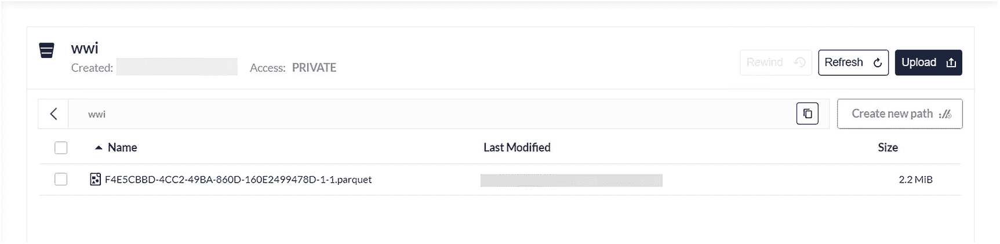
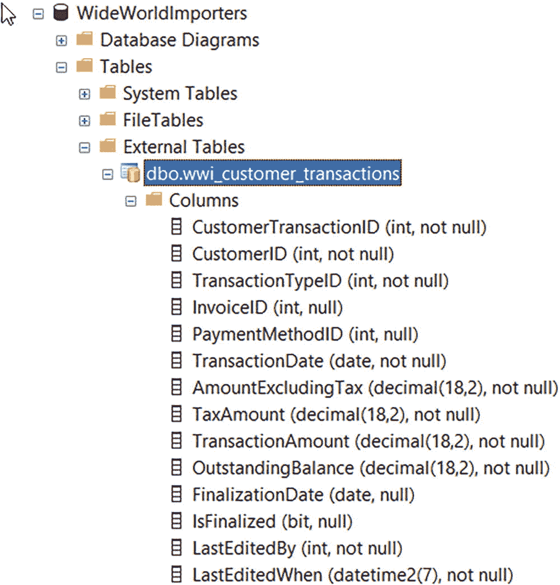
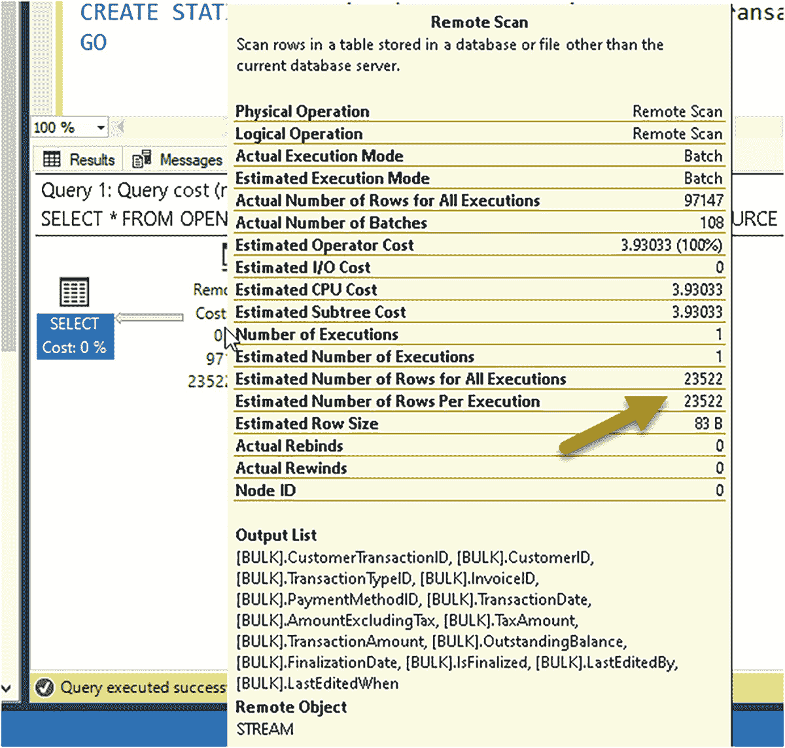

# 9. 将数据导出至 Parquet 格式

首先，让我们通过执行脚本 `wwi_cetas.sql` 来学习如何将 Parquet 格式的数据导出到 wwi 存储桶中。在 SSMS 中，选择 **包含实际执行计划** 选项。此脚本执行以下 T-SQL 语句：

```sql
    USE [WideWorldImporters];
    GO
    IF OBJECT_ID('wwi_customer_transactions', 'U') IS NOT NULL
    DROP EXTERNAL TABLE wwi_customer_transactions;
    GO
    CREATE EXTERNAL TABLE wwi_customer_transactions
    WITH (
    LOCATION = '/wwi/',
    DATA_SOURCE = s3_wwi,
    FILE_FORMAT = ParquetFileFormat
    )
    AS
    SELECT * FROM Sales.CustomerTransactions;
    GO
    ```

让我们来检查一下这个脚本。`LOCATION` 是存储桶名称。`LOCATION` 值可以是一个存储桶名称，甚至可以是一系列文件夹，乃至一个具体的文件名。在本例中，由于外部数据源未指定具体的存储桶，我需要在此处指定。由于我只指定了存储桶，查询会将所有文件放置在父文件夹中。对于 Parquet 文件和 REST API 连接器，没有谓词下推。所有的过滤操作都在 SQL Server 内部完成（即使你指定了 `WHERE` 子句）。

`DATA_SOURCE` 是我们为连接 minio 服务器而创建的外部数据源。文件格式匹配 Parquet。请注意，除了指定为 Parquet 外，我们无需再指定格式的任何其他信息。我们也可以在此定义中包含列名，但这不是必需的。使用语句的 `AS SELECT` 部分将创建一个包含列名、类型和数据的单一 Parquet 文件。

在 **消息** 选项卡中，你应看到受影响了 97147 行。在 **执行计划** 选项卡中，你应看到一个类似于图 7-5 的计划。

请注意 `Put` 运算符，它用于将数据作为 Parquet 文件导出到 S3 连接器。

**提示**
我在使用 CETAS 时的一个观察是，它没有“重复”检测功能。如果你连续运行两次上述命令，将会创建两个 Parquet 文件。


Minio 窗口的截图。在 wwi 中创建的存储桶中打开了一个包含最后修改时间和大小的 Parquet 文件。
**图 7-6** 通过 CETAS 添加到 S3 存储桶的 Parquet 文件

### 1. 验证导出的文件
使用 minio 控制台浏览 wwi 存储桶，并确认 Parquet 文件已添加。你的结果应类似于图 7-6。


通过 CETAS 创建的列列表的文件夹截图视图。一个名为 dbo.wwi_customer_transactions 的文件被高亮显示。
**图 7-7** 通过 CETAS 自动创建的 Parquet 列

### 2. 查询外部表
通过执行脚本 `querywwiexternaldata.sql` 来查询新的外部表。此脚本执行以下 T-SQL 语句：

```sql
    USE [WideWorldImporters];
    GO
    SELECT c.CustomerName, SUM(wct.OutstandingBalance) as total_balance
    FROM wwi_customer_transactions wct
    JOIN Sales.Customers c
    ON wct.CustomerID = c.CustomerID
    GROUP BY c.CustomerName
    ORDER BY total_balance DESC;
    GO
    ```

请注意，在这个例子中，脚本将外部表（存储在 S3 中的 Parquet 文件）与用户数据库中的本地表进行了连接。你的结果应显示 263 行。此类示例的一个常见用例是，在此查询之上构建一个 `VIEW`（视图），并且只授予用户对该视图的访问权限。这样，用户将被抽象于数据的来源，无论数据是在 SQL Server 中还是在 Parquet 文件中。

### 3. 查看表架构
使用 SSMS 的对象资源管理器查看通过 CETAS 创建的表的列定义。你的结果应类似于图 7-7。

请注意，列名和类型与数据库中原始表相匹配；这展示了 Parquet 包含元数据的强大之处。


一个标题为“remote scan”的表格。一个箭头指向“每次执行的估计行数”的 remote scan 值。表格下方是一个输出列表。
**图 7-8** `OPENROWSET()` 的查询执行计划


1.  让我们使用 `OPENROWSET()` 来对存储在 S3 中生成的 Parquet 文件运行“临时”查询，通过执行脚本 **`querybyopenrowset.sql`** 实现。在 SSMS 中，请选择“包含实际执行计划”选项。此脚本执行以下 T-SQL 语句：

    ```sql
    USE [WideWorldImporters];
    GO
    SELECT *
    FROM OPENROWSET
    (BULK '/wwi/'
    , FORMAT = 'PARQUET'
    , DATA_SOURCE = 's3_wwi')
    as [wwi_customer_transactions_file];
    GO
    ```

    事实证明，`BULK` 选项不仅仅是用于数据的批量插入；它还可以用于在文件上“打开行集”。

    在“消息”选项卡中，你应该会看到 97147 行受影响，这与原始表 `Sales.CustomerTransactions` 中的行数相同。如果你查看“执行计划”选项卡，你应该会看到一个类似图 7-8 的查询执行计划。

    请注意，估计行数大约是实际总行数的 30%。这是因为优化器本身没有来自 Parquet 文件的任何统计信息。这与 **`wwi_customer_transactions`** 形成对比，后者是作为外部表创建的。你可以手动在外部表上创建统计信息，或者如果你将数据库选项 `AUTO_CREATE_STATISTICS` 设置为 `ON`（默认值），则在查询外部表时会自动创建统计信息。如果这些统计信息可用，估计值将是准确的。在没有统计信息的情况下，`OPENROWSET()` 查询的性能可能会受到不利影响，也可能不会。

    正如我在本章前面提到的，对于 Parquet 文件没有谓词下推。如果你在前面的 SQL 语句中添加一个 `WHERE` 子句：

    ```sql
    USE [WideWorldImporters];
    GO
    SELECT *
    FROM OPENROWSET
    (BULK '/wwi/'
    , FORMAT = 'PARQUET'
    , DATA_SOURCE = 's3_wwi')
    as [wwi_customer_transactions_file]
    WHERE wwi_customer_transactions_file.CustomerTransactionID = 2;
    ```

    引擎中的查询处理器必须将此存储桶父文件夹中 Parquet 文件的结果引入，然后在引擎内进行过滤以产生最终结果。

    你可以通过使用桶内的文件夹结构对你的 Parquet 文件进行分区，然后仅使用 `BULK` 语法或外部表的 `LOCATION` 指定你需要的文件夹，来帮助减少 SQL Server 必须读取和过滤的数据量。

2.  外部表的另一个很好的特性是能够基于 Parquet 文件中的列子集创建一个。执行脚本 **`querybyexternaltable.sql`** 来查看一个示例。此脚本执行以下 T-SQL 语句：

    ```sql
    IF OBJECT_ID('wwi_customer_transactions_base', 'U') IS NOT NULL
    DROP EXTERNAL TABLE wwi_customer_transactions_base;
    GO
    CREATE EXTERNAL TABLE wwi_customer_transactions_base
    (
    CustomerTransactionID int,
    CustomerID int,
    TransactionTypeID int,
    TransactionDate date,
    TransactionAmount decimal(18,2)
    )
    WITH
    (
    LOCATION = '/wwi/'
    , FILE_FORMAT = ParquetFileFormat
    , DATA_SOURCE = s3_wwi
    );
    GO
    SELECT * FROM wwi_customer_transactions_base;
    GO
    ```

    你将看到与外部表 `wwi_customer_transactions` 相同的行数，但只包含你指定的列。列的顺序不必是特定的。

3.  正如我之前提到的，你可以在外部表的任意数量的列上手动创建统计信息。执行脚本 **`creatstats.sql`** 以获取示例。此脚本执行以下 T-SQL 语句：

    ```sql
    USE WideWorldImporters;
    GO
    CREATE STATISTICS wwi_ctb_stats ON wwi_customer_transactions_base (CustomerID) WITH FULLSCAN;
    GO
    ```

    统计信息存储在用户数据库系统表中。

4.  我之前在本章提到过，数据虚拟化的许多对象都存储在系统表中。执行脚本 **`exploremetadata.sql`** 来查看为外部数据源、文件格式和外部表存储了哪些数据。此脚本执行以下 T-SQL 语句：

    ```sql
    USE [WideWorldImporters];
    GO
    SELECT * FROM sys.external_data_sources;
    GO
    SELECT * FROM sys.external_file_formats;
    GO
    SELECT * FROM sys.external_tables;
    GO
    ```

5.  SQL Server 还提供了系统存储过程来探索像 Parquet 这样的文件中的元数据。执行脚本 **`getparquetmetadata.sql`** 来查看一个示例。此脚本执行以下 T-SQL 语句：

    ```sql
    EXEC sp_describe_first_result_set N'
    SELECT *
    FROM OPENROWSET
    (BULK ''/wwi/''
    , FORMAT = ''PARQUET''
    , DATA_SOURCE = ''s3_wwi'')
    as [wwi_customer_transactions_file];';
    GO
    ```

6.  `OPENROWSET` 还提供了一个很好的功能来收集有关源 Parquet 文件的元数据。执行脚本 **`getfilemetadata.sql`** 来查看一个示例。该脚本执行以下 T-SQL 语句：

    ```sql
    USE [WideWorldImporters];
    GO
    SELECT TOP 1 wwi_customer_transactions_file.filepath(),
    wwi_customer_transactions_file.filename()
    FROM OPENROWSET
    (BULK '/wwi/'
    , FORMAT = 'PARQUET'
    , DATA_SOURCE = 's3_wwi')
    as [wwi_customer_transactions_file];
    GO
    ```


