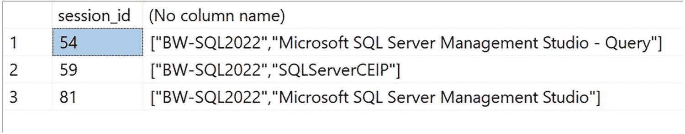
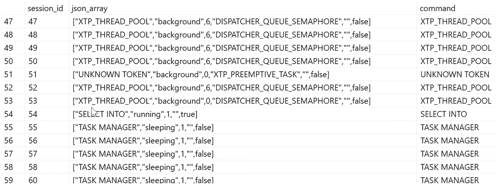
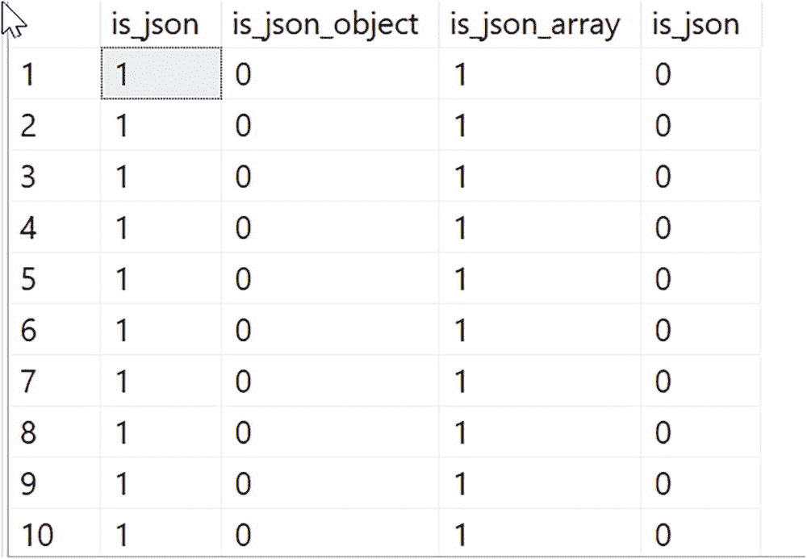
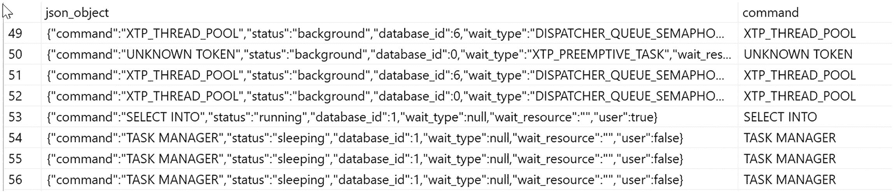
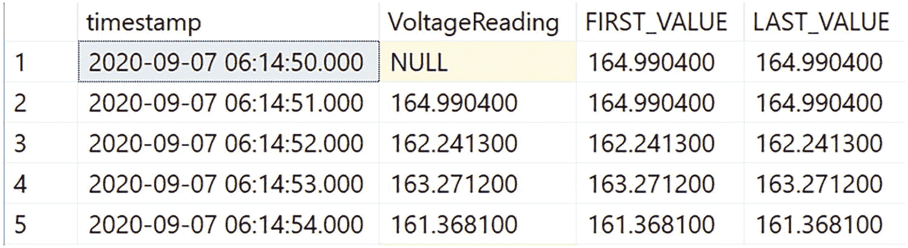
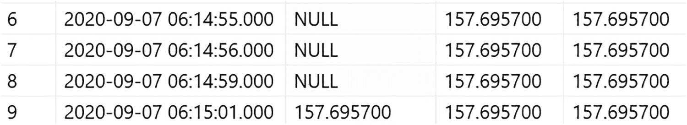

# 学习如何使用 Delta 文件

接下来的这个练习假设你已经完成了上一个关于 Parquet 文件的练习的所有先决条件。此外，它还假设你已经完成了上一个练习中的所有步骤，以恢复 WideWorldImporters 数据库、配置 Polybase，并创建主密钥、数据库范围凭据、外部数据源和外部文件格式。你可以保留之前的 wwi 存储桶。作为本练习的一部分，你将创建一个新的存储桶。

本练习专用的所有*新的*脚本和文件都可以在 `ch07_datavirt_objectstorage\datavirt\delta` 文件夹中找到。如果你不想进行使用 minio 处理 delta 的练习，可以在笔记本 `querydelta.ipynb` 中查看结果。

> **注意**
>
> people-10m delta 表是来自 Databricks 的一个示例数据集中的示例 delta 表，如 [`https://docs.microsoft.com/azure/databricks/data/databricks-datasets#sql`](https://docs.microsoft.com/azure/databricks/data/databricks-datasets#sql) 所示。此数据集包含姓名、出生日期和 SSN，均为虚构，不代表真实人物。该数据集遵循 [`http://creativecommons.org/licenses/by/4.0/legalcode`](http://creativecommons.org/licenses/by/4.0/legalcode) 的知识共享许可协议，可在本书中共享和提供。我的同事 Hugo Queiroz 编写了一个 Spark 作业来从该数据集中抓取 delta 表，并将其下载为构成该 delta 表的所有文件。Hugo 还为本练习提供了许多查询和想法。没有他的帮助，我无法撰写本章！

1.  使用 minio 控制台创建一个名为 `delta` 的新存储桶。在控制台中使用“上传文件夹”选项，从示例文件中上传名为 `people-10m` 的文件夹。这将在 delta 存储桶下创建一个名为 `people-10m` 的文件夹，其中包含几个 Parquet 文件和一个名为 `_delta_log` 的文件夹。

2.  通过执行脚本 `querydeltatable.sql` 来查询 delta 表。此脚本执行以下 T-SQL 语句：

    ```sql
    USE [WideWorldImporters];
    GO
    SELECT * FROM OPENROWSET
    (BULK '/delta/people-10m',
    FORMAT = 'DELTA', DATA_SOURCE = 's3_wwi') as [people];
    GO
    ```

    该 delta 表中有 1000 万行数据，分布在所有 Parquet 格式的文件中。获取所有结果大约需要 1 分钟。请注意表中的各个列。大部分查询执行时间花在了在 SSMS 中显示所有行上，而不是实际读取数据。

3.  默认情况下，delta 表是按 `id` 列分区的。现在让我们运行一个查询，在非分区列上过滤行。执行脚本 `querybyssn.sql`。此脚本执行以下 T-SQL 语句：

    ```sql
    USE [WideWorldImporters];
    GO
    SELECT * FROM OPENROWSET
    (BULK '/delta/people-10m',
    FORMAT = 'DELTA', DATA_SOURCE = 's3_wwi') as [people]
    WHERE [people].ssn = '992-28-8780';
    GO
    ```

    此查询仅返回一行，但耗时约 4 秒。SQL Server 必须从 delta 表中读取全部 1000 万行，但它使用了一个 Filter 运算符来仅根据 `ssn` 返回那一行。

4.  现在，让我们运行一个查询并按 id 列进行过滤。执行脚本 `querybyid.sql`。此脚本执行以下 T-SQL 语句：

    ```sql
    USE [WideWorldImporters];
    GO
    SELECT * FROM OPENROWSET
    (BULK '/delta/people-10m',
    FORMAT = 'DELTA', DATA_SOURCE = 's3_wwi') as [people]
    WHERE [people].id = 10000000;
    GO
    ```

    我特意选择了一个“位于某个文件末尾”的 id 值。请注意，查询在约 1 秒内返回结果。这是因为 delta 表是按 id 列分区的；这是一种可以加快查询速度的谓词下推形式。

    **注意** 当你查看查询执行计划时，优化器并不知道 delta 的分区列。其优势在于通过 REST API 调用从 delta 表获取数据。因此，你可能会在远程扫描后看到一个 Filter 运算符。但只有一行数据从 REST API 调用中返回，因此该 Filter 运算符并不表示任何性能问题。未来，我们计划研究如何使优化器与 delta 分区列更高效地协同工作。

5.  我在 CETAS 中提到的一个概念是能够基于 `OPENROWSET()` 查询创建外部表。让我们看一个例子，同时使用 S3 中的一个文件夹来缩小查询数据的范围。

6.  通过执行脚本 `createparquetfromdelta.sql`，为 delta 表的子集创建一组新的 Parquet 文件作为外部表，并存入新文件夹。此脚本执行以下 T-SQL 语句：

    ```sql
    USE [WideworldImporters];
    GO
    IF EXISTS (SELECT * FROM sys.objects WHERE NAME = 'PEOPLE10M_60s')
    DROP EXTERNAL TABLE PEOPLE10M_60s;
    GO
    CREATE EXTERNAL TABLE PEOPLE10M_60s
    WITH
    (   LOCATION = '/delta/1960s',
    DATA_SOURCE = s3_wwi,
    FILE_FORMAT = ParquetFileFormat)
    AS
    SELECT * FROM OPENROWSET
    (BULK '/delta/people-10m', FORMAT = 'DELTA', DATA_SOURCE = 's3_wwi') as [people]
    WHERE YEAR(people.birthDate) > 1959 AND YEAR(people.birthDate) < 1970;
    GO
    ```

    此脚本将在 delta 存储桶下创建一个名为 `1960s` 的新文件夹。它将仅为 delta 表中出生于 1960 年代的人生成 Parquet 文件（之所以选择这个年代，因为那是我出生的年代）。

    为了明确这里的流程，SQL Server 对 delta 表执行 `OPENROWSET()` 查询以获取全部 1000 万行数据，然后根据 `WHERE` 子句过滤掉行。接着，它将这些结果创建为 `/delta/1960s` 文件夹中的一组 Parquet 文件，并将有关表和列的元数据存储在系统表中。

7.  使用 minio 控制台浏览 delta 存储桶下的 `1960s` 文件夹，查看新创建的 Parquet 文件。

8.  通过执行脚本 `query1960speople.sql` 来查询新的外部表。此脚本执行以下 T-SQL 语句：

    ```sql
    USE [WideWorldImporters];
    GO
    SELECT * FROM PEOPLE10M_60s
    ORDER BY birthDate;
    GO
    ```

现在，你已经看到了几个关于如何使用新的 S3 REST API 接口查询 Parquet 文件和 delta 表的示例。你还看到了一些有趣的方法，用于将 SQL 数据或 `OPENROWSET` 查询的结果导出为 Parquet 格式的文件。

## 你还需要了解什么

通过这些练习，你已经看到了使用带有新 REST API 连接器的 Polybase v3 的各个方面。

在你考虑使用这项创新技术时，有几个细节值得注意：

*   `CREATE EXTERNAL TABLE` 还有其他选项我没有向你展示，例如用于处理与列和数据类型不匹配的数据的“拒绝选项”。你可以在 [`https://docs.microsoft.com/sql/t-sql/statements/create-external-table-transact-sql`](https://docs.microsoft.com/sql/t-sql/statements/create-external-table-transact-sql) 获取使用外部表时的完整选项集和限制。

*   使用 S3 兼容存储时存在一些限制，例如文件数量。你可以在 [`https://docs.microsoft.com/sql/relational-databases/polybase/polybase-configure-s3-compatible`](https://docs.microsoft.com/sql/relational-databases/polybase/polybase-configure-s3-compatible) 阅读使用 S3 的完整限制和要求集。

*   练习的重点是如何使用 S3。你可以在 [`https://docs.microsoft.com/sql/relational-databases/polybase/virtualize-delta`](https://docs.microsoft.com/sql/relational-databases/polybase/virtualize-delta) 看到一个关于如何在 `abs` 和 `adls` 上使用 delta 表的示例。


## 使用 S3 兼容对象存储进行备份和还原

SQL Server 的一项长期最佳实践是将备份存储与数据存储分离。很久以前，客户会将备份存放在独立的驱动器、网络文件共享或磁带（哎呀！）中。后来 SAN 出现了，于是可以使用独立的 SAN 存储。

随着 Azure 的创新，从 SQL Server 2012 开始，SQL Server 通过支持直接写入 Azure 存储，实现了将备份存储在云端的能力。我们增强了 `BACKUP` 和 `RESTORE` T-SQL 语法以支持 `URL` 选项，至今我们仍然支持它。你可以在 [`https://docs.microsoft.com/sql/relational-databases/backup-restore/sql-server-backup-to-url`](https://docs.microsoft.com/sql/relational-databases/backup-restore/sql-server-backup-to-url) 查看关于如何使用 Azure 存储作为异地存储的所有详细信息。在 SQL 引擎内部，我们通过 `HTTPS` 使用 `REST API` 调用来向 Azure 发送和接收备份数据。

既然我们已经弄清楚如何使用 `REST API` 来支持用于数据虚拟化的 `S3` 对象存储，那为何不直接增强存储引擎，以支持向任何 `S3` 兼容存储进行数据库备份和还原呢？

### 它是如何工作的？

当你备份或还原数据库时，可以选择使用 `URL` 语法进行备份：

```sql
BACKUP DATABASE WideWorldImporters
TO URL = 'https://.blob.core.windows.net//WideWorldImporters.bak';
```

SQL Server 会从数据文件中获取数据，并且不是将其流式传输到本地磁盘，而是通过 `REST API` 调用将数据流式传输到 Azure Blob 存储中的 `.bak` 文件。注意这里的 `https` 关键字。

这一切在 SQL Server 2022 中得到了完全支持。对于 `S3`，我们简单地扩展了 `URL` 语法以支持 `S3`：

```sql
BACKUP DATABASE WideWorldImporters
TO URL = 's3://://wwi.bak'
```

如果引擎检测到 `URL` 语法中包含关键字 `s3`，它将使用为支持 `S3` 协议而构建的代码，将数据发送到 `S3` 兼容的对象存储提供商。

此功能很棒的一点是，几乎任何你能对 `BACKUP` 和 `RESTORE` 执行的操作都适用于 `S3`，就像备份和还原到 Azure 存储一样。完整数据库、差异、日志和文件备份都得到支持。并且大多数 `RESTOR` 选项也有效，包括 `VERIFYONLY`、`HEADERONLY` 和 `FILELISTONLY`。

存在一些需要考虑的限制和注意事项，例如最大大小，并且某些备份选项不受支持。需要考虑的最大因素之一是，`S3` 对象提供商会将备份文件在内部分割成多个部分存储，这会影响最大备份大小。但是，有一些选项如 `MAXTRANSFERSIZE` 可以提供帮助。请在 [`https://docs.microsoft.com/sql/relational-databases/backup-restore/sql-server-backup-to-url-s3-compatible-object-storage`](https://docs.microsoft.com/sql/relational-databases/backup-restore/sql-server-backup-to-url-s3-compatible-object-storage) 阅读更多关于分段、文件大小和限制的信息。

### 看一个例子

使用本章数据虚拟化示例中相同的 `minio` 服务器设置（包括 `WideWorldImporters` 的还原），通过 `ch07_datavirt_objectstorage\s3objectstorage` 中的脚本查看一个基本的 `S3` 备份和还原。你无需配置 `Polybase` 即可使用 `S3` 进行备份和还原。

如果你尚未设置 `minio` 并且只想查看本练习的结果，可以使用 Azure Data Studio 的笔记本 `backuprestores3.ipynb`。

1.  使用 `minio` 控制台创建一个名为 `backups` 的新存储桶。

2.  编辑脚本 `creates3creds.sql`，输入你本章前面 `minio` 设置中的本地 IP、用户和密码（不含 `<>`）。通过执行脚本 `creates3creds.sql` 为备份创建一个凭据。此脚本执行以下 T-SQL 语句：

    ```sql
    USE MASTER
    GO
    CREATE CREDENTIAL [s3://:9000/backups]
    WITH IDENTITY = 'S3 Access Key',
    SECRET = ':';
    GO
    ```

    你不能使用在数据虚拟化示例中使用的相同数据库作用域凭据。此凭据是专门为 `S3` 存储创建的，并且是在 `master` 数据库的上下文中创建的。

3.  编辑脚本 `backupdbtos3.sql` 并在所有实例中输入你的本地 IP。通过执行脚本 `backupdbtos3.sql` 可以查看基本的向 `S3` 的 `BACKUP` 命令。此脚本执行以下 T-SQL 语句：

    ```sql
    USE MASTER;
    GO
    ALTER DATABASE WideWorldImporters SET RECOVERY FULL;
    GO
    BACKUP DATABASE WideWorldImporters
    TO URL = 's3://:9000/backups/wwi.bak'
    WITH CHECKSUM, INIT, FORMAT;
    GO
    BACKUP DATABASE WideWorldImporters
    TO URL = 's3://:9000/backups/wwidiff.bak'
    WITH CHECKSUM, INIT, FORMAT, DIFFERENTIAL
    GO
    BACKUP LOG WideWorldImporters
    TO URL = 's3://:9000/backups/wwilog.bak'
    WITH CHECKSUM, INIT, FORMAT
    GO
    BACKUP DATABASE WideWorldImporters
    FILE = 'WWI_UserData'
    TO URL = 's3://:9000/backups/wwiuserdatafile.bak'
    WITH CHECKSUM, INIT, FORMAT;
    GO
    ```

4.  使用 `minio` 控制台浏览 `backups` 存储桶，查看存储在 `S3` 中的新备份文件。

    **提示** 查看任何 `S3` 兼容存储文件的另一种方法是使用免费工具 `S3 Browser`，网址为 [`https://s3browser.com`](https://s3browser.com)。

5.  编辑脚本 `restoredbfroms3.sql` 并在所有实例中输入你的本地 IP。让我们通过执行脚本 `restoredbfroms3.sql` 将完整数据库备份还原到另一个数据库名称。此脚本执行以下 T-SQL 语句：

    ```sql
    USE MASTER;
    GO
    RESTORE VERIFYONLY FROM URL = 's3://:9000/backups/wwi.bak';
    GO
    RESTORE HEADERONLY FROM URL = 's3://:9000/backups/wwi.bak';
    GO
    RESTORE FILELISTONLY FROM URL = 's3://:9000/backups/wwi.bak';
    GO
    DROP DATABASE IF EXISTS WideWorldImporters2;
    GO
    RESTORE DATABASE WideWorldImporters2
    FROM URL = 's3://:9000/backups/wwi.bak'
    WITH MOVE 'WWI_Primary' TO 'c:\sql_sample_databases\WideWorldImporters2.mdf',
    MOVE 'WWI_UserData' TO 'c:\sql_sample_databases\WideWorldImporters2_UserData.ndf',
    MOVE 'WWI_Log' TO 'c:\sql_sample_databases\WideWorldImporters2.ldf',
    MOVE 'WWI_InMemory_Data_1' TO 'c:\sql_sample_databases\WideWorldImporters2_InMemory_Data_1';
    GO
    ```

6.  由于这是在引擎中实现的，所有标准的备份和还原历史记录都存在于 `msdb` 数据库中，例如 `backupmediafamily`、`backupset` 和 `restorehistory`。你可以浏览这些系统表以查看本练习的结果。


## 从 AWS 迁移

2022 年春天，当我正在研究使用 S3 对象存储进行备份和恢复的概念时，某天下午散步时我忽然灵光一现（我就是那种在走路和锻炼时会思考 SQL Server 问题的奇怪的人）。

既然 AWS 发明了 S3，而 SQL Server 2022 支持从 S3 恢复数据库，那么（你懂的）……我应该能够使用新的 `RESTORE FROM S3` 功能，将 SQL Server 数据库从 AWS 迁移到 SQL Server，对吧？

是的，我做到了。虽然我没有为你准备具体的练习，但我将分享我采取的步骤：

*   我使用 SQL Server 2019 版本部署了一个 AWS RDS SQL Server 数据库。
*   我在 AWS 中创建了一个 S3 存储桶用于存储。我参考了 AWS 的以下文档进行操作：[`https://docs.aws.amazon.com/AmazonS3/latest/userguide/setting-up-s3.html`](https://docs.aws.amazon.com/AmazonS3/latest/userguide/setting-up-s3.html)。
*   我按照以下说明启用了 AWS RDS 的按需备份/恢复功能：[`https://docs.aws.amazon.com/AmazonRDS/latest/UserGuide/Appendix.SQLServer.Options.BackupRestore.html`](https://docs.aws.amazon.com/AmazonRDS/latest/UserGuide/Appendix.SQLServer.Options.BackupRestore.html)。
*   我在 AWS RDS 中创建了一个新数据库，并将其备份到 S3 存储桶。
*   我获取了用于 S3 存储的 AWS Access Key ID 和 Secret Key。
*   我使用针对 SQL Server 2022 的 T-SQL 语句，为 S3 存储桶创建了一个凭据（我的 S3 URL 基于创建 S3 存储桶的区域）：
*   然后我运行了以下针对 SQL Server 2022 的 T-SQL 语句来恢复数据库：

```sql
IF EXISTS (SELECT * FROM sys.credentials WHERE [name] = 's3://s3.us-east-1.amazonaws.com/bwsqlbackups')
BEGIN
DROP CREDENTIAL [s3://s3.us-east-1.amazonaws.com/];
END
GO
CREATE CREDENTIAL   [s3://s3.us-east-1.amazonaws.com/]
WITH
IDENTITY    = 'S3 Access Key'
,       SECRET      = ':;
GO
```

```sql
RESTORE DATABASE  FROM URL = 's3://s3.us-east-1.amazonaws.com//.bak’
```

就是这样。我通过将 AWS RDS 的完整备份恢复到 SQL Server 2022，完成了一次非常简单的离线迁移。很酷，对吧？

## SQL Server 是一个数据枢纽

我在谈论 SQL Server 2019 时曾提出，SQL Server 已成为数据枢纽。我得承认这个术语是从我的副总裁 Rohan Kumar 那里借来的。我记得他在我们讨论 SQL Server 及其未来连接几乎任何数据源 *而无需移动数据* 的能力时使用了这个术语。简而言之，这就是数据虚拟化的概念。让你的应用程序通过 T-SQL 指向 SQL Server，SQL 引擎的强大功能将为任何类型的数据访问几乎任何数据源。我们在 SQL Server 2022 中的创新通过连接包括 S3 对象存储在内的 REST API 连接器扩展了这一能力。我们还增加了创新功能，允许 SQL 备份使用 S3 对象存储进行存储和恢复。我请 Hugo Queiroz 总结他对数据虚拟化和 SQL Server 2022 的看法。Hugo 说：“*我们在 SQL Server 2022 中的一个主要目标是让数据虚拟化更灵活、* 更易于每个人使用。更少的依赖、更低的复杂性、更少的代码，以及更广泛支持的文件类型和连接器。为了实现这一点，改用 Rest-API 实现是根本性的，它允许 SQL Server 2022 被用作数据枢纽并利用数据库内分析*。”*

## 8. T-SQL 的新应用场景

Transact-SQL (T-SQL) 可能是世界上最流行的查询语言。T-SQL 符合行业标准（在 [`https://docs.microsoft.com/en-us/openspecs/sql_standards/ms-sqlstandlp/89fb00b1-4b9e-4296-92ce-a2b3f7ca01d2`](https://docs.microsoft.com/en-us/openspecs/sql_standards/ms-sqlstandlp/89fb00b1-4b9e-4296-92ce-a2b3f7ca01d2) 阅读详细信息），并且在标准的数据操作语言 (DML) 和数据定义语言 (DDL) 语句之上拥有非常丰富的扩展。你可以在 [`https://aka.ms/tsql`](https://aka.ms/tsql) 查看完整的 T-SQL 参考指南。

T-SQL 擅长的领域之一是提供丰富的 *内置* 函数集合 ([`https://aka.ms/tsqlfunc`](https://aka.ms/tsqlfunc))。这包括分析、转换、加密、数学、安全性、空间、字符串和统计等类别。可以把它看作程序员的 SQL 函数库。在 SQL Server 2022 中，我们有意识地努力扩展 T-SQL 函数支持，并在其他方面增强该语言。这可能是我们几个版本以来对该语言进行的最大规模的增补。我们觉得有必要扩展语言以确保它能提升开发者的体验。我们甚至在 SQL 工程部门内部组建了一个专注于此事的新团队。该团队向架构师 Conor Cunningham 汇报。Conor 和我谈到了这个团队及其章程：

*在 SQL Server 2019 之后，我打算在专业上尝试一些不同的事情，并且一直在讨论在我居住的德克萨斯州奥斯汀建立一个工程团队。在这个过程中，我准备了一份关于团队初始章程及其可能交付成果的提案。我决定专注于扩展 T-SQL 语言，原因有几个。首先，在云数据库时代，需要改进开发者体验，以更容易、更快地编写云应用程序。其次，我们积累了客户在特定领域改进语法的许多请求。最后，我们没有人为此领域积极提供资金，因此这是一个团队介入并基本独立工作（在疫情期间）的绝佳机会。事实证明，这些 T-SQL 客户需求中的许多都是很好的机会，可以教导职业生涯早期的工程师如何进行那种底层的、* *性能敏感的系统编程*，而该团队也非常享受作为他们在微软的第一个项目构建自己功能的挑战。*

在本章中，我将探索并展示增强的和新的 T-SQL 函数及扩展，以使你更高效。这些增强功能分为三类：

*   **JSON –** 用于处理 JSON 数据的增强和新的 T-SQL 函数。
*   **“表面区域”** – 这些是分布在多个领域的核心函数和 T-SQL 语言增强。
*   **时间序列** – 这些是用于处理时间序列数据的新的 T-SQL 函数。


## JSON 函数

到 SQL Server 2016 时，我们已经了解到，以 JSON 格式处理和存储数据对于新应用和开发者非常重要。因此，我们在 T-SQL 语言中添加了函数，用于处理存储在 SQL Server 表中以字符串形式存在的 JSON 数据。这些函数包括测试 JSON 的存在性、提取 JSON 值、修改 JSON 部分，甚至将 SQL 行数据的结果格式化为 JSON 文档。你可以在 [`https://docs.microsoft.com/sql/relational-databases/json/json-data-sql-server`](https://docs.microsoft.com/sql/relational-databases/json/json-data-sql-server) 查看这些函数的完整列表。

在 SQL Server 2022 中，我们增强并添加了新的 JSON 处理函数。这包括测试 JSON 存在性的函数以及生成 JSON 数组和对象的函数。JSON 函数不需要特定的 `dbcompat`（数据库兼容性）级别。

我请教了资深 SQL 专家 Umachandar Jayachandran (UC)，以了解我们进行这项新的 JSON 工作背后的动机。UC 告诉我：

*SQL Server 当前支持操作和查询 JSON 数据。该方法基于内置函数、`OPENJSON` 和 `FOR JSON` 运算符。此功能实现了 JSON 规范（RFC 8259）和 ANSI SQL 标准（第 2 部分：SQL/基础）规范中指定的特性子集。SQL Server 2022 中的 JSON 增强功能为这些规范中的一些附加特性提供了功能。`ISJSON` 函数现在支持一个可选的 JSON 类型约束参数，可用于根据 RFC 8259 测试输入字符串是否为有效的 JSON 标量、值、数组或对象。新的 `JSON_PATH_EXISTS` 函数为 ANSI SQL 标准中的 `JSON_EXISTS` 谓词提供了兼容的语法，并允许测试特定 SQL/JSON 路径在 JSON 文档中的存在性。JSON 值构造函数 — `JSON_OBJECT` 和 `JSON_ARRAY` 提供了符合 ANSI SQL 标准的用于构造 JSON 对象或数组的功能。JSON 值构造函数还允许构造复杂的 JSON 文档结构，这些结构在旧版本的 SQL Server 中需要变通方法或字符串操作。总的来说，新的 JSON 增强功能提供了丰富的功能来操作 JSON 数据，这是在未来版本的 SQL Server 中提供更多标准兼容功能的一小步。*

了解这些新的 T-SQL 语句如何工作的最简单方法是进行一些练习。我首先提供了练习的先决条件。然后，我将在两个不同的练习中将一些 JSON 函数结合起来使用。

### 练习的先决条件

*   SQL Server 2022 评估版。
*   至少有两个 CPU 和至少 8GB 内存的虚拟机或计算机。
*   SQL Server Management Studio (SSMS)。最新的 18.x 或 19.x 版本均可。
*   这些练习不需要用户数据库。它们都可以在包括 `master` 在内的任何数据库上下文中运行。
*   来自书籍示例中 `ch08_tsql\json` 文件夹的脚本。

### JSON_ARRAY 和 ISJSON

虽然 `SELECT` 语句的 `FOR JSON` 子句允许你返回格式化的 JSON 数据，但在 SQL Server 2022 中，我们引入了一个新函数，可以使用表达式（可以来自表中的列）生成 JSON 数组文本。此外，尽管我们已经有 `ISJSON` 函数来测试有效的 JSON 是否存在，但在 SQL Server 2022 中，我们添加了一个选项，用于查找有效的 JSON 数组、对象或标量。

让我们看一个练习：



一个表包含 3 列和 3 行。列标题为 session I D，以及一个无列名的列。每列下方都有数据。行编号为 1、2 和 3。

图 8-1

基本的 JSON_ARRAY 结果

1.  打开脚本 `json_array.sql`，按照脚本注释中概述的多个步骤进行操作。
2.  执行 `Step 1` 的 T-SQL 语句，脚本中如下所示：

```sql
    -- Step 1: 显示一个简单的 JSON 数组
    USE master;
    GO
    SELECT s.session_id, JSON_ARRAY(s.host_name, s.program_name)
    FROM sys.dm_exec_sessions AS s
    WHERE s.is_user_process = 1;
    GO
```

你的结果将根据活动的用户请求数量和主机而有所不同。在我的系统上，结果如图 8-1 所示。

你可以看到第二列的结果是一个 JSON 文本数组，源自 DMV `sys.dm_exec_requests` 的多个列。



一个表包含 4 列和 13 行。列标题为 session I D、J SON array 和 command。每列下方都有数据，跨行编号为 47 到 60。

图 8-2

创建包含 JSON 数组字符串的表

1.  执行 `Step 2` 的语句，脚本中如下所示：

```sql
    -- Step 2: 基于 JSON 数组创建表
    USE master;
    GO
    DROP TABLE IF EXISTS sql_requests_json_array;
    GO
    SELECT r.session_id, JSON_ARRAY(r.command, r.status, r. database_id, r.wait_type, r.wait_resource, s.is_user_process) as json_array, r.command
    INTO sql_requests_json_array
    FROM sys.dm_exec_requests r
    JOIN sys.dm_exec_sessions s
    ON r.session_id = s.session_id
    ORDER BY r.session_id;
    GO
    SELECT * FROM sql_requests_json_array;
    GO
```

在这个场景中，你创建了一个新表，其中包含三列。其中两列是字符串，但只有一列是基于来自 DMV 的列组合格式化为 JSON 数组的。

你的结果会有所不同，但这里是我系统上看到的部分结果，如图 8-2 所示。



一个表包含 5 列和 10 行。列标题为 is J SON、is J SON object、is J SON array 和 is J SON。每列都给出了数据。

图 8-3

测试有效的 JSON 数组

1.  让我们使用 `ISJSON` 来查看表中哪些字符串是有效的 JSON 数组。执行脚本中的 `Step 3`，其中包含以下 T-SQL 语句：

```sql
    -- Step 3: 使用 ISJSON 测试数组或其他列中是否存在 JSON 数据
    USE master;
    GO
    SELECT ISJSON(json_array) as is_json, ISJSON(json_array, OBJECT) as is_json_object, ISJSON(json_array, ARRAY) as is_json_array, ISJSON(command) as is_json
    FROM sql_requests_json_array;
    GO
    -- 清理表
    DROP TABLE IF EXISTS sql_requests_json_array;
    GO
```

从这些语句中，你可以看到我们测试了 `json_array` 列是否是 JSON、JSON 对象或 JSON 数组。我们还测试了 `command` 列是否是 JSON。

在我的系统上，你可以看到部分结果如图 8-3 所示。

你可以看到 `json_array` 列是有效的 JSON，并且是有效的 JSON 数组，但不是 JSON 对象。`command` 列是一个字符串，不是有效的 JSON。

你可以在 [`https://docs.microsoft.com/sql/t-sql/functions/json-array-transact-sql`](https://docs.microsoft.com/sql/t-sql/functions/json-array-transact-sql) 了解更多关于 `JSON_ARRAY` 的信息，在 [`https://docs.microsoft.com/sql/t-sql/functions/isjson-transact-sql`](https://docs.microsoft.com/sql/t-sql/functions/isjson-transact-sql) 了解更多关于 `ISJSON` 的信息。


### JSON_OBJECT 和 JSON_PATH_EXISTS

现在，让我们通过另一个练习来看看如何在 T-SQL 中使用 JSON 对象：



一个表格包含 3 列和 8 行。列标题为 `J SON underscore object` 和 `command`。每列都有数据，行号从 49 到 56。

图 8-4

创建包含 JSON 对象的表格

1.  加载脚本 **`json_object.sql`** 以遵循脚本注释中概述的多个步骤。

2.  执行脚本中的 **Step 1**，它使用以下语句：

    ```sql
    -- 步骤 1：使用相同数据创建一个 JSON 对象
    USE master;
    GO
    DROP TABLE IF EXISTS sql_requests_table_json_object;
    GO
    SELECT JSON_OBJECT('command': r.command, 'status': r.status, 'database_id': r.database_id, 'wait_type': r.wait_type, 'wait_resource': r.wait_resource, 'user': s.is_user_process) as json_object, r.command
    INTO sql_requests_table_json_object
    FROM sys.dm_exec_requests r
    JOIN sys.dm_exec_sessions s
    ON r.session_id = s.session_id
    ORDER BY r.session_id;
    GO
    SELECT * FROM sql_requests_table_json_object;
    GO
    ```

    这次我们使用了与之前构建数组完全相同的列，而是用一系列与 DMV 中的列匹配的字段构建了一个 JSON 对象。图 8-4 显示了我系统上结果的一部分。

从这个结果中，你可以看到 JSON 数组和对象之间的区别。数组只是一个值列表，而对象具有`<字段>:<值>`对。

1.  现在执行脚本中的 **Step 2**，它使用以下语句：

    ```sql
    -- 步骤 2：查看状态是否存在于对象的 JSON 路径中
    USE master;
    GO
    SELECT JSON_PATH_EXISTS(json_object, '$.status'), JSON_PATH_EXISTS(command, '$.status')
    FROM sql_requests_table_json_object;
    GO
    ```

    结果的第一列应为 1，第二列应为 0。这是因为 `status` 字段存在于 `json_object` 列中，但不存在于 `command` 列的字符串中。

你可以在以下链接了解更多关于 `JSON_OBJECT` 的信息：[`https://docs.microsoft.com/sql/t-sql/functions/json-object-transact-sql`](https://docs.microsoft.com/sql/t-sql/functions/json-object-transact-sql)，以及关于 `JSON_PATH_EXISTS` 的信息：[`https://docs.microsoft.com/sql/t-sql/functions/json-path-exists-transact-sql`](https://docs.microsoft.com/sql/t-sql/functions/json-path-exists-transact-sql)。

## T-SQL 功能领域

T-SQL 语言有几个新的函数和增强功能，涉及多个领域。因此，我决定将本章的这一部分称为“T-SQL 功能领域”，因为我们正在扩展 T-SQL 语言的多个覆盖范围。接下来的每一节都涵盖了一系列这些新的增强功能。与 JSON 一样，学习这些内容的最佳方式是通过练习。

### 先决条件

以下是本章本节所有练习的先决条件：

*   SQL Server 2022 评估版。
*   至少有两个 CPU 和至少 8GB 内存的虚拟机或计算机。
*   SQL Server Management Studio (SSMS)。最新的 18.x 或 19.x 版本均可使用。
*   书籍示例中的脚本，位于 **`ch08_tsql\surfacearea`** 文件夹。
*   对于 **`IS [NOT] DISTINCT FROM`** 的练习，你需要从 [`https://aka.ms/WideWorldImporters`](https://aka.ms/WideWorldImporters) 还原 `WideWorldImporters` 示例备份。所有其他练习都不需要用户数据库。
*   对于新的 **`WINDOW`** 子句的练习，你将只*检查*示例查询而不执行练习。

### DATETRUNC

基于客户的请求以及对其他数据库产品的响应，我们在 SQL Server 2022 中将 `DATETRUNC` 函数添加到了 T-SQL 中。Aashna Bafna 是 Conor 团队的软件工程师，她向我讲述了 `DATETRUNC` 背后的故事。Aashna 说：“我们决定实现此功能，以响应大量客户的请求，旨在消除复杂的工作日期截断变通方法，并继续努力使 T-SQL 查询更快、更用户友好。此外，此功能将使从其他已有日期截断功能的竞争对手数据库迁移到 SQL 更加容易。”

使用以下步骤查看 `DATETRUNC` 的练习。此练习不需要用户数据库。可以使用任何数据库上下文，包括 `master`。

1.  加载脚本 **`datetrunc.sql`** 以执行脚本中的多个步骤。

2.  执行脚本中的 **Step 1**，它使用以下 T-SQL 语句：

    ```sql
    -- 步骤 1：使用变量从日期中仅截断年份
    USE master;
    GO
    DECLARE @d date = '2022-05-14';
    SELECT DATETRUNC(year, @d);
    GO
    ```

    `DATETRUNC` 返回源数据的数据类型，因此返回的结果应该是 `2022-01-01`。

3.  执行脚本中的 **Step 2**，它使用以下 T-SQL 语句：

    ```sql
    -- 步骤 2：从精细的 datetime 值中截断小时
    USE master;
    GO
    SELECT DATETRUNC(hour, '1963-12-29 02:04:23.1234567');
    GO
    ```

    由于源是完整的 `datetime` 类型，你的结果应该是：

    ```sql
    1963-12-29 02:00:00.0000000
    ```

    这是 `datetime` 值向下取整到的小时，但以完整的 `datetime` 值返回。

4.  执行脚本中的 **Step 3**，它使用以下 T-SQL 语句：

    ```sql
    -- 步骤 3：截断到一年中的某天
    USE master;
    GO
    SELECT DATETRUNC(dayofyear, '1996-03-27 08:05:30');
    GO
    ```

    结果应如下所示，这是将 `datetime` 值截断到午夜：

1.  执行脚本中的 **Step 4**，它使用以下 T-SQL 语句：

    ```sql
    -- 步骤 4：使用 date 类型截断到季度
    USE master;
    GO
    DECLARE @date date = '1993-08-30'
    SELECT DATETRUNC(Quarter, @date);
    GO
    ```

    因为我们使用的是 `date` 类型，结果应该是该日期所在季度的开始日期，即 `1993-07-01`。

```sql
1996-03-27 00:00:00.0000000
```

`DATETRUNC` 函数不需要特定的数据库兼容性级别，你可以在以下链接了解更多：[`https://docs.microsoft.com/sql/t-sql/functions/datetrunc-transact-sql`](https://docs.microsoft.com/sql/t-sql/functions/datetrunc-transact-sql)。


### WINDOW 子句

SQL Server 通过函数支持了强大的分析 T-SQL 功能，让用户能利用引擎完成更多工作。其中一项 T-SQL 语句是用于支持*窗口*的 `OVER` 子句。你可以在 [`https://docs.microsoft.com/sql/t-sql/queries/select-over-clause-transact-sql`](https://docs.microsoft.com/sql/t-sql/queries/select-over-clause-transact-sql) 阅读更多关于如何使用 `OVER` 子句的示例。

我在 SQL Server 2022 的增强功能中注意到了一个叫 `WINDOW` 子句的东西，但不确定它该如何使用。于是，我联系了 Conor 团队的软件工程师 Sharanya Bhat 来了解情况。Sharanya 这样解释道：“在没有 `WINDOW` 子句支持的情况下，我们的客户即使在各个窗口函数的规格完全相同，也必须在 `OVER` 子句中为 SELECT 列表里的每个窗口函数重复定义规格，这带来了不便。他们对此功能提出了大量需求，因此我们决定在 SQL Server 2022 中实现它。”

Sharanya 提供了一个示例脚本，如果你恢复了 AdventureWorks 示例数据库，可以自己尝试一下。我提供了脚本 `window.sql`，以便你可以在使用 `WINDOW` 子句前后检查其差异。

这是一个不使用 `WINDOW` 子句的 `OVER` 示例脚本：

```sql
-- 不使用 WINDOW 子句
SELECT SalesOrderID, ProductID, OrderQty
,SUM(OrderQty) OVER (PARTITION BY SalesOrderID ORDER BY SalesOrderID, ProductID ) AS Total
,AVG(OrderQty) OVER (PARTITION BY SalesOrderID ORDER BY SalesOrderID, ProductID) AS "Avg"
,COUNT(OrderQty) OVER (PARTITION BY SalesOrderID ORDER BY SalesOrderID, ProductID) AS "Count"
FROM Sales.SalesOrderDetail
WHERE SalesOrderID IN(43659,43664);
GO
```

这是使用新的 `WINDOW` 子句的相同查询：

```sql
-- 使用 WINDOW 子句
SELECT SalesOrderID, ProductID, OrderQty
,SUM(OrderQty) OVER win1 AS Total
,AVG(OrderQty) OVER win1 AS "Avg"
,COUNT(OrderQty) OVER win1 AS "Count"
FROM Sales.SalesOrderDetail
WHERE SalesOrderID IN(43659,43664)
WINDOW win1 AS (PARTITION BY SalesOrderID ORDER BY SalesOrderID, ProductID );
GO
```

新的 `WINDOW` 子句需要 `dbcompat` 为 160 才能使用，否则会报语法错误。你可以在 [`https://docs.microsoft.com/sql/t-sql/queries/select-window-transact-sql`](https://docs.microsoft.com/sql/t-sql/queries/select-window-transact-sql) 了解更多关于 `WINDOW` 子句的使用方法。

### GREATEST 和 LEAST

过去，要在一个列表中找出最高或最低的值并返回结果，通常需要复杂的 T-SQL `CASE` 语句。2021 年 4 月，我们将 T-SQL 函数 `GREATEST` 和 `LEAST` 引入了 Azure SQL Database 和 Azure SQL Analytics。你可以在 [`https://techcommunity.microsoft.com/t5/azure-sql-blog/introducing-the-greatest-and-least-t-sql-functions/ba-p/2281726`](https://techcommunity.microsoft.com/t5/azure-sql-blog/introducing-the-greatest-and-least-t-sql-functions/ba-p/2281726) 阅读该公告。我们现在将这些函数引入了 SQL Server 2022。

让我们通过一个练习来看看它们是如何工作的。此练习不需要任何用户数据库。可以使用任何数据库上下文，包括 `master`。

1.  加载脚本 `greatest_least.sql`，其中包含了此练习的多个步骤。
2.  执行脚本中的**步骤 1**，该步骤使用以下 T-SQL 语句：

```sql
    -- 步骤 1：一组简单的数字
    USE master;
    GO
    SELECT GREATEST(6.5, 3.5, 7) as greatest_of_numbers;
    GO
    ```

    这是一个非常简单的例子，这些数字中的最高值是 `7`。
3.  执行脚本中的**步骤 2**，该步骤使用以下 T-SQL 语句：

```sql
    -- 步骤 2：即使数据类型不同也能工作吗？
    USE master;
    GO
    SELECT GREATEST(6.5, 3.5, N'7') as greatest_of_values;
    GO
    ```

    结果仍然是 `7`，但有趣的是 SQL Server 能够识别字符值 `7` 更大（它假设你是在比较数字）。
4.  执行脚本中的**步骤 3**，该步骤使用以下 T-SQL 语句：

```sql
    -- 步骤 3：字符串呢？
    USE master;
    GO
    SELECT GREATEST('Buffalo Bills', 'Cleveland Browns', 'Dallas Cowboys') as the_best_team
    GO
    ```

    这表明引擎可以比较字符串并确定最高的字符排序顺序。令人惊讶的是，SQL Server 知道 `Dallas Cowboys` 是最好的球队！
5.  执行脚本中的**步骤 4**，该步骤使用以下 T-SQL 语句：

```sql
    -- 步骤 4：在比较中使用它
    USE master;
    GO
    CREATE TABLE dbo.studies (
    VarX varchar(10) NOT NULL,
    Correlation decimal(4, 3) NULL
    );
    INSERT INTO dbo.studies VALUES ('Var1', 0.2), ('Var2', 0.825), ('Var3', 0.61);
    GO
    DECLARE @PredictionA DECIMAL(4,3) = 0.7;
    DECLARE @PredictionB DECIMAL(4,3) = 0.65;
    SELECT VarX, Correlation
    FROM dbo.studies
    WHERE Correlation > GREATEST(@PredictionA, @PredictionB);
    GO
    ```

    这是一个 `GREATEST` 可用于在 `WHERE` 子句中进行比较的例子。此查询的结果应为一行，包含以下值：

```sql
    VarX    Correlation
    Var2    0.825
    ```
6.  让我们看一个 `LEAST` 的简单例子。执行脚本中的**步骤 5**，该步骤使用以下 T-SQL 语句：

```sql
    -- 步骤 5：简单的 LEAST 例子
    USE master;
    GO
    SELECT LEAST(6.5, 3.5, 7) as least_of_numbers;
    GO
    ```

    你的结果应为 `3.5`。
7.  执行脚本中的**步骤 6**，该步骤使用以下 T-SQL 语句：

```sql
    -- 步骤 6：与变量结合使用
    USE master;
    GO
    DECLARE @VarX decimal(4, 3) = 0.59;
    SELECT VarX, Correlation, LEAST(Correlation, 1.0, @VarX) AS LeastVar
    FROM dbo.studies;
    GO
    -- 清理表
    DROP TABLE IF EXISTS studies;
    GO
    ```

    这是一个将变量与 `LEAST` 函数结合使用的例子。你的结果应有三行，如下所示：

```sql
    VarX    Correlation    LeastVar
    Var1    0.200          0.200
    Var2    0.825          0.590
    Var3    0.610          0.590
    ```

`GREATEST` 和 `LEAST` 不需要特定的 `dbcompat` 级别。你可以在 [`https://docs.microsoft.com/sql/t-sql/functions/logical-functions-greatest-transact-sql`](https://docs.microsoft.com/sql/t-sql/functions/logical-functions-greatest-transact-sql) 了解更多关于 `GREATEST` 的信息，在 [`https://docs.microsoft.com/sql/t-sql/functions/logical-functions-least-transact-sql`](https://docs.microsoft.com/sql/t-sql/functions/logical-functions-least-transact-sql) 了解更多关于 `LEAST` 的信息。


### IS [NOT] DISTINCT FROM

许多使用 SQL 的人可能认为，引入 NULL 值可能是该语言历史上最糟糕的错误，因为 NULL 意味着*未知*。与其在本书中争论这一点，不如看一个我们试图用它来帮助处理涉及 NULL 值的有趣场景的例子。我们引入了一种新语法，称为 `IS [NOT] DISTINCT FROM`。要了解这个新语法如何帮助处理 NULL，没有比请教著名的 Itzik Ben-Gan 更合适的人了。据我所知，Itzik 可能是 Microsoft 内外对 T-SQL 最了解的人。他写了以下博文，讨论了 SQL Server 2022 中新的 T-SQL 增强功能：[`https://sqlperformance.com/2022/08/sql-server-2022/additional-t-sql-improvements-in-sql-server-2022`](https://sqlperformance.com/2022/08/sql-server-2022/additional-t-sql-improvements-in-sql-server-2022)。在这篇文章中，他通过处理 NULL 值问题的例子讨论了其复杂性。

我对 Itzik 博客中的例子进行了一些调整，形成了一道练习，以便你了解我们的新语法将如何帮助你查询 NULL 值，同时还能获得良好的执行计划。

正如我在本节开头提到的，你需要从 [`https://aka.ms/WideWorldImporters`](https://aka.ms/WideWorldImporters) 恢复 `WideWorldImporters` 示例数据库备份，才能进行此练习。

1.  执行脚本 `setup_isnotdistinct.sql`，在 `Sales.Order` 表的 `PickingCompletedWhen` 列上创建一个新索引。此脚本执行以下 T-SQL 语句：

    ```
    USE [WideWorldImporters];
    GO
    DROP INDEX IF EXISTS Sales.Orders.pickingdateidx;
    GO
    CREATE INDEX pickingdateidx ON Sales.Orders (PickingCompletedWhen);
    GO
    ```

2.  加载脚本 `isnotdistinct.sql` 以运行多个步骤。对于每个步骤，在 SSMS 中启用“包含实际执行计划”。

3.  执行脚本中的 **步骤 1**，它使用以下语句：

    ```
    -- Step 1: Query for a specific value which should yield 35 rows using an Index Seek for pickingdateidx
    USE [WideWorldImporters];
    GO
    DECLARE @dt datetime2 = '2013-01-01 12:00:00.0000000'
    SELECT * FROM Sales.Orders WHERE
    PickingCompletedWhen = @dt;
    GO
    ```

    这会生成 35 行，并对新索引使用索引查找。

4.  执行脚本中的 **步骤 2**，它使用以下语句：

    ```
    -- Step 2: Find all the orders where picking was not completed. This shows 0 rows even though there is ~ 3000 rows with a NULL value
    USE [WideWorldImporters];
    GO
    DECLARE @dt datetime2 = NULL
    SELECT * FROM Sales.Orders WHERE
    PickingCompletedWhen = @dt;
    GO
    ```

    这显示 0 行，尽管有大约 3000 行的值是 NULL。

5.  执行脚本中的 **步骤 3**，它使用以下语句：

    ```
    -- Step 3: Try to use ISNULL. Works but requires a scan
    USE [WideWorldImporters];
    GO
    DECLARE @dt AS DATE = NULL;
    SELECT * FROM Sales.Orders
    WHERE ISNULL(PickingCompletedWhen, '99991231') = ISNULL(@dt, '99991231');
    GO
    ```

    这有效并给出了正确的结果，但需要索引扫描。

6.  执行脚本中的 **步骤 4**，它使用以下语句：

    ```
    -- Step 4: Try to use the new operator. Should yield ~3000 rows but use an index seek
    USE [WideWorldImporters];
    GO
    DECLARE @dt datetime2 = NULL
    SELECT *
    FROM Sales.Orders
    WHERE PickingCompletedWhen IS NOT DISTINCT FROM @dt;
    GO
    ```

    现在我们得到了正确的结果，并且使用了索引查找。有了这个新运算符，我们实现了 Itzik 所说的搜索参数或 SARG，这允许使用索引。

`IS [NOT] DISTINCT FROM` 不需要特定的数据库兼容性级别。你可以在 [`https://docs.microsoft.com/sql/t-sql/queries/is-distinct-from-transact-sql`](https://docs.microsoft.com/sql/t-sql/queries/is-distinct-from-transact-sql) 阅读更多关于这个新语法的信息。

Nicholas Simmons 是 Conor 团队的软件工程师，他开发了这个新的增强功能，他总结了这项重要工作：“`IS [NOT] DISTINCT FROM` 允许用户在值之间进行相等和不等比较，同时保证结果为 `true` 或 `false`。`NULL = NULL` 会返回未知，而 `NULL IS NOT DISTINCT FROM NULL` 会返回 `true`。`NULL != NULL` 会返回未知，而 `NULL IS DISTINCT FROM NULL` 会返回 `false`。这种语法是比较这些值的更简洁方式，并且可以在 `ANSI_NULLS` 设置不适用的场景中使用。这是在 SQL22 中添加 `IS [NOT] DISTINCT FROM` 的主要动机。它为用户提供了一种更清晰的方式来进行这些比较，并且可以在任何地方使用，不受 `ANSI_NULLS` 设置为 `OFF` 时进行这些比较的限制。”

### STRING_SPLIT

SQL Server 有多个 T-SQL 函数来帮助你在表数据中操作和搜索字符串数据。这些函数的完整列表可以在 [`https://docs.microsoft.com/sql/t-sql/functions/string-functions-transact-sql`](https://docs.microsoft.com/sql/t-sql/functions/string-functions-transact-sql) 找到。

`STRING_SPLIT` 是我们在 SQL Server 2016 中引入的一个函数。它需要数据库兼容性级别 130 或更高才能使用。`STRING_SPLIT` 非常方便将字符串“拆分”为单独的字符串值。此函数的一个限制是，新拆分的值没有*序号*。换句话说，不能保证返回值的顺序。SQL Server 2022 提供了一个新的增强功能来包含序号。我发现了 SQL 社区传奇成员 Aaron Bertrand（也是《SQL Server 2019 Revealed》的技术审阅者）的这篇优秀博文：[`www.mssqltips.com/sqlservertip/7265/sql-server-2022-t-sql-enhancements`](http://www.mssqltips.com/sqlservertip/7265/sql-server-2022-t-sql-enhancements)。

让我们看看基于 Aaron 发布内容的一个练习。此练习不需要用户数据库。可以使用任何数据库上下文，包括 `master`。

1.  加载脚本 `string_split.sql`，其中包含多个步骤。

2.  执行脚本中的 **步骤 1**，它使用以下语句：

    ```
    -- Step 1: Use STRING_SPLIT to get back a list of NFL teams. There is no guarantee for the order but it may work.
    USE master;
    GO
    DECLARE @nflteams NVARCHAR(max) = N'Cowboys,Browns,Seahawks,Broncos,Eagles';
    SELECT value as nfl_team FROM STRING_SPLIT(@nflteams, N',');
    GO
    ```

    你的结果可能会有所不同，因为结果的顺序没有保证。你应该为 `@nflteams` 变量中的每个字符串“部分”返回五行。

3.  执行脚本中的 **步骤 2**，它使用以下语句：

    ```
    -- Step 2: Use the new ordinal option to ensure order without a sort
    USE master;
    GO
    DECLARE @nflteams NVARCHAR(max) = N'Cowboys,Browns,Seahawks,Broncos,Eagles';
    SELECT value as nfl_team, ordinal as rank FROM STRING_SPLIT(@nflteams, N',', 1)
    ORDER BY ordinal;
    GO
    ```

    这使用了新的序号语法。`STRING_SPLIT` 的第三个参数是 `0` 或 `1`。`1` 表示启用序号。然后我们可以在结果中将关键字 `ordinal` 作为一个列使用。SQL Server 再次认可这里的排名顺序是合理的——牛仔队排第一，老鹰队排最后。

你可以在 [`https://docs.microsoft.com/sql/t-sql/functions/string-split-transact-sql`](https://docs.microsoft.com/sql/t-sql/functions/string-split-transact-sql) 阅读更多关于 `STRING_SPLIT` 的详细信息和示例。


### TRIM 函数扩展

另一组 T-SQL 函数可用于从字符串中修剪字符。这包括 `TRIM`、`LTRIM` 和 `RTRIM` 函数。为了将这些函数的实现提升至最新的 ANSI 标准并与其他数据库产品保持一致，我们扩展了这些函数。让我们通过一个练习来看看这些新扩展如何开启新的能力。

1.  载入包含多个步骤的脚本 **trim.sql**。
2.  执行脚本中的 **步骤 1**，其使用了以下语句：
    ```
    -- Step 1: Use new extensions for the TRIM functions
    USE master;
    GO
    -- The first statement is what was previously only supported
    SELECT TRIM('STR' FROM 'STRmydataSTR') as trim_strings;
    SELECT TRIM(LEADING 'STR' FROM 'STRmydataSTR') as leading_string;
    SELECT TRIM(TRAILING 'STR' FROM 'STRmydataSTR') as trailing_string;
    -- Same as the previous release behavior but explicitly specifying BOTH
    SELECT TRIM(BOTH 'STR' FROM 'STRmydataSTR') as both_strings_trimmed;
    GO
    ```
    请注意，在 SQL Server 2022 之前，`TRIM` 函数仅移除字符串开头和结尾的空格。我们添加了一个新参数来指定您希望如何修剪字符：`LEADING`（在开头）、`TRAILING`（在末尾）和 `BOTH`。`BOTH` 与 SQL Server 2022 之前版本的默认行为相同。
3.  执行脚本中的 **步骤 2**，其使用了以下语句：
    ```
    -- Step 2: Use the new extension to the LTRIM function
    USE master;
    GO
    SELECT LTRIM('STRmydataSTR', 'STR') as left_trimmed_string;
    GO
    ```
    `LTRIM` 之前仅修剪前导空格。现在您可以修剪空格或任何字符串表达式。
4.  执行脚本中的 **步骤 3**，其使用了以下语句：
    ```
    -- Step 3: Use the new extension to the RTRIM function
    USE master;
    GO
    SELECT RTRIM('STRmydataSTR', 'STR') as right_trimmed_string;
    GO
    ```
    与 `LTRIM` 类似，`RTRIM` 之前只支持修剪字符串末尾的空格。现在您可以指定一个字符表达式来修剪。

这些新扩展 **需要 dbcompat 160**。您可以在 [`https://docs.microsoft.com/sql/t-sql/functions/trim-transact-sql`](https://docs.microsoft.com/sql/t-sql/functions/trim-transact-sql) 阅读更多关于 `TRIM` 函数的详细信息。您可以在 [`https://docs.microsoft.com/sql/t-sql/functions/ltrim-transact-sql`](https://docs.microsoft.com/sql/t-sql/functions/ltrim-transact-sql) 阅读更多关于 `LTRIM` 的信息，在 [`https://docs.microsoft.com/sql/t-sql/functions/rtrim-transact-sql`](https://docs.microsoft.com/sql/t-sql/functions/rtrim-transact-sql) 阅读关于 `RTRIM` 的信息。

### 位 T-SQL 函数

在我先前于微软的职业生涯中，调试 SQL Server 问题是日常工作。我常常会发现自己深入查看引擎内部的复杂数据结构，包括源代码如何工作。在编写像 SQL Server 这样复杂的软件时，一个常见的编程技术是使用 `bit` 运算符来操作数据。SQL Server 实际上有位运算符来在比特级别比较数字，您可以在 [`https://docs.microsoft.com/sql/t-sql/language-elements/bitwise-operators-transact-sql`](https://docs.microsoft.com/sql/t-sql/language-elements/bitwise-operators-transact-sql) 阅读相关信息。

在 C++ 等编程语言中还使用其他类型的位运算符，如位移运算符和特定位搜索运算符。C++ 语言有内置关键字来实现此功能。SQL Server 2022 提供了函数来镜像其中一些功能，这些函数被称为**位操作函数**。

您可能想知道为什么 SQL Server 会包含这些类型的位操作函数运算符。时间会证明 T-SQL 程序员将如何使用此功能，但我使用 SQL Server 中的数据创建了几个有趣的练习。

#### 获取打包的比特位

这里有一个使用 `BIT_COUNT` 和 `GET_BIT` 函数来查看一个*打包*了比特位的数字的练习，这意味着将不同的值打包进一个值中。此练习中的某些步骤不需要数据库上下文。在某些步骤中使用了 `master` 上下文，但脚本会更改该上下文。

1.  载入包含多个步骤的脚本 **getbits.sql**。
    **注意** 不支持使用 `DBCC PAGE`，此脚本应仅在测试或开发环境中使用。
2.  执行脚本中的 **步骤 1**，其使用了以下带有一大堆注释以解释结果的语句：
    ```
    -- Step 1: Run DBCC page against the PFS page and look at a member of the BUF structure
    -- Dump out the PFS page in master
    -- Look at the BUF structure output
    -- bstat should be 0x9
    -- It could be 0xb if someone has made any page allocations and master has not been checkpointed. For a new installed SQL Server it should be 0x9
    -- If you see 0x109 it could because of an internal bit for checkpointing but it can be ignored
    -- Here are several bstat values packed into this number
    /*
    BUF_ONLRU = 0x000001
    BUF_DIRTY = 0x000002
    BUF_IO      0x000004
    BUF_HASHED  0x000008
    */
    USE master;
    GO
    -- Checkpoint master to clear any dirty bits for PFS
    CHECKPOINT;
    GO
    DBCC TRACEON(3604);
    GO
    DBCC PAGE(1,1,1,3);
    GO
    ```
    `DBCC PAGE` 命令的结果可以在“消息”选项卡中找到，而不是“结果”选项卡中。如果您滚动查看这些结果，您将找到关于 `BUFFER:` 结构的信息。查找此字符串的输出：
    ```
    bstat = 0x9
    ```
    正如注释所示，这是一个将多个值打包进单个数字的示例。因此 `0x9` 代表几个比特位，以反映某些*状态*值为 ON，如下所示：
    ```
    BUF_ONLRU = 0x000001
    BUF_DIRTY = 0x000002
    BUF_IO      0x000004
    BUF_HASHED  0x000008
    ```
    `BUF_ONLRU` 表示该页面（此处为 PFS 系统页面）位于最近最少使用列表上。
    `BUF_DIRTY` 表示该页面已被修改但尚未刷新到磁盘。
    `BUF_IO` 表示该页面正在进行 I/O 读或写（注意，这就是我们区分 `PAGELATCH` 和 `PAGEIOLATCH` 的方式）。
    `BUF_HASHED` 表示该缓冲区位于哈希列表上以便于搜索。
    这里显示的 `bstat` 值不止于此，实际上在某些测试中，您可能会看到 `0x109` 的值。`0x100` 用于内部检查点目的，出于本演示的目的可以忽略。
    这种技术是一种非常常见的编程实践，通过将比特位打包进单个数字（而不必为每个状态值拥有单独的字段）来节省内存中的存储空间。您可以在 SQL 表的一列中对状态值执行相同的操作。
3.  执行脚本中的 **步骤 2**，其使用了以下语句：
    ```
    -- Step 2: Get a count of bits that are 1 in the value
    USE master;
    GO
    DECLARE @bstat varbinary(4);
    SET @bstat = 0x9;
    SELECT BIT_COUNT(@bstat);
    GO
    ```
    新的 `BIT_COUNT` 函数可以告诉我们十六进制值中有多少位是 ON 或 1。
    `0x9` 的结果应为 2，因为有两位是 ON。
4.  执行脚本中的 **步骤 3**，其使用了以下语句：
    ```
    -- Step 3: Which bits are on in the packed value
    USE master;
    GO
    DECLARE @bstat varbinary(4);
    SET @bstat = 0x9;
    SELECT GET_BIT(@bstat, 3) as "2³ BUF_HASHED", GET_BIT(@bstat, 2) as "2² BUF_IO", GET_BIT(@bstat, 1) as "2¹ BUF_DIRTY", GET_BIT(@bstat, 0) as "2⁰ BUF_ONLRU";
    GO
    ```
    比特位应从右向左读取，因此对于 `0x9`，此查询的输出应如下所示（我已将结果垂直翻转）：
    ```
    2³ BUF_HASHED    1
    2² BUF_IO        0
    2¹ BUF_DIRTY     0
    2⁰ BUF_ONLRU     1
    ```


### PFS 页上的 BUF 结构

因此，此 PFS 页的 BUF 结构位于 LRU 列表中并经过哈希处理，就像系统中的每一个 BUF 结构一样。该缓冲区没有脏（`dirty`），因为它未被修改，也没有处于 I/O 读或写的过程中。

#### 执行步骤 4

执行脚本中的**步骤 4**，该步骤使用以下语句：

```sql
-- Step 4: Combine the packed bits back into the number
USE master;
GO
DECLARE @bstat varbinary(4);
SET @bstat = 0x9;
SELECT GET_BIT(@bstat, 3)*2*2*2+GET_BIT(@bstat, 2)*2*2+GET_BIT(@bstat, 1)*2+GET_BIT(@bstat, 0)*1;
SELECT cast((GET_BIT(@bstat, 3)*2*2*2+GET_BIT(@bstat, 2)*2*2+GET_BIT(@bstat, 1)*2+GET_BIT(@bstat, 0)*1) as varbinary(4));
GO
```

为了证明 `0x9` 代表了这些位，我们来做一个二进制的运算。`2⁰` 应该是 `1`，`2¹` 应该是 `2`，`2²` 应该是 `4`，`2³` 应该是 `8`。但是位 1 和位 2 是 `OFF` 或 `0`，所以我们实际上是将 `1+8` 相加得到 `9` 或 `0x9`。

#### 通过页面分配间接修改 PFS 页

让我们看看如果我们通过页面分配间接修改 PFS 页会发生什么。执行脚本中的**步骤 5**，该步骤使用以下语句：

```sql
-- Step 5: Create a table in master and see if there are changes
USE master;
GO
DROP TABLE IF EXISTS cowboysrule;
GO
CREATE TABLE cowboysrule (col1 int);
INSERT INTO cowboysrule VALUES (1);
GO
-- bstat should now be 0xb
DBCC TRACEON(3604);
GO
DBCC PAGE(1,1,1,3);
GO
-- BUF_DIRTY is now ON which means the page has been modified but not written.
-- The PFS page is modified because a page allocation was required for the new table data
DECLARE @bstat varbinary(4);
SET @bstat = 0xb;
SELECT GET_BIT(@bstat, 3) as "2³ BUF_HASHED", GET_BIT(@bstat, 2) as "2² BUF_IO", GET_BIT(@bstat, 1) as "2¹ BUF_DIRTY", GET_BIT(@bstat, 0) as "2⁰ BUF_ONLRU";
GO
```

此时，BUF 结构的结果应为 `0xb`。新查询的结果应显示 `BUF_DIRTY` 位现在是 `1`。所以，如果位 0、1 和 3 是 `ON`，你得到的是 `11`，这也是十六进制的 `0xb`。

#### 清理并检查点

执行脚本中的**步骤 6**，该步骤使用以下语句删除创建的表并检查点 `master` 数据库以清除脏位：

```sql
-- Step 6: Cleanup the table we created in master and checkpoint it to clear the dirty bit
USE master;
GO
DROP TABLE IF EXISTS cowboysrule;
GO
CHECKPOINT;
GO
```

### 将位打包到一个值中

本练习将使用 `LEFT_SHIFT`、`RIGHT_SHIFT` 和 `SET_BIT` 函数将多个值打包到单个字节中。本练习可以在任何数据库上下文中完成。

1.  加载脚本 `packbits.sql`，该脚本包含多个步骤。
2.  执行脚本中的**步骤 1**，该步骤使用以下语句：
    ```sql
    -- Step 1: Pack 6 into the upper bits and 4 into the lower bits
    -- The value of 100 is a byte that combines 6 in the upper bits and 4 in the lower bits
    USE master;
    GO
    DECLARE @x tinyint;
    SELECT @x = LEFT_SHIFT(6, 4) + 4;
    SELECT @x = (6 << 4 ) + 4;
    SELECT @x;
    ```
    我这里的目标是将数字 `6` 和 `4` 作为*独立的*数字打包到同一个字节值中。

    结果应该是 `100`，但我是如何得到它的呢？让我分解一下。`tinyint` 是单个字节或 8 位。让我们看看 `100` 的二进制形式：

    `0110 0100`

    高位（左边 4 位）代表数字 `6`。

    低位（右边 4 位）代表数字 `4`。

    所以我使用了 `LEFT_SHIFT` 函数（我也展示了如何使用 `<<` 运算符，因此两者都可以使用）将 `6` 移位到高位，现在数字的二进制形式如下：

    `0110 0000`

    现在只需加上 `4`，我就得到了最终结果，因为 `4` 将被放入低位。

    组合起来的值是 `100`，但如果你了解这里的*协议*，你知道这实际上是一个 `6` 和一个 `4`。因此，我可以用表中的一个 `tinyint` 列来代替 `6` 和 `4` 的两个 `tinyint` 列。

    那么如何“提取”出 `6` 和 `4` 呢？请转到下一步。

3.  执行脚本中的**步骤 2**，该步骤使用以下语句：
    ```sql
    -- Step 2: Only give me upper bits from the 100 packed value. The result should be a 6
    USE master;
    GO
    DECLARE @x tinyint;
    DECLARE @y tinyint;
    SELECT @x = LEFT_SHIFT(6, 4) + 4;
    SELECT @x = (6 << 4 ) + 4;
    SELECT @y = RIGHT_SHIFT(@x, 4);
    SELECT @y;
    ```
    答案应该是 `6`。所以，使用原始的 `100` 值，我可以使用 `RIGHT_SHIFT` 函数（我也展示了如何使用 `>>` 运算符，因此两者都可以使用）将 `6` 移位到低位（将 `4` 挤出去）。二进制结果现在是这个值：

    `0000 0110`

    我现在可以获取结果，并对 `6` 值进行任何需要的操作。转到下一步，看看如何从打包的字节中提取出 `4` 的值。

4.  执行脚本中的**步骤 3**，该步骤使用以下语句：
    ```sql
    -- Step 3: Let's use SET_BIT to clear the upper bits to get the lower so the result should be a 4
    USE master;
    GO
    DECLARE @x tinyint;
    SELECT @x = LEFT_SHIFT(6, 4) + 4;
    SELECT @x = (6 << 4 ) + 4;
    SELECT @x = SET_BIT(@x, 4, 0);
    SELECT @x = SET_BIT(@x, 5, 0);
    SELECT @x = SET_BIT(@x, 6, 0);
    SELECT @x = SET_BIT(@x, 7, 0);
    SELECT @x;
    GO
    ```
    我现在可以取 `100` 的值，并使用 `SET_BIT` 函数清除高位，得到一个新值：

    `0000 0100`

    即 `4`。

你可以在 SQL Server 2022 中阅读更多关于位操作函数的信息：`https://docs.microsoft.com/sql/t-sql/functions/bit-manipulation-functions-overview`。这些位操作函数不需要特定的数据库兼容性级别。

### 时序数据

*时序数据*是带有时间戳的数据，通常用于收集测量值或指标。时序数据通常被组织成称为间隔或桶的概念。许多物联网设备产生遥测数据，这需要时序数据处理。

尽管 SQL Server 没有实际的时序数据类型或数据库，但你可以使用 SQL Server 表来存储和处理时序数据。事实上，我们为物联网场景在 Azure SQL Edge 中构建了使用 T-SQL 处理时序数据的功能，你可以在 `https://docs.microsoft.com/azure/azure-sql-edge/imputing-missing-values` 阅读更多相关信息。

我们决定将这些来自 Edge 的 T-SQL 函数引入 SQL Server 2022 并进行增强。我们认识到你可能有想要直接导入 SQL Server 引擎的时序数据，并且希望使用 T-SQL 的强大功能来处理这类数据。

我询问了时序和我们的 EAP 的高级项目经理 Kendal Van Dyke，关于 T-SQL 中时序数据的价值。Kendal 说：“*我们生活在一个数据被持续测量并以重复的时间间隔存储的世界里*——股价、天气数据、零售销售和工厂车间传感器测量值只是几个例子。然后我们使用这些数据来跟踪变化、寻找趋势，并以时间作为其中一个轴来构建报告。SQL Server 2022 中的时序功能使分析师、数据科学家和开发人员能够直接在数据库中完成这项工作，通过增强的 T-SQL 语言，这些语言既易于编写又具有高性能，并且使用他们已经熟悉的工具。”

在本章的这一部分，我们将了解四个 T-SQL 函数，这些函数对于处理存储为 SQL Server 行和列的时序数据非常有用。在每一节中，我们将使用一个练习来展示这些函数的工作原理。

#### 先决条件

要使用本章这一节的练习，你需要：

*   SQL Server 2022 评估版。
*   具有两个 CPU 和至少 8GB RAM 的虚拟机或计算机。
*   SQL Server Management Studio (SSMS)。最新的 18.x 或 19.x 版本均可。
*   来自书籍示例中 **ch08_tsql\timeseries** 文件夹的脚本。

### DATE_BUCKET

你可以使用 `DATE_BUCKET` T-SQL 函数，根据年、月、日、季度、分钟等日期或时间部分来查找一个时间间隔或“桶”。`DATE_BUCKET` 与本章前面介绍的新函数 `DATETRUNC` 相似，但存在一些关键区别。如果你想为时间序列生成间隔或桶数据，我推荐使用 `DATE_BUCKET`。

让我们通过一个练习来了解如何使用 `DATE_BUCKET`。此练习不需要任何特定的数据库上下文。

1.  加载脚本 **date_bucket.sql**，其中包含多个步骤。
2.  执行脚本中的 **Step 1**，它使用以下语句：
    ```
    -- Step 1: Calculate DATE_BUCKET with a bucket width of 1 with various dateparts
    USE master;
    GO
    DECLARE @date DATETIME = '2022-05-14 13:30:05';
    SELECT 'Now' AS [BucketName], @date AS [DateBucketValue]
    UNION ALL
    SELECT 'Year', DATE_BUCKET (YEAR, 1, @date)
    UNION ALL
    SELECT 'Quarter', DATE_BUCKET (QUARTER, 1, @date)
    UNION ALL
    SELECT 'Month', DATE_BUCKET (MONTH, 1, @date)
    UNION ALL
    SELECT 'Week', DATE_BUCKET (WEEK, 1, @date)
    UNION ALL
    SELECT 'Day', DATE_BUCKET (DAY, 1, @date)
    UNION ALL
    SELECT 'Hour', DATE_BUCKET (HOUR, 1, @date)
    UNION ALL
    SELECT 'Minutes', DATE_BUCKET (MINUTE, 1, @date)
    UNION ALL
    SELECT 'Seconds', DATE_BUCKET (SECOND, 1, @date);
    GO
    ```
    查看结果，了解如何从原始日期时间值中提取一个日期或时间单位作为桶。
3.  执行 **Step 2**，它使用以下语句：
    ```
    -- Step 2: Use a date instead of datetime
    USE master;
    GO
    DECLARE @date DATE = '2022-05-14';
    SELECT DATE_BUCKET(week, 1, @date);
    GO
    ```
    这是 `DATE_BUCKET` 如何返回与输入数据类型相同的结果值的一个例子，因此这里的结果是 `2022-05-09`，它是 `2022-05-14` 所在周的起始日期，但返回的是日期值而非完整的日期时间值。
4.  执行 **Step 3**，它使用以下语句：
    ```
    -- Step 3: Generate fixed bucket sizes
    USE master;
    GO
    DECLARE @dt DATETIME = '2022-05-14 13:35:12';
    SELECT '5 Minute Buckets' AS [BucketName], DATE_BUCKET (MINUTE, 5, @dt)
    UNION ALL
    SELECT 'Quarter Hour', DATE_BUCKET (MINUTE, 15, @dt);
    GO
    ```
    这是 `DATE_BUCKET` 的一个便利特性，可以根据日期部分的数量创建固定大小的桶。`DATETRUNC` 没有此功能。此查询的结果是
    ```
    BucketName              (No column name)
    5 Minute Buckets        2022-05-14 13:35:00.000
    Quarter Hour            2022-05-14 13:30:00.000
    ```
    因此，对于传入的日期时间，5 分钟间隔是 `13:35`，但一刻钟则回到了 `13:30`。

你可以在 [`https://docs.microsoft.com/sql/t-sql/functions/date-bucket-transact-sql`](https://docs.microsoft.com/sql/t-sql/functions/date-bucket-transact-sql) 了解更多关于 `DATE_BUCKET` 的信息。`DATE_BUCKET` 不需要特定的数据库兼容性级别。

### GENERATE_SERIES

处理时间序列数据的另一个概念是创建或生成数据，尤其是一系列的值。`GENERATE_SERIES` T-SQL 函数可以接受一系列数字或数字范围作为输入，并在指定的间隔内自动生成数字。

这是 SQL Server 2022 中的一个新函数，Azure SQL Edge 中没有。让我们来看一个练习。你必须在数据库兼容性级别为 `dbcompat 160` 的数据库上下文中运行此脚本。SQL Server 2022 中的 `master` 数据库会自动设置为 `dbcompat 160`。

1.  加载脚本 **generate_series.sql**，其中包含多个步骤。
2.  执行脚本中的 **Step 1**，它使用以下语句：
    ```
    -- Step 1: Generate a series of integer values with a default interval of 1
    USE master;
    GO
    SELECT value
    FROM GENERATE_SERIES(1, 100);
    GO
    ```
    你应该得到 100 行，值从 1 到 100。注意这里你可以使用关键字 `value` 来表示 `GENERATE_SERIES` 函数的结果。
3.  执行脚本中的 **Step 2**，它使用以下语句：
    ```
    -- Step 2: Generate a series of integer values backwards with an interval of 5
    USE master;
    GO
    SELECT value
    FROM GENERATE_SERIES(100, 1, -5);
    GO
    ```
    这里我们生成从 100 递减到 1 的值，间隔为 5。
4.  间隔不必是整数。执行 **Step 3**，它使用以下语句：
    ```
    -- Step 3: Generate a series of decimal values between 0 and 1.0 in increments of 0.05
    USE master;
    GO
    SELECT value
    FROM GENERATE_SERIES(0.0, 1.0, 0.05);
    GO
    ```
    你的结果应该是一系列从 0 到 1 的数字，增量为 `0.05`。
5.  执行 **Step 4**，它使用以下 T-SQL 语句：
    ```
    -- Step 4: Data types must match! The first batch results in an error
    -- To get around this, either explicitly cast to matching data types or use parameters
    USE master;
    GO
    SELECT value
    FROM GENERATE_SERIES(1, 10, 0.5);
    GO
    DECLARE @start numeric(2,1) = 1;
    DECLARE @end numeric(3,1) = 10;
    DECLARE @step numeric(2,1) = 0.5;
    SELECT value
    FROM GENERATE_SERIES(@start, @end, @step);
    GO
    ```
    在第一个批处理中，你应该会遇到以下错误：
    ```
    Msg 8116, Level 16, State 3, Line 3
    Argument data type numeric is invalid for argument 3 of generate_series function.
    ```
    接着还会有一系列其他错误。为了解决这个问题，我们将使用变量来确保 `GENERATE_SERIES` 的所有参数都使用相同的类型。

你可以在 [`https://docs.microsoft.com/sql/t-sql/functions/generate-series-transact-sql`](https://docs.microsoft.com/sql/t-sql/functions/generate-series-transact-sql) 了解更多关于 `GENERATE_SERIES` 的信息。此函数 **要求数据库兼容性级别为 `dbcompat 160`**，否则你会得到错误代码 208，提示 `GENERATE_SERIES` 是无效的对象名。

### 使用 FIRST_VALUE 和 LAST_VALUE 进行数据填充

在处理遥测或测量时间序列数据时，数据中出现*缺口*是很常见的，这些缺口通常由 `NULL` 值表示。SQL Server 提供了基于测量集中其他值来填充这些缺口的函数，称为 `FIRST_VALUE` 和 `LAST_VALUE`。这些函数在 SQL Server 的早期版本中已经存在，但我们在 SQL Server 2022 中引入了新的选项：

**`IGNORE NULLS`** *–* 在计算分区上的第一个/最后一个值时，忽略数据集中的空值。

**`RESPECT NULLS`** *–* 在计算分区上的第一个/最后一个值时，尊重（考虑）数据集中的空值。

让我们来看一个练习：



一个包含 5 列 5 行的表格。列标题为时间戳、电压读数、首值和末值。列下方有数据。

图 8-5

使用 `FIRST_VALUE` 进行数据填充

1.  执行脚本 **`setup_gapfilling.sql`** 来设置演示环境，该脚本执行以下 T-SQL 语句：

```
USE master;
GO
DROP DATABASE IF EXISTS GapFilling;
GO
CREATE DATABASE GapFilling;
GO
USE GapFilling;
GO
DROP TABLE IF EXISTS MachineTelemetry;
GO
CREATE TABLE MachineTelemetry (
timestamp DATETIME
, VoltageReading NUMERIC(9, 6)
, PressureReading NUMERIC(9, 6)
);
GO
INSERT INTO MachineTelemetry
(
[timestamp]
, VoltageReading
, PressureReading
)
VALUES
('2020-09-07 06:14:50.000', NULL, NULL)
, ('2020-09-07 06:14:51.000', 164.990400, 7.223600)
, ('2020-09-07 06:14:52.000', 162.241300, 93.992800)
, ('2020-09-07 06:14:53.000', 163.271200, NULL)
, ('2020-09-07 06:14:54.000', 161.368100, 93.403700)
, ('2020-09-07 06:14:55.000', NULL, NULL)
, ('2020-09-07 06:14:56.000', NULL, 98.364800)
, ('2020-09-07 06:14:59.000', NULL, 94.098300)
, ('2020-09-07 06:15:01.000', 157.695700, 103.359100)
, ('2020-09-07 06:15:02.000', 157.019200, NULL)
, ('2020-09-07 06:15:04.000', NULL, 95.352000)
, ('2020-09-07 06:15:06.000', 159.183500, 100.748200);
GO
```

从这个脚本中可以看出，我们正在设置一个测量表，其中某些读数存在缺口或 `NULL` 值。

2.  执行脚本 **`gapfilling.sql`**，该脚本执行以下 T-SQL 语句：

```
-- 使用 FIRST_VALUE 和 LAST_VALUE 填充缺口
USE GapFilling;
GO
SELECT timestamp
, VoltageReading
, FIRST_VALUE (VoltageReading) IGNORE NULLS OVER (
ORDER BY timestamp ASC ROWS BETWEEN CURRENT ROW AND UNBOUNDED FOLLOWING
) AS [FIRST_VALUE]
, LAST_VALUE (VoltageReading) IGNORE NULLS OVER (
ORDER BY timestamp DESC ROWS BETWEEN UNBOUNDED PRECEDING AND CURRENT ROW
) AS [LAST_VALUE]
FROM MachineTelemetry
ORDER BY [timestamp];
GO
```

当你查看结果时，你可以看到 `FIRST_VALUE` 和 `LAST_VALUE` 如何根据你的需要用来填充那些为 `NULL` 的缺口。

你可以看到我使用了 `IGNORE NULLS` 子句。这个语法有点难以理解，所以让我们看一下 `FIRST_VALUE` 的例子：

```
FIRST_VALUE (VoltageReading) IGNORE NULLS OVER (
ORDER BY timestamp ASC ROWS BETWEEN CURRENT ROW AND UNBOUNDED FOLLOWING
) AS [FIRST_VALUE]
```

这意味着，对于给定行的值，将是基于当前行直到按 `timestamp` 列排序的所有行的末尾的第一个值（忽略 `NULL` 值）。

让我们看一些结果来理解它们。首先，查看前五行，如图 8-5 所示。

你可以看到 `FIRST_VALUE` 列是基于当前的 `VoltageReading` 行，但由于使用了 `IGNORE NULLS`，所以第一行的值实际上是第二行的值。

现在再看接下来的几行，如图 8-6 所示。



一个包含 5 列 4 行的表格，带有各种数据。第一列指示序号，范围在 6 到 9 之间。

图 8-6

`FIRST_VALUE` 如何处理 `NULL` 值

你可以在这里看到，对于第 6 行，我们必须使用第 9 行的值来生成“首值”，因为我们忽略了 `NULL` 值。

这只是一个如何使用 `FIRST_VALUE` 和 `LAST_VALUE` 进行数据填充的示例。这些函数还有其他用途。你可以在 [`https://docs.microsoft.com/sql/t-sql/functions/first-value-transact-sql`](https://docs.microsoft.com/sql/t-sql/functions/first-value-transact-sql) 了解更多关于 `FIRST_VALUE` 的信息，在 [`https://docs.microsoft.com/sql/t-sql/functions/last-value-transact-sql`](https://docs.microsoft.com/sql/t-sql/functions/last-value-transact-sql) 了解更多关于 `LAST_VALUE` 的信息。这两个函数都不需要特定的 `dbcompat` 兼容级别。

## T-SQL 依然充满活力

T-SQL 语言拥有丰富的功能和内置能力。我们的目标是让开发人员将逻辑推送到服务器端，而不是应用程序代码中。这使得你的应用程序更轻量，并允许你充分利用 SQL Server 引擎的全部力量，甚至可以将这些语言功能与 SQL Server 的所有其他功能结合起来。

Derek Wilson 是 SQL Server 团队的首席项目经理，我亲眼目睹了他为这个版本倾注的心血。他关注的领域之一是 T-SQL，我问他我们在这个领域投资的重要性。Derek 说：“`我最兴奋的是作为此版本一部分的新 T-SQL 语言增强功能。我们在 SQL Server 2022 中加入了一些让 T-SQL 开发者欣喜的新函数和一些语言扩展。我们的意图不仅是继续为云原生或使用过其他 SQL 方言的 SQL 开发人员带来更多的语言一致性，而且还要提供语言上的生产力增强，使得编写 SQL 语句时能获得更自然的体验。我无法用言语充分感谢 SQL Server 社区给予的所有支持和出色的反馈，这些持续对 SQL Server 的演进和 T-SQL 语言领域产生了巨大影响。`”


