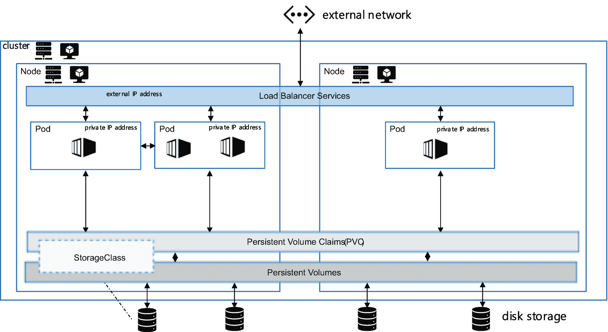

# 运行 SQL Server 容器

我重新整理了 *《SQL Server 2019 揭秘》* 中的练习，当时我向读者展示了运行 SQL Server 容器的基础知识。你可以在 [`https://github.com/microsoft/bobsql/tree/master/demos/sqlserver2022/containers`](https://github.com/microsoft/bobsql/tree/master/demos/sqlserver2022/containers) 找到这些脚本的 SQL Server 2022 版本。

运行一个 SQL Server 容器有多容易？如果你查看这些脚本，你会发现第一步是这条命令：

```
docker run `
-e 'ACCEPT_EULA=Y' -e 'MSSQL_SA_PASSWORD=Sql2022isfast' `
--hostname sql2022 `
-p 1401:1433 `
-v sql2022volume:/var/opt/mssql `
--name sql2022 `
-d `
mcr.microsoft.com/mssql/server:2022-latest
```

这是一个在 Windows 上使用 PowerShell 和 Docker 容器运行时的示例（Windows 上的 Docker Desktop 现在可以使用 Windows Subsystem for Linux，这意味着它作为虚拟化进程运行，而不是一个完整的 Linux 虚拟机）。默认情况下，镜像会缓存在你的本地机器上。如果你运行一个容器而本地没有该镜像，它会首先被 *拉取* 到你的本地缓存中。你可以使用 `docker pull` 命令自己拉取镜像。

让我们看看运行容器的这个命令的参数：

`-e` 参数用于设置环境变量（你可以使用任何有效的 SQL Server Linux 环境变量，例如设置版本）。

`--hostname` 参数很好，因为它会成为容器的 `@@SERVERNAME`。这将有助于 DTC、复制和链接服务器等场景。

`-p` 参数是一个端口映射，这样你就可以运行多个实例（多个使用端口 `1433` 的 SQL 实例会发生冲突）。

`-v` 参数很重要。它将容器私有文件系统中的本地目录映射到持久化存储。在这个例子中，Docker 使用名称 `sql2022volume` 并将其与我本地计算机存储上的一个目录关联起来，该目录在容器重启或删除操作后仍然存在。否则，当容器被删除时，包含数据库的私有文件系统也会被删除。

`--name` 参数是一个方便使用的名称，用于通过 Docker 管理容器（例如，停止容器）。

`-d` 参数在后台运行程序，因此任何 `stdout` 都会被抑制。（没有这个参数，`SQLSERVR.EXE` 的 `stdout` 会被显示出来，也就是 `ERRORLOG` 文件条目。移除这个参数有助于调试问题。）

最后一个参数是容器镜像的位置。微软在 Microsoft Container Repository 或 `mcr.microsoft.com` 托管官方产品容器镜像。在这个例子中，镜像名称

```
mcr.microsoft.com/mssql/server:2022-latest
```

是这个基于 Ubuntu 的 SQL Server 2022 镜像的最新版本。我们为每个累积更新制作一个镜像。使用 “latest” 标签只会给你最新版本。这对我来说非常方便，因为我只需将 `2019-latest` 改为 `2022-latest`，在撰写本文时，我就得到了 SQL Server 2022 的最新预览构建版本。

注意

你可以在 [`https://mcr.microsoft.com/v2/mssql/rhel/server/tags/list`](https://mcr.microsoft.com/v2/mssql/rhel/server/tags/list) 浏览基于 RHEL 的容器镜像列表，在 [`https://mcr.microsoft.com/v2/mssql/server/tags/list`](https://mcr.microsoft.com/v2/mssql/server/tags/list) 浏览基于 Ubuntu 的列表。为了获得支持，你需要确保运行的容器镜像与主机操作系统匹配。例如，基于 WSL 的 Windows 上的 Docker 是基于 Ubuntu 的，因此只支持基于 Ubuntu 的 SQL Server 镜像。你可以在 [`https://docs.microsoft.com/troubleshoot/sql/general/support-policy-sql-server#guidelines`](https://docs.microsoft.com/troubleshoot/sql/general/support-policy-sql-server#guidelines) 了解更多信息。

这个基础 SQL Server 容器镜像包含核心 SQL Server 引擎和工具，如 `sqlcmd`。

在 [`https://docs.docker.com/reference`](https://docs.docker.com/reference) 获取 Docker 的完整参考。我使用 Docker 已经有一段时间了，重要的是你应该知道，在 2021 年，Docker 宣布了一些对其许可的更改，这可能会影响你免费使用 Docker Desktop 的能力。更多信息请阅读 [`www.docker.com/blog/updating-product-subscriptions`](http://www.docker.com/blog/updating-product-subscriptions)。SQL Server 容器符合 OCI 标准，因此它们也得到其他容器运行时引擎的支持，如 `podman` ([`https://podman.io`](https://podman.io))。

由于 SQL Server 容器基于 Linux，SQL Server on Linux 所支持和不支持的所有功能都是一样的。SQL Server 2022 中的一个例外是 Azure extension for SQL Server 在容器中不受支持。

## 连接到 SQL Server 容器

由于这是 SQL Server 引擎，只需像连接任何 SQL Server 一样使用 SSMS 或 Azure Data Studio 等工具连接到容器。请记住，如果你使用了 `-p` 参数进行端口映射，则需要在连接字符串中使用新的端口号。一个在容器外使用 `sqlcmd` 连接到容器的简单示例可以在 [`https://github.com/microsoft/bobsql/blob/master/demos/sqlserver2022/containers/deploy/step4_querysql.ps1`](https://github.com/microsoft/bobsql/blob/master/demos/sqlserver2022/containers/deploy/step4_querysql.ps1) 找到。

由于 SQL Server 容器在容器镜像中包含了 `sqlcmd`，你也可以在容器*内部*连接。这是一个在容器内使用 `sqlcmd` 来还原数据库备份的脚本：[`https://github.com/microsoft/bobsql/blob/master/demos/sqlserver2022/containers/deploy/step3_restoredb.ps1`](https://github.com/microsoft/bobsql/blob/master/demos/sqlserver2022/containers/deploy/step3_restoredb.ps1)。

说到备份，你可以从容器文件系统还原 SQL Server 容器的备份。你首先需要将备份文件复制到容器文件系统中。你可以在脚本 [`https://github.com/microsoft/bobsql/blob/master/demos/sqlserver2022/containers/deploy/step2_copyintocontainer.ps1`](https://github.com/microsoft/bobsql/blob/master/demos/sqlserver2022/containers/deploy/step2_copyintocontainer.ps1) 中看到一个示例。

## 构建自定义容器镜像

你可以看到容器的强大之处，但是像 Polybase 这样的 SQL Server on Linux 的其他软件包呢？它们如何在 SQL Server 容器中运行？Docker 包含了基于其他镜像和一组文件（如你安装到镜像中的软件包）来构建新容器镜像的能力。实际上，核心 SQL Server 容器镜像是我们基于基础 Linux 操作系统镜像结合我们的 SQL Server 文件构建的一个镜像。

`docker build` 命令用于构建容器镜像。你创建一个名为 `Dockerfile` 的文本文件，其中包含一组关于如何构建新镜像的命令。你可以在 [`https://github.com/microsoft/mssql-docker/tree/master/linux/preview/examples`](https://github.com/microsoft/mssql-docker/tree/master/linux/preview/examples) 看到如何将核心 SQL Server 容器镜像与其他 SQL Linux 软件包结合构建新软件包的示例。`docker build` 不运行容器。它用于构建一个镜像，该镜像通过 `docker run` 作为容器运行。

这种定制能力非常强大。你可以构建自己的容器镜像，将 SQL Server 核心镜像与你自己的一组脚本甚至数据库备份文件结合起来。

一个帮助构建和运行复杂容器镜像（包括应用程序）的工具叫做 `docker-compose` ([`https://github.com/docker/compose`](https://github.com/docker/compose))。查看我构建的这个示例（感谢我以前的同事 Vin Yu），它使用 `docker-compose` 通过容器安装 SQL Server 复制：[`https://github.com/microsoft/bobsql/tree/master/demos/sqlserver2022/containers/replication`](https://github.com/microsoft/bobsql/tree/master/demos/sqlserver2022/containers/replication)。


### 容器切换方法

我在本章前面提到过，你不会去修补 SQL Server 容器。你会通过`切换`它们来应用累积更新。以下是其魔法般的原理。当你运行一个容器并通过 `-v` 命令指定一个持久卷时，该卷中的任何文件在容器重启或删除后都会保留。如果你将 SQL Server 数据库文件（包括系统数据库）放入一个映射到持久化存储的目录中，你就可以一次`指向`任何一个 SQL Server 容器到这个卷。

此外，SQL Server 累积更新在同一主版本内是兼容的。因此，我可以执行以下操作：

1.  启动一个 SQL Server 2022 RTM 容器镜像，将其指向 `/var/opt/mssql` 的一个持久卷。
2.  假设 SQL Server 2022 的第一个累积更新发布，而我想使用它。
3.  停止 SQL Server 2022 RTM 容器。
4.  然后运行一个基于 SQL Server 2022 CU1 的新 SQL Server 容器，将其指向同一个持久卷。新的 SQL Server 将启动并识别新的 master 数据库和用户数据库。只需几分钟，我就更新了 SQL Server。
5.  现在假设出现问题，你想回滚到 SQL Server 2022 RTM 容器。
6.  停止新的 SQL Server 2022 CU1 容器并启动 SQL Server 2022 RTM 容器。几分钟之内，你就完成了回滚。

你可以从《*SQL Server 2019 Revealed*》一书中查看如何对 SQL Server 2019 执行此操作的示例，地址是 [`https://github.com/microsoft/bobsql/tree/master/sql2019book/ch7_inside_sql_containers/update/dockerpowershell`](https://github.com/microsoft/bobsql/tree/master/sql2019book/ch7_inside_sql_containers/update/dockerpowershell)。

### 在 Kubernetes 上运行 SQL Server 2022

为 SQL Server 提供 Linux 支持为我们打开了一个全新的世界，包括容器。容器则为我们打开了通往 Kubernetes 的世界。你想以一种有趣的方式学习 Kubernetes 吗？没有什么能比得上《给孩子们看的 Kubernetes 图解指南》：[`https://youtu.be/4ht22ReBjno`](https://youtu.be/4ht22ReBjno)。

### 为什么用 k8s

Kubernetes 源自 Google。Kubernetes 的创始人，如 Brendan Burns（现就职于微软），希望找到一种大规模运行容器的方法。Linux 本身并未为此提供方案，因此他们在 Linux 之上构建了一套名为 Kubernetes 的软件服务。Brendan 制作了一个非常棒的视频播放列表来解释 Kubernetes：[`www.youtube.com/watch?v=daVUONZqn88&list=PLLasX02E8BPCrIhFrc_ZiINhbRkYMKdPT`](http://www.youtube.com/watch?v=daVUONZqn88&list=PLLasX02E8BPCrIhFrc_ZiINhbRkYMKdPT)。

既然 SQL Server 支持容器，为何不也支持 Kubernetes 呢？好吧，这个长单词说得够多了。让我们像那些酷孩子一样使用 `k8s`（k<八个字母>s）吧。必须承认，SQL Server 在 `k8s` 上的支持目前还非常基础。你可以部署 SQL Server，连接到实例，并将数据存储在持久存储中。但 `k8s` 确实提供了一些不错的内置功能，如负载均衡器和基本的高可用性。如果你正在寻找一个使用 `k8s` 和 SQL Server 的完整托管体验，你应该看看 Azure Arc 托管实例 (Arc SQL MI)（[`https://aka.ms/azurearcsqlmi`](https://aka.ms/azurearcsqlmi)）。

请在 [`https://aka.ms/sqlk8s`](https://aka.ms/sqlk8s) 关注 SQL Server 在 `k8s` 上的最新动态。你也可以观看我在 SQLBits 上做的演讲以更深入地了解：[`https://youtu.be/USfCJDoCMr8`](https://youtu.be/USfCJDoCMr8)。

理解基础知识是值得的，这样你就能了解 SQL Server 在 `k8s` 上是如何工作的，以及它是否可以成为你扩展多个 SQL Server 容器的平台。

### 在 k8s 上部署 SQL Server

让我们来看看在 `k8s` 上部署单个 SQL Server 容器的基础知识。

#### k8s 的主要组件有哪些？

当你看到部署体验时，有几个 `k8s` 术语你需要理解。这是一组非常基础的定义。关于这些组件和架构的更完整参考，请参阅 `k8s` 文档：[`https://kubernetes.io/docs/concepts/overview/components`](https://kubernetes.io/docs/concepts/overview/components)。

让我们通过图 9-1 来回顾这些组件（此处并未显示所有组件）。



图 9-1 `k8s` 组件

*   `集群 (Cluster)`
    把集群想象成一个主机，它包含所有 `k8s` 内部软件以及一系列用于运行容器的虚拟机或节点（可以是物理服务器）。
*   `节点 (Node)`
    把节点想象成一个虚拟机（可以是物理机），它可以帮助协调其他节点或以容器形式运行用户程序。
*   `控制平面 (Control plane)`
    所有运行系统的内部 `k8s` 软件称为控制平面，它运行在每个节点上。例如，`k8s` 完全基于 API，因此 API 服务器可以接收请求并在节点间进行编排。
*   `Pod`
    Pod 被定义为在一个节点上执行的一个或多个容器。它是 `k8s` 系统中执行的最小单元。
*   `容器运行时 (Container runtime)`
    由于容器是 Pod 执行的核心，因此所有节点上必须存在一个像 Docker 这样的容器运行时，以拉取容器镜像并运行容器。
*   `命名空间 (Namespace)`
    命名空间是 `k8s` 对象的逻辑分组，使组织项目变得非常方便。每个 `k8s` 系统都有一个默认命名空间，但我建议你始终为你的 Pod 和其他 `k8s` 对象创建其他命名空间。
*   `负载均衡器服务 (Load balancer service)`
    你已经看到过 SQL Server 中以侦听器形式出现的连接抽象。可以把负载均衡器服务（另一种类型称为节点端口）看作一个侦听器。负载均衡器是一种将连接抽象到固定 IP 地址和端口的方式，这样即使底层 IP 地址发生变化，连接也始终会被定向到正确的位置。
*   `存储类 (Storage class)` 和 `持久卷声明 (PersistentVolumeClaim)`
    存储类是系统上存储类型的映射。例如，Azure Kubernetes Service 有一个由系统定义的名为 `managed-premium` 的存储类，它使你能够访问 Azure 高级托管磁盘。可以把持久卷声明 (PVC) 想象成从存储类中划出的一个固定大小的卷。使用 PVC 的关键在于，你的数据独立于节点存储在集群中。如果你将数据库文件存储在 PVC 上，那么无论 SQL Server 的 Pod 运行在哪个节点上，这些文件都是可用的。
*   `副本集 (Replicaset)` 和 `有状态集 (Statefulset)`
    `k8s` 最酷的功能之一是能够为我们的 Pod 声明一种形式的高可用性。例如，你可以`告诉` `k8s`，“我希望在任何时间点都始终有一个 Pod 副本在运行。”因此，如果 Pod 失败（SQL Server 崩溃）甚至节点失败（虚拟机崩溃），`k8s` 将自动尝试重新启动 Pod（如果可用，可能会在同一节点或其他节点上启动）。

#### 如何获取 k8s？

`K8s` 是作为一个开源项目构建的，你可以基于开源部署自己的 `k8s` 集群。例如，你可以使用开源工具 `kubeadm` 来安装 `k8s`，具体文档见 [`https://kubernetes.io/docs/setup/production-environment/tools/kubeadm/create-cluster-kubeadm/`](https://kubernetes.io/docs/setup/production-environment/tools/kubeadm/create-cluster-kubeadm/)。

大多数 `k8s` 客户使用许可产品进行 `k8s` 生产部署，例如 Azure Stack HCI、Red Hat OpenShift 或 Rancher。你可以使用基于云的 `k8s` 系统，例如 Azure Kubernetes Service (AKS)、Google Kubernetes Engine (GKE) 和 Amazon Elastic Kubernetes Service (EKS)。许可产品的巨大优势是部分 `k8s` 系统由服务商管理，并且你可以获得商业生产支持。


