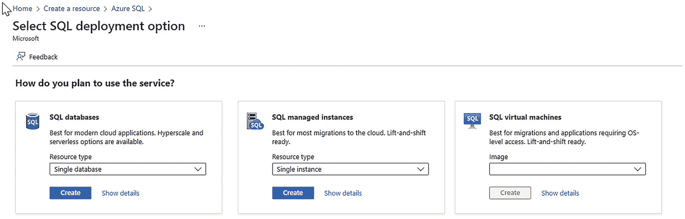
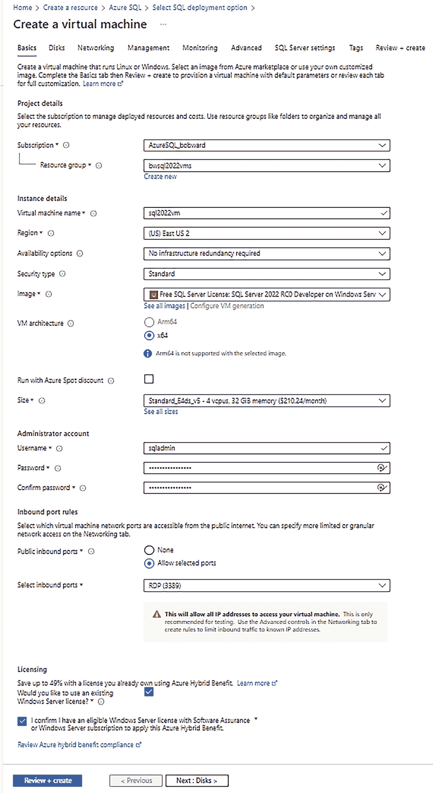
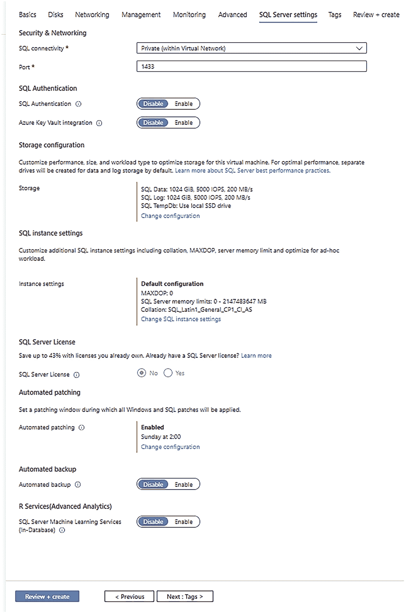
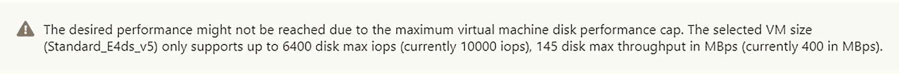

# 在 Azure 虚拟机上部署 SQL Server 的注意事项

## 部署前的关键决策

### 存储与区域选择
*   VM 规格决定了可用的**存储选项**性能，但也需考虑数据库所需的最大存储容量。例如，Azure 中支持数据库的 VM 规格可通过多个磁盘提供高达 2048TB 的存储。但是，将 SQL Server 数据库备份到 Azure Blob Storage 的最大大小为 12TB（Azure 高级文件共享可支持 100TB）。请先通读我们的存储选择最佳实践：[`https://docs.microsoft.com/azure/azure-sql/virtual-machines/windows/performance-guidelines-best-practices-checklist`](https://docs.microsoft.com/azure/azure-sql/virtual-machines/windows/performance-guidelines-best-practices-checklist)。

*   一个非常重要的决策是选择部署虚拟机的**Azure 区域**。Azure 区域是 Azure 数据中心所在的地理位置。从最初的几个数据中心发展至今，已形成全球规模。我们将 Azure 区域组织为*地理区域*。您可以查看部署 Azure 虚拟机的众多区域选择：[`https://azure.microsoft.com/global-infrastructure/geographies`](https://azure.microsoft.com/global-infrastructure/geographies)。Azure 区域的选择基于多种因素，主要围绕您的应用程序将连接到 Azure 虚拟机中 SQL Server 的位置。我认为从一开始就选择合适的区域很重要，但也有方法可以将虚拟机移动到其他区域，详情请阅读：[`https://docs.microsoft.com/azure/resource-mover/tutorial-move-region-virtual-machines`](https://docs.microsoft.com/azure/resource-mover/tutorial-move-region-virtual-machines)。Azure 虚拟机被视为*核心服务*，因此每当建立新区域时，Azure 虚拟机都将可用。然而，并非所有虚拟机规格在所有区域都可用。

### 管理员账户与密码
*   决定使用一个**管理员账户**和密码。您需要为 Windows 或 Linux 提供一个管理员账户。我遇到过客户因为公司管理员账户标准而完全受阻的情况。如果您使用 SQL Server 市场映像，我们会自动将此管理员账户添加为`sysadmin`角色的成员。

### 部署方式与许可证
*   **如何部署？**

在 Azure 虚拟机上部署 SQL Server 有几种方式。我将在本章后面展示使用 Azure 门户逐步部署的过程，但您也可以使用脚本和一种称为**ARM 模板**的概念进行部署。

您还需要决定是否使用**SQL Server 市场映像**，它预装了操作系统和 SQL Server。我们有多种操作系统和 SQL Server 组合可供选择。这种方法的优点包括自动安装**SQL Server IaaS 扩展**，您将在本章后面的“**SQL Server IaaS 代理扩展**”一节中了解更多。

**注意** SQL Server 的市场映像可能包含所有服务，包括 SQL Server Reporting Services (SSRS)和 SQL Server Analysis Services (SSAS)，或者您也可以仅选择数据库引擎。也有单独的 SSRS 或 SSAS 市场映像。

有些情况下您希望自己安装 SQL Server。我有时会在安装特定版本的 SQL Server 时这样做。因此，我将使用 Azure 市场仅安装操作系统。然后，我将 SQL 安装包复制到虚拟机中并安装 SQL Server。使用 SQL Server 市场映像的一个好处是，我们会将安装保留在虚拟机内，因此您可以为命名实例场景卸载和重新安装。

无论使用哪种方法，您都必须决定**许可证**。您是否有现有的 SQL Server、Windows 和/或 Linux 许可证，还是将选择按需付费方法？使用现有的 SQL Server 和 Windows 许可证称为**Azure Hybrid Benefit (AHUB)**。您可以阅读更多关于 AHUB 的信息：[`https://azure.microsoft.com/pricing/hybrid-benefit`](https://azure.microsoft.com/pricing/hybrid-benefit)。还有另一个用于**DR**的许可证选项，您可以仅为灾难恢复部署 Azure 虚拟机，并免费获得 SQL Server 许可证。您可以在此处了解更多信息：[`https://docs.microsoft.com/azure/azure-sql/virtual-machines/windows/business-continuity-high-availability-disaster-recovery-hadr-overview#free-dr-replica-in-azure`](https://docs.microsoft.com/azure/azure-sql/virtual-machines/windows/business-continuity-high-availability-disaster-recovery-hadr-overview#free-dr-replica-in-azure)。

您还可以通过使用称为**预留实例**的概念来节省成本，您可以在此处阅读：[`https://azure.microsoft.com/pricing/reserved-vm-instances`](https://azure.microsoft.com/pricing/reserved-vm-instances)。即使您选择使用现有的 Windows 和 SQL Server 软件许可证，您仍会产生计算和存储成本。

### 高可用性选项
*   您需要**故障转移集群实例 (FCI)** 还是**Always On 可用性组？**

如果您计划将 SQL Server 作为故障转移集群实例 (FCI) 或 Always On 可用性组的一部分部署，那么您需要做出一些选择，包括可用性、存储和网络。有关更多详细信息，请参阅本章后面的“**高可用性**”部分。

还有其他部署选择要做，但我将在本章后面标题为“**在 Azure 虚拟机上部署 SQL Server**”的练习中向您展示这些，该练习展示了如何通过 Azure 门户使用 SQL Server 市场映像进行部署。

## SQL Server IaaS 代理扩展

您已经了解了 Azure Arc 代理和扩展的概念，例如 Azure SQL Server 扩展。Azure 虚拟机通过虚拟机扩展具有相同的概念。您可以在此处阅读更多关于扩展概念的信息：[`https://docs.microsoft.com/azure/virtual-machines/extensions/overview`](https://docs.microsoft.com/azure/virtual-machines/extensions/overview)。扩展架构也适用于 Linux，您可以在此处阅读：[`https://docs.microsoft.com/azure/virtual-machines/extensions/features-linux`](https://docs.microsoft.com/azure/virtual-machines/extensions/features-linux)。

### 什么是 SQL Server IaaS 代理扩展？

对于 SQL Server，我们为 Azure 虚拟机构建了一个扩展，称为**SQL Server IaaS 代理扩展**。此扩展在虚拟机内部安装一组服务，为您提供管理虚拟机和 SQL Server 的真正价值，包括

*   Azure 门户管理
*   自动 SQL 数据库备份
*   自动安全更新
*   许可证和版本管理，包括 AHUB
*   SQL 配置管理，如`tempdb`
*   SQL 最佳实践评估
*   Microsoft Defender for Cloud

**注意** 在撰写本书时，SQL Server IaaS 代理扩展不支持 Azure Active Directory (AAD)身份验证和 Microsoft Purview 访问策略与 SQL Server 2022。我们的团队计划在未来添加这些功能。

使用 SQL Server IaaS 代理扩展没有相关成本。

### IaaS 代理扩展模式

该扩展有两种不同的模式和安装方法。

#### 完全模式

这是使用 SQL 市场映像时的默认模式，并启用所有功能。


### 轻量模式

轻量模式不安装代理软件，但提供有限的门户体验，包括许可和版本管理。例如，您可以使用此方法来利用 Azure 混合权益。您可以随时升级到完整模式，因为对于轻量模式，我们会将代理二进制文件复制到虚拟机中但不安装它们。

### 安装代理扩展

当您使用 Azure 市场映像部署 SQL Server 时，我们会自动以完整模式安装代理扩展。您也可以在部署后以任何模式安装代理扩展。我们将扩展的安装称为*注册*。您可以在 Windows 上阅读有关如何注册扩展的更多信息：[`https://docs.microsoft.com/azure/azure-sql/virtual-machines/windows/sql-agent-extension-manually-register-single-vm`](https://docs.microsoft.com/azure/azure-sql/virtual-machines/windows/sql-agent-extension-manually-register-single-vm)，或在 Linux 上阅读：[`https://docs.microsoft.com/azure/azure-sql/virtual-machines/linux/sql-iaas-agent-extension-register-vm-linux`](https://docs.microsoft.com/azure/azure-sql/virtual-machines/linux/sql-iaas-agent-extension-register-vm-linux)。

注册扩展不需要重启虚拟机。您可以选择对虚拟机进行批量注册，以及修复和注销扩展。

### 代理扩展的详细信息

如果您选择了完整模式，您将在 Windows 虚拟机中看到名为`Microsoft Monitoring Agent`和`Microsoft SQL Server IaaS Agent`的程序。这些程序使用多个不同的 Windows 服务（或在 Linux 上的守护程序）。

例如，如果您使用扩展事件来跟踪进入 SQL Server 的活动，您将看到一个名为`Microsoft SQL Server IaaS Agent Query Service`的应用程序。

要查看更多关于 SQL Server 在 Linux 上差异的详细信息，请阅读此文档页面：[`https://docs.microsoft.com/azure/azure-sql/virtual-machines/linux/sql-server-iaas-agent-extension-linux`](https://docs.microsoft.com/azure/azure-sql/virtual-machines/linux/sql-server-iaas-agent-extension-linux)。

根据我的经验，代理扩展不会消耗大量资源。如果您觉得它导致了任何问题，您始终可以选择注销该扩展。

关于扩展还有其他几个重要点：

*   我们仅对故障转移集群实例（FCI）支持轻量模式，但对 Always On 可用性组支持完整模式。
*   我们不支持在 SQL Server Windows 虚拟机上为多个实例安装扩展。我们最多只支持一个实例。如果您需要支持的实例是命名实例，默认注册使用轻量模式，但您可以升级到完整模式。
*   目前，我们不支持为在 Azure 虚拟机中运行的 SQL Server Linux 容器注册扩展。

我询问了 Azure 虚拟机上 SQL Server 的高级项目经理 Aditya Badramraju 关于 SQL Server IaaS 代理扩展的重要性。他告诉我：*“在 Azure IaaS 上运行 SQL Server 与其他云不同，因为我们提供 IaaS++产品，例如自动备份、SQL VM 最佳实践评估等，默认情况下，当客户选择在 Azure VM/IaaS 上运行 SQL Server 时提供。这些产品通过 SQL IaaS 代理扩展成为可能。该扩展有助于将 SQL Server 和 Azure 基础设施的优势结合在一起，使客户能够自信地运行其关键任务工作负载。”*

## 在 Azure 虚拟机上部署 SQL Server

利用您关于规划部署的知识，让我们通过 Azure 门户和市场映像进行一个练习，了解如何在 Azure 虚拟机上部署 SQL Server。此练习旨在展示如何在 Azure 虚拟机上部署运行 Windows Server 的 SQL Server `standalone`实例。您可以在 Azure 虚拟机上阅读更多关于在 Linux 上部署 SQL Server 的信息：[`https://docs.microsoft.com/azure/azure-sql/virtual-machines/linux/sql-vm-create-portal-quickstart`](https://docs.microsoft.com/azure/azure-sql/virtual-machines/linux/sql-vm-create-portal-quickstart)。您可以在本章后面的标题为“`High Availability`”的部分中阅读更多关于部署故障转移集群实例（FCI）或 Always On 可用性组的内容。

此练习基于文档中的快速入门指南：[`https://docs.microsoft.com/azure/azure-sql/virtual-machines/windows/sql-vm-create-portal-quickstart`](https://docs.microsoft.com/azure/azure-sql/virtual-machines/windows/sql-vm-create-portal-quickstart)。

### 先决条件

```
*   您已阅读本章中名为“`Planning for Deployment`”的部分。
*   您需要一个具有创建 Azure 虚拟机权限的 Azure 订阅（通常`Contributor`角色的成员即可）。验证您是否也有在订阅配额内创建 Azure 虚拟机的权限，并且您要使用的区域在您的订阅中受支持。
```


### 部署步骤



**图 10-1** 创建 Azure SQL 资源

1.  在浏览器中访问 Azure 门户 [`https://portal.azure.com`](https://portal.azure.com)，并使用你的 Azure 订阅登录。
2.  在主页上，选择 **+ 创建资源**。在搜索框中，输入 `Azure SQL`。在下拉结果中，选择 `Azure SQL`。然后选择 **创建**。你现在应该会看到一个类似图 10-1 的屏幕。

`Azure 虚拟机上的 SQL Server`是`Azure SQL`系列的一部分，这个屏幕是选择多种 SQL 虚拟机选项的便捷方式。



**图 10-2** Azure 虚拟机部署的“基本信息”界面板

1.  对于 SQL 虚拟机，选择“向下箭头”以查看市场映像选项。你可以滚动浏览这些选项，查看操作系统和 SQL 版本的各种组合。目前，选择`SQL Server 2022`的`免费许可`选项。当`SQL Server 2022`正式发布时，此选项应为`免费 SQL Server 许可：Windows Server 2022 上的 SQL Server 2022 Developer 版`。（正式发布时还会有标准版和企业版的选项）。点击 **创建**。
2.  现在，你将能够在一系列称为*界面板*的屏幕上填写规划好的信息。第一个界面板是 **基本信息**。图 10-2 展示了我为创建新虚拟机所填写的“基本信息”界面板。

让我们仔细看看这些选项：



**图 10-3** Azure 部署过程中的 SQL Server 设置

1.  对于 **磁盘** 界面板，可能有一些供你探索的选项，但这仅针对操作系统磁盘。稍后你将获得其他数据磁盘的选项，用于存储 SQL Server 数据、日志和`tempdb`文件。点击 **下一步: 网络**。
2.  对于 **网络** 界面板，我将保留所有默认设置。这是因为我将默认加入资源组的 Azure 虚拟网络。如果你选择了新建资源组，你将有选项自动创建一个新网络。可能存在特定场景，即 Azure 网络已预先设置好，你可以在此处加入该网络。有一个名为`加速网络`的选项，我建议你选中以获得最佳网络性能。如果你选择的虚拟机大小支持此功能，它默认是选中的。点击 **下一步: 管理**。
3.  对于 **管理** 界面板，我将使用默认值，但我建议你在此探索几个选项，包括启用`Microsoft Defender for Cloud`（我的订阅已自动启用此项），为测试或面向开发的虚拟机启用`自动关闭`，以及启用`热补丁`（但仅适用于特定的操作系统选择）。点击 **下一步: 监视**。
4.  在 **监视** 界面板上，我保留了默认值，但你应该探索此处其他用于诊断的选项。这些选项独立于 SQL，是针对操作系统和虚拟机的。点击 **下一步: 高级**。
5.  对于 **高级** 界面板，我保留了默认值，但根据你组织的需求可能会有一些自定义设置，例如安装不同的扩展。（这不是选择`SQL Server IaaS 代理扩展`的地方。你通过选择 SQL Server 市场映像已经做出了该选择。）点击 **下一步: SQL Server 设置**。
6.  **SQL Server 设置** 界面板仅在你选择了 SQL Server 市场映像时才会出现。它提供了多个用于配置 SQL Server 设置的选项，以及诸如存储等重要选项。图 10-3 展示了此界面板首次出现时的默认选项。

*   你的`Azure 订阅`将根据你账户的默认订阅自动填写，但如果你有多个订阅，可以更改此项。
*   我选择了一个已为多个虚拟机创建的现有`资源组`。你也可以在此处创建一个新的资源组。

**提示** 当你在新资源组中创建虚拟机时，会同时创建一个虚拟网络。如果你向同一资源组添加其他虚拟机，Azure 门户会将你的新虚拟机添加到同一个 Azure 网络中。因此，你的虚拟机现在位于它们自己的私有网络中，可以轻松地相互发现。

*   选择一个`虚拟机名称`，该名称在你的资源组中必须是唯一的。这将成为虚拟机的计算机名。
*   选择部署虚拟机的`Azure 区域`。
*   对于`可用性选项`，我不需要 Azure 已提供选项之外的任何额外可用性。当你构建`故障转移集群实例 (FCI)`或`Always On 可用性组`时，你需要在此处选择一个选项。
*   对于`安全类型`，我选择了`标准`。你的虚拟机确实有一些新的安全选项，包括支持`安全启动`和`新 TPM 加密`等功能的选项。SQL Server 市场映像可能并非对所有这些选项都可用。
*   对于`映像`，我只保留了使用`Azure SQL`屏幕时选择的选项。你可以使用此处来更改不同的版本或操作系统选项。
*   对于`虚拟机体系结构`，对于 SQL Server 市场映像，`x64`是唯一选项。
*   我未勾选`使用 Azure Spot 折扣运行`，因为该选项不适用于基于 SQL Server 的虚拟机。（此选项意味着你支付的费用更低，但内置可用性可能降低。）
*   `大小`是关键所在。你的规划在此发挥作用。如果你点击 **查看所有大小**，可以更改虚拟机的大小。`Ev5`系列是 SQL Server 的推荐系列之一，因此我选择了这个。出于我的测试目的，4 个 vCPU 和 32GB 内存已经足够。基于大小还有其他限制，主要围绕存储性能。因此，尽管你以后可以更改此设置，但最好从一开始就规划好。请访问我们的网站 [`https://aka.ms/SQLIaaSSizing`](https://aka.ms/SQLIaaSSizing) 获取更多信息。请密切注意基于所选大小的虚拟机整体存储性能上限，以及你数据、日志和`tempdb`所需的特定存储选择。

**注意** 可能存在一些场景，例如开发场景，你希望支付更少费用，但不介意资源或存储性能有所降低。可以考虑`D`系列或`B`系列等可突发性能的大小。

*   为`管理员账户`填写用户名和密码。尽管你以后可以更改密码（即使忘记了也可以在门户中更改），但你也可以通过操作系统的标准选项在虚拟机内部创建新的管理员账户。
*   为了测试目的，我将保留标准的`RDP`端口作为公共入站端口开放。对于生产环境，你可能不希望这样做，而使用其他选项。我将在本章下一节“**连接到 Azure 虚拟机上的 SQL Server**”中介绍这些选项。
*   对于`许可`，我肯定想节省成本。假设我拥有尚未使用的`Windows Server`现有许可证。我可以勾选此框并声明我希望使用我的 Windows 许可证来支付虚拟机的 Windows 成本。

选择 **下一步: 磁盘**。

让我们了解更多关于这些设置的信息：



**图 10-4** 虚拟机 I/O 上限警告

