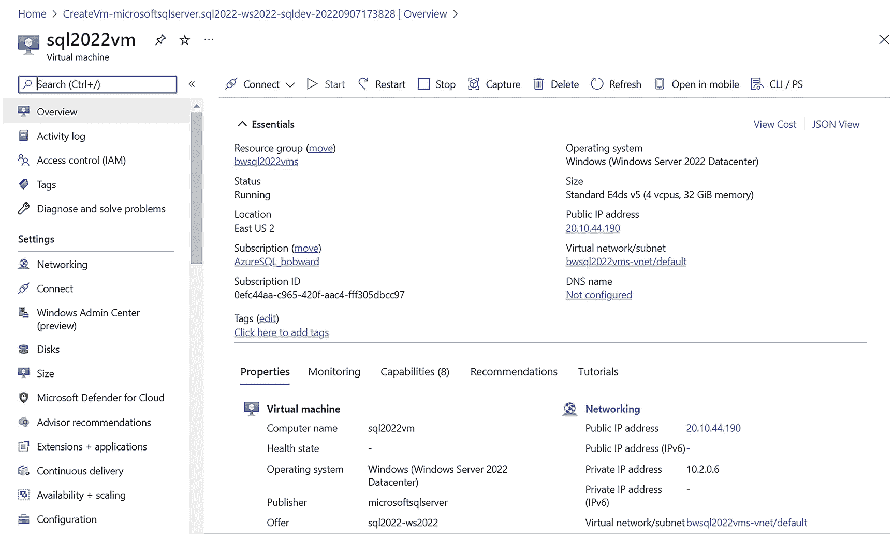
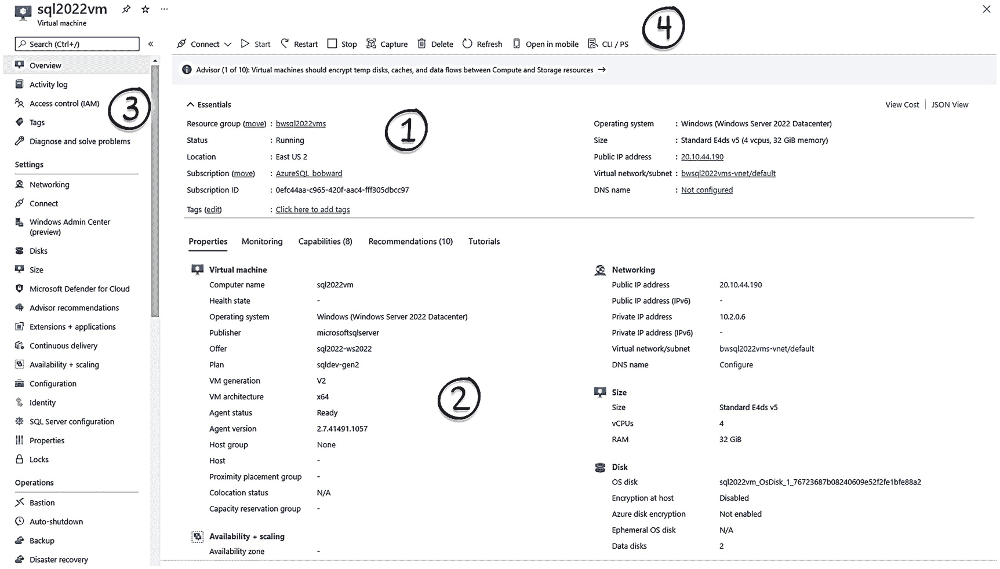
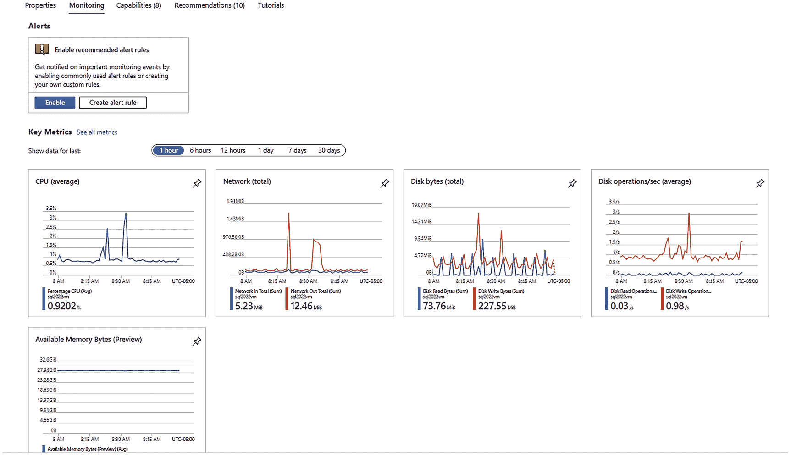
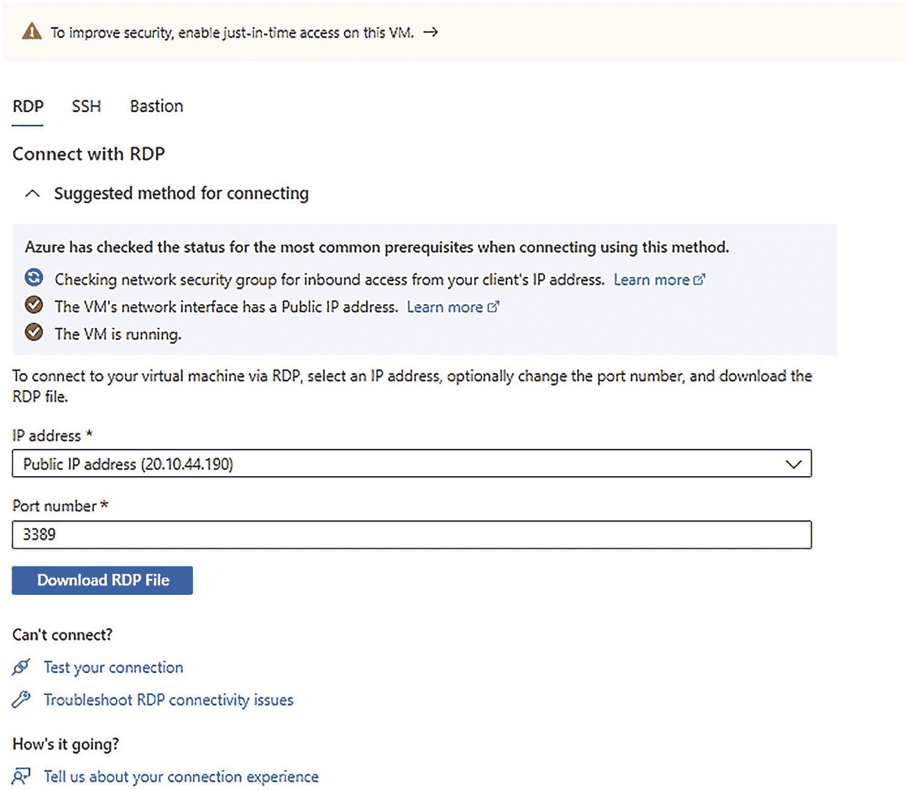
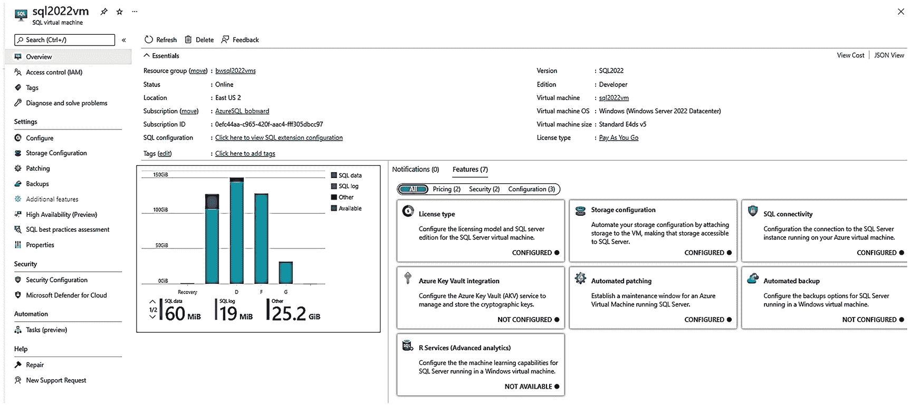

# 在 Azure 虚拟机上部署 SQL Server

## 安全与网络配置

关于**安全与网络**，我建议您为端口 `1433` 选择“私有”选项。这意味着，任何连接到虚拟机中 SQL Server 的请求，都必须来自已连接到 Azure 虚拟网络（或连接到此虚拟网络的其他网络）中的计算机。如果您选择了“公共”，我强烈建议您更改端口号，以避免在公共互联网上暴露端口 `1433`。如果您必须使用公共端点和端口 `1433`，可以选择在后续步骤中创建网络安全组（NSG）防火墙规则等选项。

## SQL 身份验证

对于 **SQL 身份验证**，您可以选择启用，这将允许“混合模式”身份验证，并会提示您输入 SQL 系统管理员账户和密码（`sa` 账户仍默认被禁用）。

## Azure Key Vault 集成

对于 **Azure Key Vault 集成**，您可以保留默认的禁用状态。如果您想将用户管理的密钥（例如用于透明数据加密的密钥）存储在 Azure Key Vault 中，可以稍后启用此功能。

## 存储配置

接下来是**存储配置**，这可能是您在 Azure 虚拟机上为 SQL Server 性能所做的最重要的一项选择。我们为您提供了数据文件、日志文件和 `tempdb` 的托管磁盘类型的推荐设置。我强烈建议您单击“更改配置”并查看这些设置。您将获得如何为数据文件、日志文件和 `tempdb` 配置各种磁盘的选项。以下是一些要点：

*   正如我之前在规划章节中提到的，请阅读我们的最佳实践指南，其中包含存储选择建议，链接位于 [`https://docs.microsoft.com/azure/azure-sql/virtual-machines/windows/performance-guidelines-best-practices-checklist`](https://docs.microsoft.com/azure/azure-sql/virtual-machines/windows/performance-guidelines-best-practices-checklist)。
*   按照建议将 `tempdb` 放置在临时驱动器上。您没有理由不选择此选项。要使用此功能，您的虚拟机大小必须支持临时磁盘。此外，此屏幕还为您提供了 `tempdb` 文件数量和自动增长等选项。
*   请仔细查看此屏幕上的警告，如图 10-4 所示。

您在此屏幕上所做的磁盘选择决定了 IOPS 和吞吐量等关键因素。通常，较大的磁盘具有更好的性能。然而，您选择的虚拟机大小**可能会限制虚拟机的整体 I/O 吞吐量**，这正是此警告所提示的内容。对于任何生产环境的虚拟机，我强烈建议您将虚拟机大小与存储选择对齐。就我个人而言，我降低了存储大小以符合虚拟机大小的限制。如果您需要更大的存储，您可能需要返回并选择不同的虚拟机大小。

在部署之后，您确实可以选择扩展存储配置。

## 标签

**标签**页是完全可选的。它用于为 Azure 资源添加标记。我建议在共享订阅等情况下使用标签，以便您可以按使用类型或部门来组织并轻松查找某些类型的 Azure 资源。选择“下一步：审阅 + 创建”。

## 审阅 + 创建

您现在会看到一个屏幕，这可以说是部署前的“最后机会”。我们首先在此处进行验证，然后您可以查看预估成本和所有设置。准备就绪后，选择“创建”。

## SQL 实例设置

接下来是 **SQL 实例设置**。这些是您通常可以在 SQL Server 安装过程中选择的设置，例如 `MAXDOP`，但这里提供更多选项。例如，您可以启用即时文件初始化和锁定内存页。您始终可以在虚拟机内部自由地稍后更改这些设置。

## SQL Server 许可证

对于 **SQL Server 许可证**，您可以在此处选择将现有的 SQL Server 许可证应用于您的部署以节省成本。这是 Azure 混合权益选项。我的选项显示为灰色，因为我选择了免费版本的 SQL Server。

## 最终选项

您最后的一组选项包括配置自动备份和安全更新，以及将 SQL Server 机器学习服务作为一项功能启用。除了机器学习服务外，您可以稍后更改这些选项；而机器学习服务，您可以通过虚拟机中的 SQL Server 安装程序稍后作为功能添加。

选择“下一步：标签”。

您不必在此处等待，因为部署是一个异步操作。但是，如果您保持门户原样，您将看到一个**部署正在进行中**的屏幕，该屏幕会动态更新并显示创建虚拟机所有资源和安装 SQL Server 的进度。

预装 SQL Server 的虚拟机的部署时间可能会有所不同，有时因区域而异。但根据我的经验，部署应在大约 10 分钟内完成。

部署完成后，选择“转到资源”。您的屏幕应如图 10-5 所示。

图 10-5
已部署在 Azure 虚拟机上的 SQL Server

## 其他部署方法

除了门户之外，您还有其他选项可以部署 Azure 虚拟机，包括 `az` CLI 和 PowerShell。一种用于自动化的、非常强大的部署 Azure 虚拟机（以及几乎所有 Azure 资源）的方法是使用 Azure 资源管理器模板。请从以下链接开始了解虚拟机的 ARM 模板：[`https://docs.microsoft.com/azure/virtual-machines/windows/quick-create-template`](https://docs.microsoft.com/azure/virtual-machines/windows/quick-create-template)。这里还有一个使用 ARM 模板在 Azure 虚拟机上快速部署 SQL Server 的指南：[`https://docs.microsoft.com/azure/azure-sql/virtual-machines/windows/create-sql-vm-resource-manager-template`](https://docs.microsoft.com/azure/azure-sql/virtual-machines/windows/create-sql-vm-resource-manager-template)。

现在您该做什么？请继续阅读下一节，了解如何探索您的部署并连接到 Azure 虚拟机上的 SQL Server。

## 探索并连接到 SQL Server 虚拟机

让我们了解如何探索、连接和配置您的 Azure 虚拟机以及您的 SQL Server Azure 虚拟机。

### 在门户中探索你的 Azure 虚拟机

让我们通过查看图 10-6 中展示的部署情况，来探索 Azure 门户中的你的 Azure 虚拟机。

一个 SQL 2022 虚拟机的截图。菜单列表、概述、属性和工具栏从 1 到 4 进行了编号。

图 10-6

门户中已部署的 Azure 虚拟机

如果你想了解如何轻松进入虚拟机部署视图，请使用 Azure 主页上的搜索字段，或者在 Azure 主页的左侧菜单中，选择“虚拟机”。

让我们根据图中的编号，来看看部署的主要区域以及你可以对每个区域进行的操作：

> 注意
>
> 你在门户中看到的几乎所有用于查看或配置虚拟机的选项，也可以通过 `az` 命令行界面 (CLI) 或 `PowerShell` 来完成。而运行这些命令的一个简便方法是通过 `Azure Cloud Shell`。如果你还没用过，你会爱上这个云 Shell 的。你可以在 [`https://docs.microsoft.com/azure/cloud-shell/overview`](https://docs.microsoft.com/azure/cloud-shell/overview) 阅读更多信息。此外，还有一个 Azure 移动应用程序，我甚至能够用我的手机管理我的虚拟机和其他 Azure 资源！在门户的左侧菜单中还有一个 API 选项，允许你运行一些 `az` CLI 命令。另外，在屏幕顶部，你可以使用 CLI/PS 选项。

一个窗口的截图。监控选项卡下方是一个警报框。该框下方是在“关键指标”标题下的 5 个折线图。

图 10-7

Azure 虚拟机的内置监控

1.  屏幕顶部区域称为 `概述`，你可以在此查看有关部署的基本信息。一个重要的属性是“状态”，这样你就可以看到虚拟机是 `正在运行` 还是 `已停止`。

2.  屏幕主页面包含多个选项卡，可查看虚拟机属性的更多 `详细信息`、监控统计信息、你可以启用的其他功能以及建议。`监控` 选项卡非常有趣，如图 10-7 所示。

这就好比你随时拥有 Windows 任务管理器的性能信息，而无需连接到虚拟机内部。请注意启用警报的功能。你可以配置警报，以便在任何关键指标出现问题时（例如，如果 CPU 使用率超过阈值）获得通知。

3.  屏幕左侧称为资源菜单（或左侧菜单），包含许多查看和配置虚拟机的选项。选项如此之多，以至于需要另写一章来涵盖它们。以下是我经常使用的几个：
    *   `大小` – 在这里你可以查看有关虚拟机大小的更多详细信息或更改大小。在 [`https://docs.microsoft.com/azure/virtual-machines/resize-vm`](https://docs.microsoft.com/azure/virtual-machines/resize-vm) 阅读更多关于调整虚拟机大小的信息。
    *   `网络` – 我可能需要进入此选项来配置网络安全组 (NSG)，这类似于防火墙规则。
    *   `SQL Server 配置` – 在这里我可以进入虚拟机的 SQL Server 视图。我将在题为“在门户中探索 SQL 虚拟机”的部分中对此进行更多讨论。
    *   `Microsoft Defender for Cloud` – 如果你启用了此功能，可以查看 Defender 的安全建议或警报。
    *   `Bastion` – 此选项为你提供了一种使用浏览器进行远程桌面体验的安全方式。
    *   `运行命令` – 一种无需连接到虚拟机即可在其内部运行程序的有趣方式。
    *   `指标` – 无需连接到虚拟机内部即可获取关键性能计数器。一些性能信息，例如从主机视角看虚拟机的信息，只能在此处获取。
    *   `导出模板` – 你可以基于当前部署构建一个 ARM 模板。我有时通过门户进行部署，然后使用此选项为其他要部署的虚拟机构建模板。
    *   `启动诊断` – 这是一个很酷的功能，可以查看虚拟机的“控制台”屏幕，以确保它没有处于挂起状态。
    *   `重置密码` – 忘记了管理员密码？你可以在这里重置它。如果你担心安全问题，只有在 Azure 中对虚拟机拥有权限的账户才能执行此操作。
    *   `重新部署 + 重新应用` – 我遇到过几次情况，使用此选项可以使我的虚拟机在似乎处于挂起状态时成功重启。你可能永远不需要这个，但知道它的存在是件好事。
    *   `串行控制台` – 这就像你可以使用计算机的显示器一样，当虚拟机启动似乎出现问题时，它确实能派上用场。同样，你可能永远不需要它，但知道它的存在是件好事。

4.  在屏幕顶部是一个重要选项的菜单：
    *   `连接` – 这为你提供了如何使用远程桌面 (`rdp`) 或 Linux 的 `ssh` 连接到虚拟机的详细信息。
    *   `启动` – 如果你在操作系统内部关闭了虚拟机或使用门户停止了它，这是你再次启动它的方式。
    *   `重启` – 可能有几种场景需要在没有操作系统访问权限的情况下重启虚拟机。
    *   `停止` – 此选项允许你在没有操作系统访问权限的情况下关闭虚拟机。使用此选项停止虚拟机与在虚拟机内部使用操作系统方法停止有显著区别。如果你通过操作系统关闭虚拟机，虚拟机的状态是 `已停止`，但你仍需为计算资源付费。如果你使用此选项，虚拟机的状态是 `已停止（已解除分配）`，你无需为计算资源付费。使用此选项可能会导致启动虚拟机的时间更长，但它是节省计算成本的一种便捷方法。

现在，让我们回顾一下如何连接到虚拟机的基本知识。

### 连接到 Azure 虚拟机

如果你在自有环境中拥有虚拟机，那么用于操作系统访问、连接到该虚拟机的两种最常见方法，分别是用于 Windows 的远程桌面 (`rdp`) 和用于 Linux 的 `ssh`。

基本上有三种方法可以连接到 Azure 虚拟机。首先，在 Azure 门户中，选择屏幕顶部菜单中的 `连接` 选项。你将看到如图 10-8 所示的选项。

一个屏幕截图。顶部是一个安全警告。其下方，在 `RDP` 选项卡下是连接方法，带有 `IP` 地址和端口号的选项。

**图 10-8**
Azure 虚拟机的连接选项

如果你使用的是 Windows，可以下载一个文件，用于任何支持 `rdp` 的程序。请注意端口号。在部署虚拟机时，你已将默认的 `rdp` 端口设为公开。对于你的组织而言，这可能不是一个安全的方法（在微软内部是不允许的）。一个选项是更改默认的 `rdp` 端口，然后你需要在此处提供不同的端号。以下是一套在 Azure 门户中为虚拟机更改 `rdp` 端口的详细步骤：[`https://docs.microsoft.com/archive/blogs/technet/drew/1195`](https://docs.microsoft.com/archive/blogs/technet/drew/1195)。

如果在通过 `rdp` 连接到 Azure 虚拟机时遇到问题，请查阅我们的文档：[`https://docs.microsoft.com/troubleshoot/azure/virtual-machines/troubleshoot-rdp-connection`](https://docs.microsoft.com/troubleshoot/azure/virtual-machines/troubleshoot-rdp-connection)。

对于 Linux，`ssh` 选项卡下存在相同的选项。任何支持 `ssh` 的程序或 Shell 都可以使用。

第三个选项是最安全的，称为 Bastion。Bastion 是在你的 Azure 虚拟网络中运行的一项安全的 Azure 服务，它允许你通过 Web 浏览器以安全的方式获得 `rdp` 或 `ssh` 的体验。了解更多关于 Bastion 的信息：[`https://docs.microsoft.com/azure/bastion/bastion-overview`](https://docs.microsoft.com/azure/bastion/bastion-overview)。

一旦你可以使用 `rdp` 或 `ssh`，现在就可以像访问自有机器或数据中心里的任何虚拟机一样，访问这台虚拟机了。

### 在门户中探索 SQL 虚拟机

由于我们部署了虚拟机，`SQL Server IaaS 代理扩展` 已被安装，并且我们的 `SQL Server` 已以 `完整模式` 注册。因此，我们可以前往 Azure 门户，并将我们的虚拟机视为 `SQL 虚拟机` 进行查看。在门户中有几种查看 `SQL 虚拟机` 的方式。你可以使用 Azure 虚拟机资源菜单中的 `SQL Server 配置` 选项，或者从 Azure 主页搜索 `SQL 虚拟机`。你也可以在 Azure SQL 资源列表中看到 `SQL 虚拟机`。

图 10-9 展示了我在门户中的 `SQL 虚拟机`。

一个 `SQL 2022` 的屏幕截图。在“概述”下方，菜单是基本属性的详细信息。其下方是一个柱状图，右侧是 `SQL` 的 7 个功能。

**图 10-9**
门户中已部署在 Azure 虚拟机上的 `SQL Server`

请注意，菜单中的所有属性、数据和选项都是非常 `SQL Server` 特定的。我在部署虚拟机时向你展示过的大多数 `SQL Server` 特定项目，在这里也可以进行配置。

`存储配置` 选项仅用于扩展你在部署期间所做的选择，但如果你超过了虚拟机大小的存储上限，同样的警告仍然适用。

我将在本章后面的“**优化性能**”一节中讨论 `SQL 最佳实践评估` 选项。

关于屏幕顶部选项的一个重要提示：`删除` 选项用于通过 `IaaS 代理扩展` 取消注册 `SQL Server`。在 `删除` 屏幕上还有一个删除虚拟机的选项，但这需要你明确选择该选项。

### 连接到 Azure 虚拟机上的 SQL Server

现在 `SQL Server` 已经部署好了，如何使用 `SSMS` 或你的应用程序等工具连接到 `SQL Server` 呢？

这完全取决于你想要从哪里连接。以下是你的选项：

*   使用 `rdp` 或 `ssh` 登录后，在虚拟机内部使用工具或应用程序进行连接。
*   创建另一台虚拟机或在同一虚拟网络中构建应用程序。一旦设置好，你就自动处于同一私有网络中，因此可以使用服务器名称或私有 `IP` 地址。
*   使用 VPN 网关或 Express Route 等技术将你的本地环境或 Azure 资源连接到虚拟网络。了解更多：[`https://docs.microsoft.com/azure/architecture/reference-architectures/hybrid-networking`](https://docs.microsoft.com/azure/architecture/reference-architectures/hybrid-networking)。
*   连接到虚拟机的公共 `IP` 地址或 `DNS` 名称。这需要你为虚拟机启用公共连接，但请注意。如果你打算使用端口 `1433`，我不推荐此选项。即使你更改了端口，你也绝对需要配置一个 `网络安全组 (NSG)`。了解更多：[`https://docs.microsoft.com/azure/azure-sql/virtual-machines/windows/ways-to-connect-to-sql#connect-to-sql-server-over-the-internet`](https://docs.microsoft.com/azure/azure-sql/virtual-machines/windows/ways-to-connect-to-sql#connect-to-sql-server-over-the-internet)。

无论你选择哪种方法，连接到 Azure 虚拟机上的 `SQL Server`，就像使用你选择的、与 `SQL Server` 兼容的工具或应用程序连接到任何 `SQL Server` 一样。

> **提示**
>
> 我们的 SQL 市场镜像在虚拟机中预装了 `SSMS` 和 `Azure Data Studio` 等工具！

## 迁移至 Azure 虚拟机上的 SQL Server

您可能正计划在 Azure 虚拟机上部署 SQL Server，目的是将现有的 SQL Server 实例从本地环境或其他云平台迁移过来。要全面了解将 SQL Server 迁移到 Azure 的各种选项，请查阅 [`https://azure.microsoft.com/migration/sql-server`](https://azure.microsoft.com/migration/sql-server)。

**提示**

如果您正考虑将许多 SQL Server 实例迁移到 Azure 虚拟机，请查看 Azure Migrate 服务，网址为 [`https://azure.microsoft.com/services/azure-migrate`](https://azure.microsoft.com/services/azure-migrate)。该服务介绍了从本地环境，乃至 AWS 和 GCP 等其他云平台进行发现与评估的选项。

执行此迁移有三种选择：

1.  在 Azure 虚拟机上部署 SQL Server。然后使用数据库的完整备份和恢复执行 `离线迁移` 到 Azure。使用 Azure 存储作为备份文件的托管位置。您需要手动迁移任何其他实例级别的对象或设置。
2.  在 Azure 虚拟机上部署 SQL Server。然后使用 Azure Data Studio 中的 `Azure SQL 迁移扩展` 执行离线或在线迁移。您可以在 [`https://docs.microsoft.com/azure/dms/migration-using-azure-data-studio`](https://docs.microsoft.com/azure/dms/migration-using-azure-data-studio) 了解更多关于此选项的信息。这个选项我很喜欢的一点是，其评估工具可以观察您的 SQL Server 配置和工作负载，然后为 Azure 虚拟机大小和存储提供建议。因此，在部署前，请先使用此工具。离线迁移通过备份和恢复完成。在线迁移则使用日志传送技术以减少停机时间。
3.  您可以使用 Azure Migrate 或 Azure Site Recovery 将整个虚拟机从本地环境直接迁移 (`lift and shift`) 到 Azure。您可以在 [`https://docs.microsoft.com/azure/site-recovery/migrate-tutorial-on-premises-azure`](https://docs.microsoft.com/azure/site-recovery/migrate-tutorial-on-premises-azure) 了解更多关于此选项的信息。请注意此选项，因为迁移后您可能需要进行一些更改以优化您的 SQL Server Azure 虚拟机设置，包括存储配置。

## 优化性能

如果您阅读过本章前面的章节，那么您可能已经做了许多正确的事情来优化 Azure 虚拟机上 SQL Server 的性能。

但让我们回顾一些重要的选择，并向您介绍我们针对最佳实践的一个新选项。

### 虚拟机大小

您选择的虚拟机大小决定了 CPU 速度、CPU 数量限制、内存、本地磁盘、磁盘数量、最大存储容量、存储性能等等。

因此，就像在其他云平台或您的数据中心中一样，这是一个重要的选择，对于 Azure 虚拟机上 SQL Server 的最佳性能至关重要。

如果您查看我们的指南 [`https://aka.ms/SQLIaaSSizing`](https://aka.ms/SQLIaaSSizing)，您会注意到我们的大小选择通常指向 `E` 系列或 `M` 系列。但该建议是基于 2022 日历年的情况。过去几年我见证了 Azure 虚拟机的大量创新，因此请关注此站点，我们会及时更新最新的大小建议。请记住，正如本章前面已经展示的，即使您仔细选择了正确的存储选项，您的性能也可能受到虚拟机大小的限制。David Pless 在一期精彩的 Data Exposed 节目中解释了这一点，链接为 [`https://docs.microsoft.com/shows/data-exposed/azure-sql-vm-caching-and-storage-capping-ep-1-data-exposed`](https://docs.microsoft.com/shows/data-exposed/azure-sql-vm-caching-and-storage-capping-ep-1-data-exposed)。

请记住，您通常可以对虚拟机进行向上或向下调整大小，您可以在 [`https://docs.microsoft.com/azure/virtual-machines/resize-vm`](https://docs.microsoft.com/azure/virtual-machines/resize-vm) 了解相关信息。此操作通常可以在停机时间很短的情况下完成，但我也见过在某些情况下耗时较长的情况；具体取决于您的订阅和区域，某些大小选项可能不可用。

### 存储性能

根据我的经验，我相信存储性能可能是客户在 Azure 虚拟机上使用 SQL Server 时最常见的问题之一。

请密切关注您的存储选择，在部署过程中使用我们的建议，并阅读包含实用检查清单的指南 [`https://docs.microsoft.com/azure/azure-sql/virtual-machines/windows/performance-guidelines-best-practices-storage`](https://docs.microsoft.com/azure/azure-sql/virtual-machines/windows/performance-guidelines-best-practices-storage)。

让我总结几点我们的建议：

*   不要在 OS 磁盘上存储任何与 SQL Server 相关的内容，包括系统数据库和 `LOG` 目录。
*   利用本地 SSD 存储 `tempdb`。
*   将数据和日志分离到不同的磁盘。使用高级托管磁盘，并根据我们的指南调整其大小，不仅考虑容量，还要考虑 `IOPS` 和吞吐量。利用我们的建议为数据磁盘启用读取缓存，为日志磁盘禁用缓存。

**注意**

在 2022 年夏天，我们宣布了 Azure 高级磁盘 V2 的预览版。我们正在评估如何最好地将其与 SQL Server 配合使用，敬请关注。在 [`https://docs.microsoft.com/azure/virtual-machines/disks-types#premium-ssd-v2-preview`](https://docs.microsoft.com/azure/virtual-machines/disks-types#premium-ssd-v2-preview) 阅读更多关于高级磁盘 V2 的信息。

*   如果单个磁盘在大小、`IOPS` 或吞吐量方面不够用，请使用存储空间 (Storage Spaces) 等技术将它们组合起来。
*   还有另一个选项称为超级磁盘 (Ultra disks)。这是一个更昂贵的选项，只有当磁盘延迟对您的 SQL Server 非常敏感时才应考虑此选项。例如，我们有一些客户已将超级磁盘用于内存 OLTP 的事务日志。

