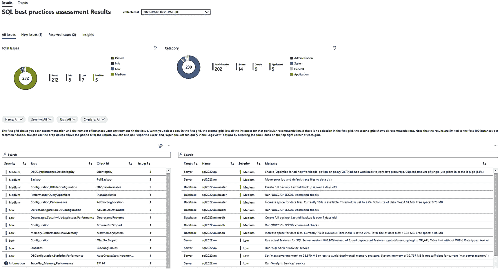
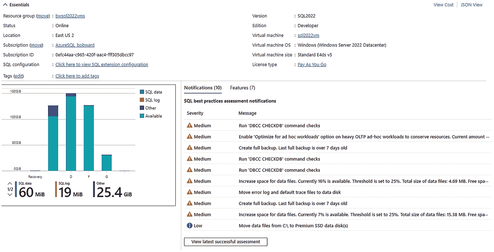

# SQL 最佳实践评估

在 Azure 虚拟机上注册 SQL Server 的一个显著优势，是能够以数字化形式获取 Microsoft 关于配置的最佳实践建议。

我们将其称为 **SQL best practices assessment**（SQL 最佳实践评估）。

要使用此功能，需要在部署后启用它。在 SQL 虚拟机门户中，从左侧菜单选择 **SQL best practices assessment**。

然后选择 **Enable SQL best practices assessment**。系统会要求勾选一个框以启用该功能，并选择一个 Log Analytics 工作区。Log Analytics 工作区是 Azure 的一项服务，用于托管指标和其他“日志”信息。我们已将最佳实践评估结果集成到 Log Analytics 中。您还有另一个选项来启用最佳实践的定期调度，以便我们定期扫描您的配置（而非您的数据）并持续更新建议。启用此功能后，可能需要几分钟时间，因为我们需要配置 IaaS 代理扩展和 Log Analytics。

启用此功能后，您可以等待计划运行，或选择 **Run Assessment**（或顶部菜单中的 **Run**）。

> **注意**
> 我们为评估收集的大部分信息来自 SQL 查询。您可以使用 SSMS 中的 XEvent Profiler，通过 XEvent 追踪评估正在进行的操作。查找 `client_app_name` 为 `Microsoft SQL Server IaaS Agent` 和 `Microsoft SQL Server IaaS Agent Query Service` 的事件。

一次评估可能需要一些时间，因为它会对您的虚拟机和 SQL Server 进行非常全面的检查。评估完成后，您可以选择最新的成功评估。在我的评估完成时，结果如图 10-10 所示。

*图 10-10：Azure 虚拟机上 SQL Server 的 SQL 最佳实践评估结果截图。下方是两个饼图，分别显示所有问题的总数和按类别分类的问题。底部是两个表格。*

您可以根据严重性和类型查看结果。您会发现各种各样的建议，包括与虚拟机配置相关的建议以及特定于 SQL Server 的建议。我们的一些建议是 Microsoft 和社区多年来一直在使用的*久经考验*的推荐做法。

我最喜欢的最佳实践评估功能之一是，只要至少运行过一次评估，顶级结果就会直接显示在 Azure 门户主页的 SQL 虚拟机上，如图 10-11 所示。

*图 10-11：SQL 最佳实践评估通知截图。下方是基本详细信息，其下是一个柱状图，右侧是 SQL 最佳实践评估的通知列表。*

请访问 [`https://docs.microsoft.com/azure/azure-sql/virtual-machines/windows/sql-assessment-for-sql-vm`](https://docs.microsoft.com/azure/azure-sql/virtual-machines/windows/sql-assessment-for-sql-vm) 获取 SQL 最佳实践评估的所有最新更新。

