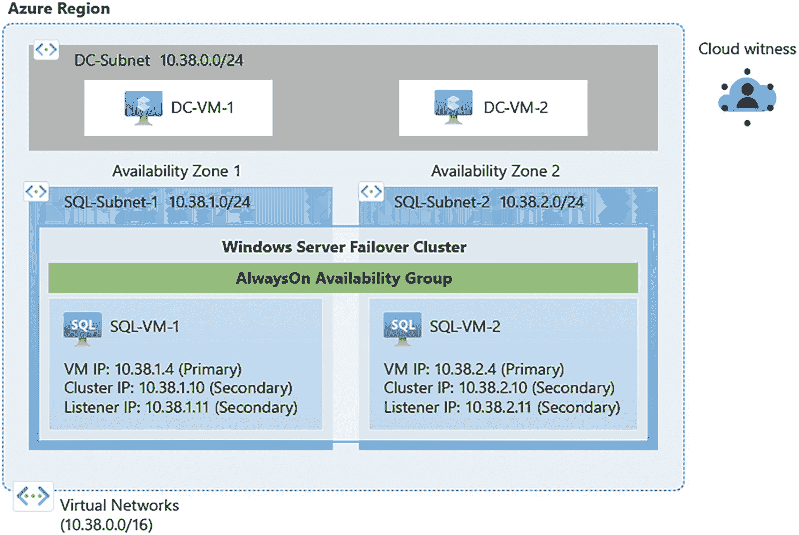
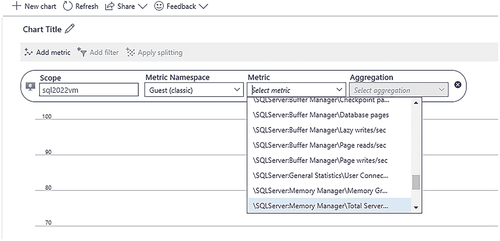
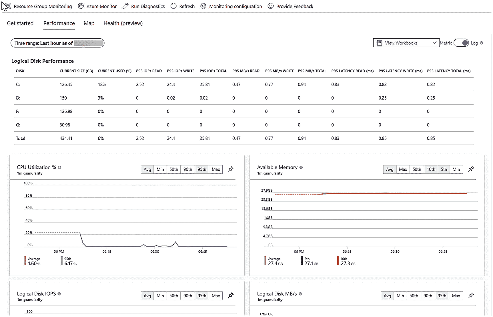

# 高可用性

在规划部署时，您可能需要确保为 Azure 虚拟机上的 SQL Server 构建高可用性解决方案。或者，您可能只想确保了解以后扩展高可用性的选项。

## Azure 的内置容错能力

您是否知道，仅通过在 Azure 虚拟机上安装 SQL Server，您就获得了 VM 级别的内置高可用性和容错能力？如果由于数据中心或维护问题需要移动您的虚拟机，我们会使用 **live migration**（实时迁移）的概念。但我们不仅仅是在问题发生时做出反应。我们还使用机器学习模型来帮助我们采取主动措施，让您的系统运行时间更长、更可预测。请阅读这篇精彩的博客文章，了解其在 Azure 中的幕后工作原理：[`https://azure.microsoft.com/blog/improving-azure-virtual-machine-resiliency-with-predictive-ml-and-live-migration`](https://azure.microsoft.com/blog/improving-azure-virtual-machine-resiliency-with-predictive-ml-and-live-migration/)。

我们还有一个非常强大的主机和基础设施维护系统，以确保您的高可用性。您可以在 [`https://docs.microsoft.com/azure/virtual-machines/maintenance-and-updates`](https://docs.microsoft.com/azure/virtual-machines/maintenance-and-updates) 阅读更多信息。

## 故障转移群集实例 (FCI)

故障转移群集实例 (FCI) 是 SQL Server 客户实现高可用性的一个非常受欢迎的选项。Azure 虚拟机支持使用 Windows Server 故障转移群集 (WSFC) 和 Linux 的 Pacemaker 来构建此类系统。

为了支持 FCI，您至少需要多个虚拟机作为 SQL Server 节点。这就是在部署虚拟机时考虑使用可用性选项的地方，例如 **Availability Sets**（可用性集），它确保您在 Azure 上部署的 VM 分布在多个隔离的硬件集群中。或者您可以选择 **Availability Zone**（可用性区域），它是每个 Azure 区域内物理上独立的、能够容忍本地故障的位置。可用性区域为您带来最佳的冗余性。

由于 FCI 需要在节点之间使用**共享存储**，您需要在 Azure 中使用以下选项之一：

*   **Azure shared disks**（Azure 共享磁盘）
    本质上，这与您在本章练习中为 Azure 虚拟机设置的托管磁盘相同，但您可以使其共享。

*   **Storage Spaces Direct (SSD) – 仅限 Windows**
    这是 Windows Server 本地环境中的一个流行选项。SSD 使用带有本地磁盘的虚拟存储区域网络 (SAN) 方法。

*   **Premium file shares**（高级文件共享）
    高级文件共享是 Azure 文件中的一项功能，本质上是一个共享文件系统。

在这三个选项中，高级文件共享支持最大的容量并且限制最少。

最后一个重要的概念是 **quorum**（仲裁），FCI 需要它来支持故障转移决策。就像本地环境一样，Azure 虚拟机支持使用 Azure 磁盘和文件共享的基于磁盘的 *witness*（见证人）来实现仲裁。但我推荐的一个独特选项是 **cloud witness**（云见证）。云见证易于设置并使用 Azure 存储。

要开始为 Azure 虚拟机上的 SQL Server 配置 FCI，请访问 [`https://docs.microsoft.com/azure/azure-sql/virtual-machines/windows/hadr-windows-server-failover-cluster-overview`](https://docs.microsoft.com/azure/azure-sql/virtual-machines/windows/hadr-windows-server-failover-cluster-overview)。

### Always On 可用性组

虽然故障转移群集实例（FCI）是 SQL Server 高可用性的热门选项，但 Always On 可用性组（AG）代表了一种更强大的解决方案，它使用本地存储和副本。其最大优势在于辅助服务器是可用的（可用于只读查询、备份等）。

Azure 虚拟机支持所有形式的 Always On 可用性组。请记住，在本书第 6 章中，我向您展示了如何在无群集的情况下设置 AG。我正是使用 Azure 虚拟机完成的。

但假设您想要自动故障转移功能。那么您将需要与 Azure 中的 FCI 类似的设置，但无需共享存储。对于使用 Windows Server 故障转移群集（WSFC）的 FCI 和 AG 设置，一个很好的新特性是能够使用子网，而不必配置负载均衡器。

图 10-12 展示了 Azure 中一个具有多个子网的 AG 的可能配置。

一个 AG 配置的示意图。顶部是 DC 子网，下方是 SQL-subnet-1 和 SQL-subnet-2。

**图 10-12** Azure 中具有多个子网的 AG 配置

要了解有关配置具有子网的 AG 的更多信息，请参阅[使用多个子网在 Azure 虚拟机上手动配置 Always On 可用性组先决条件教程](https://docs.microsoft.com/azure/azure-sql/virtual-machines/windows/availability-group-manually-configure-prerequisites-tutorial-multi-subnet)。

使用 Azure 虚拟机配置 AG 的一个好处是，一旦您的群集、网络和域设置完毕，SQL 部分的运维操作与本地部署是相同的。

如果您希望了解在 Linux 上设置 AG 的体验，我们与合作伙伴 Red Hat 共同构建了一份很棒的快速入门指南，您可以查看[在 RHEL 上为 SQL Server 虚拟机设置高可用性 Always On 可用性组](https://docs.microsoft.com/azure/azure-sql/virtual-machines/linux/rhel-high-availability-stonith-tutorial)。

我一直想要一个简单快速的方法来设置整个系统，以便我能够测试并查看一个完整的自动故障转移动作。我的同事 Taryn Pratt，她是负责 Azure 上 SQL Server 高可用性/灾难恢复（HA/DR）的高级项目经理，向我展示了这个 ARM 模板：[为 Azure SQL VM 端到端设置 Always On 可用性组](https://github.com/microsoft/tigertoolbox/tree/master/AzureSQLVM/e2e-ag-setup)。所以请试试看，并通过 GitHub 问题站点向 Taryn 提供反馈。我想向 Taryn 了解我们在 Azure 虚拟机上 SQL Server 的 HA 体验方面的未来计划。Taryn 说：“*Azure IaaS 上的 SQL Server 团队正在努力改善在 Azure VM 上运行的客户的 HA/DR 体验。我们的目标之一是增强门户功能，以便在使用 Always On 可用性组时提供从开始到结束的更好整体体验。这包括在 SQL Server 创建时增加部署多子网 Always On 可用性组的能力，以及扩展现有的故障排除工具以包含有关 AG 健康状况的更多详细信息。我们希望为客户提供一种在 Azure VM 上轻松创建和支持 SQL Server HA/DR 解决方案的方法。*”

## 灾难恢复

虽然设置 Always On 可用性组（AG）也可以提供灾难恢复选项，因为您的数据通过本地存储复制到另一个节点，但对于 Azure 虚拟机上的 SQL Server 灾难恢复还有其他考虑因素。

### 存储容错

我在本章前面已经讨论过在 Azure 存储上为数据库和日志文件选择存储方案。事实证明，Azure 存储帐户具有内置的冗余选项。这些选项包括本地冗余存储（LRS）、区域冗余存储（ZRS）和地域冗余存储（GRS）。由于 SQL Server 进行 I/O 的性质，我们仅支持使用 LRS 存储数据和日志文件。但即使使用 LRS，您的数据在数据中心内也已自动保存了多个最新的副本。

### 备份数据库选项

因为我们只支持使用 LRS 存储数据和日志文件，所以您需要制定一个备份策略，将备份存储与数据和日志存储分开，同时选择更冗余的选项，如 ZRS 或 GRS。

并且由于 SQL Server 引擎内置了备份到 `Azure 存储` 的功能，因此使用 Azure 实现稳健的备份策略并不困难。此外，如果您以完整模式注册 IaaS 代理扩展，则可以利用自动备份功能，该功能使用您选择的 Azure 存储帐户。这种方法的一个缺点是备份有 12TB 的限制（压缩可能对此有帮助）。

您确实可以选择配置一个新的 `Azure 托管磁盘`，以便简单地在虚拟机内备份到另一个驱动器或挂载的文件系统。虽然使用这种方法允许更大的备份大小（因为您使用的是 `BACKUP TO DISK`），但其缺点是虚拟机必须可用才能访问备份，而对于 Azure 存储，您可以随时访问备份。

使用 T-SQL 直接进行 Azure 备份的第三个选项是 `高级文件共享`。当您配置高级文件共享时，您将使用 `BACKUP TO DISK` 备份数据库，但存储独立于虚拟机，因此您可以轻松地将高级文件共享附加到另一台虚拟机。此外，高级文件共享支持高达 100TB。

还要记住，在本书第 6 章中，我们讨论了 SQL Server 2022 的新 `T-SQL 快照备份` 方法，这对于大型数据库非常有用，可以大大减少备份或恢复所需的时间。

请记住，由于您使用的是 SQL Server 引擎，您始终可以在两台 Azure 虚拟机上的 SQL Server 之间设置日志传送方案。日志传送仍然是 SQL Server 基本 HA/DR 的流行选项。

### 使用 Azure 备份

备份的另一个选项是 `Azure 备份` 服务。Azure 备份 for SQL VM 是一项集成服务，用于将自动备份计划到称为恢复服务保管库的单独 Azure 存储位置。Azure 备份对于希望使用集中服务来管理其备份（尤其是跨多台虚拟机）的用户来说是一个很好的解决方案。请通过快速入门指南[在 Azure 虚拟机上备份 SQL Server](https://docs.microsoft.com/azure/backup/tutorial-sql-backup) 开始使用 Azure 备份。

## 监控

如果您以前使用过 SQL Server，您可能有自己的流程集，使用内置的操作系统和 SQL Server 功能来监控 SQL Server，包括 Windows 的性能监视器、Linux 的 Grafana、动态管理视图（DMV）、查询存储和扩展事件。

由于您无法直接访问 Azure 虚拟机的主机计算机，因此了解如何在 Azure 之外监控 Azure 虚拟机上的 SQL Server 会很有趣。

### Azure Monitor

这时就需要 `Azure Monitor`，这是一个用于所有 Azure 服务的监控基础结构。对于 Azure 虚拟机，默认情况下，主要围绕性能的指标会被存储，并可在 Azure 门户中供您查看。您可以在虚拟机的主页上看到这一点。同样，您可以使用左侧菜单中的 `指标` 选项进一步深入查看。默认情况下，这些指标是从 *主机视角* 获取的关于虚拟机的数据。使用这些指标可能非常有帮助，尤其是为了了解更多关于存储性能的信息。还记得我在本章前面提到的虚拟机大小上限问题吗？主机的 Azure 指标是查看您的工作负载是否遇到此问题的一种方法。

### 虚拟机指标与日志

对于客户虚拟机本身的指标怎么办？如果您使用 Azure 虚拟机门户页面并在左侧菜单中选择 `诊断设置`，即可启用客户机指标和日志记录。

在这里，您可以启用客户机以及 SQL Server 的指标和日志信息。启用此功能后，您可以使用 Azure 虚拟机中的“指标”选项来查看操作系统和 SQL Server 的关键性能指标，如图 10-13 所示。

一张截图。在“图表标题”标题下，一个用于选择聚合方式的下拉菜单处于打开状态，并且已选中 1 个文件。

图 10-13

来自 Azure Monitor 的 SQL Server 指标

### Azure Insights

关于 Azure 虚拟机和监控，我特别喜爱的一个功能您可能还不知道，那就是 `Insights`。`Insights` 可从虚拟机门户页面的左侧菜单获取。您需要启用 `Insights`，但一旦启用，您就可以查看关于虚拟机的丰富指标，如图 10-14 所示。

一张截图。在“性能”选项卡下是一个用于逻辑磁盘的表格。表格下方是两个折线图，分别显示 CPU 利用率和可用内存。

图 10-14

虚拟机的 Azure Insights

这就像拥有一个性能监视器的多窗口视图，并且它能自动处理历史数据，因此您可以结合警报功能来查看随时间推移的趋势。

## Azure 是 SQL Server 的最佳云平台

我相信 Azure 是 SQL Server 的最佳云平台，尤其是在 Azure 虚拟机上使用时。请考虑以下几点：

*   在云服务中最快上市获得最新版 SQL Server 的唯一途径是通过 Azure。
*   Azure 在全球范围内提供的区域和数据中心选项比其他任何供应商都多。
*   通过我们的 SQL Server IaaS 代理扩展及其所支持的功能，Microsoft 拥有比其他任何云供应商都更具创新性的虚拟机与 SQL Server 集成方案。
*   我们构建了 SQL Server 产品，因此我们比任何人都更了解如何优化虚拟机上 SQL Server 的性能、安全性和可用性。
*   使用您现有的 SQL Server 许可证，并通过 Azure 混合权益在 Azure 上降低成本。
*   我相信实际证据能证明 Azure 是 SQL Server 的最佳云平台。GigaOm 最近进行了一项基准研究，比较了 Azure 虚拟机与 AWS EC2 上 SQL Server 的价格和性能。结果不言自明，请参见 [`https://research.gigaom.com/report/sql-transaction-processing-and-analytic-performance-price-performance-testing`](https://research.gigaom.com/report/sql-transaction-processing-and-analytic-performance-price-performance-testing)。

我们正在不断改进 Azure 虚拟机上的 SQL Server 体验。请通过 [`https://aka.ms/azuresqlvm`](https://aka.ms/azuresqlvm) 获取所有最新信息。

Pam Lahoud 负责我们 Azure 虚拟机上的 SQL Server 团队。Pam 在社区和 Microsoft 内都是著名的 SQL Server 专家。她向我总结了在 Azure 上运行 SQL Server 的价值：

*没有人比 Microsoft 更了解 SQL Server，因此我们自然知道如何最佳地运行它。除了确保我们的客户拥有必要的基础架构选项，以便在 Azure VM 上部署他们最苛刻的 SQL Server 工作负载外，我们还提供了一套免费工具，帮助您正确配置 SQL Server 并保持其健康运行。再加上行业领先的价格性能以及仅 Microsoft 提供的功能（如 Azure 混合权益），您就能轻易明白为何 SQL Server 在 Azure 上运行得更好。*

