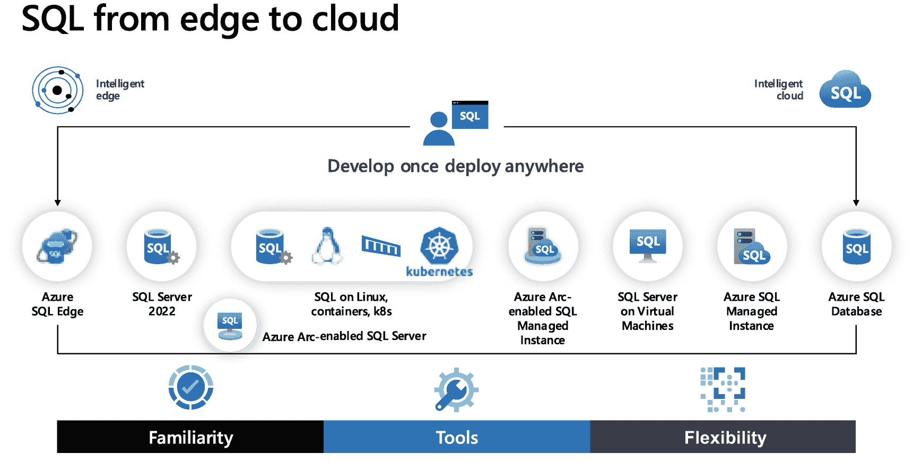
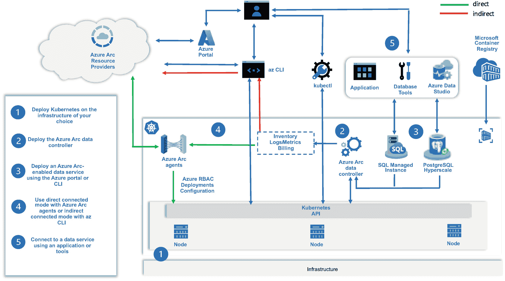

# 11. 从边缘到云的 SQL

当我于 1993 年加入 Microsoft 时，我们刚刚在 Windows NT（Windows Server 的前身）上发布了 SQL Server 4.2。此前我们仅在 OS/2 系统上提供 SQL Server，并且我们的代码仍然基于最初的 Sybase 服务器。那是中小型服务器的时代，我们作为一个产品正在努力寻找在行业中的定位。

快进到过去 5 年，SQL Server 在许多方面都进行了创新，其“各种版本”可能多得让人难以跟上。因此，我认为本书的完美收尾方式，是专门用一章来介绍 SQL 从*边缘到云*的所有部署方式。我将讨论所有选项，并说明为何您可能会为您的工作负载考虑其中每一个。

## 一次开发，随处部署

图 11-1 是查看所有 SQL 选项的一个绝佳方式。



一幅插图，分别展示了左侧和右侧的 SQL 从边缘到云。顶部的 SQL 列出了 7 个 SQL 选项，底部则列出了熟悉度、工具和灵活性选项。

图 11-1

从边缘到云的 SQL

在我整个职业生涯和人生中，我可能从未想过 SQL 作为一种技术能够以如此多的不同方式存在。现在，SQL 可以部署在从小型 IoT 设备到世界上最大的服务器，再到公共云的一切环境中。我使用*一次开发，随处部署*这个术语，是因为构建一个针对 SQL 的应用程序并将其部署到所有这些选项上而无需更改代码，是完全可能的。

对于我今天交谈的许多客户来说，这些选项并非*并且*的关系，而是*或者*的关系。换句话说，许多客户可能需要根据其业务需求，将 SQL 部署到许多这些目的地中。但所有这些选择提出了一个大问题：怎么可能学会所有这些选项呢？

好消息不仅仅是 SQL 从边缘到云所提供的*灵活性*。还包括它们之间共有的*熟悉度*。请考虑以下几点：

*   相同的语言和提供程序，如 `.Net` 和 `Java`，在所有选项中均可工作。
*   相同的 `T-SQL` 语言在所有这些选项中都得到支持。根据特定选项的需求可能会有一些差异，但相同的基本 `T-SQL` 就是能工作。
*   所有这些选项都使用相同的核心数据库引擎代码。这是许多客户觉得难以置信的一个声明。我们拥有一个从边缘到云的 SQL Server 引擎通用代码库。我们可能只在某些选项中启用某些功能。我们可能构建新功能并且只首先在其中一些选项中发布。但核心代码是相同的。
*   我们的通用工具，如 SQL Server Management Studio (`SSMS`)、Azure Data Studio (`ADS`)、`sqlcmd` 等，在所有这些选项中均可工作。其中一个关键是表格数据流 (`TDS`) 协议。`TDS` 在所有这些选项中都得到支持，因为它在从边缘到云的所有环境中拥有相同的核心引擎。

因此，是灵活性与熟悉度的结合。这是一个绝佳的组合，让您能选择最适合您的选项。让我们在本章剩余部分深入了解每个选项。对于每个选项，我都包含了*何时使用...*的摘要，这样当某个选项符合您的要求时，您就能理解我的建议。我在本章最后列出了启用 Azure Arc 的 SQL 托管实例，因为在与其他 SQL 选项进行比较后，更容易理解此选项。

注意

我见过不同的人以多种方式使用*边缘*一词。就本章而言，*边缘*指的是在任何非 Azure 云的选项中运行的 SQL。您会发现有趣的是，现在所有选项都能将运行在边缘的 SQL 连接到云。这些世界正在融合。

## Azure SQL Edge

物联网设备遍布我们生活的每个角落，其存在方式或许超乎你的想象。几年前，我们启动了一个项目，旨在将数据库处理能力*下沉*到物联网设备本身。我们找到了一种巧妙的方法，将 SQL Server 引擎的占用空间缩减到仅几百兆字节，使其能够部署在最小的物联网设备上。这样，核心引擎便可通过 SQL Linux 容器在设备上处理数据。

即使是如此小巧的设备，也能运行列存储索引等核心引擎的基础功能。部分引擎功能（如内存中 OLTP）暂不支持，但开发者所需的大部分核心引擎功能均可使用。你可以在[`https://docs.microsoft.com/azure/azure-sql-edge/features`](https://docs.microsoft.com/azure/azure-sql-edge/features)查看所有支持的功能。

我们深知遥测数据处理的重要性。因此，我们加入了特定功能以助力流数据、处理时序数据以及通过机器学习进行数据分析。

对于流处理，我们整合了流行的 Kafka 流引擎，并提供了基于与 Azure 流分析相同概念的 T-SQL 流处理支持。你可以在[`https://docs.microsoft.com/azure/azure-sql-edge/stream-data`](https://docs.microsoft.com/azure/azure-sql-edge/stream-data)了解更多关于 Azure SQL Edge 流处理的信息。

对于时序数据，我们加入了包括`DATE_BUCKET()`、`FIRST_VALUE()`和`LAST_VALUE()`在内的 T-SQL 函数。使用这些函数的原因之一是为了帮助填补数据中的时间间隔。你在第 8 章中已经了解到，这些 T-SQL 函数现在也存在于 SQL Server 2022 中。

客户和开发者对 Azure SQL Edge 最兴奋的场景之一是，你可以训练机器学习模型，然后直接通过 SQL Server 在物联网设备上执行。Azure SQL Edge 支持 T-SQL 的`PREDICT`函数，允许开发者执行原生的 ONYX 模型。

至此，Azure SQL Edge 的场景就完整了。你不再需要将原始遥测数据流传到 Azure 甚至边缘中心，而是可以将*数据处理下推*到设备本身。

Azure SQL Edge 还附带数据保留功能，并支持通过 Azure 数据工厂或 SQL 数据同步进行数据同步。

尽管 Azure SQL Edge 由包含 SQL Server Linux 引擎的容器组成，但该产品在 Azure 上的定价是按设备计费的。你可以在[`https://aka.ms/azuresqledge`](https://aka.ms/azuresqledge)获取 Azure SQL Edge 的所有最新信息。

### 何时使用 Azure SQL Edge

Azure SQL Edge 针对物联网设备部署有非常特定的用例。其小巧的占用空间和独特功能专为物联网设备场景而打造。

## SQL Server

整本书都在讲述 SQL Server，但重点是 SQL Server 2022 的新特性。SQL Server 是一款授权产品，运行在 Windows 和 Linux 操作系统上。SQL Server 也被称为“盒装产品”，因为过去我们是以盒装形式交付产品的，盒内包含文档（是的，精装书）和软件。

SQL Server 包含数据库引擎以及*围绕*引擎的功能，如复制、Polybase、SQL Server 代理和机器学习服务。SQL Server 授权产品还包括服务，如 SQL Server 集成服务、SQL Server 分析服务和 SQL Server 报表服务。

SQL Server 可通过许可协议购买，或直接按实例使用每核许可模型购买。用户会选择版本以决定其愿意支付的 SQL Server 功能。你可以选择免费的 SQL Server 版本，包括评估版、开发者版或速归版。性价比最佳的是标准版，它具备完整产品的功能范围，但有资源限制且不支持所有功能。最后，企业版是所有版本中价格最高的，但拥有所有功能且资源使用不受限。

SQL Server 由微软公司生产，并通过诸如 SQL Server 2022 这样的主要版本发布。微软不承诺主要版本发布的确切时间，但自 2016 年以来的模式是每几年发布一次。每个主要版本会通过累积更新或称为一般分发发布的安全更新进行定期更新。

SQL Server 是一个完整的数据平台，如今是世界上最受欢迎的数据库产品之一。你可以在笔记本电脑、台式机、服务器以及私有和公共云中的虚拟机上部署 SQL Server。客户使用 SQL Server 部署的数据库规模从几兆字节到几拍字节不等。

尽管 SQL Server 能解决众多数据问题，但部署和管理它的责任在你身上。例如，SQL Server 附带一个强大的高可用性解决方案，称为 Always On 可用性组（你在本书中读到了新的包含可用性组）。但设置、配置和维护它的责任在于你。SQL Server 附带智能引擎以助你尽力而为，但完整的 SQL Server 产品由你管理。

我们学习关于 SQL Server 一切知识的主页面是[`https://aka.ms/sqlserver`](https://aka.ms/sqlserver)。

### 何时使用 SQL Server

如果你需要完全控制 SQL Server 部署和管理的所有方面，SQL Server 是你的最佳选择。你希望拥有产品附带的所有功能，并希望将其灵活部署到任何类型的机器或虚拟机上。如果你还想完全控制配置方面，例如文件的物理放置，你也会选择 SQL Server。

选择 SQL Server 的另一个原因是应用程序的版本要求。假设你的公司使用的一个应用程序仅在特定版本的 SQL Server 上受支持。那么 SQL Server 将是你唯一的选择，因为诸如 Azure SQL 托管实例、Azure SQL 数据库和启用 Azure Arc 的 SQL 托管实例等选项是*无版本*的。

注意

过去几年，我们一直在努力说服开发人员和客户基于数据库兼容级别而非主要版本来提供支持。你可以在[`https://aka.ms/dbcompat`](https://aka.ms/dbcompat)了解更多。

选择 SQL Server 的另一个原因是引擎外支持的服务集，如 SSIS、SSAS 和 SSRS。请注意，只有 Windows 上的 SQL Server 才支持 SSAS 和 SSRS。

### 启用 Azure Arc 的 SQL Server

除了部署 SQL Server，你还可以使用的一个选项是通过 Azure Arc 将你的实例连接到 Azure。你在本书第 3 章中看到了使用 SQL Server 2022 完成此操作的过程。利用此功能，你可以在 Azure 门户中查看 SQL Server 信息，使用 Microsoft Defender 保护你的 SQL Server，并执行 SQL 评估。你在第 3 章中看到，对于 SQL Server 2022，你还可以配置 Azure Active Directory，从而使你能够使用 Microsoft Purview 进行策略管理。

你可以在 Windows 和 Linux 的启用 Azure Arc 的服务器上设置 SQL Server 2012 及更高版本。请访问[`https://docs.microsoft.com/sql/sql-server/azure-arc/overview`](https://docs.microsoft.com/sql/sql-server/azure-arc/overview)开始使用启用 Azure Arc 的 SQL Server。

## Linux、容器和 Kubernetes

你在第 9 章中详细阅读了如何在 Linux、容器上以及 Kubernetes 集群中部署和使用 SQL Server。

以下是当这些选项可能最适合你需求时的总结。


### 何时在 Linux 上使用 SQL Server

SQL Server on Linux 是一个完整的“盒装产品”，支持 Red Hat Enterprise Linux (RHEL)、Ubuntu 和 SUSE Linux Enterprise Server 等 Linux 发行版。SQL Server on Linux 支持所有版本，并通过一组特定于 Linux 发行版的可下载软件包进行部署。

SQL Server 的某些功能在 Linux 上不受支持，包括 `SSAS` 和 `SSRS` 等服务。SQL Server 2022 在 Linux 上不受支持的功能列表可以在 [`https://docs.microsoft.com/sql/linux/sql-server-linux-editions-and-components-2022#unsupported-features-and-services`](https://docs.microsoft.com/sql/linux/sql-server-linux-editions-and-components-2022#unsupported-features-and-services) 找到。

关于 SQL Server on Linux 的一个误解是它不支持像 `高可用性组` 这样的高可用性功能。远非如此。你在本书的第 6 章中看到了无集群 AG 的使用，它早在 2017 年就为 Linux 构建了。但 SQL Server on Linux 也可以使用像 `Pacemaker` 这样的软件来支持自动故障转移功能。

当你拥有与 SQL Server on Windows 相同的情况（例如版本支持或需要完全控制），但你希望在 Linux 操作系统而非 Windows 上运行 SQL Server 时，你应该选择 SQL Server on Linux。别忘了，SQL on Windows 和 Linux 之间的数据库是完全兼容的（只需在它们之间进行备份和还原即可）。

### 何时使用 SQL Server 容器

正如你在第 9 章中所学，SQL Server 容器是预安装的 SQL Server Linux 软件包的预打包镜像。因此，你决定使用 SQL 容器的第一个依据是 SQL Server Linux 的功能集是否满足你的要求。

你决定使用 SQL Server 容器的第二个理由是你有使用容器的理由。请记住，容器不会取代虚拟机；它们是对虚拟机的补充。例如，在 Linux 上运行多个 SQL Server 实例的唯一方法，就是在虚拟机中使用多个容器。关于容器的一个误解是它们运行速度不如直接在虚拟机或裸机服务器上安装的 SQL Server on Linux 实例快。这根本不是事实。容器只是以隔离方式运行的进程，因此它们可以完全直接访问 Linux 操作系统。容器确实需要一个容器运行时，例如 `Docker`。对你来说需要考虑的一点是，`Docker` 已宣布对其定价和许可做出一些更改，你可以在 [`www.docker.com/pricing`](http://www.docker.com/pricing) 阅读相关信息。

注意
SQL Server 容器镜像是 `OCI` 兼容的，因此也支持其他容器运行时，如 `podman`。你可以在 [`https://docs.podman.io/en/latest`](https://docs.podman.io/en/latest) 了解有关 `podman` 的更多信息。

容器的另一个考虑因素是打补丁。容器从不更新。要为 SQL Server 应用累积更新（CU），你只需“切换”到运行新累积更新版本的新容器。你甚至可以通过这种切换操作安全地回滚 CU。

一个对容器非常有吸引力的最终场景是开发人员和 DevOps。由于容器在任何像 `Docker` 这样的容器运行时能够运行的地方都得到支持，SQL Server 容器可以在 Windows、Linux 和 MacOS 系统上使用。此外，SQL Server 容器的默认版本是开发者版。因此，作为开发人员，你可以在任何操作系统上免费为 SQL Server 构建应用程序，并确保它是同一个 SQL Server 引擎。这怎么可能？那是因为像 `Docker` 这样的容器运行时在非 Linux 系统上是兼容的。对于 Windows，`Docker` 可以使用带有 Linux 的虚拟机或 Windows Subsystem for Linux。对于 MacOS，`Docker` 使用轻量级虚拟化解决方案。在所有情况下，它看起来就像是 Linux，因此 SQL Server 容器运行方式相同。

注意
即使 SQL Server 容器在所有这些平台上运行方式相同，但对在“裸机” Linux 上原生运行的 SQL Server 容器与在虚拟化解决方案中运行的容器进行性能比较是不公平的。

这里要传达的信息是，对于像 MacOS 这样的平台上的开发人员，你有一种解决方案可以在不安装任何 Windows 软件的情况下为 SQL Server 构建应用程序。更多详细信息请查看我的博文 [`https://aka.ms/sqlmacchallenge`](https://aka.ms/sqlmacchallenge)。

SQL Server 容器也用于驱动 `Azure SQL Database` 的新本地开发人员体验（更多信息请阅读 [`https://docs.microsoft.com/azure/azure-sql/database/local-dev-experience-set-up-dev-environment?view=azuresql&tabs=vscode`](https://docs.microsoft.com/azure/azure-sql/database/local-dev-experience-set-up-dev-environment?view=azuresql&tabs=vscode)）。此外，SQL Server 容器可以是 DevOps 场景的一个绝佳解决方案。在 Microsoft Build 2020 上查看我关于此功能的演示：[`https://docs.microsoft.com/en-us/events/build-2020/int128`](https://docs.microsoft.com/en-us/events/build-2020/int128)。

### 何时在 Kubernetes 上使用 SQL Server

Kubernetes (`k8s`) 是一个执行和编排容器化应用程序的软件平台。其理念是，如果你想使用容器大规模运行一个完整的软件系统，你应该考虑运行 Kubernetes ([`https://kubernetes.io`](https://kubernetes.io))。Kubernetes 提供了构建在 Linux 操作系统之上的丰富的网络和存储功能。它包括内置的高可用性和抽象连接功能，如负载均衡器。

注意
如果你想用一种快速有趣的方式学习 `k8s`，你会喜欢这个视频：[`https://youtu.be/4ht22ReBjno`](https://youtu.be/4ht22ReBjno)。

因此，如果你想在虚拟机或裸机 Linux 上运行 SQL Server 容器，这对于生产解决方案来说完全没问题。但如果你想运行许多 SQL Server 容器和其他容器化应用程序并实现规模化，你应该考虑 Kubernetes。

Kubernetes 至今已存在十多年，有很多关于大大小小的公司如何使用 Kubernetes 的案例研究 ([`https://kubernetes.io/case-studies`](https://kubernetes.io/case-studies))。Kubernetes 可以从开源免费运行，但你必须管理整个解决方案。Kubernetes 也提供托管解决方案，如 Azure Stack HCI 上的 `Azure Kubernetes Service (AKS)`、`RedHat OpenShift` 和 `Rancher`。Kubernetes 在公共云中也非常流行，如 `Azure Kubernetes Service (AKS)`、`Google Kubernetes Engine (GKE)` 和 `Amazon Elastic Kubernetes Service (EKS)`。

由于 SQL Server 支持容器，它自动支持在 Kubernetes 平台上运行。如果你需要内置的高可用性（想象一下不需要 Windows 故障转移集群的 HA）、负载均衡（想象一下监听器）以及一个可以大规模部署许多 SQL Server 容器的系统，那么 Kubernetes 可能就是你的解决方案。Kubernetes 中的执行对象是 `pod`，它可以是一个或多个容器的组合。

我想说的是，对于我遇到的许多客户来说，Kubernetes 的学习曲线通常是阻碍他们采用这种解决方案的障碍。尽管许多 `k8s` 提供商提供“托管 Kubernetes”产品或服务，但为了正确使用 Kubernetes 上的 SQL Server，仍然有一些概念你必须理解。

你可以在 [`https://aka.ms/sqlk8s`](https://aka.ms/sqlk8s) 开始使用 Kubernetes 上的 SQL Server。

```
if (condVar > someVal) {console.log("xxx")}
```


## Azure 虚拟机上的 SQL Server

Azure 虚拟机上的 SQL Server 是 `Azure SQL` 家族在 Azure 中的服务之一。Azure 虚拟机也被称为基础设施即服务 (`IaaS`)。你在本书的第 10 章中学习了在 Azure 虚拟机上运行 `SQL Server 2022` 的所有细节。在该章节中，你了解了如何在 Azure 虚拟机生态系统中部署、使用和管理 `SQL Server 2022`。你了解到了关于此选项最有价值的信息之一。`它就是 SQL Server`。它是在 Windows 或 Linux 操作系统上运行的完整 SQL Server "盒装产品"，由你管理虚拟机 `内部` 的一切。微软管理虚拟机外部的一切，但同时为完整的托管虚拟机体验提供必要的资源（大小选择、网络、存储、内置虚拟机 `HA` 等）。

因为微软管理着基础设施，所以我们为你提供了称为虚拟机大小的选项。可以把这想象成一份大型的晚餐菜单，列出了你需要的 CPU 速度以及 CPU 数量、内存和存储。你可以在 [`https://aka.ms/azurevmsizes`](https://aka.ms/azurevmsizes) 找到所有大小选择。

请通过 [`https://aka.ms/azuresqlvm`](https://aka.ms/azuresqlvm) 开始使用 Azure 虚拟机上的 SQL Server。

### 何时使用 Azure 虚拟机上的 SQL Server

如果你需要选择完整的 SQL Server 产品，因为你需要 `SSAS` 或 `SSRS` 等所有功能和服务，或者你的应用程序需要特定版本的 SQL Server，但你又不想管理虚拟机的硬件和主机，那么 Azure 虚拟机上的 SQL Server 可能适合你。

正如你在第 10 章所看到的，我们确实提供了一些服务来帮助你获得 Azure 虚拟机体验，包括通过市场轻松部署，以及 `SQL Server IaaS 代理扩展` 来协助备份、安全更新、最佳实践评估、`Microsoft Defender` 以及“SQL”Azure 门户体验。

另外，如果你担心无法通过故障转移集群或 `Always On 可用性组` 构建完整的 `HA` 解决方案，这在 Azure 虚拟机环境中都是可以实现的。

与 SQL Server 的一个巨大区别在于，你使用 `云计费` 方式为 Azure 虚拟机上的 SQL Server 付费。这意味着你使用 Azure 订阅按月支付 SQL Server 和虚拟机的使用费用。如果你习惯于 SQL Server 的许可和定价，起初这可能会让你感觉非常不同。但我们提供了一些选项来帮助你。首先，你可以使用一个称为 `Azure 混合权益` ([`https://aka.ms/azurehybridbenefit`](https://aka.ms/azurehybridbenefit)) 的概念来应用你现有的 SQL Server 许可证。此外，你可以注册一份合同，在更长的时间段内使用虚拟机，并获得称为 `Azure 预留虚拟机实例` 的折扣。另外，如果 Azure 虚拟机已停止（取消分配），那么在它重新启动之前，你无需支付任何计算费用。这对于开发和测试目的来说是一个非常不错的选择。

许多客户选择此选项来迁移本地 SQL Server 部署，因为它可以提供最快、最简单的 `直接迁移` 体验。鉴于它是完整的 SQL Server 产品，应该不会有任何应用程序兼容性问题，因为你只是改变了现有 SQL Server 的托管位置。

另外需要考虑的一点是：一旦你在 Azure 虚拟机上部署了 SQL Server，我们为你提供了未来在线迁移到 Azure SQL 托管实例的选项。因此，Azure 虚拟机可以成为你迈向完整托管体验的垫脚石。

请通过 [`https://docs.microsoft.com/azure/azure-sql/virtual-machines/windows/migrate-to-vm-from-sql-server`](https://docs.microsoft.com/azure/azure-sql/virtual-machines/windows/migrate-to-vm-from-sql-server) 开始迁移到 Azure 虚拟机。

## Azure SQL 托管实例

假设你需要完整的 SQL Server 引擎，包含数据库和实例功能，如 `SQL Server 代理`、`复制`、`资源调控器` 和 `DTC`。但是，你并不局限于某个特定的 SQL Server 版本。事实上，你很乐意不再需要担心打补丁，比如应用累积更新。这不仅仅是打补丁的问题。你希望有一个 `无版本` 的 SQL 选项，这样我们就可以比 SQL Server 更频繁地为你提供新功能。而且你真的不关心托管 SQL Server 的虚拟机或操作系统是什么样子。你希望对核心数、内存、存储，甚至 `I/O` 延迟和吞吐量有选择权，但不想管理虚拟机，甚至不想担心文件的物理放置位置。

这些听起来都很有趣。让我们让它变得更好。假设你很乐意拥有一个能自动执行备份，甚至能在你需要进行时间点恢复时随时保留这些备份的系统。然后，如果系统能提供内置的高可用性，包括 `Always On 可用性组`，那就更好了。哦，我还希望这个 `自动高可用性` 附带一个退款保证。

欢迎来到 Azure SQL 托管实例。Azure SQL 托管实例是 `平台即服务` (`PaaS`) 的一个例子，也是 Azure SQL 家族中的第二个选项。我记得有一次我告诉 Anna Hoffman 我会如何总结 Azure SQL 托管实例：“它是 SQL Server 与云的最佳结合体。”它确实是一个 `托管 SQL Server`。Azure SQL 托管实例是我上一本书 `Azure SQL Revealed` 的重要组成部分。在书中，我在非常详细的层面对比了 SQL Server 与 Azure SQL 托管实例。想象一下，你需要的几乎所有核心 SQL Server 功能都包含在一个托管 SQL Server 中。

当你从 `SSMS` 连接到 Azure SQL 托管实例时，它看起来就像一个完整的 SQL Server！你会注意到一个很大的不同是 `Always On 可用性组` 选项不见了。那是因为如果你为 Azure SQL 托管实例选择 `业务关键` 服务层，我们会在幕后创建一个 `Always On 可用性组`，包括一个免费的只读副本。然后我们为你维护它。Azure SQL 托管实例构建在 Azure 生态系统中，并使用服务结构来支持 `HA` 决策。`通用目的` 服务层的行为类似于 `故障转移集群实例`，而无需设置 Windows 故障转移集群。你甚至可以使用 `自动故障转移组` 跨区域连接两个实例。此外，当你部署 Azure SQL 托管实例时，我们提供了一个可用性的 `服务级别协议` (`SLA`)，你可以在 [`https://azure.microsoft.com/support/legal/sla/azure-sql-sql-managed-instance/v1_0`](https://azure.microsoft.com/support/legal/sla/azure-sql-sql-managed-instance/v1_0) 阅读。

我们的迁移工具支持从 SQL Server 迁移到 Azure SQL 托管实例。你可以在 [`https://docs.microsoft.com/azure/azure-sql/migration-guides/managed-instance/sql-server-to-managed-instance-guide`](https://docs.microsoft.com/azure/azure-sql/migration-guides/managed-instance/sql-server-to-managed-instance-guide) 阅读迁移指南。

请通过 [`https://aka.ms/azuresqlmi`](https://aka.ms/azuresqlmi) 立即开始使用 Azure SQL 托管实例。


### 何时使用 Azure SQL 托管实例

与 Azure 虚拟机类似，`Azure SQL 托管实例` 面向 `SQL Server` 用户，他们希望由 Microsoft 来管理 `SQL Server` 计算背后的基础设施和主机。`Azure SQL 托管实例` 更进一步，管理支持 `SQL Server` 的虚拟机环境。

结合版本无关引擎、自动高可用性、自动备份以及 Microsoft 支持的 `SLA`，作为托管 `SQL Server` 的 `Azure SQL 托管实例` 对于当今许多使用 `SQL Server` 的客户来说，可能是一个非常不错的选择。请记住，在第 3 章中，我们介绍了将 `Azure SQL 托管实例` 作为灾难恢复系统一部分的概念。这可能是您开始使用 `Azure SQL 托管实例` 的途径。

与 `Azure 虚拟机` 一样，您使用 `Azure` 订阅进行计费，但也有 `Azure 混合权益` 和预留容量选项来节省成本。

是否存在与 `SQL Server` 的差异，可能使我无法选择 `Azure SQL 托管实例`？答案是肯定的，但不像您想象的那么多：

*   `Azure SQL 托管实例` 包含数据库引擎以及其他功能，如复制、`Polybase` 和 `DTC`。如果您需要 `SSAS` 或 `SSRS` 等服务，`Azure SQL 托管实例` 将不是您的选择。请注意，`SSIS` 包兼容 `Azure SQL 托管实例`。

*   虽然 `Azure SQL 托管实例` 提供了大多数核心数据库引擎功能，但存在一些差异，详见 [`https://aka.ms/azuretsqldiff`](https://aka.ms/azuretsqldiff)。

*   需要考虑一些资源限制。目前 `Azure SQL 托管实例` 的最大存储为 `16TB`（这是实例所有数据库的总和）。`80 vCores` 是我们目前支持的最大 `CPU` 数，根据我们目前最先进的选项，您拥有的最大内存量约为 `~870Gb`。我们正在不断提高此限制，请通过 [`https://docs.microsoft.com/azure/azure-sql/managed-instance/resource-limits`](https://docs.microsoft.com/azure/azure-sql/managed-instance/resource-limits) 关注我们的更新。

### Azure SQL 数据库

`Azure SQL` 产品系列中的最后一项服务是 `Azure SQL 数据库`。`Azure SQL 数据库` 是 `SQL` 在云端的起点。从一开始，我们就想创建一个概念，让开发者可以专注于数据库本身，而不必担心基础设施、虚拟机、`OS` 甚至 `SQL Server` 实际。实际上，我们早期在 `SQL Server` 中作为包含数据库实现了这项工作。我也在《Azure SQL 内幕》一书中详细介绍了 `Azure SQL 数据库`。

我相信 `Azure SQL 数据库` 今天已经实现了其所有初始目标，但仍有更进一步的空间。`Azure SQL 数据库` 代表了 `Azure SQL` 产品系列中最`托管的服务`。它是 `Azure SQL` 的最高级别 `PaaS`。它具备 `Azure SQL 托管实例` 的所有托管功能，如版本无关、自动备份、内置 `HA` 等。它更进一步采用了托管概念，因为您无需关心 `SQL Server` 实际。

注意

我们确实会让人困惑，因为 `Azure SQL 数据库` 具有`逻辑服务器`的概念，它实际上是一组元数据，支持多个数据库以及有关数据库的连接/安全信息。但它不是一个物理的 `SQL Server` 实例。

与 `Azure SQL 托管实例` 不同，部署 `Azure SQL 数据库` 时有两个有趣的选择，称为`无服务器`和`超大规模`。

部署 `Azure SQL 数据库` 时，您通常像为托管实例一样为数据库选择 `vCores` 数量。`无服务器` 允许您选择一个 `vCores` 的 `范围`，以便我们可以自动扩展或缩减您的工作负载。这也开启了仅为使用的 `vCores` 支付 `无服务器` 费用的能力。此外，`无服务器` 具有暂停/恢复功能。因此，如果您不使用数据库，我们将暂停计算，在此期间您无需支付任何 `vCore` 使用费用。当您再次连接时，我们会“恢复”您的数据库，正常的计费将继续。对于任何使用 `Azure SQL 数据库` 的新开发者来说，这可能是一个非常吸引人的选择。

`超大规模` 正如其名而构建——为您提供无限的数据库资源、计算、内存和存储。事实上，`超大规模` 目前可以在 `Azure` 中支持 `100TB` 的数据库。它是我们在云端拥有的最大的数据库选项。`超大规模` 还提供`自动`存储。您无需选择最大存储选项。您只需创建一个数据库，我们会根据您的需要不断扩展其增长。您确实需要为 `超大规模` 选择 `vCores`，这决定了您的内存限制。但 `超大规模` 使用分布式、分层的架构和分页系统（这是我们在 `100TB` 级别仍能提供速度的原因之一），因此在性能方面，这些限制并不那么重要。此外，您的应用程序可以随 `超大规模` 扩展的方式之一是使用副本，包括最多 `30` 个用于读取扩展的命名副本。此架构不使用 `Always On 可用性组`，而是使用基于日志的变更方法来实现大规模下的相同概念，并具有内置的高可用性。

想象一下这些数据库选项。如果我们把 `无服务器` 和 `超大规模` 结合在一起会怎样！（敬请关注；它可能比您想象的来得更快。）

虽然 `Azure SQL 数据库` 为您提供了核心引擎能力，但它也确实限制了您，因为您无法访问实例级别的功能。因此，`SQL Server Agent` 作业、复制（尽管 `Azure SQL 数据库` 可以作为订阅者）、资源调控器和 `DTC` 等功能在 `Azure SQL 数据库` 中不受支持。这些功能保留用于需要完整 `SQL Server` 实例的场景。

好消息是，`Azure SQL 数据库` 包含了您在本书中读到的关于 `SQL Server 2022` 的大部分创新功能，包括 `Synapse Link`、`Microsoft Purview` 策略、`Azure Active Directory (AAD)`、`Microsoft Defender`、内置查询智能、`Ledger` 等。

最近，我们一直在为 `Azure SQL 数据库` 的开发者进行投资，包括本地开发者体验（使用容器）、`Azure SQL` 函数绑定、新的改进的 `JSON` 支持以及内置引擎的 `REST API` 集成。您可以在 [`https://docs.microsoft.com/events/build-2022/brk20-modernize-your-applications-with-new-innovations-across-sql-server-2022-azure-sql`](https://docs.microsoft.com/events/build-2022/brk20-modernize-your-applications-with-new-innovations-across-sql-server-2022-azure-sql) 了解更多关于这些激动人心的开发者新功能。

立即通过 [`https://aka.ms/azuresqldb`](https://aka.ms/azuresqldb) 开始使用 `Azure SQL 数据库`。


### 何时使用 Azure SQL 数据库

鉴于 Azure SQL 数据库专注于“纯粹是一个数据库”的理念，我认为此选项最适合构建新应用程序的开发人员，尤其是那些设计为在 `Azure` 中运行的应用程序。事实上，`Azure SQL 数据库` 背后团队的重点是将其打造为面向需要数据的应用程序所能提供的最佳开发者体验。

不要被“开发者”这个词所误导。虽然我们希望开发者体验出色，但 `Azure SQL 数据库` 在支持企业级工作负载方面拥有 proven 的历史。我记得在 2022 年夏季一个名为 Visual Studio Live! 的活动中发表过主题演讲。作为演讲的一部分，我公布了一些关于 `Azure SQL 数据库` 的惊人数字：
* 我们平均每月支持约 160,000 多个活跃客户。
* `Azure SQL 数据库` 应用程序每月执行约 35 *万亿* 次查询。
* `Azure SQL 数据库` 每月托管约 800 万个活跃数据库。
* 我们管理着所有 `Azure SQL 数据库` 客户总计约 40 PB 的数据。
* 我们目前有一家客户正使用 `Hyperscale` 托管着一个 97TB 的生产数据库应用程序。

尽管 `Azure SQL 数据库` 针对的是这类现代应用程序，但我们已看到客户将 `SQL Server` 数据库迁移到 `Azure SQL 数据库`，主要因为他们不需要实例级功能，并且非常青睐像 `Hyperscale` 这样的选项理念。

## Azure Arc 启用的 SQL 托管实例

我知道社区中许多人对我们于 2022 年初退役 `SQL Server 2019` 的 `SQL Server 大数据群集 (BDC)` 选项感到失望。`BDC` 完全构建在运行于 `Kubernetes` 上的容器镜像之上。这项工作的一个好处是，我们学会了如何将 `SQL Server` 容器作为托管的 `SQL` 服务在 `Kubernetes` 中运行。我们发现可以使用 `Kubernetes` 将 `Azure SQL 托管实例` 的强大功能带到您选择的任何基础设施上。这就是定义 `Azure Arc 启用的 SQL 托管实例 (Arc SQL MI)` 的最简单方式。事实上，我记得 `Azure Arc` 的首席项目经理 Dinakar Nethi 曾对我说：“`Azure Arc 启用的托管实例` 是 `Azure` 之外的 `Azure SQL 托管实例` 的镜像。”

与 `Azure SQL 托管实例` 类似，`Arc SQL MI` 是无版本的，并包含内置的 `HA`（含副本）、自动备份和故障转移组。`Arc SQL MI` 甚至拥有与 `Azure SQL 托管实例` 类似的服务层级，并支持云计费模型（包括 `Azure 混合权益`）。`Arc SQL MI` 相对于 `Azure SQL 托管实例` 的一个优势是，它提供了用于开发应用程序的免费开发者版本选项。

所有这些是通过一系列在 Pod 中运行的容器镜像实现的，包括主要的 `SQL Server` 容器镜像和一组称为数据控制器的 `Kubernetes` Pod。图 11-2 是我经常用来描述 `Arc SQL MI` 的架构图。



图中显示了主要的 `SQL Server` 容器图表，分为标记为 1 到 5 的 5 个部分。`Azure` Arc 资源直接导向 `Azure` 代理和节点，并间接导向清单计费。

图 11-2

`Azure Arc 启用的 SQL 托管实例` 架构

您可以在 Buck Woody 和我开发的 `Microsoft Learn` 模块中了解更多关于此架构组件的信息：[`https://aka.ms/learnazurearcdata`](https://aka.ms/learnazurearcdata)。

`Arc SQL MI` 的关键之一是 `Kubernetes`。`Kubernetes` 提供了软件平台，帮助我们实现了托管服务。我们在 [`https://docs.microsoft.com/azure/azure-arc/data/plan-azure-arc-data-services#deployment-requirements`](https://docs.microsoft.com/azure/azure-arc/data/plan-azure-arc-data-services#deployment-requirements) 提供了受支持的 `Kubernetes` 发行版列表。我们还与合作伙伴建立了一个验证计划，您可以在 [`https://docs.microsoft.com/azure/azure-arc/data/validation-program`](https://docs.microsoft.com/azure/azure-arc/data/validation-program) 查看经过验证且值得信赖的硬件和 `Kubernetes` 解决方案。

请注意图 11-2 中与 `Azure` 的连接。整个 `Azure Arc` 的理念建立在将 `Azure` 的强大功能引入您的基础设施或云之上，同时将服务连接到 `Azure`（因此使用了 `Arc` 或“连接”两个世界——`Azure` 和您的世界——的术语）。`Azure Arc 启用的 SQL 托管实例` 被认为是一个完整的混合解决方案，因为您可以在数据中心运行托管的 `SQL` 实例，同时连接到 `Azure` 以获得附加价值（清单、指标、日志、云计费等）。

由于 `Arc SQL MI` 基于 `SQL Server Linux` 容器，因此它具有与 `SQL Server on Linux` 和容器相同的功能集。最大的不同是 `Arc SQL MI` 不遵循主要版本。事实上，我们的目标是使功能集和增强功能与 `Azure SQL 托管实例` 保持一致。

请从 [`https://aka.ms/azurearcsqlmi`](https://aka.ms/azurearcsqlmi) 开始使用 `Azure Arc 启用的 SQL 托管实例`。

### 何时使用 Azure Arc 启用的 SQL 托管实例

如果您想要 `Azure SQL 托管实例` 的功能，但又无法迁移到 `Azure` 云，那么 `Azure Arc 启用的 SQL 托管实例` 可能是您的解决方案。在任何可以运行受支持的 `Kubernetes` 发行版的地方——无论是您的基础设施还是多云环境——我们都能支持您的 `Azure Arc 启用的 SQL 托管实例`。此外，您还能获得将您的部署连接到 `Azure` 的附加价值，无论是间接还是直接连接。

根据我的经验，学习曲线通常是 `Kubernetes`。我发现有些公司拥有 `Kubernetes` 经验，因此对这个平台非常适应。另一些公司则完全来自 `Windows Server` 世界，因此需要弄清楚是否能够完成这种转变。我发现 `Azure Stack HCI` 是一个引人注目的解决方案，因为它包含 Microsoft 支持的 `Kubernetes` 发行版（`Azure Kubernetes Service`），并且允许您在 `Windows` 或 `Linux` 上运行带有 `SQL Server` 的虚拟机。更多信息请访问 [`https://aka.ms/azurestackhci`](https://aka.ms/azurestackhci)。

`Arc SQL MI` 的一个亮点是数据库兼容性，因为此解决方案基于 `SQL Server on Linux` 引擎。只需从 `Windows` 上的 `SQL Server` 备份一个数据库，然后将其还原到 `Azure Arc 启用的 SQL 托管实例` 即可。

## SQL 无处不在，触手可及

`SQL` 从边缘到云的故事深邃、广泛且强大。`SQL` 无处不在，触手可及：熟悉、兼容且灵活。`SQL` 支持着那些渴望成为财富 500 强的最新初创公司。我们使用相同的应用程序语言、引擎和工具，伴随您的业务一起成长和扩展。

每次我与客户谈论 `SQL` 从边缘到云时，他们都在尝试了解如何选择多个选项。这是因为并非每个工作负载或业务都恰好适合一个槽位。`SQL` 的一个伟大之处在于，您可以在所有选项中运用您现有的 `SQL Server` 技能和知识。而且您几乎可以在每个选项中看到 `SQL` 彼此连接，带来混合能力。

`SQL` 从边缘到云的故事正在以新颖创新的方式将世界连接起来，使您能够最大化和保护您的投资。`SQL` 让您能够发展业务和技能，与您的未来共同扩展。`SQL` 不再仅仅是一个 `RDBMS` 引擎。`SQL` 是一个真正的混合数据平台，是世界性的数据库，从边缘到云。


## A
- `加速数据库恢复 (ADR)`
- `Adutil`
- `Always Encrypted`
- `Always On 可用性组 (AGs)`
- `Ansible`
- `仅追加型账本`
- `应用登录`
- `自动删除统计信息`
- `自动摘要存储`
- `自动计划修正 (APRC)`
- `自动存储`
- `自动化`
- `可用性组 1 (AG1)`
- `可用性组 2 (AG2)`
- `可用性组 (AGs)`
- `Azure Active Directory (AAD)`
- `Azure Active Directory (AAD) 账户`
- `Azure Active Directory (AAD) 身份验证`
- `账户`
- `应用程序和服务`
- `Azure Key Vault`
- `Azure 服务通信`
- `配置 PaaS 服务`
- `协议`
- `SQL Server`
- `sqlusers`
- `订阅`
- `语法`
- `T-SQL 语句`
- `Azure Arc Agent`
- `Azure Arc 支持的 SQL 托管实例`
- `Azure Arc 支持的 SQL Server`
- `Azure Backup 服务`
- `Azure Blob 存储 (abs)`
- `Azure Data Studio (ADS)`
- `Azure 支持的功能`
- `Azure 扩展`
- `Azure 混合权益 (AHUB)`
- `Azure Kubernetes 服务 (AKS)`
- `Azure Monitor`
- `Azure PaaS 服务`
- `Azure 资源组`
- `Azure 基于角色的访问控制 (RBAC)`
- `Azure SQL 会议`
- `Azure SQL 数据库`
- `Azure SQL Edge`
- `Azure Arc`
- `容器`
- `k8s`
- `Linux`
- `SQL Server`
- `使用`
- `Azure SQL 托管实例`
- `Azure SQL 服务`
- `Azure 订阅`
- `Azure Synapse`
- `Azure Synapse Analytics`
- `Azure Synapse Link`
- `Azure 虚拟机`

## B
- `备份和还原操作`
- `跨平台集成`
- `观察`
- `QAT 工作`
- `大数据集群 (BDC)`
- `位操作函数`
- `Blades`
- `区块链技术`
- `Bob 登录`
- `内置函数`
- `内置查询智能`
- `AQP 功能`
- `dbcompat 级别`
- `SQL Server 2022`

## C
- `基数估算 (CE) 模型`
- `文档`
- `练习`
- `反馈`
- `遗留`
- `先决条件`
- `资源`
- `SQL Server 7.0`
- `SQL Server 2014`
- `步骤`
- `版本`
- `云`
- `云计费`
- `聚集索引扫描查询`
- `无集群可用性组`
- `命令行界面 (CLI)`
- `编译脚本`
- `编译风暴`
- `并发`
- `自动*-*更新`
- `收缩数据库`
- `包含的可用性组`
- `架构`
- `组件`
- `数据库上下文`
- `练习`
- `手动故障转移`
- `msdb 数据库`
- `SQL Server 2022`
- `容器`
- `优势`
- `连接`
- `定制`
- `效率`
- `运行`
- `切换方法`
- `CREATE EXTERNAL TABLE AS SELECT (CETAS)`
- `密码学`
- `累积更新 (CU)`

## D
- `Dallas`
- `数据库摘要`
- `数据库账本`
- `数据定义语言 (DDL)`
- `数据中心`
- `数据完整性`
- `数据操作语言 (DML)`
- `数据协议`
- `数据虚拟化`
- `DATETRUNC 函数`
- `dbcompat`
- `专用 SQL 池`
- `并行度 (DOP)`
- `实际操作`
- `优势`
- `架构`
- `平均 CPU`
- `平均持续时间`
- `概念`
- `配置设置`
- `CPU 周期`
- `dbcompat 设置`
- `流程`
- `Gaia 服务`
- `目标`
- `MAXDOP`
- `并行效率与优先级`
- `查询`
- `SQL 6.X 版本`
- `SQL Server 引擎`
- `稳定事件`
- `Delta Lake`
- `Delta 表`
- `诊断设置`
- `摘要`
- `数字账本`
- `灾难恢复`
- `备份`
- `数据库选项`
- `存储`
- `容错`
- `分布式可用性组 (DAGs)`
- `配置`
- `SQL Server 引擎`
- `分布式重放`
- `docker build 命令`
- `docker-compose`
- `Dockerfile`
- `动态数据屏蔽`
- `动态管理视图 (DMVs)`

## E
- `边缘到云`
- `弹性 Kubernetes 服务 (EKS)`
- `加密`

## F
- `故障转移群集实例 (FCI)`
- `熟悉度`
- `固定服务器级角色`
- `灵活性`

## G
- `Gaia`
- `通用分发版本 (GDR)`
- `地域冗余存储 (GRS)`
- `Google Kubernetes 引擎 (GKE)`

## H
- `Helm 图表`
- `高可用性 (HA)`
- `AGs`
- `内置容错`
- `FCI`
- `k8s`
- `共享存储`
- `高可用性与灾难恢复 (HADR)`
- `AGs`
- `BACKUP/RESTORE`
- `故障转移群集`
- `HPE`
- `混合`
- `SQL Server`
- `云连接功能`
- `数据平台功能`
- `历史`
- `Microsoft Defender`
- `超大规模`

## I
- `行业验证的数据库引擎`
- `基础设施即服务 (IaaS)`
- `初始索引查找计划`
- `内存中 OLTP`
- `见解`
- `智能查询处理 (IQP)`
- `Intel QuickAssist (QAT)`
- `ISJSON 函数`

## J
- `James Rowland-Jones (JRJ)`
- `Java`
- `JSON 数组`
- `JSON 对象`

## K
- `kubectl 工具`
- `Kubernetes (k8s)`

## L
- `着陆区`
- `最后写入者胜出 (LWW)`
- `启动 Synapse Studio`
- `启动`
- `Windows 性能监视器`
- `账本历史表`
- `账本对象`
- `账本表`
- `账本视图`
- `直接迁移`
- `轻量级模式`
- `链接连接`
- `实时迁移`
- `本地冗余存储 (LRS)`
- `日志序列号 (LSNs)`

## M
- `机器学习服务器`
- `托管实例 (MI)`
- `托管服务`
- `最大并行度`
- `最大服务器内存`
- `内存授予反馈`
- `dbcompat`
- `哈希联接运算符`
- `IQP`
- `持久性`
- `属性溢出`
- `步骤`
- `memorylimitmb`
- `Microsoft Ignite`
- `Microsoft Purview`
- `Microsoft Purview 访问策略`
- `Microsoft Purview 账户`
- `里程碑审查`
- `Minio 服务器`
- `监视 Synapse Link`
- `mssql-conf`

## N
- `美国国家标准与技术研究院 (NIST)`
- `网络连接`
- `新扩展事件`
- `新等待类型`

## O
- `OPENROWSET() 函数`
- `优化的计划强制执行`
- `内存不足 (OOM)`

## P
- `Pacemaker`
- `包管理器`
- `并行重做`
- `参数敏感计划 (PSP)`
- `概念`
- `CSS 团队`
- `dbcompat`
- `文档`
- `执行计划选项卡`
- `实现`
- `限制`
- `参数`
- `性能`
- `先决条件`
- `查询处理器`
- `场景`
- `SQL Server`
- `SQL Server 2022`
- `SSMS`
- `步骤`
- `存储过程`
- `T-SQL 语句`
- `工作负载和数据集`
- `参数嗅探`
- `ParquetFileFormat`
- `Parquet 文件`
- `PASS Summit 会议`
- `基于百分位数的方法`
- `性能和可伸缩性`
- `列存储有序聚集索引`
- `段消除`
- `字符串改进`
- `向量扩展改进`
- `缓冲池并行扫描`
- `Purvi 的列表`
- `tempdb 挑战练习`
- `无干预解决方案`
- `性能敏感系统编程`
- `持久化版本存储 (PVS)`
- `个人信息交换 (PFX)`
- `平台抽象层 (PAL)`
- `平台即服务 (PaaS)`
- `Playbook`
- `podman`
- `时间点还原 (PITR)`
- `策略语句`
- `Polybase`
- `Polybase v3`
- `凭据/数据源`
- `Delta 文件`
- `外部表`
- `安装/配置`
- `minio`
- `OPENROWSET()`
- `先决条件`
- `REST API`
- `主体组`
- `程序`
- `私有预览计划`
- `Pro SQL Server`
- `代理 URL`
- `Purview 治理门户`
- `Purview Studio`
- `Python`

## Q
- `查询磁盘存储 (QDS)`
- `查询提示`
- `查询处理器 (QPs)`
- `查询存储`
- `后台任务`
- `数据`
- `提示`
- `信息`
- `元数据`

## R
- `R`
- `恢复点目标 (RPO)`
- `恢复时间目标 (RTO)`
- `具象状态传输 (REST)`
- `RESTORE T-SQL 语句`

## S
- `安全外壳 (ssh)`
- `安全加密`
- `Always Encrypted`
- `密码学严格连接账本`
- `自动摘要存储`
- `后台组件练习`
- `权限`
- `动态数据屏蔽`
- `固定服务器级角色`
- `段消除`
- `自承载集成运行时 (SHIR)`
- `软件`
- `高级产品经理`
- `无服务器`
- `Serviceguard`
- `服务级别协议 (SLA)`
- `服务主体`
- `简单存储服务 (S3)`
- `AWS`
- `数据中心`
- `Polybase 工作`
- `SQL 代理作业`
- `数据库`
- `专用池`
- `边缘扩展`
- `性能监控`
- `池表`
- `源表`
- `SQL PASS 2013`
- `SQL Server`
- `架构`
- `Azure Arc 资源配置`
- `容器`
- `另请参阅容器`
- `引擎`
- `实例`
- `版本`
- `安装`
- `vNext`
- `SQL Server 2016`
- `SQL Server 2017`
- `SQL Server 2019`
- `Azure`
- `Dallas`
- `DOP 反馈概念`
- `安装`
- `功能`
- `T-SQL 语言改进`
- `SQL Server 2022`
- `adutil 公告`
- `身份验证和访问`
- `和 Azure`
- `Azure 扩展`
- `功能`
- `云连接`
- `容器`
- `CTP 版本`
- `Dallas`
- `部署`
- `版本`
- `体验的功能`
- `基础`
- `HADR`
- `参见高可用性与灾难恢复 (HADR)`
- `混合数据平台`
- `安装和升级体验`
- `Kubernetes 内置组件连接`
- `部署`
- `HA`
- `Linux`
- `市场营销团队`
- `Microsoft 和长期`
- `mssql-conf`
- `MVP 计划`
- `NDA 演示`
- `优化`
- `概述`
- `PASS Summit`
- `私有预览`
- `RHEL 设置和安装过程`
- `ssh *vs.* rdp`
- `SSMS`
- `工具`
- `版本`
- `Windows 上的 WideWorldImporters 数据库`
- `SQL Server Analysis Services (SSAS)`
- `SQL Server IaaS 代理扩展`
- `详细信息`
- `完整安装`
- `轻量级`
- `SQL Server Integration Services (SSIS)`
- `SQL Server Management Studio (SSMS)`
- `SQL Server Reporting Services (SSRS)`
- `标准 XEvent Profiler 会话`
- `严格连接`
- `STRING_SPLIT 函数`
- `Synapse Link`
- `连续模式`
- `摄取处理`
- `链接连接`
- `SQL 专用池`
- `SQL 池表`
- `Synapse SQL 池表`
- `Synapse Studio`
- `Synapse 工作区`
- `同步数据`
- `设置`
- `T-SQL 语句`
- `WideWorldImporters 备份`
- `系统页闩锁并发`

## T
- `表格数据流 (TDS)`
- `被篡改的账本`
- `tempdb 缓存`
- `时间序列数据`
- `DATE_BUCKET`
- `FIRST_VALUE`
- `填充间隔`
- `GENERATE_SERIES`
- `LAST_VALUE`
- `先决条件`
- `Transact-SQL (T-SQL)`
- `函数`
- `语言语句`
- `TrustServerCertificate`
- `T-SQL 表面区域`
- `DATETRUNC`
- `GREATEST`
- `IS [NOT] DISTINCT FROM`
- `LEAST`
- `先决条件`
- `STRING_SPLIT`
- `TRIM`
- `WINDOW`

## U
- `Umachandar Jayachandran (UC)`
- `可更新账本表`
- `使用 Azure 登录`

## V
- `基于向量的硬件能力`
- `向量硬件技术`
- `虚拟设备接口 (VDI)`
- `虚拟机 (VM)`
- `Azure 门户 Blades`
- `连接`
- `创建资源`
- `部署`
- `I/O 限制警告`
- `迁移`
- `门户实践评估`
- `先决条件`
- `大小`
- `SSMS`
- `存储性能`
- `Visual Studio Live`
- `易失性问题`
- `卷快照服务 (VSS)`

## W
- `WideWorldImporters 数据库`
- `Windows Server 故障转移群集 (WSFC)`
- `Workload_index_seek.cmd`

## X, Y
- `XML 数据类型`

## Z
- `区域冗余存储 (ZRS)`
