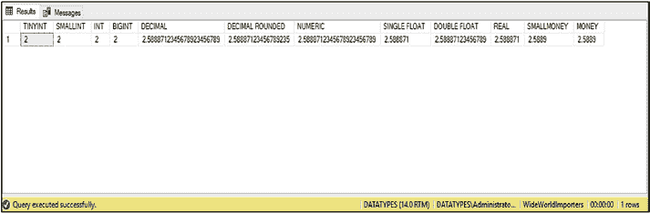

# 第 1 章 SQL Server 数据类型

## 数值数据类型

数值数据类型可用的样式选项可在 表 1-2 中找到。

**表 1-2.** 数值数据类型样式选项

| 样式代码 | 数据类型 | 输出 |
| :--- | :--- | :--- |
| `FLOAT & REAL` | `FLOAT` 和 `REAL` 的默认值。 | 最多六位数字。如果需要，则使用科学计数法。 |
| `FLOAT & REAL` | 八位数字。 | 总是使用科学计数法 |
| `FLOAT & REAL` | 十六位数字。 | 总是使用科学计数法 |
| `FLOAT & REAL` | 十七位数字，无损转换 | |
| `SMALLMONEY & MONEY` | `SMALLMONEY` 和 `MONEY` 的默认值。 | 无逗号分隔，小数点右侧两位数字 |
| `SMALLMONEY & MONEY` | 小数点左侧每三位用逗号分隔。 | 小数点右侧四位数字 |
| `SMALLMONEY & MONEY` | 无逗号分隔。 | 小数点右侧四位数字 |
| `SMALLMONEY & MONEY` | 在转换为字符数据类型时使用。 | 无逗号分隔，小数点右侧四位数字 |

清单 1-3 中的脚本展示了如何使用 `CAST` 函数将数字 `2.5888712345678923456789` 转换为每种数值数据类型。

**注意** `BIT` 类型被排除在外，因为这种转换没有意义。但如果包含它，它将被 `CAST` 为 `1`。

### 清单 1-3. 将数字转换为每种数据类型

```sql
SELECT
    CAST(2.5888712345678923456789 AS TINYINT) AS 'TINYINT'
    , CAST(2.5888712345678923456789 AS SMALLINT) AS 'SMALLINT'
    , CAST(2.5888712345678923456789 AS INT) AS 'INT'
    , CAST(2.5888712345678923456789 AS BIGINT) AS 'BIGINT'
    , CAST(2.5888712345678923456789 AS DECIMAL(23,22)) AS 'DECIMAL'
    , CAST(2.5888712345678923456789 AS DECIMAL(18,17)) AS 'DECIMAL ROUNDED'
    , CAST(2.5888712345678923456789 AS NUMERIC(23,22)) AS 'NUMERIC'
    , CAST(2.5888712345678923456789 AS FLOAT(24)) AS 'SINGLE FLOAT'
    , CAST(2.5888712345678923456789 AS FLOAT(53)) AS 'DOUBLE FLOAT'
    , CAST(2.5888712345678923456789 AS REAL) AS 'REAL'
    , CAST(2.5888712345678923456789 AS SMALLMONEY) AS 'SMALLMONEY'
    , CAST(2.5888712345678923456789 AS MONEY) AS 'MONEY'
```



清单 1-3 中查询的结果可以在 图 1-1 中找到。

**图 1-1.** 转换为数值数据类型的结果

## 字符串

SQL Server 可以存储 Unicode 和非 Unicode 字符串。字符串也可以存储为固定长度或可变长度。SQL Server 支持的字符数据类型列于 表 1-3。

**表 1-3.** 字符数据类型

| 数据类型 | 可变/固定 | 最大长度 | 存储大小 | 描述 |
| :--- | :--- | :--- | :--- | :--- |
| `CHAR` | 固定 | 8,000 个字符 | 最大字符串长度 × 1 字节 | 存储非 Unicode 字符串，固定长度。如果字符串短于最大长度，将用空格填充。 |
| `VARCHAR` | 可变 | 8,000 个字符或 `VARCHAR(MAX)` | 存储的字符串长度 × 1 字节 | 存储可变大小的非 Unicode 字符串。使用 `VARCHAR` 时，必须传入一个值来指定字符串的最大长度。使用 `VARCHAR(MAX)` 时，最多可存储 2GB。 |
| `NCHAR` | 固定 | 4,000 个字符 | 最大字符串长度 × 2 字节 | 存储固定长度的 Unicode 字符串。如果字符串短于最大长度，将用空格填充。 |
| `NVARCHAR` | 可变 | 4,000 个字符或 `NVARCHAR(MAX)` | 存储的字符串长度 × 2 字节 | 存储可变大小的 Unicode 字符串。使用 `NVARCHAR` 时，必须指定字符串的最大长度或使用 `MAX`。指定 `MAX` 时，根据存储的字符串，最多可存储 2GB。 |
| `TEXT` | 可变 | 2GB | 存储的字符串长度 × 1 字节 | *已弃用的数据类型，不应再使用。* |
| `NTEXT` | 可变 | 2GB | 存储的字符串长度 × 2 字节 | *已弃用的数据类型，不应再使用。* |


