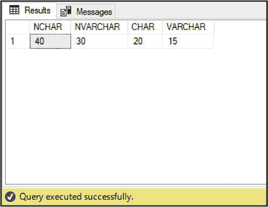
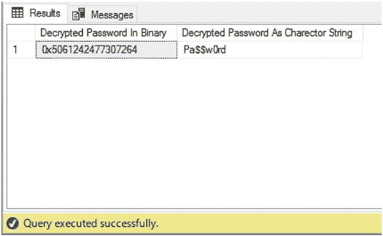

# 第 1 章 SQL Server 数据类型

对于字符串数据类型，可以指定最大长度或使用`MAX`，最多可存储 2GB。`IMAGE`是一个已弃用的数据类型，用于存储非 Unicode 字符串或 Unicode 字符串，具有可变长度。相关数据类型包括`NVARCHAR`、`TEXT`和`NTEXT`（参见表 1-3）。



代码清单 1-4 使用了`DATALENGTH`系统函数来演示将一个 15 个字符的字符串转换为每种字符数据类型时存储大小的差异。

```sql
SELECT
DATALENGTH(CAST('My String Value' AS NCHAR(20))) AS 'NCHAR',
DATALENGTH(CAST('My String Value' AS NVARCHAR(20))) AS 'NVARCHAR',
DATALENGTH(CAST('My String Value' AS CHAR(20))) AS 'CHAR',
DATALENGTH(CAST('My String Value' AS VARCHAR(20))) AS 'VARCHAR'
```

代码清单 1-4 的结果可以在图 1-2 中找到。

**图 1-2.** 比较字符串存储大小的结果

### 二进制数据类型

SQL Server 可以存储二进制数据，例如 Word 文档或照片，使用原生二进制数据类型。二进制数据类型也用于存储使用密钥或证书加密的数据。SQL Server 中可用的二进制数据类型详见表 1-4。

**表 1-4.** 二进制数据类型

| 数据类型 | 描述 | 存储大小 | 最大可变/固定长度 |
|-----------|-------------|--------------|-------------------------------|
| `BINARY` | 存储固定长度的二进制数据。使用`BINARY`时，必须以字节为单位指定数据长度。如果存储的数据短于指定长度，将被填充。 | 等于允许的最大字节数 | 固定字节 |
| `VARBINARY` | 存储可变长度的二进制数据。使用`VARBINARY`时，必须指定数据的最大字节长度或指定`MAX`。指定`MAX`时，最多可存储 2GB 数据。 | 等于实际存储的字节数加 2 字节 | 2GB |
| `IMAGE` | 一个不应使用的已弃用数据类型。存储可变长度的二进制数据。 | 等于实际存储的字节数加 2 字节 | 2GB |

**提示：** 有关加密数据的详细信息，请参考 *Securing SQL Server* (Apress, 2016)，可在 [www.apress.com/gp/book/9781484222645](http://www.apress.com/gp/book/9781484222645) 找到。

使用`CONVERT`函数时，`BINARY`数据可用的样式选项详见表 1-5。

**表 1-5.** BINARY 数据的样式选项

| 样式代码 | 输出 |
|------------|--------|
| 0（默认值） | 二进制数据的默认值。将 ASCII 字符转换为二进制字节，反之亦然。 |
| 1 | 将字符串转换为二进制数据。验证十六进制字节数为偶数且第一个字符为 0x。 |
| 2 | 将二进制数据转换为字符串。每个字节将转换为两个十六进制字符。溢出数据类型的数据将被截断。如果数据短于固定长度数据类型，将被填充。 |

代码清单 1-5 演示了如何读取已加密并存储在`VARBINARY`列中的密码，并将其转换回字符串。脚本首先创建所需对象并加密密码。

```sql
--Create a certificate that will encrypt the symmetric key
CREATE CERTIFICATE PasswordCert
ENCRYPTION BY PASSWORD = 'MySecurePa$$word'
WITH SUBJECT = 'Cert for securing passwords table';

--Create a symmetric key that will encrypt the password
CREATE SYMMETRIC KEY PasswordKey
WITH ALGORITHM = AES_128
ENCRYPTION BY CERTIFICATE PasswordCert;

--Create a table to store the password
CREATE TABLE dbo.Passwords
(
    Password VARBINARY(256)
);

--Open the symmetric key, so that it can be used
OPEN SYMMETRIC KEY PasswordKey
```


## 通过证书解密

`PasswordCert`
WITH PASSWORD = 'MySecurePa$$word' ;

--加密密码并将其插入表中

```sql
INSERT INTO dbo.Passwords
SELECT ENCRYPTBYKEY(KEY_GUID('PasswordKey'), 'Pa$$w0rd') ;
```

--解密并读取密码

--结果集中的第一列显示了解密后的密码值，但仍为二进制格式

--结果集中的第二列显示了解密后并转换回字符串的密码

```sql
SELECT
    DECRYPTBYKEY(Password) AS 'Decrypted Password In Binary'
    , CAST(DECRYPTBYKEY(Password) AS CHAR(8)) AS 'Decrypted Password As Character String'
FROM dbo.Passwords
--关闭对称密钥
CLOSE SYMMETRIC KEY PasswordKey ;
```



