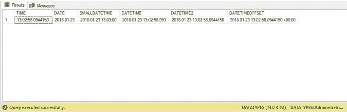

# 第 1 章 SQL Server 数据类型

针对清单 1-5 中创建的表执行 SELECT 语句的结果如图 1-3 所示。

**图 1-3.** 将二进制数据转换为字符串的结果

## 日期和时间

SQL Server 可以存储准确的日期和时间信息，包括 UTC 偏移量。每种支持的日期和时间数据类型的详细信息见表 1-6。

**表 1-6.** 日期和时间数据类型

| 数据类型 | 描述 | 存储大小 | 精度 |
| :--- | :--- | :--- | :--- |
| `DATE` | 存储一个日期 | 3 字节 | 1 天 |
| `TIME` | 存储一天中的时间 | 取决于小数秒精度： • 0-2 – 3 字节 • 3-4 – 4 字节 • 5-7 – 5 字节 | 100 纳秒 |
| `DATETIME` | 存储日期和时间 | 8 字节 | 四舍五入到 .000, .003 或 .007 秒 |
| `SMALLDATETIME` | 存储日期和时间，精确到分钟 | 4 字节 | 1 分钟 |
| `DATETIME2` | 存储带小数秒的日期和时间。使用时可以指定小数秒精度，最大为 7。如果省略，默认为 7。 | 取决于小数秒精度： • 0-2 – 6 字节 • 3-4 – 7 字节 • 5-7 – 8 字节 | 100 纳秒 |
| `DATETIMEOFFSET` | 存储带时区感知的日期和时间。存储日期和时间时，可以指定小数秒精度，最大为 7。如果省略，默认为 7。可以传递 -14 到 +14 的 UTC 偏移量。 | 10 字节 | 100 纳秒 |

表 1-7 详细列出了使用 `CONVERT` 函数时，日期和时间数据类型允许的样式选项。

**表 1-7.** 日期和时间样式

| 样式代码 | 标准 | 输入/输出 |
| :--- | :--- | :--- |
| 0 或 100 | `datetime` 和 `smalldatetime` 的默认值 | `mon dd yyyy hh:miAM (或 PM)` |
| 101 | 美国 | `mm/dd/yy` |
| 102 | ANSI | `yy.mm.dd` |
| 103 | 英国和法国 | `dd/mm/yy` |
| 104 | 德国 | `dd.mm.yy` |
| 105 | 意大利 | `dd-mm-yy` |
| 106 | | `dd mon yy` |
| 107 | | `Mon dd, yy` |
| 8 或 108 | | `hh:mi:ss` |
| 9 或 109 | 默认样式 (100) + 时间 | `mon dd yyyy hh:mi:ss:mmmAM (或 PM)` |
| 110 | 美国 | `mm-dd-yy` |
| 111 | 日本 | `yy/mm/dd` |
| 112 | ISO | `yymmdd` |
| 113 或 113 | 欧洲默认值 (106) + 时间 (毫秒) | `dd mon yyyy hh:mi:ss:mmm(24h)` |
| 120 或 120 | ODBC 规范 | `yyyy-mm-dd hh:mi:ss(24h)` |
| 121 或 121 | 带时间 (毫秒) 的 ODBC 规范。`time`、`date`、`datetime2` 和 `datetimeoffset` 的默认值 | `yyyy-mm-dd hh:mi:ss.mmm(24h)` |
| 110 | 美国 | `mm/dd/yyyy` |
| 102 | ANSI | `yyyy.mm.dd` |
| 103 | 英国和法国 | `dd/mm/yyyy` |
| 104 | 德国 | `dd.mm.yyyy` |
| 105 | 意大利 | `dd-mm-yyyy` |
| 106 | 欧洲默认值 | `dd mon yyyy` |
| 107 | | `Mon dd, yyyy` |
| 110 | 美国 | `mm-dd-yyyy` |
| 111 | 日本 | `yyyy/mm/dd` |
| 112 | ISO | `yyyymmdd` |
| 113 或 113 | 欧洲默认值 (106) + 时间 (毫秒) | `dd mon yyyy hh:mi:ss:mmm(24h)` |
| 120 或 120 | ODBC 规范 | `yyyy-mm-dd hh:mi:ss(24h)` |
| 121 或 121 | 带时间 (毫秒) 的 ODBC 规范 | `yyyy-mm-dd hh:mi:ss.mmm(24h)` |
| 126 | ISO8601 | `yyyy-mm-ddThh:mi:ss.mmm` 如果为 0，则不显示 `mmmm` |
| 127 | 带时区的 ISO8601 | `yyyy-mm-ddThh:mi:ss.mmmZ` 如果为 0，则不显示 `mmmm` |
| 130 | 回历 | `dd mon yyyy hh:mi:ss:mmmAM` `mon` 是月份名称的回历 Unicode 表示 |
| 131 | 回历 | `dd/mm/yyyy hh:mi:ss:mmmAM` `mon` 是月份名称的回历 Unicode 表示 |

