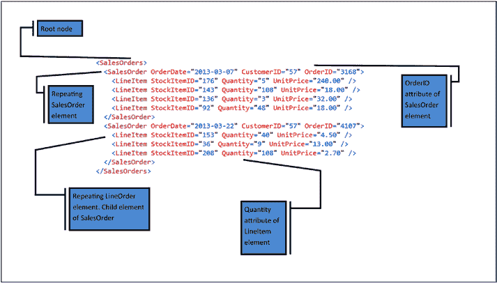

# 第 2 章 理解 XML

## 代码清单 2-4. 生成元素中心的 XML
```sql
SELECT
    SalesOrder.OrderDate
    , SalesOrder.CustomerID
    , SalesOrder.OrderID
    , LineItem.StockItemID
    , LineItem.Quantity
    , LineItem.UnitPrice
FROM Sales.Orders SalesOrder
INNER JOIN Sales.OrderLines LineItem
    ON LineItem.OrderID = SalesOrder.OrderID
WHERE SalesOrder.OrderID IN
(
    3168,
    4107,
    4980,
    64608,
)
FOR XML AUTO, ELEMENTS, ROOT('SalesOrders') ;
```

**注意** `FOR XML` 子句将在第 3 章讨论。

图 2-1 中的图片标注了代码清单 2-1 中属性中心文档的每个值得注意的方面。



## 图 2-1. XML 文档的各个方面

查看此 XML 文档时，有几点需要注意。

首先，元素以元素名开头，用尖括号括起来。它们以反斜杠开头、后跟元素名并用尖括号括起来的方式结束。位于这两个标签之间的任何元素都是该标签的子元素。

属性用双引号括起来，并位于元素的起始标签内。例如，`OrderID` 是 `<SalesOrder>` 元素的一个属性。

允许存在重复的元素。你可以看到 `<SalesOrder>` 是一个重复元素，因为此 XML 文档中存储了两个独立的销售订单。`<SalesOrders>` 元素是文档的根元素，并且是唯一不允许为复杂的元素。这意味着它不能具有属性，也不能重复。属性永远不能在一个元素内重复。因此，如果你需要一个节点重复，你应该使用嵌套元素而不是属性。

```xml
<SalesOrder>
    <OrderDate>2013-03-07</OrderDate>
    <CustomerID>57</CustomerID>
    <OrderID>3168</OrderID>
    <LineItem>
        <StockItemID>176</StockItemID>
        <Quantity>5</Quantity>
        <UnitPrice>240.00</UnitPrice>
    </LineItem>
    <LineItem>
        <StockItemID>143</StockItemID>
        <Quantity>108</Quantity>
        <UnitPrice>18.00</UnitPrice>
    </LineItem>
    <LineItem>
        <StockItemID>136</StockItemID>
        <Quantity>3</Quantity>
        <UnitPrice>32.00</UnitPrice>
    </LineItem>
    <LineItem>
        <StockItemID>92</StockItemID>
        <Quantity>48</Quantity>
        <UnitPrice>18.00</UnitPrice>
    </LineItem>
</SalesOrder>
<SalesOrder>
    <OrderDate>2013-03-22</OrderDate>
    <CustomerID>57</CustomerID>
    <OrderID>4107</OrderID>
    <LineItem>
        <StockItemID>153</StockItemID>
        <Quantity>40</Quantity>
        <UnitPrice>4.50</UnitPrice>
    </LineItem>
    <LineItem>
        <StockItemID>36</StockItemID>
        <Quantity>9</Quantity>
        <UnitPrice>13.00</UnitPrice>
    </LineItem>
    <LineItem>
        <StockItemID>208</StockItemID>
        <Quantity>108</Quantity>
        <UnitPrice>2.70</UnitPrice>
    </LineItem>
</SalesOrder>
<SalesOrder>
    <OrderDate>2013-04-09</OrderDate>
    <CustomerID>57</CustomerID>
    <OrderID>4980</OrderID>
    <LineItem>
        <StockItemID>102</StockItemID>
        <Quantity>10</Quantity>
        <UnitPrice>35.00</UnitPrice>
    </LineItem>
    <LineItem>
        <StockItemID>144</StockItemID>
        <Quantity>24</Quantity>
        <UnitPrice>18.00</UnitPrice>
    </LineItem>
    <LineItem>
        <StockItemID>79</StockItemID>
        <Quantity>36</Quantity>
        <UnitPrice>18.00</UnitPrice>
    </LineItem>
    <LineItem>
        <StockItemID>217</StockItemID>
        <Quantity>10</Quantity>
        <UnitPrice>25.00</UnitPrice>
    </LineItem>
</SalesOrder>
<SalesOrder>
    <OrderDate>2016-01-09</OrderDate>
    <CustomerID>57</CustomerID>
    <OrderID>64608</OrderID>
    <LineItem>
        <StockItemID>156</StockItemID>
        <Quantity>40</Quantity>
        <UnitPrice>15.00</UnitPrice>
    </LineItem>
    <LineItem>
        <StockItemID>56</StockItemID>
        <Quantity>7</Quantity>
        <UnitPrice>13.00</UnitPrice>
    </LineItem>
</SalesOrder>
<SalesOrder>
    <OrderDate>2016-05-25</OrderDate>
    <CustomerID>57</CustomerID>
    <OrderID>73148</OrderID>
    <LineItem>
        <StockItemID>31</StockItemID>
        <Quantity>7</Quantity>
        <UnitPrice>13.00</UnitPrice>
    </LineItem>
    <LineItem>
        <StockItemID>103</StockItemID>
        <Quantity>2</Quantity>
        <UnitPrice>35.00</UnitPrice>
    </LineItem>
</SalesOrder>
</SalesOrders>
```

代码清单 2-3 中的 XML 文档可以通过运行代码清单 2-4 中的查询来生成。


