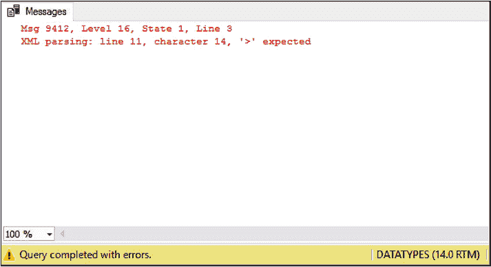

# 第 2 章 理解 XML

## 格式正确的 XML

SQL Server 同时支持 XML 片段和格式正确的 XML。使用格式正确的 XML 更为有利，因为它具有一定程度的验证性。因此，在可能的情况下，您应始终尝试使用格式正确的 XML。一个 XML 文档要成为格式正确的，必须满足某些要求，这些要求如下所列：

• XML 文档必须有一个唯一的、不重复的根元素。
• XML 元素必须有闭合标签。
• XML 元素必须正确嵌套，闭合标签的顺序与开启标签的顺序相反。
• XML 属性值必须用双引号括起来。
• 每个属性名在元素内必须是唯一的。

#### 提示
XML 标签是区分大小写的。

虽然 SQL Server 支持 XML 片段（即非格式正确的 XML 文档），但其语法仍然必须是正确的。例如，请看清单 2-5 中的脚本。该 XML 文档在语法上是不正确的，因为根节点缺少一个右尖括号。

***清单 2-5.*** 语法不正确的 XML

```sql
DECLARE @Example XML ;

SET @Example =
'<SalesOrder OrderDate="2013-03-07" CustomerID="57"
OrderID="3168">
  <LineItem StockItemID="176" Quantity="5" UnitPrice="240.00" />
  <LineItem StockItemID="143" Quantity="108"
UnitPrice="18.00" />
  <LineItem StockItemID="136" Quantity="3" UnitPrice="32.00" />
  <LineItem StockItemID="92" Quantity="48" UnitPrice="18.00" />
</SalesOrder>
<SalesOrder OrderDate="2013-03-22" CustomerID="57"
OrderID="4107">
  <LineItem StockItemID="153" Quantity="40" UnitPrice="4.50" />
  <LineItem StockItemID="36" Quantity="9" UnitPrice="13.00" />
  <LineItem StockItemID="208" Quantity="108" UnitPrice="2.70" />
</SalesOrder>' ;

SELECT @Example ;
```



运行清单 2-5 中的脚本将产生如图 2-2 所示的错误。

***图 2-2.** XML 语法错误*

如果我们更正语法错误并重新运行脚本（清单 2-6），脚本将运行并返回一个 XML 文档作为结果集，尽管该文档并非格式正确。它不是格式正确的，因为它没有根节点。

***清单 2-6.*** XML 片段

```sql
DECLARE @Example XML ;

SET @Example =
'<SalesOrder OrderDate="2013-03-07" CustomerID="57"
OrderID="3168">
  <LineItem StockItemID="176" Quantity="5" UnitPrice="240.00" />
  <LineItem StockItemID="143" Quantity="108" UnitPrice="18.00" />
  <LineItem StockItemID="136" Quantity="3" UnitPrice="32.00" />
  <LineItem StockItemID="92" Quantity="48" UnitPrice="18.00" />
</SalesOrder>
<SalesOrder OrderDate="2013-03-22" CustomerID="57"
OrderID="4107">
  <LineItem StockItemID="153" Quantity="40" UnitPrice="4.50" />
  <LineItem StockItemID="36" Quantity="9" UnitPrice="13.00" />
  <LineItem StockItemID="208" Quantity="108" UnitPrice="2.70" />
</SalesOrder>' ;

SELECT @Example ;
```

运行清单 2-6 中脚本的结果如图 2-3 所示。

***图 2-3.** XML 片段*

要使返回的 XML 文档成为格式正确的 XML，我们必须添加根节点，如清单 2-7 所示。

***清单 2-7.*** 格式正确的 XML

```sql
DECLARE @Example XML ;

SET @Example =
'<SalesOrders>
  <SalesOrder OrderDate="2013-03-07" CustomerID="57"
OrderID="3168">
    <LineItem StockItemID="176" Quantity="5" UnitPrice="240.00" />
    <LineItem StockItemID="143" Quantity="108" UnitPrice="18.00" />
    <LineItem StockItemID="136" Quantity="3" UnitPrice="32.00" />
    <LineItem StockItemID="92" Quantity="48" UnitPrice="18.00" />
  </SalesOrder>
  <SalesOrder OrderDate="2013-03-22" CustomerID="57"
OrderID="4107">
    <LineItem StockItemID="153" Quantity="40" UnitPrice="4.50" />
    <LineItem StockItemID="36" Quantity="9" UnitPrice="13.00" />
    <LineItem StockItemID="208" Quantity="108" UnitPrice="2.70" />
  </SalesOrder>
</SalesOrders>' ;

SELECT @Example ;
```


