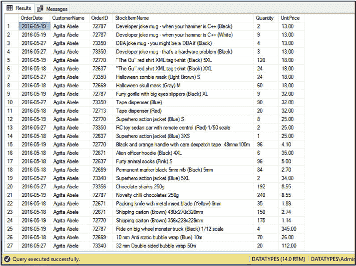

# 第 3 章 使用 T-SQL 构造 XML

`T-SQL` 允许你通过在 `SELECT` 语句中使用 `FOR XML` 子句将关系结果集转换为 `XML`。`FOR XML` 子句有四种可用模式：
*   `FOR XML RAW`
*   `FOR XML AUTO`
*   `FOR XML PATH`
*   `FOR XML EXPLICIT`


## 3.4 FOR XML 模式

FOR XML 子句在 RAW 模式、AUTO 模式、PATH 模式和 EXPLICIT 模式下工作。随着本章内容的展开，我们将从简单示例过渡到更复杂的示例。

### 使用 FOR XML RAW

在 FOR XML 的各种模式中，最简单且易于理解的是 FOR XML RAW。此模式将关系结果集中的每一行转换为扁平 XML 文档中的一个元素。请考虑清单 [3-1] 中的查询，该查询从 WideWorldImporters 数据库中提取销售订单的详细信息。

***清单 3-1.*** WideWorldImporters 销售订单查询

```sql
SELECT
SalesOrder.OrderDate
, Customers.CustomerName
, SalesOrder.OrderID
, LineItem.StockItemID
, LineItem.Quantity
, LineItem.UnitPrice
FROM Sales.Orders SalesOrder
INNER JOIN Sales.OrderLines LineItem
ON LineItem.OrderID = SalesOrder.OrderID
INNER JOIN Warehouse.StockItems Product
ON Product.StockItemID = LineItem.StockItemID
INNER JOIN Sales.Customers Customers
ON Customers.CustomerID = SalesOrder.CustomerID
WHERE customers.CustomerName = 'Agrita Abele';
```

此查询提取名为 Agrita Abele 的客户下的订单详情。该查询的部分输出可以在图 [3-1] 中找到。

***图 3-1.** WideWorldImporters 销售订单输出*



如果我们在查询中添加一个使用 RAW 模式的 FOR XML 子句，结果将以 XML 片段的形式返回。清单 [3-2] 中修改后的查询将返回 XML 文档，而不是关系结果集。

***清单 3-2.*** 使用 FOR XML RAW 的 WideWorldImporters 销售订单

```sql
SELECT
SalesOrder.OrderDate
, Customers.CustomerName
, SalesOrder.OrderID
, Product.StockItemName
, LineItem.Quantity
, LineItem.UnitPrice
FROM Sales.Orders SalesOrder
INNER JOIN Sales.OrderLines LineItem
ON LineItem.OrderID = SalesOrder.OrderID
INNER JOIN Warehouse.StockItems Product
ON Product.StockItemID = LineItem.StockItemID
INNER JOIN Sales.Customers Customers
ON Customers.CustomerID = SalesOrder.CustomerID
WHERE customers.CustomerName = 'Agrita Abele'
FOR XML RAW;
```

清单 [3-3] 展示了返回的 XML 片段。

***清单 3-3.*** 使用 FOR XML RAW 的 WideWorldImporters 销售订单

```xml
<row OrderDate="2016-05-19" CustomerName="Agrita Abele"
OrderID="72787" StockItemName="Developer joke mug - when your hammer is C++ (Black)" Quantity="2" UnitPrice="13.00" />

<row OrderDate="2016-05-19" CustomerName="Agrita Abele"
OrderID="72787" StockItemName="Developer joke mug - when your hammer is C++ (White)" Quantity="9" UnitPrice="13.00" />

<row OrderDate="2016-05-27" CustomerName="Agrita Abele"
OrderID="73350" StockItemName="DBA joke mug - you might be a DBA if (Black)" Quantity="4" UnitPrice="13.00" />

<row OrderDate="2016-05-27" CustomerName="Agrita Abele"
OrderID="73350" StockItemName="Developer joke mug - that's a hardware problem (Black)" Quantity="3" UnitPrice="13.00" />

<row OrderDate="2016-05-19" CustomerName="Agrita Abele"
OrderID="72770" StockItemName="&quot;The Gu&quot; red shirt XML
tag t-shirt (Black) 5XL" Quantity="120" UnitPrice="18.00" />

<row OrderDate="2016-05-18" CustomerName="Agrita Abele"
OrderID="72637" StockItemName="&quot;The Gu&quot; red shirt XML
tag t-shirt (Black) XXL" Quantity="24" UnitPrice="18.00" />

<row OrderDate="2016-05-27" CustomerName="Agrita Abele"
OrderID="73350" StockItemName="Halloween zombie mask (Light Brown) S" Quantity="24" UnitPrice="18.00" />

<row OrderDate="2016-05-18" CustomerName="Agrita Abele"
OrderID="72669" StockItemName="Halloween skull mask (Gray) M"
Quantity="60" UnitPrice="18.00" />

<row OrderDate="2016-05-19" CustomerName="Agrita Abele"
OrderID="72787" StockItemName="Furry gorilla with big eyes slippers (Black) XL" Quantity="9" UnitPrice="32.00" />

<row OrderDate="2016-05-27" CustomerName="Agrita Abele"
OrderID="73350" StockItemName="Halloween zombie mask (Light Brown) M" Quantity="24" UnitPrice="18.00" />
```

© Peter A. Carter 2018
P. A. Carter, *SQL Server Advanced Data Types*,
[`doi.org/10.1007/978-1-4842-3901-8_3`](https://doi.org/10.1007/978-1-4842-3901-8_3)


