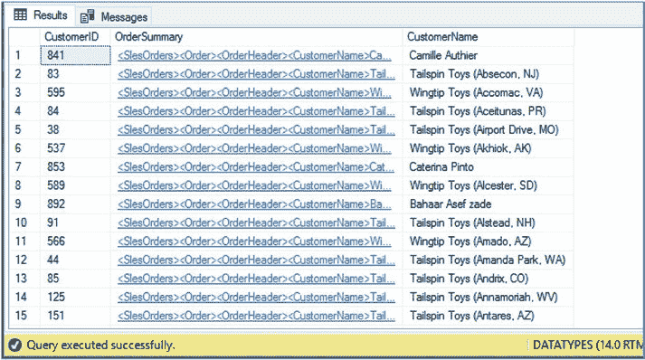
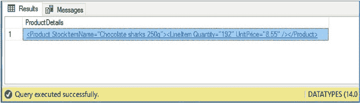
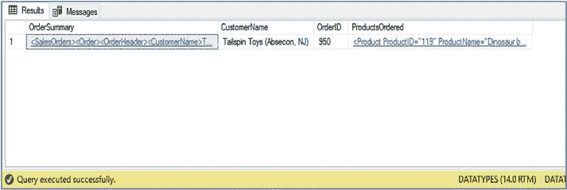
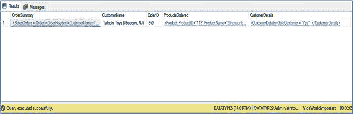
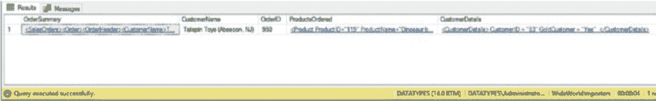

# 第四章 查询与分解 XML

**图 4-2.** 使用`value()`方法的结果

`value()`方法也可用于对表进行操作，从每一行中提取值。例如，清单 4-5 中的脚本可用于从`Sales.CustomerOrderSummary`表的每一行中提取客户名称。



**清单 4-5.** 对表使用`value()`方法

```sql
USE WideWorldImporters
GO
SELECT
    CustomerID
    , OrderSummary
    , OrderSummary.value('(/SalesOrders/Order/OrderHeader/
    CustomerName)[1]', 'nvarchar(100)') AS CustomerName
FROM Sales.CustomerOrderSummary ;
```

该查询的部分结果可在图 4-3 中找到。

**图 4-3.** 对表使用`value()`方法的结果

`value()`方法也可用于查询的`WHERE`子句中。

例如，清单 4-6 中的查询在功能上等同于清单 4-5 中的查询。它只是使用`value()`方法重写了，而不是使用`exist()`方法。

**清单 4-6.** 使用`value()`方法筛选表

```sql
USE WideWorldImporters
GO
SELECT
    CustomerID
    , OrderSummary
FROM WideWorldImporters.Sales.CustomerOrderSummary
WHERE OrderSummary.value('(/SalesOrders/Order/OrderHeader/
    CustomerName)[1]', 'nvarchar(100)') = 'Tailspin Toys (Absecon, NJ)' ;
```

## 使用 `query()`

`query()`方法用于从 XML 文档返回一个未类型化的 XML 文档。例如，考虑清单 4-7 中的脚本。该查询将以 XML 格式从 XML 文档中提取产品详细信息。

**清单 4-7.** 提取产品详细信息

```sql
DECLARE @SalesOrders XML ;
SET @SalesOrders =
'<SalesOrder OrderDate="2016-05-27" OrderID="73356">
    <Customers CustomerName="Agrita Abele">
        <Product StockItemName="Chocolate sharks 250g">
            <LineItem Quantity="192" UnitPrice="8.55" />
        </Product>
    </Customers>
</SalesOrder>' ;
SELECT @SalesOrders.query('/SalesOrder/Customers/Product') AS
ProductDetails ;
```



此查询的结果如图 4-4 所示。

**图 4-4.** 提取产品详细信息的结果

要了解在查询表时如何使用`query()`方法，请考虑清单 4-8 中的脚本。此查询使用了迄今为止讨论的所有 XQuery 方法。`value()`方法用于提取客户名称和订单 ID，而`query()`方法用于提取所订购产品的详细信息。该表使用`exist()`方法进行筛选。

**清单 4-8.** 对表使用`query()`、`value()`和`exist()`

```sql
USE WideWorldImporters
GO
SELECT
    OrderSummary
    , OrderSummary.value('(/SalesOrders/Order/OrderHeader/
    CustomerName)[1]', 'nvarchar(100)') AS CustomerName
    , OrderSummary.value('(/SalesOrders/Order/OrderHeader/
    OrderID)[1]', 'int') AS OrderID
    , OrderSummary.query('/SalesOrders/Order/OrderDetails/
    Product') AS ProductsOrdered
FROM Sales.CustomerOrderSummary
WHERE OrderSummary.exist('SalesOrders/Order/OrderHeader/
    CustomerName[(text()[1]) eq "Tailspin Toys (Absecon, NJ)"]') = 1 ;
```



此查询返回的结果如图 4-5 所示。

**图 4-5.** 对表使用`query()`、`value()`和`exist()`的结果

## 在 XQuery 中使用关系值

来自 T-SQL 变量和列的关系值也可以传递到 XQuery 表达式中。它们可以用于筛选甚至构造数据，但它们是只读的。因此，不能使用 XQuery 表达式来修改关系变量或列值。

要查看此功能的实际操作，请考虑清单 4-9 中的查询。

该查询在功能上等同于清单 4-7 中的查询。然而，这次我们没有使用硬编码的客户名称筛选器，而是从 T-SQL 变量传入。使用 T-SQL 变量或表中列的查询被称为跨域查询。

**清单 4-9.** 参数化`exist()`方法

```sql
USE WideWorldImporters
GO
DECLARE @CustomerName NVARCHAR(100) ;
SET @CustomerName = 'Tailspin Toys (Absecon, NJ)' ;
SELECT
    OrderSummary
    , OrderSummary.value('(/SalesOrders/Order/OrderHeader/
    CustomerName)[1]', 'nvarchar(100)') AS CustomerName
    , OrderSummary.value('(/SalesOrders/Order/OrderHeader/
    OrderID)[1]', 'int') AS OrderID
    , OrderSummary.query('/SalesOrders/Order/OrderDetails/
    Product') AS ProductsOrdered
FROM Sales.CustomerOrderSummary
WHERE OrderSummary.exist('SalesOrders/Order/OrderHeader/
    CustomerName[(text()[1]) eq sql:variable("@CustomerName") ]') = 1 ;
```

T-SQL 变量也可用于构造 XML。

例如，清单 4-10 中的脚本在结果集中生成一个新列，其中包含一个 XML 片段。此片段有一个名为`CustomerDetails`的元素。在此元素中，您会注意到一个名为`GoldCustomer`的属性。这是一个从 T-SQL 变量配置的标志。

请注意，当在`query()`方法中使用时，我们将`sql:variable`语句放在双引号和大括号内。

**清单 4-10.** 构造 XML 片段并从 T-SQL 变量传递值

```sql
USE WideWorldImporters
GO
DECLARE @Gold NVARCHAR(3)
DECLARE @CustomerName NVARCHAR(100)
SET @Gold = 'Yes'
SET @CustomerName = 'Tailspin Toys (Absecon, NJ)'

SELECT
    OrderSummary
    , OrderSummary.value('(/SalesOrders/Order/OrderHeader/
    CustomerName)[1]', 'nvarchar(100)') AS CustomerName
    , OrderSummary.value('(/SalesOrders/Order/OrderHeader/
    OrderID)[1]', 'int') AS OrderID
    , OrderSummary.query('/SalesOrders/Order/OrderDetails/
    Product') AS ProductsOrdered
    , OrderSummary.query('<CustomerDetails>GoldCustomer =
    "{ sql:variable("@Gold") }" </CustomerDetails>') AS
    CustomerDetails
FROM Sales.CustomerOrderSummary
WHERE OrderSummary.exist('SalesOrders/Order/OrderHeader/
    CustomerName[(text()[1]) eq sql:variable("@CustomerName") ]') = 1 ;
```

此查询的结果可在图 4-6 中找到。生成的 XML 片段可在`CustomerDetails`列中找到。



**图 4-6.** 构造 XML 片段并从 T-SQL 变量传递值的结果

当 XQuery 表达式针对表中的 XML 列运行时，存储在其他列中的关系数据也可以传递到 XQuery 表达式。例如，清单 4-11 中的脚本扩展了生成的`CustomerDetails` XML 片段，以包含来自`Sales.CustomerOrderSummary`表的`CustomerID`列的客户 ID。

**清单 4-11.** 使用关系列构造 XML 片段

```sql
USE WideWorldImporters
GO
DECLARE @Gold NVARCHAR(3)
DECLARE @CustomerName NVARCHAR(100)
SET @Gold = 'Yes'
SET @CustomerName = 'Tailspin Toys (Absecon, NJ)'
SELECT
    OrderSummary
    , OrderSummary.value('(/SalesOrders/Order/OrderHeader/
    CustomerName)[1]', 'nvarchar(100)') AS CustomerName
    , OrderSummary.value('(/SalesOrders/Order/OrderHeader/
    OrderID)[1]', 'int') AS OrderID
    , OrderSummary.query('/SalesOrders/Order/OrderDetails/
    Product') AS ProductsOrdered
    , OrderSummary.query('<CustomerDetails> CustomerID =
    "{ sql:column("CustomerID") }" GoldCustomer =
    "{ sql:variable("@Gold") }" </CustomerDetails>') As CustomerDetails
FROM Sales.CustomerOrderSummary
WHERE OrderSummary.exist('SalesOrders/Order/OrderHeader/
    CustomerName[(text()[1]) eq sql:variable("@CustomerName") ]') = 1 ;
```




