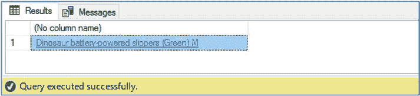
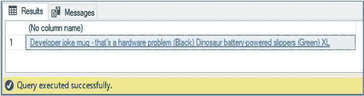

# 第 4 章 查询与分解 XML

## FLWOR

此查询的结果如图 4-7 所示。再次请注意 `CustomerDetails` 列，以查看生成的 XML 片段。

### 图 4-7. 使用关系列构建 XML 片段的结果

如前所述，`FLWOR` 代表 `for`、`let`、`where`、`order by` 和 `return`。这些语句提供了精细的控制，允许开发人员按照要求精确地导航、迭代处理、筛选和呈现 XML 节点。

`for` 语句将变量绑定到一个输入序列。`let` 语句用于将 XQuery 表达式赋值给一个变量，以便在 `FOR` 的迭代中使用。该表达式可以返回原子值或节点序列。`let` 语句是可选的。`where` 语句也是可选的，但可用于筛选返回的结果。可以可选地使用 `order by` 语句对 `FLWOR` 语句的结果进行排序。必需的 `return` 语句指定了将返回什么数据。

例如，考虑代码清单 4-12 中的 XML 文档。此 XML 文档包含了由代码清单 4-11 中 `OrderSummary` 列返回的 XML 文档中的前两个订单。

### 代码清单 4-12. 用于 FLWOR 示例的 XML 文档

```xml
DECLARE @XML XML = N'<SalesOrders>
<Order>
<OrderHeader>
<CustomerName>Tailspin Toys (Absecon, NJ)</CustomerName>
<OrderDate>2013-01-17</OrderDate>
<OrderID>950</OrderID>
</OrderHeader>
<OrderDetails>
<Product ProductID="119" ProductName="Dinosaur battery-powered slippers (Green) M" Price="32.00" Qty="2" />
<Product ProductID="61" ProductName="RC toy sedan car with remote control (Green) 1/50 scale" Price="25.00" Qty="2" />
<Product ProductID="194" ProductName="Black and orange glass with care despatch tape 48mmx100m" Price="4.10" Qty="216" />
<Product ProductID="104" ProductName="Alien officer hoodie (Black) 3XL" Price="35.00" Qty="2" />
</OrderDetails>
</Order>
<Order>
<OrderHeader>
<CustomerName>Tailspin Toys (Absecon, NJ)</CustomerName>
<OrderDate>2013-01-29</OrderDate>
<OrderID>1452</OrderID>
</OrderHeader>
<OrderDetails>
<Product ProductID="33" ProductName="Developer joke mug - that's a hardware problem (Black)" Price="13.00" Qty="9" />
<Product ProductID="121" ProductName="Dinosaur battery-powered slippers (Green) XL" Price="32.00" Qty="1" />
</OrderDetails>
</Order>
</SalesOrders>'
```

如果我们想迭代处理第二个订单中的每个 `Product` 元素，我们可以像代码清单 4-13 中那样使用 `FOR` 语句。请注意，我们使用了一个内部变量，命名为 `$product`，并使用 `in` 关键字来指定到 `ProductName` 属性的路径。对于那些使用过 PowerShell 等语言中 `foreach` 循环的人来说，这种方法和语法会很熟悉。

然后，`return` 语句用于将 `ProductName` 属性的值附加到 `$product` 字符串的末尾。请注意，我们使用方括号中的 `[2]` 来表示我们关注的是第二个订单，这将是一个单元素（尽管它是一个包含多个其他元素的复杂元素）。

**注意** 本节中的以下代码示例期望声明一个名为 `XML` 的变量，其中包含代码清单 4-12. 中的 XML 文档。由于篇幅原因，此变量未在每个代码示例中显式声明或设置。

### 代码清单 4-13. 使用 for 迭代 Product 元素

```sql
SELECT @XML.query('
for $product in /SalesOrders/Order[2]/OrderDetails/Product/@ProductName
return string($product)
') ;
```




此查询的结果如图 4-8. 所示


