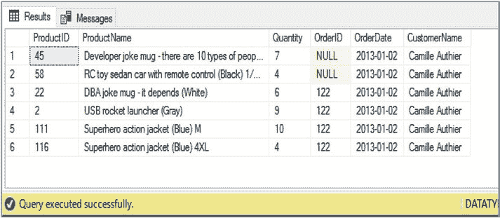

# 查询与解析 XML

在指定希望检索的节点路径之前，我们需要先为结果值定义关系数据类型。这是查询中最有趣的部分。您会注意到，我们使用了 `OPENXML()` 函数的 `rowpattern` 参数来映射到最低层级的 `Product` 元素。这意味着 `Product` 元素是我们路径的起点。`ProductID`、`ProductName` 和 `Quantity` 属性都是 `Product` 元素的属性。因此，我们为这些属性添加 `@` 前缀，以表明它们是属性，但不需要其他路径映射。`OrderID` 属性是 `OrderDetails` 元素的属性。由于 `OrderDetails` 元素比 `Product` 元素高一级，我们使用 `../` 语法来指定必须向上导航一级。`OrderDate` 元素比 `Product` 元素高两级；因此，我们使用两次 `../` 来指示应向上移动两级层次结构。另外请注意，由于 `OrderDate` 是一个元素而非属性，我们没有在该节点前添加 `@` 符号。

最后，为了映射到 `CustomerName` 元素，我们首先必须使用 `../` 语法向上导航两级层次结构。然后，我们必须下降到一个兄弟节点（`OrderHeader`）中，以检索 `CustomerName` 元素。

查询结果如图 4-10 所示。请注意，针对两个产品，`OrderID` 返回了 `NULL` 值。这是因为第二个销售订单没有指定 `OrderID` 元素。



*图 4-10. 使用 `OPENXML()` 的结果*

## 使用 Nodes 解析 XML

如果您想从列中解析数据，而不是使用变量，可以通过 XQuery 解析数据来避免迭代逻辑的需求。具体来说，`nodes()` 方法可用于识别应映射到关系列的节点。这可以与 `value()` 方法结合使用，以从节点中提取数据。例如，考虑代码清单 4-29 中的查询。该查询在功能上等同于代码清单 4-28 中的查询，但使用了 `nodes()` 方法而非 `OPENXML()`。

### 代码清单 4-29. 使用 `nodes()` 解析 XML

```sql
DECLARE @SalesOrder XML ;

SET @SalesOrder = '
<SalesOrders>
<Order>
<OrderDate>2013-01-02</OrderDate>
<OrderHeader>
<CustomerName>Camille Authier</CustomerName>
</OrderHeader>
<OrderDetails>
<Product ProductID="45" ProductName="Developer joke
mug - there are 10 types of people in the world (Black)"
Price="13" Qty="7" />
<Product ProductID="58" ProductName="RC toy sedan car with remote control (Black) 1/50 scale" Price="25" Qty="4" />
</OrderDetails>
</Order>
<Order>
<OrderDate>2013-01-02</OrderDate>
<OrderHeader>
<CustomerName>Camille Authier</CustomerName>
</OrderHeader>
<OrderDetails OrderID = "122">
<Product ProductID="22" ProductName="DBA joke mug - it
depends (White)" Price="13" Qty="6" />
<Product ProductID="2" ProductName="USB rocket launcher (Gray)" Price="25" Qty="9" />
<Product ProductID="111" ProductName="Superhero action
jacket (Blue) M" Price="30" Qty="10" />
<Product ProductID="116" ProductName="Superhero action
jacket (Blue) 4XL" Price="34" Qty="4" />
</OrderDetails>
</Order>
</SalesOrders>' ;

SELECT
    TempCol.value('@ProductID', 'INT') AS ProductID
    , TempCol.value('@ProductName', 'NVARCHAR(70)') AS ProductName
    , TempCol.value('@Qty', 'INT') AS Quantity
    , TempCol.value('../@OrderID', 'INT') AS OrderID
    , TempCol.value('../../OrderDate[1]', 'NVARCHAR(10)') AS OorderDate
    , TempCol.value('../../OrderHeader[1]/CustomerName[1]', 'NVARCHAR(15)') AS CustomerName
FROM @SalesOrder.nodes('SalesOrders/Order/OrderDetails/Product') TempTable(TempCol) ;
```

在检查此脚本时，您应特别注意 `FROM` 子句。这里，我们将一个 XQuery 表达式传递到 `nodes()` 方法中，

