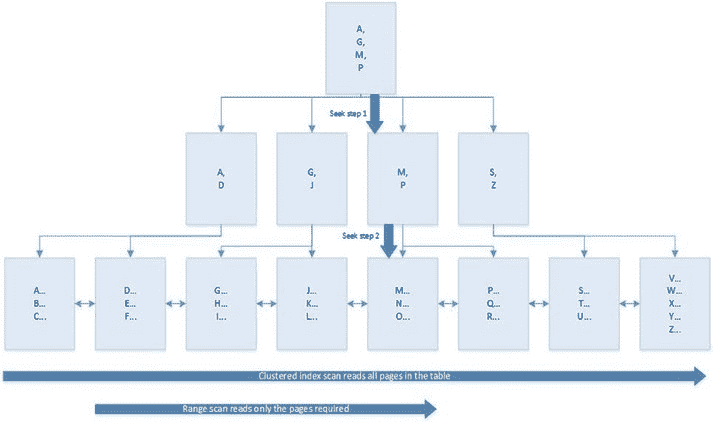

# 第 5 章 XML 索引

如第 3 章和第 4 章所述，SQL Server 允许您使用 `XML` 数据类型以原生 XML 格式将数据存储在表中。与其他大型对象类型一样，它最多可以存储 2GB 每元组。虽然可以使用标准操作符（如 `=` 和 `LIKE`）来处理 XML 列，但您也可以选择使用 XQuery 表达式（本章将讨论）。然而，除非您创建 XML 索引，否则它们的效率可能相当低。

对于大多数针对 XML 列的查询，XML 索引的性能将优于全文索引。SQL Server 支持主 XML 索引和三种类型的辅助 XML 索引：`PATH`、`VALUE` 和 `PROPERTY`。这些索引将在后续各节中讨论。不过，首先我将简要讨论聚集索引，因为在创建 XML 索引之前，表上必须存在聚集索引。

## 准备环境

由于 `WideWorldImporters` 数据库中没有包含原生 XML 列的表，我们将创建一个 `OrderSummary` 表，用于本章的演示。该表将包含三列：一个 `IDENTITY` 列（名为 `ID`）、一个 `CustomerID` 列和一个 `XML` 列（名为 `OrderSummary`），其中将包含客户所有订单的摘要。可以使用清单 5-1 中的脚本来创建并填充该表。

© Peter A. Carter 2018

P. A. Carter, *SQL Server Advanced Data Types*, `doi.org/10.1007/978-1-4842-3901-8_5`

第 5 章 XML 索引

***清单 5-1.*** 创建 `OrderSummary` 表

```sql
USE WideWorldImporters

GO

CREATE TABLE Sales.OrderSummary
(
    ID INT NOT NULL IDENTITY,
    CustomerID INT NOT NULL,
    OrderSummary XML
) ;

INSERT INTO Sales.OrderSummary (CustomerID, OrderSummary)
SELECT
    CustomerID,
    (
        SELECT
            CustomerName 'OrderHeader/CustomerName'
            , OrderDate 'OrderHeader/OrderDate'
            , OrderID 'OrderHeader/OrderID'
            , (
                SELECT
                    LineItems2.StockItemID '@ProductID'
                    , StockItems.StockItemName '@ProductName'
                    , LineItems2.UnitPrice '@Price'
                    , Quantity '@Qty'
                FROM Sales.OrderLines LineItems2
                INNER JOIN Warehouse.StockItems StockItems
                    ON LineItems2.StockItemID = StockItems.StockItemID
                WHERE LineItems2.OrderID = Base.OrderID
                FOR XML PATH('Product'), TYPE
            ) 'OrderDetails'
        FROM
            (
                SELECT DISTINCT
                    Customers.CustomerName
                    , SalesOrder.OrderDate
                    , SalesOrder.OrderID
                FROM Sales.Orders SalesOrder
                INNER JOIN Sales.OrderLines LineItem
                    ON SalesOrder.OrderID = LineItem.OrderID
                INNER JOIN Sales.Customers Customers
                    ON Customers.CustomerID = SalesOrder.CustomerID
                WHERE customers.CustomerID = OuterCust.CustomerID
            ) Base
        FOR XML PATH('Order'), ROOT ('SalesOrders'), TYPE
    ) AS OrderSummary
FROM Sales.Customers OuterCust ;
```

## 聚集索引

聚集索引会使表的数据页按照聚集索引键的顺序进行逻辑存储。聚集索引键可以是单列，也可以是列的集合。这通常是表的主键，但这并非强制要求，在某些情况下，您可能希望使用不同的列。本章后面将更详细地讨论这一点。

### 没有聚集索引的表

当一个表没有聚集索引时，它被称为堆。堆由一个 `IAM`（索引分配映射）页（或多个页）以及一系列不链接在一起或按顺序存储的数据页组成。SQL Server 确定表的页面的唯一方法是读取 `IAM` 页。当表作为堆存储时，每次访问表时，SQL Server 都必须读取表中的每一个页，即使您只想返回一行。图 5-1 中的示意图说明了堆的结构。

***图 5-1.** 堆结构*



当数据存储在堆上时，SQL Server 必须为每一行维护一个唯一标识符。它通过创建一个 `RID`（行标识符）来实现这一点。即使表上有非聚集索引，除非存在聚集索引，否则它仍然作为堆存储。在堆上创建非聚集索引时，使用 `RID` 作为指针，以便非聚集索引可以链接回基表中的正确行。非聚集索引以 `FileID: Page ID: Slot Number` 的格式存储 `RID`。

### 有聚集索引的表

当您在表上创建聚集索引时，会创建一个 `B-Tree`（平衡树）结构。这通过创建指向数据的分层指针集来执行更高效的搜索操作，如图 5-2 所示。此层次结构顶部的页面称为根节点。结构的底部级别称为叶级，对于聚集索引，叶级由表的实际数据页组成。根据表的大小，`B-Tree` 结构可以有一个或多个中间级别。

***图 5-2.** 聚集索引结构*

第 5 章 XML 索引

图 5-2 中的示意图显示，虽然叶级是数据本身，但上面的级别包含指向树中下方页面的指针。这使得 SQL Server 可以执行 Seek 操作。这是一种返回少量行的高效方法。它通过沿着 `B-Tree` 向下导航，使用指针找到所需的行。我们可以看到，如果需要，SQL Server 仍然可以扫描表的所有页面以检索所需的行。这称为聚集索引扫描。或者，SQL Server 可能决定结合这两种方法来执行范围扫描。在这里，SQL Server 将查找所需范围的第一个值，然后扫描叶级，直到遇到第一个不需要的值。SQL Server 可以这样做，因为表是按索引键排序的，这意味着它可以保证表后面不会有其他匹配值。

### 将主键聚集

表的主键通常是聚集索引的自然选择。事实上，默认情况下，除非您另有指定，或者表上已存在聚集索引，否则创建主键将自动在该键上生成聚集索引。但在某些情况下，主键并不是聚集索引的正确选择。我亲身经历过的一个例子是，一个第三方应用程序要求表的主键是 `GUID`。

`GUID`（全局唯一标识符）用于保证在整个网络中的唯一性。

如果聚集索引是 `GUID`，这会带来两个主要问题，


