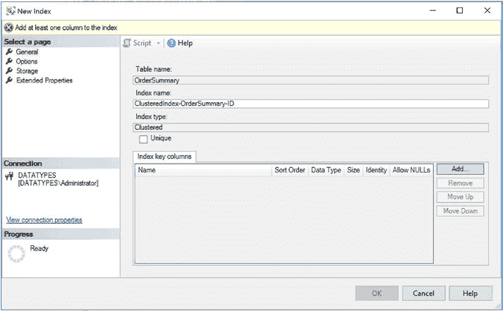

# 第 5 章 XML 索引

建立在主键之上。第一个问题是大小。GUID 长达 16 字节。当表包含非聚集索引时，聚集索引键会存储在每一个非聚集索引中。对于唯一的非聚集索引，它在叶级为每一行存储；对于非唯一的非聚集索引，它同样在索引的根级和中间级为每一行存储。

当你将 16 字节乘以数百万行时，这将极大地增加索引的大小，使其效率降低。

第二个问题是，当生成 GUID 时，它是一个随机值。因为表中的数据是按照聚集索引键的顺序存储的，为了获得良好性能，你需要该键的值按顺序生成。为聚集索引键生成随机值将导致每次插入新行时，索引变得越来越碎片化。本章稍后将讨论碎片化问题。

然而，对于第二个问题有一个变通方法。SQL Server 有一个名为 `NEWSEQUENTIALID()` 的函数，它生成的 GUID 值总是高于服务器上先前生成的值。因此，如果你在主键的 `Default` 约束中使用此函数，就可以强制实现顺序插入。

**注意**：服务器重启后，`NEWSEQUENTIALID()` 可能会以一个较低的值开始。这可能导致碎片化。

如果主键必须是 GUID，或者是另一个宽列，例如 `National Insurance Number`，或者是由一组列构成的自然键，例如 `Customer ID`、`Order Date` 和 `Product ID`，强烈建议你在表中创建一个额外的列。该列可以是 `INT` 或 `BIGINT`，具体取决于你预期表中的行数，并且可以使用 `IDENTITY` 属性或 `SEQUENCE` 来创建一个窄的、顺序的键，用于你的聚集索引。我建议确保使用窄键，因为它将包含在表上的所有非聚集索引中，并且在连接表时也会使用更少的内存。

**注意**：如果你打算使用 XML 索引，则必须在主键上创建聚集索引。

## 聚集索引的性能考虑

由于 `IAM` 页面按照存储在数据文件中的顺序（而非索引键的顺序）列出 `heap` 表的区，因此对 `heap` 进行表扫描可能比聚集索引扫描稍快一些，除非聚集索引具有 0% 的碎片（这很少见）。

当聚集索引键是递增的时，插入到聚集索引可能比插入到 `heap` 更快。当发生多个并行插入时尤其如此，因为当数据库引擎为放置新数据寻找空间时，`heap` 在系统页面（`GAM`/`SGAM`/`PFS`）上会遇到更多的争用。然而，如果聚集索引键不是递增的，那么插入将导致页拆分和碎片化。连锁反应是，插入速度会比插入到 `heap` 更慢。如果你获取表锁并利用最小日志记录插入，向 `heap` 的大批量插入也可能更快。这是因为减少了对事务日志的 IO。

由于大小改变导致行发生重定位的更新，在聚集索引上执行会比在 `heap` 上更快。这与上面提到的插入操作原因相同，即系统页面上的争用会更多。更新时，行的大小可能会因更新 `VARCHAR` 列为更长的字符串等原因而改变。如果更新可以原地进行（无需重定位行），性能可能差异不大。删除操作在聚集索引上也可能比在 `heap` 上稍快，但差异不如更新操作那么明显。

## 创建聚集索引

