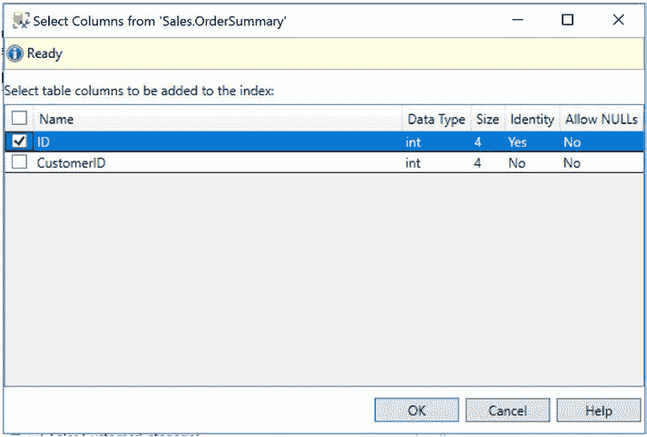
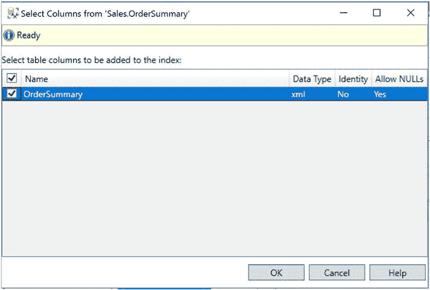

# 第 5 章 XML 索引

### 使用 SSMS 创建聚集索引

使用 SSMS（SQL Server Management Studio），我们可以在`OrderSummary`表的`ID`列上创建一个聚集索引。方法是在对象资源管理器中展开`Databases` ➤ `WideWorldImporters` ➤ `Tables` ➤ `Sales.OrderSummary`，右键单击`Indexes`节点，然后选择`New index` ➤ `Clustered index`。这将调用`New Index`对话框，如图 5-3 所示。

**图 5-3.** `New Index`对话框



**注意** 如果你计划遵循本章后续的演示，请不要执行图 5-3 和 5-4 所示的步骤。同时，避免执行代码清单 5-2 中的脚本。如果你确实创建了该索引，在运行后续示例之前必须先将其删除。

### 使用脚本创建聚集索引

此聚集索引也可以使用代码清单 5-2 中的脚本创建。

**代码清单 5-2.** 创建聚集索引

```sql
USE WideWorldImporters
GO

CREATE CLUSTERED INDEX [ClusteredIndex-OrderSummary-ID] ON
Sales.OrderSummary (ID) ;
GO
```

**注意** 创建聚集索引的高级选项超出了本书的范围，但更多信息可以在*Pro SQL Server Administration* (Apress, 2015)中找到，地址是[www.apress.com/gb/book/9781484207116](http://www.apress.com/gb/book/9781484207116)。

### 创建主键和聚集索引

由于我们的 XML 索引要求在**主键**上创建聚集索引，因此我们应该运行代码清单 5-3 中的脚本，而不是前面的脚本。此脚本将在`ID`列上创建主键，然后在主键上创建聚集索引。

**代码清单 5-3.** 创建主键和聚集索引

```sql
USE WideWorldImporters
GO

ALTER TABLE Sales.OrderSummary ADD CONSTRAINT
PK_OrderSummary PRIMARY KEY CLUSTERED (ID) ;
```

## 主 XML 索引

主 XML 索引实际上是一个多列聚集索引，它建立在一个名为`Node`表的内部系统表上。该表存储 XML 列中 XML 对象的分解表示，以及基表的聚集索引键。这意味着，表必须先具有聚集索引，才能创建主 XML 索引。此外，聚集索引必须创建在主键上，并且必须由 32 列或更少的列组成。

系统存储了足够的信息，使得查询所需的标量或 XML 子树可以从索引本身重建。这些信息包括节点`ID`和名称、标签名称和`URI`、节点数据类型的标记化版本、节点值在文档中的第一个位置、长节点值和二进制值的指针、节点的可空性，以及对应行的基表聚集索引键的值。

当查询必须从 XML 文档中分解标量值或从 XML 文档中返回节点子集时，主 XML 索引可以提供性能改进。

### 创建主 XML 索引

要使用 SSMS 创建主 XML 索引，请在对象资源管理器中依次展开`Databases` ➤ `WideWorldImporters` ➤ `Tables` ➤ `Sales.OrderSummary`。然后从索引的上下文菜单中选择`New Index` ➤ `Primary XML Index`。这将显示`New Index`对话框的`General`页面，如图 5-5 所示。

**图 5-5.** `New Index`对话框（主 XML）



在这里，我们将为索引指定一个描述性名称，然后使用`Add`按钮添加所需的 XML 列，如图 5-6 所示。


