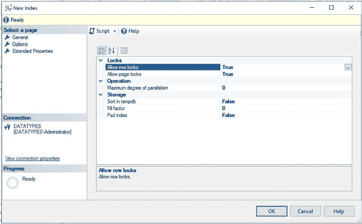
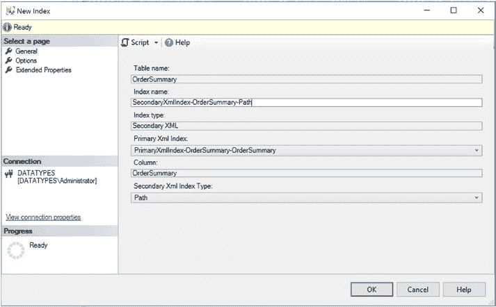

# 第 5 章 XML 索引

## 图表示例

***图 5-6.** 添加列对话框（主 XML）*

在新建索引对话框（图 5-7）的“选项”选项卡中，我们可以设置表 5-1 详述的选项。



***图 5-7.** 新建索引对话框 — 选项页（主 XML）*

## 主要的 XML 索引选项

***表 5-1.** 主 XML 索引选项*

**选项**
**描述**

`allow row Locks`
指定在访问索引时是否可以获取行锁。

`allow page Locks`
指定在访问索引时是否可以获取页锁。

`Maxdop`
对构建主 XML 索引没有影响，因为此操作始终是单线程的。

`sort in tempdB`
如果指定，`sort in tempdB` 将导致中间结果集存储在 `tempdB` 中，而不是用户数据库。这可能意味着索引构建得更快。

( *续表* )

***表 5-1.*** ( *续表* )

**选项**
**描述**

`Fill Factor`
指定在索引最低级别的每个索引页上将保留的空闲空间百分比。默认值为 0（100% 满），意思将只留下足以容纳单行的空间。指定低于 100 的百分比（例如，指定 70）将留下 30% 的空闲空间，如果可能频繁进行行插入，则可以减少页拆分。

`pad Index`
将填充因子（见上文）应用于 B 树的中间级别。

或者，可以通过 T-SQL 创建索引，你可以使用清单 5-4 中的脚本。

***清单 5-4.*** 创建主 XML 索引

```sql
USE WideWorldImporters
GO
CREATE PRIMARY XML INDEX [PrimaryXmlIndex-OrderSummary-OrderSummary]
ON Sales.OrderSummary ([OrderSummary]) ;
GO
```

## 辅助 XML 索引

辅助 XML 索引只能创建在已经具有主 XML 索引的 XML 列上。在后台，辅助 XML 索引实际上是内部节点表上的非聚集索引。辅助 XML 索引可以提升使用特定类型 XQuery 处理的查询性能。

`PATH` 辅助 XML 索引构建在节点表的 `Node ID` 和 `VALUE` 列上。此类索引可提升使用路径表达式的查询的性能，例如 `exists()` XQuery 方法。`VALUE` 辅助 XML 索引与此相反，构建在 `VALUE` 和 `Node ID` 列上。此类索引将提升搜索值的查询的性能，而无需知道包含所搜索值的 XML 元素或属性的名称。

最后，`PROPERTY` 辅助 XML 索引构建在基表的聚集索引键、节点表的 `Node ID` 和 `VALUE` 列上。如果查询试图从列的多个元组中检索节点，此类索引的性能非常好。

### 创建辅助 XML 索引

要在 SSMS 中创建辅助 XML 索引，请在对象资源管理器中依次展开 `数据库` ➤ `WideWorldImporters` ➤ `表` ➤ `OrderSummary`。接下来，从 `索引` 节点的上下文菜单中选择 `新建索引` ➤ `辅助 XML 索引`。这将显示新建索引对话框，如图 5-8 所示。



***图 5-8.** 新建索引对话框（辅助 XML）*

在新建索引对话框的“常规”选项卡上，我们首先为索引赋予一个描述性名称。接下来，我们从 `主 XML 索引` 下拉列表中选择适当的主 XML 索引。最后，我们从 `辅助 XML 索引类型` 下拉框中选择希望创建的辅助 XML 索引类型。在此例中，我们选择创建 `PATH` 索引。

图 5-9 展示了新建索引对话框的“选项”选项卡。每个选项的详细信息，请参阅表 5-1。


***图 5-9.** 新建索引对话框 — 选项选项卡（辅助 XML 索引）*

或者，要使用 T-SQL 创建此索引，你可以使用以下脚本：


