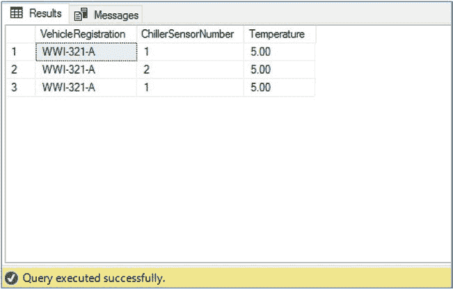

# 第 6 章 理解 JSON

随着 SQL Server 的演进，产品中加入了越来越多的非关系型特性，模糊了关系型与 NoSQL 技术之间的界限。JSON 便是其中一例。JSON（JavaScript 对象符号）是一种文档格式，被设计为一种轻量级的数据交换方法。

就其是自描述的、分层的数据交换格式而言，JSON 与 XML 相似。然而，与 XML 不同的是，JSON 的标签极简，这使得 JSON 文档更简短、更易于阅读且解析速度更快。

本章中，我将介绍 JSON 格式。我将讨论 JSON 文档的结构，并将其与 XML 文档进行比较。最后，我将讨论在 SQL Server 中使用 JSON 数据的场景。

查询 XML 列可能效率相当低下且性能不佳，除非创建了正确的 XML 索引来支持它们。对于 XML 列，XML 索引总是比全文索引更高效。正如本章所演示的，如果没有恰当地创建 XML 索引，XML 查询性能会受到显著损害。

## 理解 JSON 格式

基本的 JSON 语法使用名称/值对，并以冒号分隔。然后，JSON 对象由花括号括起来。名称必须是一个用双引号括起来的字符串，而值必须是：

*   一个字符串（由双引号括起）
*   一个数字
*   一个嵌套的 JSON 对象
*   一个布尔值
*   一个数组（由方括号括起）
*   `NULL`

© Peter A. Carter 2018

P. A. Carter, *SQL Server Advanced Data Types*,
`doi.org/10.1007/978-1-4842-3901-8_6`

第 6 章 理解 JSON

例如，考虑代码清单 6-1 中的简单示例。

***代码清单 6-1.*** 简单 JSON 文档

```
{ "FirstName" : "Pete" }
```

如果一个 JSON 文档中出现多个名称/值对，它们会用逗号分隔。例如，考虑代码清单 6-2 中的 JSON 文档。您会注意到 `age` 的值没有用双引号括起来，因为它是一个数字，而不是字符串。

***代码清单 6-2.*** 具有多个名称/值对的简单 JSON 文档

```
{ "FirstName" : "Pete" , "LastName" : "Carter" , "Age" : 38 }
```

如果您要将表中的一个行集表示为一个 JSON 平面文档，结果将是一个 JSON 对象数组。例如，考虑代码清单 6-3 中的查询。

***代码清单 6-3.*** 车辆最高温度查询

```
USE WideWorldImporters
GO

SELECT TOP 3
    VehicleRegistration
    , ChillerSensorNumber
    , Temperature
FROM Warehouse.VehicleTemperatures
ORDER BY Temperature DESC ;
```



第 6 章 理解 JSON

此查询将产生如图 6-1 所示的结果。

***图 6-1.*** *车辆最高温度*

如果要将此结果集表示为 JSON 文档，它将如代码清单 6-4 中的文档所示。

***代码清单 6-4.*** 以 JSON 表示的车辆最高温度

```
[
  {
    "VehicleRegistration": "WWI-321-A",
    "ChillerSensorNumber": 1,
    "Temperature": 5
  },
  {
    "VehicleRegistration": "WWI-321-A",
    "ChillerSensorNumber": 2,
    "Temperature": 5
  },
  {
    "VehicleRegistration": "WWI-321-A",
    "ChillerSensorNumber": 1,
    "Temperature": 5
  }
]
```

您可以看到结果是一个 JSON 对象数组；因此，文档由方括号括起来。每个 JSON 对象（表示表中的一行）由花括号括起来并用逗号分隔。在每个 JSON 对象内，逗号分隔的名称/值对表示结果表格化表示中的每一列。

`WideWorldImporters` 数据库中的 `Warehouse.VehicleTemperatures` 表还包括一个 JSON 数据类型的列，用于记录完整的传感器数据。考虑代码清单 6-5 中的查询。

***代码清单 6-5.*** 包含完整传感器数据的车辆温度查询

```
USE WideWorldImporters
GO

SELECT TOP 3
    VehicleRegistration
    , ChillerSensorNumber
    , Temperature
    , FullSensorData
FROM Warehouse.VehicleTemperatures
```


