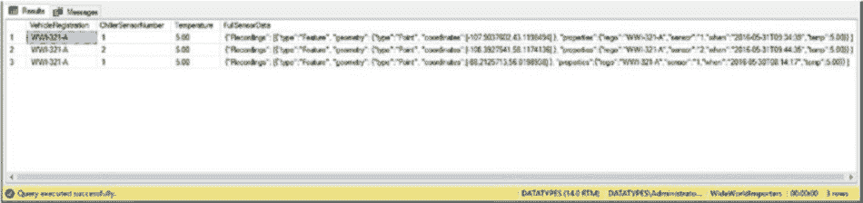

# 第六章 理解 JSON

`ORDER BY Temperature DESC ;`



此查询返回的结果如图 6-2 所示。

*图 6-2.* 包含完整传感器数据的温度结果

如果我们将此结果集表示为 JSON 文档，我们将得到一个 JSON 对象数组，其中一个对象是一个嵌套的 JSON 对象，如清单 6-6 所示。

*清单 6-6.* 以 JSON 表示的包含完整传感器数据的车辆温度

```
[
{
"VehicleRegistration": "WWI-321-A",
"ChillerSensorNumber": 1,
"Temperature": 5,
"FullSensorData": "{\"Recordings\": [{\"type\":\"Feature\",
"geometry": {"type":"Point",
"coordinates":[-107.9037602,43.1198494] },
"properties":{"rego":"WWI-321- A",
"sensor":"1,"when":"2016-05- 31T09:34:39",
"temp":5.00}} ]"
},
{
"VehicleRegistration": "WWI-321-A",
"ChillerSensorNumber": 2,
"Temperature": 5,
"FullSensorData": "{\"Recordings\": [{\"type\":\"Feature\",
"geometry": {"type":"Point",
"coordinates":[-108.3927541,58.1174136] },
"properties":{"rego":"WWI-321- A",
"sensor":"2,"when":"2016-05- 31T09:44:35",
"temp":5.00}} ]"
},
{
"VehicleRegistration": "WWI-321-A",
"ChillerSensorNumber": 1,
"Temperature": 5,
"FullSensorData": "{\"Recordings\": [{\"type\":\"Feature\",
"geometry": {"type":"Point",
"coordinates":[-88.2125713,56.0198938] },
"properties":{"rego":"WWI-321- A",
"sensor":"1,"when":"2016-05- 30T08:14:17",
"temp":5.00}} ]"
}
]
```

**提示** 嵌套的 JSON 对象在每个双引号前都包含一个反斜杠，作为转义字符。

你会注意到，在此示例中，每个 `FullSensorData` 节点的值都是一个嵌套在 JSON 对象内的 JSON 对象，它代表表格结果集中的一行。

还可以为 JSON 文档添加一个根节点，有时用于表示对象类型的名称或抽象概念。这有助于为文档提供上下文。清单 6-7 显示了与清单 6-6 相同的文档，但添加了一个根节点。

*清单 6-7.* 添加根节点

```
{
"VehicleTemperatures": [
{
"VehicleRegistration": "WWI-321-A",
"ChillerSensorNumber": 1,
"Temperature": 5,
"FullSensorData": "{\"Recordings\": [{\"type\":\"Feature\",
"geometry": {"type":"Point",
"coordinates":[-107.9037602,43.1198494] },
"properties":{"rego":"WWI-321- A",
"sensor":"1,"when":"2016-05- 31T09:34:39",
"temp":5.00}} ]"
},
{
"VehicleRegistration": "WWI-321-A",
"ChillerSensorNumber": 2,
"Temperature": 5,
"FullSensorData": "{\"Recordings\": [{\"type\":\"Feature\",
"geometry": {"type":"Point",
"coordinates":[-108.3927541,58.1174136] },
"properties":{"rego":"WWI-321- A",
"sensor":"2,"when":"2016-05- 31T09:44:35",
"temp":5.00}} ]"
},
{
"VehicleRegistration": "WWI-321-A",
"ChillerSensorNumber": 1,
"Temperature": 5,
"FullSensorData": "{\"Recordings\": [{\"type\":\"Feature\",
"geometry": {"type":"Point",
"coordinates":[-88.2125713,56.0198938] },
"properties":{"rego":"WWI-321- A",
"sensor":"1,"when":"2016-05- 30T08:14:17",
"temp":5.00}} ]"
}
]
}
```

## JSON 与 XML

让我们将一个简单的 JSON 文档与等效的 XML 进行比较，并检查其差异。考虑清单 6-8 中的 XML 文档，它表示 WideWorldImporters 数据库中的销售人员。

*清单 6-8.* 销售人员——XML

```
<SalesPeople>
<SalesPerson>
<PersonID>2</PersonID>
<FullName>Kayla Woodcock</FullName>
<PreferredName>Kayla</PreferredName>
<LogonName>kaylaw@wideworldimporters.com</LogonName>
<PhoneNumber>(415) 555-0102</PhoneNumber>
<EmailAddress>kaylaw@wideworldimporters.com</EmailAddress>
</SalesPerson>
<SalesPerson>
<PersonID>3</PersonID>
<FullName>Hudson Onslow</FullName>
<PreferredName>Hudson</PreferredName>
<LogonName>hudsono@wideworldimporters.com</LogonName>
<PhoneNumber>(415) 555-0102</PhoneNumber>
```


<EmailAddress>hudsono@wideworldimporters.com</EmailAddress>
</SalesPerson>

<SalesPerson>
<PersonID>6</PersonID>
<FullName>索菲亚·辛顿</FullName>
<PreferredName>索菲亚</PreferredName>
<LogonName>sophiah@wideworldimporters.com</LogonName>
<PhoneNumber>(415) 555-0102</PhoneNumber>
<EmailAddress>sophiah@wideworldimporters.com</EmailAddress>
</SalesPerson>

<SalesPerson>
<PersonID>7</PersonID>
<FullName>艾米·特雷弗</FullName>
<PreferredName>艾米</PreferredName>
<LogonName>amyt@wideworldimporters.com</LogonName>
<PhoneNumber>(415) 555-0102</PhoneNumber>
<EmailAddress>amyt@wideworldimporters.com</EmailAddress>
</SalesPerson>

<SalesPerson>
<PersonID>8</PersonID>
<FullName>安东尼·格罗斯</FullName>
<PreferredName>安东尼</PreferredName>
<LogonName>anthonyg@wideworldimporters.com</LogonName>
<PhoneNumber>(415) 555-0102</PhoneNumber>
<EmailAddress>anthonyg@wideworldimporters.com</EmailAddress>
</SalesPerson>

<SalesPerson>
<PersonID>13</PersonID>
<FullName>哈德森·霍林沃思</FullName>
## 第六章 理解 JSON
<PreferredName>哈德森</PreferredName>
<LogonName>hudsonh@wideworldimporters.com</LogonName>
<PhoneNumber>(415) 555-0102</PhoneNumber>
<EmailAddress>hudsonh@wideworldimporters.com</EmailAddress>
</SalesPerson>

<SalesPerson>
<PersonID>14</PersonID>
<FullName>莉莉·科德</FullName>
<PreferredName>莉莉</PreferredName>
<LogonName>lilyc@wideworldimporters.com</LogonName>
<PhoneNumber>(415) 555-0102</PhoneNumber>
<EmailAddress>lilyc@wideworldimporters.com</EmailAddress>
</SalesPerson>

<SalesPerson>
<PersonID>15</PersonID>
<FullName>塔杰·尚德</FullName>
<PreferredName>塔杰</PreferredName>
<LogonName>tajs@wideworldimporters.com</LogonName>
<PhoneNumber>(415) 555-0102</PhoneNumber>
<EmailAddress>tajs@wideworldimporters.com</EmailAddress>
</SalesPerson>

<SalesPerson>
<PersonID>16</PersonID>
<FullName>阿彻·兰布尔</FullName>
<PreferredName>阿彻</PreferredName>
<LogonName>archerl@wideworldimporters.com</LogonName>
<PhoneNumber>(415) 555-0102</PhoneNumber>
<EmailAddress>archerl@wideworldimporters.com</EmailAddress>
</SalesPerson>

<SalesPerson>
## 第六章 理解 JSON
<PersonID>20</PersonID>
<FullName>杰克·波特</FullName>
<PreferredName>杰克</PreferredName>
<LogonName>jackp@wideworldimporters.com</LogonName>
<PhoneNumber>(415) 555-0102</PhoneNumber>
<EmailAddress>jackp@wideworldimporters.com</EmailAddress>
</SalesPerson>
</SalesPeople>

每位销售人员都由一个 `<SalesPerson>` 开闭标签元素表示，该元素内包含与其属性相对应的每个属性的开闭标签元素。此外，还添加了一个名为 `<SalesPeople>` 的根节点。

**注意** 此 XML 文档以元素为中心。当然，我们也可以将销售人员的属性表示为属性。更多详情，请参见第 3 章。

让我们将此 XML 与清单 6-9 中的 JSON 文档进行比较。

### 清单 6-9. 销售人员—JSON
```json
{
    "SalesPeople": [
        {
            "PersonID": 2,
            "FullName": "凯拉·伍德科克",
            "PreferredName": "凯拉",
            "LogonName": "kaylaw@wideworldimporters.com",
            "PhoneNumber": "(415) 555-0102",
            "EmailAddress": "kaylaw@wideworldimporters.com"
        },
## 第六章 理解 JSON
        {
            "PersonID": 3,
            "FullName": "哈德森·昂斯洛",
            "PreferredName": "哈德森",
            "LogonName": "hudsono@wideworldimporters.com",
            "PhoneNumber": "(415) 555-0102",
            "EmailAddress": "hudsono@wideworldimporters.com"
        },
        {
            "PersonID": 6,
            "FullName": "索菲亚·辛顿",
            "PreferredName": "索菲亚",
            "LogonName": "sophiah@wideworldimporters.com",
            "PhoneNumber": "(415) 555-0102",
            "EmailAddress": "sophiah@wideworldimporters.com"
        },
        {
            "PersonID": 7,
            "FullName": "艾米·特雷弗",
            "PreferredName": "艾米",
            "LogonName": "amyt@wideworldimporters.com",
            "PhoneNumber": "(415) 555-0102",
            "EmailAddress": "amyt@wideworldimporters.com"
        },
        {
            "PersonID": 8,
            "FullName": "安东尼·格罗斯",
            "PreferredName": "安东尼",
            "LogonName": "anthonyg@wideworldimporters.com",
            "PhoneNumber": "(415) 555-0102",
            "EmailAddress": "anthonyg@wideworldimporters.com"
        },
## 第六章 理解 JSON
        {
            "PersonID": 13,
            "FullName": "哈德森·霍林沃思",
            "PreferredName": "哈德森",
            "LogonName": "hudsonh@wideworldimporters.com",
```


