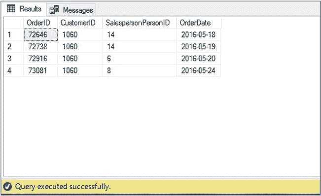

# 第 7 章 从 T-SQL 构建 JSON

正如 `FOR XML` 子句（参见第 3 章）可用于从关系结果集构建 XML 文档一样，`FOR JSON` 子句可用于从关系结果集构建 JSON 数据。这对于在 SQL Server 和传统编程语言之间交换数据非常有用。然而，与 `FOR XML` 不同，`FOR JSON` 只提供两种模式：`AUTO` 和 `PATH`。本章将讨论 `FOR JSON` 子句在 `AUTO` 模式和 `PATH` 模式下的使用。

## FOR JSON AUTO

`FOR JSON AUTO` 是两种 `FOR JSON` 模式中最简单的一种。它可以根据表连接自动嵌套 JSON 数据，也可以从单个表提供扁平的 JSON 文档。为了在最基本的层面解释 `FOR JSON`，请考虑清单 7-1 中的查询，该查询返回客户 1060 的订单日期以及客户、订单和销售人员的键。

***清单 7-1.*** 返回销售订单的键和日期

```sql
USE WideWorldImporters
GO
```

© Peter A. Carter 2018

P. A. Carter，《SQL Server 高级数据类型》，

`doi.org/10.1007/978-1-4842-3901-8_7`



