# 第 7 章 从 T-SQL 构建 JSON

此查询返回了代码清单 7-16. 中所示的结果。

**代码清单 7-16.** 使用点分隔别名的结果

```json
{
    "SalesOrders": [
        {
            "OrderID": 72646,
            "CustomerID": 1060,
            "SalespersonPersonID": 14,
            "OrderDate": "2016-05-18",
            "Orders.Comments": null
        },
        {
            "OrderID": 72738,
            "CustomerID": 1060,
            "SalespersonPersonID": 14,
            "OrderDate": "2016-05-19",
            "Orders.Comments": null
        },
        {
            "OrderID": 72916,
            "CustomerID": 1060,
            "SalespersonPersonID": 6,
            "OrderDate": "2016-05-20",
            "Orders.Comments": null
        },
        {
            "OrderID": 73081,
            "CustomerID": 1060,
            "SalespersonPersonID": 8,
            "OrderDate": "2016-05-24",
            "Orders.Comments": null
        }
    ]
}
```

你会注意到，键只是被赋予了一个点分隔的名称。

这是一个需要注意的重要行为，因为在使用 `FOR JSON PATH` 时，点分隔的别名会产生嵌套的 JSON 对象。随着本章内容的深入，你会对此了解更多。

## 自动嵌套

到目前为止，我们的所有示例都集中在 `FOR JSON AUTO` 针对单个表时的行为。现在，让我们把注意力转向 `FOR JSON AUTO` 如何基于表连接和子查询自动嵌套数据。

考虑代码清单 7-17. T 中的查询。此查询通过增强来更详细地检查订单 72646，以检索单个订单中每个订购库存项的详细信息。

**代码清单 7-17.** 添加订单行详情

```sql
USE WideWorldImporters
GO
SELECT
    Orders.OrderID
    , Orders.CustomerID
    , Orders.SalespersonPersonID
    , Orders.OrderDate
    , Orders.Comments
    , OrderLines.StockItemID
    , OrderLines.UnitPrice
    , OrderLines.Quantity
FROM Sales.Orders Orders
INNER JOIN Sales.OrderLines OrderLines
    ON OrderLines.OrderID = Orders.OrderID
WHERE CustomerID = 1060
    AND Orders.OrderID = 72646
FOR JSON AUTO, ROOT('SalesOrders'), INCLUDE_NULL_VALUES ;
```

此查询的结果如代码清单 7-18 所示。

**代码清单 7-18.** 添加订单行详情的结果

```json
{
    "SalesOrders": [
        {
            "OrderID": 72646,
            "CustomerID": 1060,
            "SalespersonPersonID": 14,
            "OrderDate": "2016-05-18",
            "Comments": null,
            "OrderLines": [
                {
                    "StockItemID": 45,
                    "UnitPrice": 13,
                    "Quantity": 6
                },
                {
                    "StockItemID": 146,
                    "UnitPrice": 18,
                    "Quantity": 108
                },
                {
                    "StockItemID": 8,
                    "UnitPrice": 240,
                    "Quantity": 2
                },
                {
                    "StockItemID": 212,
                    "UnitPrice": 4.3,
                    "Quantity": 20
                }
            ]
        }
    ]
}
```

你会注意到，在每个订单的表示中，添加了一个新的键，其名称与第二个表的别名匹配。其值是一个嵌套的 JSON 对象数组，这些对象包含名值对，代表从第二个表（基于 `SELECT` 列表中列的顺序）返回的列。

那么，如果我们添加一个嵌套连接，以便从 `Warehouse.StockItems` 表中检索产品名称，如代码清单 7-19 所示，会怎样呢？

**代码清单 7-19.** 使用嵌套连接

```sql
USE WideWorldImporters
GO
SELECT
    Orders.OrderID
    , Orders.CustomerID
    , Orders.SalespersonPersonID
    , Orders.OrderDate
    , Orders.Comments
    , OrderLines.StockItemID
    , OrderLines.UnitPrice
    , OrderLines.Quantity
    , Products.StockItemName
FROM Sales.Orders Orders
INNER JOIN Sales.OrderLines OrderLines
    ON OrderLines.OrderID = Orders.OrderID
INNER JOIN Warehouse.StockItems Products
    ON Products.StockItemID = OrderLines.StockItemID
WHERE CustomerID = 1060
    AND Orders.OrderID = 72646
FOR JSON AUTO, ROOT('SalesOrders'), INCLUDE_NULL_VALUES ;
```

此查询的结果可在代码清单 7-20. 中找到。

**代码清单 7-20.** 使用嵌套连接的结果

```json
{
    "SalesOrders": [
        {
            "OrderID": 72646,
            "CustomerID": 1060,
            "SalespersonPersonID": 14,
            "OrderDate": "2016-05-18",
            "Comments": null,
            "OrderLines": [
                {
                    "StockItemID": 45,
                    "UnitPrice": 13,
                    "Quantity": 6,
                    "Products": [
                        {
                            "StockItemName": "Developer joke mug - there are 10 types of people in the world (Black)"
                        }
                    ]
                },
                {
                    "StockItemID": 146,
                    "UnitPrice": 18,
                    "Quantity": 108,
                    "Products": [
                        {


# 第 7 章 从 T-SQL 构建 JSON

```json
{
    "StockItemName": "万圣节骷髅面具（灰色）S"
}
```

```json
{
    "StockItemID": 212,
    "UnitPrice": 4.3,
    "Quantity": 20,
    "Products": [
        {
            "StockItemName": "大型替换刀片 18mm"
        }
    ]
}
```

```json
{
    "StockItemID": 8,
    "UnitPrice": 240,
    "Quantity": 2,
    "Products": [
        {
            "StockItemName": "USB 食物 U 盘 - 点心 10 款套装"
        }
    ]
}
```

你会注意到，文档中增加了一层嵌套，即在每个`OrderLines`数组中添加了一个包含`StockItemName`的`Products`数组。

正如嵌套基于表连接自动发生一样，这同样适用于子查询。请考虑清单 7-21 中的查询，它在`SELECT`列表中包含两个关联子查询，用于返回下单客户的名称和销售该订单的销售人员的名称。

**提示**：嵌套结构更容易被编程语言处理。

## 清单 7-21. 使用子查询来嵌套数据

```sql
USE WideWorldImporters
GO

SELECT
    Orders.OrderID
    , (SELECT FullName FROM Application.People WHERE PersonID = Orders.CustomerID FOR JSON AUTO) AS 'Customer'
    , (SELECT FullName FROM Application.People WHERE PersonID = Orders.SalespersonPersonID FOR JSON AUTO) AS 'SalesPerson'
    , Orders.OrderDate
    , Orders.Comments
    , OrderLines.UnitPrice
    , OrderLines.Quantity
    , Products.StockItemName
FROM Sales.Orders Orders
INNER JOIN Sales.OrderLines OrderLines
    ON OrderLines.OrderID = Orders.OrderID
INNER JOIN Warehouse.StockItems Products
    ON Products.StockItemID = OrderLines.StockItemID
WHERE CustomerID = 1060
    AND Orders.OrderID = 72646
FOR JSON AUTO, ROOT('SalesOrders'), INCLUDE_NULL_VALUES ;
```

此查询的详细结果见清单 7-22。

## 清单 7-22. 使用子查询嵌套数据的结果

```json
{
    "SalesOrders": [
        {
            "OrderID": 72646,
            "Customer": [
                {
                    "FullName": "Konrads Sprogis"
                }
            ],
            "SalesPerson": [
                {
                    "FullName": "Lily Code"
                }
            ],
            "OrderDate": "2016-05-18",
            "Comments": null,
            "OrderLines": [
                {
                    "UnitPrice": 13,
                    "Quantity": 6,
                    "Products": [
                        {
                            "StockItemName": "开发者玩笑马克杯 - 世界上有 10 种人（黑色）"
                        }
                    ]
                },
                {
                    "UnitPrice": 18,
                    "Quantity": 108,
                    "Products": [
                        {
                            "StockItemName": "万圣节骷髅面具（灰色）S"
                        }
                    ]
                },
                {
                    "UnitPrice": 4.3,
                    "Quantity": 20,
                    "Products": [
                        {
                            "StockItemName": "大型替换刀片 18mm"
                        }
                    ]
                },
                {
                    "UnitPrice": 240,
                    "Quantity": 2,
                    "Products": [
                        {
                            "StockItemName": "USB 食物 U 盘 - 点心 10 款套装"
                        }
                    ]
                }
            ]
        }
    ]
}
```

## `FOR JSON PATH`

虽然本章 `FOR JSON AUTO` 部分的最后一个示例返回了销售订单摘要所需的所有数据，但文档的格式还有改进空间。由于不必要的嵌套，文档比必要的要长得多。例如，每个行项目只能有一个产品名称，因此理想情况下，`Products` 数组在 `OrderLines` 数组中应该是一个简单的名称/值对。同样的原则也适用于客户和销售人员姓名。

因此，让我们设想一下，我们希望生成一个如清单 7-23 所示格式的 JSON 文档，它具有更简洁、更易于阅读的布局。

## 清单 7-23. 期望的 JSON 格式

```json
{
    "SalesOrders": [
        {
            "OrderDetails": {
                "OrderID": 72646,
                "Customer": "Konrads Sprogis",
                "SalesPerson": "Lily Code",
                "OrderDate": "2016-05-18",
                "Comments": null,
                "LineItems": {
                    "UnitPrice": 13,
                    "Quantity": 6,
                    "ProductName": "开发者玩笑马克杯 - 世界上有 10 种人（黑色）"
                }
            }
        },
        {
            "OrderDetails": {
                "OrderID": 72646,
                "Customer": "Konrads Sprogis",
                "SalesPerson": "Lily Code",
                "OrderDate": "2016-05-18",
                "Comments": null,
                "LineItems": {
                    "UnitPrice": 18,
                    "Quantity": 108,
                    "ProductName": "万圣节骷髅面具（灰色）S"
                }
            }
        },
        {
            "OrderDetails": {
                "OrderID": 72646,
                "Customer": "Konrads Sprogis",
                "SalesPerson": "Lily Code",
                "OrderDate": "2016-05-18",
                "Comments": null,
                "LineItems": {
                    "UnitPrice": 4.3,
```

# 第 7 章 从 T-SQL 构建 Json

```json
"Quantity": 20,

"ProductName": "Large replacement blades 18mm"

}

}

},

{

"OrderDetails": {

"OrderID": 72646,

"Customer": "Konrads Sprogis",

"SalesPerson": "Lily Code",

"OrderDate": "2016-05-18",

"Comments": null,

"LineItems": {

"UnitPrice": 240,

"Quantity": 2,

"ProductName": "USB food flash drive - dim sum 10 drive variety pack"

}

}

}

]

}
```

我们可以轻松地通过使用 `FOR JSON PATH` 来实现这些结果，它提供了对结果文档格式的精细控制。这种控制是通过使用列别名来实现的，列别名允许你通过点分隔来指定所需的嵌套结构。请参阅清单 7-24 中的查询。该查询与清单 7-21 中的类似，但有两个关键区别需要注意。第一个区别是 `FOR XML AUTO` 已更改为 `FOR JSON PATH`。第二个区别是每个列都被赋予了列别名，这些别名不仅指定了节点的名称，还指定了其在文档中的位置。例如，客户的全名将被放入一个名为 `Customer` 的节点中，该节点直接嵌套在 `OrderDetails` 下。相比之下，`ProductName` 节点将与单价和数量一起嵌套在一个名为 `LineItems` 的节点下。这会导致创建一个 `LineItems` 键，其值是由 JSON 对象组成的数组，包括前文指定的所有节点。结果就是清单 7-23. 中的文档。

## 清单 7-24. 使用 `FOR JSON PATH`

```sql
USE WideWorldImporters
GO
SELECT
Orders.OrderID AS 'OrderDetails.OrderID'
, Customers.FullName AS 'OrderDetails.Customer'
, SalesPeople.FullName AS 'OrderDetails.SalesPerson'
, Orders.OrderDate AS 'OrderDetails.OrderDate'
, Orders.Comments AS 'OrderDetails.Comments'
, OrderLines.UnitPrice AS 'OrderDetails.LineItems.UnitPrice'
, OrderLines.Quantity AS 'OrderDetails.LineItems.Quantity'
, Products.StockItemName AS 'OrderDetails.LineItems.ProductName'
FROM Sales.Orders Orders
INNER JOIN Sales.OrderLines OrderLines
ON OrderLines.OrderID = Orders.OrderID
INNER JOIN Warehouse.StockItems Products
ON Products.StockItemID = OrderLines.StockItemID
INNER JOIN Application.People Customers
ON Customers.PersonID = Orders.CustomerID
INNER JOIN Application.People SalesPeople
ON SalesPeople.PersonID = Orders.SalespersonPersonID
WHERE CustomerID = 1060
AND orders.OrderID = 72646
FOR JSON PATH, ROOT('SalesOrders'), INCLUDE_NULL_VALUES ;
```

## 小结

`SELECT` 语句的 `FOR JSON` 子句可用于将结果集转换为 JSON 格式。它可以在两种模式下使用：`AUTO` 或 `PATH`。当在 `AUTO` 模式下使用时，`FOR JSON` 会根据查询中的联接自动嵌套数据。当在 `PATH` 模式下使用时，`FOR JSON` 通过允许使用点分隔的列别名来定义每个关系列在 JSON 结果集中的位置，从而给予开发人员更多的控制权，这些别名用于控制嵌套。

`FOR JSON` 子句有多个选项可用于控制文档格式。例如，可以使用 `ROOT` 选项向文档添加根节点，或者如果不存在根节点，可以使用 `WITHOUT_ARRAY_WRAPPER` 选项移除外部数组包装器。您还可以通过使用 `INCLUDE_NULL_VALUES` 选项来指定是否应在结果文档中包含 `NULL` 值。

# 第 8 章 展平 JSON 数据

在第 7 章中，我讨论了如何将关系数据转换为 JSON 文档，但是如果我们需要像在第 4 章中学到的展平 XML 文档那样，将 JSON 文档展平到关系数据集中，该怎么办？我们可以使用 `OPENJSON()` 函数来实现这一点。`OPENJSON()` 函数接受一个 JSON 文档作为输入参数，并


输出一个表格形式的结果集。`OPENJSON()` 函数可以在指定或不指定结果集显式架构的情况下调用。`OPENJSON()` 还支持使用 JSON 路径表达式。本章将逐一考察这些选项。

## 使用默认架构的 OPENJSON()

为了理解 `OPENJSON()` 函数如何与默认架构配合工作，让我们来检查 `WideWorldImporters` 数据库中 `Application.People` 表的 `CustomFields` 列。清单 8-1 中的查询返回了 `PersonID`（表的主键）、`FullName` 列以及包含 JSON 文档的 `CustomFields` 列。

**提示** 与本书讨论的其他数据类型不同，SQL Server 2017 中并未实际创建 JSON 数据类型。相反，JSON 文档存储在 `NVARCHAR` 列中，并调用支持 JSON 的函数对数据进行解析和交互操作。

© Peter A. Carter 2018
P. A. Carter, *SQL Server Advanced Data Types*,
[`doi.org/10.1007/978-1-4842-3901-8_8`](https://doi.org/10.1007/978-1-4842-3901-8_8)

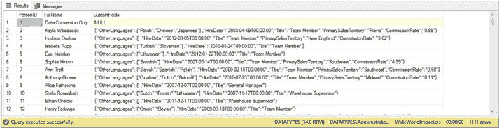

### 清单 8-1. 检查 Application.Person 表

```sql
USE WideWorldImporters
GO
SELECT
    PersonID
    , FullName
    , CustomFields
FROM Application.People ;
```

从图 8-1 所示的部分结果集中，您会注意到 `CustomFields` 列包含一个 JSON 文档，其中指定了每个人员的属性，例如他们的雇佣日期（对于员工）、使用的语言以及头衔。

***图 8-1.** 检查 Application.Person 表的结果*

如果我们想使用 `OPENJSON()` 来分解特定用户的详细信息，我们必须首先将 JSON 文档传递到一个变量中，然后再将该变量传递给 `OPENJSON()` 函数。清单 8-2 演示了这一技术，它返回了 Anthony Grosse 的自定义字段。

### 清单 8-2. 分解单个 JSON 文档

```sql
USE WideWorldImporters
GO
DECLARE @CustomFields NVARCHAR(MAX) ;
SET @CustomFields = (
    SELECT CustomFields
    FROM Application.People
    WHERE FullName = 'Anthony Grosse'
) ;
SELECT *
FROM OPENJSON(@CustomFields) ;
```

此脚本的结果如图 8-2 所示。

***图 8-2.** 分解单个 JSON 文档的结果*

`key` 列包含名称/值对的名称；`value` 列包含名称/值对的值；`type` 列指示数据类型。表 8-1 详细列出了可返回的数据类型。

### 表 8-1. 数据类型

| 数据类型 ID | 数据类型 |
| :--- | :--- |
| String | 0 |
| Number | 1 |
| Boolean | 2 |
| Array | 4 |
| Object | 5 |

## 分解整列数据

但如果我们想分解整个列呢？`OPENJSON()` 函数只接受单个 JSON 对象，因此我们不能传入多行的值。相反，我们必须对表使用 `OUTER APPLY` 运算符。

`OUTER APPLY` 运算符将函数应用于结果集中的每一行。如果函数返回 `NULL` 值，该行仍将包含在结果集中。这与 `CROSS APPLY` 运算符形成对比，后者也将函数应用于结果集中的每一行，但如果应用的函数返回 `NULL`，则会省略该行。

清单 8-3 中的查询演示了如何在 `Application.People` 表上使用 `OUTER APPLY` 运算符来分解 `CustomFields` 文档。

### 清单 8-3. 将 OUTER APPLY 与 OPENJSON() 一起使用

```sql
USE WideWorldImporters
GO
SELECT PersonID, FullName, CustomFields, JSON.*
FROM Application.People
OUTER APPLY OPENJSON(CustomFields) JSON ;
```

此查询的部分结果如图 8-3 所示。

***图 8-3.** 使用 OUTER APPLY 与 OPENJSON() 的结果*

您会注意到，`Application.Person` 表的结果会为 `OPENJSON()` 函数返回的每一行进行重复。


## 第 8 章 拆分 JSON 数据

### 清单 8-4. 结合使用 `PIVOT` 与 `OPENJSON()`

```sql
USE WideWorldImporters
GO

SELECT
    PersonID
    , FullName
    , [OtherLanguages]
    , [HireDate]
    , [Title]
    , [PrimarySalesTerritory]
    , [CommissionRate]
FROM (
    SELECT
        PersonID
        , FullName
        , JSON.[Key] AS JSONName
        , JSON.value AS JSONValue
    FROM Application.People
        OUTER APPLY OPENJSON(CustomFields) JSON
) Src
PIVOT
(
    MAX(JSONValue)
    FOR JSONName IN ([OtherLanguages], [HireDate], [Title],
                     [PrimarySalesTerritory], [CommissionRate])
) pvt ;
```

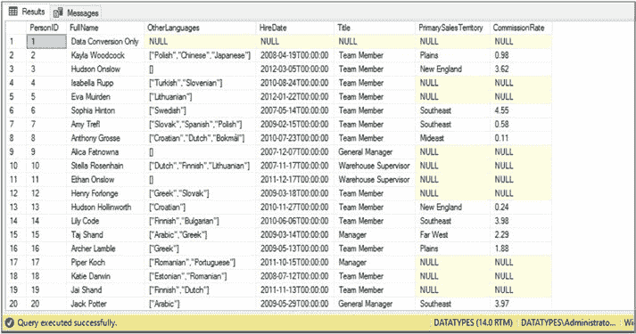

此查询的部分结果可见于图 8-4.

**图 8-4.** 结合使用 `PIVOT` 与 `OPENJSON()` 的结果

使用此方法的局限性在于，在编写查询之前必须知道 JSON 文档中每个键的名称。如果遗漏了任何键名，或者在之后添加了键，数据将不会出现在结果集中。这可能尤其具有挑战性，因为 JSON 文档无法绑定到架构。

**提示** 如果我们使用了 `CROSS APPLY` 而不是 `OUTER APPLY`，则 `PersonID` 为 1 的结果将被省略。

为了将这些数据转换为列并避免行重复，你可以使用 `PIVOT` 运算符。`PIVOT` 运算符通过将某列中的唯一值旋转为单独的列来工作。这也可以描述为将行转换为列。然后，它将根据需要对剩余列执行聚合。使用多个 `CASE` 语句也可以实现相同的效果，但 `PIVOT` 运算符的效率要高得多。

`PIVOT` 运算符的语法包含一个外部查询，后跟两个子查询。第一个子查询包含基础查询，而第二个包含透视规范。由于我们的值通常是文本，并且聚合并不适用，我们将使用 `MAX()` 聚合函数。这在清单 8-4 的查询中进行了演示。

### 基于文档内容的动态拆分

解决在开发时不知道文档内容问题的方法是使用动态 `PIVOT`。这涉及使用动态 SQL 在运行查询之前定义当前要透视的 JSON 键列表。此技术在清单 8-5. 中进行了演示。

**提示** `QUOTENAME()` 是一个系统函数，它通过将值括在方括号中来对其进行分隔。

### 清单 8-5. 结合使用动态 `PIVOT` 与 `OPENJSON()`

```sql
DECLARE @Columns NVARCHAR(MAX) ;
DECLARE @SQL NVARCHAR(MAX) ;

SET @Columns = '' ;

SELECT @Columns += ', p.' + QUOTENAME(JSONName)
FROM (
    SELECT DISTINCT
        JSON.[Key] AS JSONName
    FROM Application.People p
        CROSS APPLY OPENJSON(CustomFields) JSON
) AS cols ;

SET @SQL =
'SELECT
    PersonID
    , FullName
    , ' + STUFF(@Columns, 1, 2, '') + '
FROM
    (
        SELECT
            PersonID
            , FullName
            , JSON.[Key] AS JSONName
            , JSON.value AS JSONValue
        FROM Application.People
            OUTER APPLY OPENJSON(CustomFields) JSON
    ) AS src
    PIVOT
    (
        MAX(JSONValue) FOR JSONName IN ('
        + STUFF(REPLACE(@Columns, ', p.', ',['), 1, 1, '')
        + ')
    ) AS p ;' ;

EXEC (@SQL) ;
```

### 带显式模式的 `OPENJSON()`

当使用带显式模式的 `OPENJSON()` 时，你可以控制返回的结果集的格式。它将返回一个列，对应于你在 `WITH` 子句中指定的每个列，而不是三列的结果集。你还可以指定每列的数据类型。这些数据类型是 T-SQL 数据类型，而不是 JSON 数据类型，因此可以指定诸如 `DATE` 或 `DECIMAL` 之类的类型。例如，考虑清单 [8-6 中的脚本。

### 清单 8-6. 使用带显式模式的 `OPENJSON()`

```sql
DECLARE @CustomFields NVARCHAR(MAX) ;

SET @CustomFields =
    (
        SELECT
            CustomFields
        FROM Application.People
        WHERE PersonID = 2
    ) ;

SELECT *
FROM OPENJSON(@CustomFields)
WITH (
    HireDate DATETIME2
    , Title NVARCHAR(50)
    , PrimarySalesTerritory NVARCHAR(50)
    , CommissionRate DECIMAL(5,2)
) ;
```

此查询返回的结果如 图 8-5. 所示。

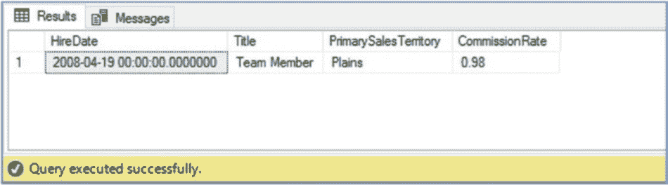


# 第 8 章 拆解 JSON 数据

## 图 8-5. 使用带显式架构的 OPENJSON()的结果

当返回的某一列本身是 JSON 对象时，情况会稍显复杂。例如，考虑代码清单 8-7 中的查询，它在查询中增加了`OtherLanguages`列。由于没有特定的 JSON 数据类型，我们将使用`NVARCHAR(MAX)`，因为它可以作为`NVARCHAR(MAX)`存储在表中。

### 代码清单 8-7. 添加一个 JSON 列

```sql
DECLARE @CustomFields NVARCHAR(MAX) ;

SET @CustomFields =

(

SELECT

CustomFields

FROM Application.People

WHERE PersonID = 2

) ;

SELECT *

FROM OPENJSON(@CustomFields)

WITH (

OtherLanguages NVARCHAR(MAX)

, HireDate DATETIME2

, Title NVARCHAR(50)

, PrimarySalesTerritory NVARCHAR(50)

, CommissionRate DECIMAL(5,2)

) ;
```

此查询返回的结果如图 8-6 所示。

### 图 8-6. 添加 JSON 列后的结果

那么，为什么`OtherLanguages`列返回了`NULL`呢？我们知道该列存在，并且根据本章前面的示例，它包含`PersonID`为 2 的数据。当从`OPENJSON()`返回一个 JSON 对象时，我们必须在`WITH`子句中使用额外的语法来指定该`NVARCHAR`实际代表一个 JSON 对象，如代码清单 8-8 所示。

### 代码清单 8-8. 正确返回 JSON 数组或对象

```sql
DECLARE @CustomFields NVARCHAR(MAX) ;

SET @CustomFields =

(

SELECT

CustomFields

FROM Application.People

WHERE PersonID = 2

) ;

SELECT *

FROM OPENJSON(@CustomFields)

WITH (

OtherLanguages NVARCHAR(MAX) AS JSON

, HireDate DATETIME2

, Title NVARCHAR(50)

, PrimarySalesTerritory NVARCHAR(50)

, CommissionRate DECIMAL(5,2)

) ;
```

现在脚本将返回我们期望的结果，如图 8-7 所示。

### 图 8-7. 正确返回 JSON 数据

当需要拆解多行数据时，在使用`OUTER APPLY`运算符时也可以指定显式架构。请记住，`OUTER APPLY`运算符不会像`CROSS APPLY`那样删除返回`NULL`值的行。代码清单 8-9 演示了这一点。

### 代码清单 8-9. 与 OUTER APPLY 一起使用显式架构

```sql
SELECT

PersonID

, FullName

, JSON.*

FROM Application.People

OUTER APPLY OPENJSON(CustomFields)

WITH (

OtherLanguages

NVARCHAR(MAX) AS JSON

, HireDate DATETIME2

, Title NVARCHAR(50)

, PrimarySalesTerritory

NVARCHAR(50)

, CommissionRate

DECIMAL(5,2)

) JSON ;
```

从图 8-8 中的部分结果可以看出，一些需要进行数据透视处理的数据已经被消除了。然而，问题依然存在：在编写查询之前，你必须知道 JSON 文档中所有可能的键。因此，如果不存在一组离散的可能值，你可能仍然需要使用动态 SQL。

### 图 8-8. 与 OUTER APPLY 一起使用显式架构的结果

## 使用路径表达式的 OPENJSON( )

除了使用显式架构外，`OPENJSON()`还支持 JSON 路径表达式。路径表达式允许你引用 JSON 文档内的特定属性。例如，考虑代码清单 10 中的 JSON 文档。

**提示** 你可能认得这个文档，因为我们在第 7 章创建了它。

### 代码清单 8-10. 带根节点的销售订单

```json
{

"SalesOrders": [

{

"OrderID": 72646,

"CustomerID": 1060,

"SalespersonPersonID": 14,

"OrderDate": "2016-05-18"

},

{

"OrderID": 72738,

"CustomerID": 1060,

"SalespersonPersonID": 14,

"OrderDate": "2016-05-19"

},

{

"OrderID": 72916,

"CustomerID": 1060,

"SalespersonPersonID": 6,

"OrderDate": "2016-05-20"

},

{

"OrderID": 73081,

"CustomerID": 1060,

"SalespersonPersonID": 8,

"OrderDate": "2016-05-24"

}

]

}
```

如果我们对这个文档使用一个基本的`OPENJSON()`语句，它将


# 第 8 章：解析 JSON 数据

返回整个`SalesOrders`数组，部分展示如图 8-9 所示。

### 图 8-9. 基本 OPENJSON()函数的结果

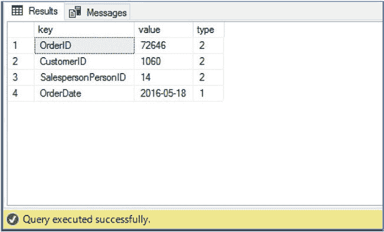

然而，如果我们使用`PATH`语句，就可以选择只返回此数组中的第*n*个项。这将极大地改变结果集，因为`OPENJSON()`能够将数组元素内的每个项映射到关系列，这意味着将为元素内的每个键返回一行，而不是返回包含 JSON 文档的单行，如图 8-10 所示，该图展示了解析第一个数组元素（`OrderID`为 72646）的结果。

### 图 8-10. 解析单个数组元素的结果

那么，让我们看看如何得到这个结果。首先，我们必须理解路径表达式可以在两种模式下运行：`strict`（严格）或`lax`（宽松）。如果你在`lax`模式下运行路径表达式，并且该表达式包含错误，`OPENJSON()`会“忽略错误”并返回空结果集。而如果你使用`strict`模式，一旦路径表达式包含错误，`OPENJSON()`就会抛出错误消息。

我们现在必须理解路径本身的元素。首先，我们使用`$`来指定上下文，后跟点号分隔的嵌套键名。最后，我们在方括号中指定数组元素编号。因此，要生成图 8-10 中的结果，我们会使用代码清单 8-11 中的查询。

### 代码清单 8-11. 使用路径表达式返回单个数组元素

```sql
DECLARE @JSON NVARCHAR(MAX) ;

SET @JSON = '{
"SalesOrders": [
    {
        "OrderID": 72646,
        "CustomerID": 1060,
        "SalespersonPersonID": 14,
        "OrderDate": "2016-05-18"
    },
    {
        "OrderID": 72738,
        "CustomerID": 1060,
        "SalespersonPersonID": 14,
        "OrderDate": "2016-05-19"
    },
    {
        "OrderID": 72916,
        "CustomerID": 1060,
        "SalespersonPersonID": 6,
        "OrderDate": "2016-05-20"
    },
    {
        "OrderID": 73081,
        "CustomerID": 1060,
        "SalespersonPersonID": 8,
        "OrderDate": "2016-05-24"
    }
]
}' ;

SELECT *
FROM OPENJSON(@JSON, 'lax $.SalesOrders[0]') ;
```

你会注意到，在此脚本中，传入 JSON 文档后，我们使用`lax`（或者，也可以使用`strict`）关键字来指定我们将使用的模式。空格之后是路径表达式本身。在这里，我们从`$`开始以设置上下文，然后指向`SalesOrders`键。接着，我们使用方括号来指定我们希望使用的数组元素。

**提示** JSON 路径表达式总是使用以零为基础的数组。

## 将数据解析到表中

现在你可以想象，简单的循环技术可以用来解析数组内的每个元素。例如，考虑代码清单 8-12 中的脚本。此脚本会将每个数组元素解析到一个名为`#Orders`的临时表中。

### 代码清单 8-12. 将每个元素解析到临时表

```sql
DECLARE @JSON NVARCHAR(MAX) ;

SET @JSON = '{
"SalesOrders": [
    {
        "OrderID": 72646,
        "CustomerID": 1060,
        "SalespersonPersonID": 14,
        "OrderDate": "2016-05-18"
    },
    {
        "OrderID": 72738,
        "CustomerID": 1060,
        "SalespersonPersonID": 14,
        "OrderDate": "2016-05-19"
    },
    {
        "OrderID": 72916,
        "CustomerID": 1060,
        "SalespersonPersonID": 6,
        "OrderDate": "2016-05-20"
    },
    {
        "OrderID": 73081,
        "CustomerID": 1060,
        "SalespersonPersonID": 8,
        "OrderDate": "2016-05-24"
    }
]
}' ;

CREATE TABLE #Orders
(
    OrderID INT,
    CustomerID INT,
    SalespersonPersonID INT,
    OrderDate DATE
) ;

DECLARE @ArrayElement INT = 0 ;
DECLARE @path NVARCHAR(MAX) = 'lax $.SalesOrders[' + CAST(@ArrayElement AS NVARCHAR) + ']' ;

WHILE @ArrayElement <=3
BEGIN
    INSERT INTO #Orders (OrderID, CustomerID, SalespersonPersonID, OrderDate)
    SELECT
        OrderID
        , CustomerID
        , SalespersonPersonID
        , OrderDate
    FROM OPENJSON(@JSON, @Path)
    WITH( OrderID INT, CustomerID INT, SalespersonPersonID INT, OrderDate DATE) ;

    SET @ArrayElement = @ArrayElement + 1 ;
    SET @path = 'lax $.SalesOrders[' + CAST(@ArrayElement AS NVARCHAR) + ']' ;
END

SELECT * FROM #Orders ;
```


# DROP TABLE #Orders;

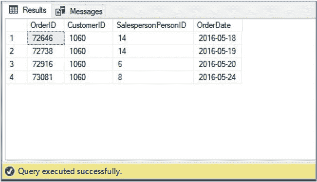

## 第八章 分解 JSON 数据

*图 8-11. 分解多个数组元素的结果*

此脚本中的最终 `SELECT` 语句生成了如图 8-11 所示的结果。

**注意**
虽然我在本例中使用了 `WHILE` 循环，但这仅仅是为了提供一个清晰且简单的示例，来说明如何使用路径表达式。在生产代码中，我绝不会使用 `WHILE` 循环或 `CURSOR`。总是有办法使用基于集合的方法来达到相同的结果。

## 总结

JSON 数据可以通过使用 `OPENJSON()` 函数分解为表格形式的结果集。`OPENJSON()` 可以在有或没有显式架构的情况下使用。当未显式定义架构时，使用 `WITH` 子句的 `OPENJSON()` 会返回一个标准行集，详细说明文档中每个节点的键（`name`）、`value` 和 JSON 数据类型 `ID`。

当提供了显式架构时，`OPENJSON()` 将返回一个格式化的结果集，其中包含 `WITH` 子句中指定的每一列。如果你在开发时就知道文档中的每个节点，使用显式架构可以避免在开发时进行数据透视。但是，如果列列表不是离散的，则需要动态 SQL，在处理之前构建可能的结果列表。

`OPENJSON()` 也支持 JSON 路径表达式。向该函数传递路径表达式，可以让您导航到数组中的特定项，这意味着您可以将数据分解到更精细的级别。例如，您可以使用循环方法，将每个数组元素的内容分解为关系数据，而不是将一个 JSON 对象数组分解为一个表。

# 第九章 处理 JSON 数据类型

在本章中，我将讨论允许开发人员查询 JSON 数据的 T-SQL 函数。然后，我将讨论如何为 JSON 数据创建索引。

## 查询 JSON 数据

SQL Server 引入了 `JSON_VALUE()`、`JSON_QUERY()`、`JSON_MODIFY()` 和 `ISJSON()` 函数，以帮助开发人员检查和操作 JSON 数据。以下各节将讨论这些函数。

### 使用 ISJSON()

由于 JSON 数据存储在 `NVARCHAR(MAX)` 列中，而不是使用其自己的数据类型，因此在针对元组调用 JSON 函数之前，确保它包含有效的 JSON 文档非常有用。`ISJSON()` 函数将评估一个字符串，检查它是否是有效的 JSON 文档。如果字符串是有效的 JSON，该函数将返回值 1；如果不是，则返回 0。因此，该函数的一个常见用法是在 `IF` 语句中。例如，考虑清单 9-1 中的查询。

© Peter A. Carter 2018
P. A. Carter, *SQL Server Advanced Data Types*, [`doi.org/10.1007/978-1-4842-3901-8_9`](https://doi.org/10.1007/978-1-4842-3901-8_9)

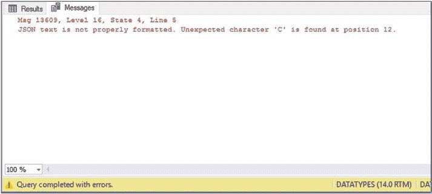

*清单 9-1. 格式不正确的 JSON*

```sql
DECLARE @JSON NVARCHAR(MAX) ;
SET @JSON = '{"I am not:"Correctly formatted"}' ;
SELECT *
FROM OPENJSON(@JSON) ;
```

由于键名缺少一个闭合的双引号，查询将失败，并显示如图 9-1 所示的错误。

*图 9-1. 无效 JSON 引发的错误*

为了避免脚本失败，我们可以在 `IF` 语句中使用 `ISJSON()` 函数，如清单 9-2 所示。

*清单 9-2. 在 IF 语句中使用 ISJSON()*

```sql
DECLARE @JSON NVARCHAR(MAX) ;
SET @JSON = '{"I am not:"Correctly formatted"}' ;
IF ISJSON(@JSON) = 1
BEGIN
    SELECT *
    FROM OPENJSON(@JSON) ;
END
```

这一次，脚本将无错误地完成，因为针对 `OPENJSON()` 函数的查询永远不会运行。

**提示**
有关 `OPENJSON()` 用法的完整说明，请参见第 8 章。

`ISJSON()` 函数也可以用在查询的 `WHERE` 子句中...


# 第 9 章 处理 JSON 数据类型

## 清单 9-3. 过滤非 JSON 的结果

```sql
--创建临时表
CREATE TABLE #JsonTemp
(
    JSONData NVARCHAR(MAX)
) ;

--向临时表中插入一个 JSON 值和一个非 JSON 值
INSERT INTO #JsonTemp
VALUES ('{"I am JSON":"True"}'),
       ('I am JSON - False') ;

--仅对数据为 JSON 的行调用 OPENJSON()
SELECT JSON.*
FROM #JsonTemp Base
OUTER APPLY OPENJSON(Base.JSONData) JSON
WHERE ISJSON(Base.JSONData) = 1 ;

--删除临时表
DROP TABLE #JsonTemp ;
```

因为 `WHERE` 子句在应用 `OPENJSON()` 函数之前移除了所有不包含有效 JSON 数据的行，所以脚本成功完成并返回如图 9-2 所示的结果。

***图 9-2.** 过滤非 JSON 数据的结果*

## 使用 JSON_VALUE( )

`JSON_VALUE()` 函数可用于从 JSON 文档中返回单个标量值。该函数接受两个参数。第一个参数是 JSON 文档，从中检索数据。第二个参数是指向您希望返回的值的路径表达式。如第 8 章所述，当与 `OPENJSON()` 一起使用路径表达式时，路径表达式可以在 `lax` 模式或 `strict` 模式下使用。使用 `lax` 模式时，如果路径表达式出错，将返回 `NULL` 结果，且不会引发错误。在 `strict` 模式下使用时，如果路径表达式出错，则会抛出错误。

返回值的数据类型始终为 `NVARCHAR(4000)`。这意味着如果值超过 4000 个字符，`JSON_VALUE()` 将根据使用的是 `lax` 模式还是 `strict` 模式，返回 `NULL` 或引发错误。

为了更仔细地了解 `JSON_VALUE()` 函数，让我们考虑 `WideWorldImporters` 数据库中的 `Warehouse.StockItems` 表。该表的 `CustomFields` 列包含一个 JSON 文档，其中有一个名为 `Tags` 的键，其值是一个包含产品标签的数组。

清单 9-4 中的脚本将首先用单个产品的 `CustomFields` 内容填充一个变量。随后，在将文档传递给 `JSON_VALUE()` 函数之前，它会使用 `ISJSON()` 函数检查该变量是否包含有效的 JSON 文档。

`JSON_VALUE()` 函数的路径表达式首先指定我们要在 `lax` 模式下使用路径表达式。然后使用 `$` 表示上下文，再使用点分隔的路径指向我们要提取的节点。因为 `Tags` 节点是一个数组，而 `JSON_VALUE()` 函数只能返回标量值，我们将使用方括号来表示我们希望提取的数组中的元素。这是强制性的语法，即使数组中只有一个元素也是如此。

**提示** 数组总是从零开始索引。

## 清单 9-4. 对 JSON 文档使用 JSON_VALUE()

```sql
DECLARE @JSON NVARCHAR(MAX) ;

--StockItem ID 61 的 CustomFields 列包含以下 JSON 文档：
--'{ "CountryOfManufacture": "China", "Tags": ["Radio Control","Realistic Sound"], "MinimumAge": "10" }'
SET @JSON = (SELECT CustomFields FROM Warehouse.StockItems WHERE StockItemID = 61) ;

IF ISJSON(@JSON) = 1
BEGIN
    SELECT JSON_VALUE(@JSON,'lax $.Tags[0]') ;
END
```

此脚本产生如图 9-3 所示的结果。

***图 9-3.** 对 JSON 文档使用 JSON_VALUE() 的结果*

那么，如果我们想对表中的列使用 `JSON_VALUE()` 函数呢？由于它是一个标量函数，我们不能使用 `OUTER APPLY` 或


# 第 9 章 处理 JSON 数据类型

CROSS APPLY。相反，我们必须在查询的 SELECT 列表中包含它。

如代码清单 9-5 所示。

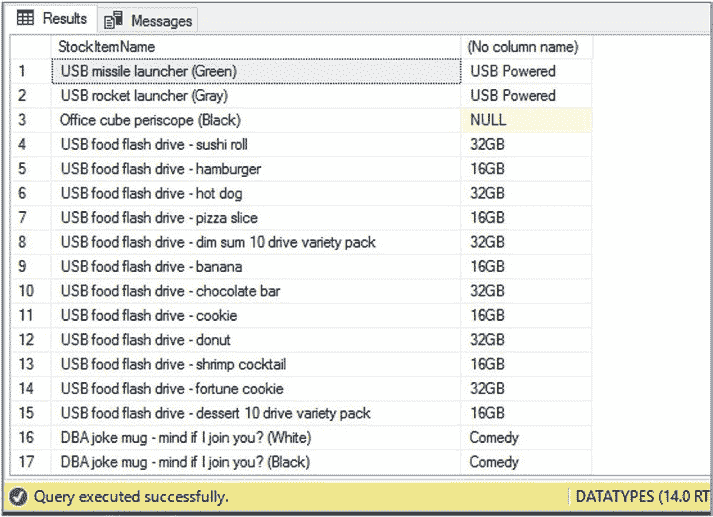

## 代码清单 9-5。在 SELECT 列表中使用 JSON_VALUE()

```sql
USE WideWorldImporters
GO

SELECT
    StockItemName
    , JSON_VALUE(customfields,'lax $.Tags[0]')
FROM Warehouse.StockItems ;
```

你会注意到，我们没有传入变量，而是直接传入了包含 JSON 文档的列名。此查询的部分结果如图 9-4 所示。

## 图 9-4。对表使用 JSON_VALUE()的结果

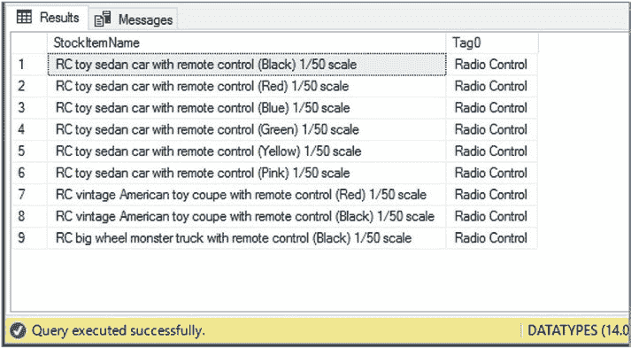

我们原始的 JSON 文档引用了库存物品 ID 61，这是一个遥控车。我们还可以在查询的`WHERE`子句中使用`JSON_VALUE`来过滤结果集，以便只返回第一个标签包含"Radio Control"值的行。如代码清单 9-6 所示，在该清单中，我们还通过使用`ISJSON()`函数来增强查询，以确保只返回有效的 JSON 文档。

## 代码清单 9-6。在 WHERE 子句中使用 JSON_VALUE()

```sql
USE WideWorldImporters
GO

SELECT
    StockItemName
    , JSON_VALUE(CustomFields,'lax $.Tags[0]') AS Tag0
FROM Warehouse.StockItems
WHERE JSON_VALUE(CustomFields,'lax $.Tags[0]') = 'Radio Control'
    AND ISJSON(CustomFields) = 1 ;
```

此查询的结果如图 9-5.所示。

## 图 9-5。在 WHERE 子句中使用 JSON_VALUE()的结果

遥控车产品的第三个标签表示该物品是否为复古款。产品表中有两款复古车。因此，在代码清单 9-7,中，我们将进一步过滤结果集，仅包含第三个标签值为"Vintage"的产品。我们还将增强`SELECT`列表，使其包含数组中的前三个标签。最后，我们将更改`WHERE`子句中的`JSON_VALUE()`函数，使用严格路径表达式，这样出错将导致查询失败。

## 代码清单 9-7。增强查询

```sql
USE WideWorldImporters
GO

SELECT
    StockItemName
    , JSON_VALUE(CustomFields,'lax $.Tags[0]') AS Tag0
    , JSON_VALUE(CustomFields,'lax $.Tags[1]') AS Tag1
    , JSON_VALUE(CustomFields,'lax $.Tags[2]') AS Tag2
FROM Warehouse.StockItems
WHERE JSON_VALUE(CustomFields,'strict $.Tags[0]') = 'Radio Control'
    AND JSON_VALUE(CustomFields,'strict $.Tags[2]') = 'Vintage'
    AND ISJSON(CustomFields) = 1 ;
```

不幸的是，这一次，即使`ISJSON()`函数确保结果集中不包含任何无效的 JSON 文档，查询仍然返回了如图 9-6.所示的错误。这是因为`CustomFields`列中的并非所有 JSON 文档都具有`Tags`键。而在那些有`Tags`键的文档中，也并非所有文档都有三个标签。因此，`WHERE`子句中两个`JSON_VALUE()`调用的路径表达式无效。因为我们从`lax`模式更改为`strict`模式，所以查询失败。

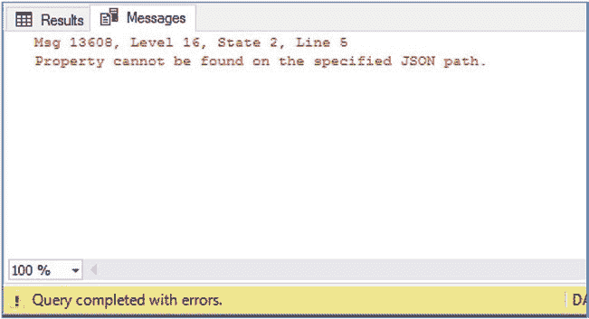

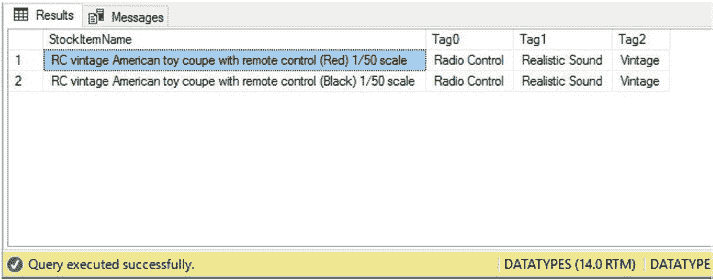

## 图 9-6。查询引发的错误

如果我们改回使用`lax`模式路径表达式，查询将返回如图 9-7 所示的结果。

## 图 9-7。使用 lax 模式路径表达式的查询结果

在 SQL Server 2017 及更高版本中，还可以将路径表达式作为变量传入。因此，代码清单 9-8 中的查询将返回与图 9-7.所示相同的结果。

**提示** 您必须使用 SQL Server 2017 或更高版本，才能运行代码清单 9-8.中的查询。

## 代码清单 9-8。使用变量作为路径

```sql
USE WideWorldImporters
GO

DECLARE @Path NVARCHAR(MAX) = 'lax $.Tags[2]' ;

SELECT
    StockItemName
```


## 使用 JSON_QUERY()

与返回*标量值*的 `JSON_VALUE()` 不同，`JSON_QUERY()` 可用于从 JSON 文档中提取 JSON 对象或数组。

例如，考虑清单 9-9 中的脚本。该脚本使用了我们在清单 9-4 中使用过的同一个 JSON 文档，该清单从库存物料 ID 为 61 的 Tags 数组中提取了单个数组元素。然而，这次我们将提取整个 Tags 数组，而不是提取单个数组元素。因为我们提取的是整个数组，所以不需要像使用 `JSON_VALUE()` 处理该文档时那样，在方括号中指定数组元素编号。

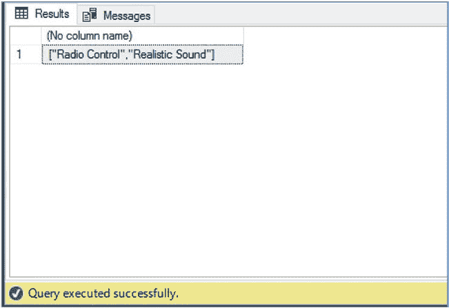

**清单 9-9.** 针对 JSON 文档使用 `JSON_QUERY()`

```sql
DECLARE @JSON NVARCHAR(MAX) ;

--StockItem ID 61 的 CustomFields 列包含以下 JSON 文档：
--'{ "CountryOfManufacture": "China", "Tags": ["Radio Control","Realistic Sound"], "MinimumAge": "10" }'

SET @JSON = (SELECT CustomFields FROM Warehouse.StockItems
             WHERE StockItemID = 61) ;

IF ISJSON(@JSON) = 1
BEGIN
    SELECT JSON_QUERY(@Json,'lax $.Tags') ;
END
```

该脚本的结果如图 9-8 所示。

**图 9-8.** 针对 JSON 文档使用 `JSON_QUERY()` 的结果
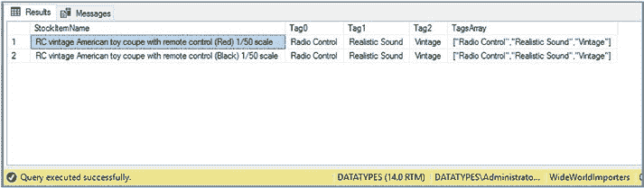

与 `JSON_VALUE()` 一样，如果我们想对表中的列使用 `JSON_QUERY()`，我们应该在 `SELECT` 列表中使用它，而不是使用 `CROSS APPLY` 或 `OUTER APPLY` 运算符。清单 9-10 演示了 `JSON_VALUE()` 和 `JSON_QUERY()` 之间的区别。这里，我们使用了与清单 9-7 中相同的查询，但对其进行了增强，在结果集中包含一列，该列使用 `JSON_QUERY()` 包含整个 Tags 数组。

**清单 9-10.** 在 `SELECT` 列表中使用 `JSON_QUERY()`

```sql
USE WideWorldImporters
GO

SELECT
    StockItemName
    , JSON_VALUE(CustomFields,'lax $.Tags[0]') AS Tag0
    , JSON_VALUE(CustomFields,'lax $.Tags[1]') AS Tag1
    , JSON_VALUE(CustomFields,'lax $.Tags[2]') AS Tag2
    , JSON_QUERY(CustomFields,'lax $.Tags') AS TagsArray
FROM Warehouse.StockItems
WHERE JSON_VALUE(CustomFields,'lax $.Tags[0]') = 'Radio Control'
AND JSON_VALUE(CustomFields,'lax $.Tags[2]') = 'Vintage'
AND ISJSON(CustomFields) = 1 ;
```

此查询返回的结果如图 9-9 所示。

**图 9-9.** 在 `SELECT` 列表中使用 `JSON_QUERY()` 的结果

`JSON_QUERY()` 函数也可以在 `WHERE` 子句中使用。考虑清单 9-11 中的查询，该查询已被重写，以便使用 `JSON_QUERY()` 函数筛选出 JSON 文档中确实包含空 Tags 数组的任何行。你会注意到该查询混合使用了 lax 模式和 strict 模式。

**清单 9-11.** 在 `WHERE` 子句中使用 `JSON_QUERY()`

```sql
USE WideWorldImporters
GO

SELECT
    StockItemName
    , JSON_VALUE(CustomFields,'lax $.Tags[0]') AS Tag0
    , JSON_VALUE(CustomFields,'lax $.Tags[1]') AS Tag1
    , JSON_VALUE(CustomFields,'lax $.Tags[2]') AS Tag2
    , JSON_QUERY(CustomFields,'lax $.Tags') AS TagsArray
FROM Warehouse.StockItems
WHERE JSON_QUERY(CustomFields,'strict $.Tags') <> '[]'
AND ISJSON(CustomFields) = 1 ;
```

如果只向路径表达式传递文档上下文 (`$`)，则将返回整个 JSON 文档。同样值得注意的是，从 SQL Server 2017 开始，可以像对 `OPENJSON()` 和 `JSON_VALUE()` 那样，使用变量来传递路径。这两个概念同样适用于 `JSON_VALUE()`。


如代码清单 9-12 所示，该清单使用一个变量将仅文档上下文的路径表达式传递到结果集中的一个附加列。

**提示** 你必须运行 SQL Server 2017 或更高版本才能执行代码清单 9-12 中的查询。

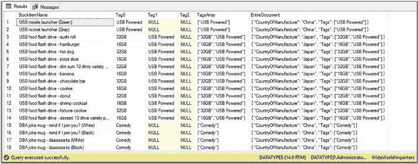

# 第 9 章 处理 JSON 数据类型

### 代码清单 9-12. 使用路径变量和文档上下文

```sql
USE WideWorldImporters
GO

DECLARE @Path NVARCHAR(MAX) = '$' ;

SELECT
    StockItemName
    , JSON_VALUE(CustomFields,'lax $.Tags[0]') AS Tag0
    , JSON_VALUE(CustomFields,'lax $.Tags[1]') AS Tag1
    , JSON_VALUE(CustomFields,'lax $.Tags[2]') AS Tag2
    , JSON_QUERY(CustomFields,'lax $.Tags') AS TagsArray
    , JSON_QUERY(CustomFields, @Path) AS EntireDocument
FROM Warehouse.StockItems
WHERE JSON_QUERY(CustomFields,'strict $.Tags') <> '[]'
    AND ISJSON(CustomFields) = 1 ;
```

此查询的部分结果可以在图 9-10 中看到。

### 图 9-10. 使用路径变量和文档上下文的结果

# 第 9 章 处理 JSON 数据类型

## 使用 JSON_MODIFY()

到目前为止，我们检查的所有 JSON 函数都允许我们查询 JSON 文档。然而，`JSON_MODIFY()` 函数，顾名思义，允许我们修改 JSON 文档的内容。为了进一步解释这一点，让我们再次使用代码清单 9-4 和代码清单 9-9 中用过的、针对库存物品 ID 61 的 `CustomFields` JSON 文档。

代码清单 9-13 中的脚本将修改 `Tags` 数组的第二个元素，将其更新为 'Very Realistic Sound'。该函数的输出是修改后的完整文档。

### 代码清单 9-13. 更新一个值

```sql
DECLARE @JSON NVARCHAR(MAX) ;

--库存物品 ID 61 的 CustomFields 列包含以下 JSON 文档：
--'{ "CountryOfManufacture": "China", "Tags": ["Radio Control","Realistic Sound"], "MinimumAge": "10" }'

SET @JSON = (SELECT CustomFields FROM Warehouse.StockItems
    WHERE StockItemID = 61) ;

IF ISJSON(@JSON) = 1
BEGIN
    SELECT JSON_MODIFY(@Json,'lax $.Tags[1]', 'Very Realistic Sound') ;
END
```

此脚本返回图 9-11 中的结果。

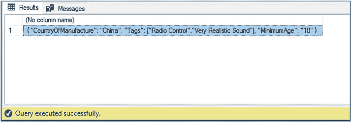

# 第 9 章 处理 JSON 数据类型

### 图 9-11. 更新一个值的结果

你可以看到该函数的输出随后如何用于更新包含 JSON 文档的表中的一行，如代码清单 9-14 所示。这里，我们不是传入一个变量作为 JSON 文档，而是传入表中的 `CustomFields` 列。

### 代码清单 9-14. 使用 JSON_MODIFY() 更新表中的一行

```sql
USE WideWorldImporters
GO

UPDATE StockItems
SET CustomFields = JSON_MODIFY(CustomFields,'lax $.Tags[1]', 'Very Realistic Sound')
FROM Warehouse.StockItems
WHERE StockItemID = 61 ;
```

`JSON_MODIFY()` 函数也可用于向数组添加一个元素。考虑代码清单 9-15 中的查询，它通过向 `Tags` 数组添加一个额外的元素，将库存物品 ID 61 标记为复古的。你会注意到，因为我们是在向数组添加一个值，而不是更新现有值，所以在路径表达式的开头使用了 `append` 关键字。另请注意，因为我们更新的是整个数组，而不是单个元素，所以方括号中的数组元素不包含在路径中。

### 代码清单 9-15. 添加一个额外的数组元素

```sql
USE WideWorldImporters
GO

UPDATE StockItems
SET CustomFields = JSON_MODIFY(CustomFields,'append lax $.Tags', 'Vintage')
FROM Warehouse.StockItems
WHERE StockItemID = 61 ;
```

现在让我们使用代码清单 9-16 中的查询来检查更新后的记录。

### 代码清单 9-16. 检查更新后的记录

```sql
USE WideWorldImporters
GO

SELECT
    StockItemName
    , JSON_VALUE(CustomFields,'lax $.Tags[0]') AS Tag0
```


# 第九章 处理 JSON 数据类型

## 查询示例

```sql
, JSON_VALUE(CustomFields,'lax $.Tags[1]') AS Tag1
, JSON_VALUE(CustomFields,'lax $.Tags[2]') AS Tag2
, JSON_QUERY(CustomFields,'lax $.Tags') AS TagsArray
FROM Warehouse.StockItems
WHERE StockItemID = 61 ;
```

此查询返回图 9-12 所示的结果。你会注意到第二个数组元素现在显示为“Very Realistic Sound”，并且数组现在包含了第三个元素，将该产品标记为复古。

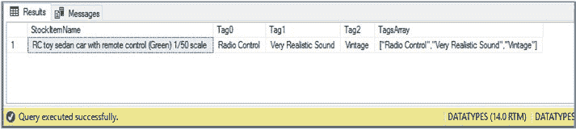

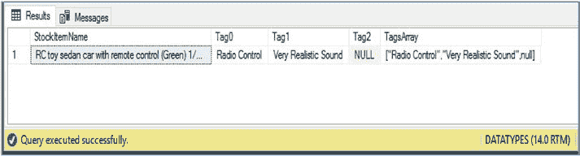

***图 9-12.** 检查修改后行的结果*

正如你所料，`MODIFY_JSON()` 函数也可以用于删除数据。这是通过将值更新为 `NULL` 来实现的。例如，假设将库存物品 ID 61 标记为复古是一个错误。我们可以使用清单 9-17 中的查询来纠正这个错误。

***清单 9-17.*** 使用 `MODIFY_JSON()` 删除数据

```sql
USE WideWorldImporters
GO
UPDATE StockItems
SET CustomFields = JSON_MODIFY(CustomFields,
    'lax $.Tags[2]', NULL)
FROM Warehouse.StockItems
WHERE StockItemID = 61 ;
```

重新运行清单 9-16 中的查询，现在会返回图 9-13 所示的结果。

***图 9-13.** 重新检查修改后行的结果*

或者，我们可以使用清单 9-18 中的查询删除整个 `Tags` 数组。

***清单 9-18.*** 删除 `Tags` 数组

```sql
USE WideWorldImporters
GO
UPDATE StockItems
SET CustomFields = JSON_MODIFY(CustomFields,'lax
    $.Tags',NULL)
FROM Warehouse.StockItems
WHERE StockItemID = 61 ;
```

清单 9-19 中的查询允许我们检查修改后的 JSON 文档。你会注意到 `Tags` 数组已不存在。

***清单 9-19.*** 检查修改后的文档

```sql
USE WideWorldImporters
GO
SELECT
    StockItemName
    , JSON_QUERY(CustomFields,'lax $') AS EntireDocument
FROM Warehouse.StockItems
WHERE StockItemID = 61 ;
```

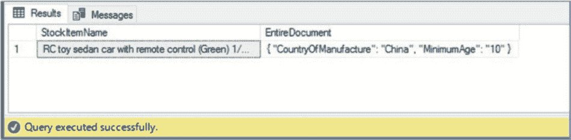

此查询的结果如图 9-14 所示。

***图 9-14.** 检查修改后的 JSON 文档*

## 为 JSON 数据创建索引

当查询一个表，并根据 JSON 文档内的属性进行筛选、分组或排序时，你可以通过为数据创建索引来提高查询性能。由于 JSON 不像 `XML` 那样有自己的数据类型，因此没有像 `XML` 索引那样的 JSON 索引。相反，要为 JSON 属性创建索引，你必须创建一个包含 `JSON_VALUE()` 调用的计算列，该调用反映了你正在优化的查询的逻辑。然后，你可以在此计算列上创建索引，`SQL Server` 在优化查询时将使用此索引。

**注意** 实际查询性能取决于许多因素，包括系统硬件和其他资源限制，例如可能同时运行的其他查询。本节中的性能分析旨在说明潜在影响，但性能应始终在你自己的服务器上、在真实的工作负载下进行测试。

在演示此技术之前，我们首先记录对 `Warehouse.StockItems` 表进行查询的性能基线。我们将在尝试优化的查询运行前，在会话中打开 `TIME STATISTICS` 来实现这一点。在此之前，我们将首先将数据从 `StockItems` 表复制到一个新表。这样做的原因有两个。首先，`StockItems` 表已经有多个索引，这可能会影响我们的结果。第二个原因是 `StockItems` 表是带有索引的系统版本控制表。这意味着当我们修改表以添加计算列时，不能简单地使用 `ALTER TABLE` 脚本，而是需要将数据编写到临时表中，删除并重新创建主表和归档表，然后编写脚本。


# 第九章 处理 JSON 数据类型

数据回写。这段代码量会分散对如何添加计算列的注意力，而计算列正是本练习的重点。如代码清单 9-20 所示。

**提示** 我们使用 `DBCC FREEPROCCACHE` 从计划缓存中删除任何现有计划。然后，我们使用 `DBCC DROPCLEANBUFFERS` 从缓冲区缓存中移除未被修改的页。这有助于使测试公平。

## 创建性能基线

```sql
USE WideWorldImporters
GO

--将数据复制到新表
SELECT *
INTO Warehouse.NewStockItems
FROM Warehouse.StockItems

--清除计划缓存
DBCC FREEPROCCACHE

--清除缓冲区缓存
DBCC DROPCLEANBUFFERS

--打开统计信息
SET STATISTICS TIME ON

SELECT
    StockItemName
    , JSON_VALUE(CustomFields,'lax $.Tags[0]') AS Tag0
    , JSON_VALUE(CustomFields,'lax $.Tags[1]') AS Tag1
    , JSON_VALUE(CustomFields,'lax $.Tags[2]') AS Tag2
    , JSON_QUERY(CustomFields,'lax $.Tags') AS TagsArray
FROM Warehouse.NewStockItems
WHERE JSON_VALUE(CustomFields,'lax $.Tags[0]') = 'Radio Control' ;
```

图 9-15 中的执行结果显示，该查询执行耗时 `6ms`。

*图 9-15. 时间统计*

现在，让我们使用与 `WHERE` 子句相同的逻辑，在 `Warehouse.StockItems` 表上创建一个计算列。这可以通过代码清单 9-21 中的脚本来实现。

## 创建计算列

```sql
USE WideWorldImporters
GO

ALTER TABLE Warehouse.NewStockItems
ADD CustomFieldsTag0 AS JSON_VALUE(CustomFields,
    'lax $.Tags[0]') ;
```

现在，我们可以为计算列创建索引（这也会导致该列被持久化，而不是在查询时即时计算），如代码清单 9-22 所示。

## 为计算列创建索引

```sql
USE WideWorldImporters
GO

CREATE NONCLUSTERED INDEX NCI_CustomFieldsTag0
ON Warehouse.NewStockItems(CustomFieldsTag0) ;
```

现在，让我们再次使用代码清单 9-23 中的简化脚本来检查查询性能。

## 检查索引性能

```sql
USE WideWorldImporters
GO

--清除计划缓存
DBCC FREEPROCCACHE

--清除缓冲区缓存
DBCC DROPCLEANBUFFERS

--打开统计信息
SET STATISTICS TIME ON

SELECT
    StockItemName
    , JSON_VALUE(CustomFields,'lax $.Tags[0]') AS Tag0
    , JSON_VALUE(CustomFields,'lax $.Tags[1]') AS Tag1
    , JSON_VALUE(CustomFields,'lax $.Tags[2]') AS Tag2
    , JSON_QUERY(CustomFields,'lax $.Tags') AS TagsArray
FROM Warehouse.NewStockItems
WHERE JSON_VALUE(CustomFields,'lax $.Tags[0]') = 'Radio Control' ;
```

从图 9-16 所示的时间统计中可以看到，查询在 `3ms` 内执行完成。性能提升了 50%！

*图 9-16. 检查索引性能的结果*

**提示** 由于 `NewStockItems` 表非常小，查询优化器有可能选择不使用你的索引。如果发生这种情况，你可以通过添加 `WITH (INDEX(NCI_CustomFieldsTag0))` 查询提示来强制它使用索引。但至关重要的一点是，一般来说，优化器是智能的，很少应该给它提示。如果你确实需要使用提示，那么你应该始终与优化器协作，而不是对抗它。

例如，如果优化器错误地选择了 `LOOP JOIN` 物理运算符，则强制它使用 `MERGE JOIN` 或 `HASH JOIN`。不要替它选择哪个更好！

## 总结

SQL Server 提供了使用 `ISJSON()`、`JSON_VALUE()`、`JSON_QUERY()` 和 `JSON_MODIFY()` 函数来查询和修改 JSON 数据的能力。

`ISJSON()` 函数提供了一种简单的验证，用于检查文档是否具有有效的 JSON 格式。如果文档是 JSON，它返回 `1`；如果不是，则返回 `0`。

`JSON_VALUE()` 函数可以包含在查询的 `SELECT` 列表、`WHERE` 子句、`ORDER BY` 子句或 `GROUP BY` 子句中。它返回一个


第 9 章 处理 JSON 数据类型

`JSON_QUERY()`函数也可包含在`SELECT`列表、`WHERE`子句、`ORDER BY`或`GROUP BY`中，但它返回的是 JSON 对象或数组，而非单个标量值。与`JSON_VALUE()`类似，返回的对象基于传递给函数的路径表达式。

`MODIFY_JSON()`函数可用于更新、插入或删除键值。该函数接收一个 JSON 文档和路径表达式作为参数，并返回修改后的完整文档，这使其易于在标准`UPDATE`语句中使用。路径表达式中可选的`append`关键字用于表示意图是向数组添加一个新值，而非修改现有值。使用`NULL`更新键值会删除该键。

可以通过为 JSON 文档的属性创建索引来提升查询性能。具体方法是根据你希望优化的路径表达式创建一个计算列，然后在该计算列上创建索引。这样，当查询包含 JSON 数据的列时，查询优化器就能使用该索引。

第 10 章 理解空间数据

空间数据是描述位置的数据。据说世界上 80%的数据都包含空间元素，因此对于许多数据层应用而言，构建或查询空间数据的能力可能至关重要。本章将概述空间数据及其在 SQL Server 中的实现，然后再探讨 SQL Server 实现中所采用的空间标准。

**注意** 本章旨在提供空间数据的理论概述。实际使用示例请参见第 11 章。

理解空间数据

SQL Server 提供了两种能够存储空间数据的数据类型：`GEOMETRY`和`GEOGRAPHY`。这些数据类型通过 CLR（公共语言运行时）实现，其底层是.NET 类，这些类提供了一系列允许你与数据交互的方法和属性。

© Peter A. Carter 2018

P. A. Carter, *SQL Server 高级数据类型*,
<https://doi.org/10.1007/978-1-4842-3901-8_10>

**注意** 一个地理空间对象可被称为一个几何体（geometry），简单对象称为原始几何体，对象的集合称为几何体集合。由于`geometry`也是以平面地球模型实现空间数据的数据类型名称，这可能会引起混淆。因此请注意，当本章指代一个地理空间对象时，将使用小写的`geometry`一词。当指代数据类型时，该词将使用大写字母（`GEOMETRY`）。

`GEOMETRY`数据类型使用笛卡尔坐标系，提供了一个平面地球模型。当你处理二维对象或无需考虑地球曲率的较小对象时，`GEOMETRY`是应使用的正确数据类型。

使用`GEOMETRY`数据类型时，对象使用 x 轴和 y 轴进行标绘。例如，图 10-1 中的点位于（或标绘在）坐标（5, 3）。

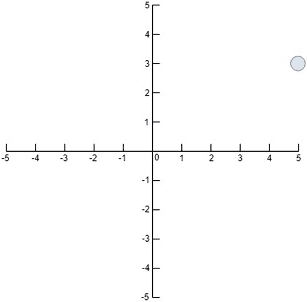

*图 10-1 在笛卡尔系统中标绘一个点*

**提示** 一个形状被称为一个面（surface）。

类似地，图 10-2 中的多边形（封闭的面）使用坐标（-1 -1, -1 2, 2 2, 2 -1, -1 -1）绘制而成。

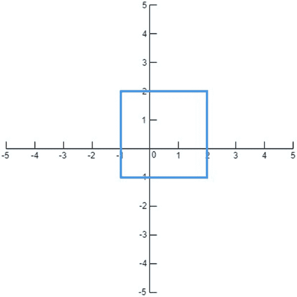

*图 10-2 在笛卡尔系统中标绘一个多边形*

另一方面，`GEOGRAPHY`数据类型使用一个球体地球模型（实际上是多个球体地球模型），非常适合表示必须考虑地球曲率的三维对象或大面积区域。


## 理解空间数据

当处理球面地球模型的数据时，一个点可以通过提供**经度**和**纬度**来标识，而不是`x`和`y`坐标。

经线，也称为子午线，表示某点距一条称为本初子午线的基准经线向东或向西的度数。本初子午线穿过伦敦的格林威治区，被认为是东西半球的交汇点。有时，经度坐标以正负值表示，本初子午线以东的子午线为正值，以西的为负值。另一些时候，子午线总是以正数表示，并使用`E`（东）或`W`（西）来指示相对于本初子午线的方向。

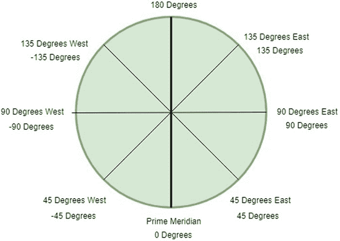

**图 10-3. 绘制经度**

赤道是南北极之间的中心点。纬度表示某点距赤道向北或向南的度数。因此，赤道的纬度为 0 度。一条纬线代表地球上具有相同纬度的所有点。如图 10-4 所示，有时纬度值以正负值表示，北半球为正值，南半球为负值。另一些时候，纬度总是以正值表示，并通过后缀`north latitude`或`south latitude`来区分。

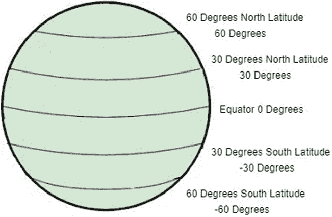

**图 10-4. 绘制纬度**

`GEOMETRY`和`GEOGRAPHY`数据类型都允许你实例化多种对象。这些对象可分为两类：第一类是单几何实例，也称为**基本几何体**；第二类是几何集合，也称为**多部件几何体**。表 10-1 详细列出了 SQL Server 支持的基本几何体。

**表 10-1. 基本几何体**

| 几何体 | 描述 |
| :--- | :--- |
| `Point` | 由一组坐标指定的单个点。 |
| `LineString` | 连接多个点的路径，由多组坐标定义。线串可以是闭合的或非闭合的*。 |
| `CircularString` | 多个点之间的弧形路径。必须定义奇数个点，最少三个。这些点不能全部在同一条轴上（否则将被视为`LineString`）。 |
| `CompoundCurve` | 连接多组点的路径。它可以通过使用多个`LineString`和/或`CircularString`来定义，以创建圆形或半圆形等曲面。 |
| `Polygon` | 通过指定映射多边形每个角的点的坐标来定义的封闭曲面。多边形的每条边本质上都是一个`LineString`。 |
| `CurvePolygon` | 一个封闭曲面。这与`Polygon`类似，不同之处在于它可能使用`LineString`、`CircularString`或`CompoundCurve`来定义，而不仅仅是`LineString`。 |

*\*一个封闭曲面是指用于定义它的点是首尾相连的。因此，最先定义的坐标也将是最后定义的坐标。*

表 10-2 定义了 SQL Server 支持的多部件几何体。

**表 10-2. 多部件几何体**

| 几何体 | 描述 |
| :--- | :--- |
| `MultiPoint` | 0 个或多个`Point`的集合。 |
| `MultiLineString` | 0 个或多个`LineString`的集合。 |
| `MultiPolygon` | 0 个或多个`Polygon`的集合。 |
| `GeometryCollection` | 0 个或多个几何体的集合。可以包含任何基本几何体或多部件几何体。 |

在 SQL Server 2017 中，增加了一种新的曲面类型，它仅适用于`GEOGRAPHY`数据类型。`FullGlobe`代表整个地球表面。因此，它具有面积，但没有边界。


# 第十章 理解空间数据

**提示** 关于创建和操作原始几何体及几何体集合的实际示例，可参见章节 11。

## 空间数据标准

SQL Server 中的空间数据是围绕开放地理空间联盟 (OGC) 制定的标准实现的。这些标准可在 [www.opengeospatial.org/standards/gml](http://www.opengeospatial.org/standards/gml) 找到。

接下来的章节将概述 SQL Server 中可用的空间曲面类型，以及如何使用众所周知文本和众所周知二进制来表示它们。我还将讨论空间参考系统。

## 众所周知文本

OGC 制定了两种引用空间数据的方法：众所周知文本 (WKT) 和众所周知二进制 (WKB)。我将首先讨论 WKT，以及如何使用这种方法指定每个几何体。表 10-3 详细列出了每种原始几何体的 WKT。

### 表 10-3. 原始几何体 WKT

| **几何体** | **WKT** | **描述** |
| :--- | :--- | :--- |
| 点 | `POINT(x y z m)` | x 表示 x 轴或经度；y 表示 y 轴或纬度；z 可选，表示高程；m 可选，表示测量值。 |
| 线串 | `LINESTRING(POINT 1, POINT 2, POINT n)` |  |
| 圆弧串 | `CIRCULARSTRING(start POINT, Anchor POINT 1, Anchor POINT n, end POINT)` |  |
| 复合曲线 | `COMPOUNDCURVE((POINT 1, POINT n), CIRCULARSTRING(start POINT, Anchor POINT, end POINT))` | 当弧线段是圆弧串时，点集必须以几何体类型为前缀。当弧线段是线串时，无需指定几何体类型。 |
| 多边形 | `POLYGON((POINT 1, POINT 2, POINT n))` | 多边形也可以通过在括号内定义第二组点（用逗号分隔）来包含一个内部多边形（洞）。 |
| 曲线多边形 | `CURVEPOLYGON((CIRCULARSTRING(POINT 1, POINT 2, POINT n)))` | 曲线多边形也可以通过在括号内定义第二组点（用逗号分隔）来包含一个内部曲线多边形（洞）。 |

*(续表)*

| **几何体** | **WKT** | **描述** |
| :--- | :--- | :--- |
| ... | ... | ... |

表 10-4 详细列出了多部件几何体的 WKT。

### 表 10-4. 多部件几何体 WKT

| **几何体** | **WKT** |
| :--- | :--- |
| 多点 | `MULTIPOINT((POINT 1),(POINT n))` |
| 多线串 | `MULTILINESTRING((POINT 1, POINT n), (POINT 1, POINT n))` |
| 多多边形 | `MULTIPOLYGON((POINT 1, POINT 2, POINT n),(POINT 1, POINT 2, POINT n))` |
| 几何体集合 | `GEOMETRYCOLLECTION(GEOMETRYTYPENAME(POINT n),GEOMETRYTYPENAME(POINT n))` |

## 众所周知二进制

WKB 也可用于表示几何体。这种二进制数据通常表示为十六进制值。使用 WKB 时，你可以控制字节顺序，然后指定曲面类型，最后指定点集。本节将讨论 WKB 中每个字节的用途。

第一个字节表示字节顺序，其中 `00` 是大端序，`01` 是小端序。

**提示** 大端序是指序列中最不重要的字节最后存储，小端序是指最不重要的字节最先存储。

接下来的四个字节表示所定义曲面的类型。表 10-5 描述了这些字节的整型代码。

### 表 10-5. WKB 曲面类型整型代码

| **类型** | **2D** | **Z** | **M** | **ZM** |
| :--- | :--- | :--- | :--- | :--- |
| 点 | | | | |
| 线串 | | | | |
| 圆弧串 | | | | |
| 复合曲线 | | | | |
| 多边形 | | | | |
| 曲线多边形 | | | | |
| 多点 | | | | |
| 多线串 | | | | |
| 多多边形 | | | | |
| 几何体集合 | | | | |

剩余的字节由描述点的八字节浮点数组成。例如，想象一个坐标为 `4, 2` 的 `POINT`。使用大端序，其十六进制表示将是 `0x0101000000000000000000104000000000000000040`。如果我们将其分解为组成部分：
- `01`—表示字节方向
- `01000000`—表示曲面类型
- `0000000000001040`—表示 x 轴
- `0000000000000040`—表示 y 轴

**提示** 每个字节由两个字符的十六进制表示。

```
0x0101000000000000000000104000000000000000040
```


参考。

表 10-6 提供了此方面的若干示例。

# 第 10 章 理解空间数据

**表 10-6.** WKB 示例

**WKT** | **WKB（十六进制表示—大端序）**
---|---
`POINT(1 1)` | `0x0101000000000000000000F03F00000000000F03F`
`POINT(1 1 1 1)` | `0x00000000010F000000000000F03F000000000000F03F000000000000F03F000000000000F03F`
`LINESTRING(1 1, 2 2)` | `0x000000000114000000000000F03F000000000000F03F00000000000000400000000000000040`
`POLYGON((1 1, 2 2, 2 1, 1 1))` | `0x00000000010404000000000000000000F03F000000000000F03F000000000000004000000000000000400000000000000040000000000000F03F000000000000F03F000000000000F03F010000000200000000001000000FFFFFFFF0000000003`
`GEOMETRYCOLLECTION(POINT(1 1),POINT(2 2))` | `0x00000000010402000000000000000000F03F000000000000F03F000000000000004000000003000000FFFFFFFF0000000007000000000-`

## 空间参考系统

当使用 `GEOGRAPHY` 数据类型时，我们必须意识到，对于如何表示地球并没有一个统一的单一视图。相反，存在多种参考系统，称为空间参考系统。每个系统提供其自身的地图投影。每个系统由一个 `SRID` （空间参考标识符）来标识。可以通过查询 `sys.spatial_reference_systems` 系统表来查找 SQL Server 支持的 `SRID`，如清单 10-1 所示。

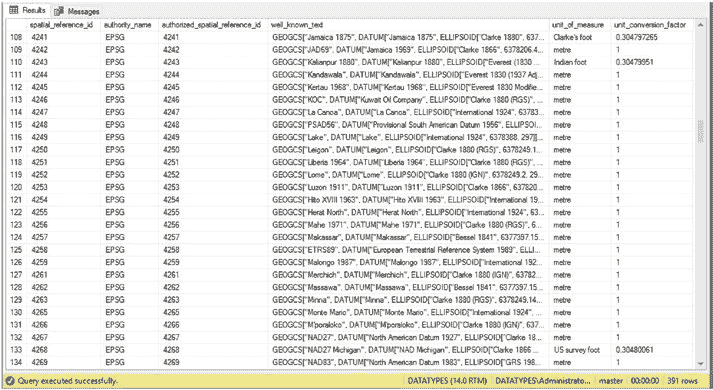

**提示** 地球无法在不产生变形的情况下被建模在平面上。地图投影定义了哪些变形是可接受的，哪些是不可接受的。每种投影允许不同的变形。

**清单 10-1.** 查找空间参考

```sql
SELECT *
FROM sys.spatial_reference_systems ;
```

此查询的部分结果可在图 10-5 中找到。

**图 10-5.** 查找空间参考系统的结果

您会注意到，该表提供了每个空间参考（SR）的各种详细信息，包括其 ID；开发和维护它的权威机构；测量单位，以及该单位相对于米这一基本度量单位的换算系数；并且最有趣的是，提供了由 OGC 定义的 SR 的 WKT。

让我们检查一下微软实现的 SR（`SRID` 104001）的 WKT，其详细信息在清单 10-2 中给出。

**清单 10-2.** SRID 104001 的 WKT

```
GEOGCS["Unit Sphere",
 DATUM["Unit Sphere",
  SPHEROID["Sphere", 1.0, 0.0]
 ],
 PRIMEM["Greenwich",0.0],
 UNIT["Degree", 0.0174532925199433]
]
```

请注意，该 WKT 使用 JSON 格式（有关 JSON 的详细讨论，请参见第 6-9 章），并指定了地图投影的详细信息，例如本初子午线和测量单位。

**注意** 重要的是要注意，虽然单个 `GEOGRAPHY` 列可以包含基于多个空间参考系统的值，但无法比较这些值。空间函数要求所有值具有相同的 `srid`，因为它们包含计算所需的背景信息。然而，可以在执行比较之前将一个值转换到不同的 `srid`。

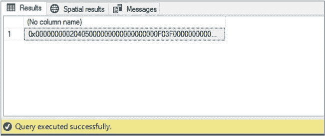

## SSMS 与空间数据

SQL Server Management Studio (SSMS) 提供了图形化结果，以帮助开发者处理空间数据。例如，想象一个简单的脚本，如清单 10-3，它声明了一个 `GEOMETRY` 类型的变量，并将其设置为包含一个简单的 `CurvePolygon`。

**清单 10-3.** 使用 GEOMETRY 声明 CurvePolygon

```sql
DECLARE @CurvePolygon GEOMETRY =
'CURVEPOLYGON(CIRCULARSTRING(1 3, 3 5, 4 7, 7 3, 1 3))' ;

SELECT @CurvePolygon ;
```

常规的结果选项卡将返回该曲面的 `WKB`，采用十六进制表示法，如图 10-6 所示。

**图 10-6.** WKB 格式的结果

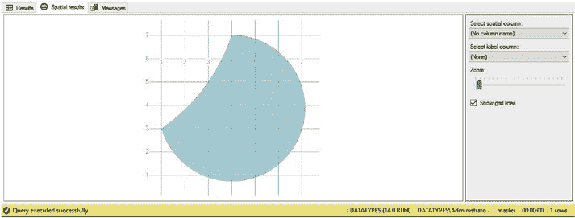


# 第 10 章 理解空间数据

然而，您会注意到，在 `结果` 和 `消息` 选项卡之间，出现了一个名为 `空间结果` 的新选项卡。此窗格如图 10-7 所示。

**图 10-7.** `空间结果` 选项卡 — `GEOMETRY`

您会发现，我们可以看到表面的图形表示，以及一些基本控件，允许我们放大和缩小，并且如果结果集中包含多个空间列，还可以在列之间切换。通过拖动鼠标，还可以围绕对象滚动查看。

考虑清单 10-4。您会注意到该脚本与清单 10-3 非常相似，除了我们现在声明的是一个 `GEOGRAPHY` 类型的变量，而不是 `GEOMETRY`。

**清单 10-4.** 使用 `GEOGRAPHY` 声明一个 `CurvePolygon`

```sql
DECLARE @CurvePolygon GEOGRAPHY = 'CURVEPOLYGON(CIRCULARSTRING(1 3, 3 5, 4 7, 7 3, 1 3))' ;
SELECT @CurvePolygon ;
```

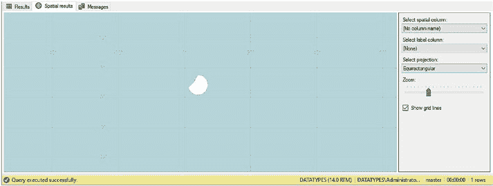

图 10-8 显示了该脚本的 `空间结果` 选项卡。您会注意到网格的单位已从欧几里得式坐标变为度数，这反映了现在使用的是地球模型，我们的坐标实际上是经度和纬度。

**图 10-8.** `空间结果` 选项卡 — `GEOGRAPHY`

## 小结

SQL Server 提供了两种用于处理空间数据的数据类型：`GEOMETRY` 和 `GEOGRAPHY`。`GEOMETRY` 允许您在欧几里得（平面）模型中工作，而 `GEOGRAPHY` 允许您在地球（球体）模型中工作。SQL Server 的空间实现基于开放地理空间联盟 (`OGC`) 制定的标准。

空间形状，称为面，可以使用熟知文本 (`WKT`) 或熟知二进制 (`WKB`) 来定义，这些都是由 `OGC` 制定的标准。使用 `WKT` 时，面类型由名称及其点规格定义。使用 `WKB` 时，您可以控制字节顺序，然后指定面类型，最后指定点规格。`WKB` 通常使用十六进制表示法来表示。

SQL Server 支持以下基本和多部件地理类型，并且当在 SQL Server 2017 或更高版本中使用 `GEOGRAPHY` 时，还支持 `FullGlobe` 几何类型：

- `Point`
- `LineString`
- `CircularString`
- `CompoundCurve`
- `Polygon`
- `CurvePolygon`
- `MultiPoint`
- `MultiLineString`
- `MultiPolygon`
- `GeometryCollection`

SQL Server 支持多种空间参考系统。这在使用 `GEOGRAPHY` 时非常重要，因为每个 `SRID` 都实现了自己的地图投影。具有冲突 `SRID` 的面可以存储在同一列中，但不能使用空间函数进行比较。

SQL Server Management Studio 为空间查询提供图形结果。`空间结果` 选项卡允许您移动面、进行缩放。网格会根据结果的数据类型，在欧几里得坐标和纬度/经度之间切换。

# 第 11 章 处理空间数据

在第 10 章中，我讨论了与空间数据相关的概念，SQL Server 使用 `GEOMETRY` 和 `GEOGRAPHY` 数据类型来实现。

在本章中，我将探讨如何使用这些数据类型。首先，我将讨论可用于构建面的方法，然后回顾如何查询空间数据。最后，您将看到如何设计和创建空间索引。

**注意** 一个地理空间对象可以被称为 `geometry`（几何对象），简单的对象被称为基本几何对象，对象的集合被称为 `geometry` 集合（几何集合）。由于 `geometry` 也是指代以平面模型实现空间数据的数据类型的名称，这可能会引起混淆。因此，请注意，当本章提到地理空间对象时，将使用小写的 `geometry` 一词。当指代数据类型时，将使用大写的 `GEOMETRY`。


`doi.org/10.1007/978-1-4842-3901-8_11`

# 第 11 章 处理空间数据

## 构造空间数据

`GEOMETRY` 和 `GEOGRAPHY` 数据类型提供了许多可用于与空间数据交互的方法。其中许多方法是开放地理空间联盟 (OGC) 标准的一部分，而另一些则是对该标准的扩展。表 11-1 详细列出了可用于构造几何对象的方法，这些方法均来自 OGC 规范，并通过 `GEOMETRY` 和 `GEOGRAPHY` 两种类型提供。

***表 11-1.** 构造几何对象的方法*

**空间类型** | **来自 WKT** | **来自 WKB**
--- | --- | ---
Point | `STPointFromText` | `STPointFromWKB`
LineString | `STLineFromText` | `STLineFromWKB`
Polygon | `STPolyFromText` | `STPolyFromWKB`
Any Primitive Spatial Instance | `STGeomFromText` | `STGeomFromWKB`
MultiPoint | `STMPointFromText` | `STMPointFromWKB`
MultiLineString | `STMLineFromText` | `STMLineFromWKB`
MultiPolygon | `STMPolyFromText` | `STMPolyFromWKB`
Any Multi Spatial Instance | `STMGeomCollFromText` | `STMGeomCollFromWKB`

这些方法中的每一个都接受两个参数。第一个参数是空间实例的已知文本 (WKT) 或已知二进制 (WKB)。第二个参数是空间实例应使用的 SRID（有关 SRID 的更多详细信息，请参阅第 10 章）。当对 `GEOMETRY` 类型的列或变量调用时，可以将 `0` 作为 SRID 传递，因为在欧几里得模型中不需要地图投影（参见第 10 章）。

然而，当对 `GEOGRAPHY` 类型的列或变量调用时，必须使用有效的 SRID，传递 `0` 将导致 .NET 框架抛出错误。

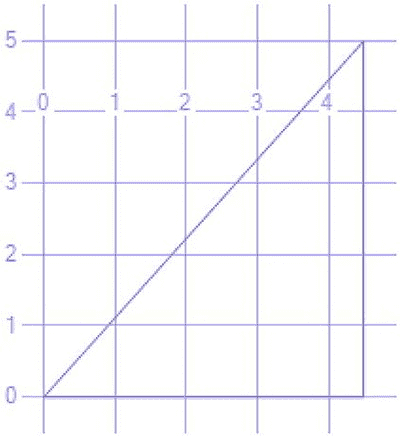

# 第 11 章 处理空间数据

清单 11-1 中的脚本将使用已知文本在 `GEOMETRY` 类型的变量中创建一个 `LineString`。

***清单 11-1.*** 使用已知文本创建 LineString
```sql
DECLARE @LineString GEOMETRY ;
SET @LineString = GEOMETRY::STLineFromText('LINESTRING(0 0, 4.5 5, 4.5 0, 0 0)', 0)
SELECT @LineString ;
```
此脚本的图形结果如图 11-1 所示。

***图 11-1.** 从 WKT 创建 LineString 的结果*

或者，可以使用清单 11-2 中的脚本，通过 WKB 创建相同的空间实例。

# 第 11 章 处理空间数据

***清单 11-2.*** 从已知二进制创建 LineString
```sql
DECLARE @LineString GEOMETRY ;
SET @LineString = GEOMETRY::STLineFromWKB(0x010200000004000000000000, 0);
SELECT @LineString ;
```

**提示** 存在一个用于构造几何对象的额外扩展方法。`GeomFromGML` 允许您基于地理标记语言 (GML) 实例化对象。例如，清单 11-3 中的脚本将从 GML 创建一个 `LineString`。GML 的完整讨论超出了本书的范围，但 OGC 规范可以在 [www.opengeospatial.org/standards/gml](http://www.opengeospatial.org/standards/gml) 找到。

***清单 11-3.*** 从 GML 创建 LineString
```sql
DECLARE @LineString GEOMETRY ;
SET @LineString = GEOMETRY::GeomFromGml('<LineString xmlns="http://www.opengis.net/gml">
    <posList>0 0 4.5 5 4.5 0 0 0</posList>
</LineString>', 0) ;
SELECT @LineString ;
```

SQL Server 还提供了一个扩展方法，用于通过定义点的 x 和 y 坐标来创建空间实例。清单 11-4 展示了针对 `GEOMETRY` 变量使用 `Point` 方法。该方法接受三个参数。第一个是 x 轴坐标，第二个是 y 轴坐标，第三个是 SRID。

# 第 11 章 处理空间数据

***清单 11-4.*** 使用 Point 方法
```sql
DECLARE @Point GEOMETRY ;
SET @Point = GEOMETRY::Point(10, 10, 0) ;
SELECT @Point ;
```

也可以通过简单地将已知文本或已知二进制作为值传递来实例化空间实例。例如，考虑


清单 11-5. 中的脚本

***清单 11-5.*** 将已知文本传递给变量

```
DECLARE @Polygon GEOMETRY ;

SET @Polygon = 'POLYGON((0 0, 10 0, 10 10, 0 10, 0 0))' ;

SELECT @Polygon ;
```

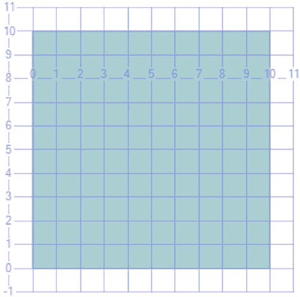

该脚本的图形化结果显示在图 11-2 中。

***图 11-2.** 将已知文本传递给变量的结果*

可以通过直接传递 `NULL` 值或使用实例的只读 `Null` 属性将空间实例设置为 `NULL`。清单 11-6. 展示了这一点。

***清单 11-6.*** 将实例设置为 `NULL`

```
--通过直接传递 NULL 将变量设为 NULL
DECLARE @Polygon GEOMETRY ;
SET @Polygon = NULL ;
SELECT @Polygon ;
```

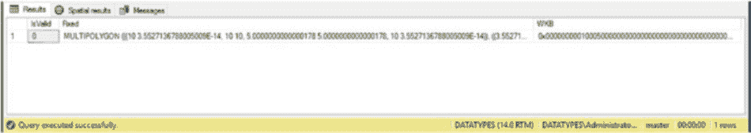

```
--通过使用只读 Null 属性将变量设为 NULL
SET @Polygon = GEOMETRY::[Null] ;
SELECT @Polygon ;
```

可以使用 `STIsValid` 方法检查已知文本或已知二进制的有效性。如果实例无效，可以使用 `MakeValid` 方法使其有效。例如，考虑清单 11-7 中的脚本，该脚本实例化了一个自相交的 `Polygon`。

***清单 11-7.*** 验证和更正实例

```
DECLARE @Polygon GEOMETRY ;
SET @Polygon = GEOMETRY::STGeomFromText('POLYGON((0 0, 10 10, 10 0, 0 10, 0 0))', 0) ;

SELECT
    @Polygon.STIsValid() AS IsValid
    , @Polygon.MakeValid().ToString() AS Fixed
    , @Polygon AS WKB ;
```

如图 11-3 所示 的结果显示，原始值返回 `0`，因为它无效，而修复后的版本已将其转换为 `MultiPolygon`。

***图 11-3.** 验证和更正实例的结果*


查询的图形化结果显示在图 11-4. 中。

***图 11-4.** 验证和更正实例的图形化结果*

值得注意的是，由于空间数据的解析方式，`STIsValid` 和 `MakeValid` 的使用受到一些限制。例如，考虑清单 11-8 中 的脚本，该脚本尝试实例化一个未封闭的 `Polygon`。

***清单 11-8.*** 尝试实例化未封闭的 `Polygon`

```
DECLARE @LineString GEOMETRY ;
SET @LineString = GEOMETRY::STGeomFromText('POLYGON((0 0, 10 10, 10 0, 0 10))', 0) ;

SELECT
    @LineString.STIsValid() AS IsValid
    , @LineString.MakeValid().ToString() AS Fixed
    , @LineString AS WKB ;
```

由于 `Polygon` 未封闭，它解析失败，并抛出如图 11-5 所示的错误。

***图 11-5.** 实例化未封闭多边形时抛出的错误*

**查询空间数据**

SQL Server 提供了多种与空间数据交互的方法。这些方法的概述可在表 11-2 中找到。该表详细列出了每个方法的名称、它是 `OGC` 标准还是 `Microsoft` 扩展，以及该方法所适用的数据类型。最后一列简要描述了该方法的功能。

returns the well-known binary augmented with `Z` and `M` values, returns the `GML` of a spatial instance, returns the well-known text augmented with `Z` and `M` values, accepts a single parameter distance, returns an object representing all points within the distance supplied, against which the method was called, accepts three parameters, the tolerance, denotes if the tolerance is relative, returns an object representing all points, a spatial object, a spatial object representing the union of all points, whose distance from a geography instance is less than and a bit flag, which designates of the spatial instance denoting a distance from the tolerance, if present, if present, the geometry of a spatial instance, if present, returns a following for relative.


# 第 11 章：处理空间数据

## 表 11-2. 空间数据方法

| 方法 | 适用对象 | OGC 标准/扩展 | 描述 |
| :--- | :--- | :--- | :--- |
| `AsBinaryZM()` | `GEOGRAPHY`, `GEOMETRY` | 扩展 | 将空间实例转换为其 WKB 表示形式。 |
| `AsGml()` | `GEOGRAPHY`, `GEOMETRY` | 扩展 | 返回空间实例的 GML 表示形式。 |
| `AsTextZM()` | `GEOGRAPHY`, `GEOMETRY` | 扩展 | 返回空间实例的 WKT 表示形式。 |
| `BufferWithCurves()` | `GEOGRAPHY`, `GEOMETRY` | 扩展 | 返回围绕空间实例的缓冲区的多边形近似值。 |
| `BufferWithTolerance()` | `GEOGRAPHY`, `GEOMETRY` | 扩展 | 返回围绕空间实例的缓冲区的多边形近似值，其中容差指定了原始几何图形与近似值之间的最大距离。 |
| `CurveToLineWithTolerance()` | `GEOGRAPHY`, `GEOMETRY` | 扩展 | 在指定容差范围内将曲线转换为线串。 |
| `EnvelopeAngle()` | `GEOGRAPHY`, `GEOMETRY` | 扩展 | 返回实例边界圆的中心点与几何图形中某一点之间的最大角度（以度为单位）。 |
| `EnvelopeCenter()` | `GEOGRAPHY`, `GEOMETRY` | 扩展 | 返回空间实例边界圆的中心。 |
| `Filter()` | `GEOGRAPHY`, `GEOMETRY` | 扩展 | 尝试判断一个空间实例是否可能与另一个空间实例相交。如果它们可能相交则返回 1，不相交则返回 0。 |
| `HasM()` | 仅 `GEOGRAPHY` | 扩展 | 如果存在 M 值则返回 1，不存在则返回 0。指示是否已为空间实例指定了 M 值。 |
| `HasZ()` | 仅 `GEOGRAPHY` | 扩展 | 如果存在 Z 值则返回 1，不存在则返回 0。指示是否已为空间实例指定了 Z 值。 |
| `InstanceOf()` | `GEOGRAPHY`, `GEOMETRY` | 扩展 | 如果空间实例属于指定类型则返回 1，如果是其他类型则返回 0。 |
| `IsNull()` | `GEOGRAPHY`, `GEOMETRY` | 扩展 | 如果空间实例为空则返回 1。 |
| `IsValidDetailed()` | `GEOGRAPHY`, `GEOMETRY` | 扩展 | 验证空间实例。如果对象有效，则返回 0。如果对象无效，则返回描述无效原因的错误代码。这些错误代码及其含义可在文档中找到。 |
| `Lat()` | 仅 `GEOGRAPHY` | OGC | 返回`POINT`的纬度。 |
| `Long()` | 仅 `GEOGRAPHY` | OGC | 返回`POINT`的经度。 |
| `M()` | `GEOGRAPHY`, `GEOMETRY` | 扩展 | 返回空间实例的 M 值。 |
| `MakeValid()` | `GEOGRAPHY`, `GEOMETRY` | 扩展 | 将格式不良的空间实例转换为格式良好的实例。 |
| `MinDbCompatibilityLevel()` | `GEOGRAPHY`, `GEOMETRY` | 扩展 | 返回支持该空间实例类型所需的最低数据库兼容性级别。 |
| `NumRings()` | 仅 `GEOGRAPHY` | 扩展 | 返回`POLYGON`内的环总数。 |
| `Reduce()` | `GEOGRAPHY`, `GEOMETRY` | 扩展 | 对空间实例运行道格拉斯-普克算法，并返回由容差定义的近似结果。 |
| `ReorientObject()` | 仅 `GEOGRAPHY` | 扩展 | 更改`POLYGON`的环方向。 |
| `RingN()` | 仅 `GEOGRAPHY` | 扩展 | 接受一个定义从 1 开始的索引的参数。返回给定索引号处的空间实例中的环。 |
| `ShortestLineTo()` | `GEOGRAPHY`, `GEOMETRY` | 扩展 | 接受一个空间对象作为参数，并返回一个`LINESTRING`，表示调用该方法的空间对象与作为参数传递的空间对象之间的最短距离。 |
| `STArea()` | `GEOGRAPHY`, `GEOMETRY` | OGC | 返回实例的表面积。 |
| `STAsBinary()` | `GEOGRAPHY`, `GEOMETRY` | OGC | 返回实例的 WKB。 |
| `STAsText()` | `GEOGRAPHY`, `GEOMETRY` | OGC | 返回实例的 WKT。 |


# 第 11 章 处理空间数据

## 表 11-2 空间数据函数

| 方法 | 描述 | 适用类型 | OGC/扩展 |
| :--- | :--- | :--- | :--- |
| `STBoundary()` | 返回几何实例的边界。 | 仅 `GEOMETRY`，`GEOGRAPHY` | OGC |
| `STBuffer()` | 返回表示另一几何实例缓冲区区域的几何实例。接受一个表示距离的参数。 | `GEOMETRY`，`GEOGRAPHY` | OGC |
| `STCentroid()` | 返回几何实例的几何中心。 | `GEOMETRY`，`GEOGRAPHY` | OGC |
| `STContains()` | 判断一个几何实例是否包含另一个。如果被包含的实例位于外部实例内，则返回 1，否则返回 0。 | `GEOMETRY`，`GEOGRAPHY` | OGC |
| `STConvexHull()` | 返回包含几何实例所有点的最小可能凸多边形 (`Polygon`)。 | 仅 `GEOMETRY`，`GEOGRAPHY` | OGC |
| `STCrosses()` | 如果几何实例与另一实例相交，则返回 1，否则返回 0。 | `GEOMETRY`，`GEOGRAPHY` | OGC |
| `STCurveN()` | 从复合曲线 (`CompoundCurve`)、圆弧字符串 (`CircularString`) 或曲线 (`Curve`) 实例中返回特定的曲线。接受一个索引参数。 | 仅 `GEOMETRY`，`GEOGRAPHY` | OGC |
| `STCurveToLine()` | 将圆弧曲线实例近似表示为线字符串 (`LineString`) 或多边形 (`Polygon`) 实例。 | 仅 `GEOMETRY`，`GEOGRAPHY` | OGC |
| `STDifference()` | 返回几何实例中不与另一几何实例相交的部分。 | `GEOMETRY`，`GEOGRAPHY` | OGC |
| `STDimension()` | 返回几何实例的最大维度。 | `GEOMETRY`，`GEOGRAPHY` | OGC |
| `STDisjoint()` | 如果两个几何实例不相交，则返回 1，否则返回 0。 | `GEOMETRY`，`GEOGRAPHY` | OGC |
| `STDistance()` | 返回两个几何实例之间的最短距离。 | `GEOMETRY`，`GEOGRAPHY` | OGC |
| `STEndpoint()` | 返回线字符串 (`LineString`) 或圆弧字符串 (`CircularString`) 实例的终点。 | `GEOMETRY`，`GEOGRAPHY` | OGC |
| `STEnvelope()` | 返回界定几何实例的矩形多边形 (`Polygon`)。 | 仅 `GEOMETRY`，`GEOGRAPHY` | OGC |
| `STEquals()` | 如果两个几何实例具有相同的点集，则返回 1，否则返回 0。 | `GEOMETRY`，`GEOGRAPHY` | OGC |
| `STExteriorRing()` | 返回多边形 (`Polygon`) 实例的外环。 | 仅 `GEOMETRY`，`GEOGRAPHY` | OGC |
| `STGeometryN()` | 从几何集合中返回特定的对象。接受一个索引参数。 | `GEOMETRY`，`GEOGRAPHY` | OGC |
| `STGeometryType()` | 返回几何实例的类型。 | `GEOMETRY`，`GEOGRAPHY` | OGC |


# 第 11 章 处理空间数据

## 表 11-2. 空间方法（续）

### 方法

`STInteriorRingN`

### 描述

返回 `多边形` 的第 `n` 个内环。

### 适用于

- `GEOMETRY`
- `GEOGRAPHY`

### OGC/扩展

`OGC`

---

### 方法

`STIntersection`

### 描述

返回两个空间实例的几何交集。如果实例相交则返回 1，不相交则返回 0。

### 适用于

- `GEOMETRY`
- `GEOGRAPHY`

### OGC/扩展

`OGC`

---

### 方法

`STIntersects`

### 描述

如果空间实例相交则返回 1，否则返回 0。

### 适用于

- `GEOMETRY`
- `GEOGRAPHY`

### OGC/扩展

`OGC`

---

### 方法

`STIsClosed`

### 描述

检查空间实例的起点和终点是否相同。如果实例是闭合的则返回 1，否则返回 0。

### 适用于

- `GEOMETRY`
- `GEOGRAPHY`

### OGC/扩展

`OGC`

---

### 方法

`STIsEmpty`

### 描述

如果实例为空则返回 1，否则返回 0。

### 适用于

- `GEOMETRY`
- `GEOGRAPHY`

### OGC/扩展

`OGC`

---

### 方法

`STIsRing`

### 描述

验证空间实例是否为一个 `线串` 并且是闭合且简单的。
条件：
- 是一个 `线串`
- 不自相交（起点和终点除外）
- 多个对象彼此不相交（交点在两个对象边界上的情况除外）
- 是闭合的（起点和终点相同）

如果所有条件都为真则返回 1，如果有一个或多个条件为假则返回 0。

### 适用于

- 仅 `GEOMETRY`

### OGC/扩展

`OGC`

---

### 方法

`STIsSimple`

### 描述

验证空间实例是否不自相交。
条件：
- 不自相交（起点和终点除外）
- 多个对象彼此不相交（交点在两个对象边界上的情况除外）

如果两个条件都为真则返回 1，如果任一条件为假则返回 0。

### 适用于

- 仅 `GEOMETRY`

### OGC/扩展

`OGC`

---

### 方法

`STIsValid`

### 描述

验证空间实例的格式是否正确。如果实例格式正确则返回 1，否则返回 0。

### 适用于

- `GEOMETRY`
- `GEOGRAPHY`

### OGC/扩展

`OGC`

---

### 方法

`STLength`

### 描述

返回空间实例的总长度。对于 `多边形`，这是其周长长度。

### 适用于

- `GEOMETRY`
- `GEOGRAPHY`

### OGC/扩展

`OGC`

---

### 方法

`STNumCurves`

### 描述

返回空间实例中曲线的数量。对于简单几何体，始终为 0。

### 适用于

- 仅 `GEOMETRY`

### OGC/扩展

`OGC`

---

### 方法

`STNumGeometries`

### 描述

返回多部分几何体中空间对象的数量。

### 适用于

- `GEOMETRY`
- `GEOGRAPHY`

### OGC/扩展

`OGC`

---

### 方法

`STNumInteriorRing`

### 描述

返回 `多边形` 所包含的内环数量。

### 适用于

- `GEOMETRY`
- `GEOGRAPHY`

### OGC/扩展

`OGC`

---

### 方法

`STNumPoints`

### 描述

返回用于描述空间基元的点的数量。

### 适用于

- `GEOMETRY`
- `GEOGRAPHY`

### OGC/扩展

`OGC`

---

### 方法

`STOverlaps`

### 描述

验证空间实例是否与一个简单的、多部分的几何体重叠。如果对象重叠则返回 1，否则返回 0。使用的矩阵是作为参数传递给该方法的第二个矩阵，它描述了扩展 9 相交模型（D-9IM）定义的关系。

### 适用于

- `GEOMETRY`
- `GEOGRAPHY`

### OGC/扩展

`OGC`

---

### 方法

`STPointN`

### 描述

接受一个参数 `n`，这是一个从 1 开始的索引位置。返回空间实例内部的一个任意点。传递给该方法的参数是作为参数传入的。

### 适用于

- 仅 `GEOMETRY`

### OGC/扩展

`OGC`

---

### 方法

`STPointOnSurface`

### 描述

返回一个保证位于空间实例表面上的任意点。

### 适用于

- 仅 `GEOMETRY`

### OGC/扩展

`OGC`

---

### 方法

`STRelate`

### 描述

验证调用该方法的空间实例是否与作为参数传递的空间实例相关。关系由传递给该方法的模式矩阵定义。

### 适用于

- `GEOMETRY`
- `GEOGRAPHY`

### OGC/扩展

`OGC`

---

### 方法

`STTouches`

### 描述

如果实例接触则返回 1，否则返回 0。如果实例满足以下条件，则它们接触：
- 在空间上接触一个空间实例
- 用于定义空间点的空间实例
- 调用该方法的空间实例
- 不同时位于两个空间实例内部

### 适用于

- `GEOMETRY`
- `GEOGRAPHY`

### OGC/扩展

`OGC`


# 第 11 章 处理空间数据

## 方法列表

以下方法描述了对空间数据的操作。许多方法同时适用于 `GEOMETRY` 和 `GEOGRAPHY` 数据类型，而有些则仅限于特定类型。

- **`STUnion`**：返回调用此方法的空间实例与作为参数传递给该方法的空间实例的联合体。结果是一个空间实例，它定义了两个输入参数所覆盖的区域。
- **`STWithin`**：如果作为参数传递的空间实例完全位于调用该方法的空间实例内部，则返回 1，否则返回 0。
- **`STX`**：返回调用此方法的点的空间实例的 X 坐标。
- **`STY`**：返回调用此方法的点的空间实例的 Y 坐标。
- **`ToString`**：返回调用此方法的空间实例的已知文本 (WKT) 表示形式。
- **`Z`**：返回调用此方法的点的空间实例的 Z 值。

### 其他方法

- **`IsValidDetailed`**：此方法由 Microsoft 作为扩展方法实现。当空间实例无效时，它会返回详细的错误代码。表 11-3 列出了可能返回的错误代码。
- **`STSymDifference`**：返回调用此方法的空间实例与作为参数传递的空间实例之间的对称差集。
- **`STTouches`**：检查两个空间实例的边界是否接触。
- **`STStartPoint`**：返回曲线或类似几何对象的起始点。
- **`STSrid`**：返回空间实例的 `SRID`（空间引用标识符）。

关于 `DE-9IM`（九交模型）矩阵的详细信息可以在 [此处找到](https://link.springer.com/referenceworkentry/10.1007/978-3-319-17885-1_298)。

## 表 11-3. `IsValidDetailed` 错误代码

| 错误代码 | 描述 |
| :--- | :--- |
| `0` | 实例有效。 |
| `1` | 实例无效，但原因未知。 |
| `2` | 实例无效，因为一个点被孤立，这对该对象的类型无效。 |
| `3` | 实例无效，因为某些多边形边重叠。 |
| `4` | 实例无效，因为一个多边形环与自身或其他环相交。 |
| `5` | 实例无效，因为一个多边形环与自身或其他环相交，并且无法返回环号。 |
| `6` | 实例无效，因为一条曲线退化为一个点。 |
| `7` | 实例无效，因为一个多边形环塌陷为一条线。 |
| `8` | 实例无效，因为一个多边形环未闭合。 |
| `9` | 实例无效，因为多边形环的某部分位于多边形内部。 |
| `10` | 实例无效，因为一个环是多边形中的第一个环，但不是外环。 |
| `11` | 实例无效，因为一个环位于其多边形的外环之外。 |
| `12` | 实例无效，因为多边形的内部不连通。 |
| `13` | 实例无效，因为曲线中有两条重叠的边。 |
| `14` | 实例无效，因为一条曲线的边与另一条曲线的边重叠。 |
| `15` | 实例无效，因为多边形具有无效的环结构。 |
| `16` | 实例无效，因为在曲线中，边是一条线段或一条具有对跖端点的退化弧线。 |

## 表 11-4. 聚合方法

在使用 `GEOMETRY` 和 `GEOGRAPHY` 数据类型时，还可以使用一些聚合方法。

| 方法 | 描述 |
| :--- | :--- |
| `CollectionAggregate` | 从一组空间对象创建几何集合 (`GeometryCollection`)。 |
| `ConvexHullAggregate` | 返回一组空间对象的凸包。 |
| `EnvelopeAggregate` | 返回一组空间对象的边界空间对象。 |


# 第 11 章 处理空间数据

## UnionAggregate
返回一组空间对象的联合结果。

既然你已经了解了 SQL Server 所提供的空间方法，现在可以通过 `WideWorldImporters` 数据库来看看如何在实践中应用它们。假设我们负责送货路线，并且需要在阿拉巴马州规划一条路线。

我们首先要做的是验证我们的数据。所有送货地点标记为阿拉巴马州的客户，是否真的位于阿拉巴马州边界内？`Sales.Customers` 表包含一个名为 `DeliveryLocation` 的 `GEOGRAPHY` 类型列，每行都包含一个 `Point` 对象，映射其送货地址。我们可以对此列使用 `STWithin` 方法，并传入 `Application.StateProvinces` 表中的 `Border` 列（该列映射了州边界）。如代码清单 11-9 所示。

***代码清单 11-9.*** 验证所有地址是否在阿拉巴马州边界内

```sql
DECLARE @StateBorder GEOGRAPHY = (
    SELECT Border
    FROM Application.StateProvinces
    WHERE StateProvinceName = 'Alabama') ;

SELECT
    Customer.CustomerName AS CustomerName
    , City.CityName AS City
    , Customer.DeliveryLocation.ToString() AS DeliveryLocation
FROM SALES.Customers Customer
INNER JOIN Application.Cities City
    ON City.CityID = Customer.DeliveryCityID
WHERE Customer.DeliveryLocation.STWithin(@StateBorder) = 1 ;
```

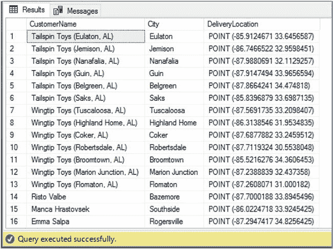

此查询的结果（如图 11-6 所示）验证了所有 16 个送货地址在阿拉巴马州的客户确实都居住在该州内。

***图 11-6.*** 验证所有地址在阿拉巴马州边界内的结果。

接下来，我们想要检查每个送货地点距离我们仓库的距离，并按此距离对结果排序。这将有助于我们规划路线。这种技术被称为查找最近邻，如代码清单 11-10 所示，该查询计算距离并使用 `Application.SystemParameters` 表中的 `DeliveryLocation`（标记了 `WideWorldImporters` 的位置）对结果进行排序。

**注意：** `WideWorldImporters` 的仓库在加利福尼亚州，虽然到阿拉巴马州各地的距离很远，但它们仍然允许我们规划出司机最合理的路线。

***代码清单 11-10.*** 查找最近邻

```sql
DECLARE @StateBorder GEOGRAPHY = (
    SELECT Border
    FROM Application.StateProvinces
    WHERE StateProvinceName = 'Alabama') ;

DECLARE @Office GEOGRAPHY = (
    SELECT DeliveryLocation
    FROM Application.SystemParameters) ;

DECLARE @MilesRatio INT = 0.000621371 ;

SELECT
    Customer.CustomerName AS CustomerName
    , City.CityName AS City
    , Customer.DeliveryLocation.ToString() AS DeliveryLocation
    , Customer.DeliveryLocation.STDistance(@Office) * @MilesRatio AS DeliveryDistanceMiles
FROM SALES.Customers Customer
INNER JOIN Application.Cities City
    ON City.CityID = Customer.DeliveryCityID
WHERE Customer.DeliveryLocation.STWithin(@StateBorder) = 1
ORDER BY DeliveryDistanceMiles ;
```

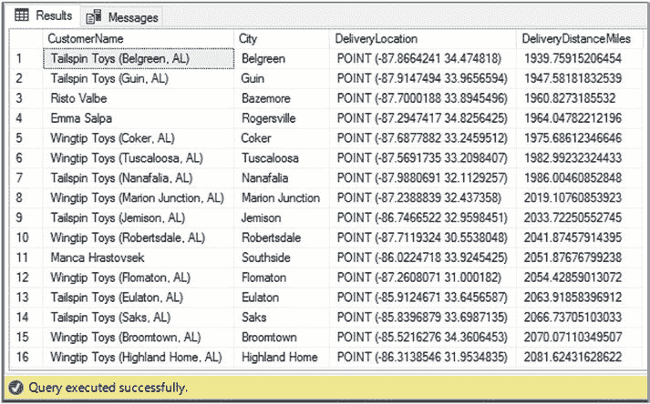

此查询的结果如图 11-7 所示。

***图 11-7.*** 查找最近邻的结果。

你会注意到在代码清单 11-10 中，距离乘以了 `0.000621371`。这是因为距离默认以米为单位。距离的计量单位与 `SRID` 相关联，因此我们可以通过增强查询来显示 `SRID` 进行双重确认，如代码清单 11-11 所示。该查询公开了每个空间实例的 `SRID` 属性，并使用此值连接到 `sys.spatial_reference_systems` 系统表，以公开计量单位列。

***代码清单 11-11.*** 公开 SRID

```sql
DECLARE @StateBorder GEOGRAPHY = (
    SELECT Border
    FROM Application.StateProvinces
    WHERE StateProvinceName = 'Alabama') ;
```


# 第 11 章：处理空间数据

```sql
DECLARE @Office GEOGRAPHY = (

SELECT DeliveryLocation

FROM Application.SystemParameters) ;

DECLARE @MilesRatio INT = 0.000621371 ;

SELECT

Customer.CustomerName AS CustomerName

, City.CityName AS City

, Customer.DeliveryLocation.ToString() AS

DeliveryLocation

, Customer.DeliveryLocation.STDistance(@Office) *

@MilesRatio AS DeliveryDistanceMiles

, Customer.DeliveryLocation.STSrid AS SRID

, srid.unit_of_measure

FROM SALES.Customers Customer

INNER JOIN Application.Cities City

ON City.CityID = Customer.DeliveryCityID

INNER JOIN sys.spatial_reference_systems srid

ON srid.spatial_reference_id = Customer.

DeliveryLocation.STSrid

WHERE Customer.DeliveryLocation.STWithin(@StateBorder) = 1

ORDER BY DeliveryDistanceMiles ;
```

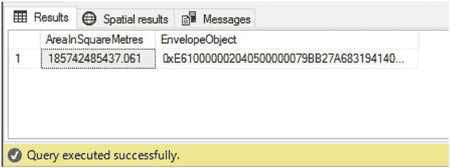

虽然我们知道所有的配送都在阿拉巴马州内，但我们可能希望了解实际的配送区域有多大。我们可以通过创建一个包络线然后计算其面积来实现这一点。此方法使用了 `EnvelopeAggregate` 扩展方法和 `STArea` 方法，如**代码清单 11-12**所示。

**代码清单 11-12.** 计算聚合包络线的面积

```sql
DECLARE @StateBorder GEOGRAPHY = (

SELECT Border

FROM Application.StateProvinces

WHERE StateProvinceName = 'Alabama') ;

SELECT

GEOGRAPHY::EnvelopeAggregate(DeliveryLocation).

STArea() AS AreaInSquareMetres

, GEOGRAPHY::EnvelopeAggregate(DeliveryLocation)

AS EnvelopeObject

FROM Sales.Customers

WHERE DeliveryLocation.STWithin(@StateBorder) = 1 ;
```

此查询的结果可见于**图 11-8**。

**图 11-8.** 计算聚合包络线面积的结果

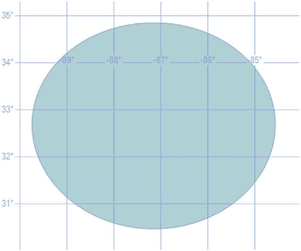

**代码清单 11-12**中查询的图形化结果如**图 11-9**所示。

**图 11-9.** 计算聚合包络线面积的图形化结果

## 为空间数据创建索引

以下各节概述了空间索引，然后演示如何创建它们。

### 理解空间索引

空间索引是一种特殊类型的索引，在 SQL Server 中实现，可以提高对空间数据类型的某些查询的性能。**表 11-5**描述了当在 `WHERE` 或 `JOIN` 子句中使用时，可以从空间索引中受益的谓词模式。

**表 11-5.** 可从空间索引中受益的查询

| **数据类型** | **方法** | **运算符** |
| :--- | :--- | :--- |
| GEOMETRY & GEOGRAPHY | STDistance | <, <= |
| GEOMETRY & GEOGRAPHY | STEquals | = |
| GEOMETRY & GEOGRAPHY | STIntersects | = |
| 仅 GEOMETRY | STContains | = |
| 仅 GEOMETRY | STOverlaps | = |
| 仅 GEOMETRY | STTouches | = |
| 仅 GEOMETRY | STWithin | = |

与传统索引一样，空间索引使用 `B-Tree` 结构（有关 `B-Tree` 索引的更多信息，请参见第 5 章），这意味着空间数据必须以线性顺序表示。为了实现这一点，SQL Server 在构建索引之前，将空间分解为一个嵌套的网格系统。

网格将有四层。第一层（`级别 1`）网格中的每个单元格将包含另一个（`级别 2`）网格，依此类推。四个网格层中的每一层都可以赋予不同的密度，低密度定义为 `4 × 4` 个单元格，中密度为 `8 × 8` 个单元格，高密度为 `16 × 16` 个单元格。网格内的每个单元格都使用 `希尔伯特填充曲线` 算法进行编号。

**提示：** 对 `希尔伯特填充曲线` 的完整讨论超出了本书的范围，但可以在网上许多地方找到更多详细信息，包括 [mathworld.wolfram.com/HilbertCurve.html](http://mathworld.wolfram.com/HilbertCurve.html)。

创建好网格系统后，SQL Server 逐行读取列中的数据。对于每一行，它将空间对象与它所接触的每个 `级别 1` 单元格关联起来。对于每个被接触的单元格，它将下降到 `级别 2` 并重复该过程。对于剩余的级别也重复此过程。


第 3 级和第 4 级是必需的。此过程称为细分（tessellation）。该过程的输出是一组被触及的单元格，这些单元格可以存储在索引中，随后用于计算它们相对于其他对象的空间位置。

细分过程需要一个边界框，根据所使用的细分系统，其行为可能有所不同。细分系统依赖于数据类型，你可以选择为边界框使用自动坐标或自行定义。

你可以通过定义应使用多少细分单元格来进一步配置细分过程。这意味着你可以限制单个对象记录的被触及单元格的最大数量。但值得注意的是，这仅影响第 2 级到第 4 级。无论你如何配置，第 1 级都会记录对象所触及的所有单元格。

### 创建空间索引

为了演示如何创建空间索引，我们将在`WideWorldImporters`数据库的`Application.StateProvinces`表的`Border`列上创建一个索引。我们将使用自动网格系统，并为第 1 到第 3 级配置中等密度，第 4 级配置高密度。

要通过`SQL Server Management Studio`创建索引，请在`对象资源管理器`中依次展开`数据库` ➤ `WideWorldImporters` ➤ `表` ➤ `Application.StateProvinces`。然后，在`索引`文件夹的右键上下文菜单中选择`新建索引` ➤ `空间索引`。这将调出`新建索引`对话框的`常规`页面，如图 11-10 所示。

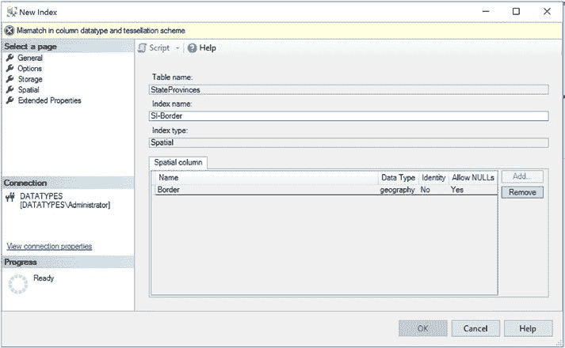

**图 11-10.** `新建索引`对话框—`常规`页面

在此对话框页面上，我们为索引指定了一个有意义的名称，并使用`添加`按钮添加了我们想要索引的列。现在，我们将进入`选项`页面，该页面如图 11-11 所示。

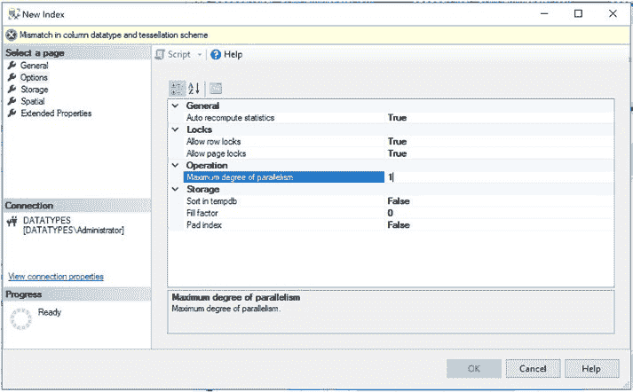

**图 11-11.** `新建索引`对话框—`选项`页面

`选项`页面对于任何创建过传统索引的人来说都会很熟悉。表 11-6 详细列出了每个可用选项。

**表 11-6.** 空间索引选项

| **选项** | **描述** |
| :--- | :--- |
| `自动重新计算统计信息` | 指定当统计信息被视为过时时是否应自动更新 |
| `允许行锁` | 指定访问索引时是否可以获取行锁 |
| `允许页锁` | 指定访问索引时是否可以获取页锁 |
| `最大并行度` | 对于构建主空间索引无效，因为此操作始终是单线程的 |
| `在 TempDB 中排序` | 如果指定，`在 TempDB 中排序`将导致中间结果集存储在`TempDB`中，而不是用户数据库中。这可能意味着索引构建速度更快。 |
| `填充因子` | 指定在索引最低级别的每个索引页上将保留的可用空间百分比。默认值为 0（100%满），表示只保留足以容纳单行的空间。指定低于 100 的百分比——例如指定 70——将保留 30%的可用空间，如果可能频繁进行行插入，这可以减少页拆分。 |
| `填充索引` | 将填充因子（见上文）应用于 B 树的中间级别 |

在`存储`页面（如图 11-12 所示）中，你可以指定索引将创建在其上的文件组。通常，为了获得最佳性能，索引最好与其表对齐在相同的文件组（或分区方案）上。从维护的角度来看，当表已分区时，将索引存储在不同的文件组上可能会有所帮助。如果不这样做，在表重新分区之前必须先删除索引。

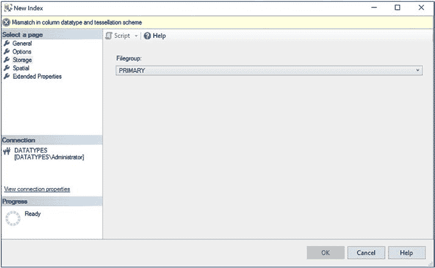

**图 11-12.** `新建索引`对话框—`存储`页面


# 第 11 章：处理空间数据

空间页面如图 11-13 所示。在这里，我们可以配置索引的空间特定选项。在页面的“常规”部分，我们可以选择我们的细分系统——自动或手动。如果选择手动，页面的“网格”区域将被激活，我们可以选择想要使用的网格密度。如果选择了手动几何系统，页面的“边界框”区域也会被激活，我们可以指定边界框坐标。

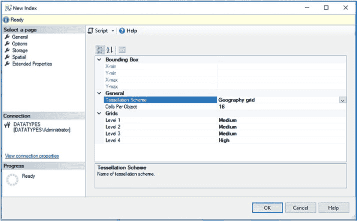

**图 11-13.** 新建索引对话框 - 空间页

**提示：** 几何系统必须用于 `GEOMETRY` 列，地理系统必须用于 `GEOGRAPHY` 列。

或者，我们可以使用 T-SQL 来创建索引。清单 11-13 中的脚本将创建与之前讨论的相同索引。

**清单 11-13.** 创建空间索引

```sql
USE WideWorldImporters
GO

CREATE SPATIAL INDEX [SI-Border]
ON Application.StateProvinces (Border)
USING GEOGRAPHY_GRID
WITH (GRIDS =(LEVEL_1 = MEDIUM,LEVEL_2 = MEDIUM,LEVEL_3 =
MEDIUM,LEVEL_4 = HIGH),
CELLS_PER_OBJECT = 16,
PAD_INDEX = OFF,
STATISTICS_NORECOMPUTE = OFF,
SORT_IN_TEMPDB = OFF,
DROP_EXISTING = OFF,
ONLINE = OFF,
ALLOW_ROW_LOCKS = ON,
ALLOW_PAGE_LOCKS = ON, MAXDOP = 1)
ON [PRIMARY] ;
```

## 总结

空间对象可以通过多种方式构造。可以使用 OGC 标准方法创建，从熟知文本或熟知二进制创建，也可以使用从 GML 扩展的 Microsoft 方法构造。SQL Server 还支持将熟知文本直接传递到表的单元变量中。

有大量方法可供开发人员轻松与空间数据交互。常用方法包括 `STDistance`（返回两个几何对象之间的距离）和 `STWithin`（检查一个实例是否位于另一个实例的同一空间内）。还有聚合方法，允许对多个实例进行并集、包络线和凸包操作，以及将多个实例转换为单个集合。

SQL Server 提供空间索引，可以提高某些类型查询的性能。索引对查询的支持取决于数据类型、`WHERE` 或 `JOIN` 子句中的方法以及使用的算术运算符。

空间索引使用 B 树结构，但在创建 B 树之前，会创建一个空间网格系统，具有四个嵌套级别。然后，从列中读取空间实例，一个一个地放入网格系统中，并使用希尔伯特曲线对它们接触的单元进行编号。这意味着空间实例可以以线性方式索引，同时详细描述它们彼此的接近程度。

# 第 12 章：处理层次数据与 HierarchyID

对 SQL Server 开发人员来说，对数据层次结构进行建模和处理一直是必需的。传统上，层次数据是通过表上的自连接在两个列之间建模的。一个列包含层次成员的 ID，另一个包含其父层次成员的 ID。然而，较新版本的 SQL Server（2008 及更高版本）提供了 `HierarchyID`。`HierarchyID` 是在.NET 中编写并在 SQL Server 中公开的数据类型。与使用带自连接的表相比，使用 `HierarchyID` 可以提供性能优势和简化的代码。该数据类型公开了许多可以对数据调用的方法，使开发人员能够轻松确定层次成员的祖先和后代，以及其他有用信息，例如特定成员在层次结构中的级别。

在本章中，我们将首先探讨层次数据的用例。我将讨论如何对传统层次结构建模，然后再解释如何使用 `HierarchyID` 重新建模。最后，我们将了解针对 `HierarchyID` 数据类型公开的方法。

© Peter A. Carter 2018

P. A. Carter, *SQL Server 高级数据类型*,

`doi.org/10.1007/978-1-4842-3901-8_12`

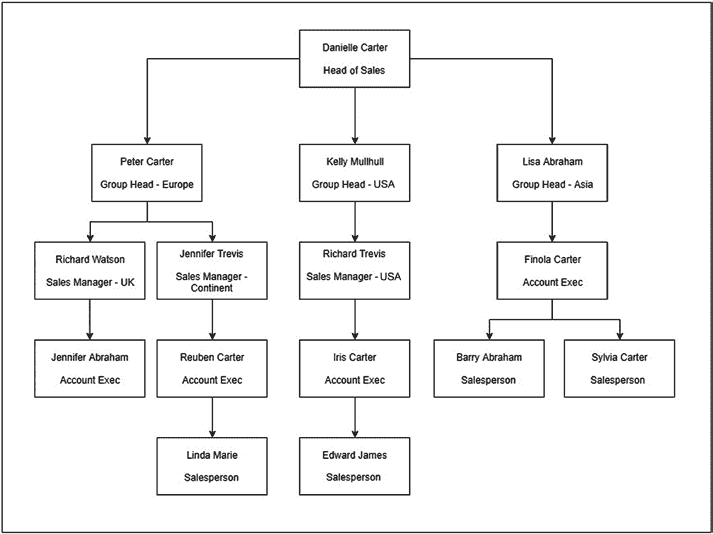

# 第 12 章 处理层次数据与 HierarchyID

## 层次数据用例

许多数据需求需要维护层次结构。

例如，考虑一个从组织结构图建模而来的员工层次结构（见图 12-1）。人力资源部门可能有汇报需求，需要确定有多少员工直接或间接向一位经理汇报。它可能还需要汇报更复杂的需求，例如每位部门主管下属的员工产生了多少收入。

***图 12-1.** 销售部门组织结构图*

层次数据的另一个经典用例是物料清单 (BoM)。BoM 定义了生产产品所需零件的层次结构。例如，图 12-2 展示了一个家用计算机的简单 BoM。计算机制造商需要为库存报告维护这些零件的层次结构。

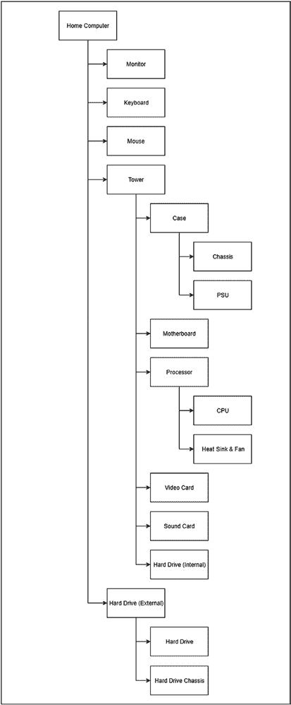

***图 12-2.** 物料清单*

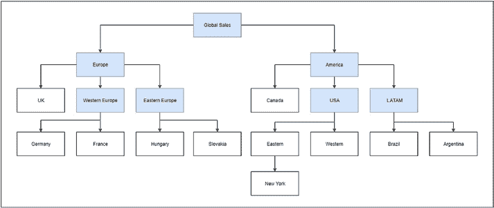

在本章中，我们将以销售区域层次结构为例进行讲解。如图 12-3 所示，我们将为全球销售区域建模。该层次结构是参差不齐的，这意味着在每个分支中可以有不同数量的层级。

***图 12-3.** 销售区域层次结构*

维护销售区域层次结构对许多公司都很重要，因为它允许公司就许多因素进行报告，从每个区域的收入、每个区域的销售人员数量到每个销售人员和区域的平均收入等。在此示例中，除了标准销售区域外，层次结构中还有聚合区域。这意味着这些区域没有销售人员，并且不直接产生销售。相反，它们是用于汇总下级层次结构的汇报层级。这些聚合区域以蓝色突出显示。

## 为传统层次结构建模

让我们看看如何使用传统方法为销售区域层次结构建模。为此，请考虑表 12-1 中的数据。

***表 12-1.** 销售区域层次结构*

| SalesAreaID | ParentSalesAreaID | SalesAreaName | CountOfSalesPeople | SalesYTD |
| :--- | :--- | :--- | :--- | :--- |
| globalSales | nUll | 全球销售 | nUll | |
| europe | globalSales | 欧洲 | nUll | |
| america | globalSales | 美洲 | nUll | |
| Uk | europe | 英国 | 300,000 | nUll |
| eastern europe | europe | 东欧 | nUll | nUll |
| Canada | america | 加拿大 | 350,000 | |
| USa | america | 美国 | nUll | nUll |
| lataM | america | 拉丁美洲 | nUll | nUll |
| germany | europe | 德国 | 150,000 | |
| France | europe | 法国 | 100,000 | |
| hungary | eastern europe | 匈牙利 | 50,000 | |
| Slovakia | eastern europe | 斯洛伐克 | 80,000 | |
| eastern | USa | 东部 | 140,000 | |
| Western | USa | 西部 | 280,000 | |
| Brazil | lataM | 巴西 | 100,000 | |
| argentina | lataM | 阿根廷 | 70,000 | |
| new york | eastern | 纽约 | 120,000 | |

在上表中，`SalesAreaID` 列将是表的主键，而 `ParentSalesAreaID` 列将是一个外键，引用 `SalesAreaID` 列，从而创建所谓的自连接。

**注意** 对于 `globalSales` 区域，`ParentSalesAreaID` 列为 `NULL`，因为它没有父级。这被称为层次结构的根。

`SalesAreaName` 列描述了销售区域，而 `CountOfSalesPeople` 和 `SalesYTD` 列详细说明了每个销售区域的业绩。我们将使用这些列来探索如何处理层次数据。您会注意到，对于聚合区域，`CountOfSalesPeople` 和 `SalesYTD` 列填充的是 `NULL` 值。这是因为它们是“虚拟”区域，没有销售人员驻扎。

可以使用清单 12-1 中的脚本创建此表。

***清单 12-1.*** 创建传统的层次结构表

```sql
USE WideWorldImporters
GO
CREATE TABLE Sales.SalesAreaTraditionalHierarchy
(
    SalesAreaID INT NOT NULL PRIMARY KEY,
    ParentSalesAreaID INT NULL
)
```

# 第 12 章 处理层次数据与 HierarchyID

```sql
REFERENCES Sales.SalesAreaTraditionalHierarchy(SalesAreaID),
SalesAreaName NVARCHAR(20) NOT NULL,
CountOfSalesPeople INT NULL,
SalesYTD MONEY NULL
);

INSERT INTO Sales.SalesAreaTraditionalHierarchy (
    SalesAreaID,
    ParentSalesAreaID,
    SalesAreaName,
    CountOfSalesPeople,
    SalesYTD
)
VALUES
    (1, NULL, 'GlobalSales', NULL, NULL),
    (2, 1, 'Europe', NULL, NULL),
    (3, 1, 'America', NULL, NULL),
    (4, 2, 'UK', 3, 300000),
    (5, 2, 'Western Europe', NULL, NULL),
    (6, 2, 'Eastern Europe', NULL, NULL),
    (7, 3, 'Canada', 4, 350000),
    (8, 3, 'USA', NULL, NULL),
    (9, 3, 'LATAM', NULL, NULL),
    (10, 5, 'Germany', 3, 150000),
    (11, 5, 'France', 2, 100000),
    (12, 6, 'Hungary', 1, 50000),
    (13, 6, 'Slovakia', 2, 80000),
    (14, 8, 'Eastern', 4, 140000),
    (15, 8, 'Western', 3, 280000),
    (16, 9, 'Brazil', 1, 100000),
    (17, 9, 'Agentina', 2, 70000),
    (18, 14, 'New York', 2, 120000);
```

假设我们必须使用这个传统层次结构来回答一个业务问题。例如，我们可能需要回答：“美洲地区的 `SalesYTD` 总额是多少？” 为了确定这一点，我们将必须编写一个查询，将该表与其自身进行联接，并对美洲地区下所有子区域的 `SalesYTD` 列进行汇总。

实现这一目标的最佳方法是使用递归 CTE（公用表表达式）。CTE 是一个临时结果集，在 `SELECT`、`UPDATE`、`INSERT`、`DELETE` 或 `CREATE VIEW` 语句的上下文中定义，并且只能在该查询内被引用。它类似于使用子查询作为派生表，但其好处在于它可以被多次引用，也可以引用自身。当 CTE 引用自身时，它就变成了递归 CTE。

CTE 使用 `WITH` 语句声明，该语句指定 CTE 的名称，后跟括号内的 CTE 将返回的列列表。然后使用 `AS` 关键字，后跟 CTE 的主体，同样包含在括号中。如 `清单 12-2` 所示。

**提示**：`清单 12-2 到 12-14` 中的查询并非设计为单独运行。`清单 12-15` 将它们全部组合成一个可用的脚本。

***清单 12-2.*** CTE 结构
```sql
WITH AreaHierarchy (SalesAreaID, SalesYTD, ParentSalesAreaID)
AS
(
    [CTE 主体]
)
```

递归 CTE 的定义包含两个查询，通过 `UNION ALL` 子句联接。第一个查询称为锚点查询，用于定义初始结果集。第二个查询称为递归查询，并引用该 CTE。第一层递归将与锚点查询进行联接，随后的递归层级将与紧邻其上方的递归层级进行联接。

因此，在我们的示例中，锚点查询将必须返回美洲销售区域的 `SalesAreaID`。由于所有使用 `UNION ALL` 联接的查询必须包含相同数量的列，我们的锚点查询还必须返回 `ParentSalesAreaID` 和 `SalesYTD` 列，即使这些值将是 `NULL`。

`清单 12-3` 中的查询展示了所需的锚点查询。

***清单 12-3.*** 锚点查询
```sql
SELECT
    SalesAreaID,
    SalesYTD,
    ParentSalesAreaID
FROM Sales.SalesAreaTraditionalHierarchy RootLevel
WHERE SalesAreaName = 'America'
```

递归查询将返回与锚点查询相同的列列表，但将包含一个 `JOIN` 子句，该子句将递归查询中的 `ParentSalesAreaID` 列与 CTE 的 `SalesAreaID` 列进行联接，如 `清单 12-4` 所示。

***清单 12-4.*** 递归查询
```sql
SELECT
    Area.SalesAreaID,
    Area.SalesYTD,
    Area.ParentSalesAreaID
FROM Sales.SalesAreaTraditionalHierarchy Area
INNER JOIN AreaHierarchy
    ON Area.ParentSalesAreaID = AreaHierarchy.SalesAreaID
```

声明此 CTE 后，我们将能够运行 `SELECT` 语句。

# 第 12 章 处理层次数据与 HierarchyID

## 清单 12-5. 综合运用

```sql
WITH AreaHierarchy (SalesAreaID, SalesYTD, ParentSalesAreaID)
AS
(
    SELECT
        SalesAreaID
        , SalesYTD
        , ParentSalesAreaID
    FROM Sales.SalesAreaTraditionalHierarchy RootLevel
    WHERE SalesAreaName = 'America'
    UNION ALL
    SELECT
        Area.SalesAreaID
        , Area.SalesYTD
        , Area.ParentSalesAreaID
    FROM Sales.SalesAreaTraditionalHierarchy Area
    INNER JOIN AreaHierarchy
        ON Area.ParentSalesAreaID = AreaHierarchy.SalesAreaID
)
SELECT SUM(SalesYTD)
FROM AreaHierarchy ;
```

该语句会向上汇总 `SalesYTD`，以返回整个美国的 `SalesYTD` 总额。清单 12-5 中的脚本将所有这些组件组合在了一起。

## 使用 HierarchyID 对层次结构建模

当使用 `HierarchyID` 对层次数据建模时，无需对表进行自连接。因此，我们将不再使用引用其父区域主键的列，而是使用一个 `HierarchyID` 列，该列定义每个区域在层次结构中的位置。为了进一步解释这个概念，让我们考虑表 12-2 中的数据。

### 表 12-2. 使用 HierarchyID 的销售区域层次结构

| 销售区域 ID | 销售区域层次结构 | 销售区域名称 | 销售人员数量 | 年初至今销售额 |
| :--- | :--- | :--- | :--- | :--- |
| 1 | / | 全球销售 | nUll | nUll |
| 2 | /1/ | 欧洲 | nUll | nUll |
| 3 | /2/ | 美洲 | nUll | nUll |
| 4 | /1/1/ | 英国 | 3 | 300,000 |
| 5 | /1/2/ | 西欧 | nUll | nUll |
| 6 | /1/3/ | 东欧 | nUll | nUll |
| 7 | /2/1/ | 加拿大 | 4 | 350,000 |
| 8 | /2/2/ | 美国 | nUll | nUll |
| 9 | /2/3/ | 拉丁美洲 | nUll | nUll |
| 10 | /1/2/1/ | 德国 | 3 | 150,000 |
| 11 | /1/2/2/ | 法国 | 2 | 100,000 |
| 12 | /1/3/1/ | 匈牙利 | 1 | 50,000 |
| 13 | /1/3/2/ | 斯洛伐克 | 2 | 80,000 |
| 14 | /2/2/1/ | 东部 | 4 | 140,000 |
| 15 | /2/2/2/ | 西部 | 3 | 280,000 |
| 16 | /2/3/1/ | 巴西 | 1 | 100,000 |
| 17 | /2/3/2/ | 阿根廷 | 2 | 70,000 |
| 18 | /2/2/1/1/ | 纽约 | 2 | 120,000 |

在表 12-2 中，您会注意到层次结构以 `/[节点]/[子节点]/[孙节点]/` 的格式表示，其中只包含 `/` 的行是层次结构的根节点。例如，我们看到德国的值 `/1/2/1/` 告诉我们德国是 `/1/2/`（西欧）的子节点，而 `/1/2/` 又是 `/1/`（欧洲）的子节点。`/1/` 是 `/`（全球销售）的子节点，后者是层次结构的根。

我们可以使用清单 12-6 中的脚本来创建和填充此表。

## 清单 12-6. 使用 HierarchyID 创建表

```sql
USE WideWorldImporters
GO

CREATE TABLE Sales.SalesAreaHierarchyID
(
    SalesAreaID INT NOT NULL PRIMARY KEY,
    SalesAreaHierarchy HIERARCHYID NOT NULL,
    SalesAreaName NVARCHAR(20) NOT NULL,
    CountOfSalesPeople INT NULL,
    SalesYTD MONEY NULL
) ;

INSERT INTO Sales.SalesAreaHierarchyID (
    SalesAreaID
    , SalesAreaHierarchy
    , SalesAreaName
    , CountOfSalesPeople
    , SalesYTD
)
VALUES
    (1, '/', 'GlobalSales', NULL, NULL),
    (2, '/1/', 'Europe', NULL, NULL),
    (3, '/2/', 'America', NULL, NULL),
    (4, '/1/1/', 'UK', 3, 300000),
    (5, '/1/2/', 'Western Europe', NULL, NULL),
    (6, '/1/3/', 'Eastern Europe', NULL, NULL),
    (7, '/2/1/', 'Canada', 4, 350000),
    (8, '/2/2/', 'USA', NULL, NULL),
    (9, '/2/3/', 'LATAM', NULL, NULL),
    (10, '/1/2/1/', 'Germany', 3, 150000),
    (11, '/1/2/2/', 'France', 2, 100000),
    (12, '/1/3/1/', 'Hungary', 1, 50000),
    (13, '/1/3/2/', 'Slovakia', 2, 80000),
    (14, '/2/2/1/', 'Eastern', 4, 140000),
    (15, '/2/2/2/', 'Western', 3, 280000),
    (16, '/2/3/1/', 'Brazil', 1, 100000),
    (17, '/2/3/2/', 'Agentina', 2, 70000),
    (18, '/2/2/1/1/', 'New York', 2, 120000) ;
```

尽管我们向 `SalesAreaHierarchy` 列插入了人类可读的字符串，但 SQL Server 会将这些字符串转换并存储为十六进制值。这使得该列极其紧凑和高效。可以使用清单 12-7 中的查询来比较 `HierarchyID` 列的大小与传统层次结构中用于 `ParentSalesAreaID` 列的 `INT` 列的大小。

## 清单 12-7. 比较传统层次结构与 HierarchyID 的大小

```sql
USE WideWorldImporters
GO

SELECT
    SUM(DATALENGTH(salesareahierarchy)) AS SizeOf
```


# 第 12 章 处理分层数据与 HierarchyID

## 大小比较查询

查询示例：

```sql
HierarchyID, SUM(DATALENGTH(parentsalesareaid)) AS SizeOfTraditional
FROM Sales.SalesAreaHierarchyID SalesAreaHierarchy
INNER JOIN sales.SalesAreaTraditionalHierarchy SalesAreaTraditional
ON SalesAreaHierarchy.SalesAreaID = SalesAreaTraditional.SalesAreaID;
```

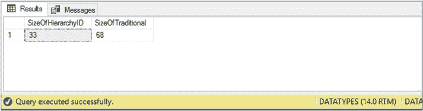

如图 12-4 所示，`HierarchyID`列的大小不到用于`ParentSalesAreaID`的`INT`列的一半。

**图 12-4.** 大小比较结果

> **注意** 在第 1 章中，你了解到使用正确的数据类型很重要。如果我选择对`parentSalesareaiD`列使用`SMALLINT`，这两列的大小将大致相同。然而，这是一个为了解释`HierarchyID`而提供的次要示例。如果你正在大规模地实现层次结构，这个示例是一个公平的体现。

## 对 HierarchyID 列执行 SELECT 语句

如果我们对`SalesAreaHierarchyID`表运行一个普通的`SELECT`语句，我们可以看到原始的十六进制值。例如，考虑清单 12-8 中的查询。

**清单 12-8.** 对 HierarchyID 列的 SELECT 语句

```sql
USE WideWorldImporters
GO
SELECT
    SalesAreaName,
    SalesAreaHierarchy
FROM Sales.SalesAreaHierarchyID;
```

此查询的结果如图 12-5 所示。你会注意到，`SalesAreaHierarchy`列的内容以十六进制值返回，而不是人类可读的字符串。为了查看我们输入的人类可读的字符串，我们必须使用本章“使用 HierarchyID 方法”一节中讨论的`ToString()`方法。

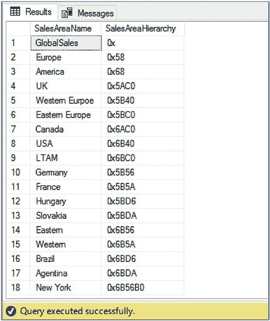

**图 12-5.** 对 HierarchyID 列执行 SELECT 语句的结果

## HierarchyID 方法

`HierarchyID`数据类型提供了许多方法，允许开发人员在使用层次结构时快速编写高效的代码。表 12-3 详细说明了这些方法。

**表 12-3.** HierarchyID 数据类型暴露的方法

| 方法 | 描述 |
| :--- | :--- |
| `GetAncestor` | 返回层次结构节点的祖先。接受一个参数，定义应从层次结构的多少层向上返回祖先。例如，`GetAncestor(1)`将返回节点的父节点，而`GetAncestor(2)`将返回节点的祖父节点。 |
| `GetDescendant` | 返回给定节点在层次结构中的子节点 ID。`GetDescendant()`方法通常用于创建两个节点。因此，该方法接受两个参数，类型均为`HierarchyID`。生成的节点将位于指定的两个节点之间。 |
| `GetLevel` | 返回节点的层次级别。 |
| `GetRoot` | 一个静态方法，返回层次结构的根级别。 |
| `IsDescendantOf` | `IsDescendantOf()`方法接受一个类型为`HierarchyID`的参数，如果给定节点是作为参数传递的节点的后代，则返回 1。 |
| `Parse` | 解析作为参数传递的节点的字符串表示形式，以确保其有效。如果有效，则返回其十六进制表示。如果无效，将引发错误。 |
| `Read` | 从`Binaryreader`读取`SqlHierarchyId`的二进制表示，并将`SqlHierarchyId`对象设置为该值。`Read()`方法只能从`SQlClr`调用，不能从`t-SQl`调用。使用`t-SQl`时，应改用`CAST`或`CONVERT`。 |
| `GetReparentedValue` | 用于将节点移动到新父节点。接受两个参数，第一个是原始父节点，第二个是新父节点。 |
| `ToString` | 返回层次结构中节点的字符串格式化表示。 |
| `Write` | 将`SqlHierarchyId`对象的二进制表示形式写入`BinaryWriter`。 |


# 将 SqlHierarchyId 的二进制表示形式写入 BinaryWriter。仅适用于 SQL CLR。使用 T-SQL 时，请改用 `CAST` 或 `CONVERT`。

**提示：** `HierarchyID` 方法区分大小写。例如，调用 `tostring()` 会引发错误；调用 `ToString()` 则会成功。

## 使用 HierarchyID 方法

以下各节介绍如何使用 `HierarchyID` 数据类型所公开的方法。

### 使用 ToString( )

如果对具有 `HierarchyID` 数据类型的列运行 `SELECT` 语句，返回的值将是该节点的十六进制表示形式。若要查看节点的文本表示形式，必须使用 `ToString()` 方法。例如，考虑清单 12-9 中的查询。

#### 清单 12-9. 使用 ToString()
```sql
USE WideWorldImporters
GO

SELECT
    SalesAreaName
    , SalesAreaHierarchy
    , SalesAreaHierarchy.ToString() AS SalesAreaHierarchyString
FROM Sales.SalesAreaHierarchyID ;
```

此查询的结果显示在图 12-6 中。您会看到，一旦对其调用 `ToString()` 方法，该列就变得人类可读。

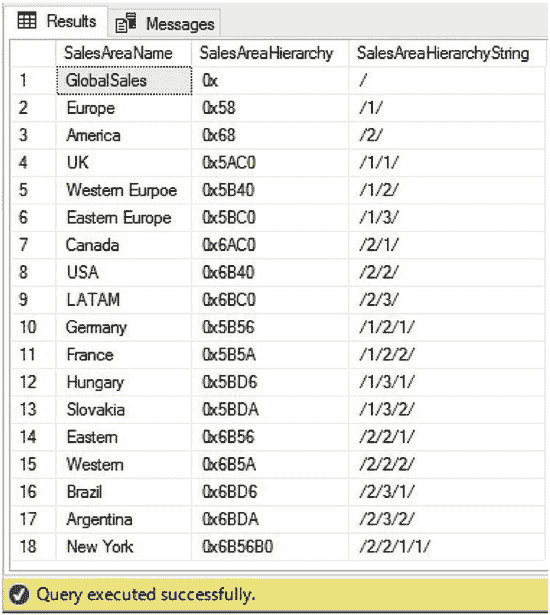

**图 12-6.** 使用 `ToString()` 的结果

### 使用 Parse( )

当节点的字符串表示形式被插入到 `HierarchyID` 列时，会隐式调用 `Parse()` 方法。本质上，`Parse()` 方法执行的是与 `ToString()` 方法相反的功能。它尝试将格式化的字符串表示形式转换为 `HierarchyID` 表示形式。如果失败，则会引发错误。例如，考虑清单 12-10 中的脚本。

#### 清单 12-10. 使用 Parse() 方法
```sql
--返回节点的十六进制表示形式
SELECT HierarchyID::Parse('/1/1/2/2/') ;

--由于缺少尾部斜杠 / 而引发错误
SELECT HierarchyID::Parse('/1/1/2/2') ;
```

运行此脚本显示的“结果”选项卡如图 12-7 所示。第一个查询显示了预期结果，而第二个查询则不返回任何结果。

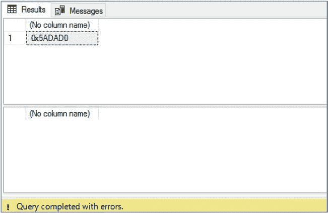

**图 12-7.** 使用 `Parse()` 的结果选项卡

查看图 12-8 所示的“消息”选项卡，会详细说明 .NET 框架引发的错误。

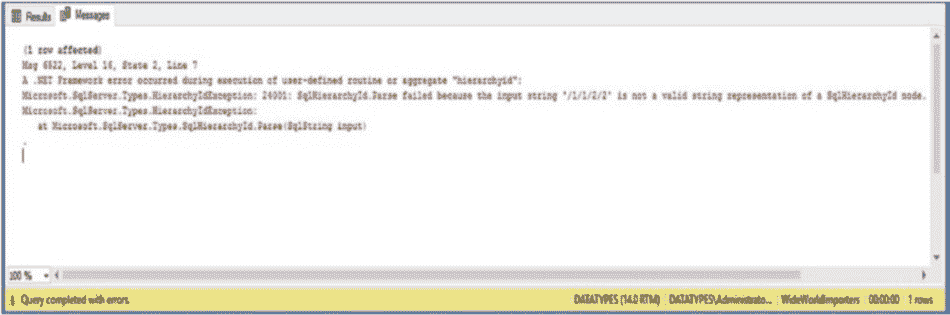

**图 12-8.** .NET 框架引发的错误

### 使用 GetRoot( )

`GetRoot()` 方法将返回层次结构的根节点，如清单 12-11 所示。

#### 清单 12-11. 使用 GetRoot()
```sql
USE WideWorldImporters
GO

SELECT
    SalesAreaName
    , SalesAreaHierarchy.ToString()
FROM Sales.SalesAreaHierarchyID
WHERE SalesAreaHierarchy = HierarchyID::GetRoot() ;
```

此查询的结果可查看图 12-9。

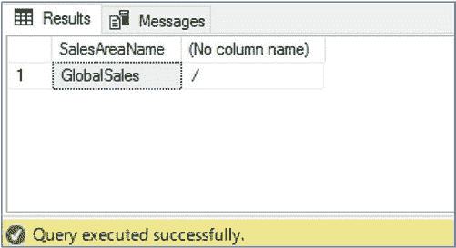

**图 12-9.** 使用 `GetRoot()` 的结果

### 使用 GetLevel( )

`GetLevel()` 方法允许您确定特定节点位于层次结构的哪一级别。例如，清单 12-12 中的查询将返回位于层次结构最低级别的所有节点。在我们的例子中，这仅是纽约。

子查询将确定层次结构中的最大级别，外部查询将返回位于该级别的所有销售区域。

#### 清单 12-12. 使用 GetLevel()
```sql
USE WideWorldImporters
GO

SELECT
    SalesAreaName
FROM Sales.SalesAreaHierarchyID
WHERE SalesAreaHierarchy.GetLevel() =
(
    SELECT
        MAX(SalesAreaHierarchy.GetLevel())
    FROM Sales.SalesAreaHierarchyID
) ;
```

此查询的结果如图 12-10 所示。

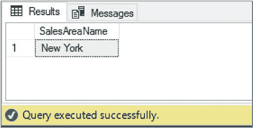

**图 12-10.** 使用 `GetLevel()` 的结果

### Read( ) 和 Write( )


由于本章重点介绍如何在 T-SQL 代码中使用 `HierarchyID`，而 `Read()` 和 `Write()` 方法仅适用于 SQLCLR（一种允许在 SQL Server 内部创建托管对象的技术），因此对 `Read()` 和 `Write()` 方法的完整描述超出了本书的范围。

## 使用 GetDescendant( )

当然，开发者可以在现有节点之间向层次结构中插入一个新节点，但 `GetDescendant()` 方法能帮助开发者以实用的方式完成此操作。该方法接受两个参数，这两个参数都可以是 `NULL`，并代表现有的子节点。然后，该方法将使用以下规则生成一个节点值：

*   如果父节点为 `NULL`，则返回 `NULL` 值。
*   如果父节点不为 `NULL`，且两个参数均为 `NULL`，则返回父节点的第一个子节点。
*   如果父节点和第一个参数不为 `NULL`，但第二个参数为 `NULL`，则返回父节点下大于第一个参数的子节点。
*   如果父节点和第二个参数不为 `NULL`，但第一个参数为 `NULL`，则返回父节点下小于第二个参数的子节点。
*   如果父节点和两个参数均不为 `NULL`，则返回父节点下介于两个参数之间的子节点。
*   如果第一个参数不为 `NULL` 且不是父节点的子节点，则抛出错误。
*   如果第二个参数不为 `NULL` 且不是父节点的子节点，则抛出错误。
*   如果第一个参数大于或等于第二个参数，则抛出错误。

例如，假设我们想在父节点 `America` 下创建一个名为 `Spain` 的新销售区域。我们希望该节点值介于 `Canada` 和 `USA` 之间。我们可以通过清单 12-13 中的查询实现这一点。

**提示**：显然，`Spain` 应包含在 `Western Europe` 下，而不是 `America` 下。别担心，这是一个故意设置的错误，我们将在本章的“使用 GetReparentedValue”一节中解决这个问题。

### 清单 12-13. 生成一个新的层次结构节点

```sql
USE WideWorldImporters
GO
SELECT NewNode.ToString()
FROM
(
    SELECT
        SalesAreaHierarchy.GetDescendant(0x6AC0,0x6B40) AS NewNode
    FROM Sales.SalesAreaHierarchyID
    WHERE SalesAreaName = 'America'
) NewNode ;
```

此查询产生的结果如图 12-11 所示。

你会看到最低级别包含一个句点（`.`）(`1.1`)。这是因为 `Canada` 的值为 `1`，而 `USA` 的值为 `2`。因此，为了生成介于两者之间的节点值，不能使用整数。这保证了新节点总是可以插入到两个现有节点之间。

### 图 12-11. 使用 GetDescendant() 的结果

要以编程方式将 `Spain` 销售区域添加到层次结构中，我们可以使用清单 12-14 中的查询。

### 清单 12-14. 向层次结构中插入新节点

```sql
USE WideWorldImporters
GO
INSERT INTO Sales.SalesAreaHierarchyID
(
    SalesAreaID
    , SalesAreaHierarchy
    , SalesAreaName
    , CountOfSalesPeople
    , SalesYTD
)
SELECT
    (SELECT MAX(SalesAreaID) + 1 FROM Sales.SalesAreaHierarchyID)
    , SalesAreaHierarchy.GetDescendant(0x6AC0,0x6B40)
    , 'Spain'
    , 2
    , 200000
FROM Sales.SalesAreaHierarchyID
WHERE SalesAreaName = 'America' ;
```

## 使用 GetReparentedValue( )

正如你可能在“使用 GetDescendant()”一节中注意到的，`Spain` 销售区域被错误地创建在了 `America` 聚合区域下，而不是 `Western Europe` 聚合区域下。我们可以通过使用 `GetReparentedValue()` 方法来解决这个问题。

考虑清单 12-15 中的脚本。首先，我们声明两个类型为 `HierarchyID` 的变量。这些将作为参数传递给 `GetReparentedValue()` 方法。`@America` 变量被赋值...


# 第 12 章 处理层次数据和 HierarchyID

## 使用 GetReparentedValue()

该方法涉及原始父级销售区域的销售区域层次结构节点，而 `@WesternEurope` 变量则填充了目标父级销售区域的销售区域层次结构节点。

### 清单 12-15. 使用 GetReparentedValue()

```sql
USE WideWorldImporters
GO

DECLARE @America HIERARCHYID =
(
    SELECT SalesAreaHierarchy
    FROM Sales.SalesAreaHierarchyID
    WHERE SalesAreaName = 'America'
) ;

DECLARE @WesternEurope HIERARCHYID =
(
    SELECT SalesAreaHierarchy
    FROM Sales.SalesAreaHierarchyID
    WHERE SalesAreaName = 'Western Europe'
) ;

SELECT Area.ToString()
FROM
(
    SELECT SalesAreaHierarchy.GetReparentedValue(@America,
    @WesternEurope) AS Area
    FROM Sales.SalesAreaHierarchyID
    WHERE SalesAreaHierarchy = 0x6B16
) NewNodePath ;
```

``

此脚本的结果如图 12-12 所示。你会注意到叶节点值保持不变，而路径（父节点）已被更改，使得该节点现在位于西欧聚合区域下。

### 图 12-12. 使用 GetReparentedValue() 的结果

我们可以通过清单 12-16 中的脚本来更新 `Sales.SalesAreaHierarchyID` 表中西班牙销售区域的祖先关系。

### 清单 12-16. 更新西班牙销售区域的祖先关系

```sql
USE WideWorldImporters
GO

DECLARE @America HIERARCHYID =
(
    SELECT SalesAreaHierarchy
    FROM Sales.SalesAreaHierarchyID
    WHERE SalesAreaName = 'America'
) ;

DECLARE @WesternEurope HIERARCHYID =
(
    SELECT SalesAreaHierarchy
    FROM Sales.SalesAreaHierarchyID
    WHERE SalesAreaName = 'Western Europe'
) ;

UPDATE Sales.SalesAreaHierarchyID
SET SalesAreaHierarchy =
(
    SELECT SalesAreaHierarchy.GetReparentedValue(@America,
    @WesternEurope)
    FROM Sales.SalesAreaHierarchyID
    WHERE SalesAreaHierarchy = 0x6B16
)
WHERE SalesAreaHierarchy = 0x6B16 ;
```

## 使用 GetAncestor()

`GetAncestor()` 方法可用于根据输入参数指定的级别数，返回给定层次节点的祖先节点。例如，考虑清单 12-17 中的查询。该查询将通过向 `GetAncestor()` 方法传递不同的参数，返回西班牙的祖父节点、父节点和西班牙本身。

**注意** 要使此查询按预期工作，你必须首先运行本章前面的示例。具体来说，是“使用 GetDescendant()”和“使用 GetReparentedValue()”部分中的插入和更新查询，以及创建和填充表的清单 12-2。

### 清单 12-17. 使用 GetAncestor()

```sql
USE WideWorldImporters
GO

SELECT
    CurrentNode.SalesAreaName AS SalesArea
    , ParentNode.SalesAreaName AS ParentSalesArea
    , GrandParentNode.SalesAreaName AS GrandParentSalesArea
FROM Sales.SalesAreaHierarchyID Base
INNER JOIN Sales.SalesAreaHierarchyID CurrentNode
    ON CurrentNode.SalesAreaHierarchy = Base.SalesAreaHierarchy.GetAncestor(0)
INNER JOIN Sales.SalesAreaHierarchyID ParentNode
    ON ParentNode.SalesAreaHierarchy = Base.SalesAreaHierarchy.GetAncestor(1)
INNER JOIN Sales.SalesAreaHierarchyID GrandParentNode
    ON GrandParentNode.SalesAreaHierarchy = Base.SalesAreaHierarchy.GetAncestor(2)
WHERE Base.SalesAreaName = 'Spain' ;
```

## 使用 IsDescendantOf()

`IsDescendantOf()` 方法用于评估层次结构中的某个节点是否是作为参数传入的节点的后代（在任何层级上）。我们可以使用这个方法来重写清单 12-5 中的查询，该查询使用传统层次结构汇总了美国聚合区域下所有销售区域的 `SalesYTD`。

你会记得，当使用传统层次结构时，我们必须实现一个递归 CTE，来为所有属于美国后代的层级汇总 `SalesYTD` 列。而当使用


# 第 12 章 处理层次数据和 HierarchyID

一个 `HierarchyID` 列来维护层次结构，然而，我们的代码被大大简化了，如代码清单 12-18 所示。

### 代码清单 12-18. 使用 IsDescendantOf()

```sql
USE WideWorldImporters
GO

SELECT
    SUM(SalesYTD) AS TotalSalesYTD
FROM Sales.SalesAreaHierarchyID
WHERE SalesAreaHierarchy.IsDescendantOf(0x68) = 1 ;
```

与递归 CTE 不同，功能等价的代码是一个简单的查询，带有一个 `WHERE` 子句，该子句基于节点是否为美洲聚合区域的后代来过滤层次节点。代码清单 12-19 展示了一个更复杂的例子。在这里，我们对销售区域进行参数化，并计算不仅包括总的 `SalesYTD`，还包括 `TotalSalesPeople` 和该区域的 `AverageSalesPerSalesPerson`。

### 代码清单 12-19. 对 IsDescendantOf() 查询进行参数化

```sql
USE WideWorldImporters
GO

DECLARE @Region NVARCHAR(20) = 'America' ;
DECLARE @RegionHierarchy HIERARCHYID =
(
    SELECT SalesAreaHierarchy
    FROM Sales.SalesAreaHierarchyID
    WHERE SalesAreaName = @Region
) ;

SELECT
    SUM(SalesYTD) AS TotalSalesYTD
    , SUM(CountOfSalesPeople) AS TotalSalesPeople
    , SUM(SalesYTD) / SUM(CountOfSalesPeople) AS
      AverageSalesPerSalesPerson
FROM Sales.SalesAreaHierarchyID
WHERE SalesAreaHierarchy.IsDescendantOf(@RegionHierarchy) = 1 ;
```

你可以清楚地看到 `Region` 参数如何能被传递到存储过程中，这样应用程序就可以访问这段代码。

现在，让我们在 `SELECT` 列表中添加一个 `SalesAreaName`，并按此列进行分组，如代码清单 12-20 所示。

### 代码清单 12-20. 添加 GROUP BY

```sql
USE WideWorldImporters
GO

DECLARE @Region NVARCHAR(20) = 'America' ;
DECLARE @RegionHierarchy HIERARCHYID =
(
    SELECT SalesAreaHierarchy
    FROM Sales.SalesAreaHierarchyID
    WHERE SalesAreaName = @Region
) ;

SELECT
    SUM(SalesYTD) AS TotalSalesYTD
    , SUM(CountOfSalesPeople) AS TotalSalesPeople
    , SUM(SalesYTD) / SUM(CountOfSalesPeople) AS
      AverageSalesPerSalesPerson
    , SalesAreaName
FROM Sales.SalesAreaHierarchyID
WHERE SalesAreaHierarchy.IsDescendantOf(@RegionHierarchy) = 1
GROUP BY SalesAreaName ;
```

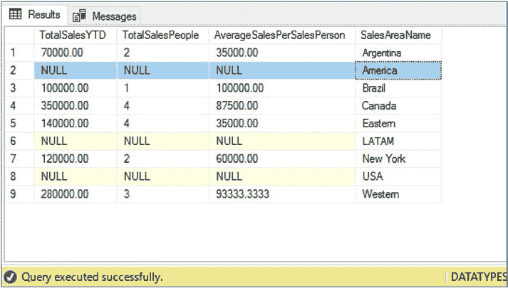

此查询的结果如图 12-13 所示。

### 图 12-13. 结合使用 IsDescendantOf() 与 GROUP BY 的结果

此查询结果揭示的一个有趣行为是 `America` 被包含在内。这是因为 `HierarchyID` 将 `America` 视为其自身的后代。这对我们来说不会造成问题，因为聚合不是预先计算好的。然而，在某些情况下，你可能需要将 `America` 从结果集中排除。这可以通过在 `WHERE` 子句中添加一个额外的过滤器轻松实现，如代码清单 12-21 所示。

### 代码清单 12-21. 从后代中过滤掉当前节点

```sql
USE WideWorldImporters
GO

DECLARE @Region NVARCHAR(20) = 'America' ;
DECLARE @RegionHierarchy HIERARCHYID =
(
    SELECT SalesAreaHierarchy
    FROM Sales.SalesAreaHierarchyID
    WHERE SalesAreaName = @Region
) ;

SELECT
    SUM(SalesYTD) AS TotalSalesYTD
    , SUM(CountOfSalesPeople) AS TotalSalesPeople
    , SUM(SalesYTD) / SUM(CountOfSalesPeople) AS
      AverageSalesPerSalesPerson
    , SalesAreaName
FROM Sales.SalesAreaHierarchyID
WHERE SalesAreaHierarchy.IsDescendantOf(@RegionHierarchy) = 1
    AND SalesAreaHierarchy <> @RegionHierarchy
GROUP BY SalesAreaName ;
```

此查询过滤结果集，排除了其层次节点等于传递给 `IsDescendantOf()` 方法的层次节点的销售区域。这种技术允许我们在 `GROUP BY` 上使用 `WITH ROLLUP` 子句，并结合用 `ISNULL()` 函数包装 `SalesAreaName`，以为整个美洲区域生成一个小计行。这在代码清单 12-22 中进行了演示。


# 第 12 章 处理层级数据与 HierarchyID

## 代码清单 12-22. 为美洲区域生成汇总行

```sql
USE WideWorldImporters
GO

DECLARE @Region NVARCHAR(20) = 'America';

DECLARE @RegionHierarchy HIERARCHYID =
(
    SELECT SalesAreaHierarchy
    FROM Sales.SalesAreaHierarchyID
    WHERE SalesAreaName = @Region
);

SELECT
    SUM(SalesYTD) AS TotalSalesYTD,
    SUM(CountOfSalesPeople) AS TotalSalesPeople,
    SUM(SalesYTD) / SUM(CountOfSalesPeople) AS AverageSalesPerSalesPerson,
    ISNULL(SalesAreaName, @Region)
FROM Sales.SalesAreaHierarchyID
WHERE SalesAreaHierarchy.IsDescendantOf(@RegionHierarchy) = 1
    AND SalesAreaHierarchy <> @RegionHierarchy
GROUP BY SalesAreaName WITH ROLLUP;
```

此查询的结果可在图 12-14 中查看。

## 图 12-14. 添加汇总行后的结果

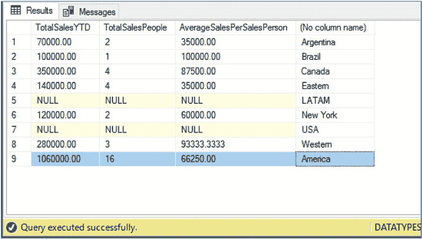

## 为 HierarchyID 列建立索引

没有像`XML`或地理空间数据类型那样支持`HierarchyID`的“特殊”索引类型。不过，可以通过使用传统的聚集索引和非聚集索引来提升`HierarchyID`列的性能。在为`HierarchyID`创建索引时，根据将使用这些索引的查询的性质，可以采用两种策略。

默认情况下，在`HierarchyID`列上创建索引将生成一个深度优先索引。这意味着后代节点将存储在靠近其父节点的位置。在我们的例子中，纽约将存储在靠近东部的位置，而东部又将存储在靠近美国的位置，依此类推。代码清单 12-23 中的脚本演示了如何在`SalesAreaHierarchy`列上创建一个采用深度优先方法的聚集索引。

**注意**：此脚本首先删除`SalesAreaID`列上的主键，这会隐式删除该列上的聚集索引。本例中主键名称是系统生成的。因此，要运行此脚本，您必须将约束名称更改为反映您自己系统的名称。

## 代码清单 12-23. 创建深度优先聚集索引

```sql
USE WideWorldImporters
GO

ALTER TABLE Sales.SalesAreaHierarchyID
DROP CONSTRAINT PK__SalesAre__DB0A1ED5D7B258FB;
GO

CREATE CLUSTERED INDEX SalesAreaHierarchyDepthFirst
ON Sales.SalesAreaHierarchyID(SalesAreaHierarchy);
GO
```

我们可以通过运行代码清单 12-24 中的查询来查看 SQL Server 如何组织这些数据。此查询使用未公开的`sys.fn_PhysLocFormatter()`函数，以`FileID:PageID:SlotID`格式返回每条记录的精确位置。

## 代码清单 12-24. 查看行位置

```sql
USE WideWorldImporters
GO

SELECT
    SalesAreaName,
    sys.fn_PhysLocFormatter(%%physloc%%) AS PhysicalLocation
FROM Sales.SalesAreaHierarchyID;
```

此查询返回如图 12-15 所示的结果。您可以看到每个节点都存储在其父节点之下。即使是西班牙也是如此，尽管我们在其他区域之后添加了它，这意味着它的原始位置本应是页面中最后使用的槽位。

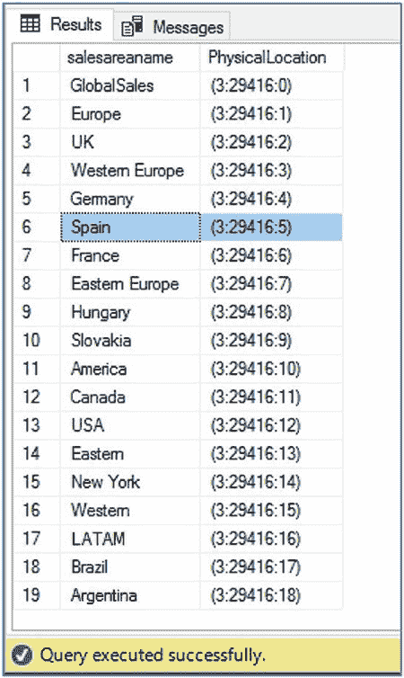

## 图 12-15. 查看行位置的结果

**提示**：当您自己运行查询时，行的物理位置很可能不同。

另一种可能的索引策略是广度优先技术。在这种方法中，同级节点将彼此靠近存储，而不是将后代节点彼此靠近存储。要实现广度优先索引策略，我们必须向表中添加一个额外的列，用于存储每个节点的层级。可以通过代码清单 12-25 中的脚本来创建和填充此列。

## 代码清单 12-25. 添加层级列以支持广度优先索引

```sql
USE WideWorldImporters
GO

ALTER TABLE Sales.SalesAreaHierarchyID ADD
    SalesAreaLevel INT NULL;
GO

UPDATE Sales.SalesAreaHierarchyID
```


# 第 12 章 处理层次数据与 HierarchyID

`SET SalesAreaLevel = SalesAreaHierarchy.GetLevel() ;`

使用清单 12-26, w 中的脚本，我们现在可以创建一个`聚集索引`，该索引首先按`节点`的层次级别排序，然后按`HierarchyID`列排序。这将使得同级节点在存储时彼此靠近。

`注意`：该脚本会先删除已有的`聚集索引`，因为一张表只能支持一个`聚集索引`。

## 清单 12-26. 创建广度优先索引

```sql
USE WideWorldImporters

GO

DROP INDEX SalesAreaHierarchyDepthFirst ON Sales.SalesAreaHierarchyID ;

GO

CREATE CLUSTERED INDEX SalesAreaHierarchyBredthFirst

ON Sales.SalesAreaHierarchyID(SalesAreaLevel, SalesAreaHierarchy) ;
```

清单 12-27 演示了如何使用与清单 12-24 相同的技术，来查看每个`节点`在层次结构中的实际位置。

这一次，除了返回`销售区域名称`外，我们还将返回`SalesAreaLevel`以便于分析。

## 清单 12-27. 使用广度优先策略查看行位置

```sql
USE WideWorldImporters

GO

SELECT

SalesAreaName

, SalesAreaLevel

, sys.fn_PhysLocFormatter(%%physloc%%) AS PhysicalLocation

FROM Sales.SalesAreaHierarchyID ;
```

此查询的结果可在图 12-16 中找到。您会注意到行的顺序已经改变，并且`UK`、`Western Europe`、`Eastern Europe`、`Canada`、`USA`和`LATAM`现在彼此相邻，因为它们都处于层次结构的第 2 级。

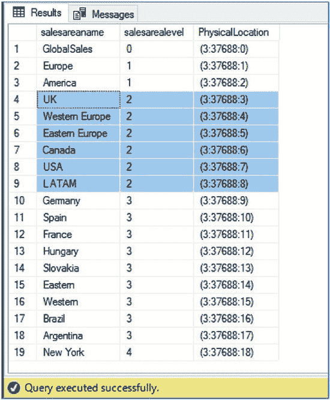

## 图 12-16. 在广度优先层次结构中查看行位置的结果

## 总结

`HierarchyID`是作为一个`.NET`类创建的，并在`SQL Server`中实现为一种数据类型。与在`SQL Server`中建模层次结构的传统方法相比，使用`HierarchyID`具有降低代码复杂性和提高性能的双重优势。`HierarchyID`数据类型公开了几种方法，开发者可以使用它们轻松地导航层次结构、插入新的层次节点或更新现有节点使其位于新的父节点之下。

根据我的经验，最常用的两种方法是`ToString()`方法（它允许开发者将层次节点格式化为人类可读的字符串表示形式）和`IsDescendantOf()`方法（它执行层次节点血缘评估，当节点是输入参数的后代时返回`1`，否则返回`0`）。

`Read()`和`Write()`方法提供了到`SQLCLR`的数据类型转换功能，但这些未在`T-SQL`中实现，因为可以轻松使用`CAST`和`CONVERT`函数来代替。

在为`HierarchyID`列建立索引时，可以采用深度优先策略或广度优先策略。深度优先是默认选项，它将子节点存储在其父节点附近。广度优先策略需要在表中增加一个额外的列来存储节点在层次结构中的级别。这允许一个多列索引将同级节点存储在一起。您选择的索引选项应反映针对`HierarchyID`列运行的查询的性质。

### 索引

### A

`NTEXT`, 12

`NVARCHAR`, 12

高级数据类型

字符串存储

`GEOGRAPHY`, 25

大小, 13

`GEOMETRY`, 25

`TEXT`, 12

`HIERARCHYID`, 25

`VARCHAR`, 11

`JSON`, 25

聚集索引

`XML`, 25

创建, 165–167

聚合方法, 325

描述, 159

插入, 164

### B

主键, 162–163

## C

### 二进制数据类型

表格

B-Tree 结构，161–162

`BINARY`，14

堆结构, 160–161

`CONVERT` 函数，15

更新，164

转换为字符

公用表表达式（CTE），

字符串，17

347–348

加密密码, 15–16

### 配置管理

`IMAGE`，14

数据库（CMDB），197–198

样式选项，15

`CONVERT` 函数，7

`VARBINARY`，14

`CAST` 函数，7，9–10

转换, 22

### 字符数据类型

`CHAR`, 11

`NCHAR`, 11

## D

### 日期和时间数据类型

`DATE`, 18

`DATETIME`，18

`DATETIME2`，19

日期和时间数据类型（*续*）

`DATETIMEOFFSET`, 19

`SMALLDATETIME`, 18

样式选项，20–21

`TIME`，18

### 文档类型定义（DTD），

42, 48

列别名, 212–215

`NULL` 值, 207–211

`exist()` 方法, 116–118

返回键和日期, 201–202

返回结果, 203

根节点, 204–207

## 可扩展标记语言（XML）

以属性为中心的方法

方面，36–37

生成，31

销售订单, 30

定义，29

以元素为中心的方法

生成，35

销售订单, 32–35

SQL Server

数据结构，47

`FOR XML` 子句，46

`JSON`，47

`OPENXML()` 函数，46

`XQuery` `Nodes` 方法，46

层级级别, 98

`OrderDetails` 子查询，99

所需格式，100

根和 `<row>` 元素，98

`@` 符号，92

`XSD` 架构，43–45

XML 输出, 92–98, 100

### FOR XML AUTO, `SalesOrder`

结果，78–85

重写查询后的结果，86–91

重写查询以嵌套数据, 86

根节点，85

`NULL` 值, 103

`Order Details`, 101–102

`UNION ALL`, 103–104

结果，104

### FOR XML EXPLICIT, `SalesOrder`

自定义和复杂结构, 92

销售订单, 46

格式良好的（*参见* 格式良好的 XML）

`XSD` 架构，43–45

### FOR XML PATH, `SalesOrder`

层级级别, 98

`OrderDetails` 子查询，99

所需格式，100

根和 `<row>` 元素，98

`@` 符号，92

`XSD` 架构，43–45

XML 输出, 92–98, 100

### FOR XML RAW,

WideWorldImporters `SalesOrders`

## FOR JSON AUTO, `SalesOrder`

详情, 17, 18

自动嵌套

添加订单行详情，

216–217

嵌套连接，218–220

用于嵌套数据的子查询，

221–223

### FOR JSON PATH, 224–227

## HierarchyID

广度优先索引

### 索引

© Peter A. Carter 2018

P. A. Carter，*SQL Server 高级数据类型*，

[`doi.org/10.1007/978-1-4842-3901-8`](https://doi.org/10.1007/978-1-4842-3901-8)

## G

### GetAncestor() 方法
`GetAncestor()` 方法，页码 [370–371]

### GetDescendant() 方法
`GetDescendant()` 方法，页码 [364–367]

### GetLevel() 方法
`GetLevel()` 方法，页码 [363–364]

### GetReparentedValue() 方法
`GetReparentedValue()` 方法，页码 [367–370]

### GetRoot() 方法
`GetRoot()` 方法，页码 [362–363]

### 地理标记语言 (GML)
地理标记语言 (GML)，页码 [302]
方法，页码 [356–358]
`Parse()`，页码 [360–362]
`Read()` 和 `Write()`，页码 [364]
`ToString()`，页码 [358–360]
查看行位置，页码 [378–379]

## H

### 层级数据
物料清单 (BoM)，页码 [342–343]
销售区域层级 (参见 销售区域层级)
销售部门组织结构图，页码 [342]

## I

### 索引
#### 附加列
`附加列`，页码 [380]

#### ELEMENTS 关键字
`ELEMENTS` 关键字，页码 [59–68]

#### 创建
创建，页码 [380–381]

#### 输出
输出，页码 [50]

#### 查看行位置
查看行位置
查询，页码 [49], [51], [381–382]
根节点，页码 [54–58]
深度优先聚簇索引，页码 [377]
`<row>` 元素，页码 [68–77]
`GetAncestor()`，页码 [370–371]
`XML` 片段，页码 [51–54]
`GetDescendant()`，页码 [364–367]
`GetLevel()`，页码 [363–364]
`GetReparentedValue()`，页码 [367–370]
`GetRoot()`，页码 [362–363]
`IsDescendantOf()`，页码 [371–376]

#### 索引 JSON 数据
ALTER TABLE 脚本，页码 [272]
检查索引性能，页码 [274–275]
计算列，页码 [274]
`JSON_VALUE()`，页码 [271]
性能基线，页码 [272]
StockItems 表，页码 [272]
TIME STATISTICS，页码 [271], [273]
WHERE 子句，页码 [273]

#### IsValidDetailed 错误代码
`IsValidDetailed` 错误代码，页码 [324–325]

## J, K, L

### 已修改的行
已修改的行，页码 [268–269]

### 标签数组
`Tags` 数组，页码 [270]

### 已更新的记录
已更新的记录，页码 [268]

### 更新行
更新行，页码 [267]

### 更新值
更新值，页码 [266–267]

### JavaScript 对象表示法 (JSON) 文档
配置即代码，页码 [197–198]
日志数据，页码 [199]
名称/值对，页码 [182], [199]
规范化数据，页码 [195–196]
多层应用程序，页码 [195]
简单，页码 [182]
车辆温度
完整传感器数据，页码 [184–185]
根节点，页码 [186–188]
顶部，页码 [182–183]
与 XML 对比，页码 [188]

### JSON 数据类型
`ISJSON()` 函数
错误，页码 [252]
筛选结果，页码 [253–254]
IF 语句，页码 [251–252]

### JSON_QUERY() 函数
JSON 文档，页码 [261–262]
路径变量和文档上下文，页码 [264–265]
SELECT 列表，页码 [263]
WHERE 子句，页码 [264]

### JSON_VALUE() 函数
宽松模式路径表达式，页码 [260]
NULL 结果，页码 [255]
OPENJSON()，页码 [254]
参数，页码 [254]
路径表达式，页码 [255]
结果，页码 [257]


## **M**

`OPENJSON()` 函数  
默认架构  
`Application.Person` 表, 229, 230  
数据类型, 231–232  
数据类型  
动态 `PIVOT`, 235–236  
`OUTER APPLY` 操作符, 232–233  
`PIVOT` 操作符, 233–235  
分解，单个 `JSON` 文档, 230–231  

杂项数据类型

`JSON_MODIFY()` 函数

已修改的文档, 270–271

## **N**

数值数据类型

`NVARCHAR(MAX)` 列, 251  
`NVARCHAR(MAX), 238–239`

## **O**

节点表, 167  
开放地理空间联盟 (`OGC`), 296, 300

`OPENJSON()` 函数

`OUTER APPLY`, 241–242

## **P**

`Parse()` 方法, 360–362  
主 XML 索引  
添加列对话框, 169  
创建, 171  
新建索引对话框, 168  
节点表, 167  
选项, 169–171  
标量/XML 子树, 167

## **Q**

`查询 JSON 数据`, *参见* `JSON`  
`query()` 方法, 121–123

## **R**

射频识别 (`RFID`), 199  
`Read()` 和 `Write()` 方法, 364

## **S**

销售区域层次结构, 344  
阿拉巴马州州界  
地址验证, 326–327  
聚合包络面面积, 331–332  
区域的位置, 350–351  
创建表, 352  
`SELECT` 语句, 354–356  
大小, 353–354  
递归查询, 349  
传统方法, 345–347  
锚定查询, 349  
组成部分, 349–350  
`CTE`, 347–348  
`HierarchyID`  
暴露 `SRID`, 329–330  
查找最近邻, 327–329  
构造几何图形  
`GML`, 302  
方法, 300  
`NULL` 值, 304  
`SELECT` 列表, 256–257  
空间数据, 279  
聚合方法, 325  
销售部门组织

## **索引条目**

- `SELECT` 列表, 256–257
- 格式不正确
- `variable`, 260–261
- `JSON`, 252
- `WHERE` 子句, 258–259
- `NVARCHAR(MAX)`
- 列, 251
- `CURSOR`, 23
- `array` 元素, 268
- `SQL VARIANT`, 23
- 删除数据, 269
- `TABLE`, 23
- `TIMESTAMP`, 23
- `UNIQUEIDENTIFIER`, 23–24
- 显式架构
- 数值数据类型
- `results`, 238
- `BIT`, 2
- `返回 JSON 数据`, 239–240
- `CAST` 函数, 7, 9–10
- `T-SQL` 数据类型, 237
- `CONVERT` 函数, 7
- 路径表达式
- `DECIMAL`, 3
- `array` 元素, 244–245
- `FLOAT`, 5
- `results`, 243
- `INT`, 2
- `sales` 订单，根节点, 242–243
- `MONEY`, 6
- `NUMERIC`, 4
- `REAL`, 5
- `SMALLINT`, 2
- `SMALLMONEY`, 6
- `style` 选项, 7–8
- `TINYINT`, 2
- 默认架构
- `data` 类型, 231–232
- `data` 类型
- `动态 PIVOT`, 235–236
- `分解`，单个 `JSON` 文档, 230–231


点方法, 302–303

图表, 342

### STIsValid 和 MakeValid

### 次要 XML 索引

方法，多边形，305–307

### 拆分 JSON 数据

WKB, 302

数组元素，临时

WKT, 300–301, 303–304

表, 246–249

`GEOGRAPHY` 数据类型, 282–284

`OPENJSON()` 函数 (参见 282–284 `OPENJSON()` 函数)

`GEOMETRY` 数据类型, 280–282

### 拆分 XML

索引 (参见 空间索引)

`nodes()`, 146–151

`IsValidDetailed` 错误代码, 324–325

`OPENXML()` 标志值, 142

方法, 307–323

参数, 141–142

多部件几何体, 286

`Product` 元素, 145

基本几何体, 284–285

结果, 146

空间参考系统, 291–293

销售订单文档, 143–144

SSMS, 294–296

`sp_xml:preparedocument` 存储过程, 143

WKB, 289–291

WKT, 287–288

`WITH` 子句, 142, 145

### 索引

### 空间索引

语法不正确, 38–39

B 树结构, 333

语法错误, 40

创建, 339

`已知二进制 (WKB)`, 300

数据类型, 332–333

十六进制表示—大端序, 291

网格系统, 334

十六进制值, 289

“新建索引”对话框的“常规”页, 334–335

`LineString`, 302

“选项”页, 335–337

面类型整型代码, 289

“空间”页, 338–339

`已知文本 (WKT)`, 301

“存储”页, 337–338

`LineString`, 301

细分过程, 334

多部件几何体, 288

T-SQL, 339

基本几何体, 287–288

`空间参考标识符 (SRID)`, 291, 293

变量, 303–304

`SQL Server Management Studio (SSMS)`, 294–296

#### X, Y, Z

`XML` 数据, 25

#### T, U

样式选项, 26

### XML 索引

`细分过程`, 334

聚集 (参见 聚集索引)

`ToString()` 方法, 358–360

`OrderSummary` 表, 157–159

#### V

`PATH` 索引

删除主 XML 索引并运行查询, 178

`Ordered StockItemID`, 23, 175

查询执行时间, 178–179

#### W

`格式正确的 XML` 组件, 42

查询结果, 176–177

片段, 40–41

运行查询, 176

主, 167–171

要求, 38

次要, 171–174

根节点, 41–42

类型, 157

### 索引

`XML 架构集合`, 152–154

方法, 113–114

`XML` 文档, 127–128

`XML` 架构定义 (`XSD`) 架构, 43–45

`modify` 方法删除选项, 138–139

### XQuery

定义, 113

`exist()`, 116, 118

`FLWOR` 语句

`for` 和 `let` 语句, 131

`insert` 选项, 133–137

产品元素, 129–130

`replace value of` 选项, 139–141

变量, 123–127

`query()`, 121–123

产品名称, 130

关系值, T-SQL `Sales.CustomerOrderSummary`, 114–116

`where` 和 `order by` 语句, 132

`value()`, 118–121


*   目录
*   关于作者
*   关于技术审校者
*   前言
*   第 1 章：SQL Server 数据类型
    *   数值数据类型
    *   字符串
    *   二进制数据类型
    *   日期和时间
    *   其他标准数据类型
    *   高级数据类型总结
    *   为何使用正确的数据类型很重要？
    *   本章小结
*   第 2 章：理解 XML
    *   理解 XML
    *   格式良好的 XML
    *   理解 XSD 架构
    *   SQL Server 中的 XML 使用场景
    *   本章小结
*   第 3 章：使用 T-SQL 构建 XML
    *   使用 FOR XML RAW
    *   使用 FOR XML AUTO
    *   使用 FOR XML PATH
    *   使用 FOR XML EXPLICIT
    *   本章小结
*   第 4 章：查询和解析 XML
    *   查询 XML
        *   使用 `exist()`
        *   使用 `value( )`
        *   使用 `query( )`
        *   在 XQuery 中使用关系值
        *   FLWOR
        *   修改 XML 数据
    *   解析 XML
        *   使用 `OPENXML( )` 解析
        *   使用 Nodes 方法解析
    *   使用架构
    *   本章小结
*   第 5 章：XML 索引
    *   准备环境
    *   聚集索引
        *   没有聚集索引的表
        *   具有聚集索引的表
        *   聚集主键
        *   聚集索引的性能考虑
        *   创建聚集索引
    *   主 XML 索引
        *   创建主 XML 索引
    *   辅助 XML 索引
        *   创建辅助 XML 索引
    *   XML 索引的性能考虑
    *   本章小结
*   第 6 章：理解 JSON
    *   理解 JSON 格式
    *   JSON 与 XML
    *   JSON 使用场景
        *   使用 REST API 的 N 层应用程序
        *   反规范化数据
        *   配置即代码
        *   分析日志数据
    *   本章小结
*   第 7 章：从 T-SQL 构建 JSON
    *   FOR JSON AUTO
        *   处理根节点
        *   处理 NULL 值
        *   使用列别名
        *   自动嵌套
    *   FOR JSON PATH
    *   本章小结
*   第 8 章：解析 JSON 数据
    *   使用默认架构的 `OPENJSON()`
        *   解析列
        *   基于文档内容的动态解析
    *   使用显式架构的 `OPENJSON( )`
    *   使用路径表达式的 `OPENJSON( )`
        *   将数据解析到表中
    *   本章小结
*   第 9 章：使用 JSON 数据类型
    *   查询 JSON 数据
        *   使用 `ISJSON( )`
        *   使用 `JSON_VALUE( )`
        *   使用 `JSON_QUERY( )`
        *   使用 `JSON_MODIFY()`
    *   为 JSON 数据创建索引
    *   本章小结
*   第 10 章：理解空间数据
    *   理解空间数据
    *   空间数据标准
        *   熟知文本
        *   熟知二进制
        *   空间参考系统
    *   SSMS 与空间数据
    *   本章小结
*   第 11 章：使用空间数据
    *   构建空间数据
    *   查询空间数据
    *   为空间数据创建索引
        *   理解空间索引
        *   创建空间索引
    *   本章小结
*   第 12 章：使用层级数据和 HierarchyID
    *   层级数据用例
    *   对传统层级进行建模
    *   使用 HierarchyID 对层级进行建模
    *   HierarchyID 方法
        *   使用 HierarchyID 方法
            *   使用 `ToString( )`
            *   使用 `Parse( )`
            *   使用 `GetRoot( )`
            *   使用 `GetLevel( )`
            *   `Read( )` 和 `Write( )`
            *   使用 `GetDescendant( )`
            *   使用 `GetReparentedValue( )`
            *   使用 `GetAncestor( )`
            *   使用 `IsDescendantOf( )`
    *   为 HierarchyID 列创建索引
    *   本章小结
*   索引
