# 第 2 章

## 理解高可用性与灾难恢复技术

SQL Server 提供了一套完整的技术来实现高可用性和灾难恢复。本章概述了这些技术，并讨论了它们最适用的场景。

### AlwaysOn 故障转移集群

Windows 集群是一种提供高可用性的技术，其中一组最多 64 台服务器协同工作以提供冗余。AlwaysOn 故障转移集群实例（FCI）是一个 SQL Server 实例，跨越此组内的服务器。如果该组内的一台服务器发生故障，另一台服务器将接管该实例的所有权。其最适用的场景是数据库规模较大或写入负载较高的高可用性场景。这是因为集群依赖于共享存储，这意味着数据只写入磁盘一次。而对于 SQL Server 级别的高可用性技术，写入操作会在主数据库上执行，然后在所有辅助数据库上再次执行，之后才在主数据库上完成提交。这可能会导致性能问题。

尽管可以将集群扩展到多个站点，但在 Windows Server 2012 R2 及更早版本中，这需要 SAN 复制，这意味着集群通常配置在单个站点内。当配置了 SAN 复制时，故障转移到辅助站点不是自动的（除非您创建自定义脚本来自动化此过程）。这是因为必须停止 SAN 复制，并且 SAN 在灾难恢复站点的 LUN 需要手动设为可写。在 SAN 复制处于活动状态时，它们将呈现给灾难恢复服务器为只读。

Windows Server 2016 通过引入存储副本（SR）技术解决了此问题。SR 旨在提供一种不依赖于 SAN 复制的地理集群解决方案，它执行与存储无关的块级数据同步。SR 可以在同步或异步模式下工作，在同步模式下使用时会产生性能开销，而在异步模式下使用则存在潜在的数据丢失风险。

© Peter A. Carter 2016

## 第二章 ■ 理解高可用性与灾难恢复技术

P. A. Carter, *SQL Server AlwaysOn 技术揭秘*, DOI 10.1007/978-1-4842-2397-0_2

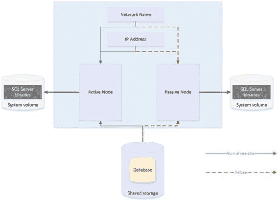

Windows Server 2016 还引入了站点感知集群功能，通过增强节点间心跳检测和故障转移行为等操作，提高了多站点集群的可管理性。此版本的 Windows 也移除了对所有集群节点必须位于同一域中的依赖，这意味着集群可以跨越多个域，甚至可以存在于工作组中。

集群中的每台服务器称为一个节点。因此，如果一个集群由三台服务器组成，则称为三节点集群。集群中的每个节点都安装了 SQL Server 二进制文件，但 SQL Server 服务仅在其中一个节点上启动，该节点称为活动节点。集群中的每个节点还共享用于 SQL Server 数据和日志文件的相同存储。然而，该存储仅附加到活动节点。

如果活动节点发生故障，则 SQL Server 服务将停止，存储将被分离。然后，存储会重新附加到集群中的另一个节点，并在该节点（现在成为活动节点）上启动 SQL Server 服务。该实例还会被分配自己的网络名称和 IP 地址，这些也会绑定到活动节点。这意味着应用程序可以无缝连接到该实例，无论哪个节点拥有所有权。

图 2-1 中的示意图说明了一个双节点集群。它显示尽管数据库存储在共享存储阵列上，但每个节点仍然有一个专用的系统卷。该卷包含 SQL Server 二进制文件。它还说明了在发生故障转移时，共享存储、IP 地址和网络名称如何重新绑定到被动节点。

**图 2-1.** 双节点集群

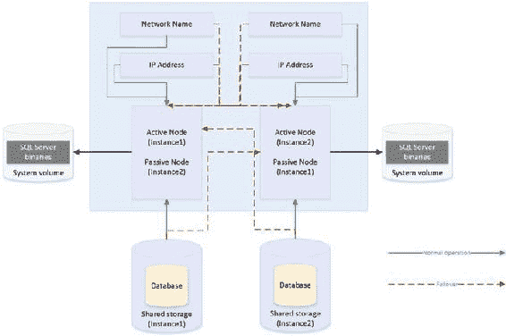

### 主动/主动配置

虽然图 2-1 说明了主动/被动配置，但也可能采用主动/主动配置。尽管一次不可能有一个以上的节点拥有一个实例，因此无法实现负载均衡，但可以在集群上安装多个实例，并且不同的节点可以拥有每个实例。在此场景中，每个节点都有其唯一的网络名称和 IP 地址。每个实例的共享存储也由一组唯一的卷组成。

因此，在主动/主动配置中，在正常操作期间，`Node1` 可能托管 `Instance1`，`Node2` 可能托管 `Instance2`。如果 `Node1` 发生故障，则两个实例都将由 `Node2` 托管，反之亦然。图 2-2 中的示意图说明了一个双节点主动/主动集群。

**图 2-2.** 主动/主动集群

■ **注意** 在主动/主动集群中，考虑故障转移时的资源至关重要。例如，如果每个节点有 128GB 的 RAM，并且托管在每个节点上的实例使用了 96GB 的 RAM 并在内存中锁定页面，那么当一个节点故障转移到另一个节点时，该节点也会因为没有足够的内存分配给两个实例而失败。请确保您规划内存和处理器需求时，将两个节点视为一台服务器。因此，通常不建议为 SQL Server 使用主动/主动集群。

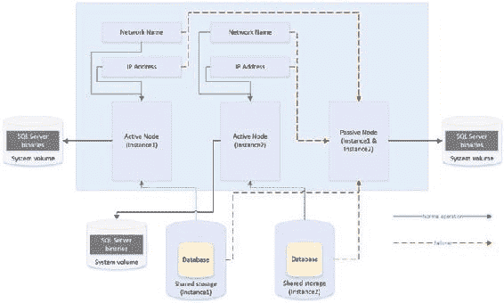

### 三节点以上配置

如前所述，一个集群最多可以拥有 64 个节点。当您拥有三个或更多节点时，由于相关成本，您不太可能只保留一个活动节点和两个冗余节点。相反，您可以选择实施 `N+1` 或 `N+M` 配置。

在 `N+1` 配置中，您拥有多个活动节点和一个被动节点。如果

## 第 2 章 理解高可用性与灾难恢复技术

活动节点中的任何一个发生故障，它们都会故障转移到被动节点。图 2-3 中的示意图描绘了一个三节点的 `N+1` 集群。

**图 2-3.** 三节点 `N+1` 配置

在 `N+1` 配置中，在多重故障场景下，多个节点可能会故障转移到被动节点。因此，在规划资源时必须非常小心，以确保被动节点能够支持多个实例。不过，你可以通过使用 `N+M` 配置来缓解这个问题。

`N+1` 配置拥有多个活动节点和一个被动节点，而 `N+M` 集群则拥有多个活动节点和多个被动节点，尽管被动节点的数量通常少于活动节点。图 2-4 展示了一个五节点的 `N+M` 配置。图中显示，Instance3 被配置为始终故障转移到其中一个被动节点，而 Instance1 和 Instance2 被配置为始终故障转移到另一个被动节点。这让你可以灵活地控制被动节点上的资源，但你也可以将集群配置为允许任何活动节点故障转移到任一被动节点——如果这更适合你的环境设计的话。

**图 2-4.** 五节点 `N+M` 配置

### 仲裁

为了能够进行自动故障转移，集群服务需要知道节点是否宕机。为此，你必须形成一个仲裁。仲裁的定义是“为开展业务所需的最少成员数量”。在高可用性方面，这意味着集群内的每个节点，以及一个可选的见证设备（可以是集群磁盘或集群外部的文件共享），都会获得一票投票权。如果超过半数的投票成员无法与某个节点通信，那么集群服务就会知道该节点已宕机，并将该服务器上任何感知集群的应用程序故障转移到另一个节点。之所以要求超过半数的投票成员无法与该节点通信，是为了避免一种称为*脑裂*的情况。

为了解释脑裂场景，想象一下数据中心 1 中有三个节点，数据中心 2 中有三个节点。现在假设两个数据中心之间的网络连接中断，但所有六个节点仍然在线。数据中心 1 中的三个节点认为数据中心 2 中的所有节点都不可用。反之，数据中心 2 中的节点认为数据中心 1 中的节点不可用。这使得集群的双方（称为分区）都认为自己应该取得控制权。这对于成功连接到其中任一分区的任何应用程序都可能产生不可预测且不希望的后果。`仲裁 = (投票成员数 / 2) + 1` 这个公式可以防范此场景。

**提示** 如果你的集群失去了仲裁，你可以通过使用 `/fq` 开关启动集群服务来强制使一个分区联机。如果你使用的是 Windows Server 2012 R2 或更高版本，那么你强制联机的分区被视为*权威分区*。这意味着当连接恢复时，其他分区可以自动重新加入集群。

#### 表 2-1. 仲裁模型

**仲裁模型** | **适用场景**
---|---
节点多数 | 当集群中的节点数为奇数时
节点 + 磁盘见证多数 | 当集群中的节点数为偶数时
节点 + 文件共享见证多数 | 当节点分布在多个站点，或节点数为偶数时

## Windows Server 2016 高可用与灾难恢复技术

### 避免使用共享磁盘的仲裁配置

当节点分布在多个站点，但没有第三个数据中心来托管文件共享仲裁见证时，需要避免使用共享磁盘。这种仲裁模型是 Windows Server 2016 中的新功能。

**本章稍后将讨论因虚拟化而需要避免使用共享磁盘的原因。**

虽然默认选项是“一节点一票”，但可以通过将 `NodeWeight` 属性更改为零来手动移除节点的投票权。这在你拥有**多子网集群**（节点分布在多个站点的集群）时非常有用。在此场景中，建议在第三个站点使用文件共享见证。这有助于避免因数据中心之间的网络故障导致的集群中断。然而，如果仲裁中的节点数为奇数，那么添加文件共享见证会使总票数变为偶数，这是危险的。移除辅助数据中心中一个节点的投票权可以消除此问题。

> **注意：** 文件共享见证和仲裁见证不存储仲裁数据库的完整副本。这意味着带有文件共享见证的双节点集群容易受到一种称为**脑裂**的场景影响。在此场景中，如果你正在修补或更改第二个节点的集群服务时其中一个节点发生故障，那么将没有最新的仲裁数据库副本。这会使你陷入需要销毁并重建集群的境地。

### 动态仲裁与解决 50% 节点分割的方法

Windows Server 2012 R2 引入了动态仲裁和用于处理 50% 节点分割的“打破僵局”概念。

当启用动态仲裁时，集群服务会根据集群中的节点数量自动决定是否赋予仲裁见证投票权。
*   如果节点数为偶数，则见证被赋予投票权。
*   如果节点数为奇数，则见证不被赋予投票权。

用于 50% 节点分割的“打破僵局”概念扩展了这一理念。如果你有偶数个节点并使用见证，而见证发生故障，那么集群服务会自动从集群内一个随机节点移除其投票权。这能维持仲裁中的奇数票数，降低因见证故障导致集群离线的风险。

> **注意：** 集群将在第 3 章和第 4 章中更深入地讨论。

### 数据库镜像

数据库镜像是一种可以同时提供高可用性和灾难恢复配置的技术。与依赖 Windows 集群服务不同，数据库镜像完全在 SQL Server 内部实现，并在数据库级别（而非实例级别）提供可用性。它的工作原理是压缩事务日志记录，并通过 TCP 端点将它们发送到辅助服务器。

数据库镜像拓扑精确包含一个主服务器、一个辅助服务器和一个可选的见证服务器。

数据库镜像是一项已弃用的技术，这意味着它将在未来的 SQL Server 版本中被移除。然而，在 SQL Server 2014 中，它仍然可以发挥作用。例如，如果你正在将数据层应用程序从 SQL Server 2008（当时不支持 AlwaysOn 可用性组，但已实现了数据库镜像）升级，并且预计应用程序的生命周期将在下一个主要 SQL Server 版本发布之前结束，那么你可以继续使用数据库镜像。一些组织，特别是 Windows 管理团队与 SQL Server DBA 团队之间存在脱节的组织，也选择在数据库镜像被移除之前不实现 AlwaysOn 可用性组（特别是用于灾难恢复），这是因为其相对复杂性和涉及多团队协作的特点。

## 第二章 ■ 理解高可用性与灾难恢复技术

在管理 AlwaysOn 环境时，数据库镜像也可能很有用。当你通过并行迁移方式将数据层应用程序从旧版 SQL Server 升级时，情况也是如此。这是因为你可以同步数据库，并以最小的停机时间进行故障转移。如果升级不成功，你可以以最小的工作量和停机时间将它们移回原始服务器。

数据库镜像可以配置为在三种不同模式下运行：高性能模式、高安全模式以及带自动故障转移的高安全模式。在高性能模式下运行时，数据库镜像以异步方式工作。数据在主体数据库上提交，然后被发送到镜像数据库，随后在镜像数据库上提交。这意味着在发生故障时有可能丢失数据。如果数据丢失，恢复点是最老的未提交事务的开始时刻。这意味着你无法保证依赖于异步镜像来实现可用性的恢复点目标，因为它是不确定的。在此配置中也不支持自动故障转移。因此，异步镜像提供的是灾难恢复解决方案，而非高可用性解决方案。图 2-5 中的图表展示了一个配置为高性能模式的镜像拓扑。

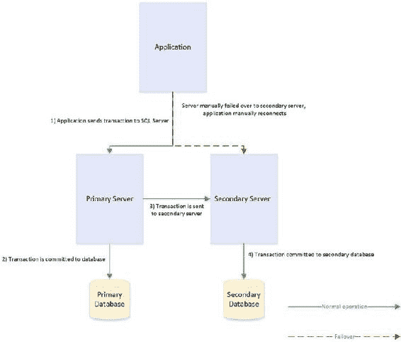

**图 2-5.** 高性能模式下的数据库镜像

在带自动故障转移的高安全模式下运行时，数据在镜像服务器上以同步方式提交，而非异步方式。这意味着数据在主体服务器提交之前，先在镜像服务器提交。这可能会导致性能下降，并且需要两台服务器之间有快速的网络链路。网络延迟应小于 3 毫秒。

为了支持自动故障转移，数据库镜像拓扑需要形成一个仲裁。为了实现仲裁，它需要一台第三服务器。这台服务器称为见证服务器，它用于在主体服务器和镜像服务器失去网络连接时进行仲裁。因此，如果主体服务器和镜像服务器位于不同的站点，最佳实践是将见证服务器放在与主体服务器相同的数据中心，而不是与镜像服务器放在一起。这可以降低因数据中心之间网络中断而导致它们被隔离并引发故障转移的可能性。图 2-6 中的图表展示了一个配置为带自动故障转移的高安全模式的数据库镜像拓扑。

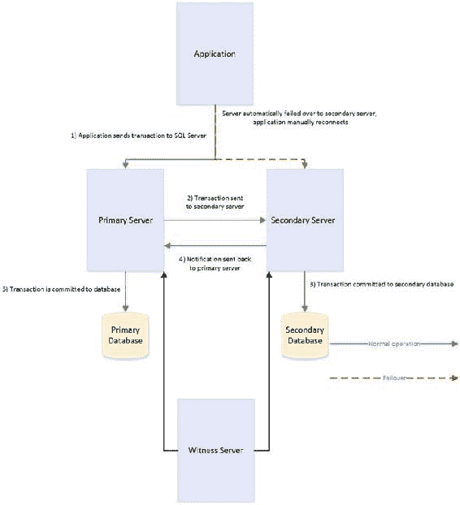

**图 2-6.** 带自动故障转移的高安全模式下的数据库镜像

高安全模式结合了另外两种模式的缺点。你会遇到与带自动故障转移的高安全模式相同的性能下降，但同时你也会遇到与高性能模式相关的手动服务器故障转移。高安全模式提供的优势在于，当见证服务器离线时，它具有弹性。如果数据库镜像失去见证服务器，为了避免脑裂场景而挂起镜像会话，它会切换到高安全模式。这意味着数据库镜像继续运行，但没有自动故障转移。高安全模式在计划内故障转移场景中也很有用。如果你的主体服务器在线，但需要进行维护性故障转移，那么你可以切换到高安全模式。这实质上是将数据库置于安全状态，不存在数据丢失的可能性，而无需你配置见证服务器。然后你就可以故障转移数据库。在维护工作完成并将数据库故障恢复后，

then you can revert to High Performance mode.
这样，你就可以切换回高性能模式。

#### Tip
**提示**

数据库镜像不支持使用内存中 OLTP 的数据库。
数据库镜像不支持使用内存中 OLTP（内存优化）的数据库。

如果你的数据库包含内存优化文件组，你将无法配置数据库镜像。
如果你的数据库包含内存优化文件组，你将无法配置数据库镜像。

### AlwaysOn 可用性组
### AlwaysOn 可用性组

AlwaysOn 可用性组取代了数据库镜像，它本质上是数据库镜像和集群技术的融合。在集群的每个节点上，SQL Server 以独立实例（而不是 AlwaysOn 故障转移集群实例）的形式安装。然后，一个名为可用性组侦听器的集群感知应用程序被安装在集群上；它用于将流量定向到正确的节点。然而，AOAG 不依赖于共享磁盘，而是压缩日志流并将其发送到其他节点，其方式类似于数据库镜像。
AlwaysOn 可用性组取代了数据库镜像，它本质上是数据库镜像与故障转移群集技术的融合。在群集的每个节点上，SQL Server 以独立实例（而非 AlwaysOn 故障转移群集实例）的形式安装。然后，一个名为“可用性组侦听器”的、群集感知的应用程序会安装在群集上；它用于将流量定向到正确的节点。然而，AOAG 不依赖于共享磁盘，而是压缩日志流并将其发送到其他节点，其方式类似于数据库镜像。

在 SQL Server 2016 之前，AlwaysOn 可用性组仅在 SQL Server 的企业版中受支持。然而，在 SQL Server 2016 中，标准版开始支持 AlwaysOn 可用性组，但仅提供基本功能。标准版中的基本功能仅支持两个副本。这旨在作为标准版对数据库镜像（仅限高安全模式）支持的替代方案。
在 SQL Server 2016 之前，AlwaysOn 可用性组仅在 SQL Server 企业版中受支持。然而，在 SQL Server 2016 中，标准版开始支持 AlwaysOn 可用性组，但仅提供基本功能。标准版中的基本功能仅支持两个副本。这旨在替代标准版对数据库镜像（仅限高安全模式）的支持。

在你拥有写入量较小的中小型数据库场景下，AOAG 是最合适的高可用性技术。这是因为，当使用同步模式时，它要求在数据提交到主数据库之前，先提交到所有同步副本。然而，与数据库镜像不同，你最多可以拥有八个副本，其中包括两个同步副本。在虚拟化环境中实现高可用性时，AOAG 也可能是最合适的技术。这是因为集群所需的共享磁盘可能与虚拟化环境的某些功能不兼容。例如，当虚拟机使用通过光纤通道呈现的共享磁盘时，VMware 不支持使用 vMotion（用于在物理服务器之间手动移动虚拟机）和分布式资源调度器（用于根据资源利用率在物理服务器之间自动移动虚拟机）。
在你拥有写入量较小的中小型数据库场景下，AOAG 是最合适的高可用性技术。这是因为，当使用同步模式时，它要求在数据提交到主数据库之前，先提交到所有同步副本。然而，与数据库镜像不同，你最多可以拥有八个副本，其中包括两个同步副本。在虚拟化环境中实现高可用性时，AOAG 也可能是最合适的技术。这是因为群集所需的共享磁盘可能与虚拟化环境的某些功能不兼容。例如，当虚拟机使用通过光纤通道呈现的共享磁盘时，VMware 不支持使用 vMotion（用于在物理服务器之间手动移动虚拟机）和分布式资源调度器（用于根据资源利用率在物理服务器之间自动移动虚拟机）。

#### Tip
**提示**

通过 iSCSI 连接将存储直接呈现给客户机操作系统，可以解决 VMware 功能对共享磁盘的限制。然而，这是以性能下降为代价的。
通过 iSCSI 连接将存储直接呈现给客户机操作系统，可以解决 VMware 功能对共享磁盘的限制。然而，这是以性能下降为代价的。

## 第 2 章 ■ 理解高可用性和灾难恢复技术
## 第 2 章 ■ 理解高可用性和灾难恢复技术

在你有主动故障转移需求但不需要实现负载延迟的场景下，AOAG 是最合适的灾难恢复技术。在你希望利用灾难恢复服务器卸载报告负载的场景中，AOAG 也可能适用于灾难恢复。当用于灾难恢复时，AOAG 以异步模式工作。这意味着在发生故障转移时有可能丢失数据。RPO 是非确定性的，并基于最后一个未提交事务的时间。
在你有主动故障转移需求但不需要实现负载延迟的场景下，AOAG 是最合适的灾难恢复技术。在你希望利用灾难恢复服务器卸载报告负载的场景中，AOAG 也可能适用于灾难恢复。当用于灾难恢复时，AOAG 以异步模式工作。这意味着在发生故障转移时有可能丢失数据。RPO（恢复点目标）是非确定性的，并基于最后一个未提交事务的时间。

当你使用数据库镜像时，辅助数据库始终处于离线状态。这意味着你无法使用辅助数据库来卸载任何报告或其他只读活动。通过针对辅助数据库创建数据库快照并将只读活动指向该快照，可以部分解决这个问题。然而，这仍然可能很复杂，因为你必须配置你的应用程序以针对不同的网络名称和 IP 地址发出只读语句。另一方面，可用性组允许你将一个或多个副本配置为可读。唯一的限制是可读副本和自动故障转移不能配置在同一个辅助副本上。然而，通常的做法是在异步提交模式下配置可读的辅助副本，这样它们就不会影响性能。
当你使用数据库镜像时，辅助数据库始终处于离线状态。这意味着你无法使用辅助数据库来卸载任何报告或其他只读活动。通过针对辅助数据库创建数据库快照并将只读活动指向该快照，可以部分解决这个问题。然而，这仍然可能很复杂，因为你必须配置你的应用程序以针对不同的网络名称和 IP 地址发出只读语句。另一方面，可用性组允许你将一个或多个副本配置为可读。唯一的限制是可读副本和自动故障转移不能配置在同一个辅助副本上。然而，通常的做法是在异步提交模式下配置可读的辅助副本，这样它们就不会影响性能。

为了进一步简化这一点，可用性组副本会检查只读或...
为了进一步简化这一点，可用性组副本会检查只读或...

应用程序连接字符串中的读取意向属性会将应用程序指向合适的节点。这意味着你可以轻松地横向扩展报表和数据库维护例程，只需很少的开发工作量，并且应用程序能够使用单一连接字符串。

### SQL Server 2016 与可读辅助副本的负载均衡

在 `SQL Server 2016` 中，引入了针对可读辅助副本的负载均衡功能。此功能允许你指定一组可读的辅助副本，只读工作负载将在这些副本之间进行均衡。这与之前的版本形成对比，在旧版本中，流量会被路由到第一个可用的副本。

### 理解 AlwaysOn 可用性组 (AOAG)

因为 `AOAG` 允许你结合使用同步副本（带或不带自动故障转移）、异步副本以及用于只读访问的副本，所以它允许你使用单一技术来满足高可用性、灾难恢复和报表横向扩展的需求。

#### 故障转移级别与可用性组概念

当你使用 `AOAG` 时，故障转移不会发生在数据库级别或实例级别。相反，故障转移发生在 `可用性组` 级别。`可用性组` 是一个概念，允许你将相似的数据库分组在一起，以便它们可以作为一个原子单元进行故障转移。这在整合环境中特别有用，因为它允许你将映射到单一应用程序的数据库分组在一起。然后，你可以出于 `DR` 测试等目的，将此应用程序故障转移到另一个副本，而不会影响托管在同一实例上的其他数据层应用程序。

### 分布式可用性组

`SQL Server 2016` 扩展了 `可用性组` 概念，允许你将来自独立集群的数据库分组到一个单一的 `可用性组` 中。如果你正在为分布在独立集群上、但所有数据库都需要原子性地故障转移到 `DR` 站点的数据层应用程序实现 `DR`，这一点尤其有用。此功能被称为 `分布式可用性组`。

### 可扩展性与限制

对于实例上可配置的 `可用性组` 数量没有硬性限制，对于实例上可参与 `AOAG` 的数据库数量也没有硬性限制。然而，微软经过测试并官方建议，每个实例最多 100 个数据库和 10 个 `可用性组`。扩展数据库数量的主要限制因素是 `AOAG` 使用数据库镜像端点，并且每个实例只能有一个。这意味着所有数据修改的日志流都通过同一个端点发送。

### 图表：映射应用程序与拓扑

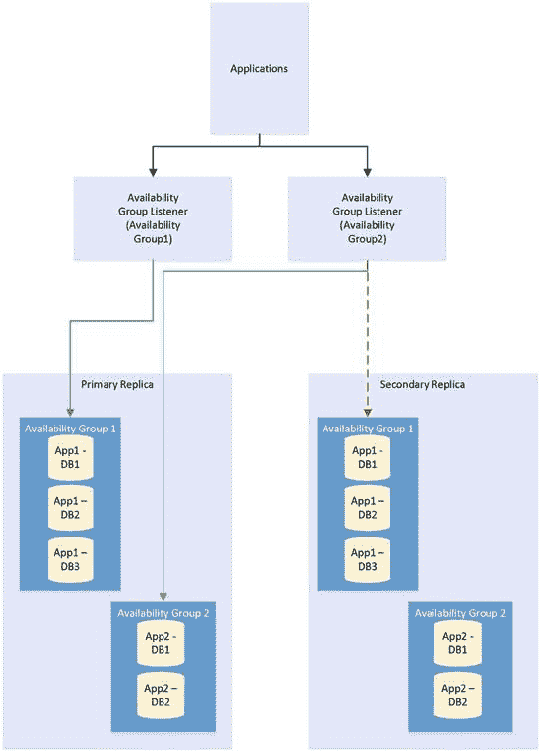

**第二章 ■ 理解高可用性与灾难恢复技术**

`图 2-7` 描绘了如何将数据层应用程序映射到 `可用性组` 以实现独立故障转移。在此示例中，一个实例托管两个数据层应用程序。每个应用程序已被添加到一个独立的 `可用性组`。第一个 `可用性组` 已故障转移到 `Node2`。因此，`可用性组侦听器` 将 `Application1` 的流量指向 `Node2`，并将 `Application2` 的流量指向 `Node1`。因为每个 `可用性组` 都有自己的网络名称和 `IP` 地址，并且这些资源随 `AOAG` 一起故障转移，所以应用程序能够在故障后无缝地重新连接到数据库。

***图 2-7.** 可用性组故障转移*

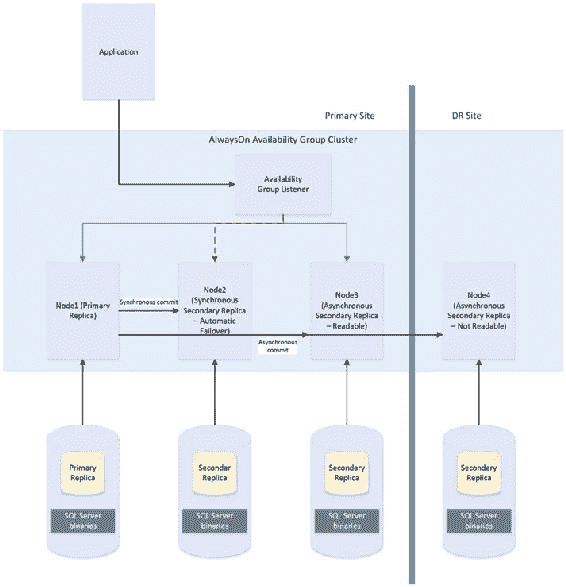

**第二章 ■ 理解高可用性与灾难恢复技术**

`图 2-8` 中的图描绘了一个 `AlwaysOn 可用性组` 拓扑。在此示例中，集群中有四个节点和一个磁盘见证。`Node1` 托管数据库的主副本，`Node2` 用于自动故障转移，`Node3` 用于卸载报表负载，`Node4` 用于 `DR`。因为集群跨越两个数据中心延伸，所以实施了多子网集群。但由于没有共享存储，因此站点之间无需进行 `SAN` 复制。

***图 2-8.** AlwaysOn 可用性组拓扑*

## 第二章 ■ 理解高可用性与灾难恢复技术

### 自动页修复

■ `注意` 第五章和第六章将更详细地讨论 AlwaysOn 可用性组。

如果配置为 AlwaysOn 可用性组拓扑中副本的数据库中某个页面损坏，SQL Server 会尝试通过从某个辅助副本获取该页面的副本来修复损坏。这意味着无需你执行还原操作或运行带有修复选项的 `DBCC CHECKDB`，即可解决逻辑损坏问题。但是，自动页修复不适用于以下页面类型：

- 文件头页
- 数据库引导页
- 分配页
- `GAM`（全局分配图）
- `SGAM`（共享全局分配图）
- `PFS`（页可用空间）

如果主副本因页面损坏而无法读取该页面，它会首先将该页面记录在 `MSDB.dbo.suspect_pages` 表中。然后，它会检查是否有至少一个副本处于 `SYNCHRONIZED` 状态，并且事务仍在发送给该副本。如果满足这些条件，主副本会向所有副本发送广播，指定 `PageID` 和刷新日志结束时的 `LSN`（日志序列号）。随后，该页面将被标记为恢复挂起，这意味着任何访问它的尝试都将失败，并返回错误代码 829。

收到广播后，辅助副本会等待，直到它们重做了广播消息中指定的 `LSN` 之前的事务。此时，它们会尝试访问该页面。如果无法访问，则返回错误。如果能够访问该页面，它们会将页面发送回主副本。主副本接受第一个响应的辅助副本发来的页面。

随后，主副本将用从辅助副本收到的版本替换损坏的页面副本。此过程完成后，它会通过将 `MSDB.dbo.suspect_pages` 表中的 `event_type` 列设置为值 5（已修复）来更新该页面，以反映其已被修复。

如果辅助副本在重做日志时因页面损坏而无法读取该页面，它会将该辅助副本置于 `SUSPENDED` 状态。然后，它会将该页面记录在 `MSDB.dbo.suspect_pages` 表中，并向主副本请求该页面的副本。主副本尝试访问该页面。如果无法访问，则返回错误，辅助副本保持 `SUSPENDED` 状态。

如果主副本能够访问该页面，它会将页面发送给发出请求的辅助副本。辅助副本用从主副本获得的版本替换损坏的页面。然后，它使用 `event_id` 为 5 更新 `MSDB.dbo.suspect_pages` 表。最后，它尝试恢复 AOAG 会话。

■ `注意` 可以手动恢复会话，但如果这样做，同步期间会再次遇到损坏的页面。请确保先在主副本上修复或还原该页面。

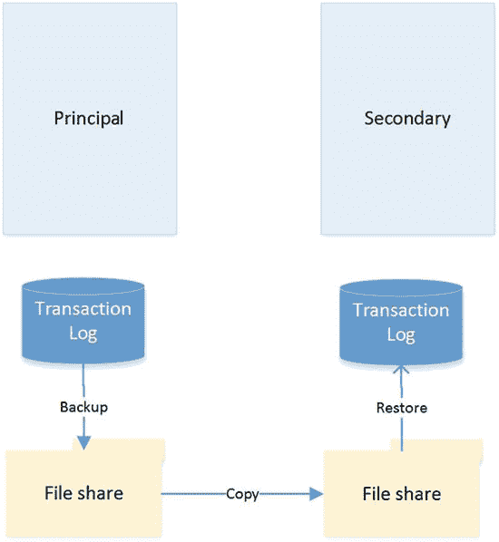

### 日志传送

日志传送是一种可用于实现灾难恢复的技术。其工作原理是备份主体服务器上的事务日志，将其复制到辅助服务器，然后还原它。在需要加载延迟的灾难恢复场景中，使用日志传送最为合适，因为 AOAG 无法实现此功能。举个加载延迟可能有用的场景例子：假设用户意外删除了表中的所有数据。如果在更新 DR 服务器上的数据库之前存在延迟，则可以从 DR 服务器恢复该表的数据，然后重新填充生产服务器。这意味着你无需还原备份来恢复数据。日志传送不适用于高可用性，因为存在

## 第 2 章 ■ 理解高可用性与灾难恢复技术

不提供自动故障转移功能。图 2-9 中的图表展示了一个日志传送拓扑。

**图 2-9.** 日志传送拓扑

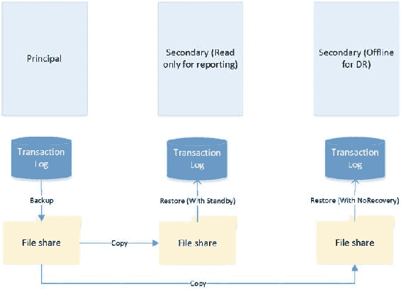

### 恢复模式

在日志传送拓扑中，始终只有一个主体服务器，即生产服务器。然而，可以存在多个辅助服务器，这些服务器可以是灾难恢复服务器和用于卸载报表负载的服务器的混合体。

当你还原事务日志时，可以指定三种恢复模式：`Recovery`、`NoRecovery` 和 `Standby`。`Recovery` 模式使数据库上线，但这不被日志传送支持。`NoRecovery` 模式使数据库保持离线，以便可以还原更多备份。这是日志传送的常规配置，也是灾难恢复场景的合适选择。

`Standby` 选项使数据库上线，但处于只读状态，以便你可以还原更多备份。此功能通过维护一个事务撤销文件来工作。`TUF` 文件记录了事务日志中所有未提交的事务。这意味着你可以回滚事务日志中的这些未提交事务，从而使数据库更易于访问（尽管是只读的）。下次需要应用还原时，你可以在下一个日志还原的重做阶段开始之前，将 `TUF` 文件中的未提交事务重新应用到日志中。

图 2-10 展示了一个同时使用灾难恢复服务器和报表服务器的日志传送拓扑。

**图 2-10.** 使用灾难恢复服务器和报表服务器的日志传送

## 第 2 章 ■ 理解高可用性与灾难恢复技术

### 远程监视服务器

可以选择在日志传送拓扑中配置一个监视服务器。这有助于你集中监控和警报。当你实现监视服务器时，所有备份、复制和还原操作的历史记录和状态都存储在该监视服务器上。监视服务器还允许你设置单个警报作业，该作业被配置为监控所有服务器上的备份、复制和还原操作，而不是在拓扑中的每个服务器上配置单独的警报。

**`注意`** 如果你希望使用监视服务器，在设置日志传送时配置它非常重要。日志传送配置完成后，添加监视服务器的唯一方法是拆除并重新配置日志传送。

#### 故障转移

与其他高可用性和灾难恢复技术不同，执行日志传送故障转移需要一定的管理工作量。要进行日志传送故障转移，你必须备份事务日志的尾部，并将其连同任何其他未复制的备份文件一起复制到辅助服务器。

现在你需要按顺序将剩余的事务日志备份应用到辅助服务器，最后应用尾日志备份。你应用最终还原时使用 `WITH RECOVERY` 选项，以使数据库在一致状态下重新上线。如果你不打算故障恢复回去，可以将辅助服务器重新配置为新的主体服务器来重新配置日志传送。

### 组合技术

为了满足业务目标和非功能性需求，你需要将多种高可用性和灾难恢复技术组合在一起，以创建一个可靠、可扩展的平台。这方面的一个经典示例是要求将 AlwaysOn 故障转移群集与 AlwaysOn 可用性组结合使用。

你可能需要组合这些技术的原因是，当你在同步模式下使用 AlwaysOn 可用性组时（为了进行自动故障转移必须这样做），它可能会导致性能障碍。如本章前面所讨论的，该性能问题是由事务在辅助服务器上提交后才在主服务器上提交所引起的。而群集技术则不存在此问题，

然而，由于它依赖于一个共享磁盘资源，因此事务只会提交一次。

因此，常见的做法是首先使用集群来实现高可用性，然后使用 AlwaysOn 可用性组来执行灾难恢复和/或卸载报表负载。图 2-11 中的图表展示了一种 HA/DR 拓扑，它结合了集群和 AOAG，分别用于实现高可用性和灾难恢复。

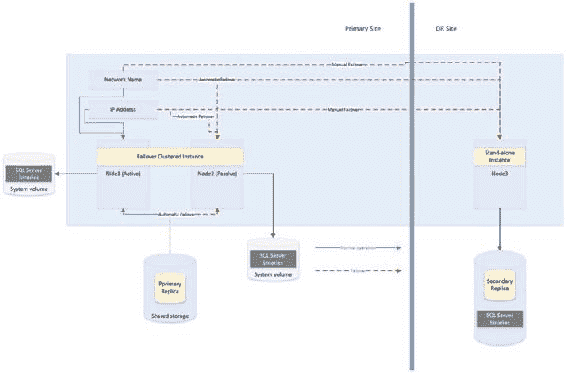

## 第 2 章 ■ 理解高可用性与灾难恢复技术

### 图 2-11. 集群与 AlwaysOn 可用性组结合

图 2-11 中的图表显示，数据库的主副本托管在一个双节点主动/被动集群上。如果主动节点发生故障，则适用集群规则，共享存储、网络名称和 IP 地址会重新附加到被动节点，该节点随后成为主动节点。然而，如果两个节点均无法访问，可用性组侦听器会将流量指向集群的第三个节点，该节点位于灾难恢复站点，并通过日志流复制进行同步。当然，当使用异步模式时，数据库必须由数据库管理员手动执行故障转移。

另一种常见场景是结合使用集群和日志传送，分别实现高可用性和灾难恢复。这种组合的工作方式与集群结合 AlwaysOn 可用性组非常相似，并在图 2-12.中进行了说明。

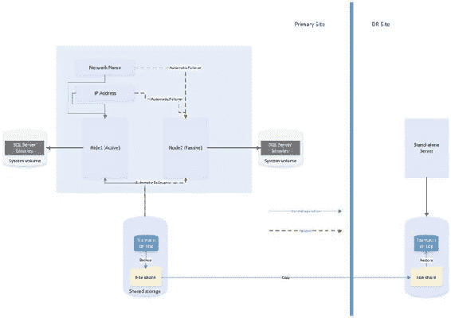

## 第 2 章 ■ 理解高可用性与灾难恢复技术

### 图 2-12. 集群与日志传送结合

该图表显示，在主数据中心配置了一个双节点主动/被动集群。然后，托管在此实例上的数据库的事务日志被传送到灾难恢复数据中心的一台独立服务器。由于集群使用共享存储，您还应该为备份卷使用共享存储，并将备份卷作为资源添加到角色中。这意味着当实例故障转移到另一个节点时，备份共享也会随之故障转移，日志传送继续同步，不会中断。

> `注意` 如果在日志传送备份或复制作业正在进行时发生故障转移，则日志传送可能会失去同步并需要手动干预。这意味着故障转移后，您应该检查日志传送作业的运行状况。

### 总结

SQL Server 提供了一套完整的高可用性和灾难恢复技术，使您能够灵活地实施最符合数据层应用程序需求的解决方案。对于高可用性，您可以实施 AlwaysOn 集群或 AlwaysOn 可用性组 (AOAG)。集群使用共享磁盘资源，故障转移发生在实例级别。另一方面，AOAG 通过维护带有同步日志流的数据库冗余副本，在数据库级别同步数据。数据库镜像在 SQL Server 2014 中也可用，但它是一项已弃用的功能，将在未来版本的 SQL Server 中移除。

要实现灾难恢复，您可以选择实施 AOAG 或日志传送。日志传送通过备份、复制和还原数据库的事务日志来工作，而 AOAG 则使用异步日志流来同步数据。

也可以将多种 HA 和 DR 技术结合在一起，以实施最合适的可用性策略。常见的例子是将用于高可用性的集群与用于提供 DR 的 AOAG 或日志传送相结合。

