# 第 3 章

## 实施集群

工程师可能会发现构建和配置集群的过程很复杂，并且可以实现该模式的多种变体。尽管数据库管理员可能并不总是


## 第 3 章 ■ 实现集群

虽然用户不一定需要自己搭建集群，但他们确实需要熟悉相关技术，并且通常需要在过程中提供自己的意见。他们也可能参与解决集群发现问题的故障排除。

基于这些原因，本章将讨论如何在 Windows 层面构建集群，并探讨一些可能的配置。本章的演示使用一个预构建的环境，该环境由两台服务器组成：`ClusterNode1` 和 `ClusterNode2`。两台服务器均位于名为 `AlwaysOnRevealed.com` 的域中。从 SAN 向节点呈现了四个卷，并在 `ClusterNode1` 上联机并进行了格式化，配置详情如表 3-1 所示。

| **驱动器号** | **卷标** | **大小** | **说明** |
| :--- | :--- | :--- | :--- |
| `F` | `Data` | 4.88GB | 托管数据和日志文件 |
| `G` | `MSDTC` | 972MB | 托管与 `MSDTC` 角色关联的文件 |
| `H` | `Quorum` | 461MB | 托管基于磁盘的仲裁见证 |
| `I` | `TempDB` | 1.96GB | 托管 `TempDB` 数据和日志文件 |

**`提示`** 您可能会惊讶于数据和日志文件分配了同一个卷，因为 DBA 的本能是将这些文件分开放置到不同的驱动器上。这里需要记住的重要一点是，我们使用的是 SAN，即使我们使用了单独的卷，这些卷也很可能位于相同的物理磁盘轴上，这意味着这种分离只是逻辑上的。此外，如果要使用 SAN 快照，一些 SAN 可能要求数据和日志文件存储在同一卷上，以确保数据一致性。

© Peter A. Carter 2016
P. A. Carter, *SQL Server AlwaysOn Revealed*, DOI 10.1007/978-1-4842-2397-0_3

本章的场景要求我们构建一个具有磁盘见证的双节点故障转移群集。在开始之前，我们需要配置 Windows 群集服务 (`WCS`)。我们还需要配置一个 `MSDTC`（Microsoft 分布式事务协调器）群集角色，以为 `SSIS`（SQL Server 集成服务）提供分布式事务协调。此外，我们需要将集群配置为使 `MSDTC` 角色以 `高` 优先级（与同一集群上的其他角色相比）进行故障转移，允许在任何 24 小时内发生三次故障转移，并允许立即故障回退。

因此，我们将执行的任务完整列表如下：

*   安装故障转移群集功能
*   构建名为 `ALWAYSON-C` 的 Windows 群集
*   正确配置仲裁
*   创建名为 `ALWAYSON-MSDTC-C` 的 `MSDTC` 群集角色
*   配置 `MSDTC` 角色的属性
*   配置 `MSDTC` 角色的故障转移属性

**`提示`** 如果您希望出于学习目的构建一个集群，但无法访问域或 SAN，那么群集的新功能允许您模拟一个非常相似的拓扑。可以使用两台虚拟机作为集群节点。第三台运行 Windows `iSCSI Target` 功能的虚拟机可用于向这些节点呈现共享存储。更好的是，Windows Server 2016 允许在工作组上创建群集，这意味着无需创建额外的虚拟机来用作域控制器。但请注意，在工作组中创建群集仅在 `PowerShell` 中支持，无法通过故障转移群集管理器完成（在 Windows Server 2016 `CTP5` 中是正确的）。同样重要的是要认识到，从 SQL Server 的角度来看，可用性组在工作组群集上是支持的，但故障转移群集实例则不支持。

### 构建群集

在安装 SQL Server AlwaysOn 故障转移群集实例之前，您必须准备构成群集的服务器（称为节点）并在它们之上构建一个 Windows 群集。以下部分将演示如何执行这些活动。

### 安装故障转移群集功能

为了构建群集，我们需要做的第一件事是安装故障转移群集


在每个节点上启用功能。为此，我们需要在 `服务器管理器` 中选择 `添加角色和功能` 选项。这将打开 `添加角色和功能向导`。该向导的第一页提供了关于先决条件的指导，如图 3-1 所示。

`**图 3-1.** 开始之前页面`

在 `安装类型` 页面上，确保选择了 `基于角色或基于功能的安装`，如图 3-2 所示。

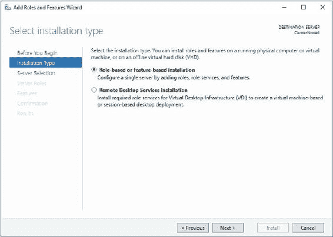

第 3 章 ■ 实现群集

`**图 3-2.** 安装类型页面`

在 `服务器选择` 页面上，确保选中了你当前正在配置的群集节点。如图 3-3 所示。

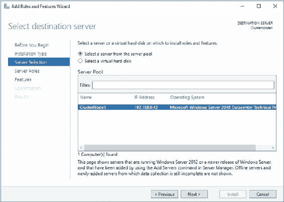

第 3 章 ■ 实现群集

`**图 3-3.** 服务器选择页面`

向导的 `服务器角色` 页面允许你选择任何想要配置的服务器角色。如图 3-4 所示，这可以包括诸如 `应用程序服务器` 或 `DNS 服务器` 等角色，但在我们的情况下，这并不适用，因此我们只需进入下一个屏幕。

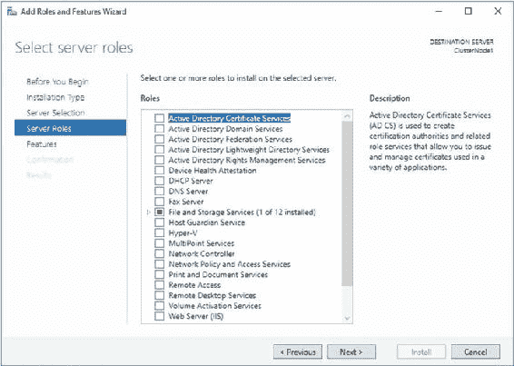

第 3 章 ■ 实现群集

`**图 3-4.** 服务器角色页面`

在向导的 `功能` 页面上，我们需要选择 `故障转移群集`，如图 3-5 所示。这满足了构建 Windows 群集的先决条件。

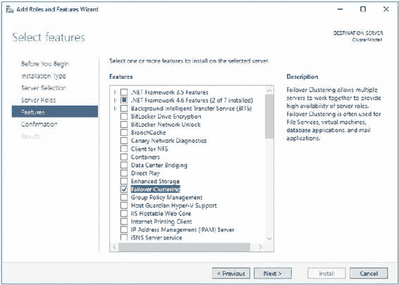

第 3 章 ■ 实现群集

`**图 3-5.** 功能页面`

当你选择 `故障转移群集` 时，向导会显示一个屏幕（图 3-6），询问你是否要以复选框的形式安装管理工具。如果你计划直接从节点管理群集，请勾选此选项。

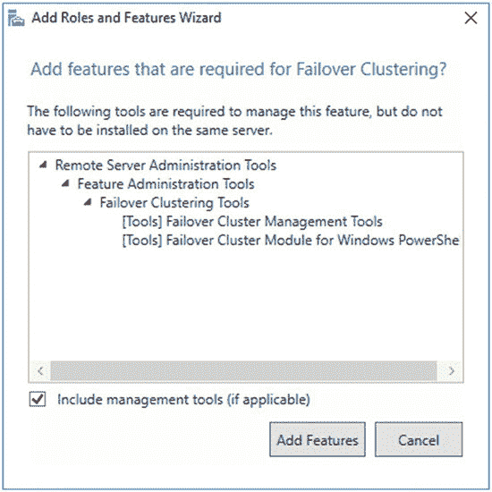

第 3 章 ■ 实现群集

`**图 3-6.** 选择管理工具`

在向导的最后一页，你会看到将要安装的功能摘要，如图 3-7 所示。在这里，如果需要，你可以指定 Windows 安装源文件的位置。你还可以选择服务器在需要时是否应自动重新启动。如果你正在搭建一台新服务器，勾选此框是合理的。但是，如果你是在服务器已投入生产环境时添加功能，请确保考虑服务器上当前运行的内容，以及如果需要重启，是否应等待维护窗口再执行重启。

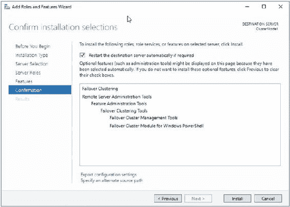

第 3 章 ■ 实现群集

`**图 3-7.** 确认页面`

除了通过 `服务器管理器` 安装，群集服务也可以通过 `PowerShell` 安装。清单 3-1 中的 `PowerShell` 命令实现了与前述步骤相同的结果。

`**清单 3-1.** 安装群集服务`

```
Install-WindowsFeature -Name Failover-Clustering –IncludeManagementTools
```

### 创建群集

在两个节点上都安装好群集功能后，你就可以开始构建群集了。为此，请连接到你打算作为活动节点的服务器，并从 `管理工具` 中运行 `故障转移群集管理器`。

`创建群集向导` 的 `开始之前` 页面警告，只有通过所有验证测试的群集才受 Microsoft 支持，如图 3-8 所示。消息还警告，你必须是群集每个节点上的本地管理员。在 Windows Server 的早期版本中，这意味着你必须使用一个在群集涉及的每台服务器上都拥有本地管理员权限的域账户。然而，在 Windows Server 2016 中，对域验证的依赖已被移除，唯一的要求是每个节点上存在一个具有本地管理员权限的账户，且该账户的名称和密码一致。这允许在工作组中，或跨多个域创建群集。这两个选项在 Windows Server 的早期版本中均不可用。


## 第三章 ■ 实现群集

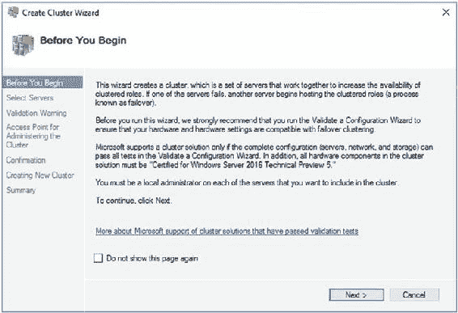

#### 图 3-8. “开始之前”页面

在向导的 `选择服务器` 屏幕上，您需要输入群集节点的名称。如图 3-9 所示。在我们的例子中，我们的群集节点分别命名为 `ClusterNode1` 和 `ClusterNode2`。然而，如果它们是域的一部分，那么域名和后缀将会被追加到服务器名称后面。

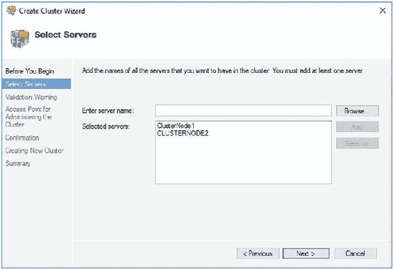

#### 图 3-9. “选择服务器”页面

在 `验证警告` 页面，系统会询问您是否希望针对群集运行验证测试。对于生产服务器，您应该始终选择运行此验证，因为除非经过验证，否则 Microsoft 将不会为该群集提供支持。选择运行验证测试将调用 `验证配置向导`。您也可以从 `故障转移群集管理器` 的管理窗格独立运行此向导。`验证警告` 页面如图 3-10 所示。

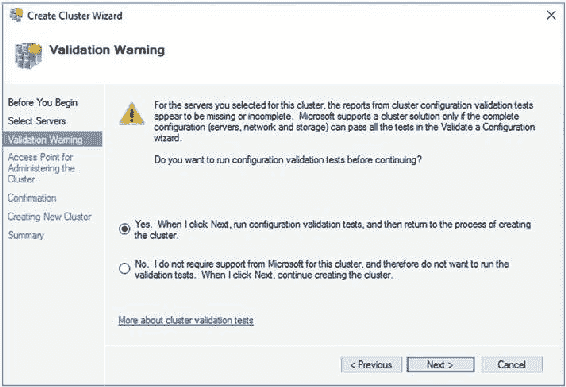

#### 图 3-10. “验证警告”页面

**提示** 在某些情况下无法进行验证，在这些情况下，您需要选择 `否，我不需要支持…` 选项。例如，一些数据库管理员选择安装单节点群集而非独立实例，以便将来（如果需要）可以将其扩展为完整的群集。然而，这种方法可能会给 Windows 管理员带来操作上的挑战，因此请极其谨慎地使用。

当您通过 `验证配置向导` 的 `开始之前` 页面后，您会看到 `测试选项` 页面。在这里，您可以选择运行所有验证测试，或者选择一部分测试来运行，如图 3-11 所示。通常在安装新群集时，您希望运行所有验证测试，但在对群集进行配置更改后，如果您独立调用 `验证配置向导`，能够选择一部分测试子集是很有用的。

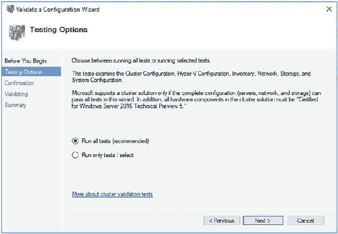

#### 图 3-11. “测试选项”页面

在向导的 `确认` 页面（如图 3-12 所示），您将看到将要运行的测试摘要以及它们将针对的群集节点。测试列表非常全面，包括以下类别：

*   清点（例如识别任何未签名的驱动程序）
*   网络（例如检查有效的 IP 配置）
*   存储（例如验证在节点之间故障转移磁盘的能力）
*   系统配置（例如验证 Active Directory 的配置）

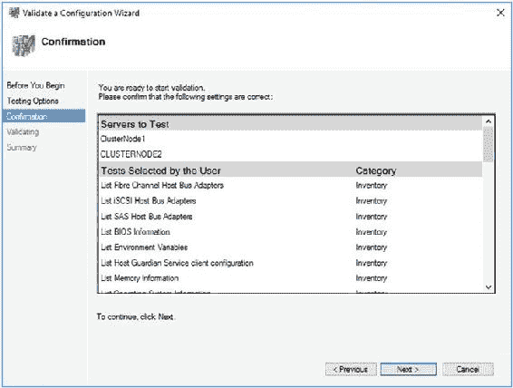

#### 图 3-12. “确认”页面

如图 3-13 所示的 `摘要` 页面提供了测试结果，以及一个指向报告 HTML 版本的链接。请务必检查结果中是否有任何错误或警告。您应该始终在继续之前解决错误，但某些警告可能是可以接受的。例如，如果您构建群集是为了承载 `AlwaysOn 可用性组`，您可能没有任何共享存储。这会产生一个警告，但在这种场景下这不是问题。`AlwaysOn 可用性组` 的配置在第 5 章和第 6 章中有更详细的讨论。

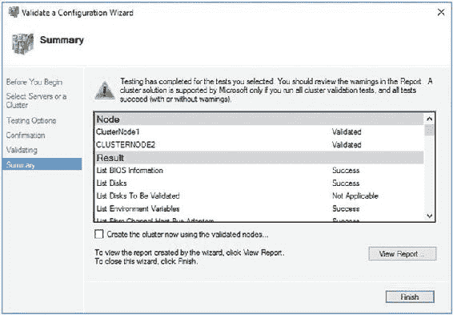

#### 图 3-13. “摘要”页面

`查看报告` 按钮会显示验证报告的完整版本，如图 3-14 所示。其中的超链接会将您带到报告中的特定类别，每个测试还有进一步的超链接可用。这些链接允许您深入查看具体消息。


为特定测试而生成，便于识别错误。

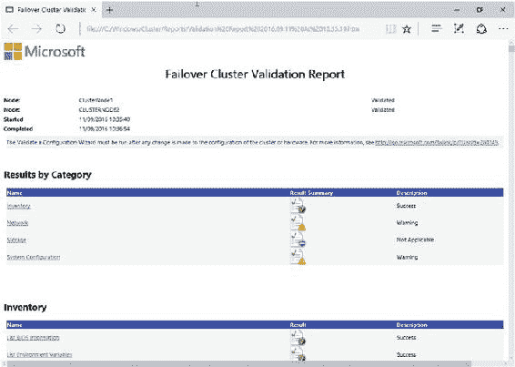

## 第三章 ■ 实现群集

**图 3-14.** 故障转移群集验证报告

在“摘要”页面单击“完成”将返回到“创建群集向导”，此时会看到“用于管理群集的访问点”页面，如图 3-15 所示。在此页面上，你需要输入群集的虚拟名称。我们将我们的群集命名为 `ALWAYSON-C`。如果网卡配置为自动获取 IP 地址，则将使用 `DHCP` 分配一个 IP 地址。否则，你将需要手动输入一个 IP 地址。这被称为静态 IP，因为它将保持不变，而通过 `DHCP` 分配的 IP 地址可能会改变。我强烈建议为群集访问点使用静态 IP，以避免动态路由问题，但这可以在群集创建后进行更改。

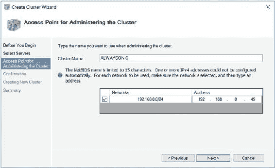

**图 3-15.** “用于管理群集的访问点”页面

#### ■ **注意**
虚拟名称和 IP 地址绑定到任何活动的节点，这意味着在发生故障转移时群集始终可访问。

在我们的案例中，群集驻留在一个简单的域、单一站点和单一子网中。但是，如果你正在配置一个多子网群集，则向导会检测到这一点，并且将需要为每个子网提供 IP 地址。在这种情况下，你需要为每个子网输入一个 IP 地址。

#### ■ **注意**
节点内的两个网卡各自配置在独立的子网上，以便节点间的心跳流量与公共网络隔离。但是，只有当群集节点的数据网卡位于不同的子网中时，群集才被视为多子网群集。

#### ■ **提示**
如果你的群集将位于域中，并且你没有在包含群集的 `OU`（组织单位）中创建 `AD`（Active Directory）对象的权限，那么群集的 `VCO`（虚拟计算机对象）必须已存在，并且你必须被分配了完全控制权限。

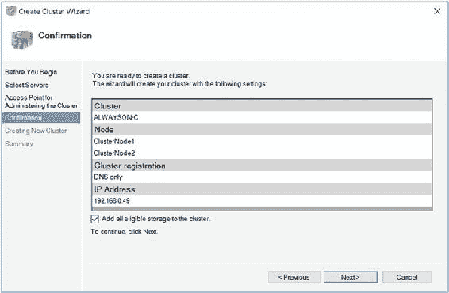

“确认”页面显示将要创建的群集的摘要。你还可以使用此屏幕指定是否应将所有符合条件的存储添加到群集中，这通常是一个有用的功能。此屏幕如图 3-16 所示。

**图 3-16.** “确认”页面

群集构建完成后，将显示如图 3-17 所示的“摘要”页面。此屏幕总结了群集名称、IP 地址、节点、已配置的仲裁模型，以及有关群集的任何警告的详细信息。它还提供了一个指向报告的 `HTML`（超文本标记语言）版本的链接。

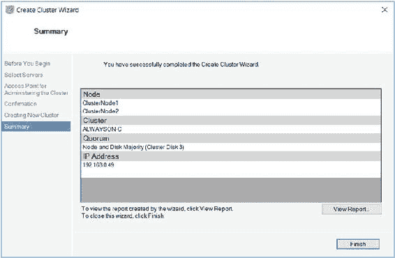

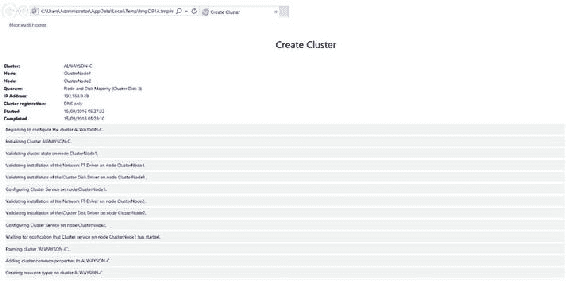

**图 3-17.** “摘要”页面

“创建群集”报告显示了在群集构建期间完成的任务的完整列表，如图 3-18 所示。

**图 3-18.** “创建群集”报告

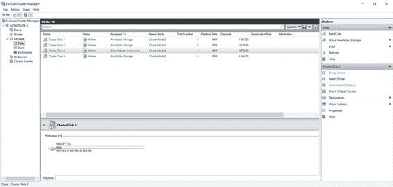

我们也可以使用 `PowerShell` 来创建群集。清单 3-2 中的脚本首先使用 `Test-Cluster` cmdlet 运行群集验证测试，然后使用 `New-Cluster` cmdlet 配置群集。

**清单 3-2.** 验证并创建群集
```
#运行验证测试
Test-Cluster -Node Clusternode1,Clusternode2

#创建群集
New-Cluster -Node ClusterNode1,ClusterNode2 -Name ALWAYSON-C
```

### 配置群集

许多群集配置可以更改，具体取决于你的环境需求。本节演示如何更改一些更常见的配置。

#### 更改仲裁

如果我们在“故障转移群集管理器”中检查群集存储，通过浏览 `ALWAYSON-C | 存储 | 磁盘` 并高亮显示分配给仲裁的磁盘，我们可以看到见证磁盘被错误地配置为 `MSDTC` 的驱动器。如图 3-19 所示。

**图 3-19.** 群集摘要

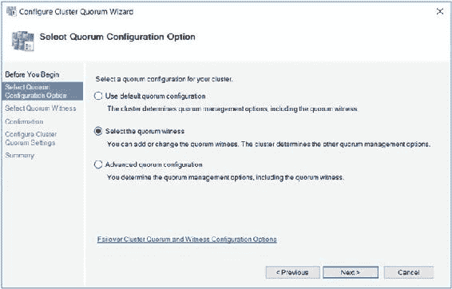

我们可以通过进入群集的上下文菜单并选择 `更多操作 | 配置群集仲裁设置` 来修改此设置，这将调用“配置群集仲裁向导”。在“选择仲裁配置选项”页面（如图 3-20 所示），我们选择 `选择仲裁见证` 选项。

**图 3-20.** “选择仲裁配置选项”页面

在“选择仲裁见证”页面，我们选择要配置的仲裁类型。当群集中有偶数个节点且所有节点位于同一数据中心时，或者当主数据中心有偶数个节点而辅助数据中心有另一个节点时，磁盘见证最合适。

当节点分布在两个数据中心，并且你可以访问第三个数据中心（其中有一个可用作仲裁的文件共享）时，文件共享见证最合适。

云见证是 `Windows 2016` 的一项新功能，当节点分布在两个数据中心且没有可用的第三个数据中心来设置文件共享见证时最合适。要使用云见证，你必须拥有 `Azure` 存储账户，因为见证将在 `Azure BLOB` 存储中创建。

在单一数据中心中有奇数个节点的情况下，不配置见证是最合适的。

对于我们的场景，我们将选择配置磁盘见证的选项。如图 3-21 所示。

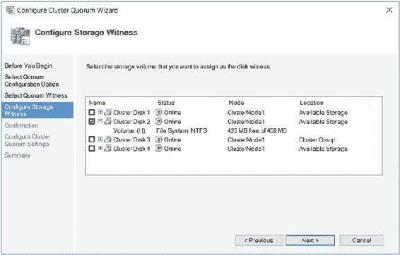

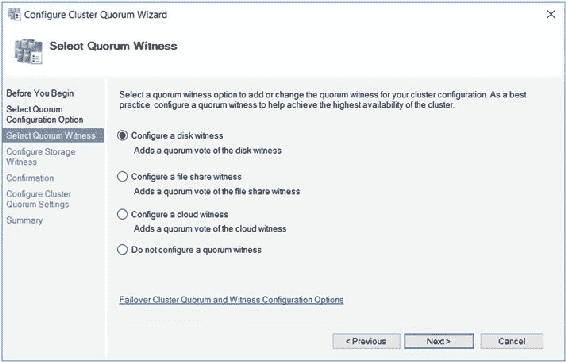

**图 3-21.** “选择仲裁见证”页面

在向导的“配置存储见证”页面，我们可以选择正确的磁盘用作仲裁。在我们的例子中，这是 `磁盘 2`，如图 3-22 所示。

**图 3-22.** “配置存储见证”页面

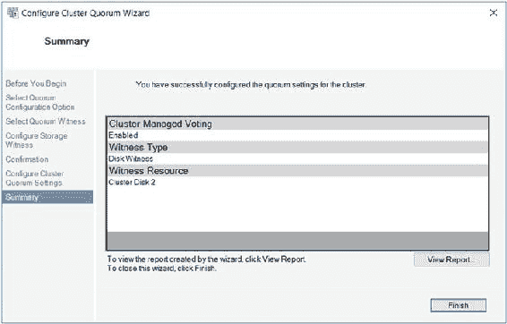

向导的“摘要”页面（如图 3-23 所示）详细说明了将对群集进行的配置更改。它还突出显示已启用动态仲裁管理，并且所有节点加上仲裁磁盘在仲裁中都有投票权。高级仲裁配置将在第四章中进一步讨论。

**图 3-23.** “摘要”页面

我们还可以使用清单 3-3 中的 `PowerShell` 命令从命令行执行此配置。在这里，我们使用 `Set-ClusterQuorum` cmdlet 并传入群集名称，后跟我们希望配置的仲裁类型。因为此仲裁类型中包含了磁盘，我们还可以传入我们计划使用的群集磁盘名称，正是这个方面允许我们更改仲裁磁盘。

#### ■ **提示**
如果使用 `PowerShell` 跟随演示操作，请记得将磁盘编号更改为与你自己的配置相匹配。

**清单 3-3.** 配置仲裁磁盘
```
Set-ClusterQuorum -Cluster ALWAYSON-C -NodeAndDiskMajority "Cluster Disk 2"
```

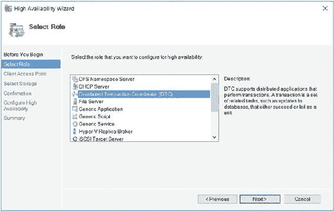

### 配置 MSDTC

如果你的 `SQL Server` 实例使用分布式事务，或者你正在安装 `SQL Server Integration Services (SSIS)`，那么它依赖于 `MSDTC`（Microsoft 分布式事务协调器）。如果你的实例将使用 `MSDTC`，则需要确保其配置正确。如果未正确配置，安装程序会成功，但依赖于它的事务可能会失败。

在群集上安装时，`SQL Server` 会自动使用 `MSDTC` 的实例


## 第三章 ■ 实现群集

### MSDTC 实例放置策略

如果存在，则使用安装在同一角色中的实例。如果不存在，则使用已映射到它的 `MSDTC` 实例（如果已执行此映射）。如果没有映射，则使用群集的默认 `MSDTC` 实例；如果也没有默认实例，则使用本地计算机的 `MSDTC` 实例。

许多 `DBA` 选择将 `MSDTC` 与 `SQL Server` 安装在同一角色中；然而，这会带来一个问题。如果 `MSDTC` 发生故障，也可能导致 `SQL Server` 实例宕机。当然，群集会尝试在另一个节点上重新启动这两个应用程序，但这仍然会涉及停机时间，包括在新节点上恢复数据库所需的时间，这个时间是不确定的。因此，我建议将 `MSDTC` 安装在一个单独的角色中。如果这样做，`SQL Server` 实例仍然可以使用 `MSDTC`，因为它是群集的默认实例，并且消除了 `MSDTC` 导致 `SQL Server` 中断的可能性。这比使用映射实例或本地计算机实例更可取，因为它避免了不必要的配置，并且当群集的 `SQL Server` 实例使用它时，`MSDTC` 实例也应该是群集化的。

### 通过 GUI 创建 MSDTC 角色

要创建 `MSDTC` 角色，首先在故障转移群集管理器中，从“角色”上下文菜单中选择“配置角色”选项。这将启动“高可用性向导”。在向导的“选择角色”页面上，选择“分布式事务协调器 (DTC)”角色类型，如图 3-24 所示。

`图 3-24.` 选择角色页面
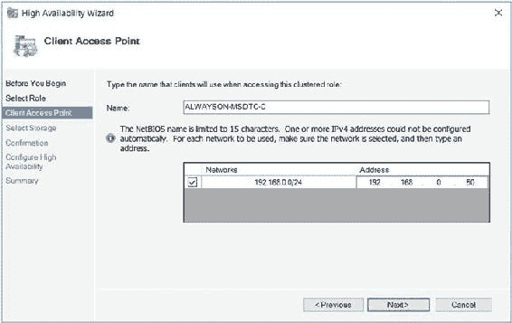

在如图 3-25 所示的“客户端访问点”页面上，您需要为 `MSDTC` 输入一个虚拟名称和 IP 地址。在我们的例子中，我们将其命名为 `ALWAYSON-MSDTC-C` 并分配 `192.168.0.50` 作为 IP 地址。在多子网群集中，您需要为每个网络提供一个 IP 地址。

`图 3-25.` 客户端访问点页面

在向导的“选择存储”页面上，选择您计划用于存储 `MSDTC` 文件的群集磁盘，如图 3-26 所示。在我们的例子中，这是 `磁盘 4`。

`图 3-26.` 选择存储页面
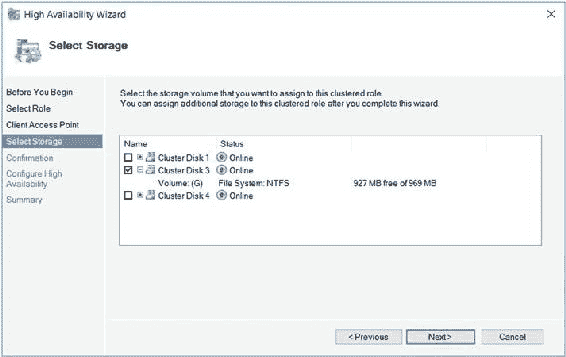
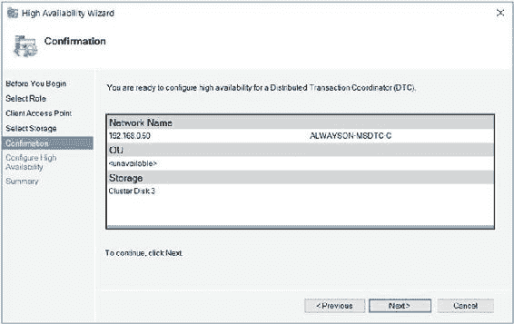

“确认”页面显示了即将创建的角色的概览，如图 3-27 所示。

`图 3-27.` 确认页面

### 通过 PowerShell 创建 MSDTC 角色

或者，我们可以在 `PowerShell` 中创建此角色。清单 3-4 中的脚本首先使用 `Add-ClusterServerRole` cmdlet 来创建角色。我们将用于该角色的虚拟名称传递给 `Name` 参数，将要使用的群集磁盘名称传递给 `Storage` 参数，并将该角色的 IP 地址传递给 `StaticAddress` 参数。

然后，我们使用 `Add-ClusterResource` cmdlet 来添加 `DTC` 资源。`Name` 参数为资源命名，`ResourceType` 参数指定它是一个 `DTC` 资源。然后，我们需要在角色内的资源之间创建依赖关系。使用 `GUI` 时我们不需要这样做，因为依赖关系是自动为我们创建的。资源依赖关系指定了其他资源所依赖的资源。一个资源失败会通过链传播，并可能导致角色脱机。例如，在我们 `ALWAYSON-MSDTC-C` 角色的例子中，如果磁盘或虚拟名称中的任何一个变得不可用，`DTC` 资源就会脱机。Windows Server 支持具有 `AND` 和 `OR` 约束的多重依赖关系。正是 `OR` 约束使得多子网群集成为可能，因为一个资源可以依赖于 IP 地址 `A` 或 IP 地址 `B`。最后，我们需要使用 `Start-ClusterGroup` cmdlet 使角色联机。

`清单 3-4.` 创建 MSDTC 角色
```
#创建角色
Add-ClusterServerRole -Name ALWAYSON-MSDTC-C -Storage "Cluster Disk 3" -StaticAddress 192.168.0.50

#创建 DTC 资源
```


```markdown
Add-ClusterResource -Name MSDTC-ALWAYSON-MSDTC-C -ResourceType "分布式事务协调器" -Group ALWAYSON-MSDTC-C

#创建依赖关系

Add-ClusterResourceDependency MSDTC-ALWAYSON-MSDTC-C ALWAYSON-MSDTC-C

Add-ClusterResourceDependency MSDTC-ALWAYSON-MSDTC-C "Cluster Disk 3"

#使角色联机

Start-ClusterGroup ALWAYSON-MSDTC-C

### 配置角色

创建角色后，您可能希望对其进行配置，以更改故障转移策略或配置节点为首选所有者。要配置角色，请从角色的上下文菜单中选择“属性”。在如`图 3-28`所示的“属性”对话框的“常规”选项卡上，您可以将一个节点配置为角色的首选所有者。您还可以通过在“首选所有者”窗口中将节点上移或下移来更改节点优先级的顺序。

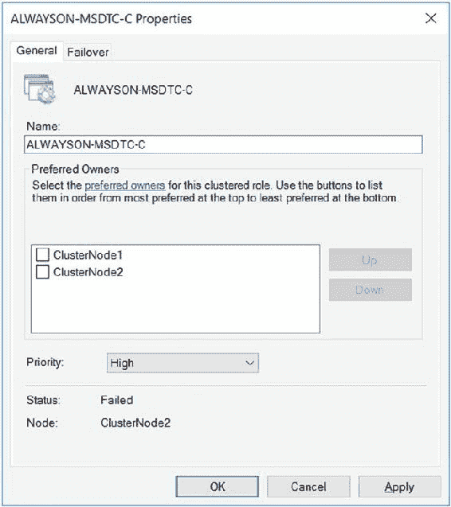

`图 3-28.` “常规”选项卡

您还可以选择在多个角色同时故障转移到另一个节点时该角色的优先级。此设置的选项如下：

- 高
- 中
- 低
- 无自动启动

我们将配置`ALWAYSON-MSDTC-C`角色以高优先级进行故障转移。

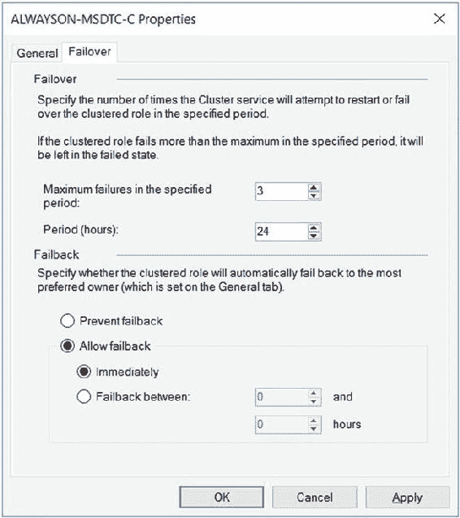

在“属性”对话框的“故障转移”选项卡上，您可以配置在角色被脱机之前，在给定时间段内可以故障转移的次数。默认值为 6 小时内一次故障。这里的问题是，如果一个角色发生故障转移，并且您在原始节点上修复问题后将其故障恢复回来，那么在 6 小时窗口内将不允许更多的故障转移。这显然是一个风险，我通常建议您更改此设置。在我们的例子中，我们已将该角色配置为在 24 小时窗口内最多允许三次故障转移，如`图 3-29`所示。我们还配置了该角色，如果首选所有者再次可用，则故障恢复到该所有者。请记住，在设置自动故障恢复时，故障恢复与故障转移一样会导致停机。如果您追求极高的可用性，例如五个 9（99.999%），那么此选项可能不合适。我们将配置`ALWAYSON-MSDTC-C`角色以允许在 24 小时期间进行三次故障转移。我们还将配置该角色以允许立即故障恢复。

`图 3-29.` “故障转移”选项卡

### 小结

在创建集群之前，必须在所有节点上安装 Microsoft 群集服务 (MCS)。这可以通过使用“添加角色和功能向导”安装“故障转移群集”功能来实现。

安装“故障转移群集”功能后，即可在每个节点上使用“创建群集向导”配置群集。在构建群集之前，此向导将提示您运行“群集验证向导”。“群集验证向导”将验证环境是否满足群集的要求。如果您发现环境不符合要求，仍然可以继续构建群集，但安装将不受 Microsoft 支持。

群集构建完成后，还需要对其进行配置。这将包括配置仲裁模式，也可能包括配置 MSDTC。在群集上创建角色后，您可能还希望使用故障转移策略或首选所有者来配置该角色。

## 第 4 章：实施 AlwaysOn 故障转移群集实例

群集构建和配置完成后，就可以安装 SQL Server AlwaysOn 故障转移群集实例了。在我们的场景中，我们要构建一个跨越我们在[第 3 章](http://dx.doi.org/10.1007/978-1-4842-2397-0_3)中构建的 Windows 群集的两个节点的群集实例。我们还将讨论如何使用 PowerShell 构建故障转移群集实例。为此，我们将在
```

