# 实施 AlwaysOn 故障转移群集实例

### 构建实例

为了在发生故障转移时，允许被动节点承载该实例，我们需要在安装群集后运行**添加节点**向导。因此，在本章中，我们将执行以下任务：

*   在活动群集节点上安装 SQL Server 故障转移群集实例。
*   配置向导的被动节点以支持该故障转移群集实例。

可以使用**安装 SQL Server 故障转移群集**向导来构建 AlwaysOn 故障转移群集实例。此向导可以通过在承载群集核心资源的节点上打开**SQL Server 安装中心**，并从**安装**选项卡中选择`新建 SQL Server 故障转移群集安装`选项来调用。**SQL Server 安装中心**的安装选项卡如图 4-1 所示。

© Peter A. Carter 2016

P. A. Carter, *SQL Server AlwaysOn Revealed*, DOI 10.1007/978-1-4842-2397-0_4

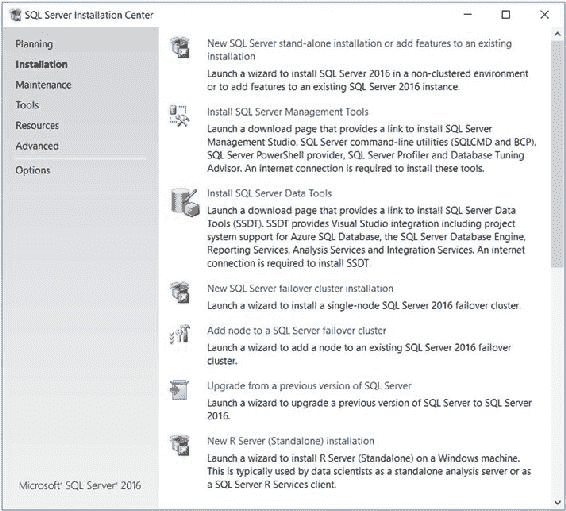

**图 4-1.** SQL Server 安装中心—安装选项卡

向导的**产品密钥**页面是最先显示的，如图 4-2 所示。在此页面上，您将选择安装 SQL Server 的免费版本之一，或者输入产品密钥（或批量许可密钥），该密钥将自动确定要安装的正确 SQL Server 版本。

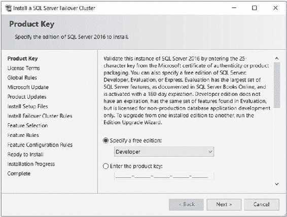

**图 4-2.** 安装 SQL Server 故障转移群集向导—产品密钥页面

> **提示** 在 SQL Server 2016 中，功能上等同于企业版的开发人员版是免费的。在之前的 SQL Server 版本中，此非商业许可证需要支付名义费用。

在向导的**许可条款**页面（图 4-3）上，您将被邀请通过复选框接受 Microsoft 的许可条款。未经同意，安装无法继续。

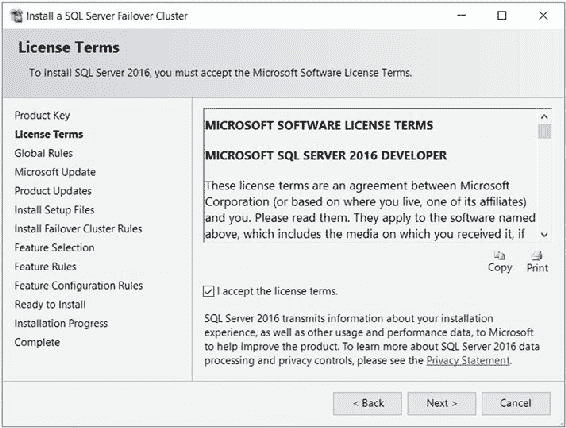

**图 4-3.** 安装 SQL Server 故障转移群集向导—许可条款页面

现在将检查**全局规则**，以确保可以成功安装安装支持文件。当所有检查都通过后，向导的**Microsoft Update**页面（如图 4-4 所示）将提示您选择是否希望 Windows Update 检查 SQL Server 的补丁和热修复。此处的选择取决于您组织的修补策略。一些组织实施严格的补丁测试和验收流程，然后是补丁周期，通常得到 **WSUS**（Windows Server Update Services）等软件的支持。如果您的组织存在此类制度，则不应选择此选项。

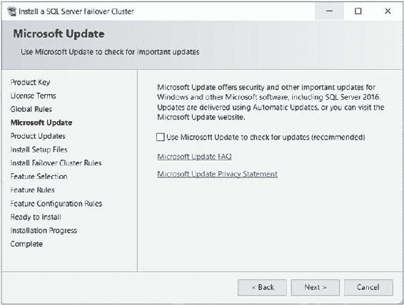

**图 4-4.** 安装 SQL Server 故障转移群集向导—Microsoft Update 页面

如果您选择检查更新，并且发现任何可用更新，则向导的**产品更新**页面（如图 4-5 所示）将列出所有已找到的可用更新。您应使用复选框确认是否应安装它们。

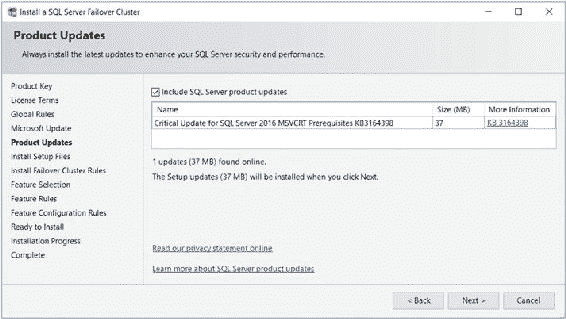

**图 4-5.** 安装 SQL Server 故障转移群集向导—产品更新页面

在下载（如果适用）、提取并安装安装支持文件和任何产品更新之后，将检查用于安装故障转移群集实例的安装规则。结果显示在向导的**安装故障转移群集规则**页面上，如图 4-6 所示。

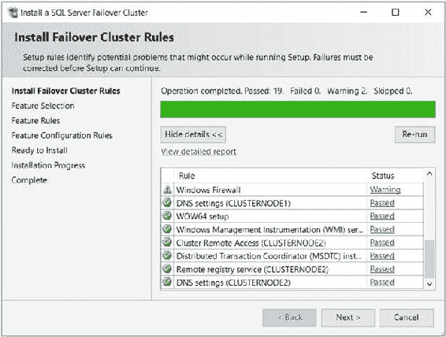

**图 4-6.** 安装 SQL Server 故障转移群集向导—安装故障转移群集规则页面


## 第四章：实施 AlwaysOn 故障转移群集实例

**图 4-6** 安装 SQL Server 故障转移群集向导——安装故障转移群集规则  
您会注意到有一条关于 Windows 防火墙的警告。显示此警告仅仅是因为防火墙已启用，它并不表示所需的端口未开放。关于为 SQL Server 配置防火墙的更多信息，我推荐 Apress 出版的图书*保护 SQL Server：数据库管理员防御指南*，可从[www.apress.com/9781484222645](http://www.apress.com/9781484222645)获取。

在向导的"功能选择"页面（如图 4-7 所示），您将选择要安装的 SQL Server 2016 产品套件功能。本书的目的，我们将选择安装数据库引擎和 SQL Server 集成服务（`SSIS`）。

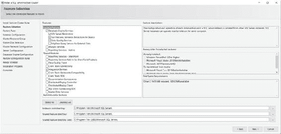

**图 4-7** 安装 SQL Server 故障转移群集向导——功能选择页面  
值得注意的是，`SSIS`并非群集感知的，其设计初衷也并非用于群集。在某些情况下，您可能决定对集成服务进行群集化，如果是这样，您可以通过创建一个`通用`类型的群集角色，并将集成服务作为依赖项添加进来，从而规避此限制。然而，在大多数场景中，在群集实例上管理`SSIS`最合适的方式，仅仅是将集成服务作为独立服务安装在群集的每个节点上。

此外，向导的功能选择页面要求您指定实例根目录文件夹和共享功能文件夹的位置。您可能希望将它们移动到不同的驱动器，以便为操作系统保留`C:\`驱动器。这可能是出于空间原因的考虑，或者只是为了将 SQL Server 二进制文件与其他应用程序隔离。

实例根目录通常将包含您在服务器上创建的每个实例的一个文件夹，并且数据库引擎、`SSAS`和`SSRS`安装将有各自的文件夹。与数据库引擎关联的文件夹将称为`MSSQL13.[实例名称]`，其中实例名称是您的实例名称，对于默认实例则是`MSSQLSERVER`。文件夹名称中的数字 13 与 SQL Server 的版本相关，SQL Server 2016 的版本号是 13。

此文件夹将包含一个名为`MSSQL`的子文件夹，该子文件夹又将包含用于存储与您实例关联的文件的文件夹，包括一个名为`Binn`的文件夹，其中包含与您实例关联的应用程序文件、应用程序扩展和 XML 配置；一个名为`Backup`的文件夹，它将是数据库备份的默认位置；以及一个名为`Data`的文件夹，它将是系统数据库的默认位置。

`TempDB`、用户数据库和备份的默认文件夹可以在安装过程的后期进行修改，并且将这些数据库拆分到独立的卷上通常是个好做法，但如果您数据位于`SAN`上（如本章前面所讨论的），则可能不必要（甚至不可能）。这里还将创建其他文件夹，包括一个名为`LOGS`的文件夹，它将是`错误日志`和默认`扩展事件运行状况跟踪`文件的默认位置。

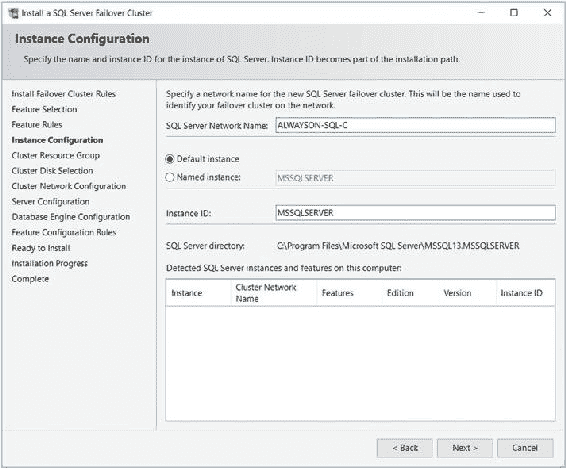

如果您在 64 位环境中安装 SQL Server，系统将要求您输入共享功能目录的 32 位和 64 位版本文件夹。这是因为某些 SQL Server 组件始终作为 32 位进程安装。32 位和 64 位组件不能共享同一目录，因此为了使安装继续，您必须为这些选项分别指定不同的文件夹。共享功能目录成为根目录


## 第四章：实现 AlwaysOn 故障转移群集实例

#### 共享功能目录

用于存储 SQL Server 所有实例共享的功能，例如 SDK 和管理工具。

#### 安装规则检查

安装向导将检查您所选功能的安装规则。如果所有规则都通过，将显示“实例配置”页面（如图 4-8 所示）。在此页面上，您需要为实例指定名称。由于此实例将是群集的一部分，此页面还会要求您指定实例的网络名称。在此场景中，我们将安装 SQL Server 的默认实例，这意味着我们不需要指定实例名称。我们将`ALWAYSON-SQL-C`指定为网络名称。

> **图 4-8. 安装 SQL Server 故障转移群集向导 — 实例配置页面**

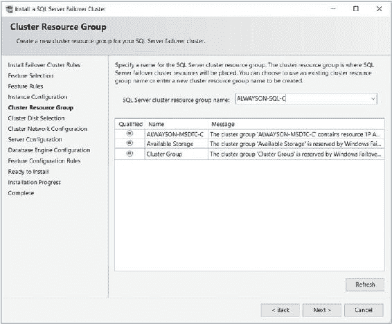

#### 提示：群集资源组术语

SQL Server 使用术语“群集资源组”来描述一个群集角色。而“群集角色”是微软较新的术语。在本章中，这两个术语应视为同义词。

#### 群集资源配置

在向导的“群集资源组”页面，您可以选择现有的群集资源组（这允许 Windows 管理员预先创建资源组），或者输入一个新的资源组名称，该名称将由安装程序创建。在我们的案例中，我们将指定`ALWAYSON-SQL-C`作为新资源组的名称。如图 4-9 所示。

> **图 4-9. 安装 SQL Server 故障转移群集向导 — 群集资源组页面**

**提示**：现有资源组将在“合格”列中标有红色或绿色指示器。如果是红色指示器，则表示无法将该资源组用于 SQL Server 实例。此时，“消息”列将说明原因。

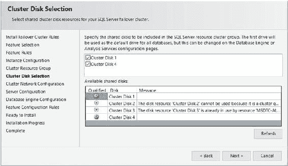

#### 群集磁盘选择

在“群集磁盘选择”页面（如图 4-10 所示），您可以选择应与资源组关联的磁盘资源。此页面将列出与群集关联的所有磁盘，并通过“合格”列中的红色或绿色指示器标明哪些磁盘可被选择。已与其他资源组关联的磁盘无法被选中，因为一个磁盘只能与一个资源组关联。我们将指定两个可用磁盘（`Data`和`TempDB`）都与`ALWAYSON-SQL-C`资源组关联。

> **图 4-10. 安装 SQL Server 故障转移群集向导 — 群集磁盘选择页面**

#### 群集网络配置

在“群集网络配置”页面（图 4-11），我们可以配置群集角色的 IP 地址。我们可以选择`DHCP`（这意味着 IP 地址将自动获取），或者指定一个静态 IP 地址。在我们的案例中，我们将指定一个静态 IP 地址。如果我们的群集是一个跨子网的扩展群集，则需要为每个子网指定一个 IP 地址。

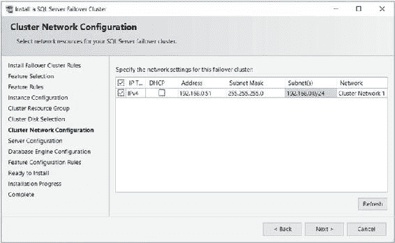

> **图 4-11. 安装 SQL Server 故障转移群集向导 — 群集网络配置页面**

#### 服务器配置

“服务器配置”页面有两个选项卡。第一个是“服务账户”选项卡（如图 4-12 所示）。在此选项卡上，我们将指定用作每个`SQL Server`服务安全上下文的服务账户，并为每个服务指定启动模式。这一点值得注意，因为在安装独立实例时，您通常会将每个服务设置为自动启动。然而，在安装群集时，应将感知群集的服务配置为手动启动。这是因为它们将由群集服务管理。

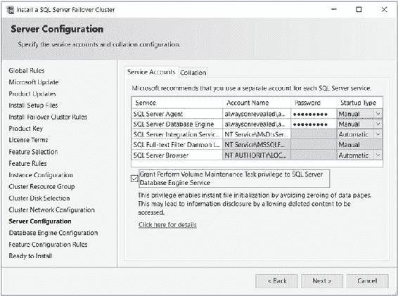


## 第四章 ■ 实现永始终在线的故障转移集群实例

#### 图 4-12. 安装 SQL Server 故障转移集群 — 服务账户选项卡
SQL Server 2016 的一项新功能是在安装过程中启用 `执行卷维护任务`，此功能在服务账户选项卡上通过一个简单的复选框实现。这里的考量是安全性与性能的权衡。如果你选择执行卷维护任务，那么在创建或扩展数据文件时，文件将不会被置零；然而，拥有专业软件的攻击者有可能检索到先前存储在已分配磁盘块上的数据。`执行卷维护任务` 不适用于事务日志文件。

**■ 提示** 有关 SQL Server 安全考量的完整讨论，我推荐 Apress 出版的图书 *保护 SQL Server：数据库管理员防御指南*，可从 [www.apress.com/9781484222645](http://www.apress.com/9781484222645) 购买。

在如图 4-13 所示的“排序规则”选项卡上，你可以指定为该实例配置的排序规则。只要可能，在整个企业中使用一致的排序规则是一个好主意，或者至少应在构成一个数据层应用程序的所有实例中保持一致。

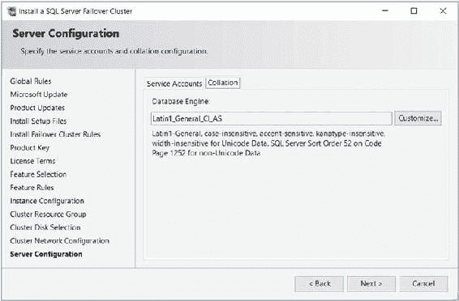

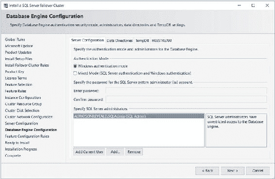

#### 图 4-13. 安装 SQL Server 故障转移集群 — 排序规则选项卡

数据库引擎配置页面包含四个选项卡。第一个是“服务器配置”选项卡，如图 4-14 所示。在此处，我们指定实例将使用的身份验证模式。

#### 图 4-14. 安装 SQL Server 故障转移集群 — 服务器配置选项卡

`Windows 身份验证模式` 意味着用户在登录 Windows 时提供的凭据将传递给 SQL Server，用户无需任何额外凭据即可访问实例。使用 `混合模式` 时，虽然仍可使用 Windows 凭据访问实例，但也可以为用户配置二级凭据。如果选择此选项，那么 SQL Server 将在实例内部维护自己的登录名和密码，用户可以使用这些凭据进行访问，即使他们的 Windows 身份没有权限。

出于安全最佳实践考虑，最好只允许对你的实例使用 Windows 身份验证。这有两个原因。首先，仅使用 Windows 身份验证时，即使攻击者获取了对您网络的访问权限，他们仍然无法访问 SQL Server，因为他们不会有具有正确权限的有效 Windows 帐户。然而，使用混合模式身份验证，一旦进入网络，攻击者可能使用暴力破解攻击或其他黑客技术尝试通过二级 SQL Server 登录名获得访问权限。其次，如果指定混合模式身份验证，则需要创建一个 `SA` 帐户。`SA` 帐户是一个 SQL Server 用户帐户，对实例拥有管理权限。如果此帐户的密码泄露，攻击者可能获得对 SQL Server 的管理控制权。如果必须使用混合模式身份验证，最好禁用 `SA` 帐户。

然而，在某些情况下，混合模式身份验证是必要的。例如，你可能有一个不支持 Windows 身份验证的旧版应用程序，或者有一个使用硬编码连接并依赖二级身份验证的第三方应用程序。这些是混合模式身份验证可能被要求的两个有效理由。另一个有效理由是，如果你有用户需要从非受信任域访问实例。

此外，在“服务器配置”选项卡上，你可以指定将哪些 Windows 用户添加到 `sysadmin` 固定服务器角色，从而赋予他们对实例的无限制访问权限。在我们的场景中，我们将添加 `AlwaysOnRevealed\SQLAdmin` 用户作为


实例管理员，并且仅使用 Windows 身份验证。

在“数据目录”选项卡上（如图 4-15 所示），您可以修改数据根目录的默认位置。在此界面上，您还可以更改用户数据库及其日志文件的默认位置。最后，此选项卡允许您指定将要执行的数据库备份的默认位置。在我们的场景中，必须确保数据根目录指向数据卷。

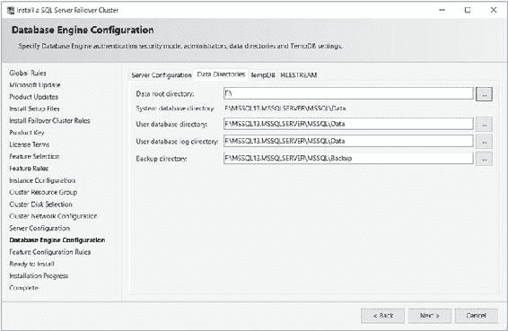

## 第 4 章 ■ 实现 AlwaysOn 故障转移群集实例

#### 图 4-15. 安装 SQL Server 故障转移群集— 数据目录选项卡

“TempDB”选项卡如图 4-16 所示。这是 SQL Server 2016 安装向导中的一个新选项卡，允许您配置 `TempDB` 数据库的属性。这一点很重要，因为 `TempDB` 需要正确的大小和处理器设置以避免成为实例的瓶颈。设置将默认为推荐配置，即每个处理器核心一个文件，最多八个文件。这被认为是避免系统页（如 `GAM`、`SGAM` 和 `PFS` 页）争用的最佳文件数量。`TempDB` 的正确大小应通过容量规划练习来估算。我们将配置 `TempDB` 每个文件的初始大小为 60MB（总计 240MB）。我们还已将 `TempDB` 配置为驻留在 TempDB 卷上。

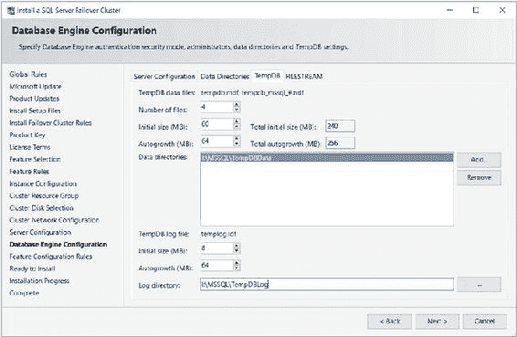

## 第 4 章 ■ 实现 AlwaysOn 故障转移群集实例

#### 图 4-16. 安装 SQL Server 故障转移群集— TempDB 选项卡

数据库引擎配置页面的 `FILESTREAM` 选项卡允许您启用和配置 SQL Server `FILESTREAM` 功能的访问级别，如图 4-17 所示。如果您希望使用 SQL Server 的 `FileTable` 功能，则也必须启用 `FILESTREAM`。`FILESTREAM` 和 `FileTable` 提供了在 Windows 文件夹结构中以非结构化方式存储数据的能力，同时保留了从 SQL Server 管理和查询此数据的能力。

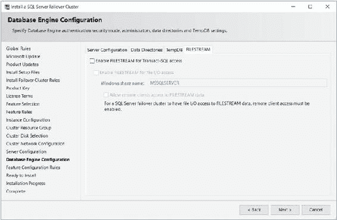

## 第 4 章 ■ 实现 AlwaysOn 故障转移群集实例

#### 图 4-17. 安装 SQL Server 故障转移群集实例— FILESTREAM 选项卡

检查完功能配置规则后，将显示向导的“准备安装”页面。此向导页面提供了 `setup` 实用程序将执行的操作摘要。在此页面上选择“安装”将开始实例安装。安装完成后，应查看“完成”页面。

### 使用 PowerShell 安装实例

当然，我们可以使用 `PowerShell` 来安装 AlwaysOn 故障转移群集实例，而不是使用 GUI。要通过 `PowerShell` 安装 AlwaysOn 故障转移群集实例，我们可以使用 SQL Server 的 `setup.exe` 应用程序，并指定 `InstallFailoverCluster` 操作。

执行群集实例的命令行安装时，除了安装 SQL Server 独立实例时必需的参数外，还需要表 4-1 中的参数。

## 第 4 章 ■ 实现 AlwaysOn 故障转移群集实例

#### 表 4-1. 安装群集实例所需的参数

**参数**  
**用法**  
`/FAILOVERCLUSTERIPADDRESSES`  
指定实例要使用的 IP 地址，格式为 `<IP 类型>;<地址>;<网络名称>;<子网掩码>`。对于多子网群集，IP 地址以空格分隔。  
`/FAILOVERCLUSTERNETWORKNAME`  
群集实例的虚拟名称。  
`/INSTALLSQLDATADIR`  
放置 SQL Server 数据文件的文件夹。这必须是一个群集磁盘。  

清单 4-1 中的脚本执行与刚才演示的安装相同的安装操作，您可以从安装媒体的根目录运行它。

#### 清单 4-1. 使用 PowerShell 安装 AlwaysOn 故障转移群集实例


.\`SETUP.EXE\` \`/IACCEPTSQLSERVERLICENSETERMS\` \`/ACTION="InstallFailoverCluster"\`

\`/FEATURES=SQL,IS\` \`/INSTANCENAME="MSSQLSERVER"\`

\`/SQLSVCACCOUNT="ALWAYSONREVEALED\SQLAdmin"\` \`/SQLSVCPASSWORD="Pa$$w0rd"\`

\`/AGTSVCACCOUNT="ALWAYSONREVEALED\SQLAdmin"\` \`/AGTSVCPASSWORD="Pa$$w0rd"\`

\`/SQLSYSADMINACCOUNTS="ALWAYSONREVEALED\SQLAdmin"\`

\`/FAILOVERCLUSTERIPADDRESSES="IPv4;192.168.0.51;Cluster Network 2;255.255.255.0"\`

\`/FAILOVERCLUSTERNETWORKNAME="ALWAYSON-SQL-C"\` \`/INSTALLSQLDATADIR="F:\" /qs\`

### 添加节点

安装集群时，接下来应该执行的步骤是添加第二个节点。未能添加第二个节点会导致实例保持在线，但没有高可用性，因为第二个节点无法接管角色的所有权。要配置第二个节点，您需要登录到被动集群节点，并从 **SQL Server 安装中心**的**安装**选项卡中选择**将节点添加到 SQL Server 故障转移集群**选项。这将调用**添加故障转移集群节点向导**。

此向导的第一页是**产品密钥**页面。与安装实例时一样，您需要使用此屏幕提供 SQL Server 的产品密钥。不指定产品密钥将仅允许您安装**评估**版，由于此版本在 180 天后到期，对于高可用性来说可能不是最明智的选择。

向导接下来的**许可条款**页面要求您阅读并接受 SQL Server 的许可条款。此外，您需要指定是否希望参加**Microsoft 客户体验改善计划**。如果选择此选项，则错误报告将被收集并发送给 Microsoft。

接受许可条款后，将运行规则检查以确保满足所有条件，以便您可以继续安装。向导检查 Microsoft 更新并安装安装所需的设置文件后，将执行另一轮规则检查，以确保满足将节点添加到集群的规则。

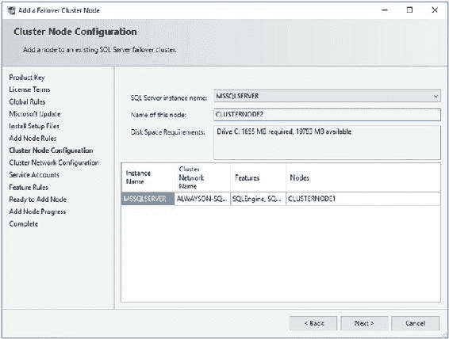

`第 4 章 ■ 实现 ALWAYSON 故障转移集群实例`

如图 4-18 所示，在**集群节点配置**页面上，系统会要求您确认要添加节点的实例名称。如果集群上有多个实例，则可以使用下拉框选择适当的实例。

`图 4-18. 添加故障转移集群节点向导 - 集群节点配置页面`

在如图 4-19 所示的**集群网络配置**页面上，您需要确认网络详细信息。这些信息应与集群中的第一个节点相同，包括相同的 IP 地址，因为这当然是在两个节点之间共享的。

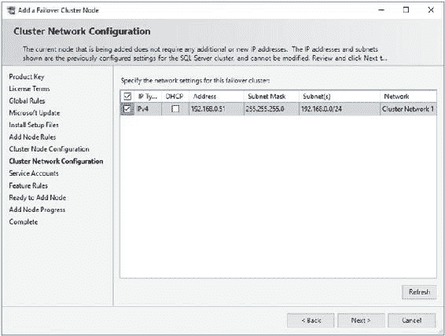

`第 4 章 ■ 实现 ALWAYSON 故障转移集群实例`

`图 4-19. 集群网络配置页面`

在向导的**服务账户**页面上，大多数信息处于只读模式，您无法修改。这是因为您使用的服务账户对于集群的每个节点必须是相同的。但是，您需要重新输入服务账户密码。此页面如图 4-20 所示。

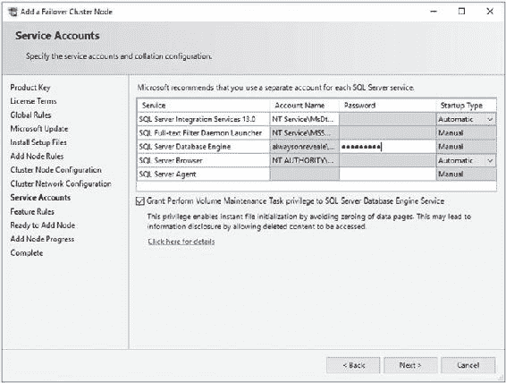

`第 4 章 ■ 实现 ALWAYSON 故障转移集群实例`

`图 4-20. 服务账户页面`

现在向导已获得所有必需信息，在显示摘要页面之前，将执行额外的规则检查。摘要页面称为**准备添加节点**页面，它提供了安装期间将进行的活动摘要。

### 使用 PowerShell 添加节点

要使用 PowerShell 而非 GUI 添加节点，您可以使用 \`AddNode\` 操作运行 SQL Server 的 \`setup.exe\` 应用程序。从命令行添加节点时，表 4-2 中详述的参数是必需的。

`第 4 章 ■ 实现 ALWAYSON 故障转移集群实例`

`表 4-2. AddNode 操作的必需参数`

| **参数** | **用法** |
| :--- | :--- |
| \`/ACTION\` |  |


## 第四章 ■ 实现 AlwaysOn 故障转移集群实例

必须配置为 `AddNode`。

`/IACCEPTSQLSERVERLICENSETERMS`

在 Windows Server Core 上安装时是必需的，因为在 Windows Server Core 上必须指定 `/qs` 开关。

`/INSTANCENAME`
您正在添加额外节点以支持的实例。

`/CONFIRMIPDEPENDENCYCHANGE`
允许多子网集群指定多个 IP 地址。输入值 1 表示 True，0 表示 False。

`/FAILOVERCLUSTERIPADDRESSES`
指定实例要使用的 IP 地址，格式为 `<IP 类型>;<地址>;<网络名称>;<子网掩码>`。对于多子网集群，IP 地址之间用空格分隔。

`/FAILOVERCLUSTERNETWORKNAME`
集群实例的虚拟名称。

`/INSTALLSQLDATADIR`
放置 SQL Server 数据文件的文件夹。这必须是一个集群磁盘。

`/SQLSVCACCOUNT`
用于运行数据库引擎的服务账户。

`/SQLSVCPASSWORD`
用于运行数据库引擎的服务账户的密码。

`/AGTSVCACCOUNT`
用于运行 SQL Server 代理的服务账户。

`/AGTSVCPASSWORD`
用于运行 SQL Server 代理的服务账户的密码。

清单 4-2 中的脚本 在从安装介质的根文件夹运行时，会将 `ClusterNode2` 添加到角色中。

***清单 4-2.*** 使用 PowerShell 添加节点

```
.\setup.exe /IACCEPTSQLSERVERLICENSETERMS /ACTION="AddNode" /INSTANCENAME="MSSQLSERVER" /SQLSVCACCOUNT="ALWAYSONREVEALED\SQLAdmin" /SQLSVCPASSWORD="Pa$$w0rd" /AGTSVCACCOUNT="ALWAYSONREVEALED\SQLAdmin" /AGTSVCPASSWORD="Pa$$w0rd" /FAILOVERCLUSTERIPADDRESSES="IPv4;192.168.0.51;Cluster Network 2;255.255.255.0" /CONFIRMIPDEPENDENCYCHANGE=0 /qs
```

### 小结

可以使用 SQL Server 安装中心或通过 PowerShell 安装 AlwaysOn 故障转移集群实例。使用 SQL Server 安装中心时，过程与安装独立实例非常相似；但是，您需要指定其他详细信息，例如网络名称、IP 地址和资源组配置。

使用 PowerShell 安装实例时，您将使用 `InstallFailoverCluster` 操作，除了独立实例构建所需的参数外，还需要指定 `/FAILOVERCLUSTERIPADDRESSES`、`/FAILOVERCLUSTERNETWORKNAME` 和 `/INSTALLSQLDATADIR` 参数。

## 第五章 ■ 使用 AlwaysOn 可用性组实现高可用性

AlwaysOn 可用性组为实现高可用性、灾难恢复和扩展只读工作负载提供了一个灵活的选项。该技术在数据库级别同步数据，但健康监控和仲裁由 Windows 集群提供。

本章演示如何为高可用性和灾难恢复构建和配置可用性组。我们还将讨论诸如性能注意事项和维护等方面，以及如何使用可用性组来扩展只读工作负载。

本章的演示使用在[第 3 章](http://dx.doi.org/10.1007/978-1-4842-2397-0_3)中构建的集群。每个节点都已预先配置了一个独立实例。`CLUSTERNODE1` 托管名为 `PRIMARYREPLICA` 的实例，`CLUSTERNODE2` 托管名为 `SYNCHA` 的实例。

在本章中，我们将创建两个可用性组。第一个将命名为 `App1`，并包含 `App1Customers` 和 `App1Sales` 数据库。第二个将命名为 `App2`，并包含 `App2Customers` 数据库。因此，我们将在本章执行的任务如下：

*   创建 `App1Customers`、`App1Sales` 和 `App2Customers` 数据库。
*   配置独立实例以支持可用性组。
*   使用“新建可用性组”向导创建 `App1` 可用性组和侦听器。
*   使用“新建可用性组”对话框创建 `App2` 可用性组。
*   使用“新建侦听器”对话框创建 `App2` 侦听器。

© Peter A. Carter 2016
P. A. Carter, *SQL Server AlwaysOn Revealed*, DOI 10.1007/978-1-4842-2397-0_5


## 第 5 章 ■ 使用 AlwaysOn 可用性组实现高可用性

### 准备可用性组

在实施 AlwaysOn 可用性组之前，我们首先创建三个数据库，这些数据库将在本章的演示中使用。其中两个数据库与虚构的应用程序 App1 相关，第三个数据库与虚构的应用程序 App2 相关。每个数据库包含一个单独的表，并填充了数据。每个数据库的恢复模式都设置为 `FULL`。这是数据库使用 AlwaysOn 可用性组的硬性要求，因为数据是通过日志流同步的。清单 5-1 中的脚本创建了这些数据库。

#### 清单 5-1. 创建数据库

```sql
CREATE DATABASE App1Customers;
GO

ALTER DATABASE App1Customers SET RECOVERY FULL;
GO

USE App1Customers;
GO

CREATE TABLE App1Customers
(
    ID INT PRIMARY KEY IDENTITY,
    FirstName NVARCHAR(30),
    LastName NVARCHAR(30),
    CreditCardNumber VARBINARY(8000)
);
GO

--填充表
DECLARE @Numbers TABLE
(
    Number INT
);

;WITH CTE(Number)
AS
(
    SELECT 1 Number
    UNION ALL
    SELECT Number + 1
    FROM CTE
    WHERE Number < 100
)
INSERT INTO @Numbers
SELECT Number FROM CTE;

DECLARE @Names TABLE
(
    FirstName VARCHAR(30),
    LastName VARCHAR(30)
);

INSERT INTO @Names
VALUES('Peter', 'Carter'),
      ('Michael', 'Smith'),
      ('Danielle', 'Mead'),
      ('Reuben', 'Roberts'),
      ('Iris', 'Jones'),
      ('Sylvia', 'Davies'),
      ('Finola', 'Wright'),
      ('Edward', 'James'),
      ('Marie', 'Andrews'),
      ('Jennifer', 'Abraham'),
      ('Margaret', 'Jones');

INSERT INTO App1Customers(Firstname, LastName, CreditCardNumber)
SELECT FirstName, LastName, CreditCardNumber FROM
(SELECT
    (SELECT TOP 1 FirstName FROM @Names ORDER BY NEWID()) FirstName,
    (SELECT TOP 1 LastName FROM @Names ORDER BY NEWID()) LastName,
    (SELECT CONVERT(VARBINARY(8000),
        (SELECT TOP 1 CAST(Number * 100 AS CHAR(4))
         FROM @Numbers
         WHERE Number BETWEEN 10 AND 99 ORDER BY NEWID()) + '-' +
        (SELECT TOP 1 CAST(Number * 100 AS CHAR(4))
         FROM @Numbers
         WHERE Number BETWEEN 10 AND 99 ORDER BY NEWID()) + '-' +
        (SELECT TOP 1 CAST(Number * 100 AS CHAR(4))
         FROM @Numbers
         WHERE Number BETWEEN 10 AND 99 ORDER BY NEWID()) + '-' +
        (SELECT TOP 1 CAST(Number * 100 AS CHAR(4))
         FROM @Numbers
         WHERE Number BETWEEN 10 AND 99 ORDER BY NEWID()))
    ) CreditCardNumber
FROM @Numbers a
CROSS JOIN @Numbers b
CROSS JOIN @Numbers c) d;

CREATE DATABASE App1Sales;
GO

ALTER DATABASE App1Sales SET RECOVERY FULL;
GO

USE App1Sales;
GO

CREATE TABLE dbo.Orders(
    OrderNumber int NOT NULL IDENTITY(1,1) PRIMARY KEY CLUSTERED,
    OrderDate date NOT NULL,
    CustomerID int NOT NULL,
    ProductID int NOT NULL,
    Quantity int NOT NULL,
    NetAmount money NOT NULL,
    TaxAmount money NOT NULL,
    InvoiceAddressID int NOT NULL,
    DeliveryAddressID int NOT NULL,
    DeliveryDate date NULL
);

DECLARE @Numbers TABLE
(
    Number INT
);

;WITH CTE(Number)
AS
(
    SELECT 1 Number
    UNION ALL
    SELECT Number + 1
    FROM CTE
    WHERE Number < 100
)
INSERT INTO @Numbers
SELECT Number FROM CTE;

--用数据填充现有订单
INSERT INTO Orders
SELECT
    (SELECT CAST(DATEADD(dd,(SELECT TOP 1 Number
                            FROM @Numbers
                            ORDER BY NEWID()),getdate()) as DATE)),
    (SELECT TOP 1 Number -10 FROM @Numbers ORDER BY NEWID()),
    (SELECT TOP 1 Number FROM @Numbers ORDER BY NEWID()),
    (SELECT TOP 1 Number FROM @Numbers ORDER BY NEWID()),
    500,
    100,
    (SELECT TOP 1 Number FROM @Numbers ORDER BY NEWID()),
    (SELECT TOP 1 Number FROM @Numbers ORDER BY NEWID()),
    (SELECT CAST(DATEADD(dd,(SELECT TOP 1 Number - 10
                            FROM @Numbers
                            ORDER BY NEWID()),getdate()) as DATE))
FROM @Numbers a
CROSS JOIN @Numbers b
CROSS JOIN @Numbers c;

CREATE DATABASE App2Customers;
GO

ALTER DATABASE App2Customers SET RECOVERY FULL;
GO

USE App2Customers;
GO

CREATE TABLE App2Customers
(
    ID INT PRIMARY KEY IDENTITY,
    FirstName NVARCHAR(30),
    LastName NVARCHAR(30),
    CreditCardNumber VARBINARY(8000)
);
GO

--填充表
DECLARE @Numbers TABLE
(
    Number INT
);

;WITH CTE(Number)
AS
(
    SELECT 1 Number
    UNION ALL
    SELECT Number + 1
    FROM CTE
    WHERE Number < 100
)
```


## 第 5 章 ■ 使用高可用性组实现高可用性

```sql
INSERT INTO @Numbers
SELECT Number FROM CTE ;

DECLARE @Names TABLE
(
    FirstName VARCHAR(30),
    LastName VARCHAR(30)
) ;

INSERT INTO @Names
VALUES('Peter', 'Carter'),
      ('Michael', 'Smith'),
      ('Danielle', 'Mead'),
      ('Reuben', 'Roberts'),
      ('Iris', 'Jones'),
      ('Sylvia', 'Davies'),
      ('Finola', 'Wright'),
      ('Edward', 'James'),
      ('Marie', 'Andrews'),
      ('Jennifer', 'Abraham'),
      ('Margaret', 'Jones')

INSERT INTO App2Customers(Firstname, LastName, CreditCardNumber)
SELECT FirstName, LastName, CreditCardNumber FROM
    (SELECT
        (SELECT TOP 1 FirstName FROM @Names ORDER BY NEWID()) FirstName
        ,(SELECT TOP 1 LastName FROM @Names ORDER BY NEWID()) LastName
        ,(SELECT CONVERT(VARBINARY(8000),
            (SELECT TOP 1 CAST(Number * 100 AS CHAR(4))
             FROM @Numbers
             WHERE Number BETWEEN 10 AND 99 ORDER BY NEWID()) + '-' +
            (SELECT TOP 1 CAST(Number * 100 AS CHAR(4))
             FROM @Numbers
             WHERE Number BETWEEN 10 AND 99 ORDER BY NEWID())
            + '-' +
            (SELECT TOP 1 CAST(Number * 100 AS CHAR(4))
             FROM @Numbers
             WHERE Number BETWEEN 10 AND 99 ORDER BY NEWID())
            + '-' +
            (SELECT TOP 1 CAST(Number * 100 AS CHAR(4))
             FROM @Numbers
             WHERE Number BETWEEN 10 AND 99 ORDER BY NEWID())))
        CreditCardNumber
    FROM @Numbers a
    CROSS JOIN @Numbers b
    CROSS JOIN @Numbers c
    ) d ;
```

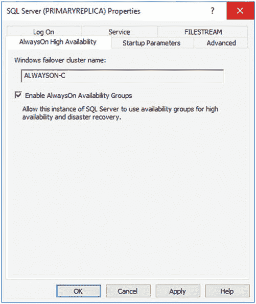

### 配置 SQL Server

配置高可用性组的第一步是在 SQL Server 服务上启用此功能。要通过 GUI 启用该功能，我们打开 SQL Server 配置管理器，展开 SQL Server 服务，然后从 SQL Server 服务的上下文菜单中选择属性。执行此操作时，将显示服务属性，我们导航到“高可用性”选项卡，如图 5-1 所示。

`图 5-1.` 高可用性选项卡

在此选项卡上，我们勾选“启用高可用性组”框，并确保“Windows 故障转移群集名称”框中显示的群集名称正确无误。然后我们需要重新启动 SQL Server 服务。由于高可用性组使用独立实例（这些实例本地安装在每个群集节点上），而不是跨越多个节点的故障转移群集实例，因此我们需要为群集上托管的每个独立实例重复这些步骤。

我们也可以使用 PowerShell 来启用高可用性组。为此，我们使用代码清单 5-2 中的 PowerShell 命令。该脚本假定 `CLUSTERNODE1` 是服务器名称，`PRIMARYREPLICA` 是 SQL Server 实例名称。

`代码清单 5-2.` 启用高可用性组

```powershell
Enable-SqlAlwaysOn -Path SQLSERVER:\SQL\CLUSTERNODE1\PRIMARYREPLICA
```

下一步是对所有将成为可用性组一部分的数据库进行完整备份。我们分别为 `App1` 和 `App2` 创建独立的可用性组，因此要为 `App1` 创建可用性组，我们需要备份 `App1Customers` 和 `App1Sales` 数据库。我们通过运行代码清单 5-3 中的脚本来完成此操作。

`代码清单 5-3.` 备份数据库

```sql
BACKUP DATABASE App1Customers
TO DISK = N'C:\Backups\App1Customers.bak'
WITH NAME = N'App1Customers-完整数据库备份' ;
GO

BACKUP DATABASE App1Sales
TO DISK = N'C:\Backups\App1Sales.bak'
WITH NAME = N'App1Sales-完整数据库备份' ;
GO
```

### 创建可用性组

有几种方式可以在 SQL Server 中创建可用性组拓扑。可以通过对话框手动创建，通过 T-SQL 创建，或通过向导创建。以下各节将探讨这些选项。

#### 使用新建可用性组向导

备份成功完成后，我们通过在对象资源管理器中展开“高可用性”，然后从“可用性组”文件夹的上下文菜单中选择“新建可用性组向导”来调用新建可用性组向导。


## 第五章 ■ 使用始终可用性组实现高可用性

向导的介绍页面如图 5-2 所示，现在已显示出来，为我们概述了需要执行的步骤。

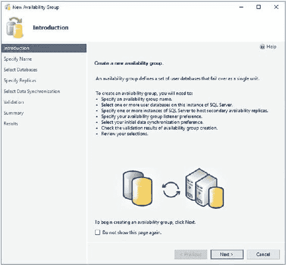

#### 图 5-2. 介绍页面

在"指定名称"页面（见图 5-3），系统提示我们为可用性组输入一个名称。我们还需要指定是否对可用性组使用数据库级运行状况检测。这是 SQL Server 2016 的一个新功能，如果启用，当组内的任何可用性数据库脱离 **ONLINE** 状态时，可用性组将发生故障转移。

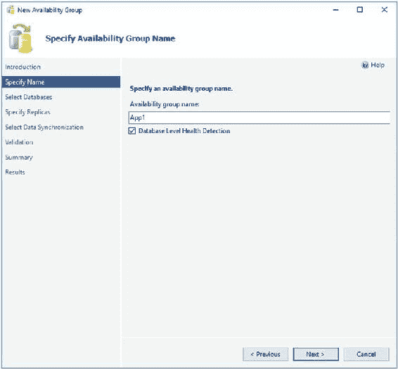

#### 图 5-3. "指定名称"页面

在"选择数据库"页面，系统提示我们选择希望加入可用性组的数据库，如图 5-4 所示。在此屏幕上，请注意我们无法选择 `App2Customers` 数据库，因为我们尚未对该数据库进行完整备份。

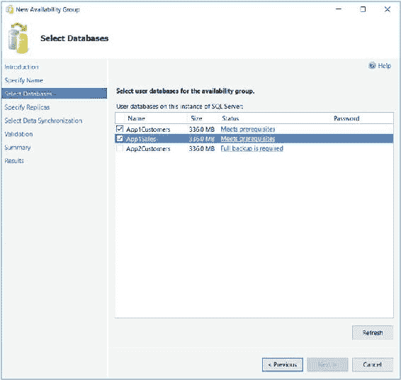

#### 图 5-4. "选择数据库"页面

"指定副本"页面包含四个选项卡。我们使用第一个选项卡"副本"来将辅助副本添加到拓扑中。勾选"同步提交"选项会导致数据在提交到主副本之前，先在辅助副本上提交。（这也被称为主副本提交前在辅助副本上*固化日志*。）这意味着，在发生故障转移时，不可能丢失数据，即我们可以满足 `RPO`（恢复点目标）为 0（零）的 `SLA`（服务级别协议）。但这也意味着存在性能阻碍。如果我们选择不勾选"同步提交"选项，则副本将以"异步提交"模式运行。这意味着数据先在主副本上提交，然后再在辅助副本上提交。这避免了性能阻碍，但也意味着在发生故障转移时，`RPO` 是不可确定的。同步副本的性能考虑将在本章后面讨论。

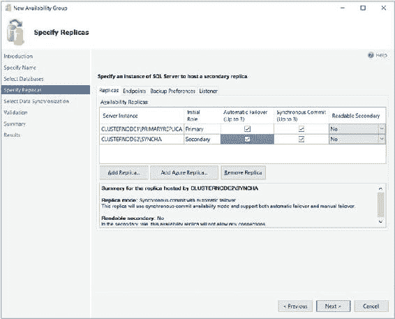

#### 图 5-5. "副本"选项卡

**提示** SQL Server 2016 企业版允许配置三个副本进行自动故障转移。以前版本的 SQL Server 只允许两个同步副本。

当我们勾选"自动故障转移"选项时，如果我们尚未选择，系统也会自动选择"同步提交"选项。这是因为只有在同步提交模式下才可能进行自动故障转移。我们可以将"可读辅助副本"下拉列表设置为"否"、"是"或"读意向"。当设置为"否"时，处于辅助角色的副本上的数据库不可访问。当设置为"读意向"时，可用性组侦听器能够将只读工作负载定向到此辅助副本，但前提是应用程序在连接字符串中指定了 `Application Intent=Read-only`。将其设置为"是"可启用侦听器来重定向只读流量，无论应用程序的连接字符串中是否存在"应用程序意向"参数。虽然我们可以通过 GUI 更改"可读辅助副本"的值，同时配置副本进行自动故障转移而不会出错，但这只是向导的一个特点。实际上，由于在配置为自动故障转移时不支持活动辅助副本，因此该副本是不可访问的。"副本"选项卡如图 5-5 所示。

**注意** 第六章将更深入地讨论使用辅助副本来处理只读工作负载。


## 第五章 ■ 使用始终可用的可用性组实现高可用性

在“指定副本”页面的“端点”选项卡（如`图 5-6`所示）中，我们为每个端点指定端口号。默认端口为`5022`，但我们可以根据需要指定其他端口。在此选项卡上，我们还需要指定数据在端点之间发送时是否应加密。通常建议勾选此选项，如果勾选，则使用`AES`（高级加密标准）作为加密算法。

`图 5-6. 端点选项卡`

您也可以选择更改创建的端点的名称。但是，由于每个实例只允许有一个数据库镜像端点，而且默认名称已经相当具有描述性，因此并不总是需要更改它。一些数据库管理员选择重命名它以包含实例名称，因为这样可以简化多服务器的管理。如果您的企业拥有许多可用性组集群，这是一个好主意。

每个实例使用的服务账户会出于信息目的显示。如果您确保两个实例使用相同的服务账户，可以简化安全管理。如果未能做到这一点，您将需要为每个实例授予访问每个服务账户的权限。这意味着，通过仅将一个服务账户用于一个实例来减小每个服务账户的安全范围的做法无法实现，您实际上是将安全范围从操作系统级别提升到了 SQL Server 级别。

端点 URL 指定了可用性组将用于通信的端点的 URL。URL 的格式为 `[传输协议]://[路径]:[端口]`。

数据库镜像端点的传输协议始终是`TCP`（传输控制协议）。路径可以是服务器的完全限定域名（`FQDN`）、单独的服务器名称或在网络上唯一的`IP`地址。我建议使用服务器的`FQDN`，因为它始终保证有效，并且也是默认填充的值。端口应与您为端点指定的端口号匹配。

■ **注意** 可用性组通过数据库镜像端点进行通信。虽然数据库镜像已弃用，但端点并未弃用。

在“备份首选项”选项卡（见`图 5-7`）中，我们可以指定将在哪个副本上执行自动备份。始终可用的可用性组的一个主要优势是，使用它们时，您可以将维护任务（如备份）扩展到辅助服务器。因此，自动备份可以无缝地定向到活动的辅助副本。可能的选项包括`首选辅助副本`、`仅辅助副本`、`主副本`或`任何副本`。还可以为每个副本设置优先级。在确定对哪个副本运行备份作业时，SQL Server 会评估每个节点的备份优先级，并更有可能选择优先级最高的副本。

`图 5-7. 备份首选项选项卡`

尽管减少主副本 I/O 的优势显而易见，但在许多情况下，我有些争议地建议不要将自动备份扩展到辅助副本。尤其是在由于操作可支持性问题，`RTO`（恢复时间目标）对应用程序至关重要的情况下。想象这样一个场景：正在对辅助副本进行备份时，用户打电话说他们不小心删除了关键表中的所有数据。您现在需要恢复数据库副本并重新填充该表。然而，备份文件存放在辅助副本上。因此，您需要先将备份文件复制到主副本，然后才能开始恢复数据库（或通过网络执行恢复）。这会立即增加您的 `RTO`。

此外，当配置为允许多台服务器进行备份时，SQL Server 仍然


### 备份历史与恢复挑战

`only maintains the backup history on the instance where the backup was taken.` 这意味着你可能需要在多个服务器之间来回查找，试图取回所有的备份文件，却不知道每个文件具体存放在哪里。如果其中一台服务器发生完全系统故障，情况会变得更糟。你可能会发现自己陷入日志链断裂的困境。

### 解决方案与新问题

解决上述大部分问题的方法是使用文件服务器上的共享位置，并将每个实例配置为备份到同一个共享目录。然而，这样做的问题在于，通过这种设置，你实际上是将所有备份都通过网络传输，而不是在本地进行备份。这可能会增加备份的持续时间，同时也会增加网络流量。

### Listener 选项卡配置

在 `Listener` 选项卡上（如图`5-8`所示），我们可以选择是立即创建一个可用性组`Listener`，还是将这个任务推迟到以后执行。如果选择创建侦听器，则需要指定侦听器的名称、它应监听的端口以及它应使用的`IP`地址。在多子网集群中，我们需要为每个子网指定一个地址。此处提供的详细信息用于在可用性组的集群角色中创建客户端访问点资源。

你可能会注意到，我们为侦听器指定了端口`1433`，而我们的`SQL Server`实例也运行在端口`1433`上。这是一个有效的配置，因为侦听器配置在与`SQL Server`实例不同的`IP`地址上。使用相同的端口号并非强制要求，但这样做是有益的——如果你是在现有实例上实施`AlwaysOn`可用性组，因为那些指定端口号进行连接的应用程序可能需要更少的修改。请记住，服务器名称仍然会不同，因为应用程序将连接到侦听器的虚拟名称，而不是物理服务器\实例的名称。在我们的示例中，应用程序连接到`APP1LISTEN\PRIMARYREPLICA`，而不是`CLUSTERNODE1\PRIMARYREPLICA`。虽然通过`CLUSTERNODE1`的连接仍然被允许，但它们无法受益于高可用性或报表的扩展。

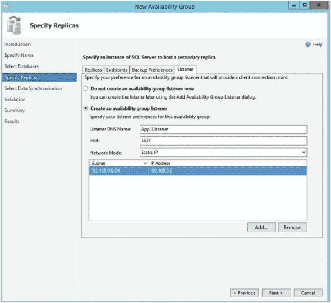

`第 5 章 ■ 使用 AlwaysOn 可用性组实现高可用性`

`图 5-8. ` `Listener 选项卡`

`■ 提示` `如果你在组织单位内没有“创建计算机对象”的权限，那么侦听器的 VCO（虚拟计算机对象）必须在 AD 中预先创建，并且你必须被分配对该对象的“完全控制”权限。`

### 初始数据同步选择

在`Select Initial Data Synchronization`屏幕上（如图`5-9`所示），我们选择如何对副本进行初始数据同步。如果选择`Full`，那么参与可用性组的每个数据库都会进行一次完整备份，接着是日志备份。备份文件会先备份到一个你指定的共享位置，然后还原到辅助服务器上。还原完成后，通过日志流的数据同步就会开始。

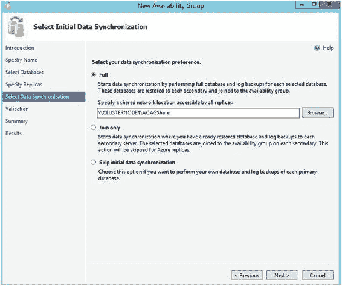

`第 5 章 ■ 使用 AlwaysOn 可用性组实现高可用性`

`图 5-9. ` `选择数据同步页面`

如果你已经备份了数据库并将它们还原到了辅助副本上，那么可以选择`Join Only`选项。这将启动可用性组内数据库通过日志流进行的数据同步。选择`Skip Initial Data Synchronization`允许你在完成设置后自行备份和还原数据库。

`■ 提示` `如果你的可用性组将包含许多数据库，那么最好由你自己执行备份/还原操作。这是因为内置的实用程序将按顺序执行这些操作，因此可能需要很长时间才能完成。`

在`Validation`页面上，系统会检查可能导致设置失败的问题。


## 第 5 章 ■ 使用 AlwaysOn 可用性组实现高可用性

如图 5-10 所示。如果任何结果返回为 `失败`，那么你需要在尝试继续之前解决它们。

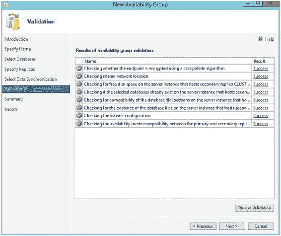

**图 5-10.** 验证页面

一旦验证测试完成，我们进入摘要页面，会看到一个将在设置过程中执行的任务列表。随着设置的进行，每个配置任务的结果会显示在结果页面上。如果此页面出现任何错误，请务必调查它们，但这不一定意味着需要重新配置整个可用性组。例如，如果可用性组侦听器的创建因为 `VCO` 未在 `AD` 中预先创建而失败，那么你可以重新创建侦听器，而无需重新创建整个可用性组。

作为使用新建可用性组向导的替代方法，你可以使用新建可用性组对话框，然后使用添加侦听器对话框来执行可用性组的配置。这种创建可用性组的方法将在本章后面探讨。

### 脚本化可用性组

我们还可以使用清单 5-4 中的脚本来编写活动脚本。此脚本连接到集群中的两个实例，这意味着它只能在 `SQLCMD` 模式下运行。

首先，脚本在每个实例上为服务帐户创建登录名。然后，它创建 `TCP` 端点，为服务帐户分配连接权限，并启动 AlwaysOn 可用性组的运行状况跟踪（我们将在本章后面讨论）。接着，脚本在主副本上创建可用性组，并将辅助副本加入该组。接下来，我们执行完整备份和日志备份，并在将数据库添加到组之前还原每个将参与可用性组的数据库。请注意，数据库是以串行方式备份、还原和添加到组的。如果你有许多数据库，那么你可能希望将此过程并行化。

**清单 5-4.** 创建可用性组

```
--为服务帐户创建登录名，
--创建端点并在主副本上
--为服务帐户分配端点连接权限

:Connect CLUSTERNODE1\PRIMARYREPLICA

USE master
GO

CREATE LOGIN [prosqladmin\clusteradmin] FROM WINDOWS ;
GO

CREATE ENDPOINT [Hadr_endpoint]
   AS TCP (LISTENER_PORT = 5022)
   FOR DATA_MIRRORING (ROLE = ALL, ENCRYPTION = REQUIRED ALGORITHM AES) ;
GO

ALTER ENDPOINT [Hadr_endpoint] STATE = STARTED ;
GO

GRANT CONNECT ON ENDPOINT::[Hadr_endpoint] TO [prosqladmin\clusteradmin] ;
GO

IF EXISTS(SELECT * FROM sys.server_event_sessions WHERE name='AlwaysOn_health')
BEGIN
    ALTER EVENT SESSION AlwaysOn_health ON SERVER WITH (STARTUP_STATE=ON);
END

IF NOT EXISTS(SELECT * FROM sys.dm_xe_sessions WHERE name='AlwaysOn_health')
BEGIN
    ALTER EVENT SESSION AlwaysOn_health ON SERVER STATE=START;
END
GO

--为服务帐户创建登录名，
--创建端点并在辅助副本上
--为服务帐户分配端点连接权限

:Connect CLUSTERNODE2\SYNCHA

USE master
GO

CREATE LOGIN [prosqladmin\ClusterAdmin] FROM WINDOWS ;
GO

CREATE ENDPOINT [Hadr_endpoint]
   AS TCP (LISTENER_PORT = 5022)
   FOR DATA_MIRRORING (ROLE = ALL, ENCRYPTION = REQUIRED ALGORITHM AES) ;
GO

ALTER ENDPOINT [Hadr_endpoint] STATE = STARTED ;
GO

GRANT CONNECT ON ENDPOINT::[Hadr_endpoint] TO [prosqladmin\ClusterAdmin] ;
GO

IF EXISTS(SELECT * FROM sys.server_event_sessions WHERE name='AlwaysOn_health')
BEGIN
    ALTER EVENT SESSION AlwaysOn_health ON SERVER WITH (STARTUP_STATE=ON);
END

IF NOT EXISTS(SELECT * FROM sys.dm_xe_sessions WHERE name='AlwaysOn_health')
BEGIN
    ALTER EVENT SESSION AlwaysOn_health ON SERVER STATE=START;
END
GO

--创建可用性组

:Connect CLUSTERNODE1\PRIMARYREPLICA

USE master
GO

CREATE AVAILABILITY GROUP App1
```


## 第 5 章 ■ 使用 AlwaysOn 可用性组实现高可用性

`WITH (AUTOMATED_BACKUP_PREFERENCE = PRIMARY)`
`FOR DATABASE App1Customers, App1Sales`
`REPLICA ON N'CLUSTERNODE1\PRIMARYREPLICA'`
`WITH (ENDPOINT_URL = N'TCP://ClusterNode1.PROSQLADMIN.COM:5022',`
`FAILOVER_MODE = AUTOMATIC, AVAILABILITY_MODE = SYNCHRONOUS_COMMIT, BACKUP_`
`PRIORITY = 50,`
`SECONDARY_ROLE(ALLOW_CONNECTIONS = NO)),`
`N'CLUSTERNODE2\SYNCHA'`
`WITH (ENDPOINT_URL = N'TCP://ClusterNode2.PROSQLADMIN.COM:5022',`
`FAILOVER_MODE = AUTOMATIC, AVAILABILITY_MODE = SYNCHRONOUS_COMMIT,`
`BACKUP_PRIORITY = 50, SECONDARY_ROLE(ALLOW_CONNECTIONS = NO));`
`GO`

#### --创建侦听器（使用适用于您环境的 IP 地址）

`ALTER AVAILABILITY GROUP App1`
`ADD LISTENER N'App1Listen' (`
`WITH IP`
`((N'192.168.0.4', N'255.255.255.0')`
`)`
`, PORT=1433);`
`GO`

#### --加入辅助副本

`:Connect CLUSTERNODE2\SYNCHA`
`ALTER AVAILABILITY GROUP App1 JOIN;`
`GO`

#### --备份数据库和日志（第一个数据库）

`:Connect CLUSTERNODE1\PRIMARYREPLICA`
`BACKUP DATABASE App1Customers`
`TO DISK = N'\\CLUSTERNODE1\Backups\App1Customers.bak'`
`WITH COPY_ONLY, FORMAT, INIT, REWIND, COMPRESSION, STATS = 5 ;`
`GO`
`BACKUP LOG App1Customers`
`TO DISK = N'\\CLUSTERNODE1\Backups\App1Customers.trn'`
`WITH NOSKIP, REWIND, COMPRESSION, STATS = 5 ;`
`GO`

#### --还原数据库和日志（第一个数据库）

`:Connect CLUSTERNODE2\SYNCHA`
`RESTORE DATABASE App1Customers`
`FROM DISK = N'\\CLUSTERNODE1\Backups\App1Customers.bak'`
`WITH NORECOVERY, STATS = 5 ;`
`GO`
`RESTORE LOG App1Customers`
`FROM DISK = N'\\CLUSTERNODE1\Backups\App1Customers.trn'`
`WITH NORECOVERY, STATS = 5 ;`
`GO`

## 第 5 章 ■ 使用 AlwaysOn 可用性组实现高可用性

#### --等待副本开始通信

```sql
DECLARE @connection BIT
DECLARE @replica_id UNIQUEIDENTIFIER
DECLARE @group_id UNIQUEIDENTIFIER
SET @connection = 0
WHILE @Connection = 0
BEGIN
SET @group_id = (SELECT group_id
FROM Master.sys.availability_groups
WHERE name = N'App1')
SET @replica_id = (SELECT replica_id
FROM Master.sys.availability_replicas
WHERE UPPER(replica_server_name COLLATE Latin1_
General_CI_AS) =
UPPER(@@SERVERNAME COLLATE Latin1_
General_CI_AS)
AND group_id = @group_id)
SET @connection = ISNULL((SELECT connected_state
FROM Master.sys.dm_hadr_availability_
replica_states
WHERE replica_id = @replica_id), 1)
WAITFOR DELAY '00:00:10'
END
```

#### --将第一个数据库添加到可用性组

`ALTER DATABASE App1Customers SET HADR AVAILABILITY GROUP = App1;`
`GO`

#### --备份数据库和日志（第二个数据库）

`:Connect CLUSTERNODE1\PRIMARYREPLICA`
`BACKUP DATABASE App1Sales`
`TO DISK = N'\\CLUSTERNODE1\Backups\App1Sales.bak'`
`WITH COPY_ONLY, FORMAT, INIT, REWIND, COMPRESSION, STATS = 5 ;`
`GO`
`BACKUP LOG App1Sales`
`TO DISK = N'\\CLUSTERNODE1\Backups\App1Sales.trn'`
`WITH NOSKIP, REWIND, COMPRESSION, STATS = 5 ;`
`GO`

## 第 5 章 ■ 使用 AlwaysOn 可用性组实现高可用性

#### --还原数据库和日志（第二个数据库）

`:Connect CLUSTERNODE2\SYNCHA`
`RESTORE DATABASE App1Sales`
`FROM DISK = N'\\CLUSTERNODE1\Backups\App1Sales.bak'`
`WITH NORECOVERY, STATS = 5 ;`
`GO`
`RESTORE LOG App1Sales`
`FROM DISK = N'\\CLUSTERNODE1\Backups\App1Sales.trn'`
`WITH NORECOVERY, STATS = 5 ;`
`GO`

#### --等待副本开始通信

```sql
DECLARE @connection BIT
DECLARE @replica_id UNIQUEIDENTIFIER
DECLARE @group_id UNIQUEIDENTIFIER
SET @connection = 0
WHILE @Connection = 0
BEGIN
SET @group_id = (SELECT group_id
FROM Master.sys.availability_groups
WHERE name = N'App1')
SET @replica_id = (SELECT replica_id
FROM Master.sys.availability_replicas
WHERE UPPER(replica_server_name COLLATE Latin1_
General_CI_AS) =
UPPER(@@SERVERNAME COLLATE Latin1_
General_CI_AS)
AND group_id = @group_id)
SET @connection = ISNULL((SELECT connected_state
FROM Master.sys.dm_hadr_availability_
replica_states
WHERE replica_id = @replica_id), 1)
WAITFOR DELAY '00:00:10'
END
```

#### --将第二个数据库添加到可用性组

`ALTER DATABASE App1Sales SET HADR AVAILABILITY GROUP = App1;`
`GO`

## 第 5 章 ■ 使用 AlwaysOn 可用性组实现高可用性

### 通过 T-SQL 创建可用性组能为您提供最大的灵活性


## 第五章 ■ 使用始终可用组实现高可用性

配置。表 5-1 列出了完整的参数列表及其说明。

**表 5-1. 创建可用性组参数**

| 参数 | 说明 | 可接受值 |
| :--- | :--- | :--- |
| `AUTOMATED_BACKUP_PREFERENCE` | 定义应从何处运行自动作业执行备份。 | `PRIMARY`<br>`SECONDARY_ONLY`<br>`SECONDARY`<br>`NONE` |
| `FAILURE_CONDITION_LEVEL` | 指定故障转移的敏感度。详见表 5-2。 | `1` 至 `5` |
| `HEALTH_CHECK_TIMEOUT` | 配置 SQL Server 必须在集群判定实例无响应之前（当 `FAILOVER_MODE` 设为 `AUTOMATIC` 时会触发故障转移）返回运行状况检查信息的时间（以毫秒为单位）。 | `15000ms` 至 `4294967295ms` |
| `DB_FAILOVER` | 指当主副本上可用性组中的某个数据库退出 `ONLINE` 状态时，可用性组是否应发生故障转移。可接受值为 `ON` 和 `OFF`。 | |
| `DTC_SUPPORT` | 指定是否支持跨数据库事务。可接受值为 `PER_DB` 和 `NONE`。此设置仅在创建新可用性组时可配置，无法在现有可用性组上设置。 | |
| `BASIC` | 指定应支持基本可用性组。这是 SQL Server 标准版唯一可用的选项，并将可用性组限制为一个数据库和两个副本。 | |
| `DISTRIBUTED` | 指定可用性组将包含跨多个 Windows 故障转移群集拉伸的数据库。 | |
| `DATABASE` | 将加入可用性组的数据库的逗号分隔列表。 | – |
| `REPLICA ON` | 将作为组内副本的 `server\instance` 名称的逗号分隔列表。<br>下表中的参数构成 `REPLICA ON` 参数的 `WITH` 子句。 | – |
| `ENDPOINT_URL` | 副本用于通信的 TCP 终结点 URL。 | – |
| `AVAILABILITY_MODE` | 确定副本是以同步模式还是异步模式运行。 | `SYNCHRONOUS_COMMIT`<br>`ASYNCHRONOUS_COMMIT` |
| `FAILOVER_MODE` | 当 `AVAILABILITY_MODE` 设置为同步时，确定是否允许自动故障转移。 | `AUTOMATIC`<br>`MANUAL` |
| `BACKUP_PRIORITY` | 当 SQL Server 决定自动备份作业应在何处运行时，为副本分配权重。 | `0` 至 `100` |
| `SECONDARY_ROLE` | 指定仅当副本处于辅助角色时才适用的属性。`ALLOW_CONNECTIONS` 指定该副本是否可读，如果是，是允许所有 `read_only` 连接，还是只允许在连接字符串中指定了 `read-intent` 的连接。`READ_ONLY_ROUTING_URL` 指定应用程序用于连接到它进行只读操作的 URL，格式如下：`TCP://ServerName:Port`。 | - |
| `PRIMARY_ROLE` | 指定仅当副本处于主角色时才适用的属性。`ALLOW_CONNECTIONS` 可配置为 `All` 以允许任何连接，或配置为 `Read_Write` 以禁止只读连接。`READ_ONLY_ROUTING_LIST` 是已配置为只读副本的 `server\instance` 名称的逗号分隔列表。 | - |
| `AVAILABILITY GROUP ON` | 如果可用性组是 `DISTRIBUTED`，请使用 `AVAILABILITY GROUP ON` 参数来指定将使用的两个可用性组（位于不同的群集上）。 | |
| `SESSION_TIMEOUT` | 指定副本在未收到 ping 消息后，进入 `DISCONNECTED` 状态前可以存活的时间。 | `5` 至 `2147483647` 秒 |

`FAILOVER_CONDITION_LEVEL` 参数决定了组对故障转移的敏感度。表 5-2 描述了五个级别各自的含义。

**表 5-2. FAILOVER_CONDITION_LEVEL 参数**

| 级别 | 触发故障转移的原因 |
| :--- | :--- |
| 1 | 实例宕机。<br>AOAG 租约到期。 |
| 2 | 级别 1 的条件加上：<br>超过 `HEALTH_CHECK_TIMEOUT`。<br>副本状态为 `FAILED`。 |
| 3 (默认) | |


## 第 5 章 ■ 使用 AlwaysOn 可用性组实现高可用性

二级（Level 2）条件附加：

SQL Server 遇到严重的内部错误。

三级（Level 3）条件附加：

SQL Server 遇到中度的内部错误。
在满足任何合格条件时初始化故障转移。

### 使用“新建可用性组”对话框

既然我们已经成功创建了第一个可用性组，现在让我们为 `App2` 创建第二个可用性组。这次，我们使用 **新建可用性组** 和 **添加侦听器** 对话框。我们首先通过备份 `App2Customers` 数据库来开始此过程。

就像我们创建 `App1` 可用性组时一样，在执行备份之前，数据库是不可选择的。然而，与使用向导时不同，我们无法让 SQL Server 为我们执行初始数据库同步。因此，我们将数据库备份到上一个演示中创建的共享文件夹，然后将备份（连同事务日志备份）还原到辅助实例。

我们通过使用代码清单 5-5 中的脚本来完成此操作，该脚本必须在 `SQLCMD` 模式下运行才能生效。这是因为它需要连接到两个实例。

**代码清单 5-5.** 备份和还原数据库

```sql
--备份数据库和日志
:Connect CLUSTERNODE1\PRIMARYREPLICA
BACKUP DATABASE App2Customers TO DISK = N'\\CLUSTERNODE1\Backups\App2Customers.bak' WITH COPY_ONLY, FORMAT, INIT, REWIND, COMPRESSION, STATS = 5 ;
GO
BACKUP LOG App2Customers TO DISK = N'\\CLUSTERNODE1\Backups\App2Customers.trn' WITH NOSKIP, REWIND, COMPRESSION, STATS = 5 ;
GO

--还原数据库和日志
:Connect CLUSTERNODE2\SYNCHA
RESTORE DATABASE App2Customers FROM DISK = N'\\CLUSTERNODE1\Backups\App2Customers.bak' WITH NORECOVERY, STATS = 5 ;
GO
RESTORE LOG App2Customers FROM DISK = N'\\CLUSTERNODE1\Backups\App2Customers.trn' WITH NORECOVERY, STATS = 5 ;
GO
```

如果我们尚未创建可用性组，那么我们的下一步将是创建一个 `TCP` 终结点，以便实例之间可以通信。然后，我们需要在每个实例上为服务账户创建一个登录名，并授予其在终结点上的连接权限。但是，由于每个实例只能有一个数据库镜像终结点，因此我们不需要创建新的，显然我们也没有理由授予服务账户额外的权限。

因此，我们继续创建可用性组。为此，我们展开 **对象资源管理器** 中的 **AlwaysOn 高可用性**，并从 **可用性组** 的上下文菜单中选择 **新建可用性组**。

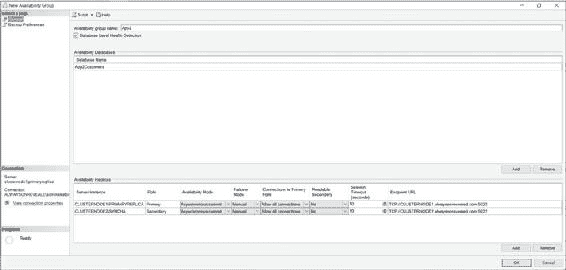

这将显示 **新建可用性组** 对话框的 **常规** 选项卡，如图 5-11 所示。在此屏幕上，我们在第一个字段中键入可用性组的名称。然后，我们在 **可用性数据库** 窗口下单击 **添加** 按钮，再键入我们希望添加到组中的数据库名称。接着，我们需要在 **可用性副本** 窗口下单击 **添加** 按钮，然后在新行中键入辅助副本的 `服务器\实例` 名称。

**图 5-11.** “新建可用性组”对话框

现在我们可以开始设置副本属性。在创建 `App1` 可用性组时，我们已经讨论过 **角色**、**可用性模式**、**故障转移模式**、**可读辅助副本** 和 **终结点 URL** 属性。**连接到主角色** 属性定义了如果副本处于主角色时可以建立哪些连接。您可以将其配置为 **允许所有连接** 或 **允许读/写连接**。当指定 **读/写** 时，其连接字符串中使用 `Application Intent = Read-only` 参数的应用程序将无法连接到该副本。

**会话超时** 属性设置副本在进入 `DISCONNECTED` 状态和会话之前，可以多久不接收到来自对方的 ping 信号。


## 第五章 ■ 使用 AlwaysOn 可用性组实现高可用性

虽然可以将此值设置为低至 5 秒，但通常建议将设置保持在 10 秒或更高，否则可能面临误报响应的风险，从而导致不必要的故障转移。如果某个副本超时，则需要重新同步，因为即使辅助副本运行在 `同步提交模式` 下，主副本上的事务也不再会等待它。

■ **注意** 您可能已经注意到，我们将副本配置为了 `异步提交模式`。这是为了便于后续的演示。对于高可用性，我们始终会配置 `同步提交模式`，因为否则，自动故障转移将无法实现。

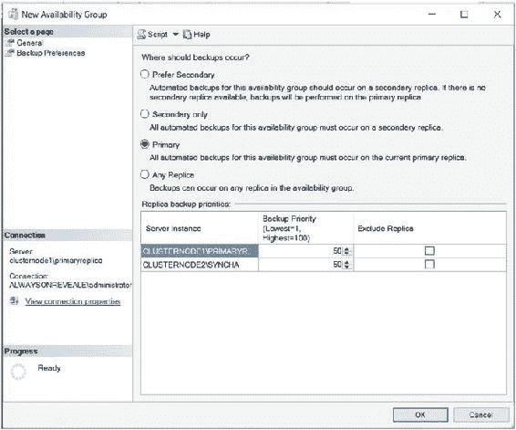

在对话框的“备份首选项”选项卡中，我们定义用于自动备份作业的首选副本，如图 5-12 所示。就像使用向导时一样，我们可以指定“首选副本”，也可以选择强制或优先在辅助副本上进行备份。我们还可以为每个副本配置一个介于 0 到 100 之间的权重，并使用“排除副本”复选框来避免在特定节点上进行备份。

**图 5-12.** “备份首选项”选项卡

创建可用性组后，我们需要创建可用性组侦听器。为此，我们在 `App2 可用性组`（现在应在对象资源管理器中可见）的上下文菜单中选择“新建侦听器”。这将调用“新建可用性组侦听器”对话框，如图 5-13 所示。

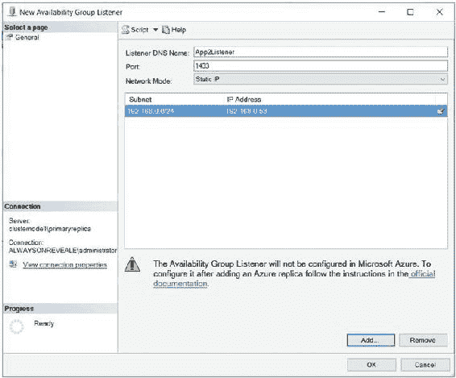

**图 5-13.** “新建可用性组侦听器”对话框

在此对话框中，我们首先输入侦听器的虚拟名称。然后定义它将侦听的端口以及将分配给它的 IP 地址。由于所有三者使用不同的 IP 地址，我们可以为两个侦听器以及 `SQL Server 实例` 使用相同的端口。

### 同步提交模式的性能考虑

与传统的群集不同，可用性组拓扑没有任何共享磁盘资源。因此，数据必须在两个设备上进行复制，这当然会产生开销。该开销根据环境的各种方面（如网络延迟、磁盘性能以及应用程序配置文件）而有所不同。但是，`清单 5-6` 中的脚本首先对 `App2Customers` 数据库（处于 `异步提交模式`）运行一些写入密集型测试，然后对 `App1Customers` 数据库（处于 `同步提交模式`）运行相同的测试。这表明了您可以预期会观察到的开销。

■ **提示** 重要的是要记住，读取性能没有开销。此外，尽管写入操作存在开销，但如果您实现了可读辅助副本来分配只读工作负载，其中一部分开销会被抵消。

`清单 5-6.` 使用可用性组的性能基准测试

```
DBCC FREEPROCCACHE
DBCC DROPCLEANBUFFERS
SET STATISTICS TIME ON
PRINT '开始异步提交基准测试'
USE App2Customers
GO
PRINT '创建非聚集索引'
CREATE NONCLUSTERED INDEX NIX_FirstName_LastName ON App2Customers(FirstName, LastName) ;
PRINT '从表中删除数据'
DELETE FROM [dbo].[App2Customers] ;
PRINT '向表中插入数据'
DECLARE @Numbers TABLE
(
Number INT
)
;WITH CTE(Number)
AS
(
SELECT 1 Number
UNION ALL
SELECT Number + 1
FROM CTE
WHERE Number < 100
)
INSERT INTO @Numbers
SELECT Number FROM CTE ;
DECLARE @Names TABLE
(
FirstName VARCHAR(30),
LastName VARCHAR(30)
) ;
INSERT INTO @Names
VALUES('Peter', 'Carter'),
('Michael', 'Smith'),
('Danielle', 'Mead'),
('Reuben', 'Roberts'),
('Iris', 'Jones'),
('Sylvia', 'Davies'),
('Finola', 'Wright'),
('Edward', 'James'),
('Marie', 'Andrews'),
('Jennifer', 'Abraham'),
```


```sql
('Margaret', 'Jones')

INSERT INTO App2Customers(Firstname, LastName, CreditCardNumber)

SELECT FirstName, LastName, CreditCardNumber FROM

(SELECT

(SELECT TOP 1 FirstName FROM @Names ORDER BY NEWID()) FirstName

,(SELECT TOP 1 LastName FROM @Names ORDER BY NEWID()) LastName

,(SELECT CONVERT(VARBINARY(8000)

, (SELECT TOP 1 CAST(Number * 100 AS CHAR(4))

FROM @Numbers

WHERE Number BETWEEN 10 AND 99 ORDER BY NEWID()) + '-' +

(SELECT TOP 1 CAST(Number * 100 AS CHAR(4))

FROM @Numbers

WHERE Number BETWEEN 10 AND 99 ORDER BY NEWID())

+ '-' +

(SELECT TOP 1 CAST(Number * 100 AS CHAR(4))

FROM @Numbers

WHERE Number BETWEEN 10 AND 99 ORDER BY NEWID())

+ '-' +

(SELECT TOP 1 CAST(Number * 100 AS CHAR(4))

FROM @Numbers

WHERE Number BETWEEN 10 AND 99 ORDER BY NEWID())))

CreditCardNumber

FROM @Numbers a

CROSS JOIN @Numbers b

CROSS JOIN @Numbers c

) d ;
```

## 第五章：使用 AlwaysOn 可用性组实现高可用性

```sql
PRINT 'Begin synchronous commit benchmark'

USE App1Customers
GO

PRINT 'Build a nonclustered index'
CREATE NONCLUSTERED INDEX NIX_FirstName_LastName ON App1Customers(FirstName, LastName) ;

PRINT 'Delete from table'
DELETE FROM dbo.App1Customers ;

PRINT 'Insert into table'
DECLARE @Numbers TABLE
(
Number INT
) ;

;WITH CTE(Number)
AS
(
SELECT 1 Number
UNION ALL
SELECT Number + 1
FROM CTE
WHERE Number < 100
)
INSERT INTO @Numbers
SELECT Number FROM CTE ;

DECLARE @Names TABLE
(
FirstName VARCHAR(30),
LastName VARCHAR(30)
) ;

INSERT INTO @Names
VALUES('Peter', 'Carter'),
('Michael', 'Smith'),
('Danielle', 'Mead'),
('Reuben', 'Roberts'),
('Iris', 'Jones'),
('Sylvia', 'Davies'),
('Finola', 'Wright'),
('Edward', 'James'),
('Marie', 'Andrews'),
('Jennifer', 'Abraham'),
('Margaret', 'Jones') ;

INSERT INTO App1Customers(Firstname, LastName, CreditCardNumber)
SELECT FirstName, LastName, CreditCardNumber FROM
(SELECT
(SELECT TOP 1 FirstName FROM @Names ORDER BY NEWID()) FirstName
,(SELECT TOP 1 LastName FROM @Names ORDER BY NEWID()) LastName
,(SELECT CONVERT(VARBINARY(8000)
,(SELECT TOP 1 CAST(Number * 100 AS CHAR(4))
FROM @Numbers
WHERE Number BETWEEN 10 AND 99 ORDER BY NEWID()) + '-' +
(SELECT TOP 1 CAST(Number * 100 AS CHAR(4))
FROM @Numbers
WHERE Number BETWEEN 10 AND 99 ORDER BY NEWID())
+ '-' +
(SELECT TOP 1 CAST(Number * 100 AS CHAR(4))
FROM @Numbers
WHERE Number BETWEEN 10 AND 99 ORDER BY NEWID())
+ '-' +
(SELECT TOP 1 CAST(Number * 100 AS CHAR(4))
FROM @Numbers
WHERE Number BETWEEN 10 AND 99 ORDER BY NEWID())))
CreditCardNumber
FROM @Numbers a
CROSS JOIN @Numbers b
CROSS JOIN @Numbers c
) d ;
GO

SET STATISTICS TIME OFF
GO
```

此查询的相关结果展示在`清单 5-7`中。你可以看到，当`可用性组`运行在`同步提交模式`下时，索引重建慢了三倍，`INSERT`操作慢了近两倍，`DELETE`操作也略微慢了一些。

## 第五章：使用 AlwaysOn 可用性组实现高可用性

#### 清单 5-7：SQL Server 2016 性能测试结果

```
Begin asynchronous commit benchmark

Build a nonclustered index

SQL Server Execution Times:
CPU time = 4157 ms, elapsed time = 4948 ms.

Delete from table

SQL Server Execution Times:
CPU time = 12500 ms, elapsed time = 21671 ms.

Insert into table

SQL Server Execution Times:
CPU time = 6454 ms, elapsed time = 8771 ms.

Begin synchronous commit benchmark

Build a nonclustered index

SQL Server Execution Times:
CPU time = 4610 ms, elapsed time = 15709 ms.

Delete from table

SQL Server Execution Times:
CPU time = 11468 ms, elapsed time = 27389 ms.

Insert into table

SQL Server Execution Times:
CPU time = 7562 ms, elapsed time = 14364 ms.
```

让我们将此结果与使用`SQL Server 2014`观测到的相同结果进行比较，如`清单 5-8`所示。在这里，你可以看到使用`同步提交模式`时，`INSERT`操作慢了六倍。这证明了`Microsoft`在新版本中所做的性能改进。

#### 清单 5-8：SQL Server 2014 性能测试结果

```
Begin asynchronous commit benchmark
```


## 第 5 章 ■ 使用 AlwaysOn 可用性组实现高可用性

构建非聚集索引

SQL Server 执行时间：
```
CPU time = 1109 ms, elapsed time = 4316 ms.
```

从表中删除

SQL Server 执行时间：
```
CPU time = 6938 ms, elapsed time = 69652 ms.
(1000000 row(s) affected)
```

插入到表中

SQL Server 执行时间：
```
CPU time = 13656 ms, elapsed time = 61372 ms.
(1000000 row(s) affected)
```

开始同步提交基准测试

构建非聚集索引

SQL Server 执行时间：
```
CPU time = 1516 ms, elapsed time = 12437 ms.
```

从表中删除

SQL Server 执行时间：
```
CPU time = 8563 ms, elapsed time = 77273 ms.
(1000000 row(s) affected)
```

插入到表中

SQL Server 执行时间：
```
CPU time = 23141 ms, elapsed time = 372161 ms.
(1000000 row(s) affected)
```

■ **注意** 本节中的性能测试基于在笔记本电脑上运行的虚拟机。测试旨在说明同步提交模式带来的性能影响，以及 SQL Server 2016 中的性能改进。这并非精确的基准测试。您环境中的实际性能差异将取决于各种因素，包括基础设施和数据库工作负载特征。

由于同步提交模式相关的性能挑战，许多 DBA 决定通过使用三节点集群来实现高可用性和灾难恢复，其中两个节点位于主数据中心，一个节点位于灾难恢复数据中心。然而，他们不是在主数据中心内部署两个同步副本，而是将主副本跨故障转移群集实例进行延伸，并将群集配置为只能在这两个节点上承载实例，而不能在灾难恢复数据中心的第三个节点上承载。这很重要，因为这意味着我们不需要在数据中心之间实现 SAN 复制。灾难恢复节点使用异步提交模式的可用性组进行同步。如果以这种方式将 AlwaysOn 故障转移群集实例与 AlwaysOn 可用性组结合使用，则群集实例和副本之间不支持自动故障转移。只能配置为手动故障转移。在承载群集实例的两个节点之间也不需要可用性组进行故障转移，因为此故障转移由群集服务管理。此配置可被证明是实现业务连续性要求的一种极其强大且灵活的方式。

## 第 5 章 ■ 使用 AlwaysOn 可用性组实现高可用性

### 总结

AlwaysOn 可用性组可以实施最多八个辅助副本，结合了同步和异步提交模式。在使用可用性组实现高可用性时，总是使用同步提交模式，因为异步提交模式不支持自动故障转移。然而，在实施同步提交模式时，您必须意识到在辅助副本提交事务后才在主副本提交事务所导致的相关性能损失。对于灾难恢复，通常选择实施异步提交模式。

可以通过“新建可用性组向导”、对话框、T-SQL 甚至 PowerShell 创建可用性组。如果使用对话框创建可用性组，则某些方面（例如端点和相关权限）必须使用 T-SQL 或 PowerShell 编写脚本。

