# **使用 AlwaysOn 可用性组实现灾难恢复**

在第 5 章中，我们通过 App1 可用性组成功为 App1Customers 和 App1Sales 数据库实现了高可用性。在本章中，我们将讨论如何也为这些数据库实现灾难恢复。为此，我们首先需要在第二个站点中构建一台新服务器并安装 SQL Server 的独立实例。由于现在群集跨越两个站点，我们需要将其重新配置为


## 第六章 ■ 利用 AlwaysOn 可用性组实现灾难恢复

多子网群集。我们还需要重新配置仲裁模型，以消除其对当前用于仲裁的共享存储的依赖。完成此操作后，我们便能将新节点上的实例添加到我们的可用性组中。

以下各节假设您已经构建了第三台服务器，其上运行着名为 `CLUSTERNODE3\ASYNCDR` 的 SQL Server 实例，并将演示如何重新配置群集以及可用性组。本章还将讨论分布式可用性组和可读辅助副本。因此，我们将在本章执行的任务如下：

•  使用 `添加节点向导` 将第三个节点添加到群集
•  修改仲裁，以使用文件共享，并将灾难恢复节点排除在投票之外
•  向仲裁添加一个 IP 地址
•  在 IP 地址依赖项上配置 `OR` 约束
•  配置群集的 `RegisterAllProvidersIP` 和 `HostRecordTTL` 设置

### 配置群集

在开始修改可用性组之前，我们需要执行若干群集配置步骤。这些步骤包括添加新节点、重新配置仲裁以及向群集的客户端访问点添加新的 IP。

© Peter A. Carter 2016

P. A. Carter, *SQL Server AlwaysOn Revealed*, DOI 10.1007/978-1-4842-2397-0_6

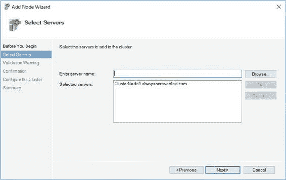

### 添加节点

向可用性组添加灾难恢复能力的首要任务，是将第三个节点添加到群集。为此，我们在 `故障转移群集管理器` 中右键单击节点，从上下文菜单中选择 `添加节点`。这将调用 `添加节点向导`。通过此向导的 `开始之前` 页面后，您将看到 `选择服务器` 页面，如 图 6-1 所示。在此页面上，您需要输入计划添加到群集的节点的服务器名称。

**`图 6-1.` `选择服务器` 页面**

在 `验证警告` 页面，系统会邀请您运行 `群集验证向导`。在生产环境中进行此类更改时，您应始终运行此向导；否则，您将无法获得 Microsoft 对群集的支持。运行 `群集验证向导` 的详细信息可在[第 3 章](http://dx.doi.org/10.1007/978-1-4842-2397-0_3)中找到。在我们当前的场景中运行 `群集验证向导` 可能会产生一些警告，详见 表 6-1。

**`表 6-1.` 群集验证警告**

**警告** | **原因** | **解决方法**
--- | --- | ---
`此资源未将群集的所有节点列为可能的所有者。` | 显示此警告是因为我们尚未配置可用性组以使用新节点。 | 在本章后续部分将讨论如何配置可用性组以使用新节点。
`网络名称 'Name: App1Listen' 的 RegisterAllProvidersIP 属性设置为 1。对于当前群集配置，此值应设置为 0。` | 将 `RegisterAllProvidersIP` 设置为 1 将导致所有 IP 地址都被注册，无论它们是否在线。当我们通过 SSMS 创建可用性组侦听器时，此设置被自动配置为允许客户端更快地故障转移，此警告应始终被忽略。如果我们通过 `故障转移群集管理器` 创建侦听器，则该属性默认设置为 0。 | `RegisterAllProvidersIP` 将在本章后续部分更详细地讨论。无解决方法

在 `确认` 页面，我们将看到将执行任务的摘要。在此页面上，我们取消选中添加合格存储的选项，因为我们的目标之一就是消除对共享存储的依赖。`确认` 页面如 图 6-2. 所示。

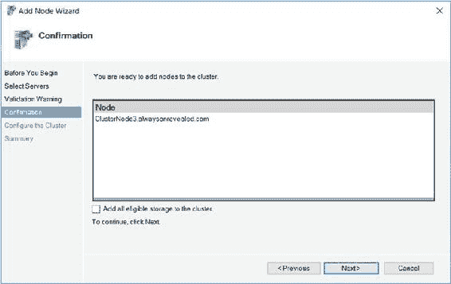


## 第 6 章 ■ 使用 AlwaysOn 可用性组实现灾难恢复

#### 图 6-2. 确认页面

在`配置群集`页面上，会显示各项任务的进度直至完成。

随后显示`摘要`页面，概述各项操作及其成功情况。

### 修改仲裁

我们在配置群集中的下一步是修改仲裁。如前所述，我们希望消除当前对共享存储的依赖。因此，我们需要做出选择。由于我们群集中现在有三个节点，一种可能是移除磁盘见证并形成节点多数仲裁。这样做的问题在于，我们有一个节点位于不同的站点。因此，如果两个站点间的网络连接长时间中断，那么我们的主站点将没有容错能力。如果其中一个节点宕机，我们将丢失仲裁，群集也将离线。另一方面，如果在主站点设置一个额外的见证，则不符合最佳实践，因为投票数是偶数。同样，如果我们丢失一个投票成员，就会失去弹性。

因此，我们采取的方法是用文件共享见证替换磁盘见证，从而移除对共享磁盘的依赖。然后，我们移除灾难恢复站点节点的投票权。这意味着我们仲裁有三个投票成员，并且它们都位于同一站点内。这减轻了站点间网络问题导致高可用性解决方案冗余丢失的风险。

为了调用`配置群集仲裁向导`，我们在`故障转移群集管理器`中右键单击我们的群集，在上下文菜单的`更多操作`子菜单中选择`配置群集仲裁`。在此向导的`开始之前`页面之后，系统会要求您在如图 6-3 所示的`选择仲裁配置选项`页面上选择希望进行的配置。我们选择`高级仲裁配置`选项。

#### 图 6-3. 选择仲裁配置选项页面

在`选择投票配置`页面上，我们选择节点并从`CLUSTERNODE3`移除投票权。如图 6-4 所示。

#### 图 6-4. 选择投票配置页面

在`选择仲裁见证`页面上，我们选择`配置文件共享见证`选项，如图 6-5 所示。

#### 图 6-5. 选择仲裁见证页面

在`配置文件共享见证`页面上（如图 6-6 所示），我们输入将用于仲裁的共享的 UNC 路径。此文件共享必须位于群集外部，并且必须是运行`Windows Server`的机器上的 SMB 文件共享。

#### 图 6-6. 配置文件共享见证页面

**提示** 尽管许多非 Windows 的 NAS（网络附加存储）设备支持 SMB 3，但我经历过在 NAS 设备上实现文件共享仲裁只能间歇性工作的情况，且供应商无法解决。

**注意** 请记住，仅使用一个文件共享见证和另外两个投票节点，可能导致"时间点分区"场景。更多信息，请参阅第 3 章。

在向导的`确认`页面上，将显示将要进行的配置更改的摘要，如图 6-7 所示。

#### 图 6-7. 确认页面

在`配置群集仲裁设置`页面上，会显示一个进度条。配置完成后，将出现`摘要`页面。此页面提供了


### 添加 IP 地址

我们的下一个任务是向集群的客户端访问点添加第二个 IP 地址。我们暂时不为可用性组侦听器添加额外的 IP 地址。我们将在本章后面的“配置可用性组”部分执行此任务。

为了添加第二个 IP 地址，我们在“故障转移群集管理器”的“核心群集资源”窗口中，右键单击“服务器名称”，然后选择“属性”。在“群集属性”对话框的“常规”选项卡上，我们为管理客户端添加故障转移到 DR 后使用的 IP 地址，如图 6-8 所示。

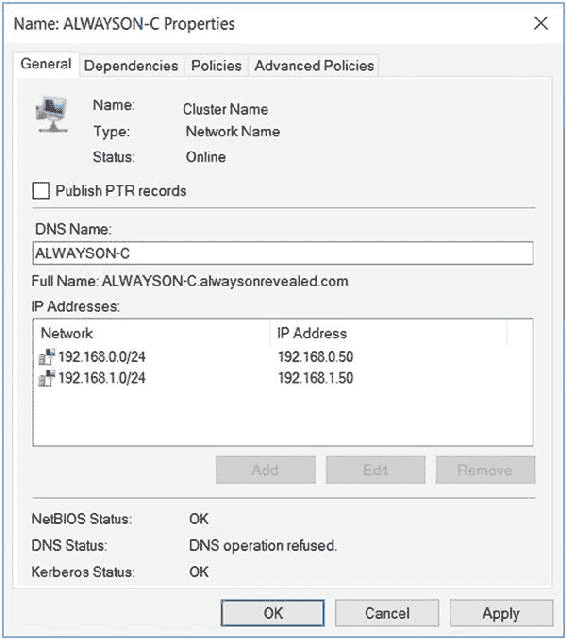

**图 6-8.** 常规选项卡

当我们应用更改时，会收到一条警告，称管理客户端将暂时与群集断开连接。这不包括任何连接到我们可用性组的客户端。如果我们选择继续，接下来导航到对话框的“依赖项”选项卡，并确保在我们的两个 IP 地址之间创建了一个“或”依赖项，如图 6-9 所示。

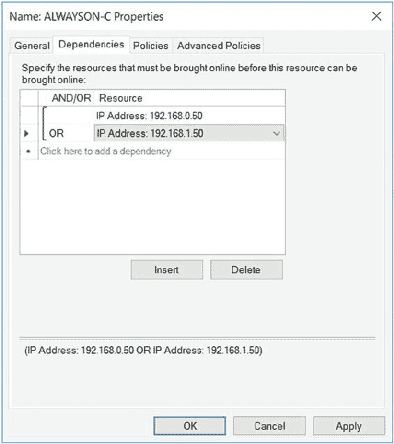

**图 6-9.** 依赖项选项卡

此过程完成后，“群集核心资源”组中的第二个 IP 地址资源显示为脱机。这是正常的。如果故障转移到第二个子网中的服务器，此 IP 地址将联机，而主站点中子网的 IP 地址将脱机。这就是为什么“或”依赖项（相对于“与”依赖项）至关重要。没有它，“服务器名称”资源将永远无法联机。

### 配置可用性组

要配置可用性组，我们首先必须将新节点添加为副本并配置其属性。然后，我们为第二个子网向侦听器添加一个新的 IP 地址。最后，我们探讨如何改善客户端的连接时间。

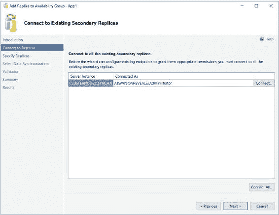

### 添加并配置副本

在 SQL Server Management Studio (SSMS)中，在主副本上，我们依次展开“可用性组”|“App1”，然后在“可用性副本”节点上右键单击并选择“添加副本”。这将显示“将副本添加到可用性组”向导。在通过向导的“简介”页面后，你将看到“连接到副本”页面，如图 6-10 所示。在此页面上，系统会提示你连接到可用性组中的其他副本。

**图 6-10.** 连接到副本页面

在“指定副本”页面的“副本”选项卡上，如图 6-11 所示，我们首先使用“添加副本”按钮连接到 DR 实例。连接到新副本后，我们指定该副本的属性。在本例中，我们保留原样，因为它将是一个 DR 副本。因此，我们希望它是异步的，并且不可读。

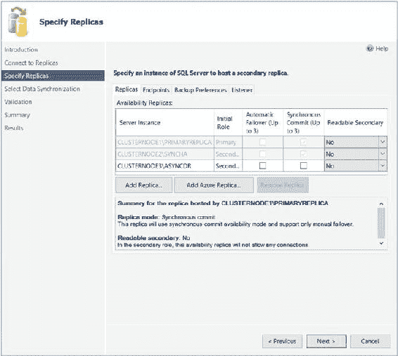

**图 6-11.** 副本选项卡

在“端点”选项卡上，如图 6-12 所示，我们确保默认设置是正确且可接受的。

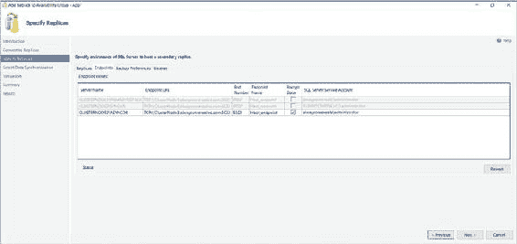

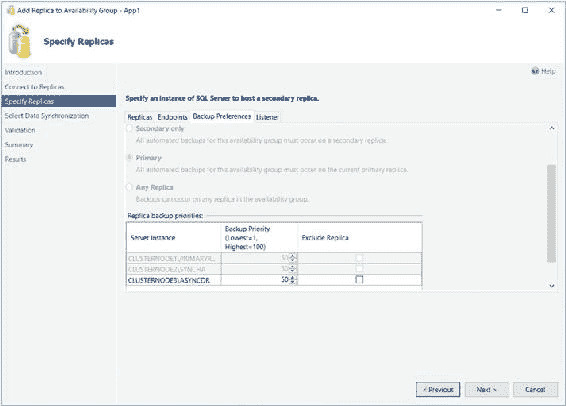

**图 6-12.** 端点选项卡

在“备份首选项”选项卡上，指定首选备份副本的选项是只读的。然而，我们可以专门排除我们的新副本作为备份候选者，或更改其备份优先级。此页面如图 6-13 所示。

**图 6-13.** 备份首选项选项卡

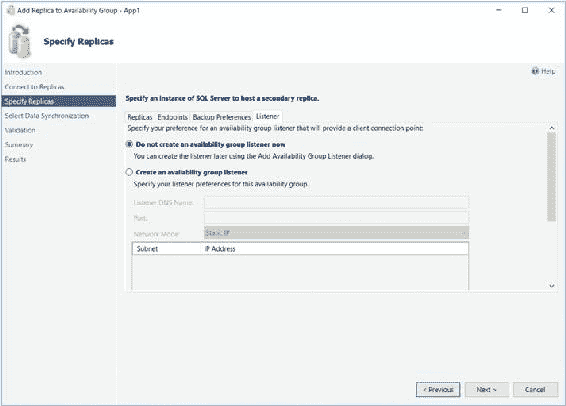


## 第六章 ■ 使用 AlwaysOn 可用性组实现灾难恢复

### 侦听器与数据同步配置

在如图 6-14 所示的“侦听器”选项卡上，我们可以决定是否创建新的侦听器。这是一个奇怪的选项，因为 SQL Server 只允许我们为一个可用性组创建单个侦听器，而我们已经有一个了。因此，我们保留默认选择**不创建可用性组侦听器**。可以直接从故障转移群集管理器创建第二个侦听器，但只有在非常罕见和特殊的情况下，你才需要为同一个可用性组创建第二个侦听器，我们将在本章后面讨论这一点。

**图 6-14.** 侦听器选项卡

在“选择数据同步”页面上，我们选择执行副本初始同步的方式。选项与我们创建可用性组时相同，只是文件共享路径会自动填充，假设我们在创建可用性组时选择了“完整”同步方式。此屏幕如图 6-15 所示。

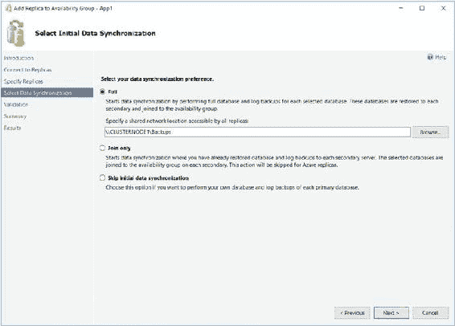

**图 6-15.** 选择数据同步页面

在“验证”页面上，我们应该检查任何警告或错误，并在继续之前解决它们。最后，在“摘要”页面上，会显示将要执行的配置摘要。

### 添加副本与故障处理

重新配置完成后，我们的新副本将被添加到群集中。然后，我们应该检查结果并处理任何警告或错误。我们也可以使用 T-SQL 将副本添加到可用性组。清单 6-1 中的脚本执行了与刚才演示相同的操作。由于该脚本连接到多个实例，你必须在 SQLCMD 模式下运行它。

**提示：** 你会注意到以下脚本（以及本书中的其他脚本）去掉了域名的最后一个字符。这是因为 `alwaysonrevealed` 超过了 NETBIOS 名称允许的 15 个字符限制。因此，SQL Server 无法识别该域名。在 SQL Server 中的解决方法是指定前 15 个字符。虽然这看起来有点奇怪，因为 SQL Server 实际上以 `sysname` 数据类型存储数据，它是 `NVARCHAR(128)` 的同义词，但这种情况比我们在处理登录名时遇到的情况要好。对于登录名，最大长度是 16 个字符，如果登录名映射到 Windows 组，使用更长的名称没问题，但如果登录名映射到 Windows 用户，那么登录名可以被创建，但无法登录。

### 代码清单：添加副本

**清单 6-1.** 添加副本

```sql
:Connect CLUSTERNODE3\ASYNCDR

--Create Login for Service Account
USE master
GO
CREATE LOGIN [alwaysonreveale\SQLAdmin] FROM WINDOWS ;
GO

--Create the Endpoint
CREATE ENDPOINT Hadr_endpoint
    AS TCP (LISTENER_PORT = 5022)
    FOR DATA_MIRRORING (ROLE = ALL, ENCRYPTION = REQUIRED ALGORITHM AES) ;
GO
ALTER ENDPOINT Hadr_endpoint STATE = STARTED ;
GO

--Grant the Service Account permissions to the Endpoint
GRANT CONNECT ON ENDPOINT::[Hadr_endpoint] TO [alwaysonreveale\SQLAdmin] ;
GO

--Start the AOAG Health Trace
IF EXISTS(SELECT * FROM sys.server_event_sessions WHERE name='AlwaysOn_health')
BEGIN
    ALTER EVENT SESSION AlwaysOn_health ON SERVER WITH (STARTUP_STATE=ON);
END
IF NOT EXISTS(SELECT * FROM sys.dm_xe_sessions WHERE name='AlwaysOn_health')
BEGIN
    ALTER EVENT SESSION AlwaysOn_health ON SERVER STATE=START;
END
GO

:Connect CLUSTERNODE1\PRIMARYREPLICA
USE master
GO

--Add the replica to the Availability Group
ALTER AVAILABILITY GROUP App1
ADD REPLICA ON N'CLUSTERNODE3\ASYNCDR'
    WITH (ENDPOINT_URL = N'TCP://CLUSTERNODE3.ALWAYSONREVEALE.COM:5022',
          FAILOVER_MODE = MANUAL, AVAILABILITY_MODE = ASYNCHRONOUS_COMMIT,
          BACKUP_PRIORITY = 50,
          SECONDARY_ROLE(ALLOW_CONNECTIONS = NO));
GO

--Back up and restore the first database and log
BACKUP DATABASE App1Customers TO DISK = N'\\CLUSTERNODE1\Backups\App1Customers.bak'
```

## 第六章 ■ 使用 AlwaysOn 可用性组实现灾难恢复

```sql
WITH COPY_ONLY, FORMAT, INIT, REWIND, COMPRESSION, STATS = 5 ;
GO

BACKUP LOG App1Customers
TO DISK = N'\\CLUSTERNODE1\Backups\App1Customers.trn'
WITH NOSKIP, REWIND, COMPRESSION, STATS = 5 ;
GO

:Connect CLUSTERNODE3\ASYNCDR
ALTER AVAILABILITY GROUP App1 JOIN;
GO

RESTORE DATABASE App1Customers
FROM DISK = N'\\CLUSTERNODE1\Backups\App1Customers.bak'
WITH NORECOVERY, STATS = 5 ;
GO

RESTORE LOG App1Customers
FROM DISK = N'\\CLUSTERNODE1\Backups\App1Customers.trn'
WITH NORECOVERY, STATS = 5 ;
GO
```

-- 等待副本开始通信

```sql
DECLARE @connection BIT
DECLARE @replica_id UNIQUEIDENTIFIER
DECLARE @group_id UNIQUEIDENTIFIER
SET @connection = 0

WHILE @Connection = 0
BEGIN
    SET @group_id = (SELECT group_id FROM Master.sys.availability_groups WHERE name = N'App1')
    SET @replica_id = (SELECT replica_id FROM Master.sys.availability_replicas WHERE UPPER(replica_server_name COLLATE Latin1_General_CI_AS) = UPPER(@@SERVERNAME COLLATE Latin1_General_CI_AS) AND group_id = @group_id)
    SET @connection = ISNULL((SELECT connected_state FROM Master.sys.dm_hadr_availability_replica_states WHERE replica_id = @replica_id), 1)
    WAITFOR DELAY '00:00:10'
END
```

-- 将第一个数据库添加到新副本上的可用性组

```sql
ALTER DATABASE App1Customers SET HADR AVAILABILITY GROUP = [App1];
GO
```

-- 备份并还原第二个数据库和日志

```sql
:Connect CLUSTERNODE1\PRIMARYREPLICA
BACKUP DATABASE App1Sales
TO DISK = N'\\CLUSTERNODE1\Backups\App1Sales.bak'
WITH COPY_ONLY, FORMAT, INIT, REWIND, COMPRESSION, STATS = 5 ;
GO

BACKUP LOG App1Sales
TO DISK = N'\\CLUSTERNODE1\Backups\App1Sales.trn'
WITH NOSKIP, REWIND, COMPRESSION, STATS = 5 ;
GO

:Connect CLUSTERNODE3\ASYNCDR
ALTER AVAILABILITY GROUP [App1] JOIN;
GO

RESTORE DATABASE App1Sales
FROM DISK = N'\\CLUSTERNODE1\Backups\App1Sales.bak'
WITH NORECOVERY, STATS = 5 ;
GO

RESTORE LOG App1Sales
FROM DISK = N'\\CLUSTERNODE1\Backups\App1Sales.trn'
WITH NORECOVERY, STATS = 5 ;
GO
```

## 第六章 ■ 使用 AlwaysOn 可用性组实现灾难恢复

-- 等待副本开始通信

```sql
DECLARE @connection BIT
DECLARE @replica_id UNIQUEIDENTIFIER
DECLARE @group_id UNIQUEIDENTIFIER
SET @connection = 0

WHILE @Connection = 0
BEGIN
    SET @group_id = (SELECT group_id FROM Master.sys.availability_groups WHERE name = N'App1')
    SET @replica_id = (SELECT replica_id FROM Master.sys.availability_replicas WHERE UPPER(replica_server_name COLLATE Latin1_General_CI_AS) = UPPER(@@SERVERNAME COLLATE Latin1_General_CI_AS) AND group_id = @group_id)
    SET @connection = ISNULL((SELECT connected_state FROM Master.sys.dm_hadr_availability_replica_states WHERE replica_id = @replica_id), 1)
    WAITFOR DELAY '00:00:10'
END
```

-- 将第二个数据库添加到新副本上的可用性组

```sql
ALTER DATABASE App1Sales SET HADR AVAILABILITY GROUP = App1;
GO
```

### 添加 IP 地址

尽管副本已被添加到可用性组，并且我们可以故障转移到此副本，但我们的客户端仍然无法在灾难恢复站点通过可用性组监听器连接到它。这是因为我们需要添加一个 IP 地址资源，该资源驻留在第二个子网中。为此，我们可以在对象资源管理器中右键单击 `App1Listen`，从上下文菜单中选择“属性”，这将显示可用性组监听器属性对话框，如图 6-16 所示。在这里，我们添加监听器的第二个 IP 地址。

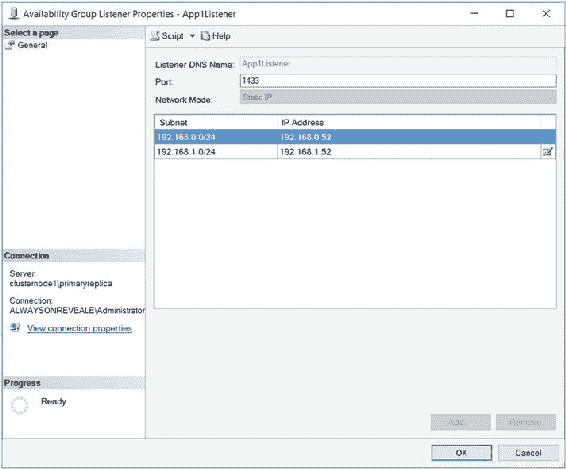

## 第六章 ■ 使用 AlwaysOn 可用性组实现灾难恢复

**图 6-16.** 可用性组监听器属性

我们也可以通过 T-SQL 来实现，运行清单 6-2 中的脚本。

**清单 6-2.** 向监听器添加 IP 地址

```sql
ALTER AVAILABILITY GROUP App1
MODIFY LISTENER 'App1Listen'
(ADD IP (N'192.168.1.52', N'255.255.255.0')) ;
```

SQL Server 现在将 IP 地址作为 `App1` 角色中的一个资源添加，并配置名称资源的 OR 依赖关系。您可以通过运行以下命令来查看这一点


## 第 6 章 ■ 使用 AlwaysOn 可用性组实现灾难恢复

对故障转移群集管理器中的`Name`资源运行依赖关系报告，如图 6-17 所示。

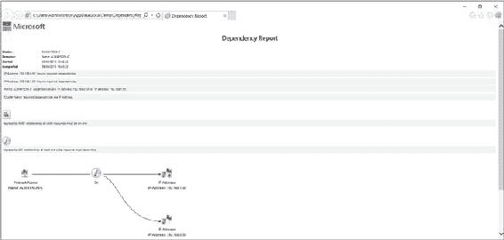

**图 6-17.** 依赖关系报告

### 改进连接时间

使用`.NET 4`或更高版本的客户端在连接到 AlwaysOn 可用性组时，可以在其连接字符串中指定新的`MultiSubnetFailover=True`属性。这通过更积极地重试 TCP 连接来改进连接时间。但是，如果客户端使用的是旧版本的`.NET`，则其连接超时的风险很高。

此问题有两种解决方法。第一种是将`RegisterAllProvidersIP`属性设置为`0`。这是推荐的方法，但问题在于，故障转移到 DR 站点可能需要长达 15 分钟。这是因为第二个子网的 IP 地址资源在发生故障转移之前处于脱机状态。然后，PTR 记录的发布可能需要长达 15 分钟。为了降低此风险，建议您同时降低`HostRecordTTL`。此属性定义群集名称的资源记录发布的频率。

清单 6-3 中的脚本演示了如何禁用`RegisterAllProvidersIP`，然后将`HostRecordTTL`减少到 300 秒。

**清单 6-3.** 配置连接属性

```powershell
Get-ClusterResource "App1_App1Listen" | Set-ClusterParameter RegisterAllProvidersIP 0
Get-ClusterResource "App1_App1Listen" | Set-ClusterParameter HostRecordTTL 300
```

另一种解决方法是简单地将连接的超时值增加到 30 秒。但是，此解决方案接受大量连接将需要长达 30 秒的时间。这对于业务来说可能是不可接受的。

### 分布式可用性组

分布式可用性组是 SQL Server 2016 的一项新功能，它提供了一种替代的灾难恢复配置，可以减少网络流量，并减轻 DR 站点的群集健康状况导致主站点问题的风险，同时仍能完全监控 DR 站点中的仲裁。

分布式可用性组不是将单个群集跨两个站点扩展，而是允许您连接驻留在多个群集上的可用性组。每个群集维护自己的仲裁，因此 DR 站点不可用不会影响主站点。此外，如果辅助站点中有多个副本，站点之间的网络流量会减少，因为主站点的数据仅复制一次，而不是像传统的扩展群集配置那样复制到每个单独的副本。其他群集规则也放宽了。例如，DR 站点群集中的群集节点可以最佳地运行与主站点群集中的群集节点不同版本的操作系统。

> **提示** 虽然许多规则被放宽，但主可用性组和辅助可用性组中数据库的配置和文件夹位置必须相同，就像使用单个扩展群集时一样。数据库镜像端点也必须使用相同的端口号。

典型的分布式可用性组拓扑如图 6-18 所示。

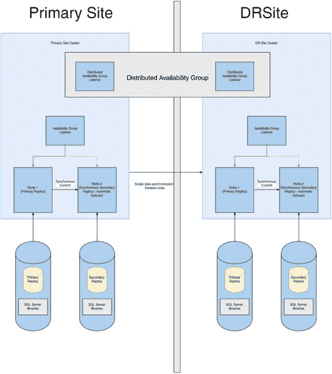

**图 6-18.** 分布式可用性组拓扑

分布式可用性组也可以与 SQL Server AlwaysOn 故障转移群集实例一起配置。在这种情况下，主站点中的群集将托管一个故障转移群集实例，而 DR 站点中的可用性组提供灾难恢复功能，无需扩展群集。


## 第六章 ■ 使用 AlwaysOn 可用性组实施灾难恢复

清单 6-4 中的脚本演示了如何为我们的 `App2` 可用性组创建一个分布式可用性组。该脚本假设你已经在第二个集群上创建了一个可用性组，其配置与位于 `ALWAYSON-C` 集群上的 `App2` 可用性组相匹配。它假设你已将灾难恢复集群上的可用性组侦听器命名为 `App2DR`。然后，该脚本会将第二个服务器上的可用性组加入到分布式可用性组中。

■ **提示** 将辅助可用性组加入分布式可用性组后，它将自动变为只读状态，只允许通过从主可用性组同步进行的更新。

#### 清单 6-4 创建分布式可用性组

```sql
CREATE AVAILABILITY GROUP App2Distributed
WITH (DISTRIBUTED)
AVAILABILITY GROUP ON
'App2' WITH
(
LISTENER_URL = 'tcp://App2_App2Listen:5022',
AVAILABILITY_MODE = ASYNCHRONOUS_COMMIT,
FAILOVER_MODE = MANUAL,
SEEDING_MODE = AUTOMATIC
),
'App2DR' WITH
(
LISTENER_URL = 'tcp://App2_App2Listen:5022',
AVAILABILITY_MODE = ASYNCHRONOUS_COMMIT,
FAILOVER_MODE = MANUAL,
SEEDING_MODE = AUTOMATIC
);
GO
```

■ **注意** 如果你希望遵循后续章节中的演示，请不要遵循本节中的演示。

### 配置可读辅助副本

在 AlwaysOn 可用性组拓扑中添加可读辅助副本以实现垂直扩展的报表功能会非常有用。当你使用此策略时，数据库通过日志流保持同步，延迟通常是可变且较低的。从 SQL Server 2014 开始，可读辅助副本的一个额外优势是，即使主副本脱机，它们也能保持在线。然而，使用此可用性功能的限制在于，用户必须直接连接到实例，而不是可用性组侦听器。

你可以通过使用临时统计信息来进一步提高可读辅助副本的读取性能，这些统计信息也可用于优化只读工作负载。此外，即使明确请求了其他隔离级别或锁定提示，快照隔离也**仅**在可读辅助副本上使用。这有助于避免争用，但也意味着 `TempDB` 应适当扩展并位于快速磁盘阵列上。

使用可读辅助副本的主要风险在于，在辅助副本上实现快照隔离实际上可能导致主副本上已删除的记录无法被清理。这是因为幽灵记录清理任务仅在行不再被辅助副本需要时，才会从主副本中移除它们。在这种情况下，主副本上的日志截断也会被延迟。这意味着你可能面临需要终止针对可读辅助副本执行的长时间运行的查询的风险。如果辅助副本与主副本断开连接，此问题也可能发生。因此，存在你可能需要将辅助副本从可用性组中移除并随后读取它的风险。

要使辅助副本可读，你需要执行三项任务。首先，配置辅助副本以允许只读连接。其次，指定用于报表的只读 URL。然后，可用性组侦听器会将适当的流量定向到此 URL。最后一项任务是更新主副本上的只读路由列表。这些任务由清单 6-5 中的脚本执行。

#### 清单 6-5 配置只读路由

```sql
--将 ASYNCDR 副本配置为允许只读连接
ALTER AVAILABILITY GROUP App1
MODIFY REPLICA ON N'CLUSTERNODE3\ASYNCDR' WITH
(SECONDARY_ROLE (ALLOW_CONNECTIONS = READ_ONLY)) ;

--为 ASYNCDR 副本配置只读 URL
ALTER AVAILABILITY GROUP App1
```

## 第六章 ■ 利用 AlwaysOn 可用性组实现灾难恢复

```sql
MODIFY REPLICA ON N'CLUSTERNODE3\ASYNCDR' WITH

(SECONDARY_ROLE (READ_ONLY_ROUTING_URL = N'TCP://CLUSTERNODE3.

ALWAYSONREVEALE.com:1433')) ;

-- 在主副本上配置只读路由列表

ALTER AVAILABILITY GROUP App1

MODIFY REPLICA ON N'CLUSTERNODE1\PRIMARYREPLICA' WITH

(PRIMARY_ROLE (READ_ONLY_ROUTING_LIST=('CLUSTERNODE3\ASYNCDR'))) ;
```

在 SQL Server 2016 之前，如果您在路由列表中指定了多个可读的辅助副本，那么侦听器会尝试将具有读取意向的流量定向到列表中的第一个副本。如果此副本不可用，则会尝试写入列表中的第二个副本，依此类推。这样做的结果是，虽然您可以将报表负载扩展到辅助服务器，但无法在多个辅助服务器之间对这些报表进行负载均衡。

然而，SQL Server 2016 引入了针对活动辅助副本的负载均衡功能。当对活动辅助副本使用负载均衡时，侦听器将使用轮询算法在指定的副本之间分配具有读取意向的工作负载。

此外，您可以指定平衡的副本组。例如，假设我们向 `App1` 可用性组添加了另外四个副本，所有这些副本都旨在卸载报表负载。图 6-19 展示了根据您对性能一致性的要求可以使用的几种不同拓扑。

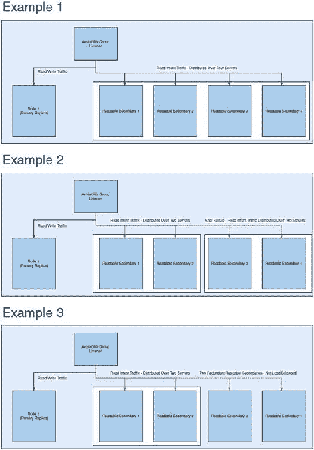

#### 图 6-19. 可能的负载均衡拓扑

> **提示：** 通常，业务用户会更看重性能的一致性而非性能本身。

在第一个示例中，流量将在所有四个活动辅助副本之间均衡。第二个示例说明副本已被分成两个独立的组。侦听器将首先尝试将具有读取意向的请求路由到第一组服务器，并在该组内的两个服务器之间均衡负载。如果第一组服务器不可用，则侦听器会将具有读取意向的流量路由到第二组服务器，并在该组内的服务器之间均衡负载。在最后一个示例中，侦听器将尝试将流量路由到两个服务器组。如果此组服务器不可用，则它将把所有具有读取意向的流量路由到第三个服务器，且没有负载均衡。如果第三个服务器也脱机，那么所有具有读取意向的流量都将路由到第四个服务器，同样没有负载均衡。

清单 6-6 中的脚本演示了如何修改主副本上的只读路由列表，以配置如第二个示例所示的负载均衡。该脚本假定活动辅助副本上已经配置了只读路由 URL。请注意，每个服务器组都用嵌套括号括起来了。

#### 清单 6-6. 为负载均衡配置只读路由列表

```sql
ALTER AVAILABILITY GROUP App1

MODIFY REPLICA ON N'CLUSTERNODE1\PRIMARYREPLICA' WITH

(PRIMARY_ROLE (READ_ONLY_ROUTING_LIST=(('CLUSTERNODE4\READ01','CLUSTERNODE5\

READ02'),('CLUSTERNODE6\READ03','CLUSTERNODE7\READ04')))) ;
```

### 总结

如果您使用可用性组实施灾难恢复，那么您需要配置一个多子网故障转移群集。然而，这并不意味着您必须在站点之间进行 SAN 复制，因为可用性组不依赖于共享存储。您真正需要做的是为管理群集访问点以及可用性组侦听器添加额外的 IP 地址。您还需要关注支持客户端重新连接的群集属性，以确保客户端不会遇到大量超时。

## 第七章 ■ 管理 ALWAYSON

本章将讨论如何管理 AlwaysOn 功能。我们将首先了解群集维护，包括滚动修补升级和移除实例。然后我们将讨论管理可用性组，包括如何进行同步和异步故障转移。我们还将研究如何故障转移分布式可用性组。

还将讨论其他维护任务，例如同步实例级对象、安全暂停应用程序以及向可用性组添加多个侦听器。本章最后将讨论如何暂停数据移动以及如何从可用性组中移除数据库。

### 管理群集

从管理的角度来看，安装群集并不是终点。您仍然需要定期执行维护任务。以下各节描述了一些最常见的维护任务。

#### 在节点间移动实例

除了防范计划外停机外，实施高可用性技术的一个好处是它可以显著减少维护任务（如打补丁）的停机时间。这可以在操作系统级别或 SQL Server 级别进行。

如果您有一个双节点群集，请先将补丁应用到被动节点。一旦确认更新成功，就对实例进行故障转移，然后将补丁应用到另一个节点。此时，您可能希望也可能不希望故障转移回原节点，具体取决于您的环境需求。例如，如果首要任务是实例的可用性级别，那么您可能不希望故障转移回来，因为这会导致另一次短暂的停机。

另一方面，如果您的实例不太关键，并且您使用软件保障许可了 SQL Server，那么您可能无需为被动节点上的 SQL Server 许可付费。在这种情况下，您只有有限的时间窗口将实例故障转移回来，以避免需要为被动节点购买额外的许可。

> **注意：** 对于 SQL Server 2014 之前的 SQL Server 版本，要拥有一个无需许可的被动节点，不需要软件保障。

要使用故障转移群集管理器将实例移动到不同的节点，请从包含该实例的角色的上下文菜单中选择“移动”|“选择节点”。这将导致显示“移动群集角色”对话框。在这里，您可以选择要将角色移动到的节点，如图 7-1 所示。

#### 图 7-1. “移动群集角色”对话框

然后，该角色被移动到新节点。如果您观察故障转移群集管理器中角色的资源窗口，您将看到每个资源依次经历 灵线 ➤ 即将脱机 ➤ 脱机 的状态。新节点现在显示为所有者，然后资源依次经历 脱机 ➤ 即将联机 ➤ 联机 的状态。资源按依赖顺序脱机并重新联机。

我们也可以使用 PowerShell 来故障转移角色。为此，我们需要使用 `Move-ClusterGroup` cmdlet。清单 7-1 演示了如何使用此 cmdlet 将实例故障转移回 `ClusterNode1`。我们使用 `-Name` 参数指定要移动的角色，使用 `-Node` 参数指定要移动到的节点。

#### 清单 7-1. 在节点间移动角色

```powershell
Move-ClusterGroup -Name "SQL Server (ALWAYSON-C)" -Node ClusterNode1
```

#### 滚动修补升级

如果您有一个超过两个节点的群集，那么在应用 SQL Server 更新时，请考虑执行滚动修补升级。在这种情况下，您可以降低不同节点（作为角色的可能所有者）运行不同版本的风险。


## 第 7 章 ■ 管理 ALWAYSON

SQL Server 的版本或补丁级别，这可能导致数据损坏。

你首先应该做的是列出所有可能拥有该角色所有权的节点。然后，选择这些节点的 50% 并将其从“可能所有者”列表中移除。你可以通过右键单击“名称”资源并选择 `属性`，然后在 `高级策略` 选项卡中，取消勾选 `可能所有者` 列表中的节点来实现这一点，如 图 7-2 所示。

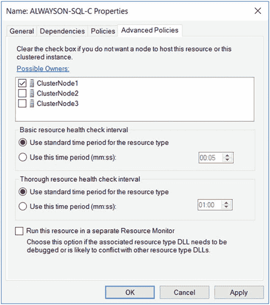

`图 7-2.` 移除可能所有者。

要使用 PowerShell 达到相同效果，我们可以使用 `Get-Resource` cmdlet 导航到名称资源，然后通过管道将其传递给 `Set-ClusterOwnerNode` 来配置可能所有者列表。清单 7-2 展示了这一过程。如果你正在配置多个可能所有者，可能所有者列表应以逗号分隔。

`清单 7-2.` 配置可能所有者
```
Get-ClusterResource "SQL Network Name (ALWAYSON-SQL-C)" | Set-ClusterOwnerNode -Owners clusternode1
```

一旦 50% 的节点作为可能所有者被移除，你就应该对这些节点应用更新。在此半数节点上验证更新后，应重新配置它们，使其再次成为可能所有者。

下一步是将角色转移到你已升级的节点之一。故障转移成功完成后，在将更新应用到另一半节点之前，将它们从首选所有者列表中移除。一旦在此半数节点上验证了更新，你就可以将它们重新添加回可能所有者列表。

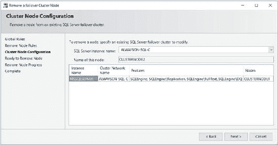

**提示：** 可能所有者只能在资源级别设置。如果你使用 `-Group` 参数对一个角色运行 `Set-ClusterOwnerNode`，那么你配置的是首选所有者，而不是可能所有者。

**注意：** 如果你希望遵循本书后续的演示，请不要遵循此删除集群节点的演示。

### 从集群中移除节点

如果你想卸载 AlwaysOn 故障转移集群实例，则不能像处理独立实例那样从控制面板执行此操作。相反，你必须在集群的每个节点上运行“移除节点向导”。你可以通过在 SQL Server 安装中心的 `维护` 选项卡中选择 `从 SQL Server 故障转移集群中移除节点` 选项来启动此向导。

该向导首先运行全局规则检查，然后是移除节点的规则检查。接着，在如 图 7-3 所示的 `集群节点配置` 页面上，系统会要求你确认要从中移除节点的实例。如果集群托管了多个实例，你可以从下拉框中选择适当的实例。

`图 7-3.` 集群节点配置页面。

在 `准备移除节点` 页面上，系统会提供将执行任务的摘要。确认详细信息后，该实例将被移除。此过程应在所有被动节点上重复，最后在主动节点上执行。当从最后一个节点移除实例时，集群角色也将被移除。

要使用 PowerShell 移除节点，我们需要运行 SQL Server 的 `setup.exe` 应用程序，并将操作参数配置为 `RemoveNode`。当你使用 PowerShell 移除节点时，表 7-1 中的参数是必需的。

`表 7-1.` 从集群中移除节点时的必需参数

| `参数` | `用法` |
| --- | --- |
| `/ACTION` | 必须配置为 `AddNode`。 |
| `/INSTANCENAME` | 你正在添加额外节点以支持的实例。 |
| `/CONFIRMIPDEPENDENCYCHANGE` | 允许为多子网集群指定多个 IP 地址。传入 1 表示 True，传入 0 表示 False。 |


### 管理 AlwaysOn 可用性组

可用性组初始设置完成后，仍需执行管理任务。这些任务包括故障转移可用性组、监控，以及在极少数情况下添加其他侦听器。以下各节将讨论这些主题。

#### 故障转移

如果副本处于同步提交模式并配置为自动故障转移，那么在满足主副本上的错误条件时，可用性组会自动故障转移到冗余副本。然而，有时您会希望手动故障转移可用性组。这可能是由于灾难恢复测试、主动维护，或者需要在主副本或主数据中心故障后启动异步副本。

清单 7-3 中的脚本在从 SQL Server 安装介质的根目录运行时，会从我们的集群中移除一个节点。

**清单 7-3.** 移除节点

```
.\setup.exe /ACTION="RemoveNode" /INSTANCENAME="ALWAYSON-SQL-C" /CONFIRMIPDEPENDENCYCHANGE=0 /qs
```

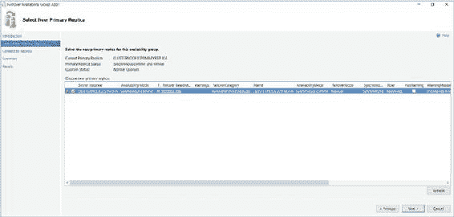

### 同步故障转移

如果您希望故障转移一个处于同步提交模式的副本，请在对象资源管理器中右键单击您的可用性组，从上下文菜单中选择“故障转移”以启动“故障转移可用性组向导”。跳过“简介”页面后，您将看到“选择新的主副本”页面（参见图 7-4）。在此页面上，勾选您希望故障转移到的副本的复选框。但在执行此操作之前，请查看“故障转移准备情况”列，以确保副本已同步且不会发生数据丢失。

**图 7-4.** “选择新的主副本”页面

在图 7-5 所示的“连接到副本”页面上，使用“连接”按钮建立与新主副本的连接。

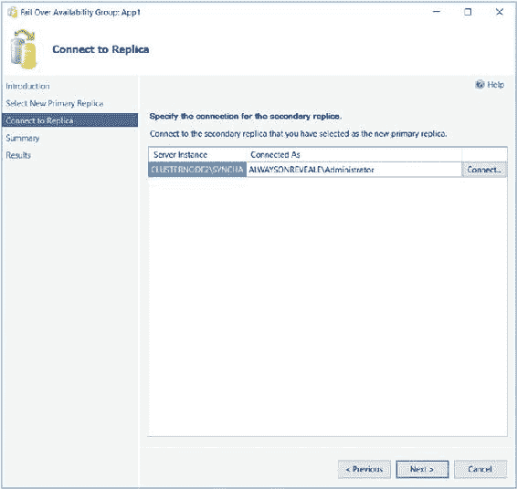

**图 7-5.** “连接到副本”页面

在“摘要”页面上，将显示要执行任务的详细信息，随后在“结果”页面上显示进度指示器。故障转移完成后，请检查所有任务是否成功，并调查收到的任何错误或警告。

我们也可以使用 T-SQL 来故障转移可用性组。清单 7-4 中的命令可达到相同效果。请确保从将成为新主副本的副本上运行此脚本。如果您从当前主副本运行它，请使用 `SQLCMD` 模式并在脚本中连接到新的主副本。

**清单 7-4.** 故障转移可用性组

```sql
ALTER AVAILABILITY GROUP App1 FAILOVER ;
GO
```

#### 异步故障转移

如果您的可用性组处于异步提交模式，那么从技术角度来看，您可以以类似于在同步提交模式下运行的副本的方式进行故障转移，不同之处在于您需要强制故障转移，从而接受数据丢失的风险。您可以使用清单 7-5 中的命令强制故障转移。

您应在将成为新主副本的实例上运行此脚本。为了使其工作，集群必须具有仲裁。如果没有，则需要先强制集群联机，然后再强制可用性组联机。

**清单 7-5.** 强制故障转移

```sql
ALTER AVAILABILITY GROUP App1 FORCE_FAILOVER_ALLOW_DATA_LOSS ;
```

从流程角度来看，您只应在您的主站点完全不可用时才执行此操作。如果情况并非如此，首先应将应用程序置于安全状态。这避免了任何数据丢失的可能性。在生产环境中，我通常通过执行以下步骤来实现：
1.  禁用登录。
2.  将副本的模式更改为同步提交模式。
3.  进行故障转移。
4.  将副本更改回异步提交模式。
5.  启用登录。


你可以使用清单 7-6 中的脚本来执行这些步骤。当从 DR 实例运行时，此脚本会在故障转移之前将 App1 中的数据库置于安全状态，然后重新配置应用程序以使其在正常操作下工作。

#### **清单 7-6.** 使应用程序进入安全状态并执行故障转移

```sql
--DISABLE LOGINS

DECLARE @AOAGDBs TABLE
(
    DBName NVARCHAR(128)
) ;

INSERT INTO @AOAGDBs
SELECT database_name
FROM sys.availability_groups AG
INNER JOIN sys.availability_databases_cluster ADC
    ON AG.group_id = ADC.group_id
WHERE AG.name = 'App1' ;

CHAPTER 7 ■ ADMINISTERING ALWAYSON

DECLARE @Mappings TABLE
(
    LoginName NVARCHAR(128),
    DBname NVARCHAR(128),
    UserName NVARCHAR(128),
    AliasName NVARCHAR(128)
) ;

INSERT INTO @Mappings
EXEC sp_msloginmappings ;

DECLARE @SQL NVARCHAR(MAX)

SELECT DISTINCT @SQL =
(
    SELECT 'ALTER LOGIN [' + LoginName + '] DISABLE; ' AS [data()]
    FROM @Mappings M
    INNER JOIN @AOAGDBs A
        ON M.DBname = A.DBName
    WHERE LoginName <> SUSER_NAME()
    FOR XML PATH ('')
)

EXEC(@SQL)
GO

--SWITCH TO SYNCHRONOUS COMMIT MODE

ALTER AVAILABILITY GROUP App1
MODIFY REPLICA ON N'CLUSTERNODE3\ASYNCDR' WITH (AVAILABILITY_MODE = SYNCHRONOUS_COMMIT) ;
GO

--FAIL OVER

ALTER AVAILABILITY GROUP App1 FAILOVER
GO

--SWITCH BACK TO ASYNCHRONOUS COMMIT MODE

ALTER AVAILABILITY GROUP App1
MODIFY REPLICA ON N'CLUSTERNODE3\ASYNCDR' WITH (AVAILABILITY_MODE = ASYNCHRONOUS_COMMIT) ;
GO

CHAPTER 7 ■ ADMINISTERING ALWAYSON

--ENABLE LOGINS

DECLARE @AOAGDBs TABLE
(
    DBName NVARCHAR(128)
) ;

INSERT INTO @AOAGDBs
SELECT database_name
FROM sys.availability_groups AG
INNER JOIN sys.availability_databases_cluster ADC
    ON AG.group_id = ADC.group_id
WHERE AG.name = 'App1' ;

DECLARE @Mappings TABLE
(
    LoginName NVARCHAR(128),
    DBname NVARCHAR(128),
    Username NVARCHAR(128),
    AliasName NVARCHAR(128)
) ;

INSERT INTO @Mappings
EXEC sp_msloginmappings

DECLARE @SQL NVARCHAR(MAX)

SELECT DISTINCT @SQL =
(
    SELECT 'ALTER LOGIN [' + LoginName + '] ENABLE; ' AS [data()]
    FROM @Mappings M
    INNER JOIN @AOAGDBs A
        ON M.DBname = A.DBName
    WHERE LoginName <> SUSER_NAME()
    FOR XML PATH ('')
) ;

EXEC(@SQL)
```

#### 对分布式可用性组执行故障转移

分布式可用性组不支持自动故障转移；仅支持手动故障转移。当你需要故障转移到分布式可用性组内的辅助可用性组时，应执行以下步骤：

• 将同步模式设置为同步提交
• 等待辅助可用性组变为已同步状态
• 将主可用性组的角色设置为辅助角色
• 强制故障转移

CHAPTER 7 ■ ADMINISTERING ALWAYSON

清单 7-7 中的脚本将为[第 6 章](http://dx.doi.org/10.1007/978-1-4842-2397-0_6)中讨论的分布式可用性组强制执行故障转移。

#### **清单 7-7.** 对分布式可用性组执行故障转移

```sql
--将辅助可用性组设置为同步提交模式

ALTER AVAILABILITY GROUP App2Distributed
MODIFY AVAILABILITY GROUP ON
    'ag1' WITH
    (
        LISTENER_URL = 'tcp://App2_App2Listen:5022',
        AVAILABILITY_MODE = ASYNCHRONOUS_COMMIT,
        FAILOVER_MODE = MANUAL,
        SEEDING_MODE = MANUAL
    ),
    'ag2' WITH
    (
        LISTENER_URL = 'tcp://App2_App2Listen:5022',
        AVAILABILITY_MODE = SYNCHRONOUS_COMMIT,
        FAILOVER_MODE = MANUAL,
        SEEDING_MODE = MANUAL
    );

--等待直到可用性组同步

WHILE (SELECT COUNT(DISTINCT synchronization_state_desc)
       FROM (
            SELECT
                ag.name,
                drs.database_id,
                drs.group_id,
                drs.replica_id,
                drs.synchronization_state_desc,
                drs.end_of_log_lsn
            FROM sys.dm_hadr_database_replica_states drs
            INNER JOIN sys.availability_groups ag
                ON drs.group_id = ag.group_id
            WHERE ag.name = 'App2'
                AND synchronization_state_desc = 'synchronized'
       ) a
) > 1
BEGIN
    WAITFOR DELAY '00:00:05' ;
END

CHAPTER 7 ■ ADMINISTERING ALWAYSON

--将主可用性组的角色设置为辅助角色

ALTER AVAILABILITY GROUP App2Distributed SET (ROLE = SECONDARY) ;

--强制执行故障转移

ALTER AVAILABILITY GROUP App2Distributed FORCE_FAILOVER_ALLOW_DATA_LOSS ;
```

#### 同步非包含对象


## 第七章：管理 ALWAYSON

无论你使用哪种方法进行故障转移，假设可用性组中的所有数据库都未包含用户，那么你需要确保实例级对象已同步。保持实例级对象同步最直接的方法是实现一个 `SSIS` 包，该包被调度为定期运行。

无论你选择调度一个 `SSIS` 包来执行，还是选择不同的方法，例如一个脚本化并在辅助服务器上重新创建对象的 `SQL Server Agent` 作业，以下是你应该考虑同步的对象：

-   登录账户
-   凭据
-   `SQL Server Agent` 作业
-   自定义错误消息
-   链接服务器
-   服务器级事件通知
-   `Master` 数据库中的存储过程
-   服务器级触发器
-   加密密钥和证书

### 添加多个监听器

通常，每个可用性组只有一个可用性组监听器，但在某些罕见情况下，你可能需要为同一个可用性组创建多个监听器。一个可能需要这样做的场景是，如果你有遗留应用程序使用了硬编码的连接字符串。此时，你可以创建一个额外的监听器，其客户端访问点与硬编码连接字符串的名称相匹配。

如本章前面所述，无法通过 `SQL Server Management Studio`、`T-SQL` 甚至 `PowerShell` 创建第二个可用性组监听器。相反，我们必须使用 `故障转移群集管理器`。在此，我们在 `App1` 角色中创建一个新的 `客户端访问点` 资源。为此，我们从 `App1` 角色的上下文菜单中选择 `添加资源`，然后选择 `客户端访问点`。这将调用 `新建资源向导`。向导的 `客户端访问点` 页面如图 7-6 所示。你可以看到我们已输入了客户端访问点的 DNS 名称，并为每个子网指定了一个 IP 地址。

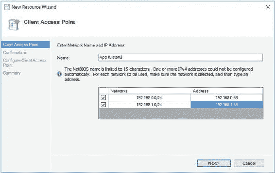

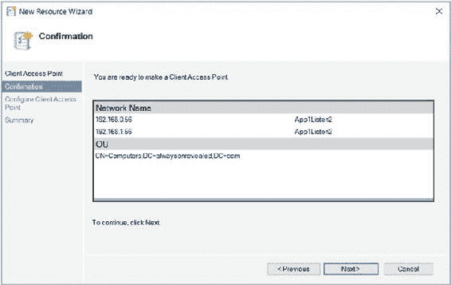

**图 7-6.** 客户端访问点页面

在确认页面上，显示了将执行配置的摘要。在 `配置客户端访问点` 页面上，我们看到一个进度指示器，最后在 `摘要` 页面上显示完成摘要，如图 7-7 所示。

**图 7-7.** 确认页面

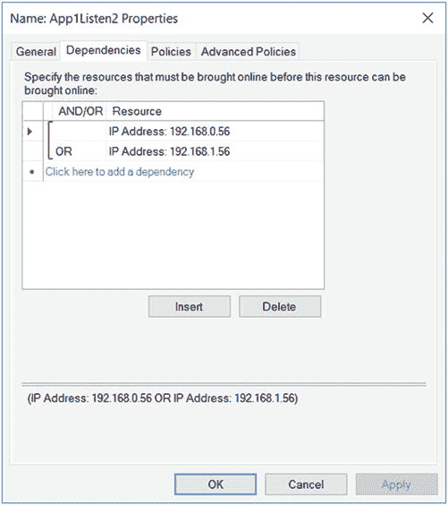

现在我们需要将可用性组资源配置为依赖于新的客户端访问点。为此，我们从 `App1` 资源的上下文菜单中选择 `属性`，然后导航到 `依赖项` 选项卡。在此，我们将新的客户端访问点添加为依赖项，并在两个监听器之间配置一个 `或` 约束，如图 7-8 所示。应用此更改后，客户端就能够使用这两个监听器名称中的任何一个进行连接。

**图 7-8.** 依赖项选项卡

### 其他管理考虑因素

当使用 AlwaysOn 可用性组使数据库具有高可用性时，会施加一些限制。其中最具限制性的一项是数据库不能被置于单用户模式或设置为只读。当你需要将应用程序置于安全状态进行维护时，这可能会产生影响。这就是为什么在本章的“故障转移”部分，我们禁用了映射到数据库用户的登录账户。如果你必须将数据库置于单用户模式，则必须先将其从可用性组中移除。

可以通过运行清单 7-8 中的命令从可用性组中移除数据库。此命令将 `App1Customers` 数据库从可用性组中移除。

**清单 7-8.** 从可用性组中移除数据库

```sql
ALTER DATABASE App1Customers SET HADR OFF ;
```

也可能在某些情况下，你希望一个数据库保持在


### 暂停数据移动与可用性组的可用性配置考量

有时您可能需要暂停可用性组中到其他副本的数据移动。这通常是因为可用性组处于同步提交模式，而您遇到一段高利用率时期，需要提升性能。您可以通过使用清单 7-9 中的命令来暂停某个数据库的数据移动，该命令暂停了 `App1Sales` 数据库的数据移动，随后又恢复了它。

> **注意：** 如果暂停数据移动，主副本上的事务日志会持续增长，并且在数据移动恢复且数据库同步之前，您将无法截断该日志。

**清单 7-9.** 暂停数据移动

```sql
ALTER DATABASE App1Customers SET HADR SUSPEND ;
GO

ALTER DATABASE App1Customers SET HADR RESUME ;
GO
```

### 数据库和日志的文件放置位置

另一个重要的考量是数据库和日志文件的放置。这些文件在每个副本上必须位于相同的位置。这意味着，如果您使用了命名实例，那么更改数据和日志的默认文件位置是一个严格的技术要求，因为默认位置包含实例名称。当然，这假设您没有在每个节点上使用相同的实例名称，否则将违背使用命名实例的许多优势。

### 总结

在主副本发生故障时，故障转移到同步副本是自动进行的。然而，有些情况下您也需要手动进行故障转移。这可能是因为灾难需要故障转移到灾难恢复站点，或者是为了进行主动维护。尽管有可能故障转移到异步副本并存在数据丢失的风险，但最佳实践是先将数据库置于安全状态。由于如果数据库参与可用性组，就无法将其置于只读或单用户模式，因此安全状态通常包括禁用登录，然后在故障转移前切换到同步提交模式。

## 第 7 章 ■ 管理 ALWAYSON

要在整个企业中监控可用性组，您需要使用监控工具，例如系统操作中心。但是，如果您只需要监控少量的可用性组或排查特定问题，可以使用 SQL Server 附带的工具之一，例如用于监控拓扑运行状况的仪表板，以及一个名为 `AlwaysOn Health Trace` 的扩展事件会话。

为 SQL Server 实现高可用性的一个好处是，它可以在计划维护期间最大限度地减少停机时间。在双节点集群上，您可以升级被动节点，进行故障转移，然后再升级主动节点。对于更大的集群，您可以执行滚动补丁升级，这包括从可能的所有者列表中移除一半的节点并对其进行升级。然后，您将实例故障转移到其中一个已升级的节点，并对剩余节点重复此过程。这减轻了可能所有者之间混合版本的风险。

