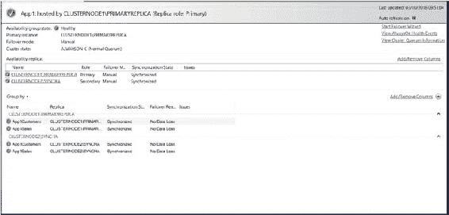
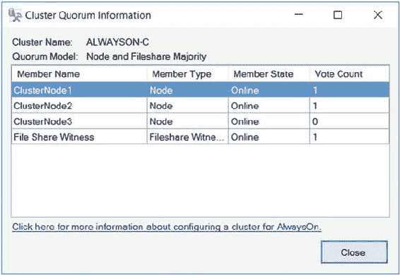
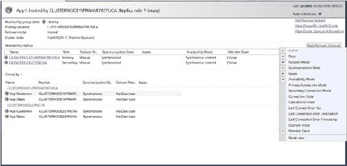
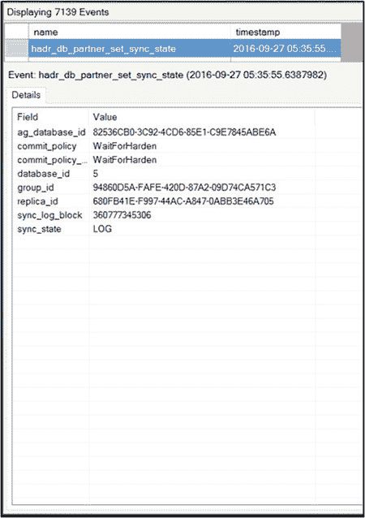
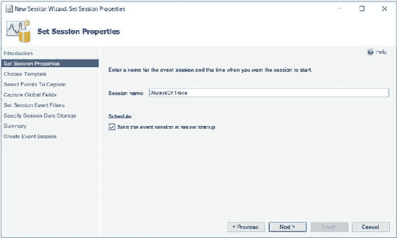
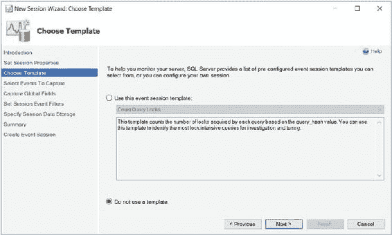
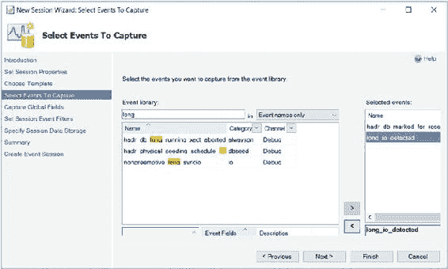
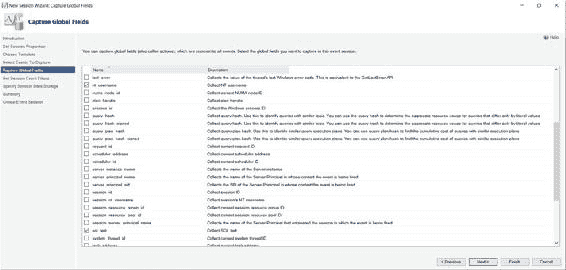
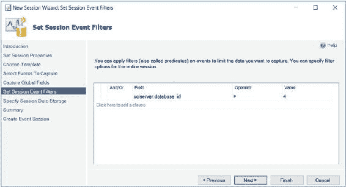
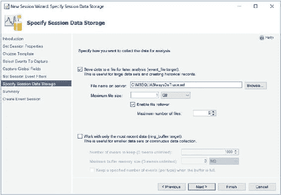

# 第 8 章

## 监控 ALWAYSON 可用性组

在实现了可用性组之后，您需要监控它们并响应任何可能影响数据可用性的错误或警告。如果您在企业中实现了许多可用性组，那么唯一有效且全面监控它们的方法是使用企业监控工具，例如 `SOC`（系统操作中心）。但是，如果您的可用性组数量不多，或者正在排查特定问题，SQL Server 提供了 `AlwaysOn Dashboard` 和 `AlwaysOn Health Trace`。您也可以创建自己的扩展事件会话来监控可用性组。本章将讨论这些监控可能性中的每一种。

### ALWAYSON 仪表板

`AlwaysOn Dashboard` 是一份交互式报告，允许您查看 AlwaysOn 环境的运行状况，并深入查看或汇总拓扑中的元素。您可以从“可用性组”文件夹的上下文菜单中调用该报告。


## 第 8 章：监控 AlwaysOn 可用性组

对象资源管理器，或从可用性组本身的上下文菜单中。图 8-1 展示了从 App1 可用性组的上下文菜单生成的报告。

你可以看到当前，两个副本的同步都处于健康状态。

© Peter A. Carter 2016

P. A. Carter, *SQL Server AlwaysOn Revealed*, DOI 10.1007/978-1-4842-2397-0_8



**图 8-1. 可用性组仪表板**

数据库可能处于的三种同步状态是 `SYNCHRONIZED`、`SYNCHRONIZING` 和 `NOT SYNCHRONIZING`。同步副本应处于 `SYNCHRONIZED` 状态，任何其他状态都是不健康的。然而，异步副本永远不会处于 `SYNCHRONIZED` 状态，`SYNCHRONIZING` 状态被认为是健康的。无论何种模式，`NOT SYNCHRONIZING` 都表示副本未连接。

> **注意** 除了同步状态，副本还具有以下操作状态之一：`PENDING_FAILOVER`、`PENDING`、`ONLINE`、`OFFLINE`、`FAILED`、`FAILED_NO_QUORUM` 和 `NULL`（当副本断开连接时）。可以使用 `sys.dm_hadr_availability_replica_states` DMV 查看副本的操作状态。

在报告的右上角，有指向故障转移向导（我们在本章前面讨论过）、AlwaysOn 还有健康事件（我们将在下一节讨论）的链接，以及一个查看集群仲裁信息的链接。通过此链接调用的集群仲裁信息屏幕显示在图 8-2 中。





**图 8-2. 集群仲裁信息屏幕**

“添加/删除列”链接将显示一个上下文菜单，你可以在其中动态地向显示中添加或删除列。图 8-3 显示已添加了“可用性模式”和“成员状态”。

**图 8-3. 添加/删除列**

你还可以在“可用性副本”窗口中深入查看每个副本以查看特定于副本的详细信息。“分组依据”按钮允许你按副本、数据库、同步状态、故障转移准备情况或问题对可用性数据库进行分组。



### AlwaysOn 健康追踪

AlwaysOn 健康追踪是一个 Extended Events 会话，它在你创建第一个可用性组时创建。它可以在 SQL Server Management Studio 的 Extended Events | Sessions 下找到，通过其上下文菜单，你可以查看正在捕获的实时数据，或者可以进入会话的属性以更改捕获事件的配置。也可以通过 AlwaysOn 仪表板中的“查看 AlwaysOn 健康事件”链接访问。

深入查看该会话会显示其包，从包的上下文菜单中，你可以查看先前捕获的事件。图 8-4 显示最新捕获的事件是数据库 5（在我们的例子中是 `App1Customers`）正在等待日志在同步副本上被固化。

**图 8-4. 目标数据**

在窗口顶部窗格中右键单击列标题将显示一个上下文菜单，该菜单允许你在特定列中搜索文本或值、按列中的值对结果进行分组，或按特定列对结果集进行排序。你还可以使用上下文菜单向结果集添加或删除列。

### 使用 Extended Events 监控 AlwaysOn

Extended Events 是 SQL Server 中的一个轻量级监控系统，它使用 WMI 捕获事件。由于其架构使用的系统资源非常少，它们可伸缩性很好，并允许你在对用户活动影响最小的情况下监控实例。它们还具有高度可配置性，为你提供了从…捕获详细信息的广泛选项。


#### 扩展事件概念

扩展事件拥有丰富的架构，由事件、目标、动作、谓词、类型、映射和会话组成。这些对象存储在包中，而包又存储在模块中，模块可以是 `.dll` 文件或可执行文件。我们将在后续章节中讨论这些概念。

扩展事件可以追踪从极细粒度（如页面拆分）到较粗粒度（如 `CPU` 利用率）的信息。您还可以将扩展事件与操作系统数据关联起来，以便在排查问题时提供整体视图。扩展事件的前身是一个基于 T-SQL 的工具，称为 `SQL Trace`，及其图形界面工具 `Profiler`。

#### 包

包是扩展事件中所用对象的容器。以下是四种 `SQL Server` 包类型：

-   `Package0`：默认包，用于扩展事件系统对象。
-   `Sqlserver`：用于与 `SQL Server` 相关的对象。
-   `Sqlos`：用于与 `SQLOS` 相关的对象。
-   `SecAudit`：由 `SQL Audit` 使用；但其对象不对外公开。

#### 事件

事件是您可以追踪的、感兴趣的某个发生情况。它可以是 `SQL` 批处理完成、缓存未命中、页面拆分，或者根据您所配置追踪的性质，几乎任何可能在数据库引擎内部发生的事情。每个事件按 `通道` 和 `关键字`（也称为 `类别`）进行分类。`通道` 是高级别的分类，在 `SQL Server 2016` 中，所有事件都属于表 8-1 所述的通道之一。

##### 表 8-1. 通道

| **通道**      | **描述**                                                                                                                                                           |
| :------------ | :----------------------------------------------------------------------------------------------------------------------------------------------------------------- |
| `Admin`       | 众所周知的事件及有明确解决方案的事件。例如：死锁、服务器启动、`CPU` 阈值被超过以及使用已弃用的功能。                                                               |
| `Operational` | 用于排查问题。例如：检测到坏内存、`AlwaysOn 可用性组` 副本更改其状态、检测到长时间 `IO` 等，这些事件都属于 `Operational` 通道。                                      |
| `Analytic`    | 可用于排查性能等问题的大批量事件。例如：事务开始、获取锁、文件读取完成等，这些事件都属于 `Analytic` 通道。                                                          |
| `Debug`       | 供开发人员通过返回内部数据来诊断问题。`Debug` 通道中的事件在 `SQL Server` 的未来版本中可能会发生更改，因此应尽可能避免使用。                                         |

`关键字`（或 `类别`）则更为细粒度。所有与 `AlwaysOn` 相关的事件都属于 `AlwaysOn` 和 `HARD` 类别。`SQL Server` 公开了 122 个与 `AlwaysOn` 相关的事件。这些事件列于表 8-2 中。

##### 表 8-2. AlwaysOn 事件

| **事件**                            | **描述**                                       |
| :---------------------------------- | :--------------------------------------------- |
| `hadr_ddl_failover_execution_state` | 当 `DDL` 命令更改 `可用性组` 故障转移状态时引发 |
| `hadr_transport_dump_message`       | 追踪贯穿系统的 `HADR` 传输消息                 |
| `hadr_transport_dump_config_message`| 追踪 `HADR` 配置消息                           |
| `hadr_transport_dump_failure_message` | 追踪 `HADR` 故障消息                         |
| `hadr_transport_dump_preconfig_message` | 追踪 `HADR` 预配置消息                      |
| `hadr_transport_dump_dropped_message` | 追踪贯穿系统的被丢弃的 `HADR` 传输消息       |
| `hadr_transport_session_state`      | 当 `HADR` 传输会话状态更改时引发               |
| `hadr_transport_configuration_state` | 当会话状态更改时引发                         |
| `hadr_transport_ucs_registration`   | 当 `UCS` 注册状态更改时引发                    |
| `hadr_transport_ucs_connection_info` | 当与 `AlwaysOn` 传输副本关联的 `USC` 连接 `ID` 被注册或更改时引发 |
| `hadr_transport_flow_control_action` | 当特定副本发生流控制操作时引发               |
| `hadr_database_flow_control_action` | 当特定副本发生流控制操作时引发               |
| `hadr_db_manager_state`             | 当 `db_manager` 状态更改时引发                 |
| `hadr_db_manager_lsn_sync_msg`      | 追踪日志序列号                               |


#### 同步消息

`hadr_db_manager_establish_db_msg`
当数据库消息建立时引发

`hadr_db_manager_status_change`
跟踪 `DBReplicaStatusChange` 消息

`hadr_db_manager_redo`
在辅助副本上跟踪重做处理

`hadr_db_manager_undo`
在辅助副本上跟踪撤销处理

`hadr_db_manager_db_queue_restart`
响应队列重启而触发

`hadr_db_manager_db_startdb`
响应启动 Hadron 数据库而触发

`hadr_db_manager_db_shutdown`
响应关闭 Hadron 数据库而触发

`hadr_db_manager_user_control`
响应 AlwaysOn 受控数据库的用户状态变更而触发

`hadr_db_manager_redo_control`
跟踪 AlwaysOn 受控数据库的更改日志扫描状态

`hadr_db_manager_scan_control`
跟踪 AlwaysOn 受控数据库的更改日志扫描状态

`hadr_db_manager_suspend_resume`
响应 AlwaysOn 受控数据库的挂起/恢复状态变更而触发

`hadr_db_manager_db_restart`
响应 AlwaysOn 受控数据库的重启而触发

`hadr_worker_pool_thread`
跟踪 AlwaysOn 工作池线程动作

`hadr_worker_pool_task`
跟踪 AlwaysOn 工作池任务动作

`hadr_thread_pool_worker_start`
跟踪 AlwaysOn 线程池工作线程的启动动作

（续）

## 第 8 章 ■ 监控 AlwaysOn 可用性组

##### 表 8-2. （续）

| 事件 | 描述 |
| :--- | :--- |
| `hadr_db_manager_page_request` | 跟踪服务器之间的页请求/响应 |
| `hadr_db_commit_mgr_update_harden` | 响应 AlwaysOn 受控数据库的已固化日志序列号更新而触发 |
| `hadr_db_commit_mgr_harden_still_waiting` | 跟踪事务提交固化，仍在等待 AlwaysOn 提交管理 |
| `hadr_db_commit_mgr_harden` | 跟踪来自 AlwaysOn 提交管理的事务提交固化结果 |
| `hadr_db_commit_mgr_set_policy` | 响应事务提交管理器策略更新而触发 |
| `hadr_db_partner_set_policy` | 响应 AlwaysOn 伙伴提交策略更新而触发 |
| `hadr_db_partner_set_sync_state` | 响应 AlwaysOn 伙伴同步状态变更而触发 |
| `hadr_apr_added_corrupted_page` | 当自动页修复添加了一个损坏页时触发 |
| `hadr_apr_repaired_page` | 当自动页修复修复了一个损坏页时触发 |
| `hadr_apr_skipped_page_repair` | 当自动页修复跳过了一次页修复时触发 |
| `hadr_apr_failed_page_repair` | 当自动页修复添加了一个损坏页时触发 |
| `hadr_apr_sent_repair_request_for_page` | 当自动页修复发送了一个页修复请求时触发 |
| `hadr_apr_received_page_repair_request` | 当自动页修复接收到了一个页修复请求时触发 |
| `hadr_apr_deffering_page_repair_request` | 当自动页修复正在延迟页修复请求时触发 |
| `hadr_apr_page_repair_failed` | 当自动页修复未能修复页时触发 |
| `hadr_undo_of_redo_log_scan` | 跟踪在重做的撤销过程中扫描的日志量，以及需要扫描的总日志量 |
| `hadr_db_manager_filemetadata_request` | 响应服务器之间的文件元数据请求/响应而触发 |

（续）

## 第 8 章 ■ 监控 AlwaysOn 可用性组

##### 表 8-2. （续）

| 事件 | 描述 |
| :--- | :--- |
| `hadr_capture_compressed_log_cache` | 跟踪压缩日志块缓存的命中/未命中率 |
| `hadr_db_manager_backup_sync_msg` | 响应备份同步消息而触发 |
| `hadr_db_manager_backup_info_msg` | 响应备份信息消息而触发 |
| `hadr_db_manager_primary_replica_file_list_msg` | 响应主副本文件列表消息而触发 |
| `hadr_db_manager_seeding_request_msg` | 响应种子设定请求消息而触发 |
| `hadr_physical_seeding_backup_state_change` | 响应物理种子设定（备份端）的状态变更而触发 |
| `hadr_physical_seeding_restore_state_change` | 响应物理种子设定（还原端）的状态变更而触发 |
| `hadr_physical_seeding_forwarder_state_change` | 响应物理种子设定（转发器端）的状态变更而触发 |
| `hadr_physical_seeding_forwarder_target_state_change` | 响应物理种子设定（转发器目标端）的状态变更而触发 |


### HADR 事件

#### HADR 物理播种事件

`hadr_physical_seeding_submit_callback`
响应物理播种提交回调而触发。

`hadr_physical_seeding_failure`
响应物理播种失败而触发。

`hadr_physical_seeding_progress`
响应物理播种进度而触发。

`hadr_physical_seeding_schedule_long_task_failure`
响应物理播种调度长任务失败而触发。

#### HADR 自动播种事件

`hadr_automatic_seeding_start`
当自动播种操作被提交时触发。

`hadr_automatic_seeding_state_transition`
当自动播种操作状态改变时触发。

`hadr_automatic_seeding_success`
当自动播种操作成功时触发。

`hadr_automatic_seeding_failure`
当自动播种操作失败时触发。

`hadr_automatic_seeding_timeout`
当自动播种操作超时时触发。

---

##### 表 8-2. （续）

| 事件 | 描述 |
| :--- | :--- |
| `hadr_filestream_file_open` | 当 AlwaysOn FileStream 传输打开一个文件时触发。 |
| `hadr_filestream_file_close` | 当 AlwaysOn FileStream 传输关闭一个文件时触发。 |
| `hadr_filestream_log_interpreter` | 当 AlwaysOn FileStream 传输在解释日志时发现相关日志记录时触发。 |
| `hadr_filestream_processed_block` | 当 AlwaysOn FileStream 传输完成处理一个日志块时触发。 |
| `hadr_filestream_directory_create` | 当 AlwaysOn FileStream 传输创建一个目录时触发。 |
| `hadr_filestream_corrupt_message` | 当 AlwaysOn FileStream 传输检测到消息损坏时触发。 |
| `hadr_filestream_message_block_end` | 当 AlwaysOn FileStream 传输跟踪到一个块结束消息时触发。 |
| `hadr_filestream_message_dir_create` | 当 AlwaysOn FileStream 传输跟踪到一个目录创建消息时触发。 |
| `hadr_filestream_message_file_write` | 当 AlwaysOn FileStream 传输跟踪到一个文件写入消息时触发。 |
| `hadr_filestream_file_flush` | 当 AlwaysOn FileStream 传输刷新一个文件时触发。 |
| `hadr_filestream_file_set_eof` | 当 AlwaysOn FileStream 传输设置一个文件的结尾时触发。 |
| `hadr_filestream_undo_inplace_update` | 当 AlwaysOn FileStream 传输检测到需要撤销的就地更新时触发。 |
| `hadr_filestream_message_file_request` | 当 HADR FileStream 传输跟踪到一个文件写入消息时触发。 |
| `hadr_wsfc_change_notifier_status` | 当 Windows Server 故障转移群集变更通知程序状态改变时触发。 |
| `hadr_wsfc_change_notifier_start_ag_specific_notifications` | 当 Windows Server 故障转移群集变更通知程序开始接收可用性组特定通知时触发。 |
| `hadr_wsfc_change_notifier_severe_error` | 当 Windows Server 故障转移群集变更通知程序遇到严重错误并将终止时触发。 |

---

##### 表 8-2. （续）

| 事件 | 描述 |
| :--- | :--- |
| `hadr_tds_synchronizer_payload_skip` | 当 AlwaysOn TDS 监听器同步器跳过一个侦听器有效负载时触发，因为自上一个有效负载以来没有变化。 |
| `hadr_sql_instance_to_node_map_entry_deleted` | 在删除 SQL Server 实例到群集节点映射条目的 API 调用结束时触发。 |
| `hadr_wsfc_change_notifier_node_not_online` | 当 Windows Server 故障转移群集变更通知程序检测到本地群集节点不在线时触发。 |
| `hadr_online_availability_group_first_attempt_failure` | 如果首次尝试使 AlwaysOn 可用性组资源联机失败则触发。 |
| `hadr_online_availability_group_retry_end` | 当 SQL Server 已用尽所有重试尝试，或 Windows Server 故障转移群集已接受使 AlwaysOn 可用性组资源联机的命令时触发。 |
| `hadr_ar_api_call` | 当对可用性副本进行 API 调用时触发。 |
| `hadr_ar_manager_starting` | 当可用性组副本管理器正在启动时触发。 |
| `hadr_ag_wsfc_resource_state` | 响应 Windows Server 故障转移群集中可用性组的状态更改而触发。 |
| `hadr_ag_database_api_call` | 响应对可用性组数据库副本的 API 调用而触发。 |
| `hadr_ag_lease_renewal` | 响应可用性组租约续订而触发。 |
| `hadr_ar_manager_mutex_acquisition_state` | |


## 第 8 章 ■ 监控 AlwaysOn 可用性组

### 表 8-2

**事件** | **描述**
---|---
`hadr_ar_critical_section_entry_state` | 当响应可用性副本临界区（critical section）的进入状态时触发
`hadr_ag_config_data_mutex_acquisition_` | 当响应可用性组互斥锁（mutex）获取状态时触发
`hadr_database_replica_disjoin_completion` | 当数据库副本已完全从可用性组中脱离时触发
`hadr_ar_controller_debug` | 当副本控制器输出调试信息时触发
`hadr_apply_log_block` | 当辅助副本即将向日志管理器追加一个日志块时触发
`hadr_capture_log_block` | 当主副本捕获到一个日志块时触发
`hadr_capture_vlfheader` | 当主副本捕获到一个启动新虚拟日志文件的日志块时触发
`hadr_apply_vlfheader` | 当辅助副本即将应用虚拟日志文件头时触发
`hadr_scan_state` | 当主数据库或辅助数据库副本改变状态时触发
`hadr_dump_log_block` | 当主副本发送或辅助副本接收一个日志块消息时触发
`hadr_log_block_send_complete` | 当日志块消息发送完成后触发
`hadr_dump_vlf_header` | 当主副本发送或辅助副本接收一个 VLF 头消息时触发
`hadr_dump_log_progress` | 当辅助副本发送一个进度消息时触发
`hadr_dump_primary_progress` | 当主副本发送进度消息时触发
`hadr_dump_sync_primary_progress` | 当同步辅助副本发送进度消息时触发
`hadr_send_harden_lsn_message` | 不应使用此事件；它用于 Microsoft 内部测试
`hadr_evaluate_readonly_routing_info` | 当在本地主数据库副本上评估只读路由信息时触发
`hadr_db_log_throttle` | 当数据库日志生成节流值发生变化时触发
`hadr_db_log_throttle_input` | 当 Fabric 日志管理组件更新日志节流值时触发
`hadr_db_marked_for_reseed` | 当辅助数据库落后主数据库过多并被标记为需重新种子设定时触发
`hadr_db_log_management_configuration_parameters` | 当读取自动日志管理配置时发生。
`hadr_db_long_running_xact_aborted` | 当系统强制终止一个长时间运行的事务以避免日志变满时触发
`hadr_db_remote_harden_failure` | 当属于提交或准备过程的硬化请求因远程故障而失败时触发
`hadr_partner_log_send_transition` | 当响应日志写入器与日志捕获器之间的日志发送转换时触发
`hadr_partner_restart_scan` | 当副本在重启时扫描其伙伴时触发
`hadr_transport_sync_send_failure` | 当传输中的同步发送失败时触发
`hadr_xrf_deleteAllXrf_beforeEntry` | 当即将删除所有扩展恢复 fork 时触发
`hadr_xrf_deleteRecLsn_beforeEntry` | 当即将从元数据中删除恢复日志序列号（LSN）时触发
`hadr_xrf_updateXrf_partialUpdate` | 当更新辅助副本的恢复 fork 栈时触发；具体在删除辅助栈中的多余条目之后，但从主副本复制新条目之前触发
`hadr_xrf_updateXrf_before_recoveryLsn_update` | 当更新辅助副本的恢复 fork 栈时触发；具体在更新栈之后，但在将恢复日志序列号（LSN）保存到元数据之前触发
`hadr_xrf_copyXrf_partialCopy` | 当删除辅助副本的栈条目之后，但在从主副本复制条目之前触发
`alwayson_ddl_executed` | 当执行 AlwaysOn DDL 语句时触发
`availability_replica_state` | 当可用性副本正在启动或关闭时触发
`availability_replica_state_change` | 当可用性副本的状态发生变化时触发
`availability_replica_manager_state_` | (源文本中缺少描述)


## 第 8 章 ■ 监控 ALWAYSON 可用性组

### 事件描述

当可用性副本管理器的状态发生更改时触发

`availability_group_lease_expired`
当集群与可用性组之间出现连接问题导致未能续订租约时触发

`availability_replica_automatic_failover_validation`
当故障转移验证副本作为主副本的准备状态时触发

`availability_replica_database_fault_reporting`
当数据库向可用性副本管理器报告故障时触发

`before_redo_lsn_update`
在更新末尾日志序列号（EOL LSN）之前立即触发

`read_only_route_complete`
当只读路由操作成功完成时触发

`read_only_route_fail`
当只读路由操作失败时触发

### 目标

目标是事件的消费者；本质上，它是跟踪数据将写入的设备。SQL Server 2016 中可用的目标详见表 8-3。

**表 8-3.** 目标

| 目标 | 同步/异步 | 描述 |
| :--- | :--- | :--- |
| `事件计数器` | 同步 | 统计会话期间发生的事件数量 |
| `事件文件` | 异步 | 将事件输出写入内存缓冲区，然后刷新到磁盘 |
| `事件配对` | 异步 | 确定配对事件是否在没有匹配事件的情况下发生，例如，语句开始但从未完成 |
| `ETW (Windows 事件跟踪)` | 同步 | 用于将扩展事件与操作系统数据关联 |
| `直方图` | 异步 | 基于操作或事件列，统计会话期间发生的事件数量 |
| `环形缓冲区` | 异步 | 使用`先进先出（FIFO）`方法将数据存储在内存缓冲区中 |

### 操作

操作也称为`全局字段`，是允许在事件触发时捕获附加信息的命令。操作在事件发生时同步触发，事件本身并不知晓该操作。有 50 种可用操作，可让您捕获丰富的信息，包括触发事件的语句、语句运行的安全上下文、事务 ID、CPU ID 和调用堆栈。

### 谓词

谓词是您可以在系统将事件发送到目标之前应用的筛选条件。可以创建简单的谓词，例如根据数据库 ID 筛选完成的语句，但也可以创建更复杂的谓词，例如仅当 AlwaysOn 可用性组副本的角色更改发生超过两次时才捕获。

谓词也完全支持短路求值。这意味着如果您在谓词中使用多个条件，那么谓词的顺序很重要，因为如果第一个谓词的求值失败，第二个谓词将不会被求值。由于谓词是同步求值的，这可能会影响性能。因此，明智的做法是设计您的谓词，将最不可能求值为真的谓词放在非常可能求值为真的谓词之前。

例如，假设您计划筛选特定数据库（数据库 ID 为`6`），但该数据库在实例活动中占比很高。您还计划筛选特定用户 ID（`UserA`），该用户负责的活动占比很低。在此场景中，您将使用以下谓词先筛选出与`UserA`无关的活动，然后再筛选出与数据库 ID`6`无关的活动：

```
WHERE (([sqlserver].[username]='UserA') AND ([sqlserver].[database_id]=(6)))
```

### 类型

包中的所有对象都被分配一个类型。此类型用于解释存储在对象字节集合中的数据。对象被分配以下类型之一：

*   `操作`
*   `事件`
*   `Pred_compare`（从事件中检索数据）
*   `Pred_source`（比较数据类型）
*   `目标`
*   `类型`

### 映射


一个映射（map）是一个字典，它将内部 ID 值映射为数据库管理员（DBA）可以理解的字符串。

`Map keys`仅在其所属上下文中是唯一的，在不同上下文之间会被重复使用。例如，在 `statement_recompile_cause` 上下文中，`map_key`为 1 对应于`map_value`“模式已更改”（Schema Changed）。然而，在`database_sql_statement type`上下文中，`map_key`为 1 却对应于`map_value`“CREATE DATABASE”。你可以使用`sys.dm_xe_map_values DMV`查找完整的映射列表。

### 会话（Sessions）

一个会话本质上是一个跟踪（trace）。它可以包含来自多个包（package）、动作（action）、目标（target）和谓词（predicate）的事件。当你启动或停止一个会话时，就是在打开或关闭这个跟踪。当会话启动时，事件会被写入内存缓冲区，并在发送到目标之前应用谓词。因此，在创建会话时，你需要配置一些属性，例如会话可用于缓冲的内存量、当会话遇到内存压力时可以丢弃哪些事件，以及事件发送到目标之前的最大延迟。



## 第 8 章 ■ 监控 ALWAYSON 可用性组

### 创建事件会话以监控可用性组

你可以使用`新建会话向导`（New Session Wizard）、`新建会话对话框`（New Session Dialog Box）或通过 TSQL 来创建事件会话。要使用`新建会话向导`创建会话，请在对象资源管理器中依次展开 `管理 | 扩展事件`，然后从`会话`的上下文菜单中选择`新建会话向导`。这将显示`新建会话向导`的介绍页面。

通过介绍页面后，你将看到`设置会话属性页面`，如图 8-5 所示。在这里，你可以为`会话`配置一个名称，并指定`会话`是否应在创建时自动启动。

`图 8-5. 设置属性页面`

在向导的`选择模板`页面上，如图 8-6 所示，你可以选择一个预定义的模板（这将为你提供常用会话的起点），或者从空白画布开始手动定义整个会话。我们将选择后者。



## 第 8 章 ■ 监控 ALWAYSON 可用性组

`图 8-6. 选择模板页面`

图 8-7 显示了`选择要捕获的事件页面`。在这里，我们可以选择希望在会话中包含哪些事件。出于本次演示的目的，假设我们经常看到辅助副本落后于主副本，并且我们正试图确定原因。具体来说，我们是否存在 I/O 瓶颈？因为我们试图回答一个非常具体的问题，所以选择要捕获的事件就很明确了。我们需要`hadr_db_marked_for_reseed`事件来确定辅助副本何时落后，以及`long_io_detected`事件，以便我们可以关联时间点并查看是否存在某种模式。




## 第 8 章 ■ 监控 ALWAYSON 可用性组

`图 8-7. 选择要捕获的事件页面`

`捕获全局字段页面`允许我们指定希望捕获的任何动作（Action）。在我们的场景中，我们将捕获`NT 用户名`和`SQL 文本`动作。这将使我们能够追溯任何长时间 I/O 操作，以查看它们是否是由低效查询引起的。`捕获全局字段页面`如图 8-8 所示。

`图 8-8. 捕获全局字段页面`



## 第 8 章 ■ 监控 ALWAYSON 可用性组

`设置会话事件筛选器页面`，如图 8-9 所示，允许你为`会话`配置谓词（Predicate）。我们将配置一个筛选对系统数据库操作的谓词。

`图 8-9. 设置会话事件筛选器页面`

向导的`指定会话数据存储页面`是我们可以配置目标（Target）的地方。该向导提供了文件目标或环形缓冲区目标的选择，以及...


## 第 8 章 ■ 监控 AlwaysOn 可用性组

指定大小和回滚选项的功能。我们将配置一个文件目标，如图 8-10 所示。



#### 图 8-10. 指定会话数据存储

向导的摘要页面将确认向导将执行的操作。会话创建后，完成页面将提供退出时观看实时数据的选项。若要使用 T-SQL 创建相同的会话，您可以使用清单 8-1.中的脚本。

#### 清单 8-1. 创建事件会话

```
CREATE EVENT SESSION AlwaysOnTrace ON SERVER
ADD EVENT sqlserver.hadr_db_marked_for_reseed(
    ACTION(sqlserver.nt_username,sqlserver.sql_text)
    WHERE (sqlserver.database_id>(4))),
ADD EVENT sqlserver.long_io_detected(
    ACTION(sqlserver.nt_username,sqlserver.sql_text)
    WHERE (sqlserver.database_id>(4)))
ADD TARGET package0.event_file(SET filename='C:\MSSQL\ASlwaysOnTrace.xel')
WITH (MAX_MEMORY=4096 KB,EVENT_RETENTION_MODE=ALLOW_SINGLE_EVENT_LOSS,MAX_DISPATCH_LATENCY=30 SECONDS,MAX_EVENT_SIZE=0 KB,MEMORY_PARTITION_MODE=NONE,TRACK_CAUSALITY=OFF,STARTUP_STATE=ON) ;
```

`CREATE EVENT SESSION` DDL 语句接受的参数详见表 8-4.。

#### 表 8-4. CREATE EVENT SESSION 参数

| 参数 | 说明 |
|----------|-------------|
| `event_session_name` | 指定您正在创建的事件会话的名称 |
| `ADD EVENT \| SET` | 为添加到会话的每个事件重复此部分，后跟事件名称，格式为 `package.event`；您可以使用 `SET` 语句设置特定于事件的自定义项，例如包含非强制事件字段 |
| `ACTION` | 如果该事件需要捕获全局字段，则在每个 `ADD EVENT` 参数后指定 |
| `WHERE` | 如果该事件需要关联谓词，则在每个 `ADD EVENT` 参数后指定 |
| `ADD TARGET \| SET` | 为将添加到会话的每个目标指定；您可以使用 `SET` 语句来填充特定于目标的参数，例如 `event_file` 目标的 `filename` 参数 |

`CREATE EVENT SESSION` 语句还接受多个 `WITH` 选项，详见表 8-5.。

#### 表 8-5. CREATE EVENT SESSION WITH 选项

| WITH 选项 | 说明 |
|-------------|-------------|
| `MAX_MEMORY` | 指定事件会话在将事件分派到目标之前可用于缓冲事件的最大内存量 |
| `EVENT_RETENTION_MODE` | 指定如果缓冲区已满时的行为：可接受的值为 `ALLOW_SINGLE_EVENT_LOSS`，表示如果所有缓冲区都已满，则可以丢失单个事件；`ALLOW_MULTIPLE_EVENT_LOSS`，表示如果所有缓冲区都已满，则可以丢失整个缓冲区；以及 `NO_EVENT_LOSS`，表示导致事件触发的任务将等待，直到缓冲区中有空间 |
| `MAX_DISPATCH_LATENCY` | 指定事件在会话缓冲区中驻留的最大时间（以秒为单位），之后将被刷新到目标 |
| `MAX_EVENT_SIZE` | 指定来自任何单个事件的事件数据的最大可能大小；可以千字节或兆字节为单位指定，并且应仅配置为允许大于 `MAX_MEMORY` 设置的事件 |
| `MEMORY_PARTITION_MODE` | 指定在何处创建事件缓冲区；可接受的值如下：`NONE` - 表示将在实例内创建缓冲区；`PER_NODE` - 表示将为每个 NUMA 节点创建缓冲区；`PER_CPU` - 表示将为每个 CPU 创建缓冲区 |
| `TRACK_CAUSALITY` | 指定将为每个事件存储一个额外的 GUID 和序列号，以便可以关联事件 |
| `STARTUP_STATE` | 指定会话是否在实例启动时自动启动；`ON` 表示是；`OFF` 表示否 |


**提示** 关于扩展事件的深入讨论，我强烈推荐 Apress 出版的《Pro SQL Server Administration》一书，可以从[www.apress.com/9781484207116](http://www.apress.com/9781484207116)购买。

### 总结

SQL Server 提供了丰富的工具来监控 AlwaysOn 可用性组的健康状况。

AlwaysOn 仪表板是 SQL Server Management Studio 中的一个交互式报告，它允许您评估可用性组和副本的健康状况。它还提供了查看仲裁配置信息和实时健康数据的链接。

实时健康数据由一个扩展事件会话捕获，该会话在您在实例上创建第一个可用性组时创建，并在后台运行，捕获预先配置的事件。可以自定义此跟踪；如果您需要自定义捕获，我建议保留其默认配置并创建一个新的事件会话。

创建事件会话允许您捕获非常细粒度的关注点，或者仅仅是较粗粒度的信息，这取决于您的需求。扩展事件使用 WMI 实现，是一个非常轻量级的框架，这意味着您可以在不影响实例性能的情况下识别问题和趋势。

