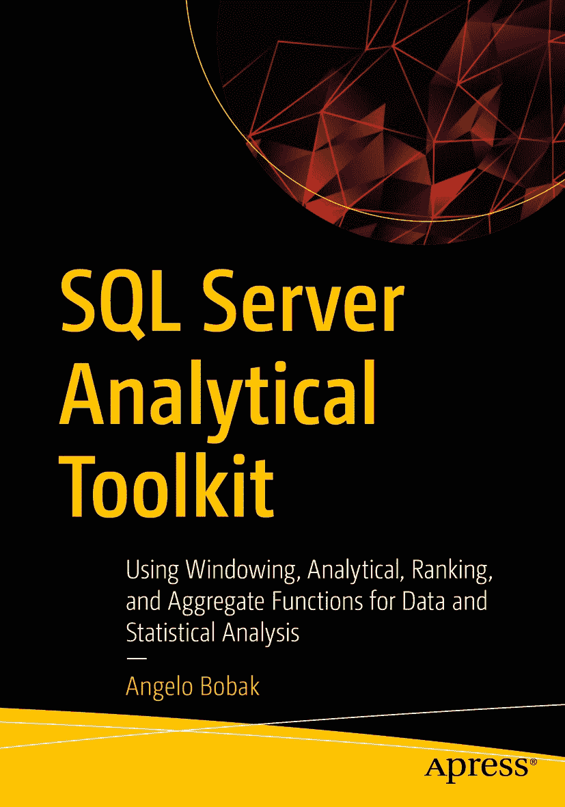

ISBN 978-1-4842-8666-1 e-ISBN 978-1-4842-8667-8 [`doi.org/10.1007/978-1-4842-8667-8`](https://doi.org/10.1007/978-1-4842-8667-8) © Angelo Bobak 2023 本作品受版权保护。无论涉及材料的整体还是部分，特别是翻译、转载、图表的再利用、朗诵、广播、缩微胶片或其他任何物理方式进行的复制，以及信息存储与检索、电子改编、计算机软件，或目前已知或未来开发的任何类似或相异的方法论，所有权利均由出版方独家授予许可。在本出版物中使用通用描述性名称、注册商标、服务标志等，即使未作特别说明，也不意味着这些名称可免于相关保护性法律法规的约束，因而可自由通用。出版方、作者和编辑可安全地假定，本书中的建议和信息在出版之日是真实准确的。出版方、作者或编辑均不就所含材料或可能存在的任何错误或遗漏提供任何明示或暗示的保证。对于出版地图中的管辖权主张和机构隶属关系，出版方保持中立。

本 Apress 印记由 Springer Nature 旗下的注册公司 APress Media, LLC 出版。

注册公司地址为：1 New York Plaza, New York, NY 10004, U.S.A.

*我谨将本书献给我的妻子 Cathy，感谢她在我整个职业生涯和所有书籍项目中给予我的支持与耐心。我要感谢 Apress 给予我这次机会，特别是组稿编辑 Joan Murray 给予我这个机会，以及 Laura Berendson 和 Gryffin Winkler 提供的宝贵帮助和建议。最后但同样重要的是，感谢所有技术审校人员提供的建议、技巧和修正。本书的精华归功于他们，而不足之处则完全是我的责任！*

