# 1. 分区、窗口帧与 OVER( ) 子句

本章的目标是描述 `OVER()` 子句，包括其关于如何创建分区和窗口帧的各种配置，以及如何在分区中对数据进行排序，以便窗口函数可以对值进行操作。（`OVER()` 子句与分区和窗口帧的结合，赋予了窗口函数强大的能力。）

我们将介绍窗口帧以及它们是如何定义的，以呈现一组由窗口函数处理的分区行。

我们将通过几个图表来说明这些概念，然后展示几个示例，说明分区和窗口帧如何使用窗口函数在真实数据集上以各种方式工作。我们将讨论 `ROWS` 和 `RANGE` 子句，以及它们如何在分区中操作数据。

我们还将看一个案例，其中我们在 `ORDER BY` 子句中使用子查询而不是列，以消除查询计划中昂贵的排序步骤。

最后提供一个简短的示例，展示 SQL Server 2022 中新的命名窗口功能。

## 什么是分区和窗口帧？

一个 `TSQL` 查询将生成一个初始的数据结果集。该结果集可以被划分为称为分区的部分，例如，按特定年份为每组行设置一个分区。窗口帧就像分区中一个更小的窗口，由某些行边界或范围定义，例如，当前正在处理的行之前及包括当前行的所有行，或分区内当前行之后及包括当前行的所有行。整个数据集本身也可以作为一个分区，并且可以定义一个使用该单一分区内所有行的窗口。这完全取决于你如何包含和定义 `PARTITION BY`、`ORDER BY` 和 `ROWS/RANGE` 窗口帧子句。

这些条件可以通过 `OVER()` 子句来指定。让我们看看这是如何工作的。

## 什么是 OVER( ) 子句？

如前所述，`OVER()` 子句允许你在查询生成的数据集中创建分区和窗口。它允许你将数据集划分为称为分区的部分。窗口允许你控制窗口函数的应用方式，即它们将操作哪些数据。

可以创建更小的窗口，称为窗口帧，使用 `ROWS` 和 `RANGE` 帧子句，在 `PARTITION BY` 子句定义的大窗口内进一步划分。这些窗口根据 `OVER()` 子句中包含的 `ROWS` 和 `RANGE` 帧规范所定义的边界而增长或移动（随着行的处理）。你还可以通过 `ORDER BY` 子句指定行的排序方式，以便窗口函数处理它们。

这种能力允许你创建诸如三个月滚动平均值、年初至今、季末至今和月末至今总计等查询。我们将在本书中讨论的每个函数都可以以这种方式利用 `OVER()` 子句。

这就是为什么它们被称为窗口函数！

## OVER( ) 子句和窗口函数的历史

以下是窗口函数的简要历史：

*   不带 `ORDER BY` 子句支持的聚合/排名窗口函数于 2005 年引入。
*   七年后，支持 `ORDER BY` 子句的聚合函数于 2012 年引入。
*   对窗口帧的支持（我们稍后将讨论）也在 2012 年引入。
*   排名函数和一些窗口功能于 2015 年引入。
*   批处理模式窗口聚合运算符于 2016 年引入。
*   `STRING_AGG` 函数于 2017 年引入。
*   命名 `WINDOW` 功能在 SQL Server 2022 中引入。

多年来，窗口函数的能力不断增长，提供了一套丰富而强大的工具来分析和解决复杂的数据分析问题。

## 窗口函数

可以与 `OVER()` 子句一起使用的窗口函数（这是本书的重点）被分为三类，列于表 1-1 中。

表 1-1

聚合、分析和排名函数

| 聚合函数 | 分析函数 | 排名函数 |
| --- | --- | --- |
| ``COUNT( )`` | ``CUME_DIST( )`` | ``RANK( )`` |
| ``COUNT_BIG( )`` | ``FIRST_VALUE( )`` | ``DENSE_RANK( )`` |
| ``SUM( )`` | ``LAST_VALUE( )`` | ``NTILE( )`` |
| ``MAX( )`` | ``LAG( )`` | ``ROW_NUMBER( )`` |
| ``MIN( )`` | ``LEAD( )`` |   |
| ``AVG( )`` | ``PERCENT_RANK( )`` |   |
| ``GROUPING( )`` | ``PERCENTILE_CONT( )`` |   |
| ``STRING_AGG( )`` | ``PERCENTILE_DISC( )`` |   |
| ``STDEV( )`` |   |   |
| ``STDEVP( )`` |   |   |
| ``VAR( )`` |   |   |
| ``VARP( )`` |   |   |

后续的每一章都将为本书范围内的四个行业特定数据库创建并讨论这些类别的查询。如果你对前面列出的每个函数不熟悉或需要复习如何在查询中使用它们，请参阅附录 A 了解语法和描述。


## OVER() 子句

`OVER()` 子句紧跟在 `SELECT` 子句中的窗口函数之后出现。我们在清单 1-1 中的第一个示例使用了 `SUM()` 函数，按年份和月份汇总销售额。

```sql
SELECT OrderYear,OrderMonth,SalesAmount,
SUM(SalesAmount) OVER(
PARTITION BY OrderYear
ORDER BY OrderMonth ASC
ROWS BETWEEN UNBOUNDED PRECEDING AND CURRENT ROW
) AS AmountTotal
FROM OverExample
ORDER BY OrderYear,OrderMonth
GO
-- 清单 1-1
-- 使用 OVER() 子句的 SUM() 函数
```

在 `OVER` 关键字后的括号内，可以包含另外三个子句，例如 `PARTITION BY`、`ORDER BY` 以及 `ROWS` 或 `RANGE` 子句（用于定义向函数呈现待处理行的窗口框架）。

即使你在 `OVER()` 子句中包含了 `ORDER BY` 子句，你仍然可以在查询的末尾加入常规的 `ORDER BY` 子句，以按照查询所解决业务需求的任何适当顺序对最终处理后的结果集进行排序。

## 语法

以下是三种可与窗口函数一起使用的基本语法模板。阅读这些语法模板很简单。只需记住，方括号之间的关键字表示它们是可选的。以下是可用于 `OVER()` 子句的第一个语法模板：

**语法 1**

```sql
OVER (
[PARTITION BY ...]
[ORDER BY ...]
[ROWS/RANGE ...]
)
```

大多数窗口函数使用这第一个语法，它由三个主要子句组成：`PARTITION BY` 子句、`ORDER BY` 子句以及一个 `ROWS` 或 `RANGE` 规范。你可以包含这些子句中的一个或多个，或者一个都不包含。这些组合将影响分区的定义方式。例如，如果你不包含 `PARTITION BY` 子句，则整个数据集被视为一个大的分区。表达式通常是一个或多个列，但在 `PARTITION BY` 和 `ORDER BY` 子句的情况下，它也可以是一个子查询（请参阅附录 A）。

`窗口函数` 是表 1-1 中标识的函数之一。

这第一个语法对于除 `PERCENTILE_DISC()` 和 `PERCENTILE_CONT()` 函数之外的所有函数几乎相同，后者使用一个略有变化的语法：

**语法 2**

```sql
PERCENTILE_DISC (numeric_literal) WITHIN GROUP (
ORDER BY expression [ASC | DESC]
)  OVER ([PARTITION BY ...])
```

这些函数用于计算数据集列中的百分位离散值和百分位连续值。`numeric_literal` 可以是像 `.25`、`.50` 或 `.75` 这样的值，用于指定你希望计算的百分位。请注意，`ORDER BY` 子句被插入在 `WITHIN GROUP` 命令的括号之间，而 `OVER()` 子句仅包含 `PARTITION BY` 子句。

暂时不必担心它的具体作用。后续会提供示例来阐明此代码的行为。现在，只需了解需要掌握三种基本语法模板即可。

在我们的章节示例中，表达式通常是一个或多个以逗号分隔的列，尽管你也可以使用其他数据对象，如查询。请参阅 Microsoft SQL Server 文档以查看详细的语法规范或附录 A。

最后，我们的第三个语法模板适用于 SQL Server 2022（版本 16.x）。窗口功能得到了增强，允许你在一个命名窗口中指定窗口选项，该窗口出现在查询的末尾：

**语法 3**

```sql
WINDOW <window_name> AS (
[PARTITION BY ...]
[ORDER BY ...]
[ROWS/RANGE ...]
)
```

截至本文撰写时，SQL Server 2022 仅可用于评估。清单 1-2 是一个使用此新功能的 TSQL 查询示例。

```sql
SELECT OrderYear,OrderMonth,SalesAmount,
SUM(SalesAmount) OVER SalesWindow AS SQPRangeUPCR
FROM OverExample
WINDOW SalesWindow AS (
PARTITION BY OrderYear
ORDER BY OrderMonth
RANGE BETWEEN UNBOUNDED PRECEDING AND CURRENT ROW
);
GO
-- 清单 1-2
-- SQL Server 2022 命名窗口功能
```

窗口的名称是 `SalesWindow`，它直接在 `OVER` 操作符之后使用，而不是像我们讨论的第一个语法模板那样使用 `PARTITION BY`、`ORDER BY` 和 `RANGE` 子句。

如果你的 `SELECT` 子句中有多个窗口函数需要使用此分区和窗口框架配置，这可能是个不错的功能。这将避免在 `SELECT` 子句的每一列中重复编写分区代码。

`PARTITION BY`、`ORDER BY` 和 `RANGE` 子句在查询末尾的 `WINDOW` 关键字后的括号内声明，而不是紧跟在 `OVER` 关键字之后。

如果你想尝试一下，可以下载并安装 2022 评估版许可证，并在本书提供的示例代码或你自己的查询上试用。安装和下载快速而简单。请确保获取最新版本的 SSMS。这些可在 Microsoft 的下载网站上找到。

## 分区与框架

最后，我们开始讨论分区是什么样子，以及框架或窗口框架是什么。

基本上，查询将生成一个数据结果集，你可以通过在 `OVER()` 子句中包含 `PARTITION BY` 子句将其划分为称为分区的部分。对于每个分区，你可以进一步定义更小的窗口，以微调窗口函数的应用方式。

一图胜千言，所以现在让我们看一张图。请参考图 1-1。

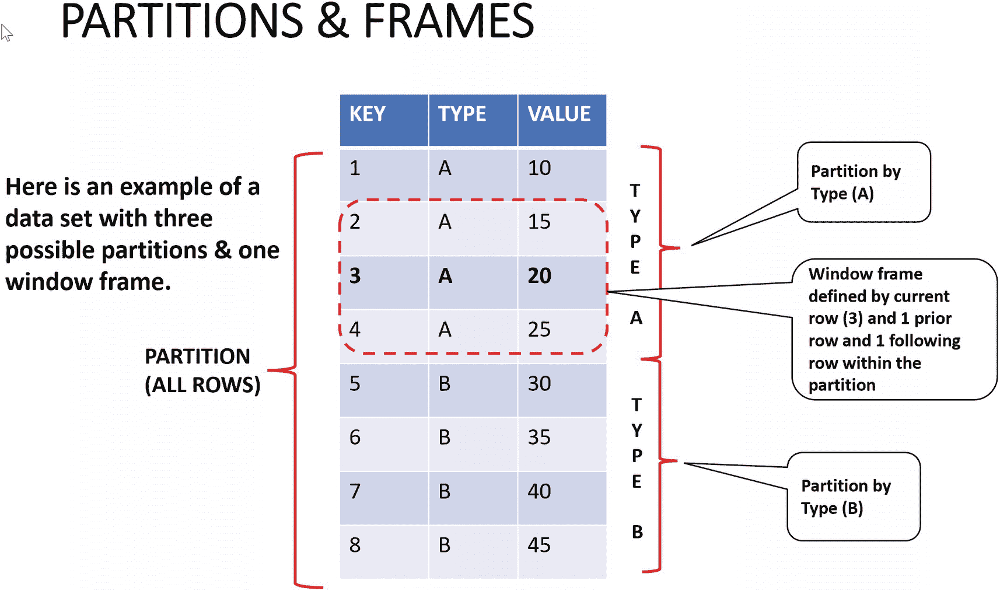
*一张表有 3 列：键、类型和值。行被划分为类型 A 和类型 B 两个分区。窗口框架由第 3 行的前一行和后一行定义。*
*图 1-1：一个包含三个分区和一个示例框架的简单数据集*

这里我们有一个由八行组成的简单数据集。此数据集中有三个示例分区。一个可以包含数据集的所有八行；另外两个包含由 `TYPE` 列标识的行。只有两种类型值，类型 `A` 和类型 `B`，因此每个分区将有四行。顺便提一下，你不能在一个 `OVER()` 子句中包含多个 `PARTITION BY` 子句。

每个 `OVER()` 子句只能定义一个分区，尽管你可以在使用分区的查询的 `SELECT` 子句中拥有多个列。你可以指定不同的列组合来定义分区。

这种架构的强大之处在于，我们可以通过使用 `ROWS` 或 `RANGE` 操作符在分区内创建更小的窗口框架。这些操作符允许你指定在处理当前行之前和/或之后将有多少行被窗口函数使用。

在我们前面的示例快照中，当前行是第 3 行，窗口框架被定义为仅包括相对于当前行的前一行、当前行和下一行。如果我们将 `SUM()` 函数应用于此窗口框架并求和所有值，我们得到结果 60（15 + 20 + 25）。（记住这是在仅包含四行的第一个分区内。）

如果继续处理下一行，即第 4 行，则 `SUM()` 函数只能使用第 3 行和第 4 行，结果为 45（20 + 25）。我忘了提到，如果我们从第 1 行开始，那么 `SUM()` 函数只能使用第 1 行和第 2 行，因为没有前一行。该函数返回值 25（10 + 15）。

我们如何控制这种类型的处理？我们需要做的就是在需要时向查询添加 `ROWS` 或 `RANGE` 规范。我们还可以包含一个 `ORDER BY` 子句来指定如何在分区内对行进行排序，以便按需应用窗口函数。例如，生成按月的滚动总计，当然从第 1 个月（一月）开始，到第 12 个月（十二月）结束。

听起来很容易，但我们需要了解当我们省略 `ORDER BY` 子句和/或 `PARTITION BY` 子句时，关于默认处理的几种情况。我们很快就会讨论这些。


## ROWS 子句定义

`ROWS` 子句作用于属于分区的物理行集。由于 `ROWS` 子句操作的是分区中的行，因此它被认为是一种物理操作。

`ORDER BY` 子句允许您指定分区内行的逻辑顺序，以便窗口函数可以对它们进行评估。例如，如果您有按年和月划分的销售数据，您会通过月份来设置分区内行的逻辑顺序，以便 `SUM()` 函数可以为每个月生成滚动的年度至今总计。您可以使用关键字 `ASC` 和 `DESC` 指定可选的升序和降序排序顺序。

`ROWS` 子句允许您在分区中定义窗口框架。`ROWS` 子句有几种变体，我们需要了解。

### 定义框架：从开始到当前行

以下是生成相同窗口框架的两种变体：

```
ROWS BETWEEN UNBOUNDED PRECEDING AND CURRENT ROW
ROWS UNBOUNDED PRECEDING
```

该子句告诉函数对当前行以及当前行之前的所有行（如果分区中有任何行）进行操作。图 1-2 中的简单示意图让一切一目了然。

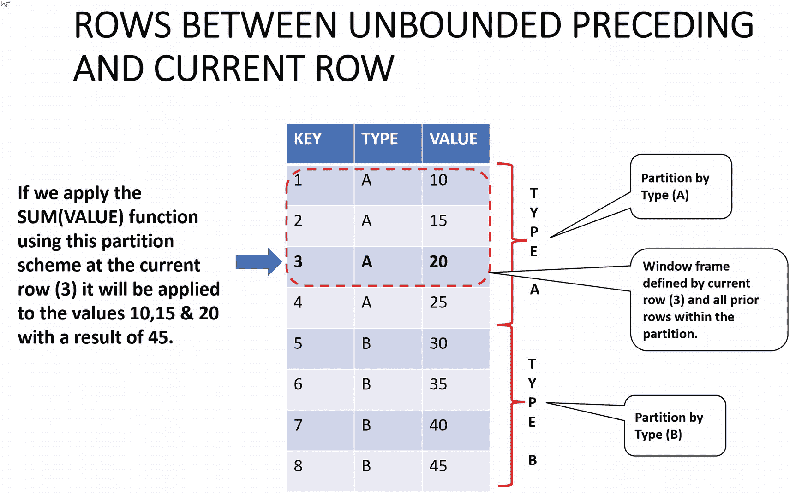
*图 1-2：包含当前行及所有前置行*

如果我们从第 1 行开始，由于该行之前没有前置行，`SUM()` 函数返回值 10。

接着处理第 2 行，`SUM()` 函数将包含唯一可用的前置行（第 1 行），因此结果是 25（10 + 15）。

接下来（如上图所示），当前待处理行是第 3 行。`SUM()` 函数将评估第 3 行以及第 1 和第 2 行以生成总计。结果是 45（10 + 15 + 20）。

最后，移动到第 4 行，该函数将在其计算中包含当前行及所有前置行，并返回 70（10 + 15 + 20 + 25）。至此，该分区的处理结束。

移动到分区 B，处理过程重复进行，并且仅包含来自分区 B 的行。分区 A 中的所有行都被忽略。

### 定义框架：从当前行到结束

我们的下一个 `ROWS` 子句将我们引向相反的方向：

```
ROWS BETWEEN CURRENT ROW AND UNBOUNDED FOLLOWING
ROWS UNBOUNDED FOLLOWING (无效，不支持)
```

第一个子句是合法的，但第二个不是。它不被支持。人们可能会想，既然有 `ROWS UNBOUNDED PRECEDING`，就应该有 `ROWS UNBOUNDED FOLLOWING`，但目前尚不支持。真让人费解！

如前所述，该子句的方向与我们刚才讨论的前一种情况相反。它将允许聚合或其他窗口函数包含当前行和所有后续行，直到分区中的所有行被耗尽。我们在图 1-3 中的下一个示意图展示了这是如何工作的。

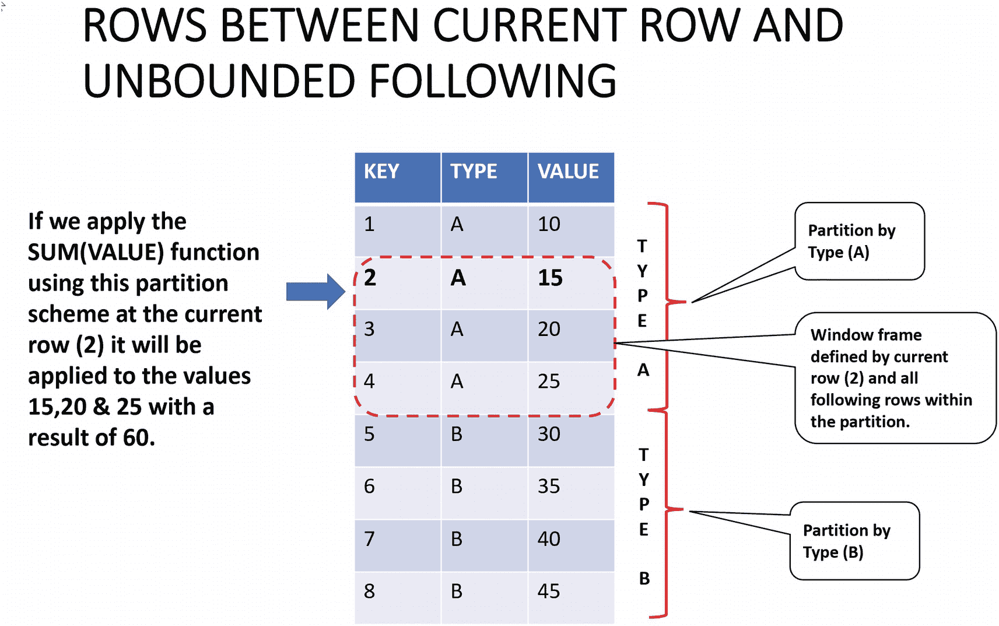
*图 1-3：处理当前行及所有后续行*

请记住，行在分区内是逐个处理的。

如果处理从第 1 行开始，那么所有四个值都被包括在内，计算出总和 70（10 + 15 + 20 + 25）。

接下来，如果当前处理的行是如上例中的第 2 行，则 `SUM()` 函数将包含第 2 至第 4 行来生成总值。它将产生结果 60（15 + 20 + 25）。

继续到第 3 行，它将只包含第 3 和第 4 行，并生成总值 45（20 + 25）。

一旦处理到达第 4 行，由于分区中没有更多可用行，仅使用当前行。`SUM()` 函数计算出总和 25。

当下一个分区的处理恢复时，整个场景会重复。

### 限制框架：固定数量的后续行

如果我们不想包含所有前置行或后续行，而只想包含之前或之后的几行怎么办？下一个窗口框架子句将实现限制后续行数量的效果：

```
ROWS BETWEEN CURRENT ROW AND n FOLLOWING
```

在 `OVER()` 子句中包含此子句，将允许我们控制相对于当前行要包含的行数，即从可用的分区行中将使用当前行之后的多少行。让我们检查另一个简单示例，我们希望在计算中仅包含当前行之后的一行。

请参考图 1-4。

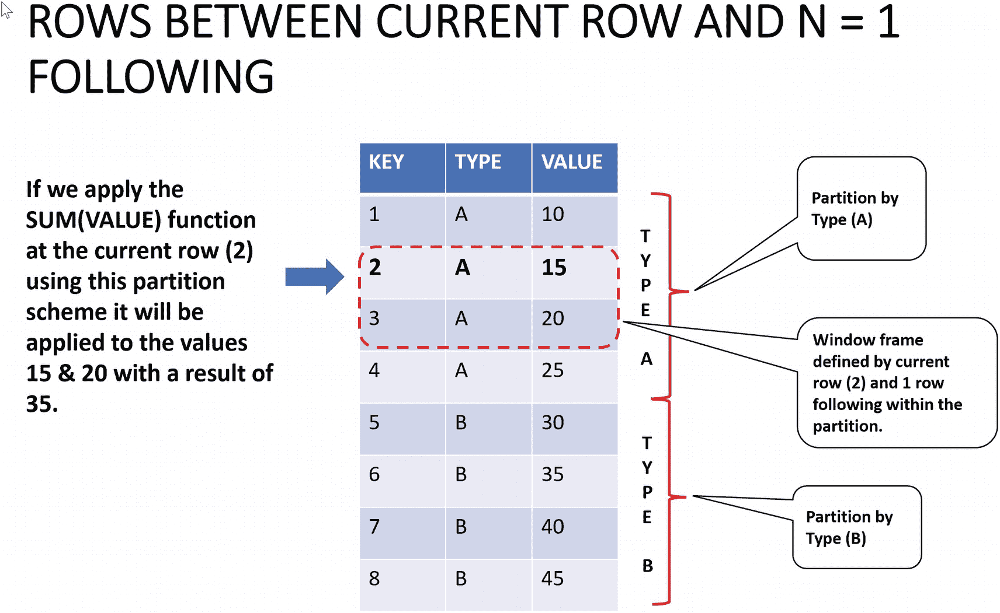
*图 1-4：当前行及后一行*

这是要在 `OVER()` 子句中包含的窗口框架子句：

```
ROWS BETWEEN CURRENT ROW AND 1 FOLLOWING
```

处理从第 1 行开始。我想现在您已经明白，只使用了第 1 和第 2 行，结果是 25（10 + 15）。

接下来，在上例中，第 2 行是当前行。如果只包括下一行，则 `SUM()` 函数将返回总和 35（15 + 20）。

移动到第 3 行（下一个当前行），`SUM()` 函数将返回 45 作为总和（20 + 25）。

最后，当处理到达分区中的最后一行时，则仅使用第 4 行，`SUM()` 函数返回 25。

当处理继续到下一个分区时，序列会重复，忽略前一个分区的值。

我们现在可以看到，这个过程如何在分区内创建窗口，这些窗口随着窗口函数逐行处理行而变化。请记住，行的处理顺序由 `OVER()` 子句中使用的 `ORDER BY` 子句控制。

### 限制框架：固定数量的前置行

下一个示例将我们引向相反的方向。我们希望在计算中包含当前行及前两行（如果有的话）。

窗口框架子句是：

```
ROWS BETWEEN n PRECEDING AND CURRENT ROW
```

字母 *n* 代表一个指定行数的无符号整数值。以下示例使用 2 作为行数。

请参考图 1-5。

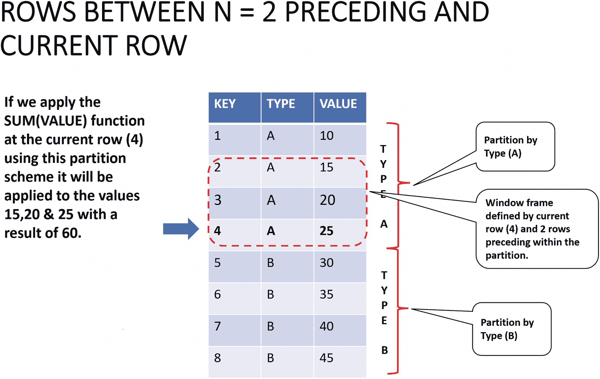
*图 1-5：包含前两行及当前行*

此场景的窗口框架是：

```
ROWS BETWEEN 2 PRECEDING AND CURRENT ROW
```

从第 1 行（当前行）开始，由于没有前置行，`SUM()` 函数将仅使用第 1 行。窗口函数返回的值是 10。

移动到第 2 行，只有一个前置行，所以 `SUM()` 函数返回 25（10 + 15）。

接下来，当前行是第 3 行，因此 `SUM()` 函数使用前两行并返回值 45（10 + 15 + 20）。

在上图中，当前处理的行是第 4 行，并包括了前两行；应用 `SUM()` 函数时将返回总值 60（15 + 20 + 25）。

由于第一个分区的所有行都已处理完毕，我们移动到分区 B，这次仅使用第 5 行，因为没有前置行。我们处于分区的开始。`SUM()` 函数返回总值 30。

处理在第 6 行继续，因此 `SUM()` 函数处理第 5 和第 6 行（当前行和前置行）。计算的总值是 65（30 + 35）。

接下来，当前行是第 7 行，因此窗口函数将包括第 5、6 和 7 行。`SUM()` 函数返回 105（30 + 35 + 40）。


最后，处理在分区的第 8 行结束。`SUM()`函数使用的行是第 6、7 和 8 行。`SUM()`函数返回 120（35 + 40 + 45）。没有更多的分区，因此处理结束。

如果我们想指定当前行前后的多行怎么办？下一个子句可以实现这一点。这是本章中的一个例子，但让我们再回顾一下并做一个更改：

```
ROWS BETWEEN n PRECEDING AND n FOLLOWING
```

在这种情况下，我们希望包括当前行、前一行和后面的两行。如果分区中有更多行，我们完全可以指定前面两行和后面三行，或者在分区的行数范围内的任何组合。

请参考图 1-6。

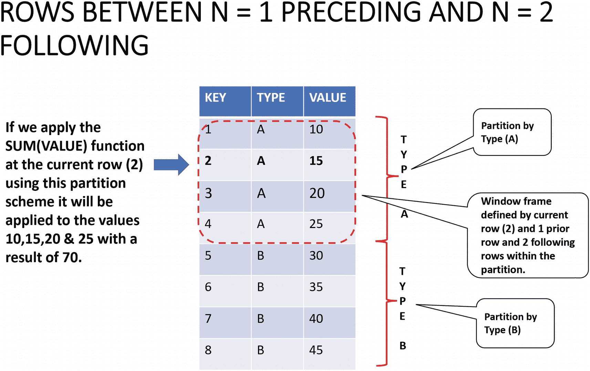

一个表格有 3 列，分别是 Key、type 和 value。行被分区为 type A 和 type B。窗口框架由第 1、2、3 和 4 行定义。`SUM`函数应用于第 2 行。

**图 1-6**

**在 n = 1 前一行和 n = 2 后两行之间的行**

以下是此场景的`ROWS`子句：

```
ROWS BETWEEN 1 PRECEDING AND 2 FOLLOWING
```

从分区的第 1 行开始，`SUM()`函数只能使用第 1、2 和 3 行，因为在第 1 行之前分区中没有行。`SUM()`函数计算的结果是 45（10 + 15 + 20）。

移动到下一行，分区的第 2 行，`SUM()`函数可以使用第 1、2（当前行）、3 和 4 行。`SUM()`函数计算的结果是 70（10 + 15 + 20 + 25）。

接下来，当前行是第 3 行。这个窗口框架使用第 2、3 和第 4 行，因此`SUM()`函数将计算总和为 60（15 + 20 + 25）。

最后，移动到第 4 行（分区的最后一行），`SUM()`函数只能使用第 3 和 4 行，因为分区中没有更多可用的后续行。结果是 45（20 + 25）。

在下一个分区中的处理以相同的方式继续，忽略前一个分区中的所有行。

我们已经检查了`ROWS`子句的大多数配置。接下来，我们看看由`RANGE`子句定义的窗口框架，它在逻辑级别上工作。它考虑的是值而不是物理行位置。重复的`ORDER BY`值会产生奇怪的行为。

### RANGE 框架定义

我们讨论了`ROWS`子句如何在物理级别上工作，它使用相对于其所属行位置的值。`RANGE`子句在逻辑级别上操作。它考虑的是列的值，而不是分区内的物理行位置。它显示出一种奇怪（在我看来）的行为。如果它在行排序列中遇到重复值，它会将它们全部相加，并在所有具有重复`ORDER BY`列的行中显示总计。任何像移动总计这样的值都会失效！（请原谅这个双关语。）

一个例子说明了这种情况。

假设你有一个包含五列的小表：Row、Year、Month、Amount 和 Running Total。该表加载了每年 12 行，比如 2010 年和 2011 年，再加上一个重复的月份行，总共 13 行。每一行代表一年中的某个月份，但对于三月份，为第一年插入了两行（这就是为什么我们有 13 行而不是 12 行）。换句话说，对于同一个月存在一个额外的金额值，导致月份编号重复。

`RANGE`子句将使用所有具有重复当前月份值的行来应用窗口函数（除了`RANGE`子句中指定的任何其他行）。

查看部分表格，表 1-2。

**表 1-2**

**部分 RANGE 运行总计**

| Row | Year | Month | Amount | Running Total |
| --- | --- | --- | --- | --- |
| 1 | 2010 | 1 | 100.00 | 100.00 |
| 2 | 2010 | 2 | 100.00 | 200.00 |
| 3 | 2010 | 3 | 200.00 | 600.00 |
| 4 | 2010 | 3 | 200.00 | 600.00 |

当我们到达第 3 行（两个重复月份中的第一个）时，窗口函数（本例中是`SUM()`）将包括所有之前的行，并将第 3 行和接下来的第 4 行的值相加，生成总计值 600.00。这会在第 3 行和第 4 行都显示。奇怪！人们可能期望第 3 行的运行总计值为 400.00。

我们再试一个。如果我们应用以下`RANGE`子句来计算运行总计

```
RANGE BETWEEN UNBOUNDED PRECEDING AND CURRENT ROW
```

或

```
RANGE UNBOUNDED PRECEDING
```

我们会得到有趣的结果。查看图 1-7 中的部分结果。

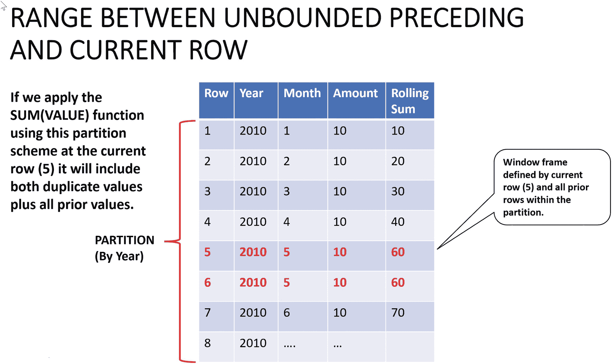

一个表格有 5 列，分别是 row、year、month、amount 和 rolling sum。第 5 行和第 6 行被突出显示。`SUM`函数按照第 5 行中的分区方案应用。

**图 1-7**

**按年份和月份的销售额**

直到我们到达月份值为 5（五月）的重复行之前，一切都按预期工作。此分区的窗口框架包括第 1-4 行和当前第 5 行，但我们在第 6 行也有一个重复的月份值，它计算出滚动总计值 60。该值在第 5 行和第 6 行都显示。聚合操作继续用于其余的月份（未显示）。

让我们以相反的方向处理行。这是我们的下一个`RANGE`子句：

```
RANGE BETWEEN CURRENT ROW AND UNBOUNDED FOLLOWING
RANGE UNBOUNDED FOLLOWING (将不起作用)
```

顺便说一下，第二个`RANGE`子句不受支持，但我把它包括进来，以便你知道它不会工作并会产生错误。请参考图 1-8。

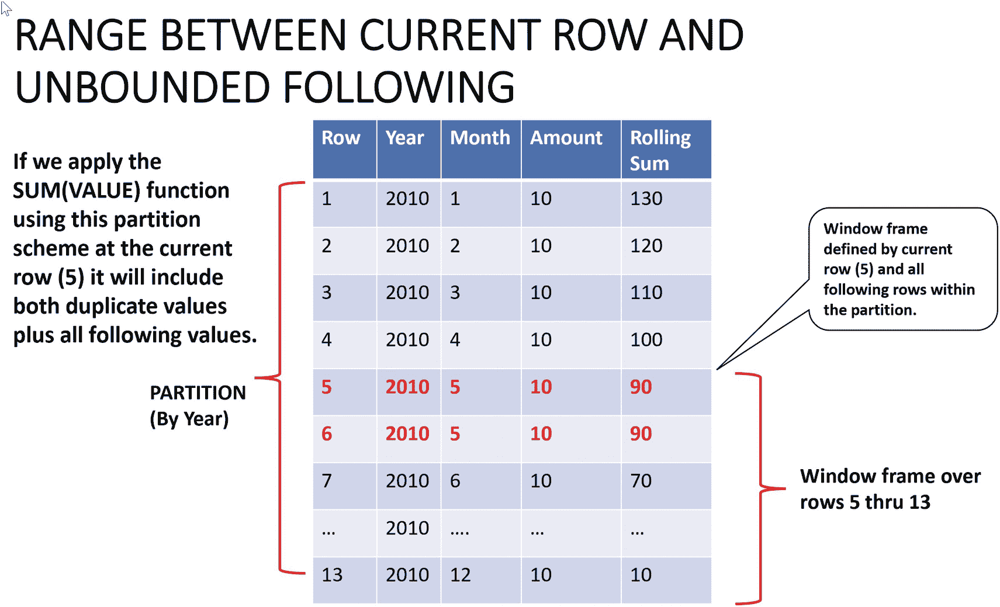

一个表格有 5 列，分别是 row、year、month、amount 和 rolling sum。第 5 行和第 6 行被突出显示。`SUM`函数按照第 5 行中的分区方案应用。

**图 1-8**

**RANGE 从当前行到无界后续**

第 5 行和第 6 行代表五月份的两个销售额。由于这些被认为是重复的，第 5 行显示滚动值 90，第 6 行也显示 90，而不是如果你不了解此窗口框架声明的行为时所期望的 80。

请注意，滚动总和值随着行处理从第 1 行开始向前推进而减少。我们从 130 开始，以 10 结束——反向的移动总计。

把它们放在一起，下面是一个概念视图，说明在使用以下`ROWS`子句时，随着行的处理，窗口框架是如何生成的：

```
ROWS BETWEEN 1 PRECEDING AND 1 FOLLOWING
```

这是本章中的一个例子。只考虑 type A 行的分区。请参考图 1-9。

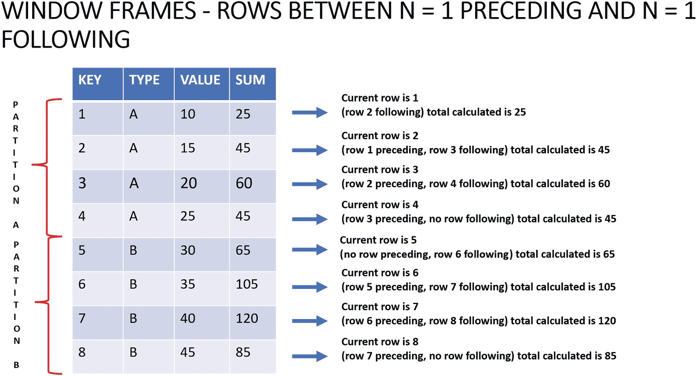

一个表格有 4 列，分别是 key、type、value 和 sum。行被分区为 type A 和 type B。

**图 1-9**

**窗口框架和已处理的行**

两个分区都显示出来，这样你就可以看到当它到达下一个分区时框架是如何重置的。

生成的窗口框架，随着逐行处理，显示了在分区内为窗口函数处理所包含的值。第一个窗口和最后一个窗口只有两行要处理，但第二个和第三个都有三行要处理，即前一行、当前行和下一行。相同的模式在第二个分区中重复。

让我们通过查看基于我们刚刚检查的图形的简单查询，来检验我们的知识。


## 示例 1

我们将从创建一个用于分析的小型测试临时表开始。

下面的代码清单展示了作为临时表创建的测试表 `CREATE TABLE` DDL（数据定义语言）语句，以及一条用于加载我们希望处理的所有行的 `INSERT` 语句。

请参考代码清单 1-3 中的部分列表。

```
CREATE TABLE #TestTable (
Row SMALLINT,
[Year]SMALLINT,
[Month]SMALLINT,
Amount DECIMAL(10,2)
);
INSERT INTO #TestTable VALUES
-- 2010
(1,2010,1,10),
(2,2010,2,10),
(3,2010,3,10),
(4,2010,4,10),
(5,2010,5,10),
(6,2010,5,10),
(7,2010,6,10),
(8,2010,7,10),
(9,2010,8,10),
(10,2010,9,10),
(11,2010,10,10),
(12,2010,11,10),
(13,2010,12,10),
-- 2011
(14,2011,1,10),
(15,2011,2,10),
(16,2011,3,10),
(17,2011,4,10),
(18,2011,5,10),
(19,2011,5,10),
(20,2011,6,10),
(21,2011,7,10),
(22,2011,7,10),
(23,2011,7,10),
(24,2011,8,10),
(25,2011,9,10),
(26,2011,10,10),
(27,2011,11,10),
(28,2011,12,10);
代码清单 1-3
创建测试表
```

`CREATE` 语句用于创建一个包含四列的简单表：一个 Row 列用于标识行号，一个 Year 列和一个 Month 列用于存储日历信息，以及一个 Amount 列用于存储数值。

Year 和 Month 这两个列名并不理想，因为它们是 SQL Server 中的保留字，但由于这是一个简单的测试表，我在命名规范上没有过于严格。此外，我在 `RANGE` 示例的图中也使用了它们，所以（至少对于我们的简单示例来说）保持了一致性。

我们希望加载两年的数据，并包含一些重复的月份，以便我们可以观察 `ROWS` 子句和 `RANGE` 子句在处理这些情况时的差异。

这是我们的第一个查询。让我们按年和月计算一些金额总计。我们使用一个 `RANGE` 子句，它考虑当前行和其后的所有行。

请参考代码清单 1-4 中的部分列表。

```
SELECT Row,[Year],[Month],Amount,
SUM(Amount) OVER (
PARTITION BY [Year]
ORDER BY [Month]
RANGE BETWEEN CURRENT ROW AND UNBOUNDED FOLLOWING
) AS RollingSalesTotal
FROM #TestTable
ORDER BY [Year],[Month] ASC
GO
代码清单 1-4
RANGE，当前行，和无界后续
```

请注意 Year 和 Month 列名周围的方括号。使用这些方括号将消除 SSMS 用于显示保留关键字的颜色。省略它们不会出错，但查询窗格中会使用颜色，这会让你意识到你正在使用保留关键字。别忘了删除临时表。

在图 1-10 中是部分结果，因此你可以看到某一年的完整值范围。

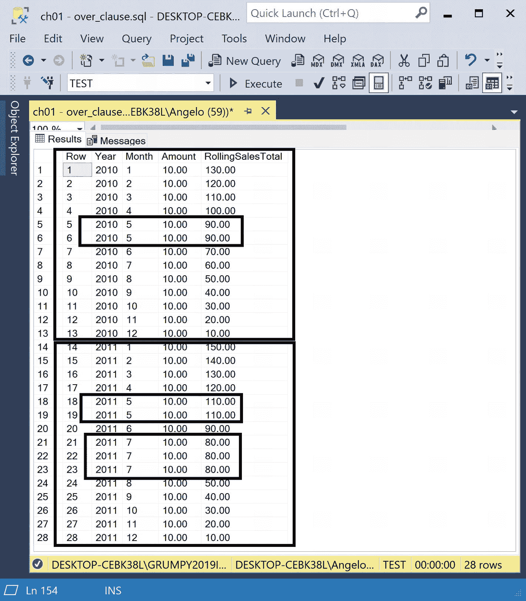

一张 c h 0 1 over 子句 s q l 窗口的屏幕截图。它呈现了某一年的完整值范围。结果以表格形式呈现，包含五列：Row、year、month、amount 和 rolling sales total。

图 1-10

在当前行和无界后续之间的 RANGE

看起来总计值在递减，这是合理的，因为我们从窗口函数处理的当前行开始向前计算。观察第 5 行和第 6 行的熟悉重复行为，当两个月份都是 5（五月）时。两行的值都是 90.00。

当我们到达十二月，在第 13 行时，分区中已没有更多行可供处理，因此我们只返回总和值 10.00。这是该分区中当前也是最后一行的值。

在第二个年份分区中，我们有两组重复行，一组是五月份，另一组是七月份。我们再次看到了 `RANGE` 子句特有的行为。

顺便说一下，以下窗口框架子句不被支持：

```
RANGE BETWEEN CURRENT ROW AND n FOLLOWING (不起作用)
RANGE BETWEEN n PRECEDING AND CURRENT ROW (不起作用)
RANGE BETWEEN n PRECEDING AND n FOLLOWING (不起作用)
```

这些不起作用，因为 `RANGE` 子句是一个逻辑操作，因此不允许指定窗口框架中要包含的行数。如果你尝试使用这些，你会得到这个“美妙”的错误消息：

RANGE is only supported with UNBOUNDED and CURRENT ROW window frame delimiters

相当清楚，你不觉得吗？

本章我们需要讨论的最后一项是，如果我们在 `OVER()` 子句中不包含窗口框架子句时的默认行为。行为会根据你是否包含 `ORDER BY` 和 `PARTITION BY` 子句而变化。

### ROWS 和 RANGE 默认行为

到现在为止，我们已经理解了 `OVER()` 子句的语法，并且知道它可能包含以下子句：

*   `PARTITION BY` 子句

*   `ORDER BY` 子句

*   `ROWS` 或 `RANGE` 子句

*   以上皆无（空）

前三个子句是可选的。你可以根据需要省略它们或包含一个或多个。在应用（或不应用）这些子句时，需要考虑两种场景。

#### 场景 1

窗口框架的默认行为取决于是否包含了 `ORDER BY` 子句。需要考虑两种配置：

*   如果省略了 `ORDER BY` 子句和 `PARTITION BY` 子句，并且我们没有包含窗口框架子句
*   如果省略了 `ORDER BY` 子句但包含了 `PARTITION BY` 子句，并且我们没有包含窗口框架子句

这两种情况下的默认窗口框架行为是

```
ROWS BETWEEN UNBOUNDED PRECEDING AND UNBOUNDED FOLLOWING
```

#### 场景 2

另一方面，如果我们包含了 `ORDER BY` 子句，以下两种情况也具有默认的窗口框架行为：

*   如果包含了 `ORDER BY` 子句但省略了 `PARTITION BY` 子句，并且我们没有包含窗口框架子句
*   如果包含了 `ORDER BY` 子句并且也包含了 `PARTITION BY` 子句，并且我们没有包含窗口框架子句

这两种情况下的默认窗口框架行为是

```
RANGE BETWEEN UNBOUNDED PRECEDING AND CURRENT ROW
```

当你开始开发使用窗口函数的查询时，请务必牢记这些默认行为。这非常重要；否则，你将得到一些意外且可能错误的结果。你的用户会不高兴的（你的简历更新了吗？）。

表 1-3 或许能帮你记住这些默认行为。

表 1-3

窗口框架默认行为

| ORDER BY | PARTITION BY | 默认框架 |
| --- | --- | --- |
| 否 | 否 | ROWS BETWEEN UNBOUNDED PRECEDING AND UNBOUNDED FOLLOWING |
| 否 | 是 | ROWS BETWEEN UNBOUNDED PRECEDING AND UNBOUNDED FOLLOWING |
| 是 | 否 | RANGE BETWEEN UNBOUNDED PRECEDING AND CURRENT ROW |
| 是 | 是 | RANGE BETWEEN UNBOUNDED PRECEDING AND CURRENT ROW |

掌握了这些新知识后，让我们通过一些更简单的例子来看看 `ROWS` 和 `RANGE` 子句。记住，你可以通过包含所需的 `ROWS` 或 `RANGE` 子句来覆盖默认行为。

### ROWS 和 RANGE 窗口框架示例

让我们从 `ROWS` 子句开始。这个子句你将最常使用。在我看来，`RANGE` 子句有点不可靠，应该避免使用。


### 数据集

在创建一些查询之前，我们需要先创建一个小表并加载数据，以便进行练习。我们创建的表名为 `OverExample`（补充一句，这名字挺聪明的）。它由三列组成：`OrderYear`、`OrderMonth` 和 `SalesAmount`。虽然我们在本章开头创建了这个表，但为了方便参考，我在这里再列一次。

请参考代码清单 1-5。

```sql
CREATE TABLE OverExample(
OrderYear   SMALLINT,
OrderMonth  SMALLINT,
SalesAmount DECIMAL(10,2)
);
INSERT INTO OverExample VALUES
(2010,1,10000.00),
(2010,2,10000.00),
(2010,2,10000.00),
--missing rows
(2010,8,10000.00),
(2010,8,10000.00),
(2010,9,10000.00),
(2010,10,10000.00),
(2010,11,10000.00),
(2010,12,10000.00),
-- 2011
(2011,1,10000.00),
(2011,2,10000.00),
(2011,2,10000.00),
--missing rows
(2011,10,10000.00),
(2011,11,10000.00),
(2011,12,10000.00);
GO
```

代码清单 1-5 练习表 `OverExample`

`INSERT` 语句加载了两年的数据，这样我们就有足够的行来测试带有窗口函数和 `OVER()` 子句的查询。`SUM()` 聚合函数将用于生成一些滚动总计计算。

请参考代码清单 1-6。

```sql
SELECT OrderYear,OrderMonth,SalesAmount,
SUM(SalesAmount) OVER (
) AS NPBNOB,
SUM(SalesAmount) OVER (
PARTITION BY OrderYear
) AS PBNOB,
SUM(SalesAmount) OVER (
PARTITION BY OrderYear
ORDER BY OrderMonth
ROWS BETWEEN UNBOUNDED PRECEDING AND UNBOUNDED FOLLOWING
) AS PBOBUPUF
FROM OverExample;
GO
```

代码清单 1-6 场景 1

`SUM()` 函数被使用了三次，每次的 `ORDER BY`/`PARTITION BY` 配置不同。我还使用了旨在指示 `OVER()` 子句结构的列名，这些名称表明了是否包含了 `ORDER BY`、`PARTITION BY` 以及 `ROWS`/`RANGE` 子句。我这样做是为了让你在检查结果时，能快速回忆起使用了哪些子句。我知道，这些名字有点怪，但你可以轻松记住我们正在使用的帧子句。

第一个 `SUM()` 函数的 `OVER()` 子句是空的（名称 `NPBNOB` = 无 `PARTITION BY`, 无 `ORDER BY`）。回想一下，这种组合的默认窗口帧行为是：

```sql
ROWS BETWEEN UNBOUNDED PRECEDING AND UNBOUNDED FOLLOWING
```

第二个 `SUM()` 函数的 `OVER()` 子句包含了 `PARTITION BY` 但没有 `ORDER BY`，所以默认的窗口帧行为也是：

```sql
ROWS BETWEEN UNBOUNDED PRECEDING AND UNBOUNDED FOLLOWING
```

列名为 `PBNOB`（有 `PARTITION BY`, 无 `ORDER BY`）。这次创建了两个分区，数据集中的每一年对应一个分区。

最后但同样重要的是，第三个 `SUM()` 函数使用的 `OVER()` 子句同时包含了 `PARTITION BY` 和 `ORDER BY` 子句。它还使用了窗口帧 `ROWS` 子句。列名是 `PBOBUPUF`（`PARTITION BY`，`ORDER BY`，`UNBOUNDED PRECEDING UNBOUNDED FOLLOWING`）。

对于最后这种列配置，默认的帧行为是：

```sql
RANGE BETWEEN UNBOUNDED PRECEDING AND CURRENT ROW
```

看起来我们可以通过替换 `RANGE` 子句并包含 `ROWS` 子句来覆盖这种默认行为。这完全可以做到！

让我们看看执行这个查询后的结果是什么样子。请参考图 1-11。

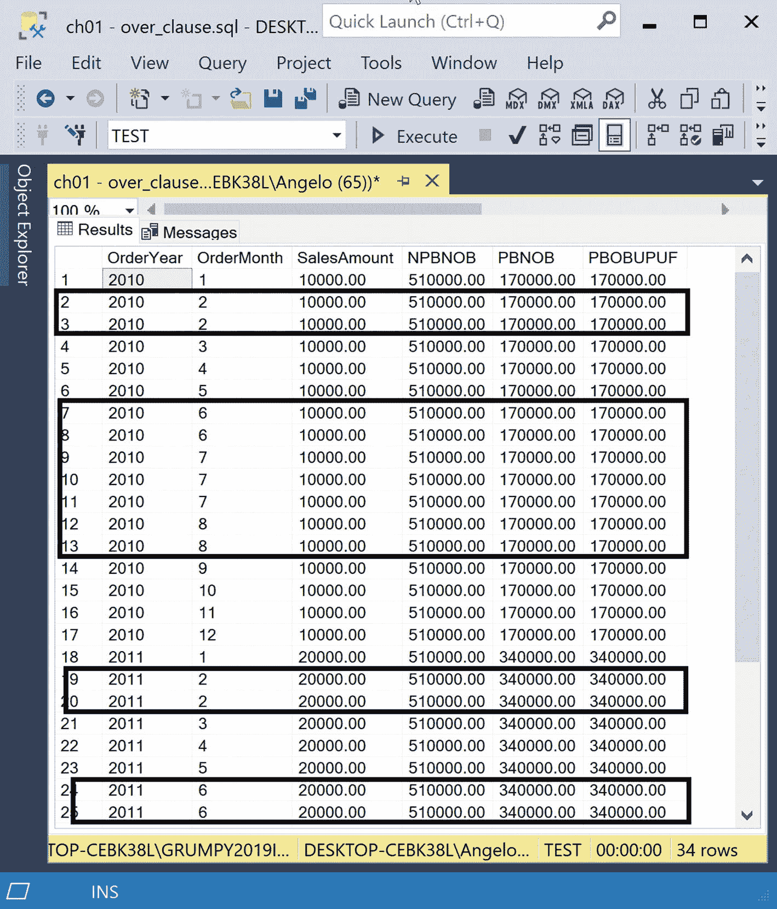

一个关于 c h 0 1 over clause s q l 窗口的截图。结果以表格形式呈现，包含 6 列，分别是订单年份、订单月份、销售额、N P B N O B、P B N O B 和 P B O B U P U F。

图 1-11 场景 1 的结果

结果很有意思。第一个 `SUM()`/`OVER()` 子句组合只是简单地显示了表中所有行的总计，正如默认窗口帧行为所强制规定的那样。

第二和第三个 `SUM()`/`OVER()` 子句组合将数据集按年份分区，因此每年的总计显示在每一行中。它们看起来是相同的。这两种组合的窗口帧行为是相同的：

```sql
ROWS BETWEEN UNBOUNDED PRECEDING AND UNBOUNDED FOLLOWING
```

这是因为第二种组合触发了默认行为，而第三种组合我们覆盖了 `RANGE` 行为，并包含了 `ROWS` 子句。这种行为是在每个年份分区内强制执行的。让我们再试一个例子。


### 示例 2

这次我们来查看一些包含默认窗口框架行为与声明的 `RANGE` 行为的 `SUM()/OVER()` 子句组合。（请记住我们之前讨论过的默认窗口框架行为。）

让我们看看这些组合产生的结果。请参考清单 1-7。

```sql
SELECT OrderYear,OrderMonth,SalesAmount,
SUM(SalesAmount) OVER (
ORDER BY OrderYear,OrderMonth
) AS NPBOB,
-- same as PBOBRangeUPCR
SUM(SalesAmount) OVER (
PARTITION BY OrderYear
ORDER BY OrderMonth
) AS PBOB,
SUM(SalesAmount) OVER (
ORDER BY OrderYear,OrderMonth
RANGE BETWEEN UNBOUNDED PRECEDING AND CURRENT ROW
) AS NPBOBRangeUPCR,
-- same as PBOB
SUM(SalesAmount) OVER (
PARTITION BY OrderYear
ORDER BY OrderMonth
RANGE BETWEEN UNBOUNDED PRECEDING AND CURRENT ROW
) AS PBOBRangeUPCR
FROM OverExample;
GO
```
清单 1-7
场景 2 – 多种默认窗口框架与 RANGE 行为

这一次，我们在第一个 `SUM()/OVER()` 组合中添加了一个 `ORDER BY` 子句，在第二个 `SUM()/OVER()` 组合中添加了一个 `PARTITION BY` 和一个 `ORDER BY` 子句。第三个 `SUM()/OVER()` 组合包含一个 `ORDER BY` 子句，没有 `PARTITION BY` 子句，但我们包含了一个 `RANGE` 窗口框架子句。第四个 `SUM()/OVER()` 组合同时包含了 `PARTITION BY` 和 `ORDER BY` 子句，以及一个 `RANGE` 窗口框架子句。结果应该很有趣。

请参考图 1-12。

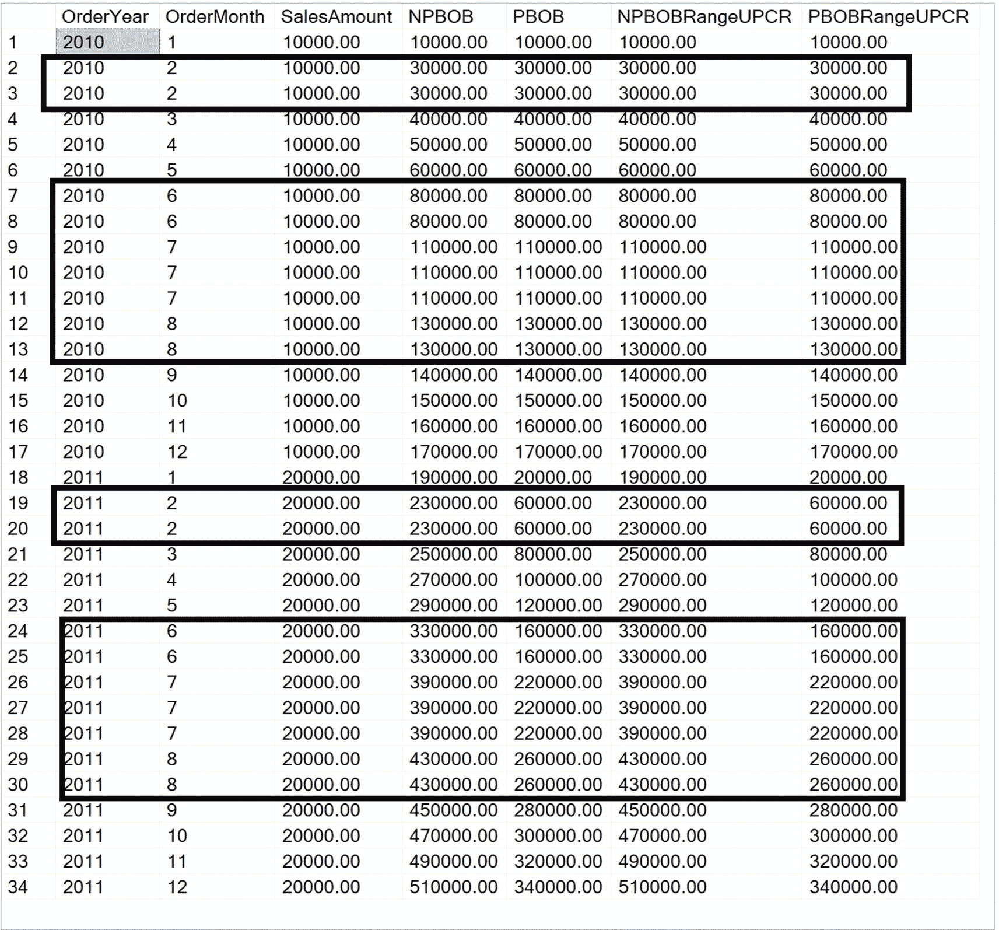

一个表格有 6 列，分别是订单年份、订单月份、销售金额、N P B O B、P B O B、N P B O B range U P C R 和 P B O B R range U P C R。一些行在方框中突出显示。

图 1-12
更多默认行为与 RANGE 行为对比

乍一看，所有结果似乎都一样！对于第一年的分区来说确实如此，但一旦我们进入第二年的分区，第一列和第三列的值持续递增，而第二列和第四列的值由于新的年份分区而被重置。

重复月份条目的值已用方框框出。列 `NPBOB` 没有 `PARTITION BY` 子句，但它有 `ORDER BY` 子句，因此由 `RANGE BETWEEN UNBOUNDED PRECEDING and CURRENT ROW` 定义的默认窗口框架行为生效。再次注意，月份编号重复的行导致总计相同。2010 年的 6 月（June）总计为 8000.00，7 月（July）和 8 月（August）也是如此。

第二个 `SUM()/OVER()` 组合确实有 `PARTITION BY` 和 `ORDER BY` 子句，因此默认窗口框架行为是 `RANGE BETWEEN UNBOUNDED PRECEDING AND CURRENT ROW`。`PARTITION BY` 子句为每年定义了分区，默认框架行为导致窗口函数通过考虑当前行和先前行的值来计算，直到遇到重复的月份条目。如果这是一个累计总和，我们期望是 7000.00 和 8000.00，但这些行的两个条目都是较高的值：8000.00。

查询中的第三个 `SUM()/OVER()` 组合包含一个 `ORDER BY` 子句，但没有 `PARTITION BY` 子句。包含了一个窗口框架规范：`RANGE BETWEEN UNBOUNDED PRECEDING AND CURRENT ROW`。结果与之前的组合相同，但一旦我们进入 2011 年的分区，累计总和会持续进行，因为没有包含 `PARTITION BY` 子句。再次注意遇到相同月份行时的行为。

最后但同样重要的是，第四个 `SUM()/OVER()` 组合具有 `PARTITION BY`、`ORDER BY` 和 `RANGE` 窗口框架子句。此组合的行为与 `PBOB` 列的组合完全相同。

我们现在可以看到，在各种 `ORDER BY` 和 `PARTITION BY` 子句组合下，默认行为是如何生效的。当包含窗口框架规范时，其行为与其他列中的默认行为完全相同。在开始创建基于窗口函数的查询时，请记住这些。

### 示例 3

下一个示例比较 `ROWS` 窗口框架规范与 `RANGE` 窗口框架规范。

请参考清单 1-8。

```sql
SELECT OrderYear,OrderMonth,SalesAmount,
SUM(SalesAmount) OVER (
PARTITION BY OrderYear
ORDER BY OrderMonth
ROWS BETWEEN UNBOUNDED PRECEDING AND CURRENT ROW
) AS POBRowsUPCR,
SUM(SalesAmount) OVER (
PARTITION BY OrderYear
ORDER BY OrderMonth
RANGE BETWEEN UNBOUNDED PRECEDING AND CURRENT ROW
) AS PBOBRangeUPCR
FROM OverExample;
GO
```
清单 1-8
ROWS 与 RANGE 比较

两种情况下的 `SUM()` 函数具有相同的 `PARTITION BY` 和 `ORDER BY` 子句。第一个有 `ROWS BETWEEN UNBOUNDED PRECEDING AND CURRENT ROW` 子句，而第二个组合有 `RANGE BETWEEN UNBOUNDED PRECEDING AND CURRENT ROW` 子句。

你认为结果会怎样？

请参考图 1-13。

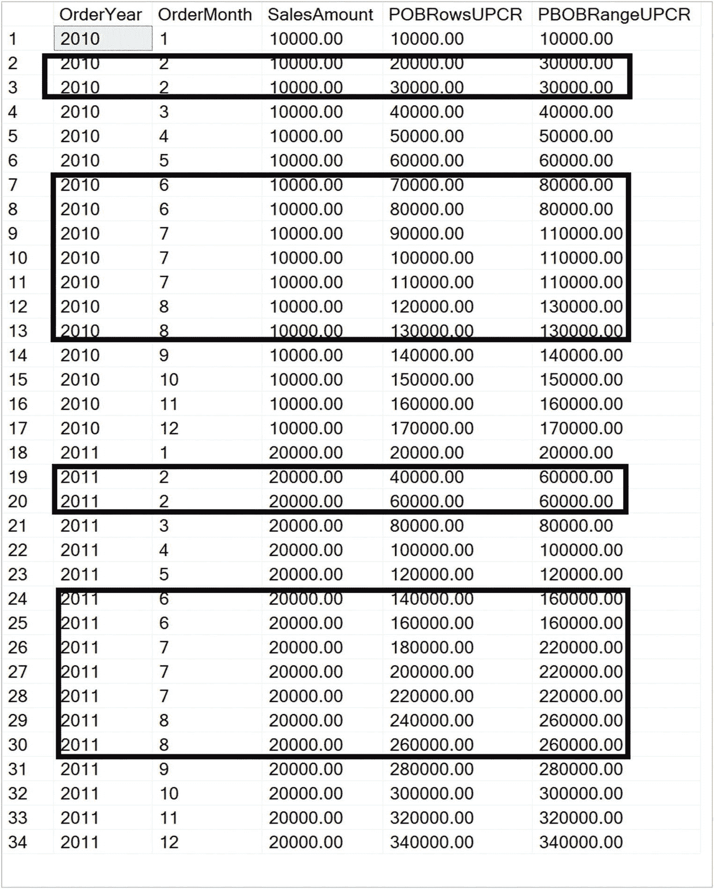

一个表格有 5 列，分别是订单年份、订单月份、销售金额、P O B R rows U P C R 和 P B O B R range U P C R。一些行在方框中突出显示。

图 1-13
ROWS 与 RANGE，UNBOUNDED PRECEDING AND CURRENT ROW

结果几乎相同，但使用 `RANGE` 窗口框架规范的 `SUM()/OVER()` 组合将为任何具有重复 `ORDER BY` 值的行生成相同的值。正如我们之前讨论的，这个子句在逻辑级别工作（相对于 `ROWS` 的物理级别）；它会将所有重复值相加，并在每个重复行中发布相同的结果。


### 示例 4

在下一个例子中，我们将研究两个简单的查询。唯一的区别是，第一个查询的 `ORDER BY` 子句中明确指定了列名，而第二个查询则在 `ORDER BY` 子句中使用了一个简单的 `SELECT` 查询来代替列名。

我们为什么要这样做？因为使用简单查询可以消除估计查询计划中可能存在的、开销较大的排序步骤。当你只有一个大型分区时，就可以使用这种技术。你需要使用的查询是一个标量查询，这意味着它只会返回一个值，因此无法处理多个分区。

让我们先来看看带有列名的查询。

请参考代码清单 1-9a。

```sql
WITH YearQtrSales (
SalesYear,
SalesQtr,
SalesMonth,
SalesTotal
)
AS
(
SELECT
SalesYear,
SalesQtr,
SalesMonth,
SalesTotal
FROM dbo.TestSales
)
SELECT
SalesYear,
SalesQtr,
SalesMonth,
SalesTotal,
SUM(SalesTotal) OVER(
ORDER BY SalesYear,SalesQtr,SalesMonth
ROWS BETWEEN UNBOUNDED PRECEDING AND CURRENT ROW
) AS RollMonthlySales1
FROM YearQtrSales
ORDER BY
SalesYear,
SalesQtr,
SalesMonth
GO
Listing 1-9a
ORDER BY Without Subquery
```

如你所见，我们没有 `PARTITION BY` 子句，并且 `ORDER BY` 子句按三个列进行排序。这种配置将为我们提供按月累加的两年总计。换句话说，当我们在结果集中进入第二年时，总计不会重置，而是按月持续递增，直到数据集结束。

第二个查询用一条简单的 `SELECT` 语句 `SELECT (1)` 替换了 `ORDER BY` 子句中的列名。

请参考代码清单 1-9b。

```sql
WITH YearQtrSales (
SalesYear,
SalesQtr,
SalesMonth,
SalesTotal
)
AS
(
SELECT
SalesYear,
SalesQtr,
SalesMonth,
SalesTotal
FROM dbo.TestSales
)
SELECT
SalesYear,
SalesQtr,
SalesMonth,
SalesTotal,
SUM(SalesTotal) OVER(
ORDER BY (SELECT (1))
ROWS BETWEEN UNBOUNDED PRECEDING AND CURRENT ROW
) AS RollMonthlySales2
FROM YearQtrSales
ORDER BY
SalesYear,
SalesQtr,
SalesMonth
GO
Listing 1-9b
ORDER BY with Subquery
```

这个查询与上一个相同。让我们比较一下执行计划。

请参考图 1-14。

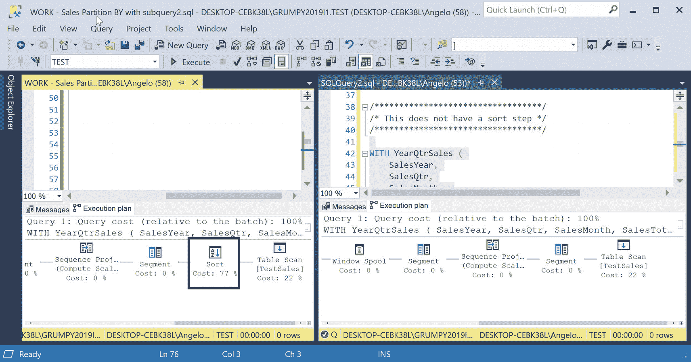

一个包含“Work Sales Partition BY with subquery 2 s q l”窗口的屏幕截图。整个窗口分为“Work Sale Partition”子窗口和“s q l subquery 2”子窗口。每个子窗口下方都有一条消息。

图 1-14
比较执行计划

从左侧的查询计划可以看出，我们有一个开销相当大的排序任务，成本为 77%。右侧的查询计划没有这个任务，因此在性能上应该更快。让我们并排查看两个查询的结果。

请参考图 1-15。

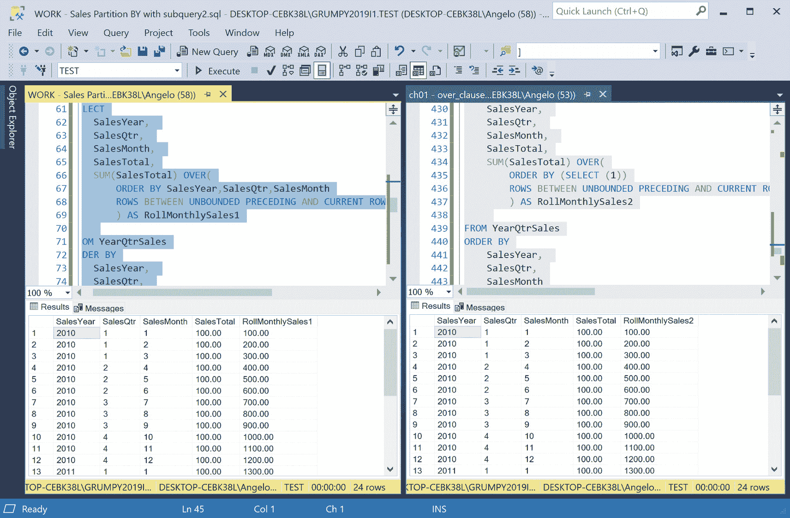

一个包含“Work Sales Partition BY with subquery 2 s q l”窗口的屏幕截图。整个窗口分为“Work Sale Partition”子窗口和“s q l subquery 2”子窗口。这些子窗口并排比较了两个查询的结果。

图 1-15
比较结果

结果匹配。注意，即使我们开始了一个新的年份，滚动总计仍在持续递增。当你只处理一个包含大量行的单一分区时，这种使用子查询的配置通常是很好的选择。在一个包含数十万行或更多行的查询结果集上消除排序步骤，可以提高性能。

### 示例 5

我们的最后一个例子很简单，它展示了 SQL Server 2022 提供的一项新功能。截至本文撰写时，它以评估版形式提供。它允许你在一组括号内指定 `PARTITION BY`、`ORDER BY` 和 `RANGE/ROWS` 子句，并为其命名。这被称为命名窗口子句。

一个简单的例子请参考代码清单 1-10。

```sql
SELECT OrderYear
,OrderMonth
,SUM(SalesAmount) OVER SalesWindow AS TotalSales
FROM dbo.OverExample
WINDOW SalesWindow AS (
PARTITION BY OrderYear
ORDER BY OrderMonth
RANGE BETWEEN UNBOUNDED PRECEDING AND CURRENT ROW
)
GO
Listing 1-10
Named Windows
```

注意命名窗口代码是如何出现在查询末尾的。关键字 `WINDOW` 后面是您希望赋予该窗口的名称，然后可以在括号内添加我们本章刚刚讨论过的 `PARTITION BY`、`ORDER BY` 和 `RANGE/ROWS` 子句。

`OVER()` 子句仍然出现在窗口函数之后，但它只是引用了名称。这有增值吗？我不确定，但我个人更倾向于类似这样的写法：

```sql
SUM(SalesAmount) OVER WINDOW (
PARTITION BY OrderYear
ORDER BY OrderMonth
RANGE BETWEEN UNBOUNDED PRECEDING AND CURRENT ROW
) AS ...
```

至少这清楚地表明我们正在为分区创建一个窗口。但这是我的个人看法。

另一方面，如果 `OVER()` 子句需要在多个列中使用，那么刚才讨论的 SQL Server 2022 版本就更有意义了。是的，我认为这样更好。

让我们看看这最后一个查询的结果。

请参考图 1-16。

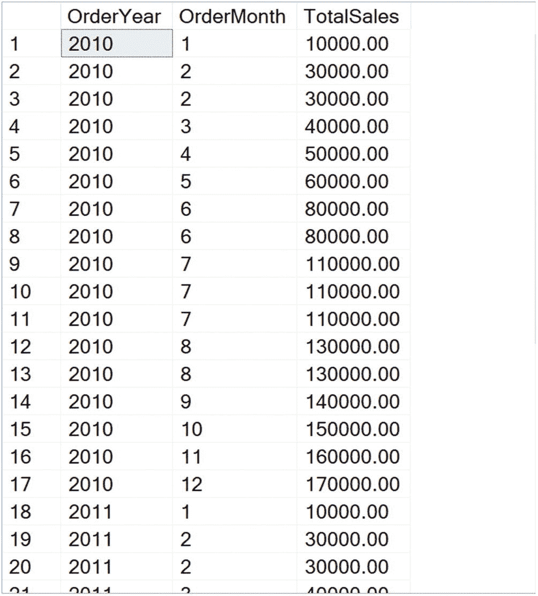

一个包含 3 列的表格，分别是订单年份、订单月份和总销售额。订单年份是 2010 年。

图 1-16
SQL Server 2022 的增强功能：命名窗口 (Named WINDOW)

这里没有意外。工作方式与之前的例子相同。当存在重复的 `ORDER BY` 列值时，行为也相同。请访问 Microsoft SQL Server 网站下载最新版本。务必查看此版本的新功能。

### 总结

我们已经介绍了本书中将使用的窗口函数。更重要的是，我们讨论了 `OVER()` 子句，以及如何设置分区和窗口帧来控制窗口函数如何应用于数据集、分区和窗口帧。

我们讨论了窗口帧的默认行为如何取决于 `OVER()` 子句内 `PARTITION BY` 和 `ORDER BY` 子句的组合。

我们还看了一些基本的图表，来说明窗口帧如何影响窗口函数处理流程，以及在什么条件下会使用默认窗口帧。

接下来，我们简要讨论了如何在 `PARTITION BY` 和 `OVER()` 子句中使用子查询。这很有价值，因为使用子查询可以消除排序步骤，并可能使整个查询执行得更快。通过查看使用子查询和未使用子查询的查询的执行计划，我们演示了这一点。还测试了一些技巧，以了解如何检索多个值但将它们打包为单个值，这使用了我们将在后续章节中讨论的 `STRING_AGG()` 函数。

最后，我们看了一些简单的例子来应用所学知识，并简要讨论了 SQL Server 2022 的一个新功能，称为命名窗口。

如果您不熟悉 `RANK()` 或其他窗口函数的工作原理，现在是查阅附录 A 的好时机，该附录简要描述了这些函数的作用。在本书的剩余章节中，这些函数将被多次使用。


